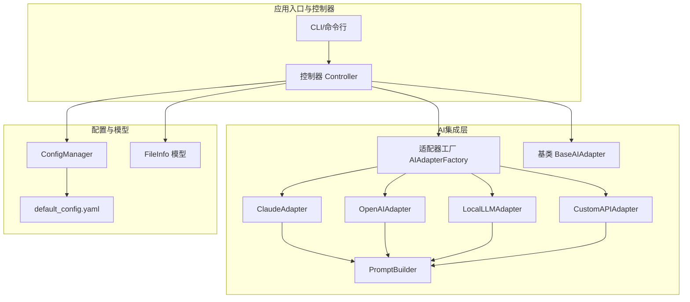
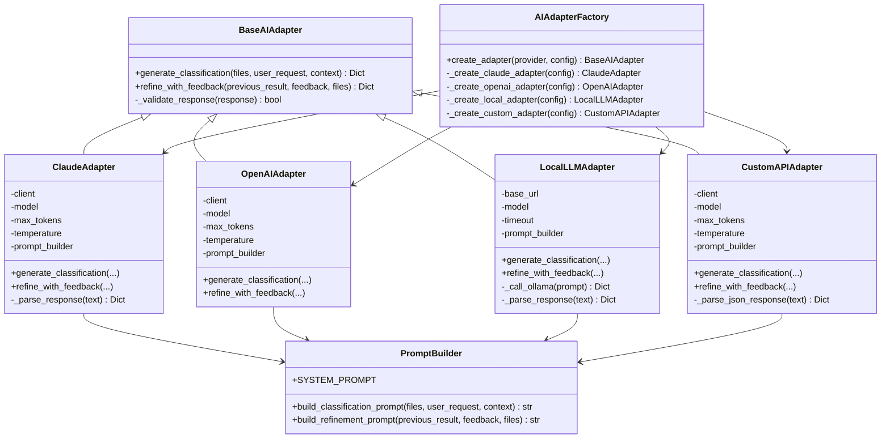
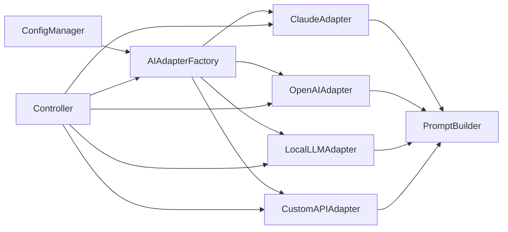
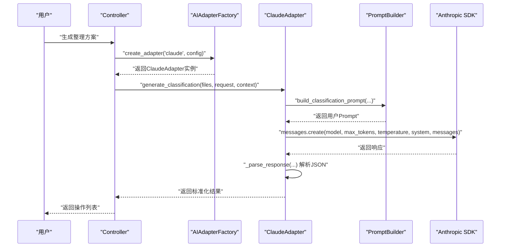

# AI提供商集成

<cite>
**本文引用的文件**
- [src/ai/__init__.py](file://src/ai/__init__.py)
- [src/ai/base_adapter.py](file://src/ai/base_adapter.py)
- [src/ai/adapter_factory.py](file://src/ai/adapter_factory.py)
- [src/ai/claude_adapter.py](file://src/ai/claude_adapter.py)
- [src/ai/openai_adapter.py](file://src/ai/openai_adapter.py)
- [src/ai/local_adapter.py](file://src/ai/local_adapter.py)
- [src/ai/custom_adapter.py](file://src/ai/custom_adapter.py)
- [src/ai/prompt_builder.py](file://src/ai/prompt_builder.py)
- [src/utils/config.py](file://src/utils/config.py)
- [src/core/controller.py](file://src/core/controller.py)
- [config/default_config.yaml](file://config/default_config.yaml)
- [examples/basic_usage.py](file://examples/basic_usage.py)
- [examples/custom_api_example.py](file://examples/custom_api_example.py)
- [docs/CUSTOM_API.md](file://docs/CUSTOM_API.md)
- [docs/CONFIGURATION.md](file://docs/CONFIGURATION.md)
- [README.md](file://README.md)
- [tests/test_custom_adapter.py](file://tests/test_custom_adapter.py)
- [src/models/file_info.py](file://src/models/file_info.py)
</cite>

## 目录
1. [简介](#简介)
2. [项目结构](#项目结构)
3. [核心组件](#核心组件)
4. [架构总览](#架构总览)
5. [详细组件分析](#详细组件分析)
6. [依赖关系分析](#依赖关系分析)
7. [性能考量](#性能考量)
8. [故障排查指南](#故障排查指南)
9. [结论](#结论)
10. [附录](#附录)

## 简介
本文件系统性梳理并对比四种主要AI提供商的集成实现：Claude适配器（Anthropic）、OpenAI适配器、本地模型适配器（Local LLM）、自定义API适配器（Custom API）。围绕API调用封装、认证机制、参数配置、错误处理策略展开，并结合项目中的Prompt构建、配置管理与控制器层，给出跨提供商的兼容性设计与迁移策略，同时提供配置示例、环境变量设置与API密钥管理指南。

## 项目结构
项目采用分层与模块化组织，AI适配器层位于src/ai，统一抽象于BaseAIAdapter；通过AIAdapterFactory按配置动态创建具体适配器；配置由ConfigManager统一加载与合并环境变量；控制器层负责编排扫描、分类、执行与安全控制。

图表来源
- [src/core/controller.py](file://src/core/controller.py#L15-L82)
- [src/ai/adapter_factory.py](file://src/ai/adapter_factory.py#L11-L37)
- [src/ai/base_adapter.py](file://src/ai/base_adapter.py#L9-L30)
- [src/ai/prompt_builder.py](file://src/ai/prompt_builder.py#L7-L37)
- [src/utils/config.py](file://src/utils/config.py#L10-L18)
- [config/default_config.yaml](file://config/default_config.yaml#L1-L25)

章节来源
- [src/ai/__init__.py](file://src/ai/__init__.py#L1-L20)
- [src/ai/adapter_factory.py](file://src/ai/adapter_factory.py#L11-L37)
- [src/utils/config.py](file://src/utils/config.py#L10-L18)
- [config/default_config.yaml](file://config/default_config.yaml#L1-L25)

## 核心组件
- BaseAIAdapter：定义统一接口generate_classification与refine_with_feedback，并提供响应格式校验。
- AIAdapterFactory：根据provider字符串创建具体适配器实例，负责参数校验与默认值注入。
- PromptBuilder：构建系统提示与用户提示，规范输出格式与约束。
- ConfigManager：加载YAML配置，合并环境变量（.env），提供AI提供商配置读取。
- Controller：编排扫描、分类、Agent模式与传统模式、执行与安全控制。

章节来源
- [src/ai/base_adapter.py](file://src/ai/base_adapter.py#L9-L70)
- [src/ai/adapter_factory.py](file://src/ai/adapter_factory.py#L11-L98)
- [src/ai/prompt_builder.py](file://src/ai/prompt_builder.py#L7-L172)
- [src/utils/config.py](file://src/utils/config.py#L10-L116)
- [src/core/controller.py](file://src/core/controller.py#L15-L82)

## 架构总览
四种适配器均继承BaseAIAdapter，遵循统一的输入输出契约；通过PromptBuilder构造标准化提示；工厂根据配置创建实例；ConfigManager负责环境变量注入；Controller在Agent模式与传统模式间切换。

图表来源
- [src/ai/base_adapter.py](file://src/ai/base_adapter.py#L9-L70)
- [src/ai/adapter_factory.py](file://src/ai/adapter_factory.py#L11-L98)
- [src/ai/claude_adapter.py](file://src/ai/claude_adapter.py#L17-L133)
- [src/ai/openai_adapter.py](file://src/ai/openai_adapter.py#L17-L110)
- [src/ai/local_adapter.py](file://src/ai/local_adapter.py#L12-L126)
- [src/ai/custom_adapter.py](file://src/ai/custom_adapter.py#L17-L157)
- [src/ai/prompt_builder.py](file://src/ai/prompt_builder.py#L7-L172)

## 详细组件分析

### Claude适配器（Anthropic）
- 认证机制：通过anthropic库初始化客户端，需提供API Key；若未安装依赖将抛出导入异常。
- API调用封装：使用messages.create接口，传入system/system_prompt、messages与参数；响应解析优先直接JSON，其次从Markdown代码块提取，最后按首尾大括号截取。
- 参数配置：模型、最大token、温度；工厂创建时校验API Key存在性。
- 错误处理：捕获异常并包装为运行时错误，统一抛出；响应格式通过基类校验。
- 特有功能与限制：依赖官方SDK；对响应格式具备更强的鲁棒性（支持多种包裹形式）。
- 性能特点：网络延迟为主导因素；适合高质量推理与长上下文。

章节来源
- [src/ai/claude_adapter.py](file://src/ai/claude_adapter.py#L17-L133)
- [src/ai/adapter_factory.py](file://src/ai/adapter_factory.py#L39-L51)
- [src/ai/prompt_builder.py](file://src/ai/prompt_builder.py#L10-L37)

### OpenAI适配器
- 认证机制：通过openai库初始化客户端，需提供API Key；缺失依赖将抛出导入异常。
- API调用封装：使用chat.completions.create接口，强制JSON输出格式；响应直接解析为JSON。
- 参数配置：模型、最大token、温度；工厂创建时校验API Key存在性。
- 错误处理：捕获异常并包装为运行时错误；响应格式通过基类校验。
- 特有功能与限制：严格遵循OpenAI API格式；对响应格式要求较高。
- 性能特点：响应速度较快；适合大规模批量任务。

章节来源
- [src/ai/openai_adapter.py](file://src/ai/openai_adapter.py#L17-L110)
- [src/ai/adapter_factory.py](file://src/ai/adapter_factory.py#L53-L65)
- [src/ai/prompt_builder.py](file://src/ai/prompt_builder.py#L10-L37)

### 本地模型适配器（Local LLM，Ollama）
- 认证机制：无API Key；通过HTTP请求与本地服务通信。
- API调用封装：调用本地Ollama服务的generate接口，显式声明format为json；连接测试在初始化阶段进行。
- 参数配置：base_url、model、timeout；工厂创建时直接使用配置。
- 错误处理：连接测试失败抛出连接错误；调用失败统一包装为运行时错误；响应解析支持直接JSON与正则提取。
- 特有功能与限制：完全离线，隐私性强；受本地硬件与模型体积影响。
- 性能特点：取决于本地硬件与模型大小；延迟主要来自本地推理与网络往返。

章节来源
- [src/ai/local_adapter.py](file://src/ai/local_adapter.py#L12-L126)
- [src/ai/adapter_factory.py](file://src/ai/adapter_factory.py#L67-L74)
- [src/ai/prompt_builder.py](file://src/ai/prompt_builder.py#L10-L37)

### 自定义API适配器（Custom API，OpenAI兼容）
- 认证机制：通过openai客户端指定base_url与api_key；适用于Azure OpenAI、DashScope、QianFan、GLM、Moonshot、DeepSeek等。
- API调用封装：使用chat.completions.create接口，兼容OpenAI格式；响应解析支持直接JSON与多种包裹形式。
- 参数配置：base_url、api_key、model、max_tokens、temperature；工厂创建时校验必填项。
- 错误处理：捕获异常并包装为运行时错误；响应格式通过基类校验。
- 特有功能与限制：高度灵活，适配多家第三方服务；需确保服务端兼容OpenAI API格式。
- 性能特点：取决于第三方服务与网络质量；可按需调整max_tokens与temperature。

章节来源
- [src/ai/custom_adapter.py](file://src/ai/custom_adapter.py#L17-L157)
- [src/ai/adapter_factory.py](file://src/ai/adapter_factory.py#L76-L98)
- [src/ai/prompt_builder.py](file://src/ai/prompt_builder.py#L10-L37)

### Prompt构建与响应校验
- PromptBuilder：统一的SYSTEM_PROMPT与输出格式约束；支持分类与优化两类提示构建；文件列表格式化与元数据展示。
- 响应校验：基类对operations字段、类型与必要字段进行校验，保证后续流程一致性。

章节来源
- [src/ai/prompt_builder.py](file://src/ai/prompt_builder.py#L7-L172)
- [src/ai/base_adapter.py](file://src/ai/base_adapter.py#L52-L70)

### 配置与环境变量
- ConfigManager：加载default_config.yaml，合并环境变量；按provider读取AI配置并注入API Key或base_url等。
- 环境变量优先级：.env > 配置文件 > 默认值。
- Provider选择：DEFAULT_AI_PROVIDER决定默认提供商；Claude/OpenAI/Local/Custom分别对应不同变量。

章节来源
- [src/utils/config.py](file://src/utils/config.py#L10-L116)
- [config/default_config.yaml](file://config/default_config.yaml#L1-L25)
- [docs/CONFIGURATION.md](file://docs/CONFIGURATION.md#L1-L336)

### 控制器与工作流
- Controller：根据use_agent与Agent可用性在Agent模式与传统模式间切换；传统模式下通过AIAdapterFactory创建适配器并交由SmartClassifier执行分类与优化。
- 交互与反馈：ConversationManager维护上下文，支持多轮优化；执行前预览、备份与撤销机制保障安全。

章节来源
- [src/core/controller.py](file://src/core/controller.py#L15-L82)
- [src/core/controller.py](file://src/core/controller.py#L109-L140)
- [src/core/controller.py](file://src/core/controller.py#L257-L285)

## 依赖关系分析
- 适配器层：四个适配器均依赖PromptBuilder；Claude与OpenAI依赖anthropic/openai库；Local依赖requests；Custom依赖openai库但自定义base_url。
- 工厂层：AIAdapterFactory集中创建逻辑，避免上层直接依赖具体SDK。
- 配置层：ConfigManager统一注入API Key与base_url，屏蔽Provider差异。
- 控制器层：Controller在Agent模式与传统模式之间解耦，便于迁移。

图表来源
- [src/utils/config.py](file://src/utils/config.py#L76-L111)
- [src/ai/adapter_factory.py](file://src/ai/adapter_factory.py#L14-L37)
- [src/ai/prompt_builder.py](file://src/ai/prompt_builder.py#L7-L37)
- [src/core/controller.py](file://src/core/controller.py#L32-L64)

章节来源
- [src/ai/adapter_factory.py](file://src/ai/adapter_factory.py#L11-L98)
- [src/utils/config.py](file://src/utils/config.py#L76-L111)
- [src/core/controller.py](file://src/core/controller.py#L32-L64)

## 性能考量
- 网络延迟：Claude与OpenAI为云端服务，延迟与可用性取决于网络与服务商；Local为本地推理，延迟主要来自本地硬件与服务开销。
- 响应格式：Claude与Custom支持多种响应包裹形式，解析更健壮；OpenAI通过JSON输出格式减少解析成本。
- 参数调优：max_tokens与temperature影响生成长度与稳定性；可根据任务复杂度调整。
- 批处理与并发：控制器层支持批量执行与预览，减少重复API调用带来的等待时间。

[本节为通用指导，无需列出章节来源]

## 故障排查指南
- API Key缺失：工厂与ConfigManager会在关键参数缺失时抛出明确错误；检查.env与变量名。
- 依赖未安装：Claude/Local/Custom适配器在缺少依赖时抛出导入异常；按提示安装对应库。
- 自定义API连接失败：检查base_url格式、模型名称、网络连通性与配额；参考自定义API文档。
- 响应格式不正确：基类校验失败会报错；检查提示格式与服务端返回是否符合JSON约定。
- Agent模式不可用：若LangChain相关依赖缺失，控制器会回退到传统模式；可手动禁用Agent或安装所需依赖。

章节来源
- [src/ai/adapter_factory.py](file://src/ai/adapter_factory.py#L42-L44)
- [src/ai/adapter_factory.py](file://src/ai/adapter_factory.py#L56-L58)
- [src/ai/adapter_factory.py](file://src/ai/adapter_factory.py#L79-L81)
- [src/ai/local_adapter.py](file://src/ai/local_adapter.py#L33-L42)
- [src/ai/base_adapter.py](file://src/ai/base_adapter.py#L52-L70)
- [docs/CUSTOM_API.md](file://docs/CUSTOM_API.md#L183-L218)
- [src/core/controller.py](file://src/core/controller.py#L56-L58)

## 结论
该系统通过统一的BaseAIAdapter与PromptBuilder，实现了对Claude、OpenAI、本地模型与自定义API的兼容集成。AIAdapterFactory与ConfigManager进一步降低了Provider切换成本，配合Controller的Agent/传统双模式，既满足易用性也兼顾灵活性。迁移策略建议：优先使用统一接口与配置管理，逐步替换底层SDK与服务端点，保持输出格式与上下文契约不变。

[本节为总结，无需列出章节来源]

## 附录

### 四种适配器对比概览
- 认证方式：Claude/OpenAI需API Key；Local无Key；Custom需API Key与base_url。
- 调用封装：Claude使用messages.create；OpenAI使用chat.completions.create并强制JSON；Local使用Ollama generate；Custom复用OpenAI客户端但自定义base_url。
- 响应解析：Claude/Custom支持多种包裹形式；OpenAI/Local直接解析JSON。
- 参数配置：四者均支持max_tokens与temperature；Local额外支持timeout。
- 错误处理：均在适配器层捕获并包装为运行时错误；基类统一校验响应格式。

章节来源
- [src/ai/claude_adapter.py](file://src/ai/claude_adapter.py#L55-L77)
- [src/ai/openai_adapter.py](file://src/ai/openai_adapter.py#L54-L75)
- [src/ai/local_adapter.py](file://src/ai/local_adapter.py#L92-L113)
- [src/ai/custom_adapter.py](file://src/ai/custom_adapter.py#L80-L103)
- [src/ai/base_adapter.py](file://src/ai/base_adapter.py#L52-L70)

### 配置示例与环境变量
- .env示例与变量参考：参见配置文档与README中的“快速开始”与“配置指南”。
- 自定义API示例：包含Azure OpenAI、通义千问、DeepSeek、自部署模型等。
- CLI配置命令：通过smart-tidy config set-provider快速写入.env。

章节来源
- [docs/CONFIGURATION.md](file://docs/CONFIGURATION.md#L1-L336)
- [README.md](file://README.md#L41-L88)
- [examples/custom_api_example.py](file://examples/custom_api_example.py#L7-L80)

### API调用序列（以Claude为例）

图表来源
- [src/core/controller.py](file://src/core/controller.py#L109-L140)
- [src/ai/adapter_factory.py](file://src/ai/adapter_factory.py#L14-L37)
- [src/ai/claude_adapter.py](file://src/ai/claude_adapter.py#L43-L78)
- [src/ai/prompt_builder.py](file://src/ai/prompt_builder.py#L40-L84)

### 迁移策略与最佳实践
- 保持统一接口：始终通过BaseAIAdapter与AIAdapterFactory进行Provider切换。
- 规范提示与输出：严格遵循PromptBuilder输出格式，确保后续流程稳定。
- 环境变量优先：将API Key与敏感信息置于.env，避免硬编码。
- 逐步替换：先在测试环境验证新Provider，再切换默认Provider。
- 监控与日志：利用控制器的日志与备份/撤销机制，确保可追溯与可恢复。

章节来源
- [src/ai/base_adapter.py](file://src/ai/base_adapter.py#L12-L30)
- [src/ai/adapter_factory.py](file://src/ai/adapter_factory.py#L14-L37)
- [src/utils/config.py](file://src/utils/config.py#L83-L111)
- [src/core/controller.py](file://src/core/controller.py#L218-L255)