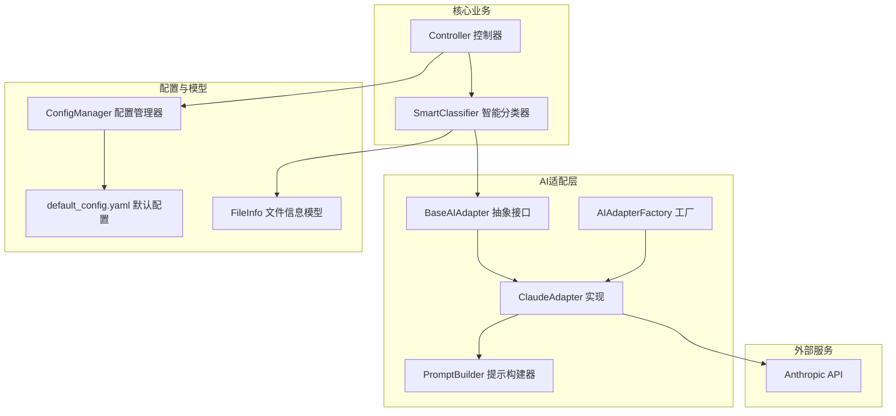
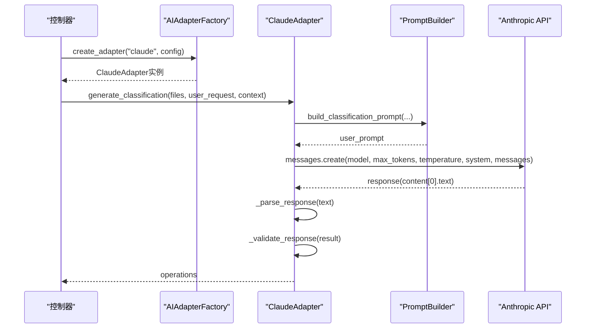
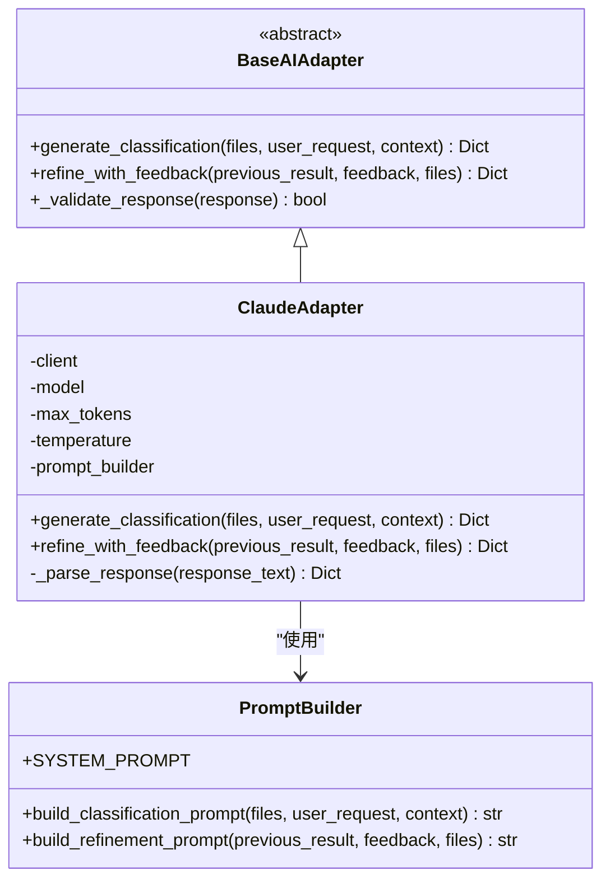
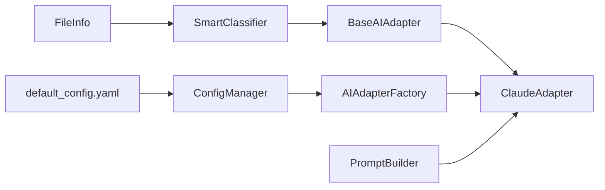

# Claude适配器

<cite>
**本文引用的文件**
- [src/ai/claude_adapter.py](file://src/ai/claude_adapter.py)
- [src/ai/base_adapter.py](file://src/ai/base_adapter.py)
- [src/ai/adapter_factory.py](file://src/ai/adapter_factory.py)
- [src/ai/prompt_builder.py](file://src/ai/prompt_builder.py)
- [src/utils/config.py](file://src/utils/config.py)
- [config/default_config.yaml](file://config/default_config.yaml)
- [requirements.txt](file://requirements.txt)
- [examples/basic_usage.py](file://examples/basic_usage.py)
- [examples/custom_api_example.py](file://examples/custom_api_example.py)
- [src/core/classifier.py](file://src/core/classifier.py)
- [src/models/file_info.py](file://src/models/file_info.py)
</cite>

## 目录
1. [简介](#简介)
2. [项目结构](#项目结构)
3. [核心组件](#核心组件)
4. [架构总览](#架构总览)
5. [详细组件分析](#详细组件分析)
6. [依赖关系分析](#依赖关系分析)
7. [性能与参数调优](#性能与参数调优)
8. [故障排查指南](#故障排查指南)
9. [结论](#结论)
10. [附录](#附录)

## 简介
本文件面向希望在系统中集成Anthropic Claude AI的开发者，提供Claude适配器的完整技术文档。内容涵盖初始化配置、API调用封装、认证机制、generate_classification与refine_with_feedback方法的实现原理（prompt构建、响应解析、错误处理）、Claude特有参数（model选择、max_tokens限制、temperature控制），以及API密钥配置、环境变量设置、依赖安装指南、实际使用示例与常见问题解决方案。

## 项目结构
Claude适配器位于AI适配层，通过统一的适配器接口与上层控制器协作，负责将文件扫描与用户需求转换为标准化的文件操作计划，并支持基于用户反馈的迭代优化。

图表来源
- [src/ai/claude_adapter.py](file://src/ai/claude_adapter.py#L17-L133)
- [src/ai/base_adapter.py](file://src/ai/base_adapter.py#L9-L70)
- [src/ai/adapter_factory.py](file://src/ai/adapter_factory.py#L11-L98)
- [src/ai/prompt_builder.py](file://src/ai/prompt_builder.py#L7-L172)
- [src/utils/config.py](file://src/utils/config.py#L10-L116)
- [config/default_config.yaml](file://config/default_config.yaml#L1-L79)
- [src/core/classifier.py](file://src/core/classifier.py#L11-L265)
- [src/models/file_info.py](file://src/models/file_info.py#L9-L48)

章节来源
- [src/ai/claude_adapter.py](file://src/ai/claude_adapter.py#L1-L133)
- [src/ai/base_adapter.py](file://src/ai/base_adapter.py#L1-L70)
- [src/ai/adapter_factory.py](file://src/ai/adapter_factory.py#L1-L98)
- [src/ai/prompt_builder.py](file://src/ai/prompt_builder.py#L1-L172)
- [src/utils/config.py](file://src/utils/config.py#L1-L116)
- [config/default_config.yaml](file://config/default_config.yaml#L1-L79)
- [src/core/classifier.py](file://src/core/classifier.py#L1-L265)
- [src/models/file_info.py](file://src/models/file_info.py#L1-L48)

## 核心组件
- ClaudeAdapter：实现BaseAIAdapter接口，封装Anthropic Claude API调用，负责prompt构建、消息发送、响应解析与校验。
- BaseAIAdapter：定义统一的AI适配器接口，包括generate_classification与refine_with_feedback两个抽象方法。
- AIAdapterFactory：根据配置动态创建不同提供商的适配器实例，支持claude/openai/local/custom。
- PromptBuilder：构建系统提示与用户提示，规范输出格式与约束。
- ConfigManager：集中管理配置，支持从YAML与环境变量加载，自动注入API Key。
- SmartClassifier：上层业务逻辑，协调AI适配器与规则引擎，支持反馈驱动的迭代优化。

章节来源
- [src/ai/claude_adapter.py](file://src/ai/claude_adapter.py#L17-L133)
- [src/ai/base_adapter.py](file://src/ai/base_adapter.py#L9-L70)
- [src/ai/adapter_factory.py](file://src/ai/adapter_factory.py#L11-L98)
- [src/ai/prompt_builder.py](file://src/ai/prompt_builder.py#L7-L172)
- [src/utils/config.py](file://src/utils/config.py#L10-L116)
- [src/core/classifier.py](file://src/core/classifier.py#L11-L265)

## 架构总览
Claude适配器采用“适配器模式 + 工厂模式”的设计，确保上层业务与具体AI提供商解耦。整体流程如下：
- 控制器通过工厂创建Claude适配器
- 智能分类器调用generate_classification生成初步操作计划
- 用户反馈触发refine_with_feedback进行迭代优化
- 适配器内部通过PromptBuilder构造系统提示与用户提示，调用Anthropic API，解析JSON响应并进行格式校验

图表来源
- [src/ai/adapter_factory.py](file://src/ai/adapter_factory.py#L14-L51)
- [src/ai/claude_adapter.py](file://src/ai/claude_adapter.py#L43-L78)
- [src/ai/prompt_builder.py](file://src/ai/prompt_builder.py#L40-L84)
- [src/ai/base_adapter.py](file://src/ai/base_adapter.py#L12-L30)

## 详细组件分析

### ClaudeAdapter类
- 继承关系：ClaudeAdapter实现BaseAIAdapter接口，具备统一的抽象能力。
- 关键属性：client（Anthropic客户端）、model（模型名称）、max_tokens（最大token数）、temperature（温度）、prompt_builder（提示构建器）。
- 初始化校验：检查anthropic库可用性与API Key有效性；若缺失则抛出异常。
- generate_classification：构建分类prompt，调用messages.create，解析响应为JSON，校验格式后返回。
- refine_with_feedback：构建优化prompt，重复相同调用与解析流程，返回优化后的操作计划。
- _parse_response：优先尝试直接JSON解析；若失败，尝试从Markdown代码块中提取；最后尝试截取首尾花括号范围；均失败则抛出解析错误。

图表来源
- [src/ai/base_adapter.py](file://src/ai/base_adapter.py#L9-L70)
- [src/ai/claude_adapter.py](file://src/ai/claude_adapter.py#L17-L133)
- [src/ai/prompt_builder.py](file://src/ai/prompt_builder.py#L7-L172)

章节来源
- [src/ai/claude_adapter.py](file://src/ai/claude_adapter.py#L17-L133)
- [src/ai/base_adapter.py](file://src/ai/base_adapter.py#L9-L70)
- [src/ai/prompt_builder.py](file://src/ai/prompt_builder.py#L7-L172)

### PromptBuilder类
- SYSTEM_PROMPT：定义系统角色与输出格式要求，强调返回JSON结构、操作类型约束与置信度字段。
- build_classification_prompt：拼接用户需求、已知规则、历史反馈、文件列表与任务说明，形成完整的用户提示。
- build_refinement_prompt：在已有操作方案基础上，加入用户反馈与当前文件列表，引导AI进行针对性优化。
- _format_file_list/_format_metadata：对文件信息进行格式化展示，避免超长列表导致token溢出。

章节来源
- [src/ai/prompt_builder.py](file://src/ai/prompt_builder.py#L7-L172)

### AIAdapterFactory与配置加载
- create_adapter：根据provider字符串创建相应适配器；支持claude/openai/local/custom。
- _create_claude_adapter：从配置中读取api_key、model、max_tokens、temperature；若未显式提供，则使用默认值；同时从环境变量注入API Key。
- ConfigManager：支持从YAML加载配置，支持点号键访问；get_ai_config会从环境变量覆盖配置项（如ANTHROPIC_API_KEY）。

章节来源
- [src/ai/adapter_factory.py](file://src/ai/adapter_factory.py#L11-L98)
- [src/utils/config.py](file://src/utils/config.py#L10-L116)
- [config/default_config.yaml](file://config/default_config.yaml#L1-L79)

### 智能分类器与反馈循环
- classify_batch：先进行快速规则分类，再对不确定文件调用AI生成操作；失败时降级为简单规则分类。
- refine_with_feedback：将上一轮操作转换为标准格式，调用AI优化；失败时回退到原操作。
- _learn_from_feedback：从用户反馈中提取规则，提升后续分类质量。

章节来源
- [src/core/classifier.py](file://src/core/classifier.py#L11-L265)

### 数据模型
- FileInfo：文件信息的数据模型，包含路径、名称、扩展名、大小、时间戳、元数据与内容样本等字段，提供人类可读的size_human属性。

章节来源
- [src/models/file_info.py](file://src/models/file_info.py#L9-L48)

## 依赖关系分析
- ClaudeAdapter依赖BaseAIAdapter接口与PromptBuilder；通过anthropic库调用Anthropic API。
- AIAdapterFactory依赖各适配器实现，负责实例化与参数注入。
- ConfigManager与default_config.yaml共同提供配置源，支持环境变量覆盖。
- SmartClassifier依赖BaseAIAdapter接口，实现业务逻辑与反馈循环。

图表来源
- [src/ai/claude_adapter.py](file://src/ai/claude_adapter.py#L12-L41)
- [src/ai/adapter_factory.py](file://src/ai/adapter_factory.py#L14-L51)
- [src/ai/prompt_builder.py](file://src/ai/prompt_builder.py#L7-L37)
- [src/utils/config.py](file://src/utils/config.py#L76-L111)
- [config/default_config.yaml](file://config/default_config.yaml#L1-L25)
- [src/core/classifier.py](file://src/core/classifier.py#L14-L23)
- [src/models/file_info.py](file://src/models/file_info.py#L9-L29)

章节来源
- [src/ai/claude_adapter.py](file://src/ai/claude_adapter.py#L1-L133)
- [src/ai/adapter_factory.py](file://src/ai/adapter_factory.py#L1-L98)
- [src/ai/prompt_builder.py](file://src/ai/prompt_builder.py#L1-L172)
- [src/utils/config.py](file://src/utils/config.py#L1-L116)
- [config/default_config.yaml](file://config/default_config.yaml#L1-L79)
- [src/core/classifier.py](file://src/core/classifier.py#L1-L265)
- [src/models/file_info.py](file://src/models/file_info.py#L1-L48)

## 性能与参数调优
- model选择：默认使用claude-3-5-sonnet-20241022，可根据任务复杂度与成本预算调整。
- max_tokens：默认4096，建议根据文件数量与提示长度适当提高，避免截断。
- temperature：默认0.7，用于平衡创造性与稳定性；更保守的任务可降低。
- PromptBuilder文件列表截断：当文件过多时仅展示前N项，避免超出上下文限制。
- 降级策略：AI调用失败时自动回退到规则分类，保证系统可用性。

章节来源
- [src/ai/claude_adapter.py](file://src/ai/claude_adapter.py#L20-L41)
- [src/ai/prompt_builder.py](file://src/ai/prompt_builder.py#L127-L159)
- [src/core/classifier.py](file://src/core/classifier.py#L58-L62)

## 故障排查指南
- 依赖缺失：若未安装anthropic库，初始化时会抛出ImportError，需安装依赖。
- API Key无效：初始化时若未提供有效API Key，会抛出ValueError；请检查环境变量或配置。
- API调用失败：generate_classification/refine_with_feedback捕获异常并抛出RuntimeError，包含原始错误信息。
- 响应格式错误：_parse_response尝试多种方式解析JSON，若仍失败，抛出解析错误；请检查SYSTEM_PROMPT与输出格式一致性。
- 配置未生效：确认环境变量ANTHROPIC_API_KEY与default_config.yaml中的ai.providers.claude配置一致。

章节来源
- [src/ai/claude_adapter.py](file://src/ai/claude_adapter.py#L31-L41)
- [src/ai/claude_adapter.py](file://src/ai/claude_adapter.py#L55-L77)
- [src/ai/claude_adapter.py](file://src/ai/claude_adapter.py#L113-L133)
- [src/utils/config.py](file://src/utils/config.py#L84-L87)
- [config/default_config.yaml](file://config/default_config.yaml#L5-L8)

## 结论
Claude适配器通过清晰的接口设计与完善的错误处理机制，实现了与Anthropic Claude API的稳定集成。结合PromptBuilder的结构化提示与SmartClassifier的反馈优化流程，系统能够在复杂场景下提供高质量的文件整理方案。合理配置模型参数与环境变量，可进一步提升性能与可靠性。

## 附录

### API密钥配置与环境变量
- 在环境变量中设置ANTHROPIC_API_KEY，适配器工厂与配置管理器会自动读取。
- 若通过配置文件设置，需确保ai.providers.claude.api_key存在。

章节来源
- [src/utils/config.py](file://src/utils/config.py#L84-L87)
- [src/ai/adapter_factory.py](file://src/ai/adapter_factory.py#L42-L44)
- [config/default_config.yaml](file://config/default_config.yaml#L5-L8)

### 依赖安装指南
- 安装anthropic库以启用Claude适配器功能。
- 如需LangChain集成，请参考requirements.txt中的相关依赖。

章节来源
- [requirements.txt](file://requirements.txt#L7-L7)

### 实际使用示例
- 基本使用：通过Controller指定ai_provider='claude'，即可使用Claude进行文件整理。
- 交互式优化：先生成初步方案，再根据用户反馈调用refine_with_feedback进行优化。

章节来源
- [examples/basic_usage.py](file://examples/basic_usage.py#L7-L36)
- [examples/basic_usage.py](file://examples/basic_usage.py#L38-L62)

### Claude特有参数说明
- model：模型名称，默认claude-3-5-sonnet-20241022。
- max_tokens：最大token数，默认4096。
- temperature：温度参数，默认0.7。

章节来源
- [src/ai/claude_adapter.py](file://src/ai/claude_adapter.py#L20-L41)
- [config/default_config.yaml](file://config/default_config.yaml#L6-L8)