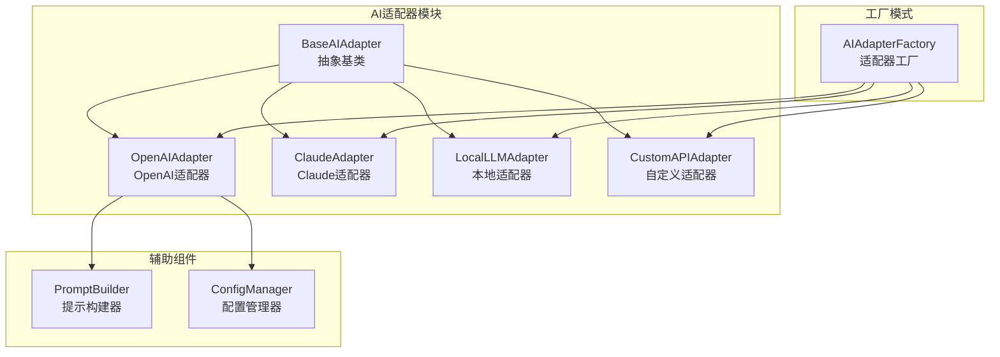
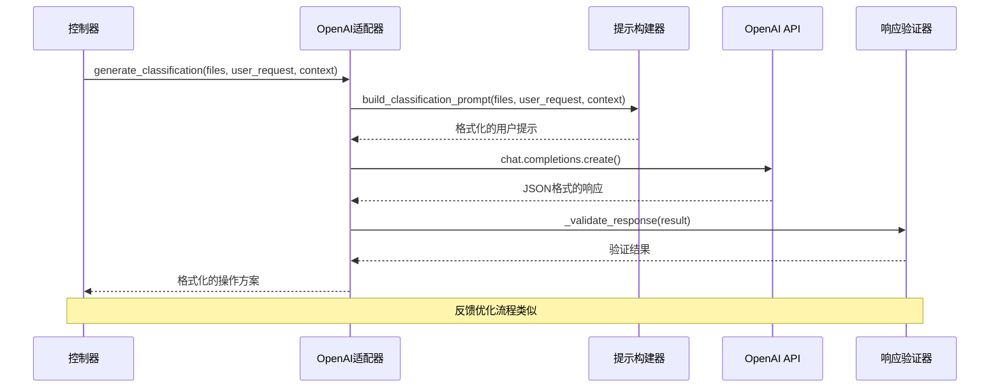
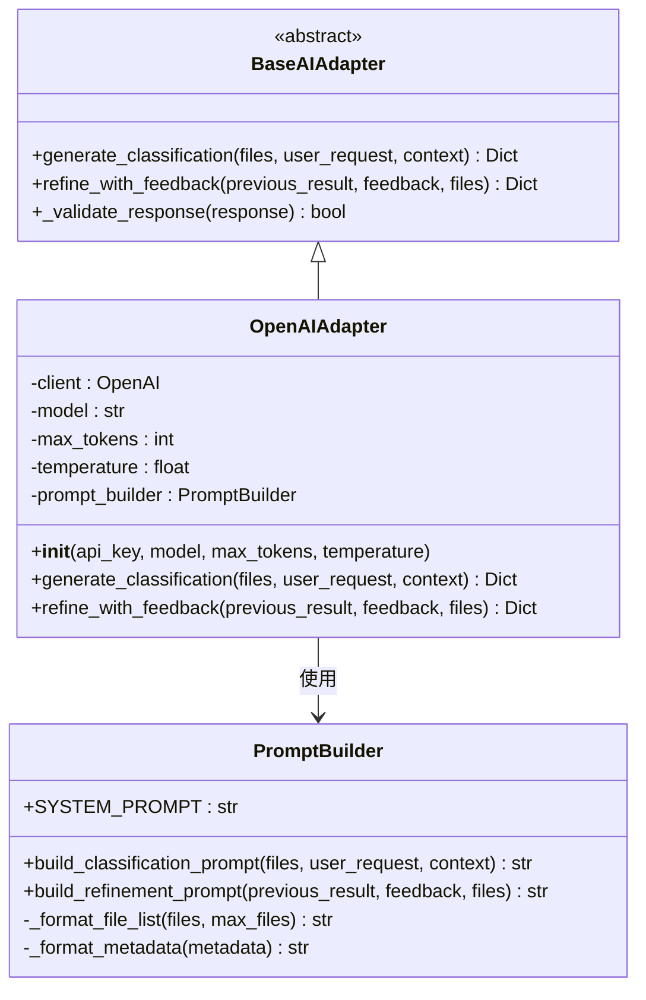
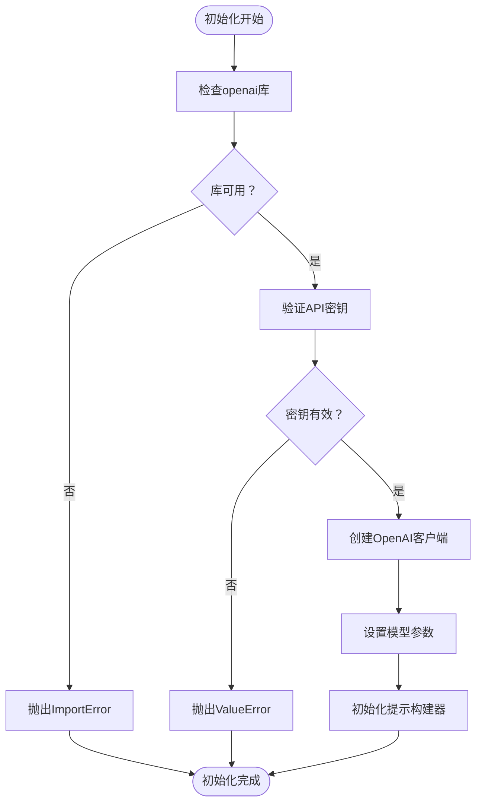
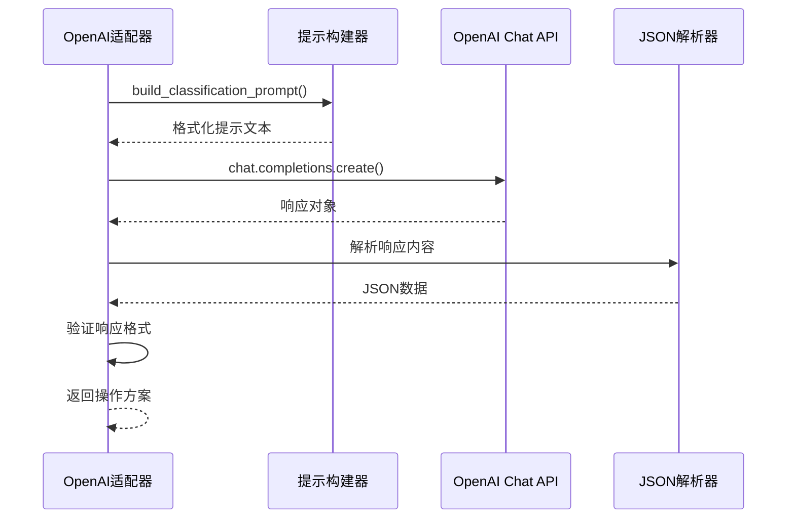
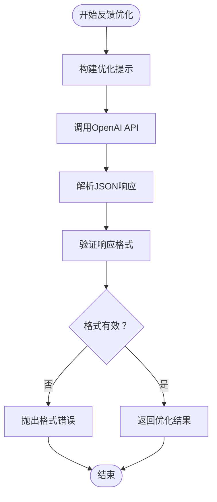
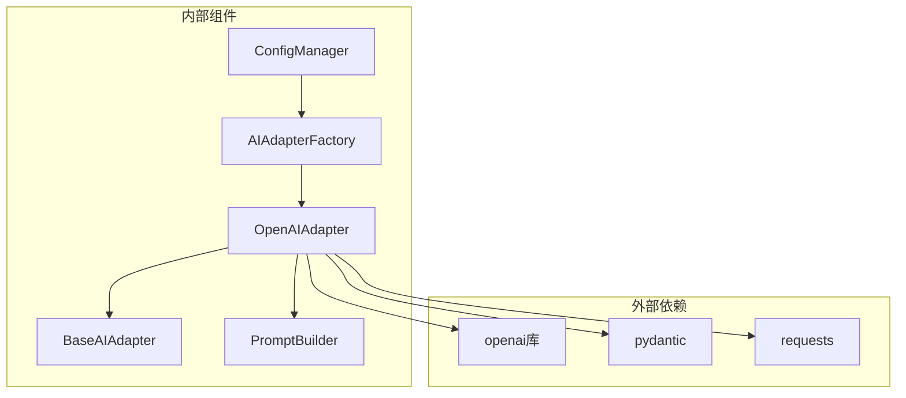

# OpenAI适配器

<cite>
**本文档引用的文件**
- [openai_adapter.py](file://src/ai/openai_adapter.py)
- [base_adapter.py](file://src/ai/base_adapter.py)
- [adapter_factory.py](file://src/ai/adapter_factory.py)
- [prompt_builder.py](file://src/ai/prompt_builder.py)
- [controller.py](file://src/core/controller.py)
- [config.py](file://src/utils/config.py)
- [default_config.yaml](file://config/default_config.yaml)
- [requirements.txt](file://requirements.txt)
- [basic_usage.py](file://examples/basic_usage.py)
- [env.custom.example](file://env.custom.example)
</cite>

## 目录
1. [简介](#简介)
2. [项目结构](#项目结构)
3. [核心组件](#核心组件)
4. [架构概览](#架构概览)
5. [详细组件分析](#详细组件分析)
6. [依赖关系分析](#依赖关系分析)
7. [性能考虑](#性能考虑)
8. [故障排除指南](#故障排除指南)
9. [结论](#结论)
10. [附录](#附录)

## 简介
OpenAI适配器是智能文件整理系统中的关键组件，负责与OpenAI GPT系列模型进行集成。该适配器实现了统一的AI适配器接口，提供了文件分类和智能整理的核心功能。通过封装OpenAI API调用，它简化了复杂的AI模型集成过程，为用户提供了一致的使用体验。

本适配器支持多种OpenAI模型，包括最新的GPT-4 Turbo系列，并提供了灵活的配置选项，包括温度控制、最大token数限制等高级参数。同时，它还集成了完善的错误处理机制和响应验证功能，确保系统的稳定性和可靠性。

## 项目结构
OpenAI适配器位于AI适配器模块中，与Claude适配器、本地适配器等共同构成了完整的AI适配器生态系统。该模块采用清晰的分层架构设计，确保了良好的可维护性和扩展性。



**图表来源**
- [openai_adapter.py](file://src/ai/openai_adapter.py#L17-L42)
- [adapter_factory.py](file://src/ai/adapter_factory.py#L11-L37)
- [base_adapter.py](file://src/ai/base_adapter.py#L9-L50)

**章节来源**
- [openai_adapter.py](file://src/ai/openai_adapter.py#L1-L110)
- [adapter_factory.py](file://src/ai/adapter_factory.py#L1-L98)

## 核心组件
OpenAI适配器的核心功能围绕两个主要方法构建：`generate_classification`用于生成文件分类方案，`refine_with_feedback`用于根据用户反馈优化分类结果。这两个方法都基于OpenAI的ChatCompletion API实现，确保了与GPT系列模型的深度集成。

适配器继承自抽象基类，实现了统一的接口规范，这使得不同AI提供商的适配器可以无缝替换。通过工厂模式，系统可以根据配置动态创建合适的适配器实例。

**章节来源**
- [openai_adapter.py](file://src/ai/openai_adapter.py#L43-L110)
- [base_adapter.py](file://src/ai/base_adapter.py#L12-L50)

## 架构概览
OpenAI适配器在整个系统架构中扮演着关键的数据处理和决策制定角色。它接收来自控制器的文件信息和用户需求，通过精心构建的提示工程，调用OpenAI模型生成智能的文件整理方案。



**图表来源**
- [openai_adapter.py](file://src/ai/openai_adapter.py#L43-L110)
- [prompt_builder.py](file://src/ai/prompt_builder.py#L40-L84)
- [base_adapter.py](file://src/ai/base_adapter.py#L52-L70)

## 详细组件分析

### OpenAI适配器类结构
OpenAI适配器采用面向对象的设计模式，通过清晰的属性和方法组织实现了完整的AI集成功能。



**图表来源**
- [openai_adapter.py](file://src/ai/openai_adapter.py#L17-L42)
- [base_adapter.py](file://src/ai/base_adapter.py#L9-L70)
- [prompt_builder.py](file://src/ai/prompt_builder.py#L7-L37)

#### 初始化配置流程
OpenAI适配器的初始化过程包含了完整的配置验证和客户端设置。系统首先检查openai库的可用性，然后验证API密钥的有效性，最后创建OpenAI客户端实例。



**图表来源**
- [openai_adapter.py](file://src/ai/openai_adapter.py#L31-L41)

**章节来源**
- [openai_adapter.py](file://src/ai/openai_adapter.py#L20-L42)

### generate_classification方法实现
该方法是OpenAI适配器的核心功能，负责生成文件分类方案。实现过程包括提示构建、API调用、响应解析和验证等步骤。

#### API调用封装流程


**图表来源**
- [openai_adapter.py](file://src/ai/openai_adapter.py#L43-L76)
- [prompt_builder.py](file://src/ai/prompt_builder.py#L40-L84)

#### 消息格式构建
OpenAI适配器使用标准的系统-用户消息格式与模型交互。系统消息包含详细的指令和约束条件，用户消息包含具体的文件信息和用户需求。

**章节来源**
- [openai_adapter.py](file://src/ai/openai_adapter.py#L43-L76)
- [prompt_builder.py](file://src/ai/prompt_builder.py#L10-L37)

### refine_with_feedback方法实现
该方法实现了智能的反馈循环机制，允许用户对生成的分类方案进行改进和优化。

#### 反馈优化流程


**图表来源**
- [openai_adapter.py](file://src/ai/openai_adapter.py#L77-L110)

**章节来源**
- [openai_adapter.py](file://src/ai/openai_adapter.py#L77-L110)

### OpenAI特有参数配置
OpenAI适配器支持多种OpenAI特有的参数配置，这些参数直接影响模型的行为和输出质量。

#### 参数配置详解
| 参数名称 | 类型 | 默认值 | 描述 |
|---------|------|--------|------|
| model | str | "gpt-4-turbo-preview" | 指定使用的OpenAI模型版本 |
| max_tokens | int | 4096 | 设置响应的最大token数量 |
| temperature | float | 0.7 | 控制输出的随机性和创造性 |
| top_p | float | 1.0 | 核采样概率质量阈值 |

**章节来源**
- [openai_adapter.py](file://src/ai/openai_adapter.py#L20-L41)
- [adapter_factory.py](file://src/ai/adapter_factory.py#L54-L65)

## 依赖关系分析
OpenAI适配器与其他组件之间存在紧密的依赖关系，形成了一个完整的AI集成生态系统。



**图表来源**
- [requirements.txt](file://requirements.txt#L6-L9)
- [openai_adapter.py](file://src/ai/openai_adapter.py#L6-L14)
- [adapter_factory.py](file://src/ai/adapter_factory.py#L3-L8)

**章节来源**
- [requirements.txt](file://requirements.txt#L1-L43)
- [openai_adapter.py](file://src/ai/openai_adapter.py#L1-L14)

## 性能考虑
OpenAI适配器在设计时充分考虑了性能优化和资源管理，采用了多种策略来提升整体效率。

### 错误处理和重试机制
虽然当前实现没有内置的自动重试机制，但系统提供了完善的错误处理框架。任何API调用异常都会被捕获并转换为统一的运行时错误，便于上层组件进行处理。

### 响应验证优化
适配器实现了严格的响应格式验证，确保返回的数据符合预期格式。这种验证机制有助于及时发现和处理API响应异常，提高系统的稳定性。

## 故障排除指南
在使用OpenAI适配器时，可能会遇到各种常见问题。以下是详细的故障排除指南：

### API密钥相关问题
- **问题**：API密钥无效或过期
- **解决方案**：检查环境变量设置，确保OPENAI_API_KEY正确配置
- **验证方法**：通过配置管理器检查API密钥是否正确加载

### 模型参数配置问题
- **问题**：模型参数超出限制
- **解决方案**：调整max_tokens和temperature参数值
- **建议**：根据具体使用场景选择合适的参数组合

### 网络连接问题
- **问题**：网络连接超时或中断
- **解决方案**：检查网络连接状态，考虑增加超时时间
- **预防措施**：在网络不稳定环境下考虑实现重试机制

**章节来源**
- [config.py](file://src/utils/config.py#L88-L91)
- [openai_adapter.py](file://src/ai/openai_adapter.py#L34-L41)

## 结论
OpenAI适配器作为智能文件整理系统的核心组件，成功地实现了与OpenAI GPT系列模型的深度集成。通过清晰的架构设计、完善的错误处理机制和灵活的配置选项，它为用户提供了强大而可靠的AI文件整理能力。

该适配器不仅支持标准的OpenAI模型，还为未来的扩展和定制提供了良好的基础。其模块化的设计理念使得系统能够轻松适应新的AI模型和服务提供商，保持了长期的可维护性和可扩展性。

## 附录

### 配置示例
以下是最常见的OpenAI适配器配置示例：

#### 环境变量配置
```bash
# 设置默认AI提供商为OpenAI
DEFAULT_AI_PROVIDER=openai

# OpenAI API密钥
OPENAI_API_KEY=your-api-key-here

# 模型配置
OPENAI_MODEL=gpt-4-turbo-preview
OPENAI_MAX_TOKENS=4096
OPENAI_TEMPERATURE=0.7
```

#### YAML配置文件
```yaml
ai:
  default_provider: openai
  providers:
    openai:
      model: gpt-4-turbo-preview
      max_tokens: 4096
      temperature: 0.7
```

### 最佳实践指南
1. **API密钥管理**：始终通过环境变量管理API密钥，避免硬编码
2. **参数调优**：根据具体应用场景调整temperature和max_tokens参数
3. **错误处理**：实现适当的异常处理和重试机制
4. **性能监控**：监控API调用频率和成本，合理控制使用量
5. **安全考虑**：定期轮换API密钥，限制访问权限

### 使用示例
```python
from src.ai.openai_adapter import OpenAIAdapter
from src.models import FileInfo

# 初始化适配器
adapter = OpenAIAdapter(
    api_key="your-api-key",
    model="gpt-4-turbo-preview",
    max_tokens=4096,
    temperature=0.7
)

# 生成分类方案
operations = adapter.generate_classification(
    files=[file_info],
    user_request="整理所有PDF文件",
    context={}
)
```

**章节来源**
- [basic_usage.py](file://examples/basic_usage.py#L7-L35)
- [default_config.yaml](file://config/default_config.yaml#L9-L12)
- [env.custom.example](file://env.custom.example#L15-L23)