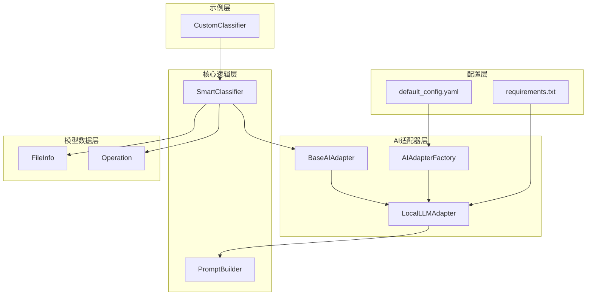
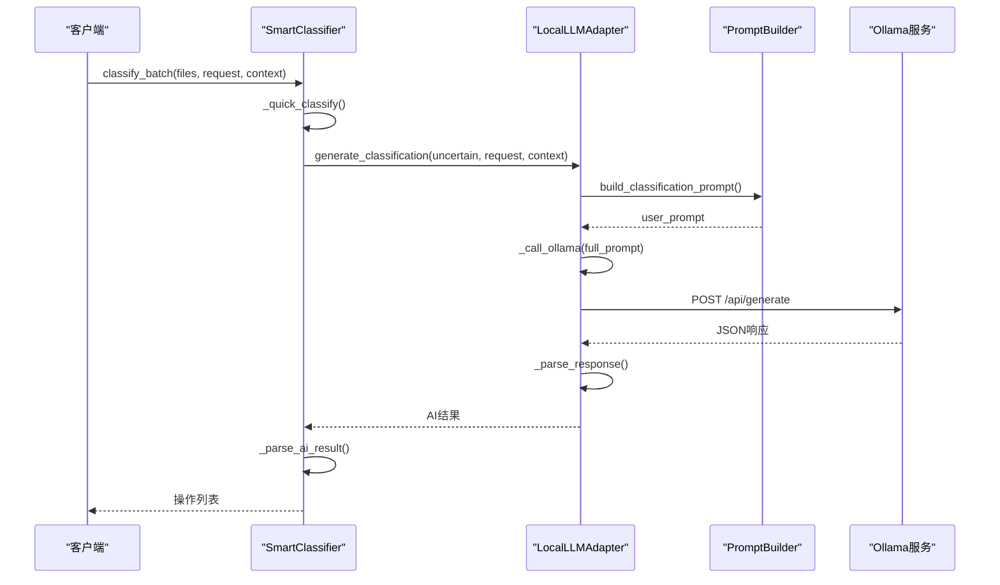
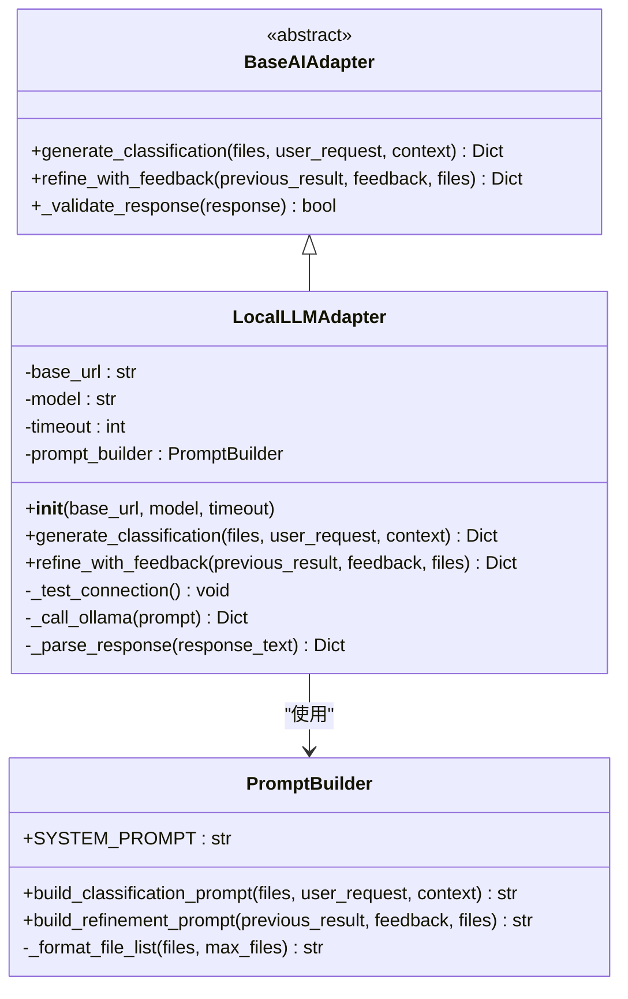
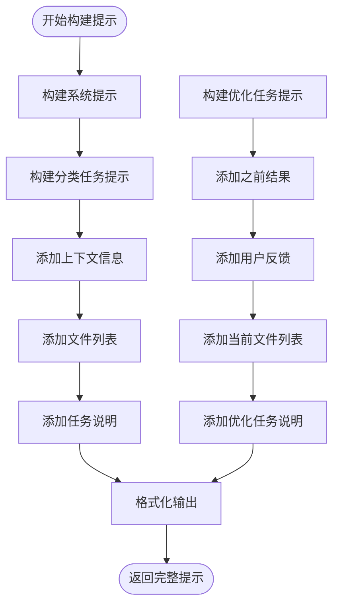
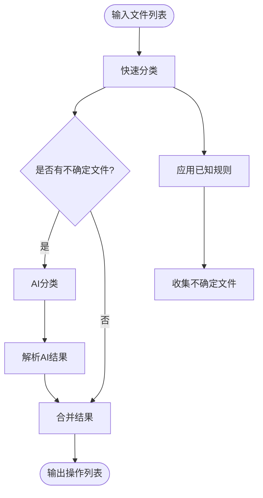
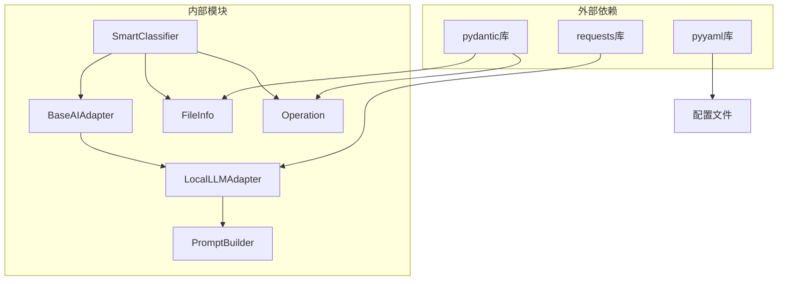

# 本地模型适配器

<cite>
**本文引用的文件**
- [src/ai/local_adapter.py](file://src/ai/local_adapter.py)
- [src/ai/base_adapter.py](file://src/ai/base_adapter.py)
- [src/ai/adapter_factory.py](file://src/ai/adapter_factory.py)
- [src/ai/prompt_builder.py](file://src/ai/prompt_builder.py)
- [src/models/file_info.py](file://src/models/file_info.py)
- [src/models/operation.py](file://src/models/operation.py)
- [src/core/classifier.py](file://src/core/classifier.py)
- [config/default_config.yaml](file://config/default_config.yaml)
- [requirements.txt](file://requirements.txt)
- [examples/custom_classifier.py](file://examples/custom_classifier.py)
</cite>

## 目录
1. [简介](#简介)
2. [项目结构](#项目结构)
3. [核心组件](#核心组件)
4. [架构概览](#架构概览)
5. [详细组件分析](#详细组件分析)
6. [依赖关系分析](#依赖关系分析)
7. [性能考虑](#性能考虑)
8. [故障排除指南](#故障排除指南)
9. [结论](#结论)
10. [附录](#附录)

## 简介
本文档详细介绍本地LLM模型适配器的实现，包括模型加载、推理执行、资源管理等方面。重点说明generate_classification在本地环境下的实现差异，涵盖模型量化、内存优化、批处理策略等内容。同时提供本地部署的配置要求、硬件需求、性能调优指南，并给出模型下载、转换、部署的完整流程。

## 项目结构
该项目采用模块化设计，主要分为AI适配器层、核心逻辑层、模型数据层和配置层：

**图表来源**
- [src/ai/local_adapter.py](file://src/ai/local_adapter.py#L1-L126)
- [src/ai/adapter_factory.py](file://src/ai/adapter_factory.py#L1-L98)
- [src/core/classifier.py](file://src/core/classifier.py#L1-L265)

**章节来源**
- [src/ai/local_adapter.py](file://src/ai/local_adapter.py#L1-L126)
- [src/ai/adapter_factory.py](file://src/ai/adapter_factory.py#L1-L98)
- [config/default_config.yaml](file://config/default_config.yaml#L1-L79)

## 核心组件
本地模型适配器的核心组件包括基础适配器接口、本地LLM适配器实现、适配器工厂和提示构建器：

### 基础适配器接口
基础适配器定义了统一的AI接口规范，确保不同提供商的适配器具有相同的调用方式。

### 本地LLM适配器
本地LLM适配器专门用于与Ollama等本地AI服务通信，实现了完整的推理流程。

### 适配器工厂
适配器工厂负责根据配置动态创建不同类型的AI适配器实例。

### 提示构建器
提示构建器负责构建发送给AI的提示词，包括系统提示和用户提示。

**章节来源**
- [src/ai/base_adapter.py](file://src/ai/base_adapter.py#L1-L70)
- [src/ai/local_adapter.py](file://src/ai/local_adapter.py#L1-L126)
- [src/ai/adapter_factory.py](file://src/ai/adapter_factory.py#L1-L98)
- [src/ai/prompt_builder.py](file://src/ai/prompt_builder.py#L1-L172)

## 架构概览
本地模型适配器的整体架构采用适配器模式，实现了AI服务的统一抽象：

**图表来源**
- [src/core/classifier.py](file://src/core/classifier.py#L24-L66)
- [src/ai/local_adapter.py](file://src/ai/local_adapter.py#L44-L66)
- [src/ai/prompt_builder.py](file://src/ai/prompt_builder.py#L40-L84)

## 详细组件分析

### LocalLLMAdapter类分析
LocalLLMAdapter是本地LLM适配器的核心实现，负责与Ollama服务通信并处理AI推理请求。

**图表来源**
- [src/ai/local_adapter.py](file://src/ai/local_adapter.py#L12-L126)
- [src/ai/base_adapter.py](file://src/ai/base_adapter.py#L9-L70)
- [src/ai/prompt_builder.py](file://src/ai/prompt_builder.py#L7-L172)

#### 初始化过程
LocalLLMAdapter的初始化过程包括参数设置和连接测试：

1. **参数配置**：设置基础URL、模型名称、超时时间
2. **组件初始化**：创建PromptBuilder实例
3. **连接测试**：验证Ollama服务可用性

#### generate_classification实现
generate_classification方法实现了完整的分类推理流程：

1. **提示构建**：使用PromptBuilder构建用户提示
2. **系统提示拼接**：将系统提示与用户提示组合
3. **Ollama调用**：通过HTTP请求调用本地模型
4. **响应解析**：解析JSON响应并验证格式
5. **异常处理**：捕获并处理各种可能的错误

#### refine_with_feedback实现
refine_with_feedback方法支持基于用户反馈的迭代优化：

1. **反馈学习**：从用户反馈中提取规则
2. **结果重构**：将之前的操作结果转换为AI输入格式
3. **增量优化**：调用AI生成优化后的方案

**章节来源**
- [src/ai/local_adapter.py](file://src/ai/local_adapter.py#L15-L126)

### PromptBuilder类分析
PromptBuilder负责构建发送给AI的提示词，确保AI能够理解任务要求和上下文信息。

**图表来源**
- [src/ai/prompt_builder.py](file://src/ai/prompt_builder.py#L40-L125)

#### 系统提示设计
系统提示定义了AI助手的角色和行为准则，包括：
- 文件整理专家身份
- 分析文件信息的能力
- 生成具体操作方案的要求
- JSON格式输出的约束

#### 分类任务提示构建
分类任务提示包含以下关键信息：
- 用户需求描述
- 已知规则（如果存在）
- 历史反馈（最近3次）
- 待整理文件列表
- 任务说明和格式要求

**章节来源**
- [src/ai/prompt_builder.py](file://src/ai/prompt_builder.py#L10-L172)

### SmartClassifier集成分析
SmartClassifier集成了本地适配器，实现了智能文件分类功能：

**图表来源**
- [src/core/classifier.py](file://src/core/classifier.py#L24-L66)

#### 快速分类机制
SmartClassifier实现了两级分类策略：
1. **规则预分类**：基于文件扩展名和已知规则快速分类
2. **AI辅助分类**：对不确定文件使用AI进行精确分类

#### 降级处理机制
当AI分类失败时，系统会自动降级到简单规则分类：
- 从用户请求中提取目标文件夹
- 按文件类型进行基本分类
- 生成置信度较低的操作建议

**章节来源**
- [src/core/classifier.py](file://src/core/classifier.py#L11-L265)

## 依赖关系分析
本地模型适配器的依赖关系清晰明确，遵循单一职责原则：

**图表来源**
- [requirements.txt](file://requirements.txt#L1-L43)
- [src/ai/local_adapter.py](file://src/ai/local_adapter.py#L3-L9)
- [src/models/file_info.py](file://src/models/file_info.py#L6)
- [src/models/operation.py](file://src/models/operation.py#L6)

### 关键依赖说明
- **requests**：用于HTTP通信，调用Ollama API
- **pydantic**：用于数据模型验证和序列化
- **pyyaml**：用于配置文件解析

### 内部耦合关系
- LocalLLMAdapter依赖PromptBuilder进行提示构建
- SmartClassifier依赖BaseAIAdapter进行AI推理
- 所有模型类都依赖pydantic进行数据验证

**章节来源**
- [requirements.txt](file://requirements.txt#L1-L43)
- [src/ai/local_adapter.py](file://src/ai/local_adapter.py#L3-L9)

## 性能考虑

### 模型量化与内存优化
本地模型适配器在设计上考虑了以下性能优化策略：

#### 连接池管理
- **持久连接**：复用HTTP连接减少建立开销
- **超时控制**：合理设置请求超时避免长时间阻塞
- **连接测试**：启动时验证服务可用性

#### 响应解析优化
- **格式验证**：严格的JSON格式验证
- **容错处理**：支持Markdown代码块包裹的JSON
- **错误恢复**：自动提取嵌套JSON片段

#### 批处理策略
虽然当前实现主要针对单次推理，但整体架构支持批处理优化：
- **分批处理**：SmartClassifier支持批量文件分类
- **并发控制**：通过配置控制批处理大小
- **资源监控**：监控内存和CPU使用情况

### 硬件需求建议
基于当前实现的性能特征，建议的硬件配置：

#### 最低配置
- **CPU**：Intel i5-12400F 或 AMD R5 5600G
- **内存**：16GB RAM
- **存储**：500GB SSD（模型+系统）
- **网络**：稳定的局域网连接

#### 推荐配置
- **CPU**：Intel i7-12700K 或 AMD R7 5800X
- **内存**：32GB RAM
- **存储**：1TB SSD
- **显卡**：RTX 3070 或同级别GPU

#### 模型选择建议
- **小型模型**：Llama3.1 8B，适合入门使用
- **中型模型**：Llama3.1 70B，需要更高配置
- **量化模型**：使用GGUF格式的量化模型

### 性能调优指南
针对本地部署的性能优化建议：

#### Ollama配置优化
1. **模型选择**：根据硬件能力选择合适的模型大小
2. **内存映射**：启用适当的内存映射策略
3. **并发设置**：调整并发推理数量

#### 系统级优化
1. **磁盘I/O**：使用SSD存储模型文件
2. **网络优化**：确保本地网络稳定
3. **进程优先级**：适当提高Ollama进程优先级

**章节来源**
- [src/ai/local_adapter.py](file://src/ai/local_adapter.py#L15-L31)
- [config/default_config.yaml](file://config/default_config.yaml#L13-L16)

## 故障排除指南

### 常见问题及解决方案

#### 连接问题
**问题症状**：初始化时抛出ConnectionError
**可能原因**：
- Ollama服务未启动
- 网络连接异常
- 端口被占用

**解决步骤**：
1. 启动Ollama服务：`ollama serve`
2. 验证服务状态：`ollama list`
3. 检查防火墙设置
4. 确认端口可用性

#### 模型加载问题
**问题症状**：调用API时报模型不存在错误
**可能原因**：
- 模型未下载
- 模型名称不正确
- 权限问题

**解决步骤**：
1. 下载所需模型：`ollama pull llama3.1`
2. 验证模型列表：`ollama list`
3. 检查模型权限
4. 重启Ollama服务

#### JSON解析错误
**问题症状**：响应格式验证失败
**可能原因**：
- AI输出格式不符合要求
- 网络传输损坏
- 模型输出不稳定

**解决步骤**：
1. 检查AI输出格式
2. 增加重试机制
3. 调整温度参数
4. 简化提示内容

#### 内存不足问题
**问题症状**：推理过程中出现内存溢出
**可能原因**：
- 模型过大
- 文件列表过长
- 系统内存不足

**解决步骤**：
1. 降低批处理大小
2. 使用更小的模型
3. 增加系统内存
4. 分批处理文件

### 调试技巧
1. **启用详细日志**：检查AI响应内容
2. **简化测试**：使用少量文件进行测试
3. **监控资源**：观察CPU和内存使用情况
4. **验证配置**：确认所有配置参数正确

**章节来源**
- [src/ai/local_adapter.py](file://src/ai/local_adapter.py#L33-L42)
- [src/ai/local_adapter.py](file://src/ai/local_adapter.py#L115-L126)

## 结论
本地模型适配器提供了完整的本地AI推理解决方案，具有以下特点：

### 技术优势
- **统一接口**：通过适配器模式实现多种AI服务的统一访问
- **健壮性**：完善的错误处理和降级机制
- **可扩展性**：模块化设计便于功能扩展
- **性能优化**：合理的资源管理和批处理策略

### 实际应用价值
- **隐私保护**：本地部署确保数据安全
- **成本效益**：无需支付云端API费用
- **定制灵活**：可根据需求选择和配置模型
- **离线可用**：无需网络连接即可使用

### 发展方向
未来可以在以下方面进一步改进：
- **模型量化支持**：集成更多量化格式
- **分布式推理**：支持多节点部署
- **性能监控**：增加详细的性能指标
- **自动化管理**：模型自动更新和维护

## 附录

### 配置参考
本地模型适配器的主要配置项：

| 配置项 | 默认值 | 说明 |
|--------|--------|------|
| base_url | http://localhost:11434 | Ollama服务地址 |
| model | llama3.1 | 模型名称 |
| timeout | 120 | 请求超时时间（秒） |

### 模型适配示例
支持的常见本地模型：

#### Llama系列
- **Llama3.1 8B**：入门级选择，适合轻量使用
- **Llama3.1 70B**：高性能选择，需要较高硬件配置

#### Mistral系列
- **Mistral 7B**：平衡性能和资源消耗
- **Mixtral 8x7B**：专家模型，适合复杂任务

#### Gemma系列
- **Gemma 2B**：轻量级选择
- **Gemma 7B**：中等规模模型

### 部署流程指南
完整的本地部署流程：

1. **环境准备**
   - 安装Python 3.9+
   - 安装Ollama服务
   - 准备足够的存储空间

2. **模型下载**
   - 选择合适的模型
   - 下载模型文件
   - 验证模型完整性

3. **服务配置**
   - 配置Ollama参数
   - 设置网络访问权限
   - 启动服务

4. **应用集成**
   - 配置AI适配器
   - 测试连接
   - 验证功能

**章节来源**
- [config/default_config.yaml](file://config/default_config.yaml#L13-L16)
- [src/ai/adapter_factory.py](file://src/ai/adapter_factory.py#L68-L74)