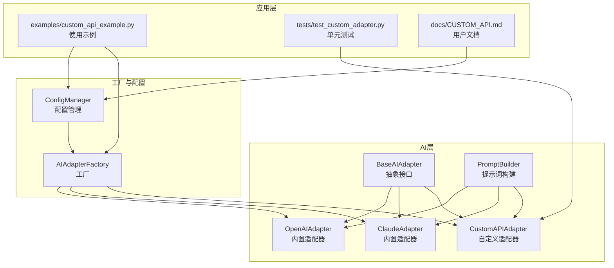
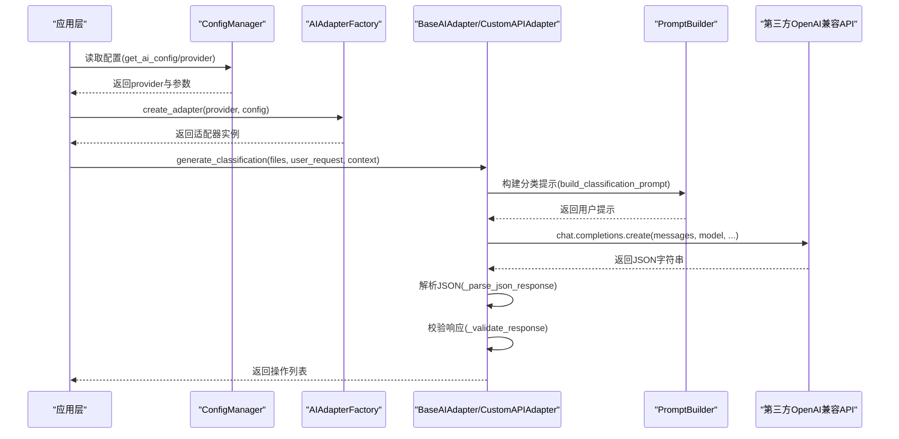
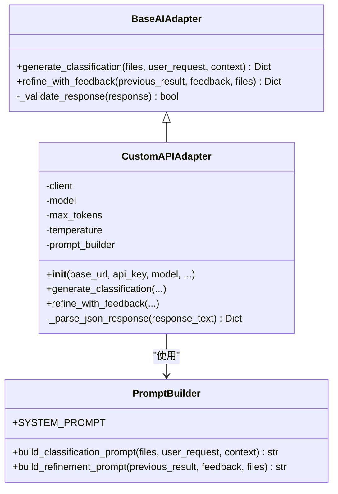
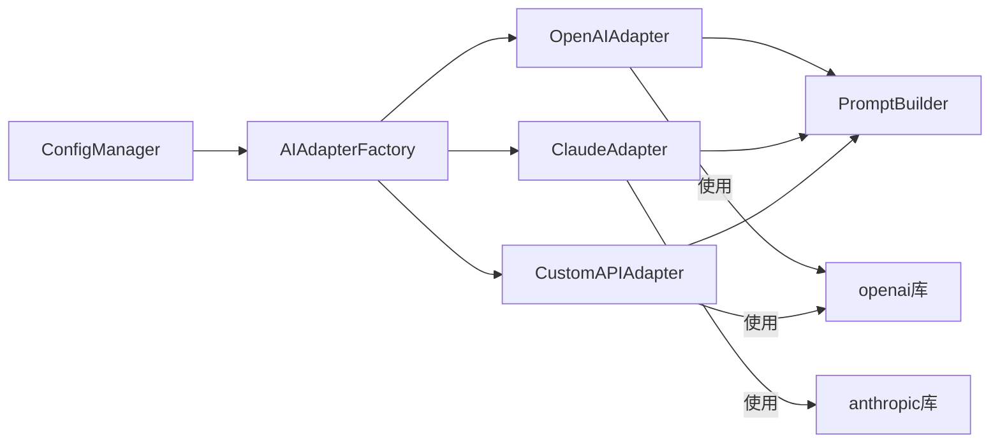

# 自定义API适配器

<cite>
**本文引用的文件**
- [src/ai/base_adapter.py](file://src/ai/base_adapter.py)
- [src/ai/custom_adapter.py](file://src/ai/custom_adapter.py)
- [src/ai/adapter_factory.py](file://src/ai/adapter_factory.py)
- [src/ai/prompt_builder.py](file://src/ai/prompt_builder.py)
- [src/ai/openai_adapter.py](file://src/ai/openai_adapter.py)
- [src/ai/claude_adapter.py](file://src/ai/claude_adapter.py)
- [src/utils/config.py](file://src/utils/config.py)
- [config/default_config.yaml](file://config/default_config.yaml)
- [examples/custom_api_example.py](file://examples/custom_api_example.py)
- [tests/test_custom_adapter.py](file://tests/test_custom_adapter.py)
- [docs/CUSTOM_API.md](file://docs/CUSTOM_API.md)
</cite>

## 目录
1. [简介](#简介)
2. [项目结构](#项目结构)
3. [核心组件](#核心组件)
4. [架构总览](#架构总览)
5. [详细组件分析](#详细组件分析)
6. [依赖关系分析](#依赖关系分析)
7. [性能考量](#性能考量)
8. [故障排查指南](#故障排查指南)
9. [结论](#结论)
10. [附录](#附录)

## 简介
本文件面向希望扩展和定制AI适配器以支持新的API提供商的开发者。我们将系统讲解BaseAIAdapter基类的设计模式、抽象方法实现与接口规范；详解自定义适配器的开发流程，包括HTTP请求封装、响应解析、错误处理与认证机制；提供完整的自定义适配器开发示例，涵盖配置文件格式、API端点定义、参数映射；并给出调试技巧、性能优化建议以及向后兼容性考虑。

## 项目结构
该项目采用模块化设计，AI适配器位于src/ai目录，工厂负责按配置创建具体适配器实例；配置管理位于src/utils；示例与测试分别位于examples与tests；文档位于docs。

图表来源
- [src/ai/base_adapter.py](file://src/ai/base_adapter.py#L9-L70)
- [src/ai/custom_adapter.py](file://src/ai/custom_adapter.py#L17-L157)
- [src/ai/adapter_factory.py](file://src/ai/adapter_factory.py#L11-L98)
- [src/ai/prompt_builder.py](file://src/ai/prompt_builder.py#L7-L172)
- [src/ai/openai_adapter.py](file://src/ai/openai_adapter.py#L17-L110)
- [src/ai/claude_adapter.py](file://src/ai/claude_adapter.py#L17-L133)
- [src/utils/config.py](file://src/utils/config.py#L10-L116)
- [examples/custom_api_example.py](file://examples/custom_api_example.py#L1-L99)
- [tests/test_custom_adapter.py](file://tests/test_custom_adapter.py#L1-L85)
- [docs/CUSTOM_API.md](file://docs/CUSTOM_API.md#L1-L282)

章节来源
- [src/ai/base_adapter.py](file://src/ai/base_adapter.py#L1-L70)
- [src/ai/adapter_factory.py](file://src/ai/adapter_factory.py#L1-L98)
- [src/utils/config.py](file://src/utils/config.py#L1-L116)

## 核心组件
- BaseAIAdapter：定义统一接口，约束子类必须实现generate_classification与refine_with_feedback，并提供通用响应校验逻辑。
- CustomAPIAdapter：基于OpenAI兼容API格式的自定义适配器，支持Azure OpenAI、通义千问、文心一言、智谱AI、Moonshot、DeepSeek等。
- PromptBuilder：构建系统提示与用户提示，保证输入格式稳定，便于第三方服务解析。
- AIAdapterFactory：根据配置动态创建适配器实例，支持claude、openai、local、custom四种提供商。
- ConfigManager：统一读取配置文件与环境变量，支持多级键访问与AI提供商配置合并。

章节来源
- [src/ai/base_adapter.py](file://src/ai/base_adapter.py#L9-L70)
- [src/ai/custom_adapter.py](file://src/ai/custom_adapter.py#L17-L157)
- [src/ai/prompt_builder.py](file://src/ai/prompt_builder.py#L7-L172)
- [src/ai/adapter_factory.py](file://src/ai/adapter_factory.py#L11-L98)
- [src/utils/config.py](file://src/utils/config.py#L10-L116)

## 架构总览
自定义适配器遵循“统一接口 + 工厂创建 + 配置驱动”的架构模式。应用层通过ConfigManager读取配置，AIAdapterFactory根据provider选择具体适配器；适配器内部使用PromptBuilder构造标准化提示词，调用第三方OpenAI兼容API，解析并校验JSON响应，最终返回统一格式的操作列表。

图表来源
- [src/utils/config.py](file://src/utils/config.py#L76-L111)
- [src/ai/adapter_factory.py](file://src/ai/adapter_factory.py#L14-L37)
- [src/ai/custom_adapter.py](file://src/ai/custom_adapter.py#L70-L104)
- [src/ai/prompt_builder.py](file://src/ai/prompt_builder.py#L40-L84)

## 详细组件分析

### BaseAIAdapter 设计模式与接口规范
- 抽象方法
  - generate_classification：接收文件列表、用户需求与上下文，返回包含operations与summary的字典。
  - refine_with_feedback：接收上次结果、用户反馈与当前文件列表，返回优化后的操作列表。
- 通用校验
  - _validate_response：确保响应为字典且包含operations字段，且每个操作包含type、file、target等必要字段。
- 设计要点
  - 统一接口：所有适配器对外暴露一致的方法签名，便于替换与扩展。
  - 响应格式约定：强制JSON结构，避免解析歧义。
  - 异常处理：由子类抛出明确的异常信息，便于上层捕获与降级。

章节来源
- [src/ai/base_adapter.py](file://src/ai/base_adapter.py#L9-L70)

### CustomAPIAdapter 实现细节
- 初始化参数
  - base_url：第三方服务的OpenAI兼容API基础地址（如https://api.example.com/v1）。
  - api_key：API密钥或访问令牌。
  - model：模型名称。
  - max_tokens、temperature：推理参数。
- 请求封装
  - 使用openai.OpenAI客户端，通过base_url指向任意兼容OpenAI API的第三方服务。
  - 调用chat.completions.create，传入system与user消息。
- 响应解析
  - _parse_json_response：优先直接解析JSON；若失败则尝试从markdown代码块中提取；最后尝试截取首个{到末尾}的JSON片段。
- 错误处理
  - 参数校验：空base_url、空api_key、空model均抛出ValueError。
  - 调用异常：捕获底层异常并包装为RuntimeError，包含具体错误信息。
  - 格式校验：_validate_response失败时抛出ValueError。
- 与PromptBuilder协作
  - 通过PromptBuilder构建标准化提示词，确保不同服务的一致性。

图表来源
- [src/ai/base_adapter.py](file://src/ai/base_adapter.py#L9-L70)
- [src/ai/custom_adapter.py](file://src/ai/custom_adapter.py#L17-L157)
- [src/ai/prompt_builder.py](file://src/ai/prompt_builder.py#L7-L172)

章节来源
- [src/ai/custom_adapter.py](file://src/ai/custom_adapter.py#L17-L157)

### PromptBuilder 提示词构建
- SYSTEM_PROMPT：定义角色与输出格式要求，强调必须返回JSON，包含operations数组与summary说明。
- build_classification_prompt：拼接用户需求、已知规则、历史反馈、文件列表与任务说明。
- build_refinement_prompt：在已有结果基础上，结合用户反馈与当前文件列表生成优化提示。
- _format_file_list/_format_metadata：对文件信息进行格式化展示，控制显示数量与关键元数据。

章节来源
- [src/ai/prompt_builder.py](file://src/ai/prompt_builder.py#L7-L172)

### AIAdapterFactory 工厂模式
- create_adapter：根据provider选择具体适配器创建方法。
- _create_custom_adapter：从配置中读取base_url、api_key、model等参数，校验必填项后实例化CustomAPIAdapter。
- 其他内置适配器创建方法：ClaudeAdapter、OpenAIAdapter、LocalLLMAdapter。

章节来源
- [src/ai/adapter_factory.py](file://src/ai/adapter_factory.py#L11-L98)

### 配置与环境变量
- ConfigManager
  - 读取config/default_config.yaml作为默认配置。
  - 支持点号分隔的多级键访问。
  - get_ai_config：合并环境变量（如CUSTOM_API_BASE_URL、CUSTOM_API_KEY、CUSTOM_API_MODEL）与配置文件。
- default_config.yaml
  - ai.default_provider：默认AI提供商。
  - ai.providers.custom：自定义提供商的默认示例配置（base_url、api_key、model等）。

章节来源
- [src/utils/config.py](file://src/utils/config.py#L10-L116)
- [config/default_config.yaml](file://config/default_config.yaml#L1-L79)

### 使用示例与测试
- examples/custom_api_example.py：演示如何配置并使用Azure OpenAI、通义千问、DeepSeek、自部署模型等。
- tests/test_custom_adapter.py：覆盖初始化、参数缺失、自定义参数、JSON解析等场景。

章节来源
- [examples/custom_api_example.py](file://examples/custom_api_example.py#L1-L99)
- [tests/test_custom_adapter.py](file://tests/test_custom_adapter.py#L1-L85)

## 依赖关系分析
- 组件耦合
  - CustomAPIAdapter依赖BaseAIAdapter与PromptBuilder，耦合度低，便于替换。
  - AIAdapterFactory集中创建逻辑，避免上层直接依赖具体适配器实现。
- 外部依赖
  - openai库用于调用第三方OpenAI兼容API。
  - anthropic库用于Claude适配器（与CustomAPIAdapter并存）。
- 潜在循环依赖
  - 适配器与工厂之间为单向依赖，无循环。
- 接口契约
  - 所有适配器必须实现generate_classification与refine_with_feedback，并满足统一响应格式。

图表来源
- [src/ai/adapter_factory.py](file://src/ai/adapter_factory.py#L1-L98)
- [src/ai/openai_adapter.py](file://src/ai/openai_adapter.py#L1-L110)
- [src/ai/claude_adapter.py](file://src/ai/claude_adapter.py#L1-L133)
- [src/ai/custom_adapter.py](file://src/ai/custom_adapter.py#L1-L157)
- [src/ai/prompt_builder.py](file://src/ai/prompt_builder.py#L1-L172)
- [src/utils/config.py](file://src/utils/config.py#L1-L116)

章节来源
- [src/ai/adapter_factory.py](file://src/ai/adapter_factory.py#L1-L98)
- [src/ai/openai_adapter.py](file://src/ai/openai_adapter.py#L1-L110)
- [src/ai/claude_adapter.py](file://src/ai/claude_adapter.py#L1-L133)
- [src/ai/custom_adapter.py](file://src/ai/custom_adapter.py#L1-L157)

## 性能考量
- 通信开销
  - CustomAPIAdapter复用openai.OpenAI客户端，与OpenAIAdapter性能相当，无额外网络开销。
- 响应解析
  - _parse_json_response采用三段式解析策略，优先直接解析，其次从markdown代码块提取，最后尝试截取，兼顾鲁棒性与性能。
- 参数调优
  - max_tokens与temperature可根据服务端限制与稳定性需求调整。
- 批量与并发
  - 适配器本身不负责批处理，建议在上层调用处控制批量大小与并发度。

[本节为通用性能建议，不直接分析特定文件]

## 故障排查指南
- 常见错误与定位
  - “API地址不能为空”：检查配置文件或环境变量中的base_url。
  - “API Key不能为空”：确认api_key是否正确设置。
  - “模型名称不能为空”：核对model是否配置。
  - “AI响应格式不正确”：检查第三方服务是否严格返回JSON；必要时在服务端开启JSON模式。
  - “API调用失败”：检查网络连通性、服务端可用性、配额与余额。
- 调试技巧
  - 使用examples/custom_api_example.py快速验证配置。
  - 在tests/test_custom_adapter.py中添加最小化用例，逐步缩小问题范围。
  - 打印或记录生成的提示词与原始响应，辅助定位格式问题。
- 兼容性与回退
  - 若第三方服务不严格遵循OpenAI API，可在服务端启用兼容模式或在CustomAPIAdapter中增强解析逻辑。
  - 通过AIAdapterFactory切换provider，快速回退到内置适配器（如OpenAI或Claude）进行对比测试。

章节来源
- [examples/custom_api_example.py](file://examples/custom_api_example.py#L1-L99)
- [tests/test_custom_adapter.py](file://tests/test_custom_adapter.py#L1-L85)
- [docs/CUSTOM_API.md](file://docs/CUSTOM_API.md#L183-L282)

## 结论
通过BaseAIAdapter统一接口与AIAdapterFactory工厂模式，项目实现了对新API提供商的零代码扩展能力。CustomAPIAdapter基于OpenAI兼容API，具备良好的可移植性与可维护性。配合完善的配置体系、提示词构建与错误处理机制，开发者可以快速集成新的第三方AI服务，并在保证向后兼容的前提下持续演进。

[本节为总结性内容，不直接分析特定文件]

## 附录

### 自定义适配器开发流程（步骤化）
- 步骤1：准备配置
  - 在config/default_config.yaml中添加或修改ai.providers.custom配置项，设置base_url、api_key、model等。
  - 或通过环境变量CUSTOM_API_BASE_URL、CUSTOM_API_KEY、CUSTOM_API_MODEL注入。
- 步骤2：实现适配器
  - 继承BaseAIAdapter，实现generate_classification与refine_with_feedback。
  - 使用PromptBuilder构建提示词，调用第三方API，解析并校验响应。
  - 在_init_中完成参数校验与客户端初始化。
- 步骤3：注册工厂
  - 在AIAdapterFactory中添加_create_your_adapter方法，并在create_adapter中分支识别。
- 步骤4：测试与验证
  - 编写单元测试覆盖初始化、参数校验、JSON解析等场景。
  - 使用examples/custom_api_example.py进行端到端验证。
- 步骤5：文档与发布
  - 更新docs/CUSTOM_API.md等文档，补充示例与注意事项。
  - 保持向后兼容，避免破坏性变更。

章节来源
- [src/ai/adapter_factory.py](file://src/ai/adapter_factory.py#L76-L98)
- [src/ai/custom_adapter.py](file://src/ai/custom_adapter.py#L30-L69)
- [src/ai/prompt_builder.py](file://src/ai/prompt_builder.py#L40-L125)
- [docs/CUSTOM_API.md](file://docs/CUSTOM_API.md#L1-L282)

### 配置文件格式与参数映射
- default_config.yaml
  - ai.default_provider：默认提供商（custom）。
  - ai.providers.custom：包含base_url、api_key、model、max_tokens、temperature等。
- 环境变量映射
  - CUSTOM_API_BASE_URL、CUSTOM_API_KEY、CUSTOM_API_MODEL由ConfigManager合并到custom提供商配置。
- CLI与命令行
  - 支持通过命令行设置provider与参数，自动写入.env文件，便于快速切换。

章节来源
- [config/default_config.yaml](file://config/default_config.yaml#L1-L79)
- [src/utils/config.py](file://src/utils/config.py#L76-L111)
- [docs/CUSTOM_API.md](file://docs/CUSTOM_API.md#L101-L158)

### API端点与参数映射（OpenAI兼容）
- 端点
  - POST /v1/chat/completions
- 请求参数
  - model：模型名称。
  - messages：系统提示与用户提示组成的数组。
  - max_tokens：最大token数。
  - temperature：温度参数。
  - response_format：当使用内置OpenAI适配器时可要求JSON模式。
- 响应字段
  - choices[0].message.content：包含JSON字符串的操作方案。
  - operations：操作列表。
  - summary：操作概述与统计。

章节来源
- [src/ai/openai_adapter.py](file://src/ai/openai_adapter.py#L54-L75)
- [src/ai/custom_adapter.py](file://src/ai/custom_adapter.py#L81-L100)
- [docs/CUSTOM_API.md](file://docs/CUSTOM_API.md#L264-L273)

### 错误处理与认证机制
- 错误处理
  - 参数校验：在_init_中对base_url、api_key、model进行非空校验。
  - 调用异常：捕获底层异常并包装为RuntimeError，保留原始错误信息。
  - 格式校验：_validate_response确保响应符合统一格式。
- 认证机制
  - 通过api_key进行认证，支持环境变量注入。
  - 自部署服务可使用dummy或空值（取决于服务端要求）。

章节来源
- [src/ai/custom_adapter.py](file://src/ai/custom_adapter.py#L48-L103)
- [src/utils/config.py](file://src/utils/config.py#L99-L110)

### 完整开发示例（不含代码，仅路径）
- 配置示例
  - [config/default_config.yaml](file://config/default_config.yaml#L17-L24)
  - [docs/CUSTOM_API.md](file://docs/CUSTOM_API.md#L101-L158)
- 使用示例
  - [examples/custom_api_example.py](file://examples/custom_api_example.py#L7-L80)
- 单元测试
  - [tests/test_custom_adapter.py](file://tests/test_custom_adapter.py#L8-L85)