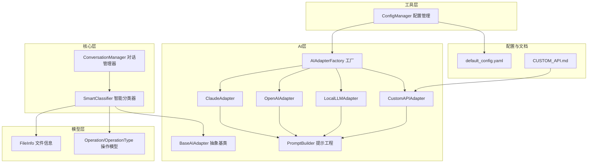
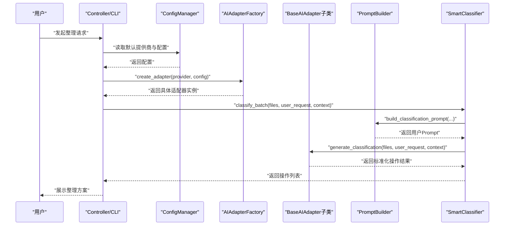
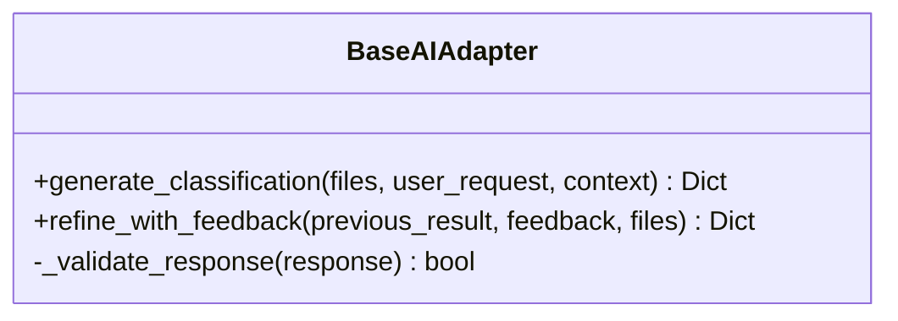
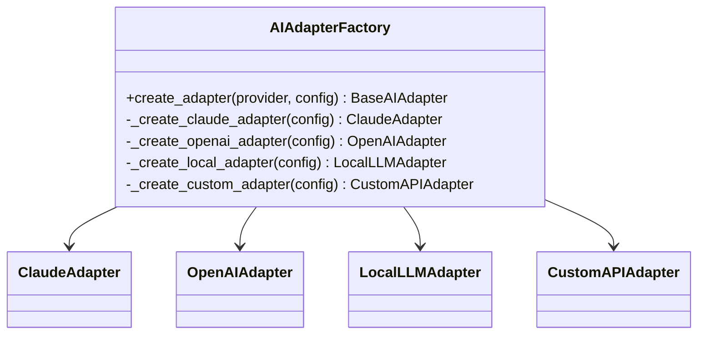
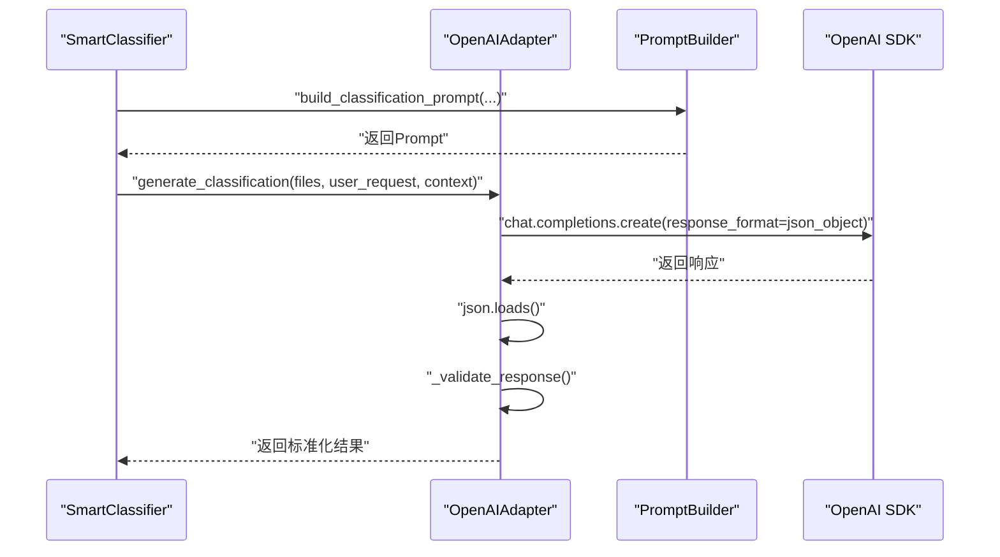
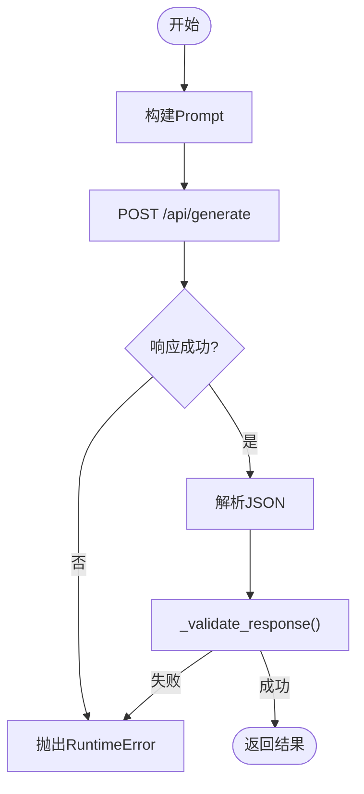
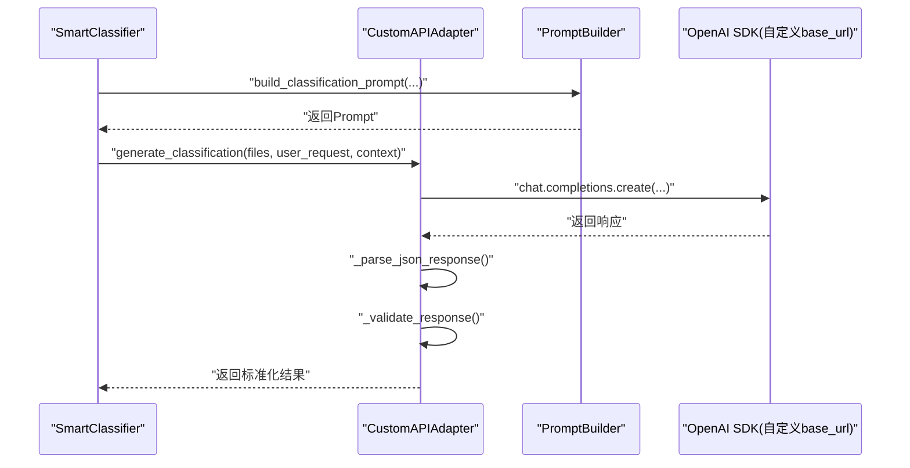
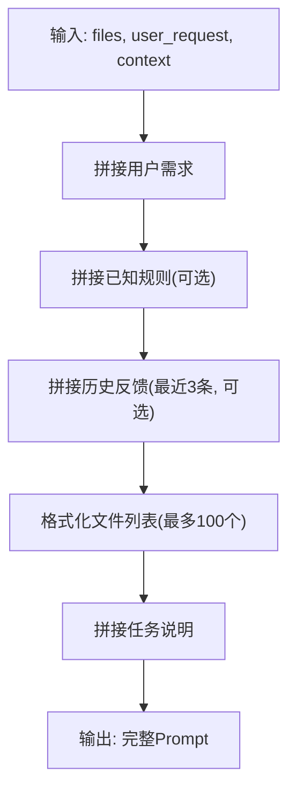
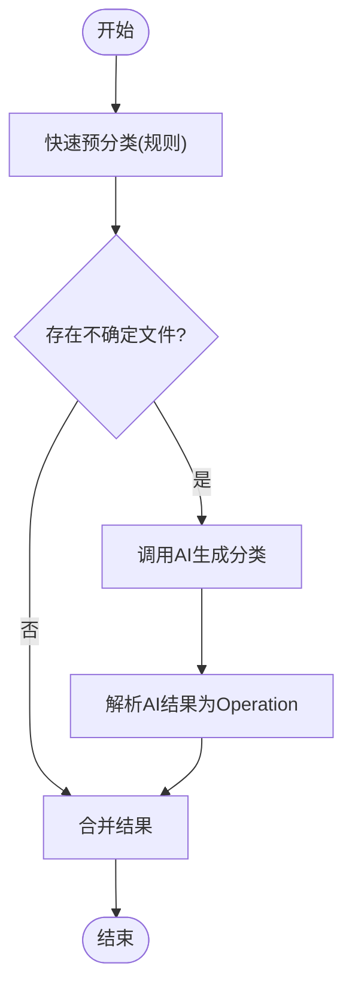
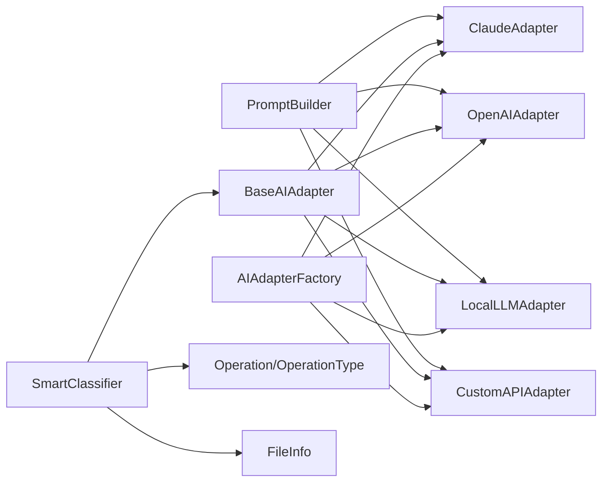

# AI集成架构

<cite>
**本文引用的文件**
- [src/ai/base_adapter.py](file://src/ai/base_adapter.py)
- [src/ai/adapter_factory.py](file://src/ai/adapter_factory.py)
- [src/ai/claude_adapter.py](file://src/ai/claude_adapter.py)
- [src/ai/openai_adapter.py](file://src/ai/openai_adapter.py)
- [src/ai/local_adapter.py](file://src/ai/local_adapter.py)
- [src/ai/custom_adapter.py](file://src/ai/custom_adapter.py)
- [src/ai/prompt_builder.py](file://src/ai/prompt_builder.py)
- [src/core/classifier.py](file://src/core/classifier.py)
- [src/utils/config.py](file://src/utils/config.py)
- [config/default_config.yaml](file://config/default_config.yaml)
- [src/models/file_info.py](file://src/models/file_info.py)
- [src/models/operation.py](file://src/models/operation.py)
- [examples/basic_usage.py](file://examples/basic_usage.py)
- [examples/custom_api_example.py](file://examples/custom_api_example.py)
- [tests/test_custom_adapter.py](file://tests/test_custom_adapter.py)
- [docs/CUSTOM_API.md](file://docs/CUSTOM_API.md)
</cite>

## 目录
1. [简介](#简介)
2. [项目结构](#项目结构)
3. [核心组件](#核心组件)
4. [架构总览](#架构总览)
5. [组件详解](#组件详解)
6. [依赖关系分析](#依赖关系分析)
7. [性能考量](#性能考量)
8. [故障排查指南](#故障排查指南)
9. [结论](#结论)
10. [附录](#附录)

## 简介
本文件系统性阐述本项目的AI集成架构，重点围绕适配器模式与工厂模式展开，覆盖BaseAdapter抽象基类、Claude、OpenAI、Local、Custom四类具体适配器的实现与差异；同时深入解析PromptBuilder的提示工程设计、多模态内容处理思路、批量请求优化策略，并提供自定义AI适配器的开发指南与最佳实践。

## 项目结构
项目采用“功能域+分层”的组织方式：
- ai层：适配器与提示工程
- core层：智能分类器与对话上下文管理
- utils层：配置管理
- models层：数据模型
- config与docs：配置样例与使用说明
- examples与tests：使用示例与测试

图表来源
- [src/ai/base_adapter.py](file://src/ai/base_adapter.py#L9-L70)
- [src/ai/adapter_factory.py](file://src/ai/adapter_factory.py#L11-L98)
- [src/ai/prompt_builder.py](file://src/ai/prompt_builder.py#L7-L172)
- [src/ai/claude_adapter.py](file://src/ai/claude_adapter.py#L17-L133)
- [src/ai/openai_adapter.py](file://src/ai/openai_adapter.py#L17-L110)
- [src/ai/local_adapter.py](file://src/ai/local_adapter.py#L12-L126)
- [src/ai/custom_adapter.py](file://src/ai/custom_adapter.py#L17-L157)
- [src/core/classifier.py](file://src/core/classifier.py#L11-L265)
- [src/utils/config.py](file://src/utils/config.py#L10-L116)
- [config/default_config.yaml](file://config/default_config.yaml#L1-L79)
- [docs/CUSTOM_API.md](file://docs/CUSTOM_API.md#L1-L282)

章节来源
- [src/ai/base_adapter.py](file://src/ai/base_adapter.py#L1-L70)
- [src/ai/adapter_factory.py](file://src/ai/adapter_factory.py#L1-L98)
- [src/ai/prompt_builder.py](file://src/ai/prompt_builder.py#L1-L172)
- [src/core/classifier.py](file://src/core/classifier.py#L1-L265)
- [src/utils/config.py](file://src/utils/config.py#L1-L116)
- [config/default_config.yaml](file://config/default_config.yaml#L1-L79)

## 核心组件
- BaseAIAdapter：定义统一接口，约束generate_classification与refine_with_feedback，并提供响应格式校验逻辑。
- AIAdapterFactory：工厂类，依据配置动态创建具体适配器实例，支持claude、openai、local、custom四种提供商。
- 四类适配器：ClaudeAdapter、OpenAIAdapter、LocalLLMAdapter、CustomAPIAdapter，分别对接Anthropic、OpenAI、本地Ollama与任意OpenAI兼容API。
- PromptBuilder：构建系统提示与用户提示，规范输出格式与规则，支持分类与优化两类任务。
- SmartClassifier：结合规则与AI，实现快速预分类与AI二次确认，支持基于反馈的学习与优化。
- ConfigManager：集中管理配置，支持YAML配置文件与环境变量注入，提供AI提供商配置读取能力。
- 数据模型：FileInfo用于文件元数据与内容样本展示；Operation/OperationType用于标准化操作结果。

章节来源
- [src/ai/base_adapter.py](file://src/ai/base_adapter.py#L9-L70)
- [src/ai/adapter_factory.py](file://src/ai/adapter_factory.py#L11-L98)
- [src/ai/prompt_builder.py](file://src/ai/prompt_builder.py#L7-L172)
- [src/core/classifier.py](file://src/core/classifier.py#L11-L265)
- [src/utils/config.py](file://src/utils/config.py#L10-L116)
- [src/models/file_info.py](file://src/models/file_info.py#L9-L48)
- [src/models/operation.py](file://src/models/operation.py#L10-L54)

## 架构总览
整体采用“适配器+工厂+提示工程+分类器”的分层架构：
- 适配器层：屏蔽不同提供商API差异，统一对外接口。
- 工厂层：按配置创建适配器，便于扩展与替换。
- 提示工程层：通过PromptBuilder统一构建系统提示与用户提示，保证输出结构一致性。
- 分类器层：先规则后AI，结合反馈迭代优化，提升准确性与鲁棒性。
- 配置层：集中管理默认提供商、各提供商参数与环境变量注入。

图表来源
- [src/utils/config.py](file://src/utils/config.py#L76-L116)
- [src/ai/adapter_factory.py](file://src/ai/adapter_factory.py#L14-L37)
- [src/ai/prompt_builder.py](file://src/ai/prompt_builder.py#L40-L84)
- [src/core/classifier.py](file://src/core/classifier.py#L24-L66)
- [src/ai/base_adapter.py](file://src/ai/base_adapter.py#L12-L50)

## 组件详解

### BaseAdapter抽象基类
- 角色：定义统一接口与通用校验逻辑，确保所有适配器返回一致的数据结构。
- 关键方法：
  - generate_classification：生成文件分类方案
  - refine_with_feedback：根据用户反馈优化方案
  - _validate_response：校验响应格式（operations字段存在且每条操作包含type、file、target）

图表来源
- [src/ai/base_adapter.py](file://src/ai/base_adapter.py#L9-L70)

章节来源
- [src/ai/base_adapter.py](file://src/ai/base_adapter.py#L9-L70)

### AIAdapterFactory工厂模式
- 角色：根据provider字符串与配置字典创建具体适配器实例。
- 支持的提供商：
  - claude：校验并读取ANTHROPIC_API_KEY，构造ClaudeAdapter
  - openai：校验并读取OPENAI_API_KEY，构造OpenAIAdapter
  - local：读取base_url、model、timeout，构造LocalLLMAdapter并测试连接
  - custom：校验base_url、api_key、model，构造CustomAPIAdapter（兼容OpenAI格式）
- 异常处理：对缺失必要配置抛出明确异常

图表来源
- [src/ai/adapter_factory.py](file://src/ai/adapter_factory.py#L11-L98)

章节来源
- [src/ai/adapter_factory.py](file://src/ai/adapter_factory.py#L11-L98)

### Claude适配器（Anthropic）
- 特点：使用anthropic SDK，支持system提示与messages结构；响应解析支持直接JSON与Markdown代码块两种形式。
- 关键流程：
  - 构建分类Prompt → 调用messages.create → 解析响应 → 校验格式 → 返回结果
  - 反馈优化流程同上，复用PromptBuilder的优化Prompt
- 错误处理：捕获SDK异常并包装为RuntimeError；解析失败抛出明确错误

图表来源
- [src/ai/claude_adapter.py](file://src/ai/claude_adapter.py#L43-L78)
- [src/ai/prompt_builder.py](file://src/ai/prompt_builder.py#L40-L84)
- [src/ai/base_adapter.py](file://src/ai/base_adapter.py#L52-L70)

章节来源
- [src/ai/claude_adapter.py](file://src/ai/claude_adapter.py#L17-L133)

### OpenAI适配器
- 特点：使用openai SDK，启用response_format为json_object，简化JSON解析；其余流程与Claude一致。
- 关键流程：构建Prompt → chat.completions.create → JSON解析 → 校验 → 返回

图表来源
- [src/ai/openai_adapter.py](file://src/ai/openai_adapter.py#L43-L76)
- [src/ai/prompt_builder.py](file://src/ai/prompt_builder.py#L40-L84)
- [src/ai/base_adapter.py](file://src/ai/base_adapter.py#L52-L70)

章节来源
- [src/ai/openai_adapter.py](file://src/ai/openai_adapter.py#L17-L110)

### 本地模型适配器（Ollama）
- 特点：通过HTTP调用本地Ollama服务，强制使用JSON格式；初始化阶段测试连接；支持自定义超时。
- 关键流程：构建Prompt → POST /api/generate → 解析响应 → 校验 → 返回

图表来源
- [src/ai/local_adapter.py](file://src/ai/local_adapter.py#L44-L91)
- [src/ai/local_adapter.py](file://src/ai/local_adapter.py#L92-L126)
- [src/ai/base_adapter.py](file://src/ai/base_adapter.py#L52-L70)

章节来源
- [src/ai/local_adapter.py](file://src/ai/local_adapter.py#L12-L126)

### 自定义API适配器（OpenAI兼容）
- 特点：基于openai SDK，但指定自定义base_url，从而兼容Azure OpenAI、DashScope、QianFan、智谱、Moonshot、DeepSeek等。
- 关键流程：构建Prompt → chat.completions.create → 解析（支持直接JSON与Markdown代码块）→ 校验 → 返回
- 配置方式：支持.env环境变量注入与配置文件覆盖

图表来源
- [src/ai/custom_adapter.py](file://src/ai/custom_adapter.py#L70-L104)
- [src/ai/prompt_builder.py](file://src/ai/prompt_builder.py#L40-L84)
- [src/ai/base_adapter.py](file://src/ai/base_adapter.py#L52-L70)

章节来源
- [src/ai/custom_adapter.py](file://src/ai/custom_adapter.py#L17-L157)
- [src/utils/config.py](file://src/utils/config.py#L76-L116)
- [docs/CUSTOM_API.md](file://docs/CUSTOM_API.md#L1-L282)

### PromptBuilder提示工程设计
- 系统提示：明确角色、任务、输出格式与关键规则，确保AI输出结构化JSON。
- 分类Prompt：整合用户需求、已知规则、历史反馈、文件列表与任务说明。
- 优化Prompt：呈现先前方案、用户反馈、当前文件列表与优化任务。
- 文件列表格式化：限制显示数量、展示元数据与内容摘要，避免上下文溢出。

图表来源
- [src/ai/prompt_builder.py](file://src/ai/prompt_builder.py#L40-L84)
- [src/ai/prompt_builder.py](file://src/ai/prompt_builder.py#L87-L125)
- [src/ai/prompt_builder.py](file://src/ai/prompt_builder.py#L128-L159)

章节来源
- [src/ai/prompt_builder.py](file://src/ai/prompt_builder.py#L7-L172)

### 智能分类器与对话上下文
- 快速预分类：基于规则与已学规则，减少AI调用次数。
- AI二次确认：对不确定文件交由AI处理，失败时降级为简单规则分类。
- 反馈学习：从用户反馈中抽取规则，更新上下文并在后续调用中携带。
- 结果解析：将AI返回的JSON映射为标准化Operation对象。

图表来源
- [src/core/classifier.py](file://src/core/classifier.py#L24-L66)
- [src/core/classifier.py](file://src/core/classifier.py#L68-L112)
- [src/core/classifier.py](file://src/core/classifier.py#L157-L178)

章节来源
- [src/core/classifier.py](file://src/core/classifier.py#L11-L265)

### 配置管理与默认配置
- ConfigManager：支持YAML配置文件与.env环境变量；提供get_ai_config按提供商读取配置；支持设置默认提供商。
- default_config.yaml：定义默认提供商与各提供商参数；支持LangChain Agent、文件操作、安全与日志配置。
- CUSTOM_API.md：提供自定义API的详细配置示例与常见问题解答。

章节来源
- [src/utils/config.py](file://src/utils/config.py#L10-L116)
- [config/default_config.yaml](file://config/default_config.yaml#L1-L79)
- [docs/CUSTOM_API.md](file://docs/CUSTOM_API.md#L1-L282)

## 依赖关系分析
- 低耦合高内聚：适配器均继承BaseAIAdapter，遵循统一接口；工厂负责创建，调用方仅依赖抽象。
- 依赖方向：
  - 适配器依赖PromptBuilder与BaseAIAdapter
  - 智能分类器依赖适配器与Operation/FileInfo模型
  - 工厂依赖各具体适配器类
  - 配置管理器为工厂与示例提供配置入口
- 潜在循环依赖：当前模块间无循环导入迹象

图表来源
- [src/ai/prompt_builder.py](file://src/ai/prompt_builder.py#L7-L172)
- [src/ai/base_adapter.py](file://src/ai/base_adapter.py#L9-L70)
- [src/ai/adapter_factory.py](file://src/ai/adapter_factory.py#L11-L98)
- [src/core/classifier.py](file://src/core/classifier.py#L11-L265)
- [src/models/operation.py](file://src/models/operation.py#L18-L54)
- [src/models/file_info.py](file://src/models/file_info.py#L9-L48)

章节来源
- [src/ai/prompt_builder.py](file://src/ai/prompt_builder.py#L7-L172)
- [src/ai/base_adapter.py](file://src/ai/base_adapter.py#L9-L70)
- [src/ai/adapter_factory.py](file://src/ai/adapter_factory.py#L11-L98)
- [src/core/classifier.py](file://src/core/classifier.py#L11-L265)

## 性能考量
- 批量与分片：SmartClassifier先快速预分类，再对不确定文件调用AI，减少API调用次数与上下文长度。
- 上下文控制：PromptBuilder限制文件列表最大显示数量，避免超出模型上下文。
- 本地推理：LocalLLMAdapter通过HTTP调用本地Ollama，适合离线与隐私敏感场景；可通过调整timeout平衡延迟与稳定性。
- 响应解析：各适配器均提供稳健的JSON解析策略（直接解析、Markdown代码块、正则提取），提升容错性。
- 降级策略：AI调用失败时，SmartClassifier自动降级为简单规则分类，保障可用性。

章节来源
- [src/core/classifier.py](file://src/core/classifier.py#L24-L66)
- [src/ai/prompt_builder.py](file://src/ai/prompt_builder.py#L128-L159)
- [src/ai/local_adapter.py](file://src/ai/local_adapter.py#L92-L126)
- [src/ai/claude_adapter.py](file://src/ai/claude_adapter.py#L113-L133)
- [src/ai/openai_adapter.py](file://src/ai/openai_adapter.py#L66-L76)
- [src/ai/custom_adapter.py](file://src/ai/custom_adapter.py#L138-L157)

## 故障排查指南
- API密钥缺失
  - Claude：检查ANTHROPIC_API_KEY是否设置
  - OpenAI：检查OPENAI_API_KEY是否设置
  - 自定义：检查CUSTOM_API_KEY是否设置
- 自定义API配置
  - base_url格式需符合OpenAI兼容规范（通常包含/v1）
  - model名称需与服务商提供的部署/模型一致
  - 可通过命令行或.env文件设置并测试连接
- 本地模型连接失败
  - 确认Ollama服务已启动（ollama serve）
  - 检查base_url与timeout配置
- 响应解析失败
  - AI可能返回非严格JSON，适配器内置多种解析策略
  - 若仍失败，检查模型输出格式或调整提示工程
- 配置优先级
  - .env变量优先于default_config.yaml
  - 可通过命令行覆盖临时配置

章节来源
- [src/ai/adapter_factory.py](file://src/ai/adapter_factory.py#L42-L44)
- [src/ai/adapter_factory.py](file://src/ai/adapter_factory.py#L56-L58)
- [src/ai/adapter_factory.py](file://src/ai/adapter_factory.py#L79-L81)
- [src/utils/config.py](file://src/utils/config.py#L84-L110)
- [docs/CUSTOM_API.md](file://docs/CUSTOM_API.md#L175-L218)
- [src/ai/local_adapter.py](file://src/ai/local_adapter.py#L33-L42)

## 结论
本项目通过适配器模式与工厂模式实现了对多家AI提供商的统一接入，配合PromptBuilder的结构化提示工程与SmartClassifier的规则+AI混合策略，在保证输出一致性的同时提升了鲁棒性与性能。自定义API适配器进一步扩展了生态兼容性，满足多样化的部署与合规需求。

## 附录

### 自定义AI适配器开发指南
- 继承BaseAIAdapter并实现：
  - generate_classification：构建Prompt → 调用外部API → 解析响应 → 校验格式 → 返回
  - refine_with_feedback：构建优化Prompt → 调用外部API → 解析响应 → 校验格式 → 返回
- 响应解析建议：
  - 优先尝试直接JSON解析
  - 支持从Markdown代码块中提取JSON
  - 使用正则提取首个{到末尾的JSON片段作为兜底
- 错误处理：
  - 对必填参数进行前置校验
  - 捕获外部调用异常并包装为统一错误类型
  - 对解析失败抛出明确错误信息
- 注册与测试：
  - 在AIAdapterFactory中新增分支并创建实例
  - 编写单元测试覆盖初始化、参数校验与JSON解析
  - 参考现有测试用例风格

章节来源
- [src/ai/base_adapter.py](file://src/ai/base_adapter.py#L12-L70)
- [src/ai/adapter_factory.py](file://src/ai/adapter_factory.py#L14-L37)
- [tests/test_custom_adapter.py](file://tests/test_custom_adapter.py#L1-L85)

### 使用示例与最佳实践
- 基本使用：参考basic_usage.py，演示扫描目录、生成方案与交互式优化。
- 自定义API：参考custom_api_example.py，演示Azure OpenAI、DashScope、DeepSeek等配置与使用。
- 配置优先级：优先使用.env文件，其次default_config.yaml，最后命令行覆盖。

章节来源
- [examples/basic_usage.py](file://examples/basic_usage.py#L7-L89)
- [examples/custom_api_example.py](file://examples/custom_api_example.py#L7-L99)
- [src/utils/config.py](file://src/utils/config.py#L76-L116)