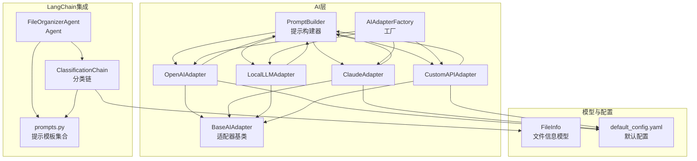
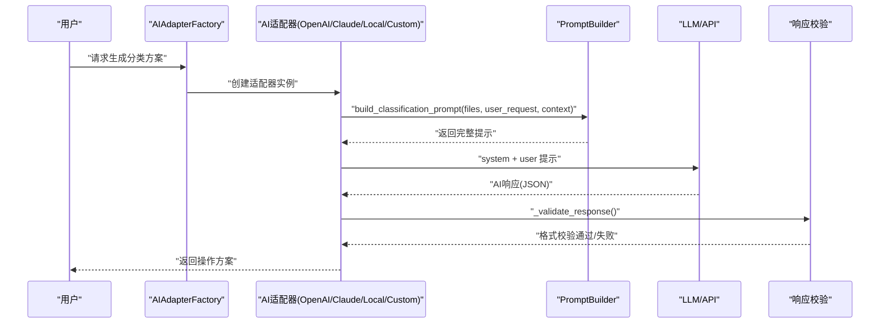
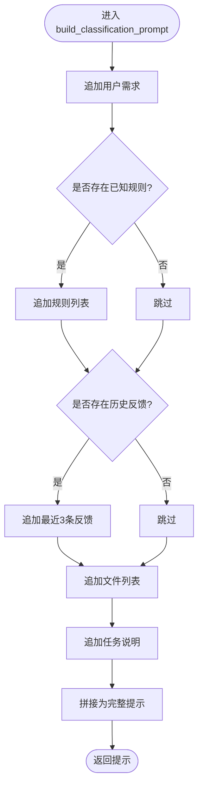
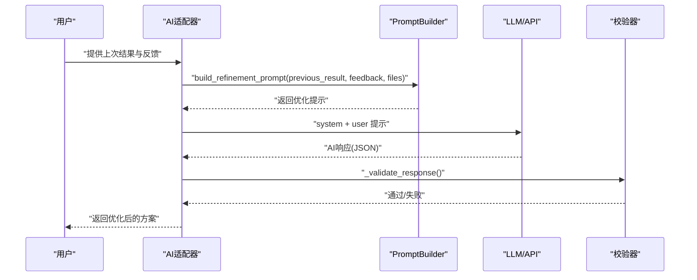
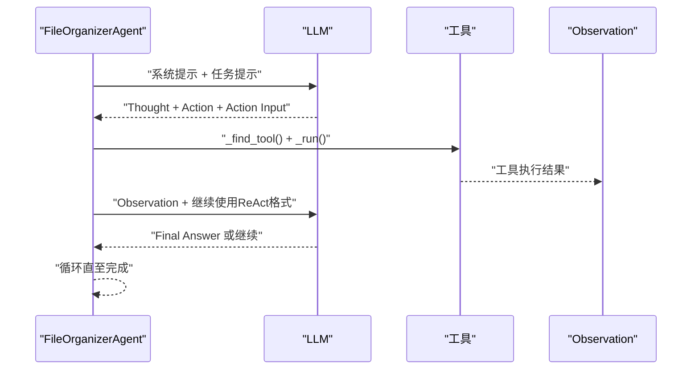
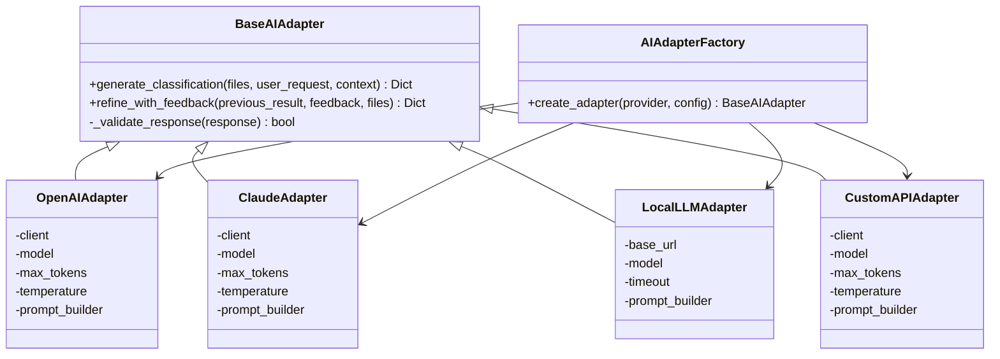
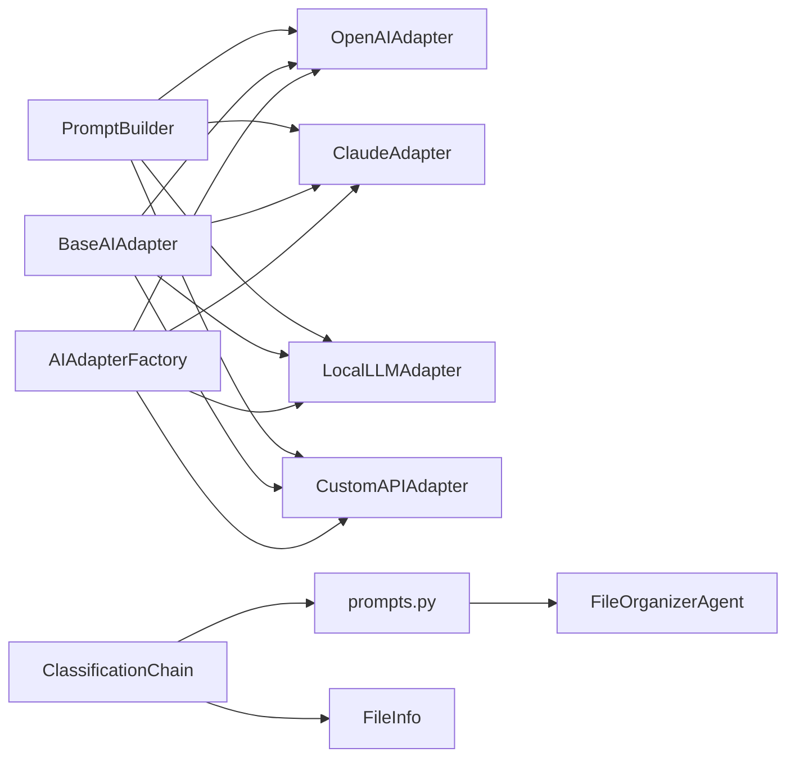

# 提示工程设计

<cite>
**本文引用的文件**
- [src/ai/prompt_builder.py](file://src/ai/prompt_builder.py)
- [src/ai/base_adapter.py](file://src/ai/base_adapter.py)
- [src/ai/openai_adapter.py](file://src/ai/openai_adapter.py)
- [src/ai/claude_adapter.py](file://src/ai/claude_adapter.py)
- [src/ai/local_adapter.py](file://src/ai/local_adapter.py)
- [src/ai/custom_adapter.py](file://src/ai/custom_adapter.py)
- [src/ai/adapter_factory.py](file://src/ai/adapter_factory.py)
- [src/langchain_integration/prompts.py](file://src/langchain_integration/prompts.py)
- [src/langchain_integration/agent.py](file://src/langchain_integration/agent.py)
- [src/langchain_integration/chains/classification_chain.py](file://src/langchain_integration/chains/classification_chain.py)
- [src/models/file_info.py](file://src/models/file_info.py)
- [config/default_config.yaml](file://config/default_config.yaml)
- [examples/basic_usage.py](file://examples/basic_usage.py)
- [examples/langchain_example.py](file://examples/langchain_example.py)
- [tests/test_classifier.py](file://tests/test_classifier.py)
- [tests/test_custom_adapter.py](file://tests/test_custom_adapter.py)
- [REACT_MODE_IMPLEMENTATION.md](file://REACT_MODE_IMPLEMENTATION.md)
- [REACT_FORMAT_FIX.md](file://REACT_FORMAT_FIX.md)
</cite>

## 目录
1. [简介](#简介)
2. [项目结构](#项目结构)
3. [核心组件](#核心组件)
4. [架构总览](#架构总览)
5. [详细组件分析](#详细组件分析)
6. [依赖关系分析](#依赖关系分析)
7. [性能考量](#性能考量)
8. [故障排查指南](#故障排查指南)
9. [结论](#结论)
10. [附录](#附录)

## 简介
本文件系统化阐述本项目的提示工程设计，围绕 PromptBuilder 的架构与模板管理、动态参数注入机制展开；同时覆盖不同类型文件的提示策略、多模态内容处理与上下文构建方法；并深入讲解提示优化技术、批量提示生成、缓存策略等高级特性。此外，文档还提供提示模板的版本管理、A/B测试与性能监控的实践指南，以及自定义提示模板的开发方法与最佳实践。

## 项目结构
项目采用分层与功能域结合的组织方式：
- ai 层：适配器抽象与具体实现、提示构建器
- langchain_integration 层：LangChain Agent、提示模板、链式处理
- core 层：核心控制器与文件扫描/操作逻辑（与提示工程相关）
- models 层：数据模型（如 FileInfo）
- config 层：默认配置
- examples/tests：使用示例与测试用例

**图示来源**
- [src/ai/prompt_builder.py](file://src/ai/prompt_builder.py#L1-L172)
- [src/ai/base_adapter.py](file://src/ai/base_adapter.py#L1-L70)
- [src/ai/openai_adapter.py](file://src/ai/openai_adapter.py#L1-L110)
- [src/ai/claude_adapter.py](file://src/ai/claude_adapter.py#L1-L133)
- [src/ai/local_adapter.py](file://src/ai/local_adapter.py#L1-L126)
- [src/ai/custom_adapter.py](file://src/ai/custom_adapter.py#L1-L157)
- [src/ai/adapter_factory.py](file://src/ai/adapter_factory.py#L1-L98)
- [src/langchain_integration/prompts.py](file://src/langchain_integration/prompts.py#L1-L232)
- [src/langchain_integration/agent.py](file://src/langchain_integration/agent.py#L1-L576)
- [src/langchain_integration/chains/classification_chain.py](file://src/langchain_integration/chains/classification_chain.py#L1-L138)
- [src/models/file_info.py](file://src/models/file_info.py#L1-L48)
- [config/default_config.yaml](file://config/default_config.yaml#L1-L79)

**章节来源**
- [src/ai/prompt_builder.py](file://src/ai/prompt_builder.py#L1-L172)
- [src/ai/adapter_factory.py](file://src/ai/adapter_factory.py#L1-L98)
- [src/langchain_integration/prompts.py](file://src/langchain_integration/prompts.py#L1-L232)
- [src/langchain_integration/agent.py](file://src/langchain_integration/agent.py#L1-L576)
- [src/langchain_integration/chains/classification_chain.py](file://src/langchain_integration/chains/classification_chain.py#L1-L138)
- [src/models/file_info.py](file://src/models/file_info.py#L1-L48)
- [config/default_config.yaml](file://config/default_config.yaml#L1-L79)

## 核心组件
- PromptBuilder：负责构建两类核心提示：分类任务提示与优化任务提示；内置系统提示与文件列表格式化逻辑。
- BaseAIAdapter：定义统一接口，包括生成分类方案与根据反馈优化方案的方法，并提供响应格式校验。
- 具体适配器：OpenAIAdapter、ClaudeAdapter、LocalLLMAdapter、CustomAPIAdapter，均持有 PromptBuilder 实例并调用其构建方法。
- AIAdapterFactory：根据配置创建对应适配器，集中管理提供商差异。
- LangChain提示模板：系统提示、分类提示、内容分析提示、论文识别提示、批量操作确认提示。
- FileOrganizerAgent：基于LangChain工具链的智能Agent，支持ReAct模式、工具调用解析与执行。
- ClassificationChain：面向LangChain的文件分类链，直接使用模板提示进行分类。
- FileInfo：文件元数据与内容样本的数据模型，用于提示中的上下文注入。

**章节来源**
- [src/ai/prompt_builder.py](file://src/ai/prompt_builder.py#L7-L172)
- [src/ai/base_adapter.py](file://src/ai/base_adapter.py#L9-L70)
- [src/ai/openai_adapter.py](file://src/ai/openai_adapter.py#L17-L110)
- [src/ai/claude_adapter.py](file://src/ai/claude_adapter.py#L17-L133)
- [src/ai/local_adapter.py](file://src/ai/local_adapter.py#L12-L126)
- [src/ai/custom_adapter.py](file://src/ai/custom_adapter.py#L17-L157)
- [src/ai/adapter_factory.py](file://src/ai/adapter_factory.py#L11-L98)
- [src/langchain_integration/prompts.py](file://src/langchain_integration/prompts.py#L1-L232)
- [src/langchain_integration/agent.py](file://src/langchain_integration/agent.py#L21-L576)
- [src/langchain_integration/chains/classification_chain.py](file://src/langchain_integration/chains/classification_chain.py#L10-L138)
- [src/models/file_info.py](file://src/models/file_info.py#L9-L48)

## 架构总览
提示工程贯穿“提示构建—适配器调用—响应解析—结果校验”的闭环。AIAdapterFactory按配置选择具体适配器；适配器通过 PromptBuilder 构建用户提示与系统提示，调用对应LLM API；返回的JSON结果由 BaseAIAdapter 的校验逻辑保证格式正确性；LangChain集成提供Agent与链式处理两种范式，分别面向工具编排与纯提示调用场景。

**图示来源**
- [src/ai/adapter_factory.py](file://src/ai/adapter_factory.py#L14-L37)
- [src/ai/openai_adapter.py](file://src/ai/openai_adapter.py#L43-L76)
- [src/ai/claude_adapter.py](file://src/ai/claude_adapter.py#L43-L77)
- [src/ai/local_adapter.py](file://src/ai/local_adapter.py#L44-L66)
- [src/ai/custom_adapter.py](file://src/ai/custom_adapter.py#L70-L103)
- [src/ai/prompt_builder.py](file://src/ai/prompt_builder.py#L40-L84)
- [src/ai/base_adapter.py](file://src/ai/base_adapter.py#L52-L70)

## 详细组件分析

### PromptBuilder 设计与模板管理
- 系统提示：定义角色、能力、工具调用格式、工作流与原则，确保AI遵循一致的输出规范。
- 分类任务提示：拼接用户需求、已知规则、历史反馈、文件列表与任务说明，形成结构化提示。
- 优化任务提示：复用上次结果与用户反馈，引导AI重新生成优化后的JSON方案。
- 文件列表格式化：控制显示数量上限、元数据与内容样本的呈现，避免上下文溢出。
- 元数据格式化：筛选关键字段，提升提示的可读性与相关性。

**图示来源**
- [src/ai/prompt_builder.py](file://src/ai/prompt_builder.py#L40-L84)

**章节来源**
- [src/ai/prompt_builder.py](file://src/ai/prompt_builder.py#L7-L172)

### 动态参数注入机制
- 参数来源：
  - 文件列表：FileInfo 对象包含路径、名称、扩展名、大小、时间戳、元数据、内容样本。
  - 用户请求：用户输入的自然语言需求。
  - 上下文：已知规则、历史反馈、额外信息等。
- 注入策略：
  - PromptBuilder 将上述参数按结构化段落注入，避免硬编码。
  - LangChain提示模板通过占位符进行参数替换，便于链式处理。
  - 适配器在调用API前将系统提示与用户提示组合，确保LLM具备全局上下文。

**章节来源**
- [src/ai/prompt_builder.py](file://src/ai/prompt_builder.py#L40-L126)
- [src/langchain_integration/prompts.py](file://src/langchain_integration/prompts.py#L140-L232)
- [src/models/file_info.py](file://src/models/file_info.py#L9-L48)

### 不同类型文件的提示策略
- PDF论文识别：LangChain论文识别提示要求提取标题、作者、年份、期刊、领域、DOI等关键信息，并以JSON格式输出。
- 通用文件分类：分类提示要求识别文件类型与用途、提出类别、说明归类理由与建议的文件夹结构。
- 内容分析：内容分析提示要求提取主题、关键词、文件类型判断、建议分类与建议文件名。
- 批量操作确认：批量操作提示汇总移动、重命名、创建文件夹的数量与详情，引导用户确认。

**章节来源**
- [src/langchain_integration/prompts.py](file://src/langchain_integration/prompts.py#L179-L232)

### 多模态内容处理与上下文构建
- 文本内容样本：通过内容样本字段截取前若干字符，避免上下文过长。
- 元数据抽取：针对PDF等文件抽取标题、作者、页数等关键元数据，增强分类准确性。
- 上下文融合：将用户需求、历史反馈、已知规则与文件特征整合，形成多维上下文。

**章节来源**
- [src/ai/prompt_builder.py](file://src/ai/prompt_builder.py#L127-L172)
- [src/models/file_info.py](file://src/models/file_info.py#L18-L19)

### 提示优化技术
- 基于反馈的迭代优化：通过优化任务提示，将上次结果与用户反馈纳入新一轮提示，引导AI调整方案。
- 响应格式校验：统一校验JSON结构，确保operations字段与必要子字段存在，提升稳定性。
- ReAct模式：LangChain Agent严格遵循“思考—动作—动作输入—观察—继续”的循环，确保工具调用与执行的可追踪性。

**图示来源**
- [src/ai/prompt_builder.py](file://src/ai/prompt_builder.py#L87-L126)
- [src/ai/base_adapter.py](file://src/ai/base_adapter.py#L52-L70)
- [src/ai/openai_adapter.py](file://src/ai/openai_adapter.py#L77-L110)
- [src/ai/claude_adapter.py](file://src/ai/claude_adapter.py#L79-L112)
- [src/ai/local_adapter.py](file://src/ai/local_adapter.py#L68-L91)
- [src/ai/custom_adapter.py](file://src/ai/custom_adapter.py#L105-L137)

### 批量提示生成与执行
- 批量提示：LangChain ClassificationChain将多个文件信息格式化为文本，注入分类提示，一次性获得分类建议。
- Agent批量操作：FileOrganizerAgent在论文整理任务中，通过工具链扫描、识别、创建文件夹、移动文件，最终汇总结果。

**章节来源**
- [src/langchain_integration/chains/classification_chain.py](file://src/langchain_integration/chains/classification_chain.py#L22-L98)
- [src/langchain_integration/agent.py](file://src/langchain_integration/agent.py#L100-L228)

### 缓存策略与性能优化
- 文件列表截断：PromptBuilder对文件列表设置上限，避免上下文膨胀导致性能下降。
- 内容样本截断：对内容样本进行长度限制，兼顾信息密度与token消耗。
- 配置化参数：通过配置文件控制最大token数、温度、批处理大小等，平衡质量与成本。
- 本地模型连接测试：LocalLLMAdapter在初始化阶段测试与本地服务的连通性，降低运行时失败概率。

**章节来源**
- [src/ai/prompt_builder.py](file://src/ai/prompt_builder.py#L127-L159)
- [src/ai/local_adapter.py](file://src/ai/local_adapter.py#L33-L43)
- [config/default_config.yaml](file://config/default_config.yaml#L48-L66)

### LangChain集成与ReAct模式
- 系统提示与工具说明：Agent使用系统提示指导工具调用与执行原则。
- ReAct解析：Agent解析LLM输出的“思考—动作—动作输入”格式，定位工具名称与参数，执行工具并注入Observation。
- 任务提示增强：在论文整理任务中，Agent构建包含步骤与示例的任务提示，确保格式持续性与可执行性。

**图示来源**
- [src/langchain_integration/agent.py](file://src/langchain_integration/agent.py#L247-L431)
- [src/langchain_integration/prompts.py](file://src/langchain_integration/prompts.py#L4-L133)

**章节来源**
- [src/langchain_integration/agent.py](file://src/langchain_integration/agent.py#L21-L576)
- [src/langchain_integration/prompts.py](file://src/langchain_integration/prompts.py#L1-L232)
- [REACT_MODE_IMPLEMENTATION.md](file://REACT_MODE_IMPLEMENTATION.md#L168-L209)
- [REACT_FORMAT_FIX.md](file://REACT_FORMAT_FIX.md#L1-L194)

### 适配器体系与工厂模式
- 适配器基类：统一生成分类与优化接口，并提供响应格式校验。
- 具体适配器：封装不同LLM的API调用细节（OpenAI、Claude、本地、自定义），共享PromptBuilder。
- 工厂模式：根据配置选择提供商，集中处理参数校验与实例化。

**图示来源**
- [src/ai/base_adapter.py](file://src/ai/base_adapter.py#L9-L70)
- [src/ai/openai_adapter.py](file://src/ai/openai_adapter.py#L17-L110)
- [src/ai/claude_adapter.py](file://src/ai/claude_adapter.py#L17-L133)
- [src/ai/local_adapter.py](file://src/ai/local_adapter.py#L12-L126)
- [src/ai/custom_adapter.py](file://src/ai/custom_adapter.py#L17-L157)
- [src/ai/adapter_factory.py](file://src/ai/adapter_factory.py#L11-L98)

**章节来源**
- [src/ai/base_adapter.py](file://src/ai/base_adapter.py#L1-L70)
- [src/ai/adapter_factory.py](file://src/ai/adapter_factory.py#L1-L98)
- [src/ai/openai_adapter.py](file://src/ai/openai_adapter.py#L1-L110)
- [src/ai/claude_adapter.py](file://src/ai/claude_adapter.py#L1-L133)
- [src/ai/local_adapter.py](file://src/ai/local_adapter.py#L1-L126)
- [src/ai/custom_adapter.py](file://src/ai/custom_adapter.py#L1-L157)

## 依赖关系分析
- 低耦合高内聚：适配器依赖 PromptBuilder，而非直接依赖具体LLM SDK；LangChain模块独立于AI适配器。
- 可替换性：通过工厂模式与接口抽象，可在不改动上层逻辑的情况下切换LLM提供商。
- 数据模型一致性：FileInfo作为跨模块共享的数据载体，确保提示与执行环节的数据一致性。

**图示来源**
- [src/ai/prompt_builder.py](file://src/ai/prompt_builder.py#L1-L172)
- [src/ai/base_adapter.py](file://src/ai/base_adapter.py#L1-L70)
- [src/ai/adapter_factory.py](file://src/ai/adapter_factory.py#L1-L98)
- [src/langchain_integration/prompts.py](file://src/langchain_integration/prompts.py#L1-L232)
- [src/langchain_integration/agent.py](file://src/langchain_integration/agent.py#L1-L576)
- [src/langchain_integration/chains/classification_chain.py](file://src/langchain_integration/chains/classification_chain.py#L1-L138)
- [src/models/file_info.py](file://src/models/file_info.py#L1-L48)

**章节来源**
- [src/ai/prompt_builder.py](file://src/ai/prompt_builder.py#L1-L172)
- [src/ai/base_adapter.py](file://src/ai/base_adapter.py#L1-L70)
- [src/ai/adapter_factory.py](file://src/ai/adapter_factory.py#L1-L98)
- [src/langchain_integration/prompts.py](file://src/langchain_integration/prompts.py#L1-L232)
- [src/langchain_integration/agent.py](file://src/langchain_integration/agent.py#L1-L576)
- [src/langchain_integration/chains/classification_chain.py](file://src/langchain_integration/chains/classification_chain.py#L1-L138)
- [src/models/file_info.py](file://src/models/file_info.py#L1-L48)

## 性能考量
- 上下文长度控制：PromptBuilder对文件列表与内容样本进行截断，避免超出模型上下文窗口。
- 批处理与并发：配置文件提供批大小与最大文件数限制，LangChain Agent的迭代次数与执行时间可配置。
- 本地模型连接测试：在初始化阶段验证本地服务可用性，减少运行时异常。
- 温度与最大token：通过配置文件统一管理，平衡创造性与稳定性。

**章节来源**
- [src/ai/prompt_builder.py](file://src/ai/prompt_builder.py#L127-L159)
- [config/default_config.yaml](file://config/default_config.yaml#L48-L66)
- [src/ai/local_adapter.py](file://src/ai/local_adapter.py#L33-L43)

## 故障排查指南
- 适配器初始化错误：检查API密钥、base_url、model等参数是否正确配置。
- 响应格式不正确：确认AI返回为JSON且包含必需字段；若返回Markdown代码块，解析器会尝试提取。
- ReAct格式中断：确保Observation后明确提醒继续使用ReAct格式；Agent会在每次工具调用后强化格式要求。
- 测试验证：通过单元测试验证适配器初始化、参数缺失、JSON解析等功能点。

**章节来源**
- [src/ai/custom_adapter.py](file://src/ai/custom_adapter.py#L138-L157)
- [src/ai/claude_adapter.py](file://src/ai/claude_adapter.py#L113-L133)
- [src/ai/local_adapter.py](file://src/ai/local_adapter.py#L115-L126)
- [src/langchain_integration/agent.py](file://src/langchain_integration/agent.py#L247-L431)
- [tests/test_custom_adapter.py](file://tests/test_custom_adapter.py#L1-L85)
- [REACT_FORMAT_FIX.md](file://REACT_FORMAT_FIX.md#L1-L194)

## 结论
本项目的提示工程设计通过PromptBuilder实现统一的提示构建与参数注入，配合适配器抽象与工厂模式，实现了对多提供商、多场景的灵活支持。LangChain集成进一步增强了工具编排与可解释性，ReAct模式确保了执行的确定性与可观测性。通过上下文截断、格式校验与配置化参数，系统在性能与稳定性之间取得良好平衡。建议在后续实践中引入模板版本管理、A/B测试与性能监控，持续优化提示质量与用户体验。

## 附录

### 提示模板版本管理与A/B测试实践
- 版本管理：为关键提示模板（如系统提示、分类提示、论文识别提示）建立版本号与变更记录，确保回滚与审计。
- A/B测试：对不同提示变体进行对照实验，评估分类准确率、执行成功率与用户满意度，选择最优模板。
- 性能监控：记录提示长度、响应时间、错误率与费用，建立仪表盘进行持续监控。

[本节为概念性内容，不直接分析具体文件]

### 自定义提示模板开发方法与最佳实践
- 明确目标：确定提示要解决的具体任务（分类、识别、命名等）。
- 结构化提示：采用“角色—能力—约束—示例—任务”的结构，确保LLM理解意图。
- 参数注入：使用占位符注入动态参数，避免硬编码；对敏感信息进行脱敏。
- 格式约束：要求LLM以特定格式输出（如JSON），并在适配器中进行严格校验。
- 可测试性：为提示编写单元测试与集成测试，覆盖边界条件与异常场景。
- 可维护性：将提示拆分为可复用片段，建立模板库与更新流程。

[本节为概念性内容，不直接分析具体文件]