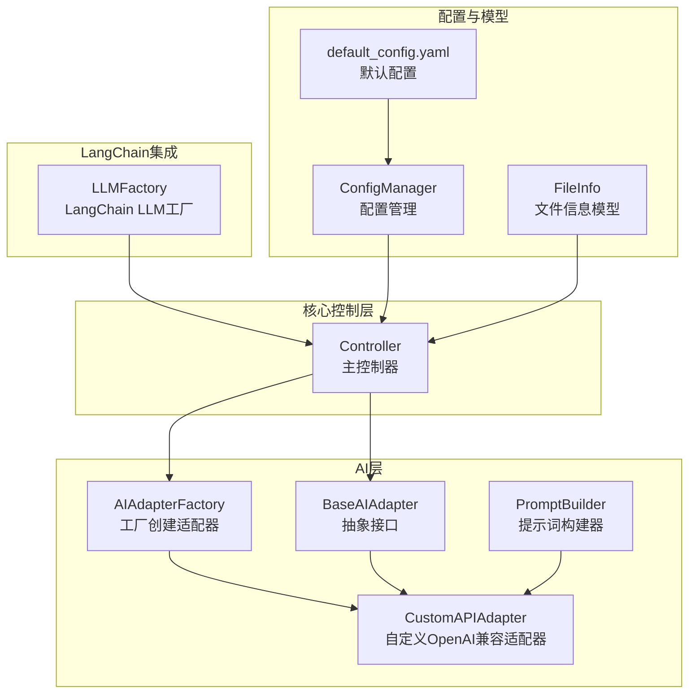
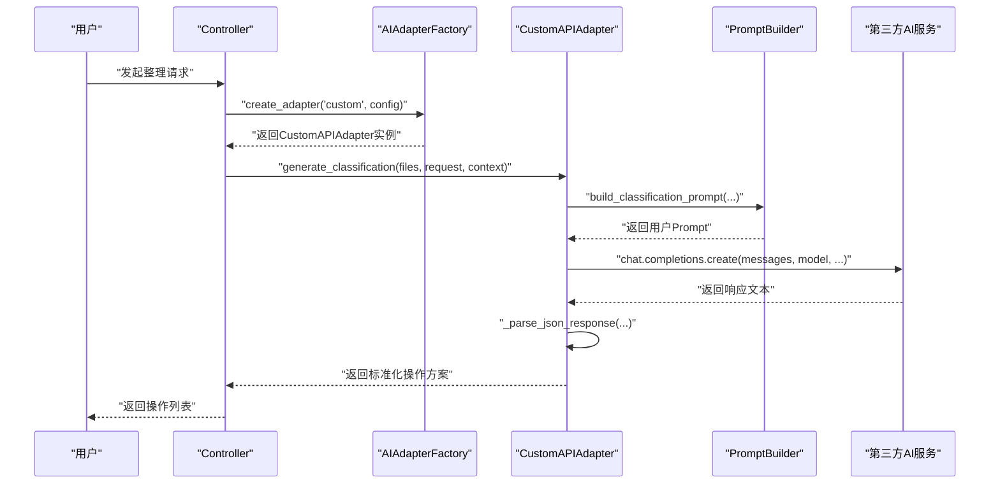
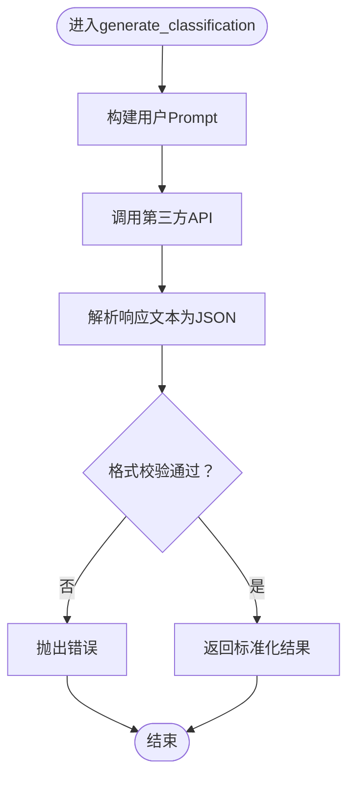
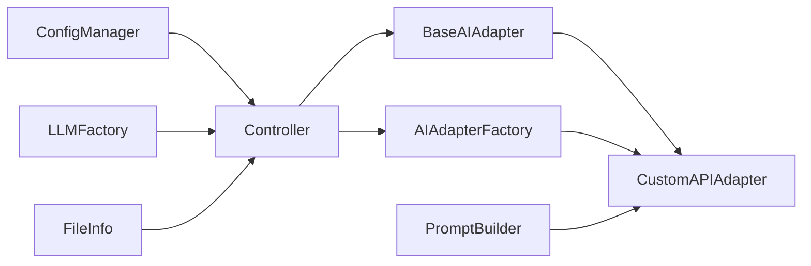

# 自定义适配器开发

<cite>
**本文引用的文件**
- [src/ai/base_adapter.py](file://src/ai/base_adapter.py)
- [src/ai/custom_adapter.py](file://src/ai/custom_adapter.py)
- [src/ai/adapter_factory.py](file://src/ai/adapter_factory.py)
- [src/ai/prompt_builder.py](file://src/ai/prompt_builder.py)
- [src/models/file_info.py](file://src/models/file_info.py)
- [src/utils/config.py](file://src/utils/config.py)
- [src/core/controller.py](file://src/core/controller.py)
- [src/langchain_integration/llm_factory.py](file://src/langchain_integration/llm_factory.py)
- [config/default_config.yaml](file://config/default_config.yaml)
- [docs/CUSTOM_API.md](file://docs/CUSTOM_API.md)
- [examples/custom_api_example.py](file://examples/custom_api_example.py)
- [examples/test_custom_api.py](file://examples/test_custom_api.py)
- [tests/test_custom_adapter.py](file://tests/test_custom_adapter.py)
</cite>

## 目录
1. [简介](#简介)
2. [项目结构](#项目结构)
3. [核心组件](#核心组件)
4. [架构总览](#架构总览)
5. [详细组件分析](#详细组件分析)
6. [依赖关系分析](#依赖关系分析)
7. [性能考虑](#性能考虑)
8. [故障排查指南](#故障排查指南)
9. [结论](#结论)
10. [附录](#附录)

## 简介
本指南面向希望开发“自定义AI适配器”的开发者，系统讲解如何基于现有框架继承与扩展，实现与任意兼容OpenAI API格式的第三方服务对接。内容涵盖：
- 继承BaseAIAdapter并实现必要接口
- 异步调用与错误处理策略
- 适配器注册与工厂创建机制
- 配置参数设计与环境变量支持
- API响应解析与格式校验
- 超时与重试策略建议
- 调试技巧、性能优化与测试策略
- 完整开发示例与常见问题解决方案

## 项目结构
该项目采用模块化分层组织，AI适配器位于src/ai目录，核心控制器位于src/core，配置管理位于src/utils，LangChain集成位于src/langchain_integration，示例与测试位于examples与tests。

图表来源
- [src/ai/base_adapter.py](file://src/ai/base_adapter.py#L9-L70)
- [src/ai/custom_adapter.py](file://src/ai/custom_adapter.py#L17-L157)
- [src/ai/adapter_factory.py](file://src/ai/adapter_factory.py#L11-L98)
- [src/ai/prompt_builder.py](file://src/ai/prompt_builder.py#L7-L172)
- [src/core/controller.py](file://src/core/controller.py#L15-L310)
- [src/utils/config.py](file://src/utils/config.py#L10-L116)
- [config/default_config.yaml](file://config/default_config.yaml#L1-L79)
- [src/langchain_integration/llm_factory.py](file://src/langchain_integration/llm_factory.py#L10-L116)

章节来源
- [src/ai/base_adapter.py](file://src/ai/base_adapter.py#L1-L70)
- [src/ai/custom_adapter.py](file://src/ai/custom_adapter.py#L1-L157)
- [src/ai/adapter_factory.py](file://src/ai/adapter_factory.py#L1-L98)
- [src/ai/prompt_builder.py](file://src/ai/prompt_builder.py#L1-L172)
- [src/core/controller.py](file://src/core/controller.py#L1-L310)
- [src/utils/config.py](file://src/utils/config.py#L1-L116)
- [config/default_config.yaml](file://config/default_config.yaml#L1-L79)
- [src/langchain_integration/llm_factory.py](file://src/langchain_integration/llm_factory.py#L1-L116)

## 核心组件
- BaseAIAdapter：定义统一的AI适配器接口，包含生成分类方案与根据反馈优化两个抽象方法，并提供响应格式校验。
- CustomAPIAdapter：实现BaseAIAdapter，封装与第三方OpenAI兼容API的交互，负责构建提示词、调用API、解析响应与格式校验。
- AIAdapterFactory：工厂类，根据配置动态创建不同提供商的适配器实例。
- PromptBuilder：构建发送给AI的提示词，规范输出格式与约束。
- Controller：主控制器，协调扫描、分类、执行等流程；在Agent不可用时回退到传统适配器模式。
- ConfigManager：统一加载与合并配置，支持.env环境变量覆盖。
- LLMFactory：LangChain集成下的工厂，用于创建兼容OpenAI API的LLM实例（与适配器模式互补）。

章节来源
- [src/ai/base_adapter.py](file://src/ai/base_adapter.py#L9-L70)
- [src/ai/custom_adapter.py](file://src/ai/custom_adapter.py#L17-L157)
- [src/ai/adapter_factory.py](file://src/ai/adapter_factory.py#L11-L98)
- [src/ai/prompt_builder.py](file://src/ai/prompt_builder.py#L7-L172)
- [src/core/controller.py](file://src/core/controller.py#L15-L310)
- [src/utils/config.py](file://src/utils/config.py#L10-L116)
- [src/langchain_integration/llm_factory.py](file://src/langchain_integration/llm_factory.py#L10-L116)

## 架构总览
下图展示“自定义适配器”在整体系统中的位置与交互关系。

图表来源
- [src/core/controller.py](file://src/core/controller.py#L60-L140)
- [src/ai/adapter_factory.py](file://src/ai/adapter_factory.py#L14-L37)
- [src/ai/custom_adapter.py](file://src/ai/custom_adapter.py#L70-L104)
- [src/ai/prompt_builder.py](file://src/ai/prompt_builder.py#L40-L84)

## 详细组件分析

### BaseAIAdapter 抽象接口
- 必需方法
  - generate_classification：接收文件列表、用户请求与上下文，返回包含操作列表的字典。
  - refine_with_feedback：接收上次结果、用户反馈与当前文件列表，返回优化后的操作列表。
- 辅助方法
  - _validate_response：校验响应格式，确保包含operations字段且每条操作具备type、file、target等必需字段。

章节来源
- [src/ai/base_adapter.py](file://src/ai/base_adapter.py#L9-L70)

### CustomAPIAdapter 实现细节
- 初始化参数
  - base_url、api_key、model、max_tokens、temperature。
  - 参数校验：禁止空值；若未安装openai库则抛出异常。
- 请求流程
  - 构建系统提示与用户提示（PromptBuilder）。
  - 调用第三方API的chat.completions端点。
  - 解析响应文本为JSON，支持标准JSON与Markdown代码块两种常见格式。
  - 校验响应格式，不符合则抛出错误。
- 错误处理
  - 统一捕获异常并包装为RuntimeError，便于上层识别为“API调用失败”。

图表来源
- [src/ai/custom_adapter.py](file://src/ai/custom_adapter.py#L70-L104)
- [src/ai/prompt_builder.py](file://src/ai/prompt_builder.py#L40-L84)
- [src/ai/base_adapter.py](file://src/ai/base_adapter.py#L52-L70)

章节来源
- [src/ai/custom_adapter.py](file://src/ai/custom_adapter.py#L17-L157)

### AIAdapterFactory 工厂创建机制
- create_adapter：根据provider字符串选择创建策略。
- _create_custom_adapter：从配置中读取base_url、api_key、model等参数，校验必填项后实例化CustomAPIAdapter。
- 支持的provider：claude、openai、local、custom。

章节来源
- [src/ai/adapter_factory.py](file://src/ai/adapter_factory.py#L11-L98)

### PromptBuilder 提示词构建
- SYSTEM_PROMPT：明确任务、输出格式要求与字段约束。
- build_classification_prompt/build_refinement_prompt：拼装用户需求、历史规则、历史反馈、文件列表与任务说明。
- _format_file_list/_format_metadata：限制显示文件数量与元数据字段，避免提示词过长。

章节来源
- [src/ai/prompt_builder.py](file://src/ai/prompt_builder.py#L7-L172)

### Controller 控制流与回退机制
- 初始化优先尝试LangChain Agent模式，若导入失败则回退到传统适配器模式。
- 传统模式下通过AIAdapterFactory创建适配器并交由SmartClassifier进行批量分类。
- 提供聊天、建议、分析等便捷入口，便于调试与验证。

章节来源
- [src/core/controller.py](file://src/core/controller.py#L15-L310)

### 配置与环境变量支持
- ConfigManager：支持从default_config.yaml加载配置，并从.env文件与环境变量中覆盖敏感参数。
- 支持的provider配置：claude、openai、local、custom。
- custom模式的环境变量：DEFAULT_AI_PROVIDER、CUSTOM_API_BASE_URL、CUSTOM_API_KEY、CUSTOM_API_MODEL。

章节来源
- [src/utils/config.py](file://src/utils/config.py#L10-L116)
- [config/default_config.yaml](file://config/default_config.yaml#L1-L79)
- [docs/CUSTOM_API.md](file://docs/CUSTOM_API.md#L1-L282)

### LangChain LLM工厂（与适配器模式互补）
- LLMFactory：创建ChatOpenAI实例时传入自定义base_url，实现与CustomAPIAdapter一致的OpenAI兼容API对接。
- 适用于需要LangChain Agent能力的场景。

章节来源
- [src/langchain_integration/llm_factory.py](file://src/langchain_integration/llm_factory.py#L10-L116)

## 依赖关系分析
- 组件耦合
  - CustomAPIAdapter依赖BaseAIAdapter接口、PromptBuilder与第三方openai客户端。
  - AIAdapterFactory依赖各具体适配器实现，解耦上层调用。
  - Controller依赖AIAdapterFactory与SmartClassifier，在Agent不可用时回退。
  - ConfigManager为全局配置源，被Controller与LLMFactory共同使用。
- 外部依赖
  - openai库（用于CustomAPIAdapter）。
  - langchain_*系列库（用于LLMFactory与Agent集成）。
  - pydantic（用于FileInfo模型）。

图表来源
- [src/ai/base_adapter.py](file://src/ai/base_adapter.py#L9-L70)
- [src/ai/custom_adapter.py](file://src/ai/custom_adapter.py#L17-L157)
- [src/ai/adapter_factory.py](file://src/ai/adapter_factory.py#L11-L98)
- [src/ai/prompt_builder.py](file://src/ai/prompt_builder.py#L7-L172)
- [src/core/controller.py](file://src/core/controller.py#L15-L310)
- [src/utils/config.py](file://src/utils/config.py#L10-L116)
- [src/langchain_integration/llm_factory.py](file://src/langchain_integration/llm_factory.py#L10-L116)
- [src/models/file_info.py](file://src/models/file_info.py#L9-L48)

## 性能考虑
- 提示词长度控制
  - PromptBuilder对文件列表进行截断显示，避免超出模型上下文限制。
- 批量与并发
  - Controller在执行阶段支持批量操作，可通过配置调整batch_size。
- 超时与重试
  - 建议在CustomAPIAdapter中增加超时参数与指数退避重试逻辑（当前实现未包含），以提升稳定性。
- 输出格式解析
  - _parse_json_response支持多种格式，减少因服务端输出差异导致的解析失败。

章节来源
- [src/ai/prompt_builder.py](file://src/ai/prompt_builder.py#L127-L159)
- [src/core/controller.py](file://src/core/controller.py#L231-L232)
- [src/ai/custom_adapter.py](file://src/ai/custom_adapter.py#L138-L157)

## 故障排查指南
- 常见错误与定位
  - “API调用失败”：检查base_url、api_key、model是否正确，网络连通性与配额。
  - “AI响应格式不正确”：确认第三方服务返回符合SYSTEM_PROMPT约定的JSON结构。
  - “缺少必需参数”：初始化CustomAPIAdapter时确保base_url、api_key、model非空。
- 调试步骤
  - 使用examples/test_custom_api.py进行端到端验证，检查环境变量、配置加载、LLM创建、连接测试与Agent集成。
  - 在Controller中开启verbose模式，观察交互与上下文传递。
- 单元测试
  - tests/test_custom_adapter.py覆盖初始化、参数校验与JSON解析逻辑，可作为新增适配器的参考模板。

章节来源
- [examples/test_custom_api.py](file://examples/test_custom_api.py#L24-L390)
- [tests/test_custom_adapter.py](file://tests/test_custom_adapter.py#L1-L85)
- [src/ai/custom_adapter.py](file://src/ai/custom_adapter.py#L48-L104)

## 结论
通过遵循BaseAIAdapter接口、利用AIAdapterFactory与PromptBuilder，结合ConfigManager的灵活配置，开发者可以快速实现与任意OpenAI兼容API的自定义适配器。配合Controller的回退机制与LangChain集成，既能满足传统模式下的稳定运行，也能在Agent模式下获得更强的自动化能力。建议在生产环境中补充超时与重试策略，并持续完善测试用例以保证适配器的健壮性。

## 附录

### 开发步骤清单
- 继承BaseAIAdapter并实现generate_classification与refine_with_feedback。
- 在AIAdapterFactory中注册新的provider分支。
- 设计配置参数（base_url、api_key、model、max_tokens、temperature）。
- 使用PromptBuilder构建提示词，确保输出格式符合_base_validate_response要求。
- 实现响应解析与格式校验，必要时增强容错处理。
- 编写单元测试与集成测试，覆盖初始化、参数校验与典型场景。
- 在examples与docs中补充使用示例与常见问题解答。

章节来源
- [src/ai/base_adapter.py](file://src/ai/base_adapter.py#L9-L70)
- [src/ai/adapter_factory.py](file://src/ai/adapter_factory.py#L14-L37)
- [src/ai/prompt_builder.py](file://src/ai/prompt_builder.py#L40-L125)
- [src/ai/custom_adapter.py](file://src/ai/custom_adapter.py#L70-L157)
- [tests/test_custom_adapter.py](file://tests/test_custom_adapter.py#L1-L85)
- [examples/custom_api_example.py](file://examples/custom_api_example.py#L1-L99)
- [docs/CUSTOM_API.md](file://docs/CUSTOM_API.md#L1-L282)