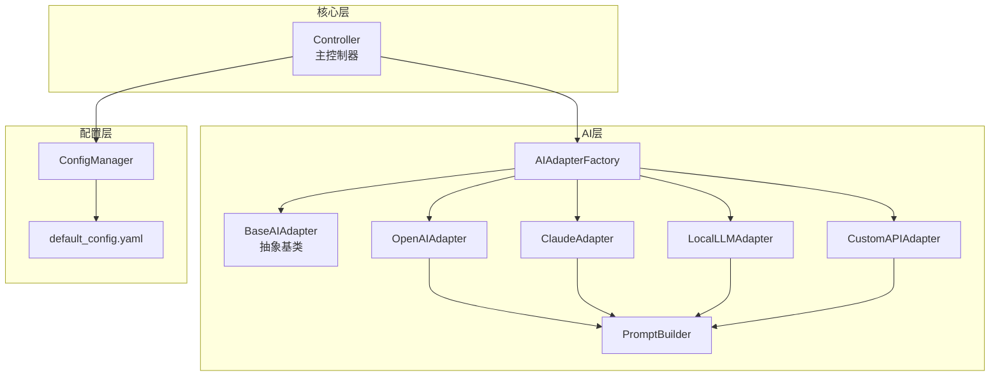
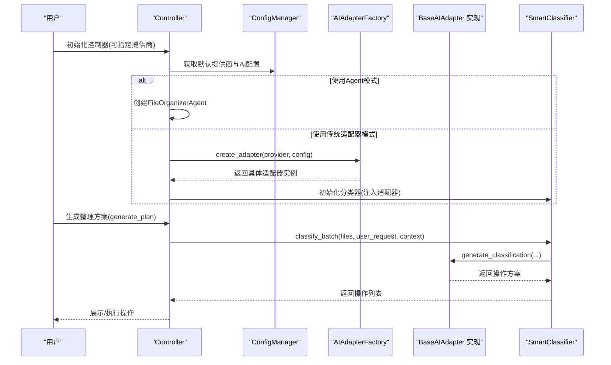
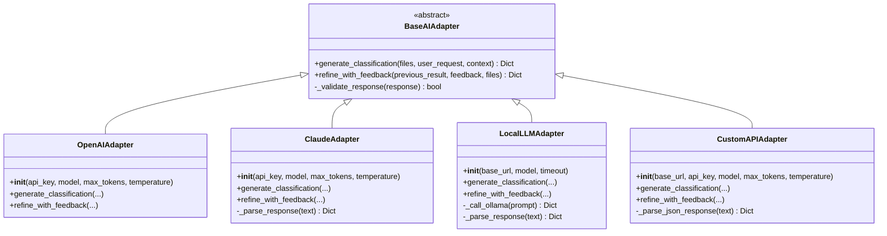
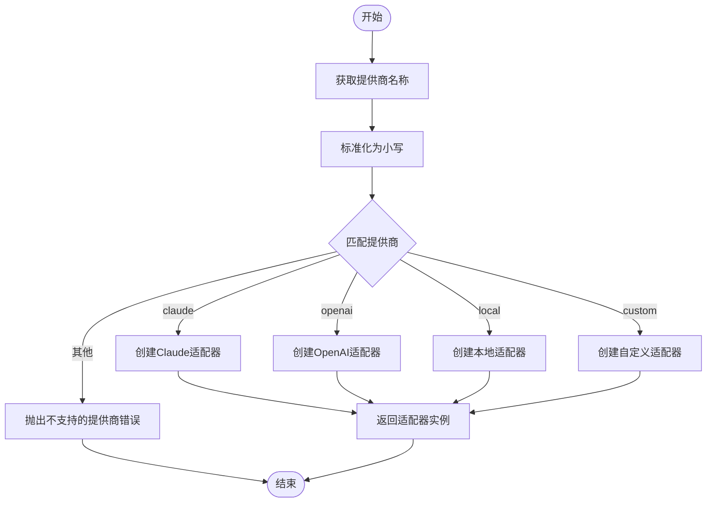
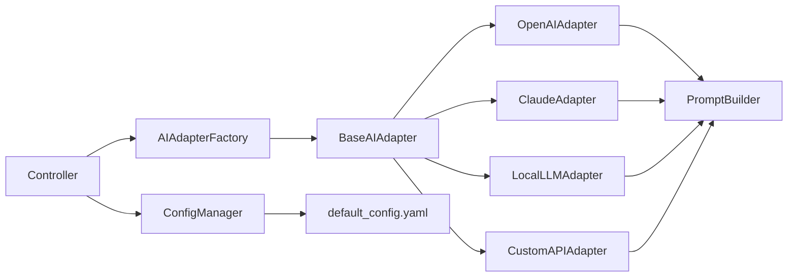

# 适配器模式设计

<cite>
**本文引用的文件**
- [base_adapter.py](file://src/ai/base_adapter.py)
- [adapter_factory.py](file://src/ai/adapter_factory.py)
- [openai_adapter.py](file://src/ai/openai_adapter.py)
- [claude_adapter.py](file://src/ai/claude_adapter.py)
- [local_adapter.py](file://src/ai/local_adapter.py)
- [custom_adapter.py](file://src/ai/custom_adapter.py)
- [prompt_builder.py](file://src/ai/prompt_builder.py)
- [controller.py](file://src/core/controller.py)
- [config.py](file://src/utils/config.py)
- [default_config.yaml](file://config/default_config.yaml)
- [basic_usage.py](file://examples/basic_usage.py)
- [test_custom_adapter.py](file://tests/test_custom_adapter.py)
</cite>

## 目录
1. [简介](#简介)
2. [项目结构](#项目结构)
3. [核心组件](#核心组件)
4. [架构总览](#架构总览)
5. [详细组件分析](#详细组件分析)
6. [依赖关系分析](#依赖关系分析)
7. [性能考量](#性能考量)
8. [故障排除指南](#故障排除指南)
9. [结论](#结论)
10. [附录](#附录)

## 简介
本文件系统性阐述该项目中适配器模式的设计与实现，重点围绕以下目标展开：
- 深入解释 BaseAIAdapter 抽象基类的设计理念、接口规范与实现要求
- 详述适配器模式在 AI 集成中的作用：统一接口抽象、多提供商支持、扩展性设计
- 阐明 AIAdapterFactory 工厂模式的实现原理：静态工厂方法、配置驱动的适配器创建、错误处理机制
- 提供适配器生命周期管理、资源清理、异常处理的最佳实践
- 给出具体使用模式与代码示例路径

## 项目结构
该项目采用模块化分层组织，AI 适配器位于 `src/ai/` 目录，核心控制逻辑位于 `src/core/`，配置与工具位于 `src/utils/`，默认配置位于 `config/default_config.yaml`。适配器模式通过抽象基类与具体实现分离，工厂负责按配置创建不同提供商的适配器实例。

图表来源
- [base_adapter.py](file://src/ai/base_adapter.py#L9-L70)
- [adapter_factory.py](file://src/ai/adapter_factory.py#L11-L98)
- [openai_adapter.py](file://src/ai/openai_adapter.py#L17-L110)
- [claude_adapter.py](file://src/ai/claude_adapter.py#L17-L133)
- [local_adapter.py](file://src/ai/local_adapter.py#L12-L126)
- [custom_adapter.py](file://src/ai/custom_adapter.py#L17-L157)
- [prompt_builder.py](file://src/ai/prompt_builder.py#L7-L172)
- [controller.py](file://src/core/controller.py#L15-L82)
- [config.py](file://src/utils/config.py#L10-L116)
- [default_config.yaml](file://config/default_config.yaml#L1-L79)

章节来源
- [base_adapter.py](file://src/ai/base_adapter.py#L1-L70)
- [adapter_factory.py](file://src/ai/adapter_factory.py#L1-L98)
- [controller.py](file://src/core/controller.py#L1-L200)

## 核心组件
本节聚焦 BaseAIAdapter 抽象基类与 AIAdapterFactory 工厂类，阐明其职责、接口契约与实现约束。

- BaseAIAdapter 抽象基类
  - 角色定位：定义统一的 AI 适配器接口，屏蔽不同提供商的差异
  - 关键方法
    - generate_classification(files, user_request, context) -> Dict[str, Any]
      - 输入：文件列表、用户需求、上下文
      - 输出：包含操作列表的字典
    - refine_with_feedback(previous_result, feedback, files) -> Dict[str, Any]
      - 输入：上一次结果、用户反馈、文件列表
      - 输出：优化后的操作列表
  - 辅助方法
    - _validate_response(response: Dict[str, Any]) -> bool
      - 校验响应格式是否符合约定（包含 operations 字段且为列表，且每条操作包含 type、file、target 等必要字段）

- AIAdapterFactory 工厂类
  - 角色定位：根据提供商名称与配置字典创建对应适配器实例
  - 核心方法
    - create_adapter(provider: str, config: Dict[str, Any]) -> BaseAIAdapter
      - provider 支持：claude、openai、local、custom
      - 返回对应适配器实例
    - 各提供商专用创建方法：_create_claude_adapter、_create_openai_adapter、_create_local_adapter、_create_custom_adapter
  - 错误处理
    - 不支持的提供商：抛出 ValueError
    - 缺失必要配置（如 API Key、base_url、model 等）：抛出 ValueError 或运行时异常

章节来源
- [base_adapter.py](file://src/ai/base_adapter.py#L9-L70)
- [adapter_factory.py](file://src/ai/adapter_factory.py#L11-L98)

## 架构总览
该系统通过“抽象接口 + 多实现 + 工厂创建”的模式，实现了对多种 AI 提供商的统一接入。Controller 在初始化阶段根据配置选择使用 LangChain Agent 或传统适配器模式；当使用传统模式时，通过 AIAdapterFactory 创建具体适配器实例，并交由 SmartClassifier 执行分类任务。

图表来源
- [controller.py](file://src/core/controller.py#L15-L82)
- [adapter_factory.py](file://src/ai/adapter_factory.py#L14-L37)
- [openai_adapter.py](file://src/ai/openai_adapter.py#L43-L76)
- [claude_adapter.py](file://src/ai/claude_adapter.py#L43-L77)
- [local_adapter.py](file://src/ai/local_adapter.py#L44-L66)
- [custom_adapter.py](file://src/ai/custom_adapter.py#L70-L103)

## 详细组件分析

### BaseAIAdapter 抽象基类
- 设计理念
  - 通过抽象方法定义统一接口，确保不同提供商的适配器对外行为一致
  - 通过辅助校验方法保证响应格式一致性，降低上层调用的错误风险
- 接口规范
  - generate_classification：面向“一次性分类”场景
  - refine_with_feedback：面向“基于反馈迭代优化”的场景
  - _validate_response：统一的响应格式校验，避免上层重复校验
- 实现要求
  - 子类需严格遵循输入输出契约
  - 子类应处理各自提供商的 API 调用细节与异常转换

图表来源
- [base_adapter.py](file://src/ai/base_adapter.py#L9-L70)
- [openai_adapter.py](file://src/ai/openai_adapter.py#L17-L110)
- [claude_adapter.py](file://src/ai/claude_adapter.py#L17-L133)
- [local_adapter.py](file://src/ai/local_adapter.py#L12-L126)
- [custom_adapter.py](file://src/ai/custom_adapter.py#L17-L157)

章节来源
- [base_adapter.py](file://src/ai/base_adapter.py#L9-L70)

### AIAdapterFactory 工厂模式
- 实现原理
  - 静态工厂方法 create_adapter：根据 provider 名称分派到对应创建方法
  - 各提供商创建方法负责读取配置并构造具体适配器实例
- 配置驱动
  - ConfigManager.get_ai_config(provider) 从配置文件与环境变量合并配置
  - default_config.yaml 定义默认提供商与各提供商的默认参数
- 错误处理
  - 不支持的提供商：抛出 ValueError
  - 缺失必要配置（如 API Key、base_url、model）：抛出 ValueError 或运行时异常
- 生命周期管理
  - 适配器实例在工厂外部创建，工厂不负责销毁；适配器内部通常持有客户端连接，应在上层进行资源管理

图表来源
- [adapter_factory.py](file://src/ai/adapter_factory.py#L14-L37)
- [config.py](file://src/utils/config.py#L76-L111)
- [default_config.yaml](file://config/default_config.yaml#L2-L24)

章节来源
- [adapter_factory.py](file://src/ai/adapter_factory.py#L11-L98)
- [config.py](file://src/utils/config.py#L76-L111)
- [default_config.yaml](file://config/default_config.yaml#L2-L24)

### 具体适配器实现

#### OpenAIAdapter
- 特点
  - 使用 openai 库进行 API 调用
  - 通过 response_format 指定 JSON 输出，简化解析
  - 异常转换为 RuntimeError，便于上层捕获
- 关键实现要点
  - generate_classification/refine_with_feedback：构建 Prompt，调用 Chat Completions，解析 JSON，校验响应
  - 参数校验与导入检查：缺失 API Key 或库不可用时抛出异常

章节来源
- [openai_adapter.py](file://src/ai/openai_adapter.py#L17-L110)

#### ClaudeAdapter
- 特点
  - 使用 anthropic 库进行消息调用
  - 响应可能包含 Markdown 代码块，需额外解析
  - 提供 _parse_response 方法处理多种 JSON 表达形式
- 关键实现要点
  - _parse_response：尝试直接解析，失败时从代码块或文本中提取 JSON

章节来源
- [claude_adapter.py](file://src/ai/claude_adapter.py#L17-L133)

#### LocalLLMAdapter
- 特点
  - 通过 HTTP 请求调用本地 Ollama 服务
  - 初始化时进行连接测试，确保服务可用
  - 提供 _call_ollama 和 _parse_response 处理响应
- 关键实现要点
  - _test_connection：短超时请求 /api/tags，失败抛出 ConnectionError
  - _call_ollama：POST /api/generate，设置 format=json，解析响应文本

章节来源
- [local_adapter.py](file://src/ai/local_adapter.py#L12-L126)

#### CustomAPIAdapter
- 特点
  - 基于 OpenAI 兼容 API 的通用适配器
  - 支持 Azure OpenAI、通义千问、文心一言、智谱AI、Moonshot、DeepSeek 等
  - 通过自定义 base_url 与 api_key 实现多服务接入
- 关键实现要点
  - 使用 openai.OpenAI 客户端，但传入自定义 base_url
  - _parse_json_response：增强 JSON 解析，兼容多种输出格式

章节来源
- [custom_adapter.py](file://src/ai/custom_adapter.py#L17-L157)

### PromptBuilder 提示词构建器
- 角色：为各类适配器构建统一的系统提示与用户提示
- 功能
  - SYSTEM_PROMPT：定义文件整理助手的角色与输出格式要求
  - build_classification_prompt：整合用户需求、已知规则、历史反馈、文件列表
  - build_refinement_prompt：基于上次结果与用户反馈生成优化提示
  - _format_file_list/_format_metadata：格式化文件信息，限制显示数量

章节来源
- [prompt_builder.py](file://src/ai/prompt_builder.py#L7-L172)

### Controller 控制器与配置集成
- 角色：协调扫描、分类、执行与安全组件
- 适配器集成
  - 初始化时根据配置选择 Agent 模式或传统适配器模式
  - 传统模式下通过 AIAdapterFactory.create_adapter(provider, ai_config) 创建适配器
  - 将适配器注入 SmartClassifier 执行分类
- 配置来源
  - ConfigManager.get_ai_config(provider) 合并配置与环境变量
  - default_config.yaml 提供默认提供商与参数

章节来源
- [controller.py](file://src/core/controller.py#L15-L82)
- [config.py](file://src/utils/config.py#L76-L111)
- [default_config.yaml](file://config/default_config.yaml#L2-L24)

## 依赖关系分析
- 组件耦合
  - Controller 依赖 AIAdapterFactory 与 BaseAIAdapter 抽象，实现对具体提供商的解耦
  - 各适配器依赖 PromptBuilder 构建统一提示词，减少重复逻辑
  - ConfigManager 与 default_config.yaml 提供集中配置，支持环境变量覆盖
- 外部依赖
  - OpenAI 适配器依赖 openai 库
  - Claude 适配器依赖 anthropic 库
  - 本地适配器依赖 requests 库
- 潜在循环依赖
  - 适配器与工厂之间为单向依赖，无循环
  - Controller 与 AI 层通过抽象接口耦合，保持低耦合高内聚

图表来源
- [controller.py](file://src/core/controller.py#L15-L82)
- [adapter_factory.py](file://src/ai/adapter_factory.py#L11-L98)
- [base_adapter.py](file://src/ai/base_adapter.py#L9-L70)
- [prompt_builder.py](file://src/ai/prompt_builder.py#L7-L172)
- [config.py](file://src/utils/config.py#L10-L116)
- [default_config.yaml](file://config/default_config.yaml#L1-L79)

章节来源
- [controller.py](file://src/core/controller.py#L15-L82)
- [adapter_factory.py](file://src/ai/adapter_factory.py#L11-L98)
- [base_adapter.py](file://src/ai/base_adapter.py#L9-L70)
- [prompt_builder.py](file://src/ai/prompt_builder.py#L7-L172)
- [config.py](file://src/utils/config.py#L10-L116)
- [default_config.yaml](file://config/default_config.yaml#L1-L79)

## 性能考量
- 响应解析与校验
  - 各适配器均调用 _validate_response 校验响应格式，避免上层重复校验，提升一致性
- Prompt 构建优化
  - PromptBuilder 对文件列表进行截断显示，避免超大数据量导致 Token 超限
- 网络调用与超时
  - LocalLLMAdapter 提供 timeout 参数，防止阻塞等待
  - OpenAI/Claude/Custom 适配器在调用时捕获异常并转换为统一错误类型
- 批处理与并发
  - Controller 的 classify_batch 用于批量处理，结合 SmartClassifier 的批处理能力可提升吞吐

[本节为通用性能讨论，不直接分析具体文件]

## 故障排除指南
- 常见错误与处理
  - 不支持的提供商：检查 provider 名称是否为 claude、openai、local、custom 之一
  - 缺失 API Key：确保环境变量或配置中提供正确的密钥
  - 本地服务不可达：检查 Ollama 服务是否启动，base_url 是否正确
  - JSON 解析失败：确认 AI 输出符合系统提示中的 JSON 格式要求
- 单元测试参考
  - 自定义适配器测试覆盖了初始化、参数校验与 JSON 解析场景
- 调试建议
  - 在 Controller 中打印当前使用的提供商与配置
  - 使用 ConfigManager.get_ai_config(provider) 验证最终配置
  - 在适配器中增加日志记录 API 调用与响应状态

章节来源
- [test_custom_adapter.py](file://tests/test_custom_adapter.py#L1-L85)
- [config.py](file://src/utils/config.py#L76-L111)
- [local_adapter.py](file://src/ai/local_adapter.py#L33-L42)

## 结论
本项目通过 BaseAIAdapter 抽象基类与 AIAdapterFactory 工厂模式，成功实现了对多 AI 提供商的统一接入与灵活切换。适配器模式在以下方面体现出显著价值：
- 统一接口抽象：屏蔽不同提供商的差异，简化上层调用
- 多提供商支持：通过工厂方法快速扩展新提供商
- 扩展性设计：新增适配器仅需实现抽象接口与工厂创建方法
- 配置驱动：结合 ConfigManager 与 default_config.yaml，实现零代码变更的提供商切换
- 错误处理与健壮性：通过统一异常转换与响应校验，提升系统稳定性

最佳实践建议：
- 适配器实现严格遵循接口契约，确保响应格式一致性
- 工厂方法集中处理配置校验与异常转换
- 在 Controller 层统一调度，避免业务逻辑分散
- 使用单元测试覆盖关键路径（初始化、参数校验、JSON 解析）

[本节为总结性内容，不直接分析具体文件]

## 附录

### 使用模式与示例路径
- 基本使用示例
  - 初始化控制器并生成整理方案
  - 交互式示例：基于用户反馈优化分类方案
  - 撤销示例：利用 UndoManager 撤销操作
- 示例路径
  - [basic_usage.py](file://examples/basic_usage.py#L7-L89)

章节来源
- [basic_usage.py](file://examples/basic_usage.py#L7-L89)