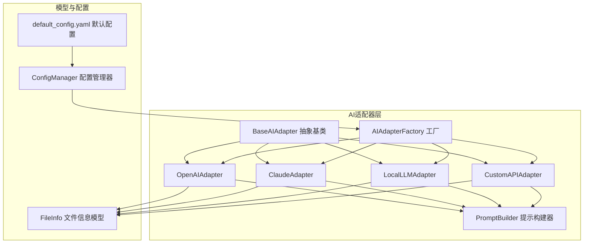
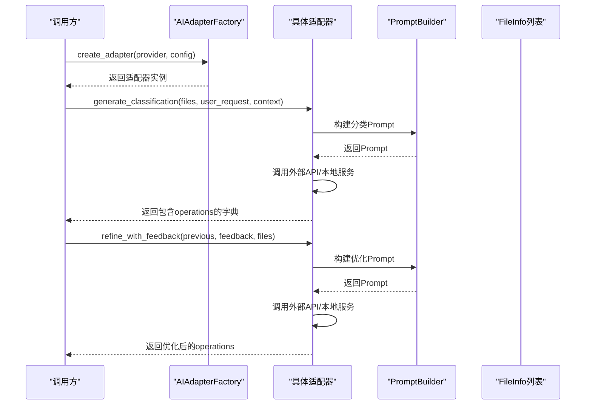
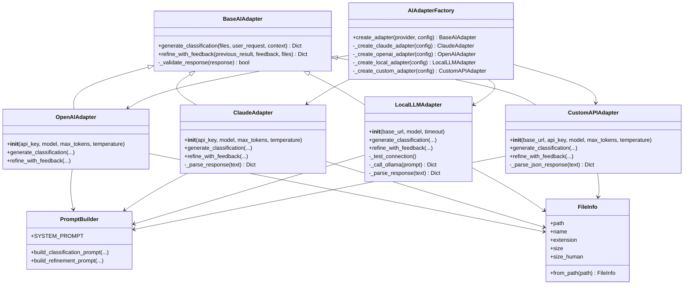

# AI适配器API

<cite>
**本文引用的文件**
- [src/ai/base_adapter.py](file://src/ai/base_adapter.py)
- [src/ai/openai_adapter.py](file://src/ai/openai_adapter.py)
- [src/ai/claude_adapter.py](file://src/ai/claude_adapter.py)
- [src/ai/local_adapter.py](file://src/ai/local_adapter.py)
- [src/ai/custom_adapter.py](file://src/ai/custom_adapter.py)
- [src/ai/adapter_factory.py](file://src/ai/adapter_factory.py)
- [src/ai/prompt_builder.py](file://src/ai/prompt_builder.py)
- [src/models/file_info.py](file://src/models/file_info.py)
- [src/utils/config.py](file://src/utils/config.py)
- [config/default_config.yaml](file://config/default_config.yaml)
- [examples/basic_usage.py](file://examples/basic_usage.py)
- [examples/custom_api_example.py](file://examples/custom_api_example.py)
- [tests/test_custom_adapter.py](file://tests/test_custom_adapter.py)
- [docs/CUSTOM_API.md](file://docs/CUSTOM_API.md)
</cite>

## 目录
1. [简介](#简介)
2. [项目结构](#项目结构)
3. [核心组件](#核心组件)
4. [架构总览](#架构总览)
5. [详细组件分析](#详细组件分析)
6. [依赖关系分析](#依赖关系分析)
7. [性能考量](#性能考量)
8. [故障排查指南](#故障排查指南)
9. [结论](#结论)
10. [附录](#附录)

## 简介
本文件系统化地文档化了AI适配器API，涵盖抽象基类设计规范、各具体适配器实现差异、初始化参数与配置要求、错误处理策略、以及工厂模式的使用与动态创建流程。同时提供自定义适配器实现指南与集成新AI提供商的实践建议，并通过示例与测试用例路径帮助读者快速上手。

## 项目结构
AI适配器相关代码位于 src/ai 目录，围绕统一的抽象基类 BaseAIAdapter，提供 OpenAI、Claude、本地模型（Local）、以及自定义兼容OpenAI API的适配器；配套的 PromptBuilder 负责构造系统提示与任务Prompt；工厂类 AIAdapterFactory 负责按配置动态创建适配器实例；配置由 ConfigManager 从 YAML 和 .env 中加载。

图表来源
- [src/ai/base_adapter.py](file://src/ai/base_adapter.py#L9-L70)
- [src/ai/openai_adapter.py](file://src/ai/openai_adapter.py#L17-L110)
- [src/ai/claude_adapter.py](file://src/ai/claude_adapter.py#L17-L133)
- [src/ai/local_adapter.py](file://src/ai/local_adapter.py#L12-L126)
- [src/ai/custom_adapter.py](file://src/ai/custom_adapter.py#L17-L157)
- [src/ai/adapter_factory.py](file://src/ai/adapter_factory.py#L11-L98)
- [src/ai/prompt_builder.py](file://src/ai/prompt_builder.py#L7-L172)
- [src/models/file_info.py](file://src/models/file_info.py#L9-L48)
- [src/utils/config.py](file://src/utils/config.py#L10-L116)
- [config/default_config.yaml](file://config/default_config.yaml#L1-L79)

章节来源
- [src/ai/base_adapter.py](file://src/ai/base_adapter.py#L1-L70)
- [src/ai/adapter_factory.py](file://src/ai/adapter_factory.py#L1-L98)
- [src/ai/prompt_builder.py](file://src/ai/prompt_builder.py#L1-L172)
- [src/models/file_info.py](file://src/models/file_info.py#L1-L48)
- [src/utils/config.py](file://src/utils/config.py#L1-L116)
- [config/default_config.yaml](file://config/default_config.yaml#L1-L79)

## 核心组件
- 抽象基类 BaseAIAdapter：定义统一接口 generate_classification 与 refine_with_feedback，并提供响应格式校验逻辑。
- 具体适配器：
  - OpenAIAdapter：基于 openai 库，调用 chat.completions 接口，强制 JSON 输出格式。
  - ClaudeAdapter：基于 anthropic 库，调用 messages 接口，具备更强的JSON提取容错能力。
  - LocalLLMAdapter：调用本地 Ollama 服务，支持连接测试与超时控制。
  - CustomAPIAdapter：兼容OpenAI API格式的第三方服务，支持 Azure OpenAI、DashScope、千帆、GLM、Moonshot、DeepSeek 等。
- 工厂类 AIAdapterFactory：根据 provider 名称与配置字典创建对应适配器实例，负责参数校验与默认值注入。
- PromptBuilder：构建系统提示与任务Prompt，统一输出格式要求与字段约束。
- 配置与模型：ConfigManager 从 YAML 与 .env 加载配置；FileInfo 作为输入数据载体。

章节来源
- [src/ai/base_adapter.py](file://src/ai/base_adapter.py#L9-L70)
- [src/ai/openai_adapter.py](file://src/ai/openai_adapter.py#L17-L110)
- [src/ai/claude_adapter.py](file://src/ai/claude_adapter.py#L17-L133)
- [src/ai/local_adapter.py](file://src/ai/local_adapter.py#L12-L126)
- [src/ai/custom_adapter.py](file://src/ai/custom_adapter.py#L17-L157)
- [src/ai/adapter_factory.py](file://src/ai/adapter_factory.py#L11-L98)
- [src/ai/prompt_builder.py](file://src/ai/prompt_builder.py#L7-L172)
- [src/models/file_info.py](file://src/models/file_info.py#L9-L48)
- [src/utils/config.py](file://src/utils/config.py#L10-L116)

## 架构总览
AI适配器采用“统一抽象 + 多实现 + 工厂创建”的架构，通过 PromptBuilder 统一提示格式，确保各适配器返回一致的数据结构。工厂类负责参数解析与实例化，配置管理器负责从多种来源合并配置。

图表来源
- [src/ai/adapter_factory.py](file://src/ai/adapter_factory.py#L14-L37)
- [src/ai/openai_adapter.py](file://src/ai/openai_adapter.py#L43-L76)
- [src/ai/claude_adapter.py](file://src/ai/claude_adapter.py#L43-L77)
- [src/ai/local_adapter.py](file://src/ai/local_adapter.py#L44-L66)
- [src/ai/custom_adapter.py](file://src/ai/custom_adapter.py#L70-L103)
- [src/ai/prompt_builder.py](file://src/ai/prompt_builder.py#L40-L84)

## 详细组件分析

### 抽象基类 BaseAIAdapter 设计规范
- 必须实现的方法
  - generate_classification(files, user_request, context) -> Dict[str, Any]
  - refine_with_feedback(previous_result, feedback, files) -> Dict[str, Any]
- 接口契约与参数约束
  - files: List[FileInfo]，至少包含文件路径、名称、扩展名、大小、时间戳等字段。
  - user_request: str，用户需求描述。
  - context: Dict[str, Any]，可包含 learned_rules、history 等上下文信息。
  - 返回值必须包含 operations 字段，且为列表；列表中每个元素需包含 type、file、target 字段；可选 reason、confidence。
- 响应格式校验
  - _validate_response(response)：校验 response 类型、必需字段与操作项字段完整性。

章节来源
- [src/ai/base_adapter.py](file://src/ai/base_adapter.py#L9-L70)
- [src/models/file_info.py](file://src/models/file_info.py#L9-L48)

### OpenAI 适配器 OpenAIAdapter
- 初始化参数
  - api_key: str，必填；否则抛出异常。
  - model: str，默认 gpt-4-turbo-preview。
  - max_tokens: int，默认 4096。
  - temperature: float，默认 0.7。
- 特殊接口与行为
  - 强制使用 response_format={"type": "json_object"}，确保返回JSON。
  - 调用 chat.completions 接口，解析响应后进行格式校验。
- 错误处理
  - 导入 openai 失败时抛 ImportError。
  - API调用异常统一包装为 RuntimeError 并附带错误信息。

章节来源
- [src/ai/openai_adapter.py](file://src/ai/openai_adapter.py#L17-L110)
- [src/ai/base_adapter.py](file://src/ai/base_adapter.py#L52-L70)

### Claude 适配器 ClaudeAdapter
- 初始化参数
  - api_key: str，必填；否则抛出异常。
  - model: str，默认 claude-3-5-sonnet-20241022。
  - max_tokens: int，默认 4096。
  - temperature: float，默认 0.7。
- 特殊接口与行为
  - 调用 anthropic.messages.create 接口，使用 system 字段传入系统提示。
  - _parse_response 支持直接JSON、Markdown代码块、以及从文本中提取JSON的容错策略。
- 错误处理
  - 导入 anthropic 失败时抛 ImportError。
  - API调用异常统一包装为 RuntimeError。

章节来源
- [src/ai/claude_adapter.py](file://src/ai/claude_adapter.py#L17-L133)
- [src/ai/prompt_builder.py](file://src/ai/prompt_builder.py#L11-L37)

### 本地模型适配器 LocalLLMAdapter
- 初始化参数
  - base_url: str，默认 http://localhost:11434；末尾斜杠会被去除。
  - model: str，默认 llama3.1。
  - timeout: int，默认 120 秒。
- 特殊接口与行为
  - _test_connection：启动时检查 Ollama 服务可用性。
  - _call_ollama：调用 /api/generate，设置 format=json 并解析响应。
  - _parse_response：支持直接JSON与从文本中提取JSON。
- 错误处理
  - 连接失败抛出 ConnectionError，并给出启动指引。
  - API调用异常统一包装为 RuntimeError。

章节来源
- [src/ai/local_adapter.py](file://src/ai/local_adapter.py#L12-L126)

### 自定义API适配器 CustomAPIAdapter
- 初始化参数
  - base_url: str，必填；否则抛出异常。
  - api_key: str，必填；否则抛出异常。
  - model: str，必填；否则抛出异常。
  - max_tokens: int，默认 4096。
  - temperature: float，默认 0.7。
- 特殊接口与行为
  - 使用 openai.OpenAI 客户端，但指定自定义 base_url，兼容 Azure OpenAI、DashScope、千帆、GLM、Moonshot、DeepSeek 等。
  - _parse_json_response：支持直接JSON、Markdown代码块、以及从混合文本中提取JSON。
- 错误处理
  - 导入 openai 失败时抛 ImportError。
  - API调用异常统一包装为 RuntimeError。

章节来源
- [src/ai/custom_adapter.py](file://src/ai/custom_adapter.py#L17-L157)
- [docs/CUSTOM_API.md](file://docs/CUSTOM_API.md#L1-L282)

### 工厂模式与动态创建
- create_adapter(provider, config)：根据 provider 名称创建对应适配器。
  - 支持 provider: claude | openai | local | custom。
  - 不支持的 provider 抛出 ValueError。
- 参数校验与默认值
  - Claude/OpenAI：若未提供 api_key，抛出异常；其余参数使用默认值。
  - Local：使用默认 base_url、model、timeout。
  - Custom：必须提供 base_url、api_key、model，其余参数使用默认值。
- 配置来源
  - ConfigManager.get_ai_config(provider) 从 YAML 与 .env 合并配置，优先读取环境变量中的 API Key 与关键参数。

章节来源
- [src/ai/adapter_factory.py](file://src/ai/adapter_factory.py#L14-L37)
- [src/ai/adapter_factory.py](file://src/ai/adapter_factory.py#L39-L98)
- [src/utils/config.py](file://src/utils/config.py#L76-L111)
- [config/default_config.yaml](file://config/default_config.yaml#L1-L79)

### PromptBuilder 提示构建器
- SYSTEM_PROMPT：定义系统角色、输出格式要求、字段约束与重要规则。
- build_classification_prompt：整合用户需求、已知规则、历史反馈、文件列表与任务说明。
- build_refinement_prompt：整合上次结果、用户反馈、当前文件列表与任务说明。
- _format_file_list/_format_metadata：对文件信息进行格式化展示，限制最大显示数量。

章节来源
- [src/ai/prompt_builder.py](file://src/ai/prompt_builder.py#L7-L172)

### 数据模型 FileInfo
- 字段：path、name、extension、size、created_time、modified_time、metadata、content_sample。
- 辅助属性 size_human：人类可读的文件大小。
- 工具方法 from_path：从文件路径创建 FileInfo 实例。

章节来源
- [src/models/file_info.py](file://src/models/file_info.py#L9-L48)

## 依赖关系分析
- 组件耦合
  - 所有具体适配器均继承 BaseAIAdapter，保证统一接口契约。
  - 适配器依赖 PromptBuilder 构造提示，依赖 FileInfo 作为输入。
  - 工厂类依赖各具体适配器类，负责实例化与参数注入。
  - 配置管理器为工厂与适配器提供参数来源。
- 外部依赖
  - OpenAIAdapter 依赖 openai 库。
  - ClaudeAdapter 依赖 anthropic 库。
  - LocalLLMAdapter 依赖 requests 库与本地 Ollama 服务。
  - CustomAPIAdapter 依赖 openai 库与第三方兼容OpenAI API的服务。

图表来源
- [src/ai/base_adapter.py](file://src/ai/base_adapter.py#L9-L70)
- [src/ai/openai_adapter.py](file://src/ai/openai_adapter.py#L17-L110)
- [src/ai/claude_adapter.py](file://src/ai/claude_adapter.py#L17-L133)
- [src/ai/local_adapter.py](file://src/ai/local_adapter.py#L12-L126)
- [src/ai/custom_adapter.py](file://src/ai/custom_adapter.py#L17-L157)
- [src/ai/adapter_factory.py](file://src/ai/adapter_factory.py#L11-L98)
- [src/ai/prompt_builder.py](file://src/ai/prompt_builder.py#L7-L172)
- [src/models/file_info.py](file://src/models/file_info.py#L9-L48)

## 性能考量
- 超时与连接测试
  - LocalLLMAdapter 在初始化时进行连接测试，避免后续调用失败。
  - LocalLLMAdapter 支持 timeout 参数，防止长时间阻塞。
- 响应解析与容错
  - ClaudeAdapter 与 CustomAPIAdapter 均实现了多策略JSON解析，提升对非标准响应的兼容性。
- 输出格式一致性
  - 所有适配器均返回统一的 operations 结构，便于上层处理与日志记录。

章节来源
- [src/ai/local_adapter.py](file://src/ai/local_adapter.py#L33-L42)
- [src/ai/claude_adapter.py](file://src/ai/claude_adapter.py#L113-L133)
- [src/ai/custom_adapter.py](file://src/ai/custom_adapter.py#L138-L157)

## 故障排查指南
- 常见错误与定位
  - API Key缺失：Claude/OpenAI/Custom 适配器在初始化时会校验 api_key；Local 适配器无此限制。
  - 导入库缺失：OpenAI/Claude/Custom 适配器在导入第三方库失败时抛 ImportError。
  - 响应格式不正确：_validate_response 校验失败时抛 ValueError；Claude/Custom 适配器还提供 JSON 解析容错。
  - 本地服务不可达：LocalLLMAdapter 在初始化时检测 Ollama 服务，失败时抛 ConnectionError 并提示启动命令。
- 配置问题
  - 环境变量优先：ConfigManager 会从 .env 读取 API Key 与关键参数，覆盖 YAML 中的默认值。
  - Provider不支持：工厂类在创建适配器时若 provider 名称不在支持列表内，抛出 ValueError。
- 测试与验证
  - 可参考示例脚本与测试用例路径，验证初始化参数、JSON解析与错误处理行为。

章节来源
- [src/ai/openai_adapter.py](file://src/ai/openai_adapter.py#L31-L41)
- [src/ai/claude_adapter.py](file://src/ai/claude_adapter.py#L31-L41)
- [src/ai/local_adapter.py](file://src/ai/local_adapter.py#L33-L42)
- [src/ai/custom_adapter.py](file://src/ai/custom_adapter.py#L48-L68)
- [src/ai/adapter_factory.py](file://src/ai/adapter_factory.py#L36-L37)
- [src/utils/config.py](file://src/utils/config.py#L84-L111)
- [tests/test_custom_adapter.py](file://tests/test_custom_adapter.py#L8-L85)

## 结论
AI适配器API通过统一抽象与工厂模式，提供了对多家AI提供商的一致接入体验。BaseAIAdapter 明确了接口契约与响应格式约束，具体适配器在保持一致性的前提下，针对不同提供商的API特性进行了差异化实现与容错处理。配合 PromptBuilder 与 ConfigManager，开发者可以快速集成新的AI提供商或本地模型服务。

## 附录

### 使用指南与最佳实践
- 动态创建适配器
  - 使用 AIAdapterFactory.create_adapter(provider, config) 根据配置动态创建适配器实例。
  - 通过 ConfigManager.get_ai_config(provider) 合并 YAML 与 .env 配置。
- 配置管理
  - 在 default_config.yaml 中设置默认 provider 与各提供商参数。
  - 在 .env 中设置敏感信息（如 API Key），避免硬编码。
- 错误回退机制
  - 若某提供商不可用，可在配置中切换至其他 provider，或在应用层捕获异常后降级处理。
- 自定义适配器开发
  - 继承 BaseAIAdapter，实现 generate_classification 与 refine_with_feedback。
  - 使用 PromptBuilder 构建 Prompt，确保返回统一的 operations 结构。
  - 在工厂类中注册新适配器的创建方法，以便通过 provider 名称动态创建。

章节来源
- [src/ai/adapter_factory.py](file://src/ai/adapter_factory.py#L14-L37)
- [src/utils/config.py](file://src/utils/config.py#L76-L111)
- [config/default_config.yaml](file://config/default_config.yaml#L1-L79)
- [examples/basic_usage.py](file://examples/basic_usage.py#L7-L35)
- [examples/custom_api_example.py](file://examples/custom_api_example.py#L7-L81)

### 代码示例路径
- 基本使用示例
  - [examples/basic_usage.py](file://examples/basic_usage.py#L7-L35)
  - [examples/basic_usage.py](file://examples/basic_usage.py#L38-L62)
- 自定义API使用示例
  - [examples/custom_api_example.py](file://examples/custom_api_example.py#L7-L25)
  - [examples/custom_api_example.py](file://examples/custom_api_example.py#L28-L44)
  - [examples/custom_api_example.py](file://examples/custom_api_example.py#L47-L62)
  - [examples/custom_api_example.py](file://examples/custom_api_example.py#L65-L81)
- 测试用例路径
  - [tests/test_custom_adapter.py](file://tests/test_custom_adapter.py#L8-L61)
  - [tests/test_custom_adapter.py](file://tests/test_custom_adapter.py#L63-L85)