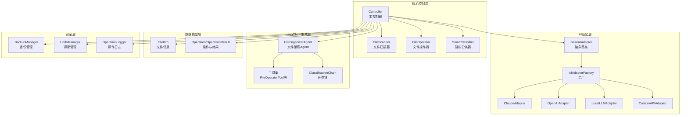
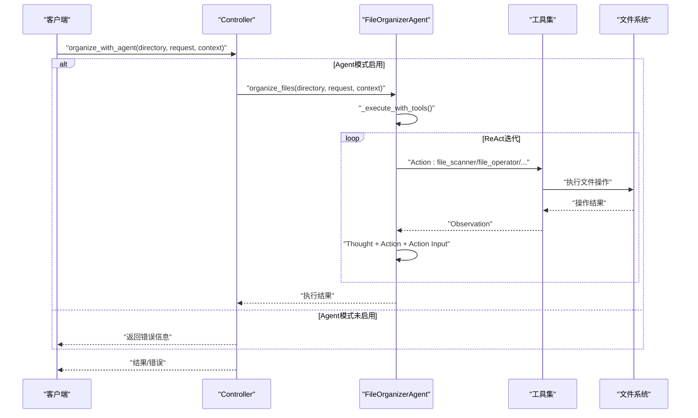
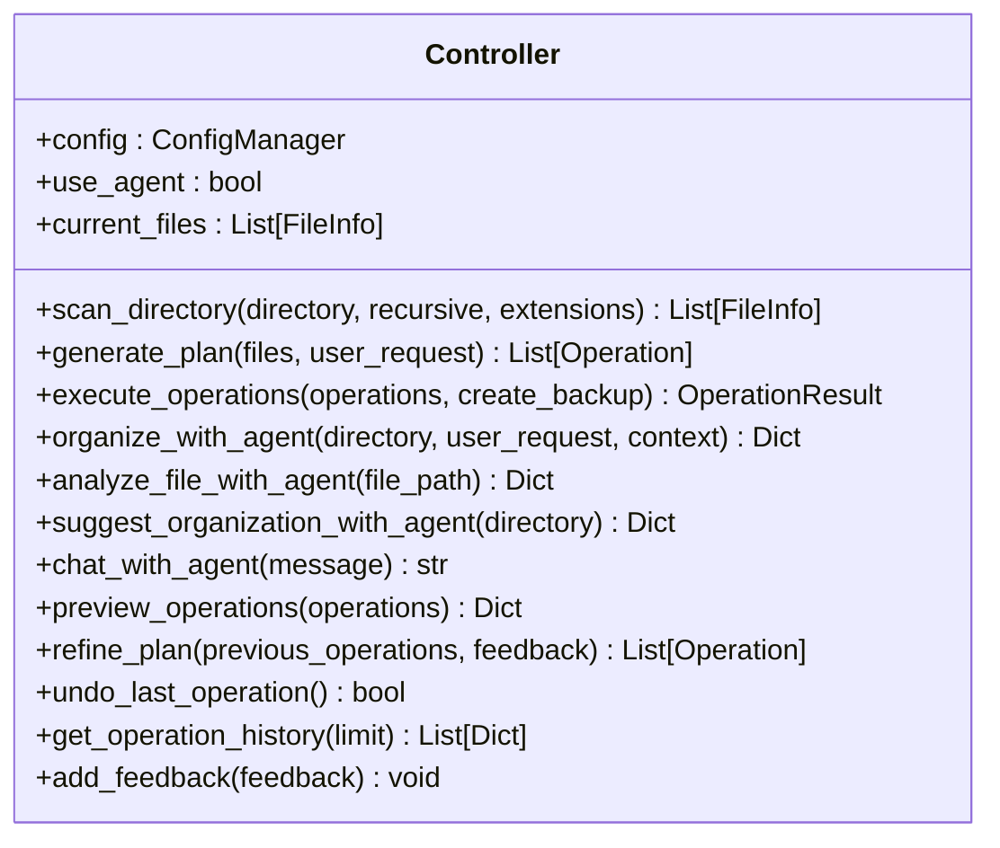
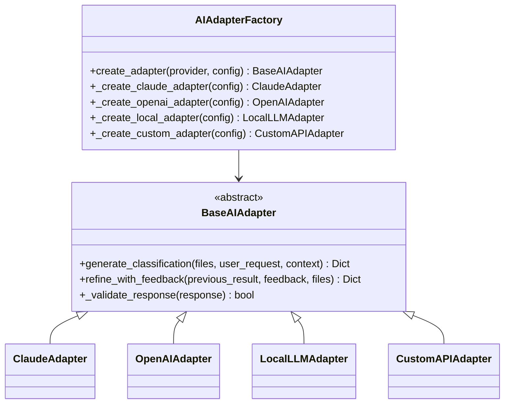
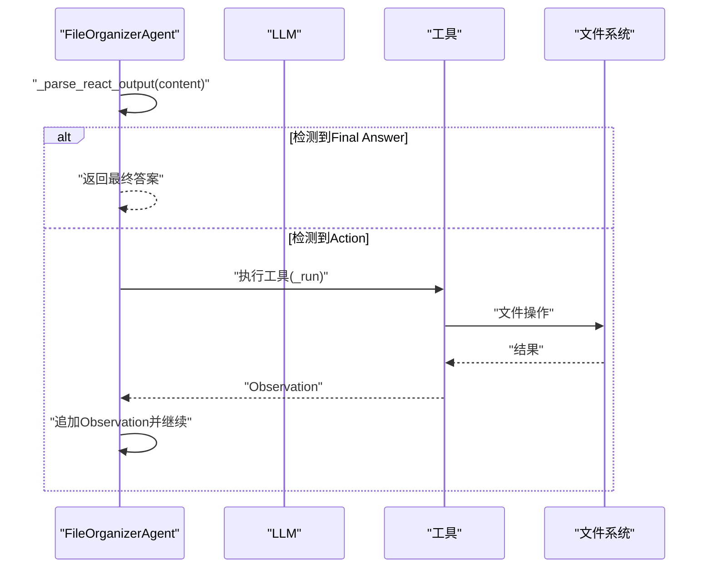
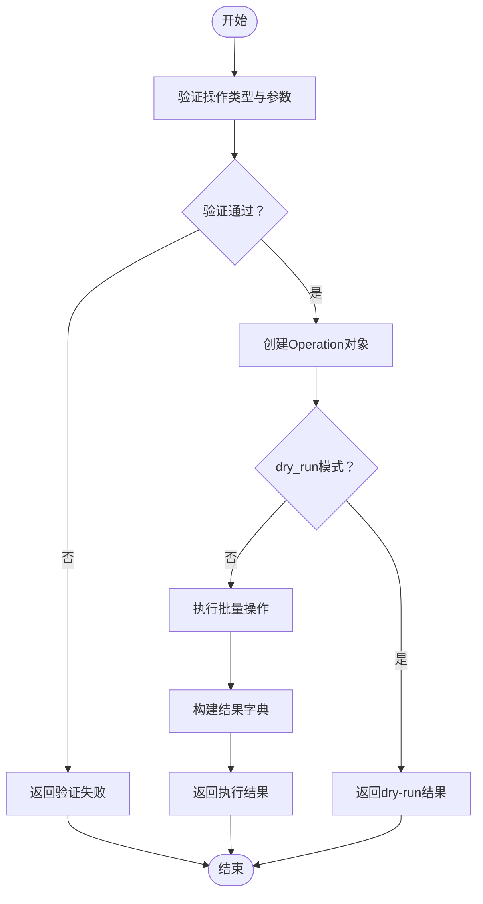
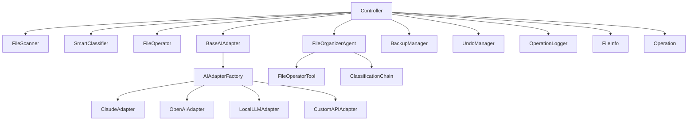

# API参考文档

<cite>
**本文档引用的文件**
- [src/core/controller.py](file://src/core/controller.py)
- [src/ai/base_adapter.py](file://src/ai/base_adapter.py)
- [src/ai/adapter_factory.py](file://src/ai/adapter_factory.py)
- [src/langchain_integration/agent.py](file://src/langchain_integration/agent.py)
- [src/langchain_integration/tools/file_operator_tool.py](file://src/langchain_integration/tools/file_operator_tool.py)
- [src/langchain_integration/chains/classification_chain.py](file://src/langchain_integration/chains/classification_chain.py)
- [src/models/file_info.py](file://src/models/file_info.py)
- [src/models/operation.py](file://src/models/operation.py)
- [src/utils/config.py](file://src/utils/config.py)
- [src/safety/backup.py](file://src/safety/backup.py)
- [src/safety/undo_manager.py](file://src/safety/undo_manager.py)
- [examples/basic_usage.py](file://examples/basic_usage.py)
- [examples/custom_api_example.py](file://examples/custom_api_example.py)
- [docs/API.md](file://docs/API.md)
- [docs/CUSTOM_API.md](file://docs/CUSTOM_API.md)
</cite>

## 目录
1. [简介](#简介)
2. [项目结构](#项目结构)
3. [核心组件](#核心组件)
4. [架构概览](#架构概览)
5. [详细组件分析](#详细组件分析)
6. [依赖关系分析](#依赖关系分析)
7. [性能考虑](#性能考虑)
8. [故障排除指南](#故障排除指南)
9. [结论](#结论)
10. [附录](#附录)

## 简介
本API参考文档面向开发者，系统性地阐述智能文件整理系统的接口设计规范、方法签名、参数定义与返回值格式。重点覆盖：
- Controller控制器的公共接口、事件回调与状态管理
- AI适配器接口的抽象方法、实现要求与错误处理
- LangChain Agent的API规范、工具接口与链式调用接口
- 版本管理、兼容性保证与废弃策略

## 项目结构
系统采用模块化设计，核心模块包括：
- 核心控制层：负责协调扫描、分类、执行与安全机制
- AI适配层：统一AI接口，支持多种提供商
- LangChain集成层：Agent与工具链，实现ReAct推理与工具调用
- 数据模型层：文件信息与操作模型
- 安全层：备份、日志与撤销管理
- 工具与配置：配置管理与实用工具

**图表来源**
- [src/core/controller.py](file://src/core/controller.py#L15-L310)
- [src/ai/base_adapter.py](file://src/ai/base_adapter.py#L9-L70)
- [src/ai/adapter_factory.py](file://src/ai/adapter_factory.py#L11-L98)
- [src/langchain_integration/agent.py](file://src/langchain_integration/agent.py#L21-L576)
- [src/models/file_info.py](file://src/models/file_info.py#L9-L48)
- [src/models/operation.py](file://src/models/operation.py#L10-L54)
- [src/safety/backup.py](file://src/safety/backup.py#L10-L152)
- [src/safety/undo_manager.py](file://src/safety/undo_manager.py#L10-L155)

**章节来源**
- [src/core/controller.py](file://src/core/controller.py#L15-L310)
- [src/ai/base_adapter.py](file://src/ai/base_adapter.py#L9-L70)
- [src/ai/adapter_factory.py](file://src/ai/adapter_factory.py#L11-L98)
- [src/langchain_integration/agent.py](file://src/langchain_integration/agent.py#L21-L576)
- [src/models/file_info.py](file://src/models/file_info.py#L9-L48)
- [src/models/operation.py](file://src/models/operation.py#L10-L54)
- [src/safety/backup.py](file://src/safety/backup.py#L10-L152)
- [src/safety/undo_manager.py](file://src/safety/undo_manager.py#L10-L155)

## 核心组件
本节概述各核心API组件及其职责边界。

- Controller（主控制器）
  - 职责：协调扫描、分类、执行、Agent模式与安全机制；提供统一入口
  - 关键接口：scan_directory、generate_plan、execute_operations、organize_with_agent、chat_with_agent、refine_plan、undo_last_operation、get_operation_history
  - 状态管理：current_files、use_agent、conversation_manager、logger、backup_manager、undo_manager

- BaseAIAdapter（AI适配器抽象）
  - 职责：定义统一的分类与反馈优化接口，提供响应格式校验
  - 关键方法：generate_classification、refine_with_feedback、_validate_response

- AIAdapterFactory（AI适配器工厂）
  - 职责：根据提供商创建具体适配器实例，注入配置与环境变量
  - 关键方法：create_adapter、_create_claude_adapter、_create_openai_adapter、_create_local_adapter、_create_custom_adapter

- FileOrganizerAgent（LangChain Agent）
  - 职责：使用ReAct模式驱动工具执行文件整理任务，支持论文整理默认模式
  - 关键方法：organize_files、analyze_file、classify_files、suggest_organization、chat、_execute_with_tools、_parse_react_output

- FileOperatorTool（文件操作工具）
  - 职责：执行文件系统操作（移动、重命名、创建文件夹），支持dry-run与验证
  - 关键方法：_run、args_schema（FileOperatorInput）

- ClassificationChain（分类链）
  - 职责：基于LLM对文件进行智能分类与类别建议
  - 关键方法：classify、suggest_categories、_format_file_info

- 数据模型
  - FileInfo：文件信息数据模型
  - Operation/OperationResult：操作与批量结果模型

- 安全组件
  - BackupManager：备份管理
  - UndoManager：撤销管理
  - OperationLogger：操作日志记录

**章节来源**
- [src/core/controller.py](file://src/core/controller.py#L15-L310)
- [src/ai/base_adapter.py](file://src/ai/base_adapter.py#L9-L70)
- [src/ai/adapter_factory.py](file://src/ai/adapter_factory.py#L11-L98)
- [src/langchain_integration/agent.py](file://src/langchain_integration/agent.py#L21-L576)
- [src/langchain_integration/tools/file_operator_tool.py](file://src/langchain_integration/tools/file_operator_tool.py#L32-L148)
- [src/langchain_integration/chains/classification_chain.py](file://src/langchain_integration/chains/classification_chain.py#L10-L138)
- [src/models/file_info.py](file://src/models/file_info.py#L9-L48)
- [src/models/operation.py](file://src/models/operation.py#L10-L54)
- [src/safety/backup.py](file://src/safety/backup.py#L10-L152)
- [src/safety/undo_manager.py](file://src/safety/undo_manager.py#L10-L155)

## 架构概览
系统支持两种工作模式：
- 传统模式：Controller直连AI适配器与分类器，执行文件操作
- Agent模式：Controller委托FileOrganizerAgent，Agent通过工具链执行ReAct推理

**图表来源**
- [src/core/controller.py](file://src/core/controller.py#L142-L170)
- [src/langchain_integration/agent.py](file://src/langchain_integration/agent.py#L100-L228)
- [src/langchain_integration/tools/file_operator_tool.py](file://src/langchain_integration/tools/file_operator_tool.py#L60-L144)

**章节来源**
- [src/core/controller.py](file://src/core/controller.py#L142-L170)
- [src/langchain_integration/agent.py](file://src/langchain_integration/agent.py#L100-L228)

## 详细组件分析

### Controller API规范
Controller提供统一的文件整理API，支持扫描、分类、执行与Agent模式。

- 初始化
  - 参数：config(ConfigManager)、ai_provider(Optional[str])、use_agent(bool)
  - 行为：根据配置选择Agent模式或传统模式，初始化扫描器、操作器、分类器与安全组件

- 扫描目录
  - 方法：scan_directory(directory, recursive=False, extensions=None)
  - 返回：List[FileInfo]
  - 作用：扫描目标目录，缓存当前文件列表

- 生成整理方案
  - 方法：generate_plan(files, user_request)
  - 返回：List[Operation]
  - 作用：基于用户需求与上下文生成操作计划

- 执行操作
  - 方法：execute_operations(operations, create_backup=True)
  - 返回：OperationResult
  - 作用：验证、备份、批量执行操作，记录日志与撤销信息

- Agent模式接口
  - organize_with_agent：委托Agent执行整理
  - analyze_file_with_agent：分析单个文件
  - suggest_organization_with_agent：提供整理建议
  - chat_with_agent：与Agent对话

- 反馈与优化
  - refine_plan：根据用户反馈优化方案
  - add_feedback：附加反馈到历史记录

- 撤销与历史
  - undo_last_operation：撤销最后一次操作
  - get_operation_history：获取操作历史

**图表来源**
- [src/core/controller.py](file://src/core/controller.py#L15-L310)

**章节来源**
- [src/core/controller.py](file://src/core/controller.py#L15-L310)

### AI适配器接口规范
BaseAIAdapter定义统一的AI接口，确保不同提供商的一致行为。

- 抽象方法
  - generate_classification(files, user_request, context) -> Dict[str, Any]
    - 输入：文件列表、用户需求、上下文
    - 输出：包含操作列表的字典
  - refine_with_feedback(previous_result, feedback, files) -> Dict[str, Any]
    - 输入：先前结果、用户反馈、文件列表
    - 输出：优化后的操作列表

- 实现要求
  - 响应格式必须包含operations字段，且每个操作包含type、file、target等必要字段
  - 建议实现内部调用_validate_response进行格式校验

- 工厂创建
  - AIAdapterFactory.create_adapter(provider, config) -> BaseAIAdapter
  - 支持providers: claude、openai、local、custom
  - 自定义Provider需提供base_url、api_key、model等配置

**图表来源**
- [src/ai/base_adapter.py](file://src/ai/base_adapter.py#L9-L70)
- [src/ai/adapter_factory.py](file://src/ai/adapter_factory.py#L11-L98)

**章节来源**
- [src/ai/base_adapter.py](file://src/ai/base_adapter.py#L9-L70)
- [src/ai/adapter_factory.py](file://src/ai/adapter_factory.py#L11-L98)

### LangChain Agent API规范
FileOrganizerAgent提供基于ReAct的智能推理与工具调用能力。

- 初始化
  - 参数：llm_provider、config、dry_run、verbose
  - 行为：创建LLM、内容分析器与工具集，初始化会话历史

- 主要方法
  - organize_files(directory, user_request, context) -> Dict[str, Any]
    - 默认论文整理模式：识别PDF并移动至论文文件夹
    - 非论文模式：通用整理流程
  - analyze_file(file_path) -> Dict[str, Any]
    - 使用ContentAnalyzer分析文件内容
  - classify_files(directory, categories) -> Dict[str, Any]
    - 将文件分类到指定类别并移动
  - suggest_organization(directory) -> Dict[str, Any]
    - 提供整理建议（不执行操作）
  - chat(message) -> str
    - 基于历史对话与系统提示回复

- ReAct执行流程
  - _execute_with_tools(prompt, max_iterations) -> str
  - _parse_react_output(text) -> (action_name, action_input, thought)
  - 支持工具调用与错误恢复

**图表来源**
- [src/langchain_integration/agent.py](file://src/langchain_integration/agent.py#L247-L430)

**章节来源**
- [src/langchain_integration/agent.py](file://src/langchain_integration/agent.py#L21-L576)

### 工具接口规范
FileOperatorTool提供标准化的文件操作工具。

- 输入Schema：FileOperatorInput
  - operation_type: "move" | "rename" | "create_folder"
  - source: 源路径（创建文件夹时可为空）
  - target: 目标路径
  - reason: 操作原因

- 执行流程
  - 验证操作类型与参数
  - 调用FileOperator执行验证与批量执行
  - 支持dry_run模式返回模拟结果
  - 返回JSON格式结果，包含success、operation、warnings等字段

**图表来源**
- [src/langchain_integration/tools/file_operator_tool.py](file://src/langchain_integration/tools/file_operator_tool.py#L60-L144)

**章节来源**
- [src/langchain_integration/tools/file_operator_tool.py](file://src/langchain_integration/tools/file_operator_tool.py#L18-L148)

### 链式调用接口
ClassificationChain提供基于Prompt的文件分类能力。

- classify(files, user_request) -> Dict[str, Any]
  - 格式化文件信息，构造Prompt，调用LLM并返回分类结果
- suggest_categories(files) -> List[str]
  - 基于文件特征建议3-5个合理类别
- _format_file_info(files) -> str
  - 将FileInfo列表格式化为可读文本

**章节来源**
- [src/langchain_integration/chains/classification_chain.py](file://src/langchain_integration/chains/classification_chain.py#L10-L138)

### 数据模型规范
- FileInfo
  - 字段：path、name、extension、size、created_time、modified_time、metadata、content_sample
  - 方法：size_human（人类可读大小）、from_path（从路径创建）
- Operation/OperationResult
  - OperationType枚举：MOVE、RENAME、CREATE_FOLDER、DELETE
  - Operation：包含id、type、source、target、reason、confidence、timestamp
  - OperationResult：包含total、success_count、failed_count、skipped_count、operations、errors、duration与success_rate

**章节来源**
- [src/models/file_info.py](file://src/models/file_info.py#L9-L48)
- [src/models/operation.py](file://src/models/operation.py#L10-L54)

### 配置与安全机制
- ConfigManager
  - 支持点号分隔的多级键访问与设置
  - get_ai_config根据provider合并环境变量
  - get_default_provider优先读取环境变量
- BackupManager
  - create_backup_point：创建备份点并保存manifest
  - restore_backup：检查文件状态并记录变更
  - list_backups/delete_backup：备份列表与删除
- UndoManager
  - record_operations：记录可撤销操作
  - undo_last：倒序执行反向操作
  - _create_reverse_operation/_execute_reverse_operation：反向操作映射与执行

**章节来源**
- [src/utils/config.py](file://src/utils/config.py#L10-L116)
- [src/safety/backup.py](file://src/safety/backup.py#L10-L152)
- [src/safety/undo_manager.py](file://src/safety/undo_manager.py#L10-L155)

## 依赖关系分析
组件间的依赖关系如下：

**图表来源**
- [src/core/controller.py](file://src/core/controller.py#L6-L12)
- [src/ai/adapter_factory.py](file://src/ai/adapter_factory.py#L3-L8)
- [src/langchain_integration/agent.py](file://src/langchain_integration/agent.py#L12-L18)

**章节来源**
- [src/core/controller.py](file://src/core/controller.py#L6-L12)
- [src/ai/adapter_factory.py](file://src/ai/adapter_factory.py#L3-L8)
- [src/langchain_integration/agent.py](file://src/langchain_integration/agent.py#L12-L18)

## 性能考虑
- 批量执行：Controller.execute_operations支持batch_size参数，建议根据系统资源调整
- 并发与超时：AI适配器与本地模型适配器支持超时配置，避免长时间阻塞
- 内容采样：扫描器默认不读取文件内容，仅在需要时读取样本，减少IO开销
- ReAct迭代：Agent的最大迭代次数可配置，防止无限循环
- 备份策略：备份仅存储文件元信息而非完整文件，节省空间

## 故障排除指南
- Agent模式导入失败
  - 现象：无法导入LangChain Agent，回退到传统模式
  - 处理：安装LangChain依赖或禁用Agent模式
- AI适配器初始化失败
  - 现象：缺少API Key或配置不完整
  - 处理：检查环境变量或配置文件，确保提供必需参数
- 操作执行失败
  - 现象：执行异常触发备份恢复
  - 处理：查看日志与错误信息，确认文件权限与路径有效性
- 工具调用错误
  - 现象：ReAct解析失败或工具不存在
  - 处理：检查工具名称与参数格式，确保符合Schema

**章节来源**
- [src/core/controller.py](file://src/core/controller.py#L56-L58)
- [src/ai/adapter_factory.py](file://src/ai/adapter_factory.py#L42-L44)
- [src/langchain_integration/agent.py](file://src/langchain_integration/agent.py#L247-L298)

## 结论
本API参考文档系统性地梳理了智能文件整理系统的接口设计与实现要点。通过统一的Controller入口、可插拔的AI适配器与强大的LangChain Agent，系统实现了从文件扫描、智能分类到自动化执行的完整闭环。配合完善的配置管理、安全机制与错误处理，开发者可以灵活扩展与定制功能，满足多样化的文件整理需求。

## 附录

### 使用模式与集成指南
- 基本使用
  - 初始化ConfigManager与Controller
  - 调用scan_directory获取文件列表
  - 调用generate_plan生成操作计划
  - 调用execute_operations执行操作
- Agent模式
  - 确保LangChain依赖可用
  - 调用organize_with_agent进行智能整理
  - 使用chat_with_agent进行交互
- 自定义API
  - 设置DEFAULT_AI_PROVIDER=custom
  - 配置CUSTOM_API_BASE_URL、CUSTOM_API_KEY、CUSTOM_API_MODEL
  - 通过examples/custom_api_example.py参考示例

**章节来源**
- [examples/basic_usage.py](file://examples/basic_usage.py#L7-L89)
- [examples/custom_api_example.py](file://examples/custom_api_example.py#L7-L99)
- [docs/CUSTOM_API.md](file://docs/CUSTOM_API.md#L101-L156)

### 版本管理、兼容性与废弃策略
- 版本管理
  - 通过项目根目录的变更日志与实现摘要文件跟踪版本演进
- 兼容性
  - 自定义AI接口遵循OpenAI兼容格式，支持多种第三方服务
  - LangChain Agent采用ReAct模式，增强工具调用稳定性
- 废弃策略
  - 未在当前代码库中发现明确的废弃API声明
  - 建议通过变更日志与文档更新追踪潜在的废弃接口

**章节来源**
- [docs/CUSTOM_API.md](file://docs/CUSTOM_API.md#L264-L272)
- [docs/API.md](file://docs/API.md#L1-L281)