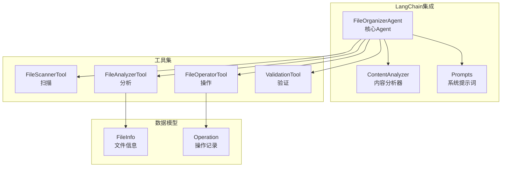
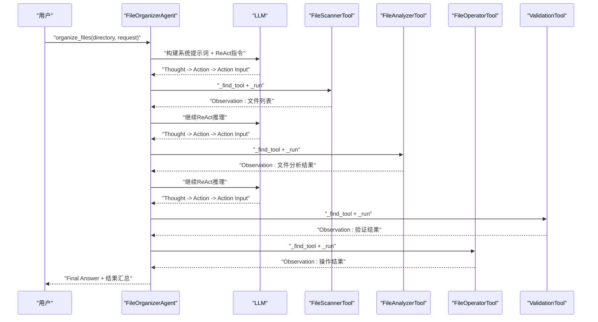
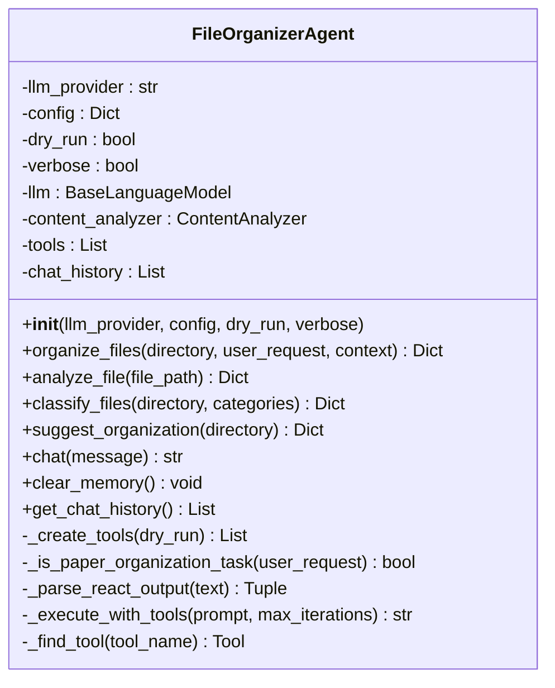
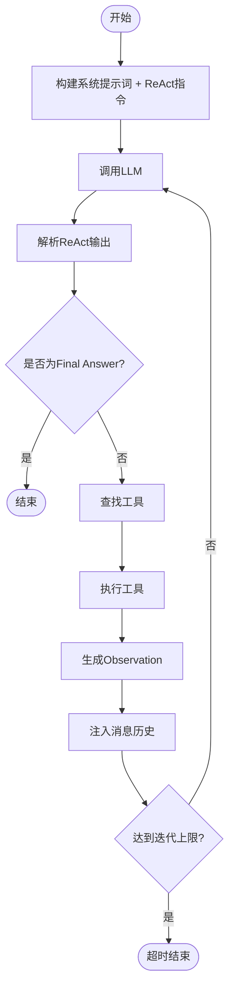
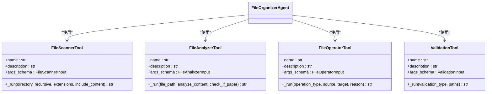
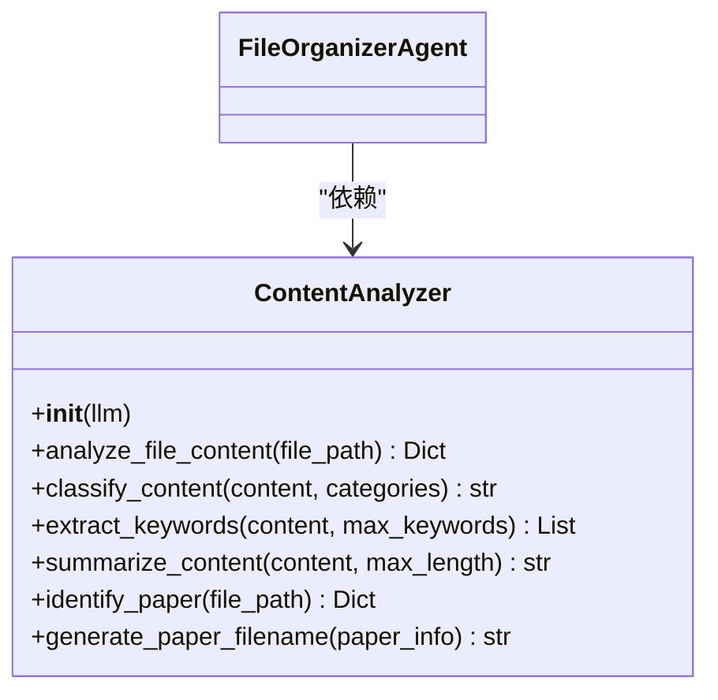
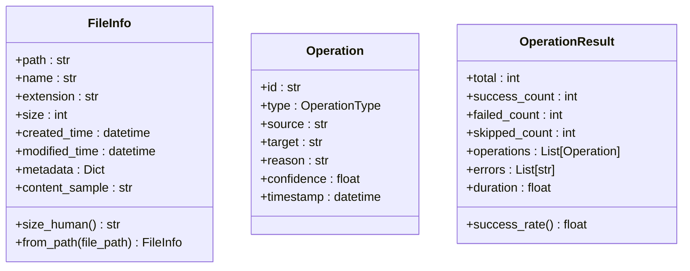
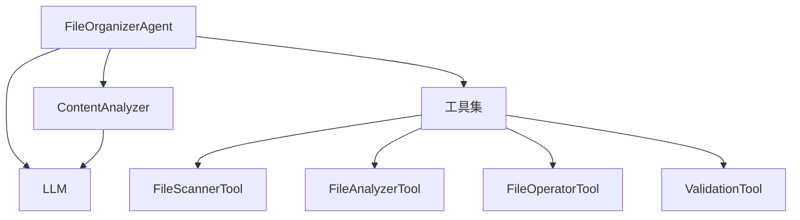

# Agent智能决策API

<cite>
**本文引用的文件**
- [src/langchain_integration/agent.py](file://src/langchain_integration/agent.py)
- [src/langchain_integration/prompts.py](file://src/langchain_integration/prompts.py)
- [src/langchain_integration/tools/file_scanner_tool.py](file://src/langchain_integration/tools/file_scanner_tool.py)
- [src/langchain_integration/tools/file_analyzer_tool.py](file://src/langchain_integration/tools/file_analyzer_tool.py)
- [src/langchain_integration/tools/file_operator_tool.py](file://src/langchain_integration/tools/file_operator_tool.py)
- [src/langchain_integration/tools/validation_tool.py](file://src/langchain_integration/tools/validation_tool.py)
- [src/langchain_integration/content_analyzer.py](file://src/langchain_integration/content_analyzer.py)
- [src/models/file_info.py](file://src/models/file_info.py)
- [src/models/operation.py](file://src/models/operation.py)
- [examples/langchain_example.py](file://examples/langchain_example.py)
- [config/default_config.yaml](file://config/default_config.yaml)
- [docs/LANGCHAIN_INTEGRATION.md](file://docs/LANGCHAIN_INTEGRATION.md)
</cite>

## 目录
1. [简介](#简介)
2. [项目结构](#项目结构)
3. [核心组件](#核心组件)
4. [架构总览](#架构总览)
5. [详细组件分析](#详细组件分析)
6. [依赖关系分析](#依赖关系分析)
7. [性能考量](#性能考量)
8. [故障排查指南](#故障排查指南)
9. [结论](#结论)
10. [附录](#附录)

## 简介
本文件面向开发者与使用者，系统化阐述智能文件整理Agent的API设计与实现细节。重点覆盖FileOrganizerAgent类的公共接口（initialize、organize_files、analyze_file、suggest_organization等），ReAct推理机制与工具调用流程，以及与LangChain工具集的集成方式。文档同时提供配置选项、性能调优、错误处理的最佳实践，并通过示例展示Agent的初始化、配置、使用与调试方法。

## 项目结构
该Agent位于LangChain集成模块中，围绕“扫描-分析-决策-执行”的闭环工作流组织代码。核心文件包括：
- Agent主体：负责任务编排、ReAct解析、工具调度与结果汇总
- Prompt模板：定义系统角色、工具说明、ReAct格式与工作流
- 工具集合：文件扫描、内容分析、文件操作、验证
- 内容分析器：基于LLM的文件内容深度分析与论文识别
- 数据模型：文件信息与操作记录的数据结构
- 配置与示例：默认配置与使用示例

图表来源
- [src/langchain_integration/agent.py](file://src/langchain_integration/agent.py#L21-L576)
- [src/langchain_integration/prompts.py](file://src/langchain_integration/prompts.py#L1-L232)
- [src/langchain_integration/tools/file_scanner_tool.py](file://src/langchain_integration/tools/file_scanner_tool.py#L31-L115)
- [src/langchain_integration/tools/file_analyzer_tool.py](file://src/langchain_integration/tools/file_analyzer_tool.py#L31-L221)
- [src/langchain_integration/tools/file_operator_tool.py](file://src/langchain_integration/tools/file_operator_tool.py#L32-L148)
- [src/langchain_integration/tools/validation_tool.py](file://src/langchain_integration/tools/validation_tool.py#L24-L171)
- [src/langchain_integration/content_analyzer.py](file://src/langchain_integration/content_analyzer.py#L14-L403)
- [src/models/file_info.py](file://src/models/file_info.py#L9-L48)
- [src/models/operation.py](file://src/models/operation.py#L10-L54)

章节来源
- [src/langchain_integration/agent.py](file://src/langchain_integration/agent.py#L1-L576)
- [src/langchain_integration/prompts.py](file://src/langchain_integration/prompts.py#L1-L232)
- [src/langchain_integration/tools/file_scanner_tool.py](file://src/langchain_integration/tools/file_scanner_tool.py#L1-L115)
- [src/langchain_integration/tools/file_analyzer_tool.py](file://src/langchain_integration/tools/file_analyzer_tool.py#L1-L221)
- [src/langchain_integration/tools/file_operator_tool.py](file://src/langchain_integration/tools/file_operator_tool.py#L1-L148)
- [src/langchain_integration/tools/validation_tool.py](file://src/langchain_integration/tools/validation_tool.py#L1-L171)
- [src/langchain_integration/content_analyzer.py](file://src/langchain_integration/content_analyzer.py#L1-L403)
- [src/models/file_info.py](file://src/models/file_info.py#L1-L48)
- [src/models/operation.py](file://src/models/operation.py#L1-L54)

## 核心组件
- FileOrganizerAgent：核心智能决策引擎，负责任务编排、ReAct解析、工具调度与结果汇总
- ContentAnalyzer：基于LLM的文件内容深度分析与论文识别
- 工具集：FileScannerTool、FileAnalyzerTool、FileOperatorTool、ValidationTool
- 数据模型：FileInfo、Operation

章节来源
- [src/langchain_integration/agent.py](file://src/langchain_integration/agent.py#L21-L576)
- [src/langchain_integration/content_analyzer.py](file://src/langchain_integration/content_analyzer.py#L14-L403)
- [src/models/file_info.py](file://src/models/file_info.py#L9-L48)
- [src/models/operation.py](file://src/models/operation.py#L10-L54)

## 架构总览
Agent采用“系统提示词 + ReAct格式 + 工具调用”的决策范式。Agent根据用户请求与目录内容，自主决定扫描、分析、验证与执行顺序，并在每次工具调用后接收Observation，继续下一步ReAct推理直至完成或达到迭代上限。

图表来源
- [src/langchain_integration/agent.py](file://src/langchain_integration/agent.py#L300-L430)
- [src/langchain_integration/prompts.py](file://src/langchain_integration/prompts.py#L1-L133)
- [src/langchain_integration/tools/file_scanner_tool.py](file://src/langchain_integration/tools/file_scanner_tool.py#L48-L115)
- [src/langchain_integration/tools/file_analyzer_tool.py](file://src/langchain_integration/tools/file_analyzer_tool.py#L49-L221)
- [src/langchain_integration/tools/file_operator_tool.py](file://src/langchain_integration/tools/file_operator_tool.py#L60-L148)
- [src/langchain_integration/tools/validation_tool.py](file://src/langchain_integration/tools/validation_tool.py#L41-L171)

## 详细组件分析

### FileOrganizerAgent 类
- 角色定位：LangChain工具驱动的智能决策Agent，负责任务编排、ReAct解析、工具调度与结果汇总
- 关键职责：
  - 初始化：创建LLM、内容分析器、工具集；支持dry_run与verbose
  - 任务执行：根据用户请求与目录内容，构建ReAct提示词并循环调用工具
  - ReAct解析：从LLM输出中提取Thought、Action、Action Input，必要时修复JSON
  - 会话记忆：维护聊天历史，支持对话与上下文理解
  - 辅助方法：文件分析、分类、建议、对话、清空记忆、获取历史

图表来源
- [src/langchain_integration/agent.py](file://src/langchain_integration/agent.py#L21-L576)

章节来源
- [src/langchain_integration/agent.py](file://src/langchain_integration/agent.py#L21-L576)

### ReAct推理机制与工具调用
- ReAct格式要求：Thought -> Action -> Action Input，最终以Final Answer收尾
- 工具调用流程：
  - LLM输出ReAct格式
  - Agent解析Action与Action Input（含JSON修复）
  - 根据Action名称查找工具并执行
  - 将工具结果作为Observation注入下一轮推理
  - 达到迭代上限或收到Final Answer时结束

图表来源
- [src/langchain_integration/agent.py](file://src/langchain_integration/agent.py#L247-L430)
- [src/langchain_integration/prompts.py](file://src/langchain_integration/prompts.py#L62-L133)

章节来源
- [src/langchain_integration/agent.py](file://src/langchain_integration/agent.py#L247-L430)
- [src/langchain_integration/prompts.py](file://src/langchain_integration/prompts.py#L62-L133)

### 工具注册、参数传递与结果处理
- 工具注册：Agent在构造时创建工具列表，包含FileScannerTool、FileAnalyzerTool、FileOperatorTool、ValidationTool
- 参数传递：工具输入使用Pydantic模型定义，确保参数校验与文档化
- 结果处理：工具返回JSON字符串，Agent统一解析并注入Observation

图表来源
- [src/langchain_integration/agent.py](file://src/langchain_integration/agent.py#L61-L68)
- [src/langchain_integration/tools/file_scanner_tool.py](file://src/langchain_integration/tools/file_scanner_tool.py#L31-L115)
- [src/langchain_integration/tools/file_analyzer_tool.py](file://src/langchain_integration/tools/file_analyzer_tool.py#L31-L221)
- [src/langchain_integration/tools/file_operator_tool.py](file://src/langchain_integration/tools/file_operator_tool.py#L32-L148)
- [src/langchain_integration/tools/validation_tool.py](file://src/langchain_integration/tools/validation_tool.py#L24-L171)

章节来源
- [src/langchain_integration/agent.py](file://src/langchain_integration/agent.py#L61-L68)
- [src/langchain_integration/tools/file_scanner_tool.py](file://src/langchain_integration/tools/file_scanner_tool.py#L17-L115)
- [src/langchain_integration/tools/file_analyzer_tool.py](file://src/langchain_integration/tools/file_analyzer_tool.py#L18-L221)
- [src/langchain_integration/tools/file_operator_tool.py](file://src/langchain_integration/tools/file_operator_tool.py#L18-L148)
- [src/langchain_integration/tools/validation_tool.py](file://src/langchain_integration/tools/validation_tool.py#L15-L171)

### ContentAnalyzer 内容分析器
- 职责：对文件内容进行深度分析，提取主题、关键词、摘要，识别论文并建议命名
- 与Agent协作：通过analyze_file接口被Agent调用，或独立使用

图表来源
- [src/langchain_integration/content_analyzer.py](file://src/langchain_integration/content_analyzer.py#L14-L403)

章节来源
- [src/langchain_integration/content_analyzer.py](file://src/langchain_integration/content_analyzer.py#L14-L403)

### 数据模型
- FileInfo：文件信息数据模型，包含路径、名称、扩展名、大小、时间戳、元数据、内容样本
- Operation：单个文件操作，包含类型、源路径、目标路径、原因、置信度、时间戳
- OperationResult：批量操作结果，包含总数、成功数、失败数、错误列表、成功率

图表来源
- [src/models/file_info.py](file://src/models/file_info.py#L9-L48)
- [src/models/operation.py](file://src/models/operation.py#L10-L54)

章节来源
- [src/models/file_info.py](file://src/models/file_info.py#L9-L48)
- [src/models/operation.py](file://src/models/operation.py#L10-L54)

## 依赖关系分析
- Agent依赖LangChain LLM与工具集，通过系统提示词约束ReAct格式
- 工具间无直接耦合，均由Agent统一调度
- ContentAnalyzer与工具共享底层文件读取与元数据提取能力

图表来源
- [src/langchain_integration/agent.py](file://src/langchain_integration/agent.py#L40-L52)
- [src/langchain_integration/prompts.py](file://src/langchain_integration/prompts.py#L1-L133)
- [src/langchain_integration/content_analyzer.py](file://src/langchain_integration/content_analyzer.py#L17-L26)

章节来源
- [src/langchain_integration/agent.py](file://src/langchain_integration/agent.py#L40-L52)
- [src/langchain_integration/prompts.py](file://src/langchain_integration/prompts.py#L1-L133)
- [src/langchain_integration/content_analyzer.py](file://src/langchain_integration/content_analyzer.py#L17-L26)

## 性能考量
- Token与内容样本控制：限制文件内容样本长度，避免LLM上下文溢出
- 迭代上限与超时：合理设置最大迭代次数与执行超时，防止长时间阻塞
- 批量与并发：工具侧支持批量操作，Agent侧建议分批处理大型目录
- 缓存策略：复用元数据提取与LLM响应（需在上层应用中实现）

章节来源
- [config/default_config.yaml](file://config/default_config.yaml#L26-L79)
- [src/langchain_integration/prompts.py](file://src/langchain_integration/prompts.py#L162-L232)
- [src/langchain_integration/tools/file_scanner_tool.py](file://src/langchain_integration/tools/file_scanner_tool.py#L74-L103)

## 故障排查指南
- 初始化失败：检查LangChain依赖安装、API密钥配置与模型参数
- Token超限：减少单次处理文件数、降低内容样本长度、启用dry-run测试
- 连接超时：检查网络与代理、增加执行超时、使用本地LLM
- 工具调用异常：确认工具名称拼写、参数格式（JSON）、路径有效性
- ReAct解析失败：检查LLM输出格式一致性、必要时修复JSON字符串

章节来源
- [docs/LANGCHAIN_INTEGRATION.md](file://docs/LANGCHAIN_INTEGRATION.md#L300-L357)
- [src/langchain_integration/agent.py](file://src/langchain_integration/agent.py#L247-L430)

## 结论
FileOrganizerAgent通过ReAct推理与LangChain工具集实现了高度灵活的文件整理决策能力。其接口设计清晰、工具调用规范、错误处理完备，并提供了丰富的配置与扩展点。结合ContentAnalyzer与数据模型，Agent能够胜任从简单分类到复杂论文整理的多样化任务。

## 附录

### API参考与使用示例

- 初始化与基础使用
  - 参考路径：[examples/langchain_example.py](file://examples/langchain_example.py#L9-L38)
  - 关键点：llm_provider、config、dry_run、verbose

- 分析单个文件
  - 参考路径：[examples/langchain_example.py](file://examples/langchain_example.py#L40-L73)
  - 关键点：analyze_file(file_path)

- 获取整理建议
  - 参考路径：[examples/langchain_example.py](file://examples/langchain_example.py#L75-L99)
  - 关键点：suggest_organization(directory)

- 文件分类
  - 参考路径：[examples/langchain_example.py](file://examples/langchain_example.py#L102-L133)
  - 关键点：classify_files(directory, categories)

- 与Agent对话
  - 参考路径：[examples/langchain_example.py](file://examples/langchain_example.py#L135-L171)
  - 关键点：chat(message)、get_chat_history()

- 自定义API与内容分析器
  - 参考路径：[examples/langchain_example.py](file://examples/langchain_example.py#L173-L234)
  - 关键点：custom provider配置、ContentAnalyzer独立使用

章节来源
- [examples/langchain_example.py](file://examples/langchain_example.py#L9-L234)

### 配置选项
- LangChain Agent配置
  - 参考路径：[config/default_config.yaml](file://config/default_config.yaml#L26-L46)
  - 关键项：agent.type、verbose、max_iterations、max_execution_time、tools配置

- AI提供商配置
  - 参考路径：[config/default_config.yaml](file://config/default_config.yaml#L1-L25)
  - 关键项：default_provider、providers.claude/openai/local/custom

- 文件操作与安全配置
  - 参考路径：[config/default_config.yaml](file://config/default_config.yaml#L47-L79)
  - 关键项：file_operations、safety、logging

章节来源
- [config/default_config.yaml](file://config/default_config.yaml#L1-L79)