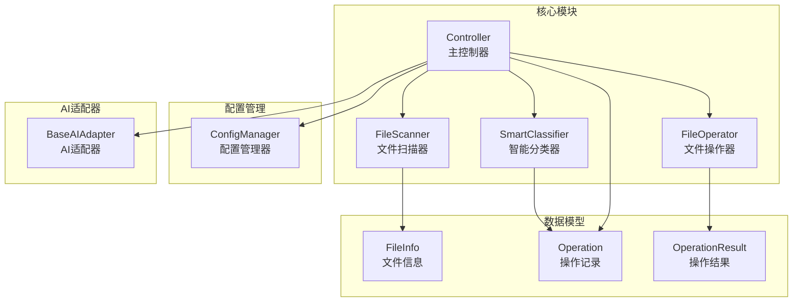
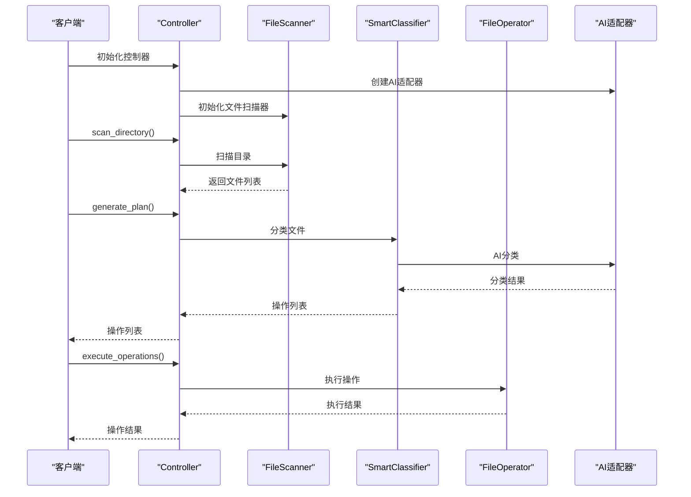
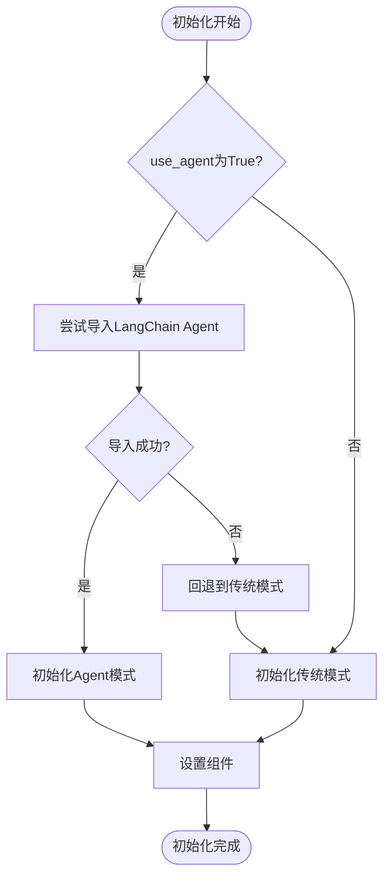
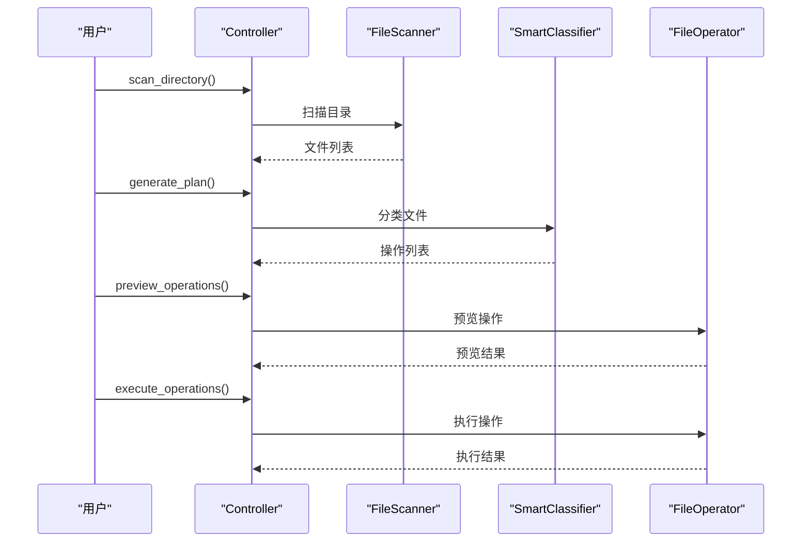
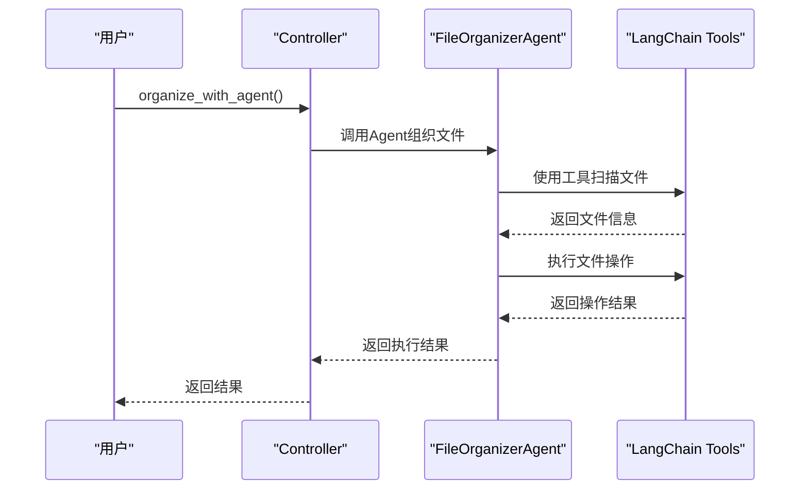
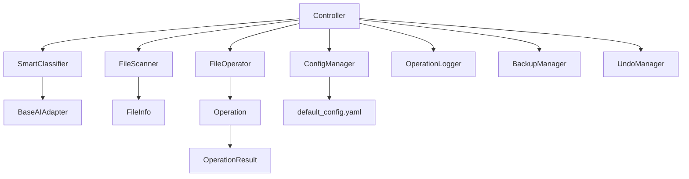

# 控制器API

<cite>
**本文引用的文件**
- [src/core/controller.py](file://src/core/controller.py)
- [src/core/classifier.py](file://src/core/classifier.py)
- [src/core/file_scanner.py](file://src/core/file_scanner.py)
- [src/core/file_operator.py](file://src/core/file_operator.py)
- [src/models/file_info.py](file://src/models/file_info.py)
- [src/models/operation.py](file://src/models/operation.py)
- [src/utils/config.py](file://src/utils/config.py)
- [config/default_config.yaml](file://config/default_config.yaml)
- [examples/basic_usage.py](file://examples/basic_usage.py)
- [examples/custom_api_example.py](file://examples/custom_api_example.py)
- [examples/langchain_example.py](file://examples/langchain_example.py)
- [README.md](file://README.md)
</cite>

## 目录
1. [简介](#简介)
2. [项目结构](#项目结构)
3. [核心组件](#核心组件)
4. [架构概览](#架构概览)
5. [详细组件分析](#详细组件分析)
6. [依赖分析](#依赖分析)
7. [性能考虑](#性能考虑)
8. [故障排除指南](#故障排除指南)
9. [结论](#结论)
10. [附录](#附录)

## 简介
本文档详细说明了控制器API的设计与使用，重点涵盖Controller类的公共接口、初始化参数、核心方法签名、参数定义、返回值格式。文档深入解释了scan_directory()、generate_plan()、execute_operations()、organize_with_agent()等关键方法的使用方式，并提供完整的代码示例展示典型使用场景，包括传统模式和Agent模式的切换使用。同时，文档解释了控制器与各子模块的协作关系和数据流转过程。

## 项目结构
该项目采用模块化设计，核心业务逻辑集中在src/core目录下，包含文件扫描、分类、操作执行等功能模块，以及统一的控制器进行协调管理。



**图表来源**
- [src/core/controller.py](file://src/core/controller.py#L15-L310)
- [src/core/file_scanner.py](file://src/core/file_scanner.py#L13-L196)
- [src/core/classifier.py](file://src/core/classifier.py#L11-L265)
- [src/core/file_operator.py](file://src/core/file_operator.py#L12-L246)
- [src/models/file_info.py](file://src/models/file_info.py#L9-L48)
- [src/models/operation.py](file://src/models/operation.py#L18-L54)
- [src/utils/config.py](file://src/utils/config.py#L10-L116)

**章节来源**
- [src/core/controller.py](file://src/core/controller.py#L1-L310)
- [src/core/__init__.py](file://src/core/__init__.py#L1-L9)

## 核心组件
控制器API围绕Controller类构建，提供统一的接口来协调各个子模块的工作。该类支持两种工作模式：传统AI适配器模式和LangChain Agent模式，能够根据配置自动切换。

### 初始化参数
Controller类的构造函数接受以下参数：
- config: ConfigManager实例，用于管理全局配置
- ai_provider: 可选的AI提供商名称，默认使用配置中的默认提供商
- use_agent: 布尔值，控制是否使用LangChain Agent模式，默认为True

### 主要职责
- 协调文件扫描、分类、操作执行等核心流程
- 管理AI适配器和Agent的初始化与切换
- 维护操作历史和对话上下文
- 提供安全操作保障（备份、撤销、日志）

**章节来源**
- [src/core/controller.py](file://src/core/controller.py#L18-L82)
- [src/utils/config.py](file://src/utils/config.py#L10-L116)

## 架构概览
控制器采用分层架构设计，通过统一的接口协调各个子模块的工作。



**图表来源**
- [src/core/controller.py](file://src/core/controller.py#L83-L256)
- [src/core/file_scanner.py](file://src/core/file_scanner.py#L28-L84)
- [src/core/classifier.py](file://src/core/classifier.py#L24-L66)
- [src/core/file_operator.py](file://src/core/file_operator.py#L65-L100)

## 详细组件分析

### Controller类详解

#### 初始化流程
控制器初始化时会根据配置自动选择工作模式：



**图表来源**
- [src/core/controller.py](file://src/core/controller.py#L40-L64)

#### 核心方法签名与参数

##### scan_directory() 方法
- **方法签名**: `scan_directory(directory: str, recursive: bool = False, extensions: Optional[set] = None) -> List[FileInfo]`
- **参数说明**:
  - directory: 目标目录路径
  - recursive: 是否递归扫描，默认False
  - extensions: 文件扩展名过滤集合，默认None
- **返回值**: FileInfo对象列表
- **功能**: 扫描指定目录并返回文件信息列表

##### generate_plan() 方法
- **方法签名**: `generate_plan(files: List[FileInfo], user_request: str) -> List[Operation]`
- **参数说明**:
  - files: 文件信息列表
  - user_request: 用户需求描述
- **返回值**: Operation对象列表
- **功能**: 基于AI分析生成文件整理方案

##### execute_operations() 方法
- **方法签名**: `execute_operations(operations: List[Operation], create_backup: bool = True) -> OperationResult`
- **参数说明**:
  - operations: 操作列表
  - create_backup: 是否创建备份，默认True
- **返回值**: OperationResult对象
- **功能**: 执行文件操作并返回执行结果

##### organize_with_agent() 方法
- **方法签名**: `organize_with_agent(directory: str, user_request: str, context: Optional[Dict[str, Any]] = None) -> Dict[str, Any]`
- **参数说明**:
  - directory: 目标目录
  - user_request: 用户需求
  - context: 额外上下文信息
- **返回值**: 字典格式的执行结果
- **功能**: 使用Agent模式进行文件整理

**章节来源**
- [src/core/controller.py](file://src/core/controller.py#L83-L310)

### 数据模型

#### FileInfo 数据模型
FileInfo用于表示文件的基本信息，包含路径、名称、扩展名、大小、时间戳等属性。

#### Operation 数据模型
Operation表示单个文件操作，支持移动、重命名、创建文件夹、删除等操作类型。

#### OperationResult 数据模型
OperationResult用于记录批量操作的执行结果，包含成功数量、失败数量、错误信息等统计信息。

**章节来源**
- [src/models/file_info.py](file://src/models/file_info.py#L9-L48)
- [src/models/operation.py](file://src/models/operation.py#L18-L54)

### 工作流程详解

#### 传统模式工作流程


**图表来源**
- [src/core/controller.py](file://src/core/controller.py#L83-L256)
- [src/core/file_scanner.py](file://src/core/file_scanner.py#L28-L84)
- [src/core/classifier.py](file://src/core/classifier.py#L24-L66)
- [src/core/file_operator.py](file://src/core/file_operator.py#L24-L100)

#### Agent模式工作流程


**图表来源**
- [src/core/controller.py](file://src/core/controller.py#L142-L170)

### 异常处理机制
控制器实现了完善的异常处理机制：

1. **导入异常**: 当LangChain Agent导入失败时自动回退到传统模式
2. **操作验证**: 在执行前验证操作的安全性
3. **备份恢复**: 执行失败时尝试恢复备份
4. **错误日志**: 记录详细的错误信息供调试

**章节来源**
- [src/core/controller.py](file://src/core/controller.py#L56-L58)
- [src/core/controller.py](file://src/core/controller.py#L218-L255)

## 依赖分析



**图表来源**
- [src/core/controller.py](file://src/core/controller.py#L6-L12)
- [src/utils/config.py](file://src/utils/config.py#L10-L116)
- [config/default_config.yaml](file://config/default_config.yaml#L1-L79)

**章节来源**
- [src/core/controller.py](file://src/core/controller.py#L1-L310)
- [src/utils/config.py](file://src/utils/config.py#L1-L116)

## 性能考虑
- **并发处理**: 文件扫描使用ThreadPoolExecutor进行并行处理
- **批量执行**: 文件操作支持批量执行，提高效率
- **内存管理**: 大文件不读取内容，避免内存占用过高
- **配置优化**: 可通过配置调整批处理大小、扫描深度等参数

## 故障排除指南

### 常见问题及解决方案

#### Agent模式导入失败
当LangChain相关包未安装时，系统会自动回退到传统模式。解决方法：
1. 安装LangChain相关依赖
2. 检查网络连接
3. 验证API密钥配置

#### 操作执行失败
当文件操作执行失败时：
1. 检查磁盘空间
2. 验证文件权限
3. 查看错误日志
4. 使用撤销功能恢复

#### 配置问题
- 确认配置文件路径正确
- 检查环境变量设置
- 验证API密钥有效性

**章节来源**
- [src/core/controller.py](file://src/core/controller.py#L56-L58)
- [src/core/controller.py](file://src/core/controller.py#L243-L255)

## 结论
控制器API提供了统一的接口来协调文件整理的各个环节，支持传统模式和Agent模式两种工作方式。通过合理的异常处理和安全机制，确保了操作的可靠性。开发者可以根据具体需求选择合适的工作模式，并通过配置文件灵活调整系统行为。

## 附录

### 使用示例

#### 基本使用示例
```python
from src.utils import ConfigManager
from src.core import Controller

# 初始化配置和控制器
config = ConfigManager()
controller = Controller(config, ai_provider='claude')

# 扫描目录
files = controller.scan_directory('./test_files', recursive=False)

# 生成整理方案
operations = controller.generate_plan(
    files=files,
    user_request="把所有PDF文件移动到documents文件夹"
)

# 预览操作
preview = controller.preview_operations(operations)
print(f"将执行 {len(operations)} 个操作")

# 执行操作
# result = controller.execute_operations(operations)
```

#### Agent模式使用示例
```python
from src.utils import ConfigManager
from src.langchain_integration import FileOrganizerAgent

# 创建Agent
agent = FileOrganizerAgent(
    llm_provider='claude',
    config=config_dict,
    dry_run=True,
    verbose=True
)

# 使用Agent整理文件
result = agent.organize_files(
    directory='./test_files',
    user_request='按文件类型分类到不同文件夹'
)
```

#### 自定义API配置示例
```python
from src.utils import ConfigManager
from src.core import Controller

# 设置Azure OpenAI配置
config = ConfigManager()
config.set('ai.default_provider', 'custom')
config.set('ai.providers.custom.base_url', 'https://your-resource.openai.azure.com/openai/deployments/your-deployment')
config.set('ai.providers.custom.api_key', 'your-azure-api-key')
config.set('ai.providers.custom.model', 'gpt-4')

# 使用控制器
controller = Controller(config, ai_provider='custom')
```

**章节来源**
- [examples/basic_usage.py](file://examples/basic_usage.py#L7-L89)
- [examples/langchain_example.py](file://examples/langchain_example.py#L9-L279)
- [examples/custom_api_example.py](file://examples/custom_api_example.py#L7-L99)

### 配置参考
主要配置项包括：
- AI提供商配置：默认提供商、模型参数、API密钥
- LangChain Agent配置：Agent类型、工具配置、执行限制
- 文件操作配置：批处理大小、扫描深度、文件大小限制
- 安全配置：确认要求、自动备份、撤销历史

**章节来源**
- [config/default_config.yaml](file://config/default_config.yaml#L1-L79)
- [README.md](file://README.md#L197-L206)