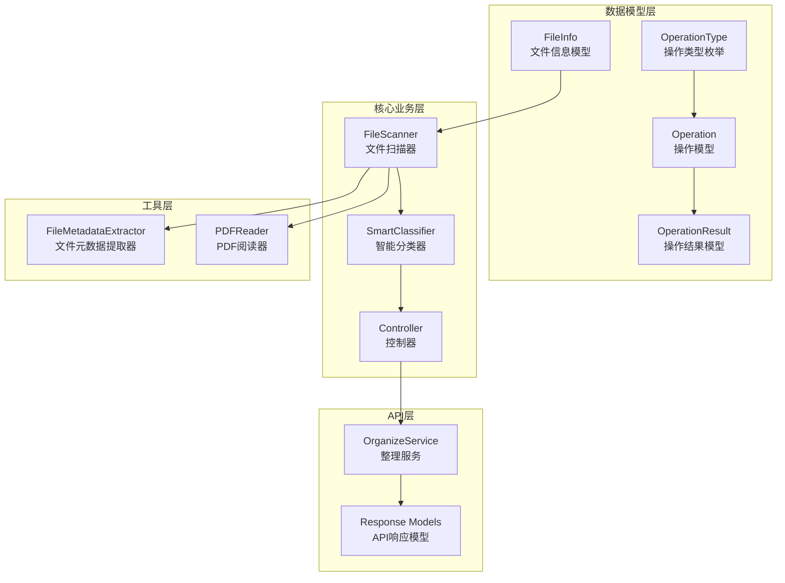
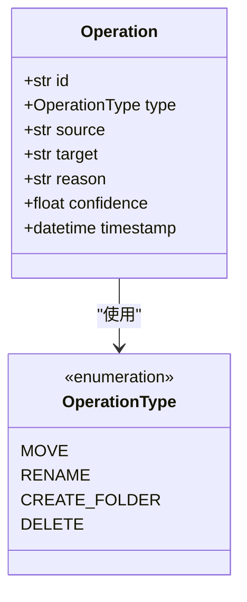
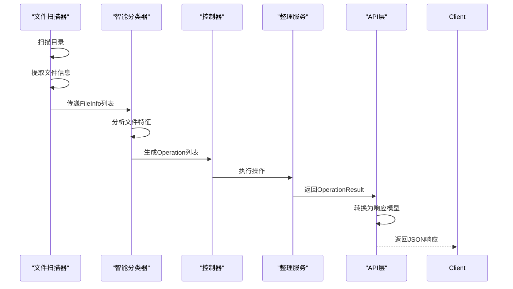
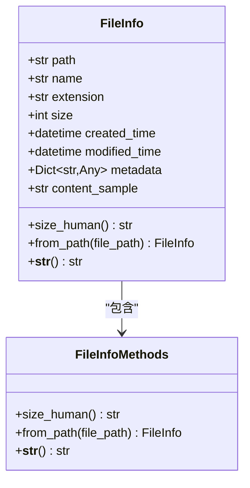
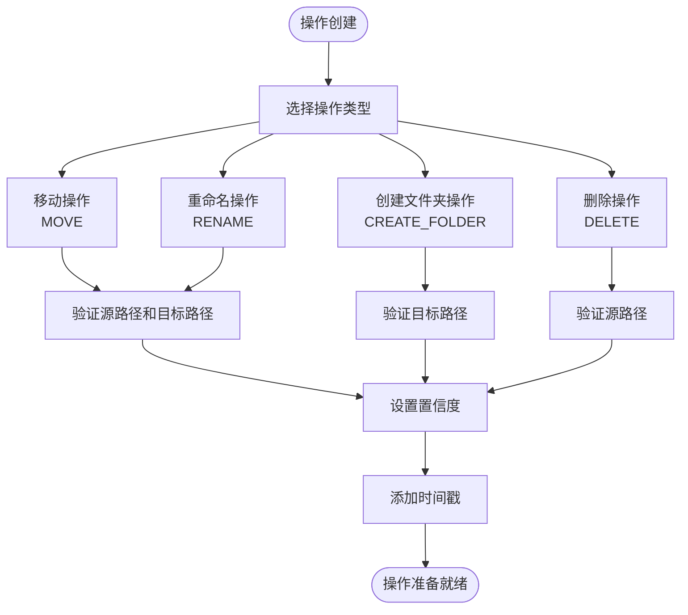
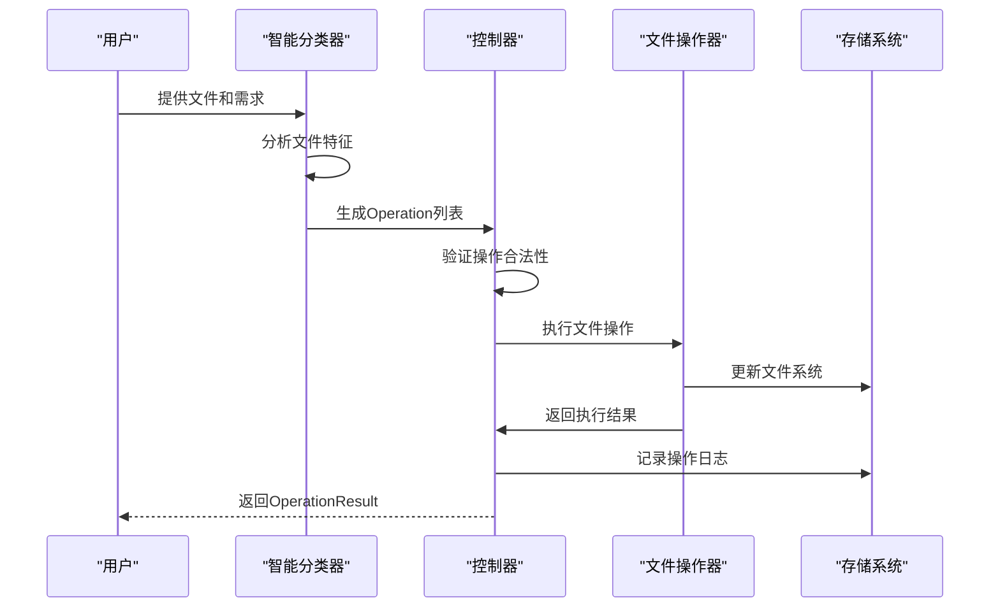
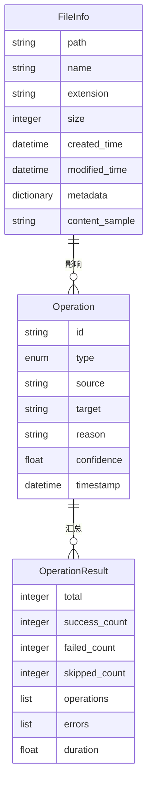
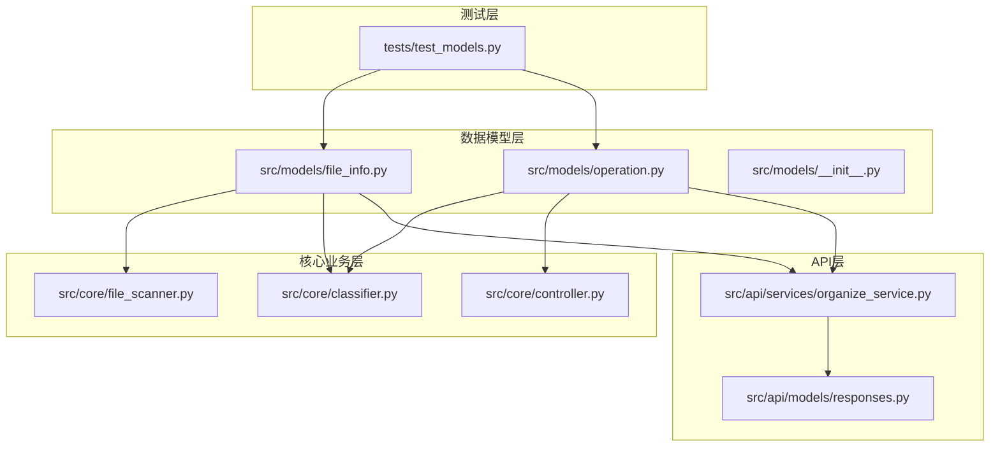

# 数据模型API

<cite>
**本文档引用的文件**
- [src/models/file_info.py](file://src/models/file_info.py)
- [src/models/operation.py](file://src/models/operation.py)
- [src/models/__init__.py](file://src/models/__init__.py)
- [tests/test_models.py](file://tests/test_models.py)
- [src/core/file_scanner.py](file://src/core/file_scanner.py)
- [src/core/classifier.py](file://src/core/classifier.py)
- [src/api/services/organize_service.py](file://src/api/services/organize_service.py)
- [src/api/models/responses.py](file://src/api/models/responses.py)
- [examples/basic_usage.py](file://examples/basic_usage.py)
</cite>

## 目录
1. [简介](#简介)
2. [项目结构](#项目结构)
3. [核心组件](#核心组件)
4. [架构概览](#架构概览)
5. [详细组件分析](#详细组件分析)
6. [依赖关系分析](#依赖关系分析)
7. [性能考虑](#性能考虑)
8. [故障排除指南](#故障排除指南)
9. [结论](#结论)

## 简介

本文档详细说明了Smart File Tidy项目中的数据模型API设计规范，重点涵盖FileInfo和Operation两个核心数据模型。这些模型是整个文件整理系统的基础数据结构，负责存储文件信息和操作指令，并在整个系统中发挥着关键作用。

数据模型采用Pydantic框架构建，提供了强大的数据验证、序列化和类型检查功能。每个模型都经过精心设计，确保数据的一致性和完整性，同时保持良好的可扩展性。

## 项目结构

Smart File Tidy项目采用模块化的架构设计，数据模型位于`src/models/`目录下，与核心业务逻辑、API层和其他组件形成清晰的层次结构。

**图表来源**
- [src/models/file_info.py](file://src/models/file_info.py#L1-L48)
- [src/models/operation.py](file://src/models/operation.py#L1-L54)
- [src/core/file_scanner.py](file://src/core/file_scanner.py#L1-L196)
- [src/core/classifier.py](file://src/core/classifier.py#L1-L265)

**章节来源**
- [src/models/file_info.py](file://src/models/file_info.py#L1-L48)
- [src/models/operation.py](file://src/models/operation.py#L1-L54)
- [src/models/__init__.py](file://src/models/__init__.py#L1-L7)

## 核心组件

### FileInfo模型

FileInfo是文件信息的核心数据模型，用于存储和表示单个文件的完整信息。该模型继承自Pydantic的BaseModel，提供了自动的数据验证和序列化功能。

#### 字段定义

| 字段名 | 类型 | 描述 | 验证规则 |
|--------|------|------|----------|
| path | str | 文件完整路径 | 必填，字符串验证 |
| name | str | 文件名（含扩展名） | 必填，字符串验证 |
| extension | str | 文件扩展名 | 必填，字符串验证，自动转为小写 |
| size | int | 文件大小（字节） | 必填，整数验证，>= 0 |
| created_time | datetime | 创建时间 | 必填，日期时间验证 |
| modified_time | datetime | 修改时间 | 必填，日期时间验证 |
| metadata | Optional[Dict[str, Any]] | 文件元数据 | 可选，字典验证 |
| content_sample | Optional[str] | 内容样本 | 可选，字符串验证 |

#### 数据类型和验证规则

- **路径验证**：确保文件路径有效且可访问
- **大小验证**：文件大小必须为非负数
- **时间验证**：创建和修改时间必须为有效的日期时间格式
- **扩展名标准化**：自动转换为小写格式
- **可选字段**：元数据和内容样本允许为空

#### 序列化格式

FileInfo模型支持多种序列化格式：
- JSON序列化：用于API传输和存储
- Python字典：用于内部数据交换
- 字符串表示：便于调试和日志记录

**章节来源**
- [src/models/file_info.py](file://src/models/file_info.py#L9-L48)

### Operation模型

Operation模型代表单个文件操作指令，是文件整理流程中的核心数据结构。该模型定义了文件系统操作的标准格式。

#### 字段定义

| 字段名 | 类型 | 描述 | 验证规则 |
|--------|------|------|----------|
| id | str | 操作ID | 自动生成，UUID格式 |
| type | OperationType | 操作类型 | 必填，枚举验证 |
| source | str | 源路径 | 必填，字符串验证 |
| target | str | 目标路径 | 必填，字符串验证 |
| reason | str | 操作原因 | 可选，默认空字符串 |
| confidence | float | 置信度 | 可选，默认1.0，范围0.0-1.0 |
| timestamp | datetime | 时间戳 | 自动生成，当前时间 |

#### 操作类型枚举

OperationType枚举定义了支持的文件操作类型：

**图表来源**
- [src/models/operation.py](file://src/models/operation.py#L10-L16)
- [src/models/operation.py](file://src/models/operation.py#L18-L31)

#### 验证规则

- **ID生成**：自动使用UUID v4生成唯一标识符
- **置信度范围**：必须在0.0到1.0之间
- **路径验证**：源路径和目标路径必须有效
- **类型验证**：操作类型必须是预定义的枚举值之一

#### 序列化格式

Operation模型支持标准的JSON序列化，便于API传输和持久化存储。

**章节来源**
- [src/models/operation.py](file://src/models/operation.py#L10-L31)

### OperationResult模型

OperationResult模型用于聚合批量操作的结果，提供统一的统计和状态信息。

#### 字段定义

| 字段名 | 类型 | 描述 | 验证规则 |
|--------|------|------|----------|
| total | int | 总操作数 | 必填，>= 0 |
| success_count | int | 成功数量 | 默认0，>= 0 |
| failed_count | int | 失败数量 | 默认0，>= 0 |
| skipped_count | int | 跳过数量 | 默认0，>= 0 |
| operations | List[Operation] | 操作列表 | 默认空列表 |
| errors | List[str] | 错误信息列表 | 默认空列表 |
| duration | float | 执行时长（秒） | 默认0.0，>= 0.0 |

#### 统计属性

- **success_rate**：计算成功率（success_count/total）

**章节来源**
- [src/models/operation.py](file://src/models/operation.py#L33-L54)

## 架构概览

Smart File Tidy的数据模型在整个系统中扮演着核心角色，连接着文件扫描、智能分类、操作执行和API响应等多个层面。

**图表来源**
- [src/core/file_scanner.py](file://src/core/file_scanner.py#L28-L84)
- [src/core/classifier.py](file://src/core/classifier.py#L24-L66)
- [src/api/services/organize_service.py](file://src/api/services/organize_service.py#L67-L99)

## 详细组件分析

### FileInfo模型详细分析

FileInfo模型通过Pydantic的Field装饰器实现了强大的数据验证和文档化功能。

#### 构造方法

**图表来源**
- [src/models/file_info.py](file://src/models/file_info.py#L9-L48)

#### 字段验证和转换

每个字段都具有明确的验证规则和类型约束：

1. **路径字段**：确保文件路径的有效性和可访问性
2. **大小字段**：使用整数类型，自动进行数值验证
3. **时间字段**：使用datetime类型，确保时间格式正确
4. **可选字段**：使用Optional类型，允许None值

#### 属性访问和方法调用

- **size_human属性**：提供人类可读的文件大小格式
- **from_path类方法**：从文件系统路径创建FileInfo对象
- **__str__方法**：提供友好的字符串表示

**章节来源**
- [src/models/file_info.py](file://src/models/file_info.py#L21-L48)

### Operation模型详细分析

Operation模型设计简洁而功能完整，支持文件系统的各种操作类型。

#### 操作类型系统

**图表来源**
- [src/models/operation.py](file://src/models/operation.py#L10-L28)

#### 数据流转过程

**图表来源**
- [src/core/classifier.py](file://src/core/classifier.py#L157-L178)
- [src/api/services/organize_service.py](file://src/api/services/organize_service.py#L141-L170)

**章节来源**
- [src/models/operation.py](file://src/models/operation.py#L18-L54)

### 模型关系和依赖

FileInfo和Operation模型之间存在紧密的关联关系，主要体现在以下方面：

**图表来源**
- [src/models/file_info.py](file://src/models/file_info.py#L12-L19)
- [src/models/operation.py](file://src/models/operation.py#L21-L27)
- [src/models/operation.py](file://src/models/operation.py#L36-L42)

#### 关联关系说明

1. **FileInfo → Operation**：Operation的source和target字段引用FileInfo的path属性
2. **Operation → OperationResult**：多个Operation组合形成OperationResult
3. **数据一致性**：通过类型约束确保字段间的关系正确性

**章节来源**
- [src/models/file_info.py](file://src/models/file_info.py#L12-L19)
- [src/models/operation.py](file://src/models/operation.py#L21-L27)

## 依赖关系分析

数据模型在整个系统中的依赖关系体现了清晰的分层架构：

**图表来源**
- [src/models/file_info.py](file://src/models/file_info.py#L1-L48)
- [src/models/operation.py](file://src/models/operation.py#L1-L54)
- [src/core/file_scanner.py](file://src/core/file_scanner.py#L1-L196)
- [src/core/classifier.py](file://src/core/classifier.py#L1-L265)
- [src/api/services/organize_service.py](file://src/api/services/organize_service.py#L1-L415)
- [src/api/models/responses.py](file://src/api/models/responses.py#L1-L158)

### 模块耦合度分析

- **低耦合**：数据模型独立于具体实现，便于测试和维护
- **高内聚**：相关功能集中在同一模块内
- **清晰边界**：各层职责明确，接口稳定

**章节来源**
- [src/models/__init__.py](file://src/models/__init__.py#L1-L7)
- [src/core/file_scanner.py](file://src/core/file_scanner.py#L9-L10)
- [src/core/classifier.py](file://src/core/classifier.py#L6-L7)

## 性能考虑

### 数据模型性能特性

1. **Pydantic验证开销**：每次创建对象时都会进行类型验证，这是性能的主要开销来源
2. **内存使用**：FileInfo包含元数据和内容样本，可能占用较多内存
3. **序列化成本**：大量对象的JSON序列化会影响性能

### 优化策略

1. **批量处理**：使用FileScanner的并行处理能力减少单个对象的创建次数
2. **懒加载**：延迟加载内容样本，只在需要时读取文件内容
3. **缓存机制**：利用文件元数据缓存减少重复读取

## 故障排除指南

### 常见问题和解决方案

#### 数据验证错误

**问题**：创建FileInfo或Operation时出现验证错误
**原因**：字段类型不匹配或值超出范围
**解决方案**：
1. 检查字段类型是否正确
2. 验证数值范围是否在允许范围内
3. 确认路径是否存在且可访问

#### 序列化问题

**问题**：JSON序列化失败
**原因**：datetime对象无法直接序列化
**解决方案**：
1. 使用模型的model_dump()方法
2. 确保所有嵌套对象都是可序列化的

#### 性能问题

**问题**：大量文件处理时内存不足
**原因**：一次性加载所有文件信息
**解决方案**：
1. 使用分批处理策略
2. 及时释放不需要的对象引用
3. 考虑使用生成器模式

**章节来源**
- [tests/test_models.py](file://tests/test_models.py#L8-L63)

## 结论

Smart File Tidy的数据模型API设计体现了现代Python项目的最佳实践。通过Pydantic框架，系统实现了强类型、自动验证和优雅的序列化机制。

### 设计优势

1. **类型安全**：编译时类型检查确保代码质量
2. **数据验证**：自动验证输入数据的正确性
3. **文档化**：详细的字段描述和验证规则
4. **可扩展性**：清晰的接口设计便于功能扩展
5. **一致性**：统一的数据格式和验证规则

### 未来改进方向

1. **性能优化**：考虑使用更高效的数据结构
2. **错误处理**：增强错误信息的详细程度
3. **测试覆盖**：增加更多的单元测试场景
4. **文档完善**：提供更详细的使用示例

这些数据模型为整个Smart File Tidy系统奠定了坚实的基础，确保了数据的一致性和系统的可靠性。