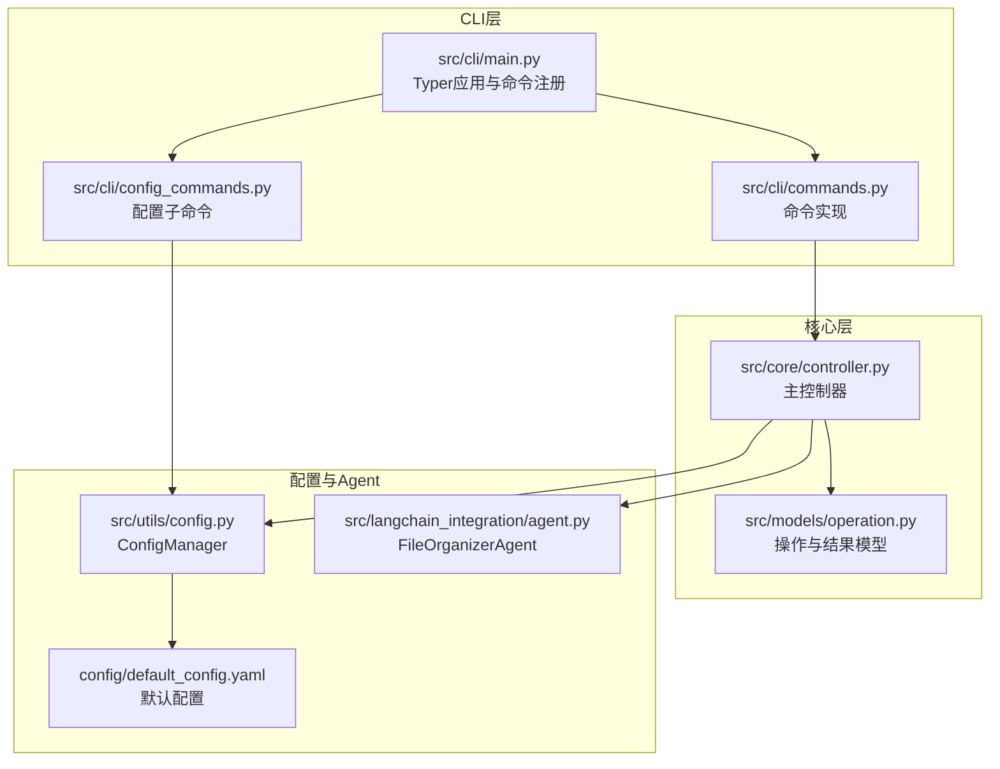
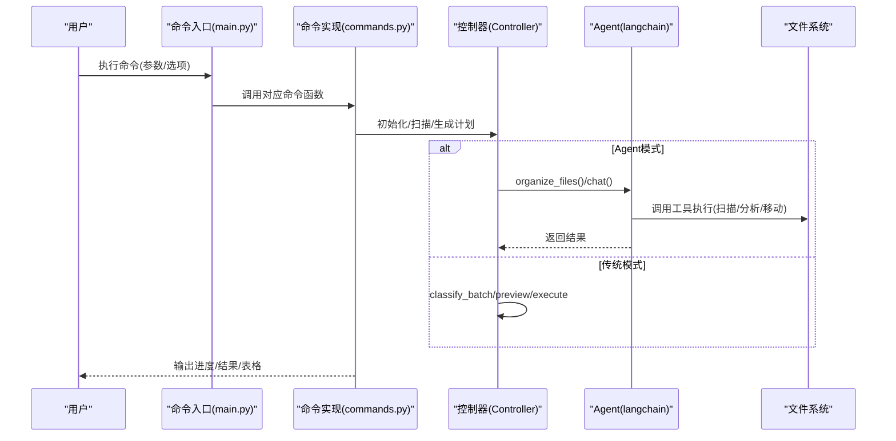
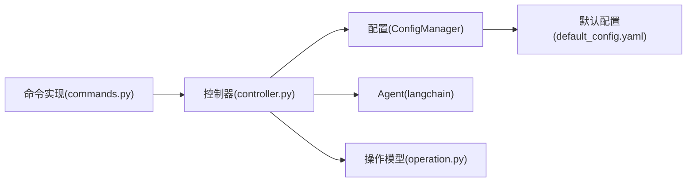

# CLI命令接口

<cite>
**本文引用的文件**
- [src/cli/main.py](file://src/cli/main.py)
- [src/cli/commands.py](file://src/cli/commands.py)
- [src/cli/config_commands.py](file://src/cli/config_commands.py)
- [src/utils/config.py](file://src/utils/config.py)
- [config/default_config.yaml](file://config/default_config.yaml)
- [src/core/controller.py](file://src/core/controller.py)
- [src/models/operation.py](file://src/models/operation.py)
- [src/langchain_integration/agent.py](file://src/langchain_integration/agent.py)
- [README.md](file://README.md)
- [QUICKSTART.md](file://QUICKSTART.md)
- [docs/USAGE.md](file://docs/USAGE.md)
</cite>

## 目录
1. [简介](#简介)
2. [项目结构](#项目结构)
3. [核心组件](#核心组件)
4. [架构总览](#架构总览)
5. [详细组件分析](#详细组件分析)
6. [依赖关系分析](#依赖关系分析)
7. [性能考量](#性能考量)
8. [故障排查指南](#故障排查指南)
9. [结论](#结论)
10. [附录](#附录)

## 简介
本文件为 smart-tidy 的 CLI 命令接口完整参考文档，涵盖所有可用命令的功能、参数、选项、使用示例与最佳实践。重点包括：
- 命令：agent、interactive、organize、suggest、analyze、chat、history、undo、config
- 参数与选项的含义、默认值、约束条件与组合使用方式
- 交互模式、键盘快捷键、错误处理与调试技巧
- 高级用法：批量操作、条件过滤、输出格式定制等

## 项目结构
CLI 层通过 Typer 定义命令，命令实现位于 commands.py；核心业务逻辑由 Controller 协调，底层依赖 AI 适配器、文件扫描与操作、安全与日志等模块。

**图表来源**
- [src/cli/main.py](file://src/cli/main.py#L23-L138)
- [src/cli/commands.py](file://src/cli/commands.py#L1-L556)
- [src/cli/config_commands.py](file://src/cli/config_commands.py#L1-L219)
- [src/core/controller.py](file://src/core/controller.py#L15-L200)
- [src/models/operation.py](file://src/models/operation.py#L18-L54)
- [src/utils/config.py](file://src/utils/config.py#L10-L116)
- [config/default_config.yaml](file://config/default_config.yaml#L1-L79)
- [src/langchain_integration/agent.py](file://src/langchain_integration/agent.py#L21-L200)

**章节来源**
- [src/cli/main.py](file://src/cli/main.py#L1-L138)
- [src/cli/commands.py](file://src/cli/commands.py#L1-L556)
- [src/cli/config_commands.py](file://src/cli/config_commands.py#L1-L219)
- [src/core/controller.py](file://src/core/controller.py#L15-L200)
- [src/utils/config.py](file://src/utils/config.py#L10-L116)
- [config/default_config.yaml](file://config/default_config.yaml#L1-L79)

## 核心组件
- CLI 应用与命令注册：主入口定义命令、帮助信息与子命令组。
- 命令实现：封装交互、预览、执行、历史与撤销等流程。
- 控制器：统一协调 AI 适配器、文件扫描、操作执行与安全机制。
- 配置管理：读取 YAML 默认配置与 .env 环境变量，支持动态设置与持久化。
- Agent 模式：基于 LangChain 的工具化智能体，支持 ReAct 思维链与工具调用。

**章节来源**
- [src/cli/main.py](file://src/cli/main.py#L23-L138)
- [src/cli/commands.py](file://src/cli/commands.py#L18-L556)
- [src/core/controller.py](file://src/core/controller.py#L15-L200)
- [src/utils/config.py](file://src/utils/config.py#L10-L116)
- [config/default_config.yaml](file://config/default_config.yaml#L1-L79)

## 架构总览
CLI 命令到核心执行的典型序列如下：

**图表来源**
- [src/cli/main.py](file://src/cli/main.py#L35-L127)
- [src/cli/commands.py](file://src/cli/commands.py#L18-L556)
- [src/core/controller.py](file://src/core/controller.py#L15-L200)
- [src/langchain_integration/agent.py](file://src/langchain_integration/agent.py#L100-L200)

## 详细组件分析

### 命令：organize（单次整理）
- 功能：一次性扫描目录、生成整理方案、预览并确认后执行。
- 关键参数与选项
  - 目录路径：必需参数
  - --request/-r：整理需求描述（必需）
  - --recursive：递归扫描子目录
  - --dry-run：仅预览，不实际执行
  - --provider/-p：AI 提供商（claude/openai/local）
  - --batch-size：批次大小（影响分批执行）
  - --no-backup：不创建备份（与自动备份策略配合）
- 行为细节
  - 预览阶段会展示操作表（序号、操作类型、文件、目标、原因）
  - 若存在警告或错误，需确认是否继续
  - 执行阶段显示成功/失败/跳过计数与耗时
- 使用示例
  - 基本用法：指定目录与请求
  - 递归扫描：加入 --recursive
  - 预览模式：加入 --dry-run
  - 指定提供商：加入 --provider
- 最佳实践
  - 先使用 --dry-run 预览，确认后再执行
  - 大量文件建议保持默认批次大小，避免内存压力
  - 结合 --recursive 与 --batch-size 调优性能

**章节来源**
- [src/cli/main.py](file://src/cli/main.py#L35-L54)
- [src/cli/commands.py](file://src/cli/commands.py#L18-L123)
- [src/models/operation.py](file://src/models/operation.py#L18-L54)
- [docs/USAGE.md](file://docs/USAGE.md#L59-L73)

### 命令：interactive（交互式整理）
- 功能：进入交互循环，持续接收用户需求，AI 生成方案并可提供反馈优化。
- 关键参数与选项
  - 目录路径：必需参数
  - --recursive：递归扫描
  - --provider/-p：AI 提供商
- 行为细节
  - 循环内每次输入需求后，生成最多前 20 条操作预览
  - 支持选择执行、取消或编辑（取消即跳过）
  - 执行后可输入反馈，AI 将据此优化后续方案
- 使用示例
  - 基本用法：smart-tidy interactive ~/Downloads
  - 输入“把PDF论文移动到论文文件夹”，确认后执行
  - 输入“其中有些不是论文，请分开”以优化分类
- 最佳实践
  - 适合复杂或需要迭代的任务
  - 反馈越具体，效果越好

**章节来源**
- [src/cli/main.py](file://src/cli/main.py#L57-L68)
- [src/cli/commands.py](file://src/cli/commands.py#L125-L238)
- [docs/USAGE.md](file://docs/USAGE.md#L75-L121)

### 命令：agent（Agent 模式智能整理）
- 功能：基于 LangChain Agent 的智能整理，支持 ReAct 思维链与工具调用。
- 关键参数与选项
  - 目录路径：必需参数
  - --request/-r：整理需求描述（必需）
  - --provider/-p：AI 提供商（claude/openai/custom/local）
  - --dry-run：仅模拟，不实际执行
- 行为细节
  - 若 Agent 初始化失败（缺少 LangChain 依赖），会提示错误
  - 支持 DRY RUN 模式，仅输出 Agent 报告与中间步骤数
  - 成功时输出 Markdown 格式的 Agent 报告
- 使用示例
  - smart-tidy agent ~/Downloads --request "按文件类型智能分类"
  - smart-tidy agent ~/Files --request "按年份和月份整理" --dry-run
- 最佳实践
  - 优先使用 Agent 模式，体验更强的自动化与智能
  - 配置好提供商与模型后，Agent 会自动选择合适工具链

**章节来源**
- [src/cli/main.py](file://src/cli/main.py#L87-L100)
- [src/cli/commands.py](file://src/cli/commands.py#L349-L416)
- [src/core/controller.py](file://src/core/controller.py#L40-L64)
- [src/langchain_integration/agent.py](file://src/langchain_integration/agent.py#L21-L200)

### 命令：suggest（提供整理建议）
- 功能：分析目录并给出整理建议，不执行实际操作。
- 关键参数与选项
  - 目录路径：必需参数
  - --provider/-p：AI 提供商
- 行为细节
  - 使用 Agent 模式分析目录，输出 Markdown 格式的建议
- 使用示例
  - smart-tidy suggest ~/Downloads

**章节来源**
- [src/cli/main.py](file://src/cli/main.py#L103-L109)
- [src/cli/commands.py](file://src/cli/commands.py#L419-L457)

### 命令：analyze（分析单个文件）
- 功能：深度分析单个文件，返回基本信息与内容分析。
- 关键参数与选项
  - 文件路径：必需参数
  - --provider/-p：AI 提供商
- 行为细节
  - 输出文件基本信息表（名称、类型、大小）
  - 若内容分析成功，输出分析结果文本
- 使用示例
  - smart-tidy analyze ~/Downloads/paper.pdf

**章节来源**
- [src/cli/main.py](file://src/cli/main.py#L112-L118)
- [src/cli/commands.py](file://src/cli/commands.py#L459-L511)

### 命令：chat（与Agent对话）
- 功能：与 Agent 进行交互式对话，辅助整理决策。
- 关键参数与选项
  - --provider/-p：AI 提供商
- 行为细节
  - 支持连续对话，输入 quit/exit/q 退出
  - 支持 Ctrl+C 中断
- 使用示例
  - smart-tidy chat

**章节来源**
- [src/cli/main.py](file://src/cli/main.py#L121-L126)
- [src/cli/commands.py](file://src/cli/commands.py#L513-L556)

### 命令：history（查看操作历史）
- 功能：列出最近的操作记录。
- 关键参数与选项
  - --limit/-n：限制显示条数（默认 10）
- 行为细节
  - 输出包含时间、类型、源文件、目标、状态的表格
- 使用示例
  - smart-tidy history
  - smart-tidy history --limit 20

**章节来源**
- [src/cli/main.py](file://src/cli/main.py#L79-L84)
- [src/cli/commands.py](file://src/cli/commands.py#L282-L320)

### 命令：undo（撤销最后一次操作）
- 功能：撤销上一次操作。
- 关键参数与选项
  - --yes/-y：跳过确认直接撤销
- 行为细节
  - 若无可撤销操作，提示无记录
  - 可选显示最后一次操作的时间与数量
  - 支持二次确认或直接撤销
- 使用示例
  - smart-tidy undo
  - smart-tidy undo --yes

**章节来源**
- [src/cli/main.py](file://src/cli/main.py#L71-L76)
- [src/cli/commands.py](file://src/cli/commands.py#L241-L280)

### 命令：config（配置管理）
- 子命令：show、set-provider、test
- config show
  - 显示默认 AI 提供商、各提供商配置（隐藏 API Key）、文件操作配置（批次大小、最大文件大小、最大扫描深度）
- config set-provider
  - 设置默认提供商（claude/openai/local/custom）
  - custom 提供商需提供 --base-url、--api-key、--model
  - 其他提供商可选设置 --api-key、--model、--base-url（local）
  - 写入 .env 并同步配置文件
- config test
  - 测试指定提供商连接，检查配置完整性
- 使用示例
  - smart-tidy config show
  - smart-tidy config set-provider claude --api-key sk-xxx
  - smart-tidy config set-provider custom --base-url https://dashscope.aliyuncs.com/compatible-mode/v1 --api-key sk-xxx --model qwen-plus
  - smart-tidy config test

**章节来源**
- [src/cli/main.py](file://src/cli/main.py#L29-L30)
- [src/cli/config_commands.py](file://src/cli/config_commands.py#L13-L219)

## 依赖关系分析
- CLI 命令依赖 Controller 协调 AI 适配器、文件扫描与操作、安全与日志
- Agent 模式依赖 LangChain 工具链（扫描、分析、操作、校验）
- 配置来源：default_config.yaml 与 .env 环境变量
- 数据模型：Operation/OperationResult 用于表示单个与批量操作

**图表来源**
- [src/cli/commands.py](file://src/cli/commands.py#L11-L15)
- [src/core/controller.py](file://src/core/controller.py#L15-L82)
- [src/utils/config.py](file://src/utils/config.py#L10-L116)
- [config/default_config.yaml](file://config/default_config.yaml#L1-L79)
- [src/models/operation.py](file://src/models/operation.py#L18-L54)

**章节来源**
- [src/cli/commands.py](file://src/cli/commands.py#L11-L15)
- [src/core/controller.py](file://src/core/controller.py#L15-L82)
- [src/utils/config.py](file://src/utils/config.py#L10-L116)
- [config/default_config.yaml](file://config/default_config.yaml#L1-L79)
- [src/models/operation.py](file://src/models/operation.py#L18-L54)

## 性能考量
- 批处理与扫描深度
  - 默认批次大小：50；可通过 --batch-size 调整
  - 最大扫描深度：默认 5；可通过配置文件调整
  - 大文件内容读取阈值：默认 100MB
- 温度与模型
  - 适当降低温度可提升响应速度（需在配置中调整）
- 递归扫描
  - 仅在必要时使用 --recursive，避免深层目录带来开销

**章节来源**
- [config/default_config.yaml](file://config/default_config.yaml#L48-L79)
- [docs/USAGE.md](file://docs/USAGE.md#L203-L221)

## 故障排查指南
- 无法连接 AI 服务
  - 检查 .env 中 API Key 与 PROVIDER 配置
  - 使用 smart-tidy config test 验证连接
- 文件未移动
  - 确认未启用 --dry-run
  - 使用 smart-tidy history 查看历史
  - 检查文件权限与磁盘空间
- 分类不准确
  - 提供更详细的描述或使用交互式模式并提供反馈
  - 考虑更换模型或调整温度
- Agent 模式不可用
  - 检查 LangChain 依赖是否安装
  - 使用 config set-provider 指定可用提供商

**章节来源**
- [docs/USAGE.md](file://docs/USAGE.md#L178-L228)
- [src/cli/config_commands.py](file://src/cli/config_commands.py#L190-L219)

## 结论
smart-tidy 的 CLI 提供了从单次整理到智能 Agent 的完整能力矩阵。通过 organize/interactive/agent 等命令，结合 config 子命令与历史/撤销功能，用户可以在保证安全的前提下高效完成各类文件整理任务。建议优先使用 Agent 模式，并配合预览与反馈机制，获得更佳体验。

## 附录

### 命令与参数速查
- organize
  - 参数：directory（必需）、--request/-r（必需）、--recursive、--dry-run、--provider/-p、--batch-size、--no-backup
- interactive
  - 参数：directory（必需）、--recursive、--provider/-p
- agent
  - 参数：directory（必需）、--request/-r（必需）、--provider/-p、--dry-run
- suggest
  - 参数：directory（必需）、--provider/-p
- analyze
  - 参数：file_path（必需）、--provider/-p
- chat
  - 参数：--provider/-p
- history
  - 参数：--limit/-n（默认 10）
- undo
  - 参数：--yes/-y
- config
  - 子命令：show、set-provider、test

**章节来源**
- [src/cli/main.py](file://src/cli/main.py#L35-L126)
- [src/cli/config_commands.py](file://src/cli/config_commands.py#L13-L219)

### 使用示例与最佳实践
- 快速开始与常用命令
  - 见 README 与 QUICKSTART 中的示例与速查
- 预览与批量
  - 使用 --dry-run 先预览，再分批执行
- 条件过滤与输出
  - 通过交互式对话细化需求，Agent 会自动选择工具链
- 键盘快捷键
  - chat/interactive 模式中，输入 quit/exit/q 或 Ctrl+C 可退出

**章节来源**
- [README.md](file://README.md#L103-L148)
- [QUICKSTART.md](file://QUICKSTART.md#L149-L175)
- [docs/USAGE.md](file://docs/USAGE.md#L230-L244)