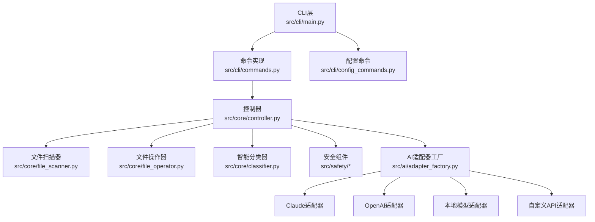
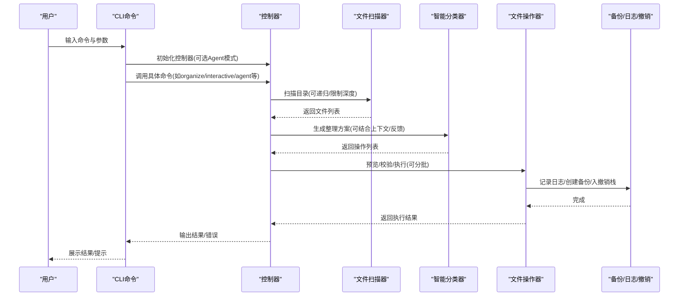
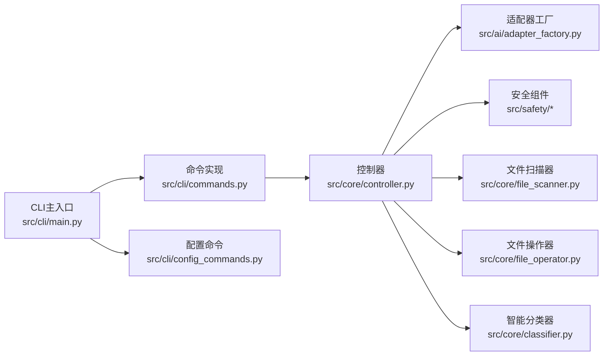
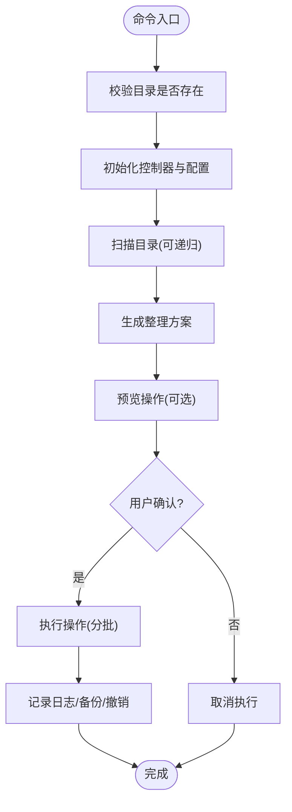

# 命令使用示例

<cite>
**本文引用的文件**
- [README.md](file://README.md)
- [QUICKSTART.md](file://QUICKSTART.md)
- [docs/USAGE.md](file://docs/USAGE.md)
- [docs/API.md](file://docs/API.md)
- [src/cli/main.py](file://src/cli/main.py)
- [src/cli/commands.py](file://src/cli/commands.py)
- [src/cli/config_commands.py](file://src/cli/config_commands.py)
- [config/default_config.yaml](file://config/default_config.yaml)
- [src/core/controller.py](file://src/core/controller.py)
- [src/ai/adapter_factory.py](file://src/ai/adapter_factory.py)
- [examples/basic_usage.py](file://examples/basic_usage.py)
- [examples/custom_api_example.py](file://examples/custom_api_example.py)
- [examples/langchain_example.py](file://examples/langchain_example.py)
- [examples/test_custom_api.py](file://examples/test_custom_api.py)
</cite>

## 目录
1. [简介](#简介)
2. [项目结构](#项目结构)
3. [核心组件](#核心组件)
4. [架构总览](#架构总览)
5. [详细组件分析](#详细组件分析)
6. [依赖关系分析](#依赖关系分析)
7. [性能考虑](#性能考虑)
8. [故障排除指南](#故障排除指南)
9. [结论](#结论)
10. [附录](#附录)

## 简介
本文件面向使用者与开发者，系统性地展示该智能文件整理工具的CLI命令使用方法，覆盖从基础到高级的完整使用案例，包括单文件操作、批量处理、复杂场景、AI提供商配置、错误处理与故障排除、自动化脚本与批处理示例、性能优化与最佳实践，以及常见问题与调试技巧。文档同时提供可视化图示，帮助读者快速理解命令流与内部架构。

## 项目结构
该项目采用分层架构，CLI层负责用户交互，控制器层协调业务逻辑，AI适配器层抽象不同提供商，文件服务层负责扫描与操作，安全层提供日志、备份与撤销能力。CLI命令通过控制器统一调度，既支持传统模式，也支持基于LangChain的Agent模式。

图表来源
- [src/cli/main.py](file://src/cli/main.py#L22-L138)
- [src/cli/commands.py](file://src/cli/commands.py#L1-L556)
- [src/cli/config_commands.py](file://src/cli/config_commands.py#L1-L219)
- [src/core/controller.py](file://src/core/controller.py#L15-L310)
- [src/ai/adapter_factory.py](file://src/ai/adapter_factory.py#L11-L98)

章节来源
- [README.md](file://README.md#L220-L241)
- [docs/USAGE.md](file://docs/USAGE.md#L57-L122)

## 核心组件
- CLI主入口与命令注册：定义主应用、子命令与参数，统一调度至命令实现。
- 命令实现：封装组织、交互、撤销、历史、Agent、建议、分析、聊天等命令的完整流程。
- 控制器：协调扫描、分类、执行、日志、备份、撤销等模块；支持Agent模式与传统模式切换。
- AI适配器工厂：根据配置动态创建不同提供商的适配器。
- 配置管理：集中管理AI提供商、LangChain Agent、文件操作、安全与日志等配置。

章节来源
- [src/cli/main.py](file://src/cli/main.py#L22-L138)
- [src/cli/commands.py](file://src/cli/commands.py#L18-L556)
- [src/core/controller.py](file://src/core/controller.py#L15-L310)
- [src/ai/adapter_factory.py](file://src/ai/adapter_factory.py#L11-L98)
- [config/default_config.yaml](file://config/default_config.yaml#L1-L79)

## 架构总览
CLI命令到控制器再到各子系统的调用链如下所示：

图表来源
- [src/cli/commands.py](file://src/cli/commands.py#L18-L556)
- [src/core/controller.py](file://src/core/controller.py#L83-L310)

## 详细组件分析

### 命令与使用场景总览
- 单次整理：一次性生成方案并执行，适合明确需求且无需反复确认的场景。
- 交互式整理：可多次对话、预览、反馈优化，适合不确定或需要迭代的场景。
- Agent模式：基于LangChain的智能Agent，具备自主决策与工具调用能力，适合复杂场景。
- 建议与分析：仅分析目录或文件，不执行操作，便于预判与规划。
- 聊天：与Agent进行自然语言对话，辅助制定整理策略。
- 撤销与历史：支持撤销最近一次操作与查看历史记录，保障安全性。

章节来源
- [README.md](file://README.md#L103-L148)
- [docs/USAGE.md](file://docs/USAGE.md#L57-L143)

### 基础使用案例
- 单次整理（预览+执行）
  - 预览：使用预览模式先查看将要执行的操作，确保无误后再执行。
  - 执行：确认后按批次执行，自动备份与记录日志。
- 交互式整理
  - 多轮对话：描述需求→生成方案→预览→确认→执行→收集反馈→优化方案。
  - 适用于不确定需求或需要逐步细化的场景。
- 建议与分析
  - 使用建议命令获取整理思路，使用分析命令深入理解单个文件内容。

章节来源
- [docs/USAGE.md](file://docs/USAGE.md#L59-L121)
- [src/cli/commands.py](file://src/cli/commands.py#L18-L238)

### 批量处理与自动化脚本
- 批处理策略
  - 控制器按批次执行文件操作，默认批次大小可在配置中调整。
  - 大量文件建议分批次、分目标逐步整理，避免一次性操作过多导致风险与资源压力。
- 自动化脚本示例
  - 使用CLI命令编写批处理脚本，结合定时任务或CI/CD流水线，实现周期性整理。
  - 示例脚本可参考示例文件中的基本用法与自定义API示例，按需修改路径与请求。

章节来源
- [config/default_config.yaml](file://config/default_config.yaml#L48-L51)
- [docs/USAGE.md](file://docs/USAGE.md#L199-L202)
- [examples/basic_usage.py](file://examples/basic_usage.py#L7-L36)
- [examples/custom_api_example.py](file://examples/custom_api_example.py#L7-L81)

### 复杂场景与高级用法
- 多轮反馈优化
  - 交互式模式下，用户可提供反馈，控制器根据反馈优化后续方案，形成“需求→方案→反馈→优化”的闭环。
- Agent模式
  - Agent具备工具调用能力，可自动扫描、分析、分类与执行，适合大规模与复杂规则的整理任务。
- 自定义API与第三方服务
  - 支持任何兼容OpenAI API的第三方服务，如Azure OpenAI、通义千问、DeepSeek、Moonshot等。
  - 提供测试脚本验证配置与连接，确保Agent与LangChain集成正常。

章节来源
- [src/cli/commands.py](file://src/cli/commands.py#L125-L238)
- [src/core/controller.py](file://src/core/controller.py#L142-L198)
- [examples/langchain_example.py](file://examples/langchain_example.py#L9-L200)
- [examples/test_custom_api.py](file://examples/test_custom_api.py#L24-L390)

### 不同AI提供商的配置与使用
- Claude
  - 设置API Key与模型，适合高质量推理与稳定性。
- OpenAI
  - 设置API Key与模型，适合通用与多模态场景。
- 本地模型（Ollama）
  - 本地部署模型，无需网络，适合隐私敏感与离线场景。
- 自定义API
  - 任意兼容OpenAI API的服务，通过配置文件或命令设置base_url、api_key、model等。

章节来源
- [README.md](file://README.md#L41-L88)
- [QUICKSTART.md](file://QUICKSTART.md#L28-L98)
- [src/cli/config_commands.py](file://src/cli/config_commands.py#L50-L187)
- [src/ai/adapter_factory.py](file://src/ai/adapter_factory.py#L14-L98)

### 错误处理与故障排除
- 常见问题
  - 无法连接AI服务：检查API Key、网络与代理；使用配置测试命令验证连接。
  - 文件未移动：确认未启用预览模式；检查权限与路径；查看历史记录。
  - 分类不准确：提供更详细需求；使用交互式模式并持续反馈；调整模型参数。
- 安全与恢复
  - 自动备份与撤销：执行前自动备份，失败时可撤销；历史记录可追溯。
  - 日志与审计：操作日志记录详细信息，便于排查与审计。

章节来源
- [docs/USAGE.md](file://docs/USAGE.md#L178-L229)
- [src/cli/commands.py](file://src/cli/commands.py#L241-L280)
- [src/core/controller.py](file://src/core/controller.py#L218-L256)

### 性能优化与最佳实践
- 扫描优化
  - 降低扫描深度与最大文件大小，减少内容读取开销。
- 分类优化
  - 适当降低温度以提升稳定性与速度。
- 批处理优化
  - 合理设置批次大小，避免单批过大导致内存与超时。
- 安全与稳健
  - 先预览后执行；分批次、分目标推进；重要文件提前备份。

章节来源
- [docs/USAGE.md](file://docs/USAGE.md#L203-L229)
- [config/default_config.yaml](file://config/default_config.yaml#L207-L222)

## 依赖关系分析
CLI命令与核心模块之间的依赖关系如下：

图表来源
- [src/cli/main.py](file://src/cli/main.py#L10-L21)
- [src/cli/commands.py](file://src/cli/commands.py#L10-L15)
- [src/core/controller.py](file://src/core/controller.py#L15-L82)
- [src/ai/adapter_factory.py](file://src/ai/adapter_factory.py#L11-L98)

章节来源
- [src/cli/main.py](file://src/cli/main.py#L22-L138)
- [src/cli/commands.py](file://src/cli/commands.py#L18-L556)
- [src/core/controller.py](file://src/core/controller.py#L15-L310)

## 性能考虑
- 扫描阶段
  - 通过配置限制扫描深度与最大文件大小，避免对大体积文件进行内容读取。
- 分类阶段
  - 适当降低温度以提升稳定性；必要时选择更轻量的模型。
- 执行阶段
  - 合理设置批次大小，避免单批过大导致内存压力与超时；失败时自动回滚。
- 并发与资源
  - 避免同时对同一文件进行多次操作；合理安排任务队列与资源分配。

章节来源
- [config/default_config.yaml](file://config/default_config.yaml#L48-L51)
- [config/default_config.yaml](file://config/default_config.yaml#L216-L222)
- [src/core/controller.py](file://src/core/controller.py#L218-L256)

## 故障排除指南
- 连接问题
  - 使用配置测试命令检查默认提供商与关键配置项；若Agent模式不可用，回退到传统模式。
- 执行问题
  - 检查预览与校验结果；查看历史记录定位失败原因；必要时撤销并重试。
- 自定义API问题
  - 使用测试脚本逐项验证环境变量、配置加载、LLM创建、连接与Agent对话；按提示修正配置。

章节来源
- [src/cli/config_commands.py](file://src/cli/config_commands.py#L190-L219)
- [src/cli/commands.py](file://src/cli/commands.py#L241-L280)
- [examples/test_custom_api.py](file://examples/test_custom_api.py#L24-L390)

## 结论
该CLI工具提供了从基础到高级的完整使用路径：单次整理、交互式整理、Agent模式、建议与分析、聊天、撤销与历史等。通过灵活的AI提供商配置与强大的安全机制，既能满足日常整理需求，也能应对复杂场景。配合性能优化与故障排除策略，可实现稳定高效的自动化文件管理。

## 附录

### 常用命令速查
- 单次整理：smart-tidy organize <目录> --request "<需求>"
- 交互式整理：smart-tidy interactive <目录>
- Agent模式：smart-tidy agent <目录> --request "<需求>"
- 建议与分析：smart-tidy suggest <目录>；smart-tidy analyze <文件>
- 聊天：smart-tidy chat
- 撤销与历史：smart-tidy undo；smart-tidy history --limit N
- 配置：smart-tidy config show；smart-tidy config test；smart-tidy config set-provider <提供商> ...

章节来源
- [README.md](file://README.md#L134-L148)
- [QUICKSTART.md](file://QUICKSTART.md#L149-L175)

### 自定义API配置示例
- Azure OpenAI、通义千问、DeepSeek、Moonshot等服务均可通过自定义API接入。
- 示例脚本展示了如何设置base_url、api_key、model，并生成操作列表。

章节来源
- [examples/custom_api_example.py](file://examples/custom_api_example.py#L7-L81)
- [examples/test_custom_api.py](file://examples/test_custom_api.py#L64-L82)

### 代码级流程图：单次整理命令

图表来源
- [src/cli/commands.py](file://src/cli/commands.py#L18-L123)
- [src/core/controller.py](file://src/core/controller.py#L203-L256)