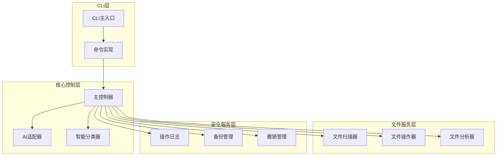
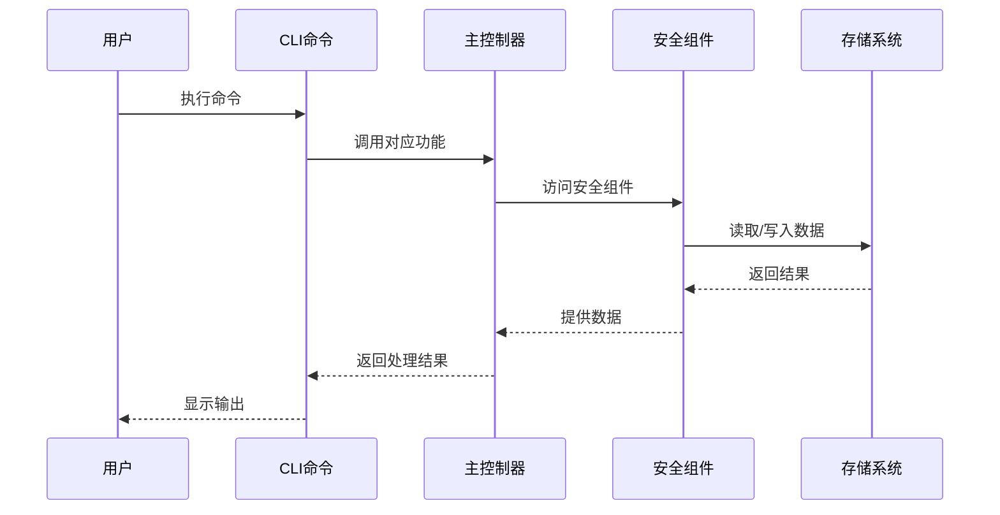
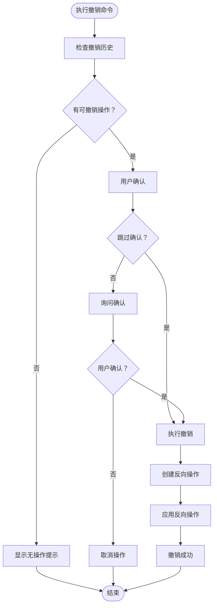
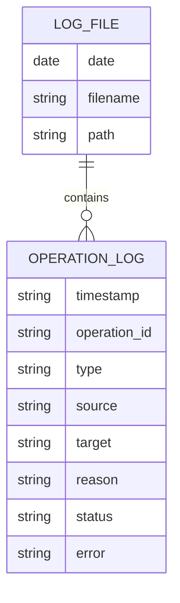
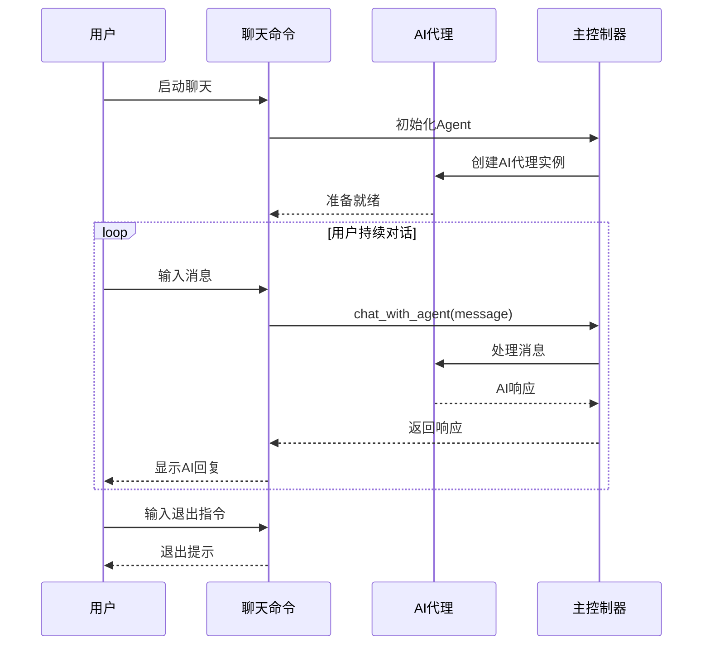
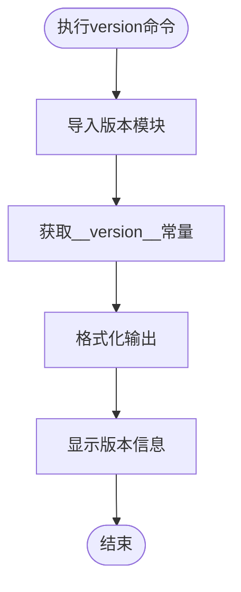
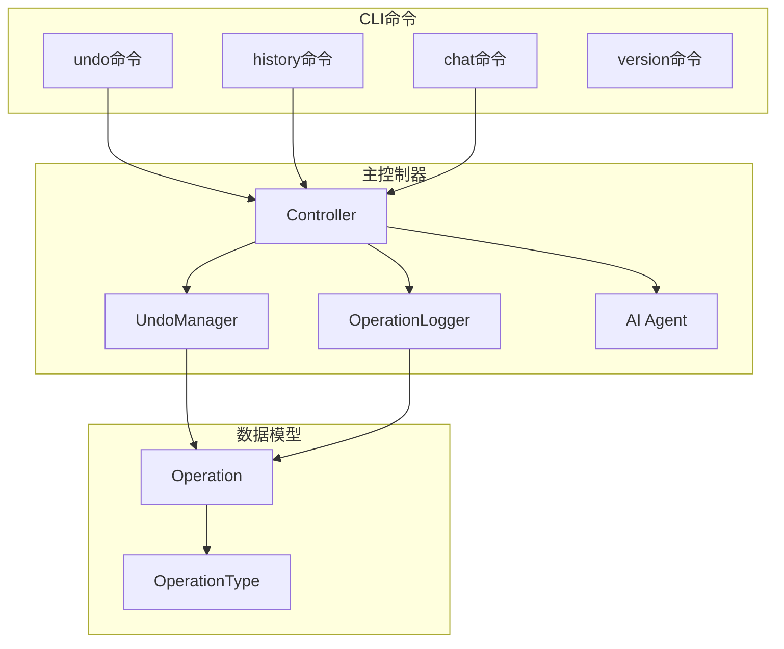

# 实用工具命令

<cite>
**本文引用的文件**
- [src/cli/main.py](file://src/cli/main.py)
- [src/cli/commands.py](file://src/cli/commands.py)
- [src/core/controller.py](file://src/core/controller.py)
- [src/safety/undo_manager.py](file://src/safety/undo_manager.py)
- [src/safety/operation_log.py](file://src/safety/operation_log.py)
- [src/models/operation.py](file://src/models/operation.py)
- [src/__init__.py](file://src/__init__.py)
- [setup.py](file://setup.py)
- [README.md](file://README.md)
- [QUICKSTART.md](file://QUICKSTART.md)
- [config/default_config.yaml](file://config/default_config.yaml)
</cite>

## 目录
1. [简介](#简介)
2. [项目结构](#项目结构)
3. [核心组件](#核心组件)
4. [架构概览](#架构概览)
5. [详细组件分析](#详细组件分析)
6. [依赖关系分析](#依赖关系分析)
7. [性能考虑](#性能考虑)
8. [故障排除指南](#故障排除指南)
9. [结论](#结论)
10. [附录](#附录)

## 简介
本文档详细介绍智能文件整理助手中的实用工具命令，包括 undo、history、chat、version 等辅助命令的功能、使用方法和工作机制。通过深入分析代码实现，帮助用户更好地理解和使用这些命令，提高文件整理的效率和安全性。

## 项目结构
该项目采用模块化设计，主要分为以下几个层次：



**图表来源**
- [src/cli/main.py](file://src/cli/main.py#L1-L138)
- [src/cli/commands.py](file://src/cli/commands.py#L1-L556)
- [src/core/controller.py](file://src/core/controller.py#L1-L310)

**章节来源**
- [src/cli/main.py](file://src/cli/main.py#L1-L138)
- [src/cli/commands.py](file://src/cli/commands.py#L1-L556)
- [src/core/controller.py](file://src/core/controller.py#L1-L310)

## 核心组件
本节概述实用工具命令涉及的核心组件及其职责：

### 撤销管理器 (UndoManager)
负责管理文件操作的撤销功能，支持多种操作类型的反向执行。

### 操作日志 (OperationLogger)
记录所有文件操作的历史信息，支持查询和审计功能。

### 操作模型 (Operation)
定义文件操作的数据结构和类型枚举。

### 主控制器 (Controller)
协调各个组件，提供统一的接口给CLI命令使用。

**章节来源**
- [src/safety/undo_manager.py](file://src/safety/undo_manager.py#L1-L155)
- [src/safety/operation_log.py](file://src/safety/operation_log.py#L1-L133)
- [src/models/operation.py](file://src/models/operation.py#L1-L54)
- [src/core/controller.py](file://src/core/controller.py#L1-L310)

## 架构概览
实用工具命令的执行流程遵循统一的架构模式：



**图表来源**
- [src/cli/commands.py](file://src/cli/commands.py#L241-L280)
- [src/core/controller.py](file://src/core/controller.py#L287-L305)

## 详细组件分析

### 撤销命令 (undo)
撤销命令允许用户撤销最后一次执行的文件操作，确保操作的安全性。

#### 命令语法
```bash
smart-tidy undo [--yes|-y]
```

#### 工作原理
撤销机制通过以下步骤实现：



**图表来源**
- [src/cli/commands.py](file://src/cli/commands.py#L241-L280)
- [src/safety/undo_manager.py](file://src/safety/undo_manager.py#L50-L77)

#### 撤销支持的操作类型
- **移动操作 (MOVE)**: 将文件移回原位置
- **重命名操作 (RENAME)**: 将文件改回原名称
- **创建文件夹操作 (CREATE_FOLDER)**: 删除空文件夹

#### 实际使用示例
```bash
# 基本撤销
smart-tidy undo

# 跳过确认直接撤销
smart-tidy undo --yes

# 撤销后查看历史
smart-tidy history --limit 5
```

**章节来源**
- [src/cli/commands.py](file://src/cli/commands.py#L241-L280)
- [src/safety/undo_manager.py](file://src/safety/undo_manager.py#L96-L155)
- [src/core/controller.py](file://src/core/controller.py#L287-L301)

### 历史命令 (history)
历史命令用于查看系统执行过的所有文件操作记录。

#### 命令语法
```bash
smart-tidy history [--limit N|-n N]
```

#### 数据存储格式
操作历史采用 JSON Lines (JSONL) 格式存储在 `data/logs/` 目录中：



**图表来源**
- [src/safety/operation_log.py](file://src/safety/operation_log.py#L24-L53)

#### 查询方式
- **最近记录**: 读取最近7天的日志文件
- **按日期查询**: 通过文件名中的日期筛选
- **限制数量**: 支持限制返回的记录数量

#### 实际使用示例
```bash
# 查看最近10条记录
smart-tidy history

# 查看最近50条记录
smart-tidy history --limit 50

# 查看特定日期的记录
smart-tidy history --limit 100
```

**章节来源**
- [src/cli/commands.py](file://src/cli/commands.py#L282-L321)
- [src/safety/operation_log.py](file://src/safety/operation_log.py#L54-L84)
- [src/core/controller.py](file://src/core/controller.py#L302-L305)

### 聊天命令 (chat)
聊天命令提供与AI助手的交互式对话功能，支持自然语言交流。

#### 命令语法
```bash
smart-tidy chat [--provider PROVIDER|-p PROVIDER]
```

#### 交互模式
聊天命令采用持续对话模式：



**图表来源**
- [src/cli/commands.py](file://src/cli/commands.py#L513-L556)
- [src/core/controller.py](file://src/core/controller.py#L192-L198)

#### 使用场景
- **需求澄清**: 与AI讨论文件整理的具体要求
- **方案优化**: 基于AI建议调整整理策略
- **问题咨询**: 获取使用指导和技术支持
- **创意启发**: 探索新的文件组织方式

#### 实际使用示例
```bash
# 基本聊天
smart-tidy chat

# 指定AI提供商
smart-tidy chat --provider claude

# 退出聊天
输入 quit 或 exit
```

**章节来源**
- [src/cli/commands.py](file://src/cli/commands.py#L513-L556)
- [src/core/controller.py](file://src/core/controller.py#L192-L198)

### 版本命令 (version)
版本命令用于显示当前软件的版本信息。

#### 命令语法
```bash
smart-tidy version
```

#### 版本信息获取
版本信息通过以下方式获取：



**图表来源**
- [src/cli/main.py](file://src/cli/main.py#L129-L134)
- [src/__init__.py](file://src/__init__.py#L1-L4)

#### 版本信息内容
- **软件名称**: smart-tidy
- **版本号**: 0.1.0
- **作者信息**: Smart File Tidy Team

#### 实际使用示例
```bash
# 查看版本
smart-tidy version

# 输出示例
smart-tidy version 0.1.0
```

**章节来源**
- [src/cli/main.py](file://src/cli/main.py#L129-L134)
- [src/__init__.py](file://src/__init__.py#L1-L4)
- [setup.py](file://setup.py#L8)

## 依赖关系分析

### 组件耦合关系
实用工具命令与核心组件的依赖关系如下：



**图表来源**
- [src/cli/commands.py](file://src/cli/commands.py#L241-L556)
- [src/core/controller.py](file://src/core/controller.py#L1-L310)
- [src/safety/undo_manager.py](file://src/safety/undo_manager.py#L1-L155)
- [src/safety/operation_log.py](file://src/safety/operation_log.py#L1-L133)
- [src/models/operation.py](file://src/models/operation.py#L1-L54)

### 关键依赖链
1. **CLI命令** → **主控制器**: 所有实用工具命令都通过主控制器访问核心功能
2. **主控制器** → **撤销管理器**: 撤销功能依赖撤销管理器
3. **主控制器** → **操作日志**: 历史查询依赖操作日志系统
4. **主控制器** → **AI代理**: 聊天功能依赖AI代理
5. **数据模型** → **撤销管理器**: 撤销操作需要操作类型信息
6. **数据模型** → **操作日志**: 日志记录需要操作详情

**章节来源**
- [src/cli/commands.py](file://src/cli/commands.py#L1-L556)
- [src/core/controller.py](file://src/core/controller.py#L1-L310)
- [src/safety/undo_manager.py](file://src/safety/undo_manager.py#L1-L155)
- [src/safety/operation_log.py](file://src/safety/operation_log.py#L1-L133)
- [src/models/operation.py](file://src/models/operation.py#L1-L54)

## 性能考虑
实用工具命令在设计时考虑了以下性能因素：

### 撤销操作性能
- **批量处理**: 撤销操作按批次执行，避免一次性处理大量文件
- **反向操作优化**: 只记录必要的反向操作信息，减少内存占用
- **异常处理**: 单个操作失败不影响其他操作的撤销

### 历史查询性能
- **文件分割**: 按日期分割日志文件，避免单个大文件
- **限制读取**: 默认只读取最近7天的日志文件
- **增量加载**: 支持限制返回的记录数量

### 聊天交互性能
- **异步处理**: 聊天请求采用异步处理模式
- **缓存机制**: AI代理结果支持缓存，减少重复计算
- **超时控制**: 设置合理的超时时间，避免长时间等待

## 故障排除指南

### 撤销功能问题
**问题**: 无法撤销操作
- **检查**: 确认有可撤销的操作历史
- **解决**: 查看历史记录，确认操作类型是否支持撤销

**问题**: 撤销失败
- **检查**: 源文件是否存在
- **解决**: 检查文件权限，确保有足够的访问权限

### 历史查询问题
**问题**: 历史记录不完整
- **检查**: 确认日志目录权限
- **解决**: 检查磁盘空间，清理过期日志

**问题**: 查询速度慢
- **优化**: 使用 `--limit` 参数限制返回数量
- **解决**: 指定具体日期范围查询

### 聊天功能问题
**问题**: 无法连接AI代理
- **检查**: 确认AI提供商配置正确
- **解决**: 使用 `smart-tidy config test` 测试连接

**问题**: 聊天响应慢
- **优化**: 简化问题描述，提供更明确的指令
- **解决**: 检查网络连接和API密钥

### 版本信息问题
**问题**: 版本号显示异常
- **检查**: 确认包正确安装
- **解决**: 重新安装软件包

**章节来源**
- [src/cli/commands.py](file://src/cli/commands.py#L241-L556)
- [src/safety/undo_manager.py](file://src/safety/undo_manager.py#L1-L155)
- [src/safety/operation_log.py](file://src/safety/operation_log.py#L1-L133)
- [src/core/controller.py](file://src/core/controller.py#L1-L310)

## 结论
实用工具命令为智能文件整理助手提供了强大的辅助功能。通过撤销机制确保操作安全，通过历史记录提供审计能力，通过聊天功能增强用户体验，通过版本管理保持软件更新。这些命令的设计体现了高内聚、低耦合的原则，为用户提供了安全、便捷、高效的文件管理体验。

## 附录

### 常用命令速查表
| 命令 | 语法 | 功能描述 |
|------|------|----------|
| 撤销 | `smart-tidy undo [--yes]` | 撤销最后一次操作 |
| 历史 | `smart-tidy history [--limit N]` | 查看操作历史 |
| 聊天 | `smart-tidy chat [--provider]` | 与AI助手对话 |
| 版本 | `smart-tidy version` | 显示版本信息 |

### 配置选项
- **撤销历史限制**: `safety.max_undo_history` (默认: 10)
- **日志保留天数**: `logging.retention_days` (默认: 30)
- **日志目录**: `logging.log_dir` (默认: data/logs)

### 最佳实践
1. **定期清理日志**: 使用 `cleanup_old_logs()` 方法清理过期日志
2. **谨慎使用撤销**: 撤销操作不可逆，使用前确认必要性
3. **合理设置限制**: 使用 `--limit` 参数控制历史记录数量
4. **备份重要文件**: 在执行重大操作前做好备份

**章节来源**
- [config/default_config.yaml](file://config/default_config.yaml#L67-L79)
- [src/safety/operation_log.py](file://src/safety/operation_log.py#L111-L133)
- [README.md](file://README.md#L134-L148)
- [QUICKSTART.md](file://QUICKSTART.md#L149-L175)