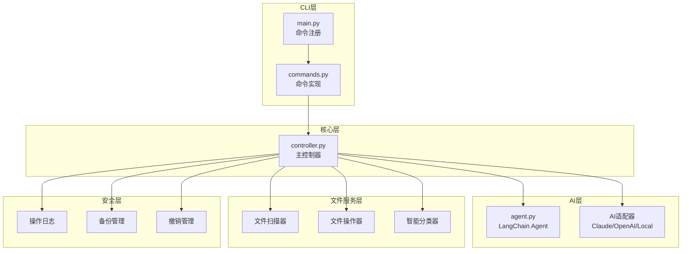
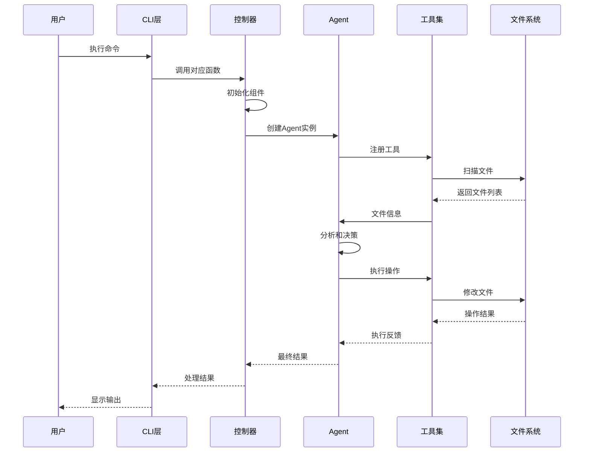
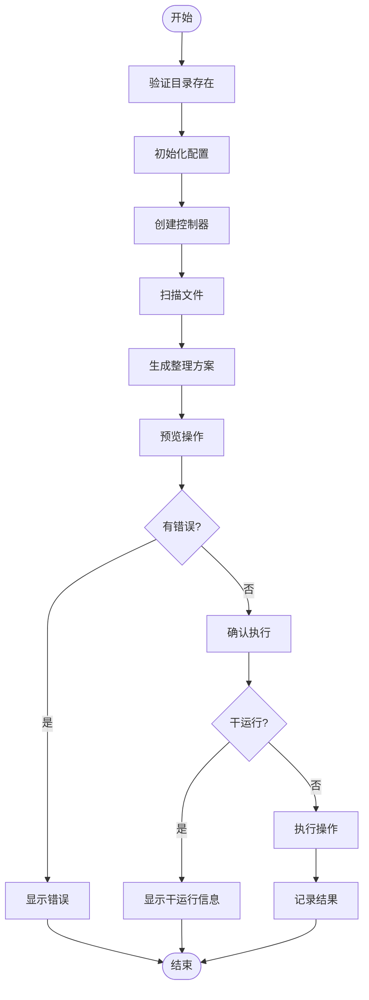
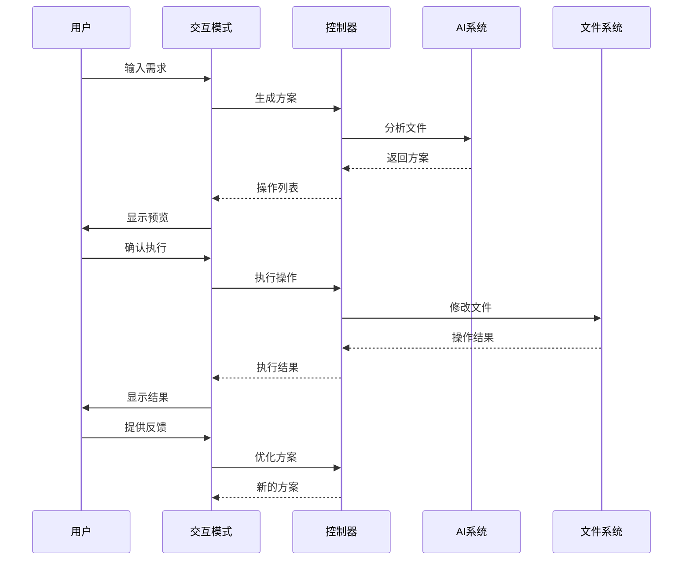
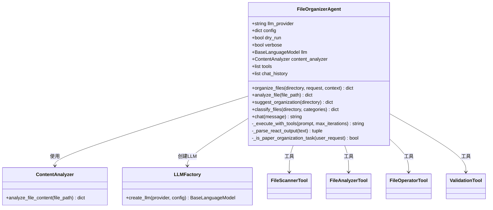
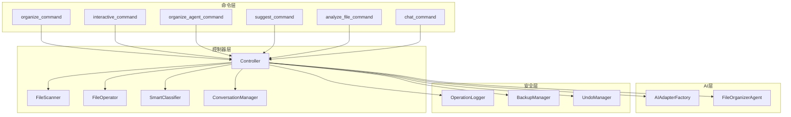

# 核心操作命令

<cite>
**本文引用的文件**
- [README.md](file://README.md)
- [QUICKSTART.md](file://QUICKSTART.md)
- [docs/USAGE.md](file://docs/USAGE.md)
- [src/cli/main.py](file://src/cli/main.py)
- [src/cli/commands.py](file://src/cli/commands.py)
- [src/core/controller.py](file://src/core/controller.py)
- [src/langchain_integration/agent.py](file://src/langchain_integration/agent.py)
- [src/models/operation.py](file://src/models/operation.py)
- [config/default_config.yaml](file://config/default_config.yaml)
- [examples/basic_usage.py](file://examples/basic_usage.py)
</cite>

## 目录
1. [简介](#简介)
2. [项目结构](#项目结构)
3. [核心组件](#核心组件)
4. [架构概览](#架构概览)
5. [详细组件分析](#详细组件分析)
6. [依赖关系分析](#依赖关系分析)
7. [性能考虑](#性能考虑)
8. [故障排除指南](#故障排除指南)
9. [结论](#结论)
10. [附录](#附录)

## 简介
本文档深入解析智能文件整理助手的核心操作命令，包括 organize、interactive、agent、suggest、analyze 等命令的功能特性、参数选项、默认值、约束条件以及组合使用方式。通过丰富的使用示例和最佳实践，帮助用户选择合适的命令进行文件整理，并提供错误处理、调试技巧和性能优化建议。

## 项目结构
该项目采用模块化架构，主要分为以下层次：
- CLI 层：基于 Typer 和 Rich 的命令行接口
- 控制器层：协调业务逻辑的核心控制器
- AI 适配器层：支持 Claude、OpenAI、本地模型和自定义 API
- 文件服务层：文件扫描、操作和元数据处理
- 安全服务层：操作日志、备份和撤销管理



**图表来源**
- [src/cli/main.py](file://src/cli/main.py#L23-L137)
- [src/cli/commands.py](file://src/cli/commands.py#L1-L556)
- [src/core/controller.py](file://src/core/controller.py#L15-L310)

**章节来源**
- [src/cli/main.py](file://src/cli/main.py#L1-L138)
- [src/cli/commands.py](file://src/cli/commands.py#L1-L556)
- [src/core/controller.py](file://src/core/controller.py#L1-L310)

## 核心组件
本节详细介绍五个核心命令及其功能特性：

### organize 命令
单次整理命令，适合一次性执行明确的整理需求。

**主要功能：**
- 扫描指定目录中的文件
- 生成整理方案
- 预览操作结果
- 执行文件整理操作

**关键参数：**
- `directory`: 目标目录路径（必需）
- `request`: 整理需求描述（必需）
- `recursive`: 递归扫描子目录（布尔值，默认 False）
- `dry-run`: 仅预览不执行（布尔值，默认 False）
- `provider`: AI提供商（claude/openai/local/custom）
- `batch-size`: 批次大小（整数，默认 50）
- `no-backup`: 不创建备份（布尔值，默认 False）

**默认值和约束：**
- 批次大小：50（受配置文件影响）
- 备份：默认启用
- 递归：默认关闭
- 干运行：默认关闭

### interactive 命令
交互式整理模式，支持多轮对话和反馈优化。

**主要功能：**
- 扫描目录并显示文件列表
- 循环接收用户需求
- 生成和预览操作方案
- 支持编辑和撤销操作

**关键参数：**
- `directory`: 目标目录路径（必需）
- `recursive`: 递归扫描（布尔值，默认 False）
- `provider`: AI提供商

**交互流程：**
1. 扫描目录
2. 用户输入需求
3. AI生成方案
4. 预览操作结果
5. 用户确认执行
6. 更新文件列表
7. 收集反馈进行优化

### agent 命令
基于 LangChain Agent 的智能整理模式，推荐使用。

**主要功能：**
- 使用 Agent 模式进行文件整理
- 支持论文整理的特殊逻辑
- 提供详细的执行报告
- 支持干运行模式

**关键参数：**
- `directory`: 目标目录路径（必需）
- `request`: 整理需求描述（必需）
- `provider`: AI提供商（支持更多选项）
- `dry-run`: 干运行模式

**Agent 特性：**
- 自动检测论文整理任务
- 使用 ReAct 格式进行推理
- 集成多种工具（扫描、分析、操作、验证）

### suggest 命令
分析目录并提供整理建议。

**主要功能：**
- 分析目录结构和文件特征
- 提供整理建议和方案
- 不执行实际操作

**关键参数：**
- `directory`: 要分析的目录路径（必需）
- `provider`: AI提供商

**输出内容：**
- 文件类型分布分析
- 建议的文件夹结构
- 分类维度和策略

### analyze 命令
深度分析单个文件。

**主要功能：**
- 分析单个文件的元数据
- 提取内容特征
- 提供详细分析报告

**关键参数：**
- `file-path`: 要分析的文件路径（必需）
- `provider`: AI提供商

**分析内容：**
- 基本文件信息（名称、类型、大小）
- 内容分析结果
- 结构化元数据

**章节来源**
- [src/cli/main.py](file://src/cli/main.py#L35-L127)
- [src/cli/commands.py](file://src/cli/commands.py#L18-L511)
- [src/core/controller.py](file://src/core/controller.py#L15-L310)

## 架构概览
系统采用分层架构，各层职责明确：



**图表来源**
- [src/cli/commands.py](file://src/cli/commands.py#L18-L511)
- [src/core/controller.py](file://src/core/controller.py#L15-L310)
- [src/langchain_integration/agent.py](file://src/langchain_integration/agent.py#L21-L576)

## 详细组件分析

### organize 命令实现
organize 命令实现了完整的文件整理流程：



**图表来源**
- [src/cli/commands.py](file://src/cli/commands.py#L18-L123)
- [src/core/controller.py](file://src/core/controller.py#L203-L255)

**实现特点：**
- 支持干运行模式
- 自动备份机制
- 详细的操作预览
- 错误处理和回滚

### interactive 命令实现
交互式模式提供了灵活的多轮对话能力：



**图表来源**
- [src/cli/commands.py](file://src/cli/commands.py#L125-L238)
- [src/core/controller.py](file://src/core/controller.py#L257-L285)

**交互特性：**
- 支持无限轮对话
- 实时反馈收集
- 动态方案优化
- 文件列表更新

### agent 命令实现
Agent 模式使用 LangChain 的强大推理能力：



**图表来源**
- [src/langchain_integration/agent.py](file://src/langchain_integration/agent.py#L21-L576)

**Agent 特性：**
- ReAct 推理模式
- 多工具协作
- 论文整理优化
- 详细的执行报告

**章节来源**
- [src/cli/commands.py](file://src/cli/commands.py#L349-L417)
- [src/langchain_integration/agent.py](file://src/langchain_integration/agent.py#L1-L576)

## 依赖关系分析



**图表来源**
- [src/cli/commands.py](file://src/cli/commands.py#L1-L556)
- [src/core/controller.py](file://src/core/controller.py#L15-L310)

**依赖特点：**
- 命令层依赖控制器层
- 控制器层统一管理所有组件
- AI层提供两种模式支持
- 安全层贯穿所有操作

**章节来源**
- [src/core/controller.py](file://src/core/controller.py#L15-L82)
- [src/cli/commands.py](file://src/cli/commands.py#L1-L556)

## 性能考虑
基于配置文件和实现细节，系统在性能方面有以下优化：

### 配置优化
- **批次处理**：默认 50 个文件一批，可通过配置调整
- **文件大小限制**：超过 100MB 的文件不读取内容
- **扫描深度**：默认最大深度为 5 层目录
- **AI 温度控制**：默认 0.7，平衡准确性与速度

### 执行优化
- **异步进度显示**：使用 Rich 进度条提升用户体验
- **内存管理**：文件扫描后及时释放资源
- **缓存机制**：Agent 会话历史减少重复计算
- **批量操作**：文件操作支持批量执行

### 最佳实践建议
1. **合理设置批次大小**：大量小文件使用较小批次，大文件使用较大批次
2. **控制扫描深度**：避免不必要的深层扫描
3. **使用干运行**：在生产环境中先进行干运行测试
4. **分批执行**：对于大规模整理，建议分批进行

**章节来源**
- [config/default_config.yaml](file://config/default_config.yaml#L48-L79)
- [src/core/controller.py](file://src/core/controller.py#L67-L70)

## 故障排除指南

### 常见问题及解决方案

**问题1：AI 服务连接失败**
- 检查 API Key 配置
- 验证网络连接
- 确认提供商服务状态
- 使用 `smart-tidy config test` 测试连接

**问题2：文件没有移动**
- 检查是否使用了 `--dry-run` 参数
- 确认文件权限
- 验证目标目录存在性
- 查看操作历史记录

**问题3：分类不准确**
- 提供更详细的需求描述
- 使用交互式模式收集反馈
- 考虑调整 AI 模型参数
- 检查文件元数据提取

**问题4：Agent 模式不可用**
- 确认 LangChain 依赖已安装
- 检查 Agent 初始化状态
- 验证 AI 提供商配置
- 查看详细错误信息

### 调试技巧
1. **启用详细日志**：查看 `data/logs/` 目录中的操作日志
2. **使用干运行模式**：先预览操作结果再执行
3. **分步调试**：使用 `smart-tidy suggest` 获取建议
4. **检查配置**：使用 `smart-tidy config show` 查看当前配置

### 错误处理机制
- **自动备份**：操作失败时自动创建备份点
- **撤销功能**：支持撤销最后一次操作
- **详细错误报告**：提供完整的错误信息和堆栈跟踪
- **优雅降级**：Agent 模式失败时自动回退到传统模式

**章节来源**
- [src/cli/commands.py](file://src/cli/commands.py#L119-L122)
- [src/core/controller.py](file://src/core/controller.py#L243-L255)

## 结论
智能文件整理助手提供了完整的文件管理解决方案，通过五个核心命令满足不同场景的需求：

1. **organize**：适合一次性明确需求的整理任务
2. **interactive**：适合复杂和需要反馈的整理任务
3. **agent**：推荐使用的智能整理模式，功能最全面
4. **suggest**：用于获取整理建议和方案
5. **analyze**：用于深度分析单个文件

系统的设计充分考虑了安全性、可扩展性和易用性，通过配置文件和命令行参数提供了灵活的定制能力。建议用户根据具体需求选择合适的命令，并遵循最佳实践确保操作的安全性和有效性。

## 附录

### 命令使用示例

**基础使用示例：**
```bash
# 单次整理
smart-tidy organize ~/Downloads --request "整理所有PDF文件"

# 交互式整理
smart-tidy interactive ~/Documents

# Agent 模式整理
smart-tidy agent ~/Files --request "按类型分类"

# 获取建议
smart-tidy suggest ~/Projects

# 分析单个文件
smart-tidy analyze ~/Documents/report.pdf
```

**高级使用示例：**
```bash
# 递归扫描
smart-tidy organize ~/LargeFolder --recursive --request "整理"

# 干运行模式
smart-tidy organize ~/Test --dry-run --request "预览"

# 指定提供商
smart-tidy organize ~/Files --request "整理" --provider openai

# 自定义批次大小
smart-tidy organize ~/Batch --request "整理" --batch-size 100
```

**组合使用示例：**
```bash
# 建议 + 交互式优化
smart-tidy suggest ~/Projects
smart-tidy interactive ~/Projects

# 分析 + 整理
smart-tidy analyze ~/Important.pdf
smart-tidy organize ~/Important --request "按类型整理"
```

### 参数参考表

| 命令 | 参数 | 类型 | 默认值 | 描述 |
|------|------|------|--------|------|
| organize | directory | 字符串 | 必需 | 目标目录路径 |
| organize | request | 字符串 | 必需 | 整理需求描述 |
| organize | recursive | 布尔值 | False | 递归扫描子目录 |
| organize | dry-run | 布尔值 | False | 仅预览不执行 |
| organize | provider | 字符串 | 默认提供商 | AI提供商 |
| organize | batch-size | 整数 | 50 | 批次大小 |
| organize | no-backup | 布尔值 | False | 不创建备份 |
| interactive | directory | 字符串 | 必需 | 目标目录路径 |
| interactive | recursive | 布尔值 | False | 递归扫描 |
| interactive | provider | 字符串 | 默认提供商 | AI提供商 |
| agent | directory | 字符串 | 必需 | 目标目录路径 |
| agent | request | 字符串 | 必需 | 整理需求描述 |
| agent | provider | 字符串 | 默认提供商 | AI提供商 |
| agent | dry-run | 布尔值 | False | 干运行模式 |
| suggest | directory | 字符串 | 必需 | 目标目录路径 |
| suggest | provider | 字符串 | 默认提供商 | AI提供商 |
| analyze | file-path | 字符串 | 必需 | 文件路径 |
| analyze | provider | 字符串 | 默认提供商 | AI提供商 |

### 最佳实践清单
1. **先预览后执行**：使用 `--dry-run` 参数先查看操作结果
2. **分批处理**：大量文件建议分批整理，避免系统压力过大
3. **定期备份**：重要文件建议额外备份，即使有自动备份功能
4. **使用交互式模式**：复杂任务优先使用交互式模式获得更好的结果
5. **提供详细描述**：越详细的整理需求，AI 越能给出准确的方案
6. **监控执行过程**：关注进度条和错误信息，及时发现问题
7. **利用反馈优化**：通过交互式模式收集反馈，持续改进整理效果