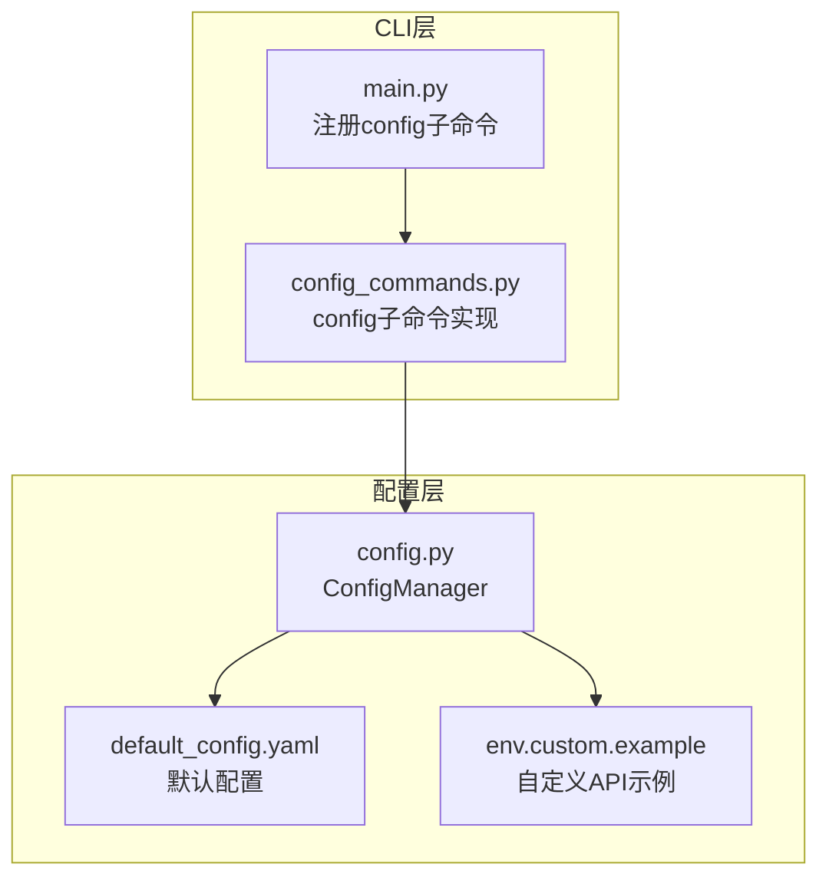
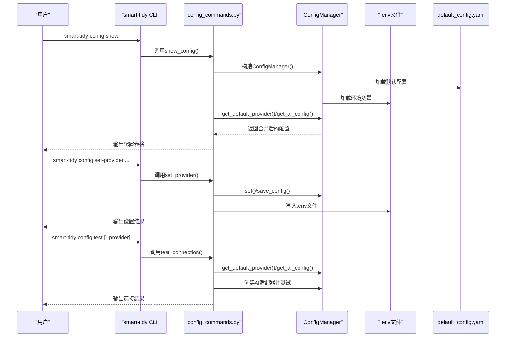
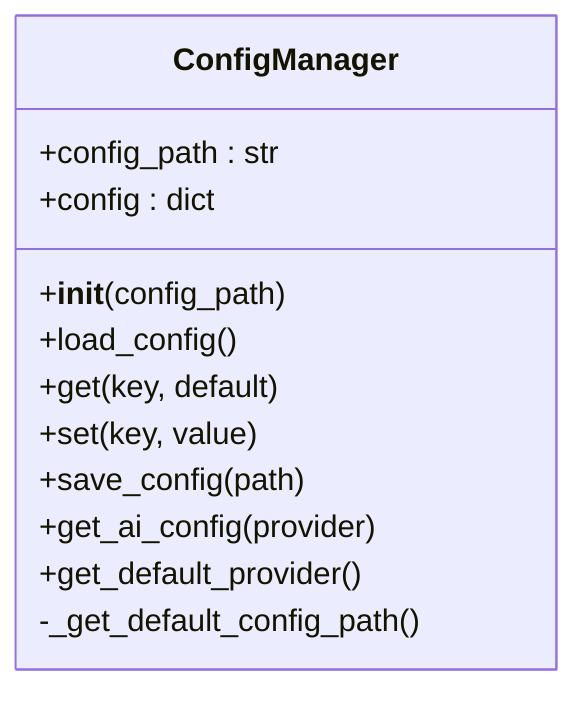
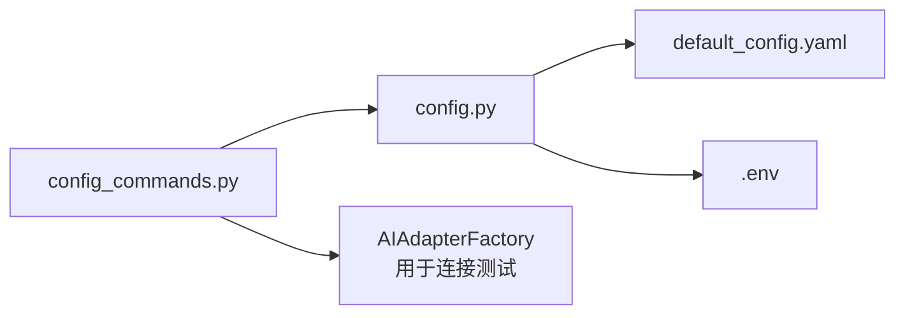

# 配置管理命令

<cite>
**本文引用的文件**
- [src/cli/config_commands.py](file://src/cli/config_commands.py)
- [src/utils/config.py](file://src/utils/config.py)
- [config/default_config.yaml](file://config/default_config.yaml)
- [docs/CONFIGURATION.md](file://docs/CONFIGURATION.md)
- [src/cli/main.py](file://src/cli/main.py)
- [README.md](file://README.md)
- [QUICKSTART.md](file://QUICKSTART.md)
- [env.custom.example](file://env.custom.example)
</cite>

## 目录
1. [简介](#简介)
2. [项目结构](#项目结构)
3. [核心组件](#核心组件)
4. [架构总览](#架构总览)
5. [详细组件分析](#详细组件分析)
6. [依赖分析](#依赖分析)
7. [性能考虑](#性能考虑)
8. [故障排除指南](#故障排除指南)
9. [结论](#结论)
10. [附录](#附录)

## 简介
本文件系统性地介绍 Smart File Tidy 的配置管理命令，重点围绕 config 子命令组的功能与使用方法，包括配置查看、提供商设置、连接测试等。文档还详细说明配置项的层次结构、优先级规则与继承关系，解释配置文件的格式、位置与加载顺序，并提供配置项的完整列表与默认值说明。同时涵盖环境变量配置与运行时配置的管理方法，给出故障排除指南与最佳实践建议。

## 项目结构
config 子命令组位于 CLI 层，通过 Typer 注册为独立的子命令组，底层依赖配置管理器统一加载与解析配置。

图表来源
- [src/cli/main.py](file://src/cli/main.py#L29-L30)
- [src/cli/config_commands.py](file://src/cli/config_commands.py#L1-L10)
- [src/utils/config.py](file://src/utils/config.py#L10-L18)
- [config/default_config.yaml](file://config/default_config.yaml#L1-L79)
- [env.custom.example](file://env.custom.example#L1-L103)

章节来源
- [src/cli/main.py](file://src/cli/main.py#L23-L30)
- [src/cli/config_commands.py](file://src/cli/config_commands.py#L1-L10)
- [src/utils/config.py](file://src/utils/config.py#L10-L18)

## 核心组件
- config 子命令组：提供 show、set-provider、test 三个子命令，用于查看配置、设置默认提供商与测试连接。
- ConfigManager：负责配置文件加载、键值读取/设置、AI提供商配置合并（含环境变量）、默认提供商解析。
- 配置文件与环境变量：default_config.yaml 提供默认值，.env/.env.* 提供运行时覆盖；环境变量优先级最高。

章节来源
- [src/cli/config_commands.py](file://src/cli/config_commands.py#L13-L48)
- [src/cli/config_commands.py](file://src/cli/config_commands.py#L50-L188)
- [src/cli/config_commands.py](file://src/cli/config_commands.py#L190-L219)
- [src/utils/config.py](file://src/utils/config.py#L43-L116)

## 架构总览
config 子命令组的调用流程如下：

图表来源
- [src/cli/config_commands.py](file://src/cli/config_commands.py#L13-L48)
- [src/cli/config_commands.py](file://src/cli/config_commands.py#L50-L188)
- [src/cli/config_commands.py](file://src/cli/config_commands.py#L190-L219)
- [src/utils/config.py](file://src/utils/config.py#L76-L116)

## 详细组件分析

### config 子命令组
- show：展示当前配置，包括默认AI提供商、各提供商配置表、文件操作相关参数。
- set-provider：设置默认AI提供商与相关参数，支持 claude、openai、local、custom 四类提供商；当 provider=custom 时，会同时更新 .env 文件中的 DEFAULT_AI_PROVIDER、CUSTOM_API_BASE_URL、CUSTOM_API_KEY、CUSTOM_API_MODEL。
- test：测试指定或默认提供商的连接，检查必要配置（如 API Key）并尝试创建适配器。

章节来源
- [src/cli/config_commands.py](file://src/cli/config_commands.py#L13-L48)
- [src/cli/config_commands.py](file://src/cli/config_commands.py#L50-L188)
- [src/cli/config_commands.py](file://src/cli/config_commands.py#L190-L219)

### ConfigManager 类
- 初始化：确定默认配置文件路径，加载 YAML，默认加载 .env 环境变量。
- 键值访问：支持“.”分隔的多级键访问与设置，便于嵌套配置结构。
- AI配置合并：根据默认提供商，从配置文件读取对应提供商段落，并优先从环境变量覆盖敏感字段（如 API Key、base_url、model）。
- 默认提供商：优先读取环境变量 DEFAULT_AI_PROVIDER，否则回退到配置文件中的默认值。

图表来源
- [src/utils/config.py](file://src/utils/config.py#L10-L116)

章节来源
- [src/utils/config.py](file://src/utils/config.py#L10-L116)

### 配置层次结构与优先级
- 优先级（从高到低）：环境变量（.env 文件）> 配置文件（config/default_config.yaml）> 默认值（代码中定义）。
- 层次结构（示例）：
  - ai.default_provider
  - ai.providers.claude/model/max_tokens/temperature
  - ai.providers.openai/model/max_tokens/temperature
  - ai.providers.local/base_url/model/timeout
  - ai.providers.custom/base_url/api_key/model/max_tokens/temperature
  - file_operations.batch_size/max_file_size_mb/scan_max_depth/backup_enabled/supported_extensions
  - safety.require_confirmation/auto_backup/max_undo_history
  - logging.level/log_dir/retention_days/format

章节来源
- [docs/CONFIGURATION.md](file://docs/CONFIGURATION.md#L5-L11)
- [config/default_config.yaml](file://config/default_config.yaml#L1-L79)
- [src/utils/config.py](file://src/utils/config.py#L76-L116)

### 配置文件格式、位置与加载顺序
- 格式：YAML（config/default_config.yaml）；环境变量：键值对（.env 文件）。
- 位置：
  - 默认配置文件：config/default_config.yaml（支持相对路径与项目根目录两种定位）。
  - 环境变量文件：项目根目录下的 .env（以及 .env.* 多环境文件）。
- 加载顺序：
  1) 读取默认配置文件（YAML）。
  2) 加载 .env 环境变量（dotenv）。
  3) 以环境变量覆盖配置文件中的同名键值。
  4) 代码中定义的默认值作为最终兜底。

章节来源
- [src/utils/config.py](file://src/utils/config.py#L20-L33)
- [src/utils/config.py](file://src/utils/config.py#L17-L18)
- [docs/CONFIGURATION.md](file://docs/CONFIGURATION.md#L5-L11)

### 配置项完整列表与默认值
以下为 default_config.yaml 中的关键配置项与默认值概览（部分）：
- AI提供商与模型
  - ai.default_provider: claude
  - ai.providers.claude.model: claude-3-5-sonnet-20241022
  - ai.providers.claude.max_tokens: 4096
  - ai.providers.claude.temperature: 0.7
  - ai.providers.openai.model: gpt-4-turbo-preview
  - ai.providers.openai.max_tokens: 4096
  - ai.providers.openai.temperature: 0.7
  - ai.providers.local.base_url: http://localhost:11434
  - ai.providers.local.model: llama3.1
  - ai.providers.local.timeout: 120
  - ai.providers.custom.base_url: https://api.example.com/v1
  - ai.providers.custom.model: custom-model-name
  - ai.providers.custom.api_key: your-api-key
  - ai.providers.custom.max_tokens: 4096
  - ai.providers.custom.temperature: 0.7
- LangChain Agent
  - langchain.agent.type: openai-tools
  - langchain.agent.verbose: true
  - langchain.agent.max_iterations: 15
  - langchain.agent.max_execution_time: 300
  - langchain.tools.file_scanner.max_files: 1000
  - langchain.tools.file_scanner.recursive: true
  - langchain.tools.file_analyzer.content_analysis: true
  - langchain.tools.file_analyzer.max_content_size: 2000
  - langchain.tools.file_operator.dry_run: false
  - langchain.tools.file_operator.batch_size: 50
- 文件操作
  - file_operations.batch_size: 50
  - file_operations.max_file_size_mb: 100
  - file_operations.scan_max_depth: 5
  - file_operations.backup_enabled: true
  - file_operations.supported_extensions: [.pdf, .doc, .docx, .txt, .jpg, .jpeg, .png, .gif, .xlsx, .xls, .ppt, .pptx]
- 安全
  - safety.require_confirmation: true
  - safety.auto_backup: true
  - safety.max_undo_history: 10
- 日志
  - logging.level: INFO
  - logging.log_dir: data/logs
  - logging.retention_days: 30
  - logging.format: "%(asctime)s - %(name)s - %(levelname)s - %(message)s"

章节来源
- [config/default_config.yaml](file://config/default_config.yaml#L1-L79)

### 环境变量配置与运行时管理
- 环境变量优先级最高，用于覆盖配置文件中的敏感信息与运行时参数。
- 常用环境变量（节选）：
  - DEFAULT_AI_PROVIDER: claude | openai | local | custom
  - ANTHROPIC_API_KEY: Claude API Key
  - OPENAI_API_KEY: OpenAI API Key
  - LOCAL_LLM_BASE_URL: 本地LLM服务地址
  - LOCAL_LLM_MODEL: 本地模型名称
  - CUSTOM_API_BASE_URL: 自定义API基础URL
  - CUSTOM_API_KEY: 自定义API密钥
  - CUSTOM_API_MODEL: 自定义API模型名称
  - BATCH_SIZE: 批处理大小
  - MAX_FILE_SIZE_MB: 最大文件大小（MB）
  - SCAN_MAX_DEPTH: 最大扫描深度
- 运行时配置管理建议：
  - 使用 .env 文件集中管理配置，避免将敏感信息提交到版本控制。
  - 多环境（开发/生产）可通过 .env.development、.env.production 等文件切换。
  - 通过 CLI 命令 set-provider 快速写入 .env 并同步配置文件，便于快速切换提供商。

章节来源
- [docs/CONFIGURATION.md](file://docs/CONFIGURATION.md#L157-L193)
- [docs/CONFIGURATION.md](file://docs/CONFIGURATION.md#L196-L231)
- [src/cli/config_commands.py](file://src/cli/config_commands.py#L50-L188)
- [src/utils/config.py](file://src/utils/config.py#L76-L116)

## 依赖分析
- CLI 层依赖 ConfigManager 提供统一配置访问能力。
- ConfigManager 依赖 YAML 解析与 dotenv 加载，实现配置文件与环境变量的合并。
- config 子命令组内部依赖 AI 适配器工厂进行连接测试。

图表来源
- [src/cli/config_commands.py](file://src/cli/config_commands.py#L211-L212)
- [src/utils/config.py](file://src/utils/config.py#L17-L18)

章节来源
- [src/cli/config_commands.py](file://src/cli/config_commands.py#L211-L212)
- [src/utils/config.py](file://src/utils/config.py#L17-L18)

## 性能考虑
- 配置加载为一次性操作，开销极小，无需重复加载。
- 环境变量覆盖发生在初始化阶段，避免运行时频繁IO。
- 批处理大小与扫描深度影响文件扫描与处理效率，可根据磁盘与网络条件调整。

## 故障排除指南
- 找不到API Key
  - 症状：提示未配置 Claude/OpenAI API Key。
  - 排查：确认 .env 文件存在且变量名正确（如 ANTHROPIC_API_KEY、OPENAI_API_KEY），无多余空格或引号；重新运行连接测试。
- 配置不生效
  - 可能原因：.env 文件不在项目根目录、环境变量格式错误、缓存问题。
  - 处理：使用 config show 查看当前配置，重新 set-provider 设置，再运行 config test。
- 自定义API连接失败
  - 检查清单：BASE_URL 格式正确（包含 /v1 后缀）、API Key 有效、MODEL 名称正确、网络连通、API 服务可用。
- 多环境切换无效
  - 确认 .env.* 文件命名规范，切换时将目标文件复制为 .env 并重启终端或重新加载环境。

章节来源
- [docs/CONFIGURATION.md](file://docs/CONFIGURATION.md#L285-L327)

## 结论
config 子命令组提供了简洁高效的配置管理能力：通过 CLI 快速查看、设置与测试配置，结合 ConfigManager 对 YAML 与 .env 的统一加载与优先级合并，实现了灵活、安全、易维护的配置体系。建议优先使用 .env 文件集中管理配置，配合 CLI 命令与默认配置文件，实现多环境与多提供商的无缝切换。

## 附录

### 常用命令速查
- 查看当前配置：smart-tidy config show
- 设置默认提供商：smart-tidy config set-provider claude|openai|local|custom [选项]
- 测试连接：smart-tidy config test [--provider]
- 查看帮助：smart-tidy --help

章节来源
- [README.md](file://README.md#L143-L148)
- [QUICKSTART.md](file://QUICKSTART.md#L149-L175)