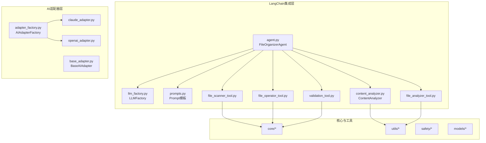
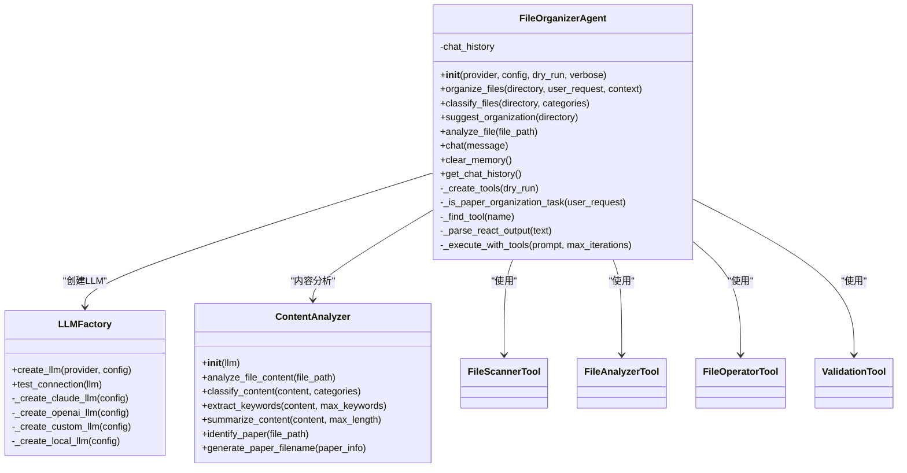
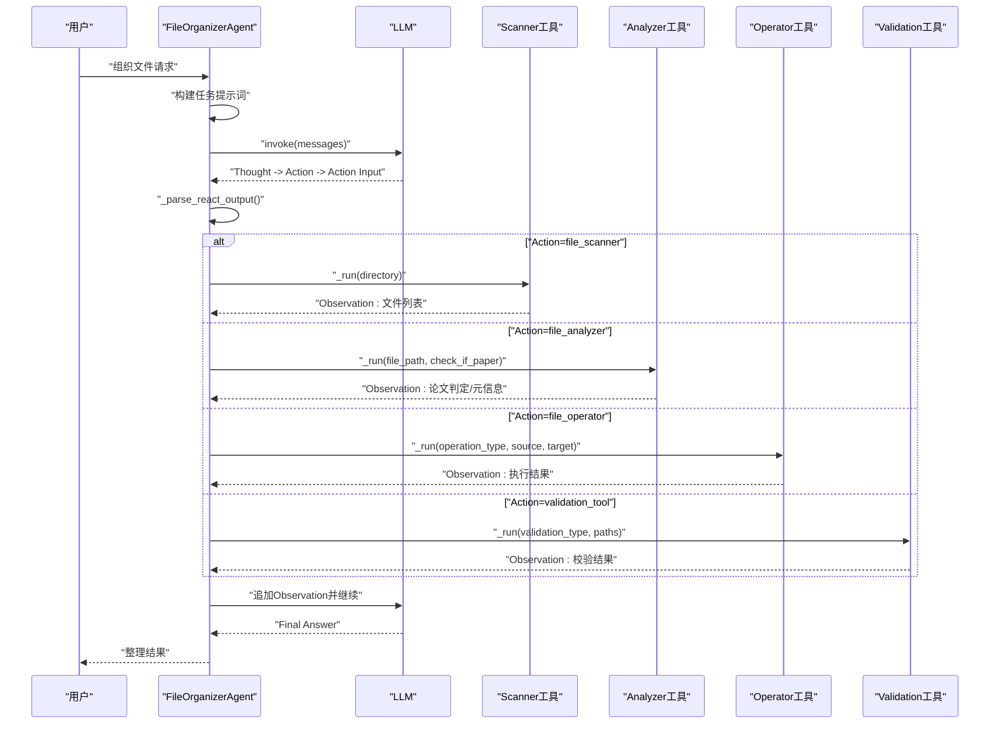
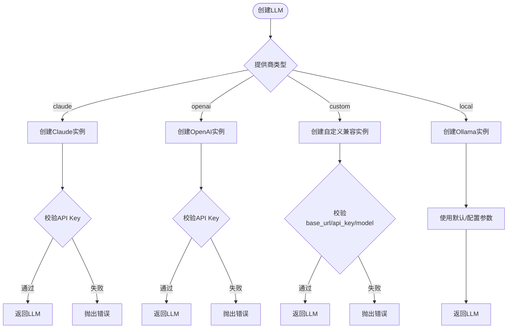
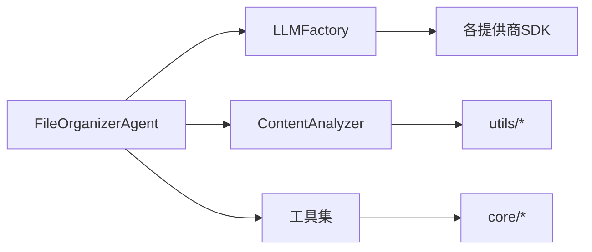

# Agent核心架构

<cite>
**本文档引用的文件**
- [src/langchain_integration/agent.py](file://src/langchain_integration/agent.py)
- [src/langchain_integration/llm_factory.py](file://src/langchain_integration/llm_factory.py)
- [src/langchain_integration/content_analyzer.py](file://src/langchain_integration/content_analyzer.py)
- [src/langchain_integration/prompts.py](file://src/langchain_integration/prompts.py)
- [src/langchain_integration/tools/file_scanner_tool.py](file://src/langchain_integration/tools/file_scanner_tool.py)
- [src/langchain_integration/tools/file_analyzer_tool.py](file://src/langchain_integration/tools/file_analyzer_tool.py)
- [src/langchain_integration/tools/file_operator_tool.py](file://src/langchain_integration/tools/file_operator_tool.py)
- [src/langchain_integration/tools/validation_tool.py](file://src/langchain_integration/tools/validation_tool.py)
- [src/ai/adapter_factory.py](file://src/ai/adapter_factory.py)
- [src/ai/base_adapter.py](file://src/ai/base_adapter.py)
- [src/ai/claude_adapter.py](file://src/ai/claude_adapter.py)
- [src/ai/openai_adapter.py](file://src/ai/openai_adapter.py)
- [config/default_config.yaml](file://config/default_config.yaml)
</cite>

## 目录
1. [简介](#简介)
2. [项目结构](#项目结构)
3. [核心组件](#核心组件)
4. [架构总览](#架构总览)
5. [详细组件分析](#详细组件分析)
6. [依赖关系分析](#依赖关系分析)
7. [性能考量](#性能考量)
8. [故障排查指南](#故障排查指南)
9. [结论](#结论)
10. [附录](#附录)

## 简介
本文件面向“智能文件整理Agent”的核心架构，围绕以下目标展开：
- 深入解释 FileOrganizerAgent 类的设计理念、初始化流程与核心方法实现
- 详解 LLMFactory 的模型工厂模式、不同AI提供商的集成方式与模型配置管理
- 覆盖 Agent 生命周期管理、内存管理、错误处理机制
- 提供 Agent 配置优化、性能调优与扩展新AI提供商的实践指南
- 解释 Agent 与 LLM 的交互模式、消息传递机制与状态管理策略

## 项目结构
该项目采用分层与功能域结合的组织方式：
- langchain_integration：基于 LangChain 的Agent实现与工具链
- ai：传统适配器层（与LangChain Agent并行存在）
- core：文件扫描、操作、分类等核心业务逻辑
- utils：PDF读取、元数据提取等工具
- safety：备份、操作日志与撤销管理
- models：文件信息与操作模型
- config：默认配置文件

图表来源
- [src/langchain_integration/agent.py](file://src/langchain_integration/agent.py#L21-L60)
- [src/langchain_integration/llm_factory.py](file://src/langchain_integration/llm_factory.py#L10-L35)
- [src/ai/adapter_factory.py](file://src/ai/adapter_factory.py#L11-L38)

章节来源
- [src/langchain_integration/agent.py](file://src/langchain_integration/agent.py#L1-L120)
- [src/langchain_integration/llm_factory.py](file://src/langchain_integration/llm_factory.py#L1-L116)
- [src/ai/adapter_factory.py](file://src/ai/adapter_factory.py#L1-L98)

## 核心组件
- FileOrganizerAgent：基于 LangChain 的智能Agent，负责论文识别、分类与整理的全流程编排，采用 ReAct 思维-行动-观察循环与工具链协作。
- LLMFactory：工厂类，依据配置动态创建不同提供商的 LLM 实例（Claude、OpenAI、自定义兼容API、本地Ollama）。
- ContentAnalyzer：基于 LLM 的内容分析器，支持论文识别、关键词提取、摘要生成、文件名规范化等。
- 工具集：file_scanner、file_analyzer、file_operator、validation 四大工具，分别承担扫描、分析、操作、校验职责。
- AI适配器层：BaseAIAdapter 及 Claude/OpenAI 适配器，提供统一接口与厂商特定实现。

章节来源
- [src/langchain_integration/agent.py](file://src/langchain_integration/agent.py#L21-L60)
- [src/langchain_integration/llm_factory.py](file://src/langchain_integration/llm_factory.py#L10-L98)
- [src/langchain_integration/content_analyzer.py](file://src/langchain_integration/content_analyzer.py#L14-L27)
- [src/ai/base_adapter.py](file://src/ai/base_adapter.py#L9-L30)

## 架构总览
Agent 通过 LLMFactory 选择合适的 LLM，结合 ContentAnalyzer 与一组 LangChain 工具，形成“提示词驱动 + ReAct 工具调用”的智能决策与执行闭环。系统同时提供 AI 适配器层，作为另一套统一接口的实现。

图表来源
- [src/langchain_integration/agent.py](file://src/langchain_integration/agent.py#L21-L60)
- [src/langchain_integration/llm_factory.py](file://src/langchain_integration/llm_factory.py#L10-L98)
- [src/langchain_integration/content_analyzer.py](file://src/langchain_integration/content_analyzer.py#L14-L27)
- [src/langchain_integration/tools/file_scanner_tool.py](file://src/langchain_integration/tools/file_scanner_tool.py#L31-L47)
- [src/langchain_integration/tools/file_analyzer_tool.py](file://src/langchain_integration/tools/file_analyzer_tool.py#L31-L47)
- [src/langchain_integration/tools/file_operator_tool.py](file://src/langchain_integration/tools/file_operator_tool.py#L32-L53)
- [src/langchain_integration/tools/validation_tool.py](file://src/langchain_integration/tools/validation_tool.py#L24-L39)

## 详细组件分析

### FileOrganizerAgent 设计与实现
- 设计理念
  - 以“提示词 + 工具链”为核心，遵循 ReAct 框架，确保 Agent 在每次思考后严格调用工具并等待观察结果，直至输出最终答案。
  - 默认聚焦“学术论文整理”，通过系统提示词与任务提示词引导，保证行为一致性与可解释性。
  - 支持 dry-run 模式与对话历史管理，便于调试与用户体验优化。
- 初始化流程
  - 接收提供商与配置，调用 LLMFactory 创建 LLM 实例
  - 构造 ContentAnalyzer 与工具集（扫描、分析、操作、校验）
  - 初始化会话历史数组
- 核心方法
  - organize_files：构建论文整理任务提示词，进入 ReAct 循环，解析 LLM 输出，调用工具并汇总结果
  - classify_files / suggest_organization：分别执行分类与建议任务，复用 ReAct 流程
  - analyze_file：委托 ContentAnalyzer 进行内容分析
  - chat / clear_memory / get_chat_history：维护与展示对话历史
- 错误处理
  - 统一捕获异常并返回结构化错误信息；对 ReAct 输出中的 JSON 解析失败进行容错与修复尝试
  - 工具调用阶段区分“工具不存在”与“工具执行失败”，分别构造后续 Observation 以引导继续

图表来源
- [src/langchain_integration/agent.py](file://src/langchain_integration/agent.py#L100-L228)
- [src/langchain_integration/agent.py](file://src/langchain_integration/agent.py#L300-L431)
- [src/langchain_integration/tools/file_scanner_tool.py](file://src/langchain_integration/tools/file_scanner_tool.py#L48-L111)
- [src/langchain_integration/tools/file_analyzer_tool.py](file://src/langchain_integration/tools/file_analyzer_tool.py#L49-L101)
- [src/langchain_integration/tools/file_operator_tool.py](file://src/langchain_integration/tools/file_operator_tool.py#L60-L143)
- [src/langchain_integration/tools/validation_tool.py](file://src/langchain_integration/tools/validation_tool.py#L41-L171)

章节来源
- [src/langchain_integration/agent.py](file://src/langchain_integration/agent.py#L21-L60)
- [src/langchain_integration/agent.py](file://src/langchain_integration/agent.py#L100-L228)
- [src/langchain_integration/agent.py](file://src/langchain_integration/agent.py#L300-L431)

### LLMFactory 工厂模式与提供商集成
- 工厂模式
  - create_llm 根据 provider 参数分派至具体创建函数
  - 支持 claude、openai、custom、local 四类提供商
- 配置管理
  - Claude/OpenAI：校验 API Key，设置模型、最大token、温度
  - Custom：校验 base_url、api_key、model，支持任意 OpenAI 兼容服务
  - Local（Ollama）：默认 base_url 与 model，支持温度配置
- 连接测试
  - test_connection 通过简单消息验证 LLM 可用性

图表来源
- [src/langchain_integration/llm_factory.py](file://src/langchain_integration/llm_factory.py#L13-L98)

章节来源
- [src/langchain_integration/llm_factory.py](file://src/langchain_integration/llm_factory.py#L10-L116)

### ContentAnalyzer 内容分析与论文识别
- 能力范围
  - 文件基础信息提取、元数据解析、内容样本读取
  - 基于 LLM 的内容分析、关键词提取、摘要生成
  - 论文识别（PDF），支持规则初筛与 LLM 深度分析，输出结构化元信息
  - 论文文件名规范化
- 与 Agent 协作
  - Agent 在论文整理任务中调用 ContentAnalyzer 进行内容级分析与论文判定
  - 通过 prompts 模板提供统一的分析指令

章节来源
- [src/langchain_integration/content_analyzer.py](file://src/langchain_integration/content_analyzer.py#L14-L73)
- [src/langchain_integration/content_analyzer.py](file://src/langchain_integration/content_analyzer.py#L236-L322)
- [src/langchain_integration/prompts.py](file://src/langchain_integration/prompts.py#L162-L211)

### 工具链与消息传递机制
- 工具职责
  - file_scanner：目录扫描，返回文件清单与元信息
  - file_analyzer：文件类型与内容分析，PDF论文特征检测
  - file_operator：移动、重命名、创建文件夹，支持 dry-run 与批量执行
  - validation：文件存在性、路径合法性、磁盘空间校验
- 消息传递与状态
  - Agent 将系统提示词与用户提示词组合为消息序列，逐轮传入 LLM
  - 每次工具调用后，将 LLM 输出与工具 Observation 作为新消息加入历史，维持上下文
  - 对话历史在 chat 接口中按最近N轮截断，避免上下文膨胀

章节来源
- [src/langchain_integration/tools/file_scanner_tool.py](file://src/langchain_integration/tools/file_scanner_tool.py#L31-L111)
- [src/langchain_integration/tools/file_analyzer_tool.py](file://src/langchain_integration/tools/file_analyzer_tool.py#L31-L221)
- [src/langchain_integration/tools/file_operator_tool.py](file://src/langchain_integration/tools/file_operator_tool.py#L32-L148)
- [src/langchain_integration/tools/validation_tool.py](file://src/langchain_integration/tools/validation_tool.py#L24-L171)
- [src/langchain_integration/agent.py](file://src/langchain_integration/agent.py#L527-L576)

### AI适配器层（BaseAIAdapter 与 Claude/OpenAI）
- 统一接口
  - BaseAIAdapter 定义 generate_classification 与 refine_with_feedback 两个抽象方法，确保各提供商实现一致
  - 提供响应格式校验与错误处理
- Claude/OpenAI 适配器
  - 分别封装 anthropic/openai SDK，构建系统提示词与用户提示词
  - 通过 PromptBuilder 生成结构化提示，解析 JSON 响应并进行格式校验
- 与 LangChain Agent 的关系
  - 该适配器层与 LangChain Agent 并行存在，可作为替代或补充方案

章节来源
- [src/ai/base_adapter.py](file://src/ai/base_adapter.py#L9-L70)
- [src/ai/adapter_factory.py](file://src/ai/adapter_factory.py#L11-L98)
- [src/ai/claude_adapter.py](file://src/ai/claude_adapter.py#L17-L133)
- [src/ai/openai_adapter.py](file://src/ai/openai_adapter.py#L17-L110)

## 依赖关系分析
- 组件耦合
  - FileOrganizerAgent 依赖 LLMFactory、ContentAnalyzer 与四大工具，耦合集中在提示词与工具调用协议
  - ContentAnalyzer 依赖 PDFReader 与元数据提取器，间接依赖工具层
  - 工具层依赖 core 层的扫描与操作实现
- 外部依赖
  - LangChain（消息模型、工具基类）
  - 各提供商 SDK（Anthropic、OpenAI、Ollama）
- 潜在循环依赖
  - 当前结构清晰，无明显循环导入

图表来源
- [src/langchain_integration/agent.py](file://src/langchain_integration/agent.py#L10-L19)
- [src/langchain_integration/llm_factory.py](file://src/langchain_integration/llm_factory.py#L3-L7)
- [src/langchain_integration/content_analyzer.py](file://src/langchain_integration/content_analyzer.py#L9-L11)

章节来源
- [src/langchain_integration/agent.py](file://src/langchain_integration/agent.py#L1-L20)
- [src/langchain_integration/llm_factory.py](file://src/langchain_integration/llm_factory.py#L1-L10)
- [src/langchain_integration/content_analyzer.py](file://src/langchain_integration/content_analyzer.py#L1-L12)

## 性能考量
- LLM 调用成本控制
  - 控制 max_tokens 与 temperature，避免不必要的长上下文
  - 使用 dry-run 模式进行预演，减少真实操作开销
- 工具调用效率
  - file_scanner 限制返回文件数量，避免超大上下文
  - file_operator 支持批量执行与 dry-run，降低 IO 风险
- 内存与上下文
  - 对话历史按最近 N 轮截断，避免内存膨胀
  - ReAct 循环设置最大迭代次数，防止长时间阻塞

章节来源
- [src/langchain_integration/agent.py](file://src/langchain_integration/agent.py#L527-L576)
- [src/langchain_integration/tools/file_scanner_tool.py](file://src/langchain_integration/tools/file_scanner_tool.py#L74-L103)
- [src/langchain_integration/tools/file_operator_tool.py](file://src/langchain_integration/tools/file_operator_tool.py#L105-L133)
- [config/default_config.yaml](file://config/default_config.yaml#L26-L46)

## 故障排查指南
- LLM 连接失败
  - 检查 API Key 与网络连通性；使用 LLMFactory.test_connection 进行连通性验证
- 工具调用异常
  - 工具不存在：确认工具名称与 Agent 中注册的工具一致
  - 工具执行失败：查看工具返回的错误信息与路径合法性
- ReAct 输出解析失败
  - 检查 LLM 输出是否符合“Thought -> Action -> Action Input -> Observation -> 下一步”的格式
  - 若 JSON 解析失败，Agent 会尝试修复常见引号问题
- 论文识别不准确
  - 调整 ContentAnalyzer 的提示词或阈值；必要时增加人工校验环节

章节来源
- [src/langchain_integration/llm_factory.py](file://src/langchain_integration/llm_factory.py#L98-L116)
- [src/langchain_integration/agent.py](file://src/langchain_integration/agent.py#L247-L298)
- [src/langchain_integration/content_analyzer.py](file://src/langchain_integration/content_analyzer.py#L323-L353)

## 结论
本项目通过 FileOrganizerAgent 将提示词工程、工具链与 LLM 能力有机结合，形成稳定可靠的论文整理流水线。LLMFactory 提供统一的模型接入与配置管理，ContentAnalyzer 与工具链保障内容理解与安全执行。AI 适配器层提供了与 LangChain Agent 并行的统一接口实现。整体架构具备良好的扩展性与可维护性，适合进一步引入新提供商与优化性能。

## 附录

### Agent 生命周期与状态管理
- 生命周期
  - 初始化：创建 LLM、ContentAnalyzer、工具集，准备会话历史
  - 运行期：接收请求、构建提示词、ReAct 循环、工具调用、结果汇总
  - 清理：可选的 dry-run、历史清理与资源释放
- 状态管理
  - 会话历史：聊天与任务执行的历史消息
  - 工具状态：由各工具内部维护（如 dry-run 模式）

章节来源
- [src/langchain_integration/agent.py](file://src/langchain_integration/agent.py#L24-L60)
- [src/langchain_integration/agent.py](file://src/langchain_integration/agent.py#L527-L576)

### 配置优化与最佳实践
- LLM 配置
  - 根据任务复杂度调整 max_tokens 与 temperature
  - 在生产环境启用连接测试与错误回退策略
- 工具配置
  - file_scanner：合理设置最大文件数与递归深度
  - file_operator：开启批量执行与 dry-run，谨慎设置批量大小
- Agent 行为
  - 通过 SYSTEM_PROMPT 与任务提示词约束行为边界
  - 在论文识别场景中，优先使用 ContentAnalyzer 与论文专用提示词

章节来源
- [config/default_config.yaml](file://config/default_config.yaml#L1-L79)
- [src/langchain_integration/prompts.py](file://src/langchain_integration/prompts.py#L4-L133)

### 扩展新AI提供商实践指南
- LangChain LLM 方案
  - 在 LLMFactory 中新增分支，创建新提供商实例并校验必要配置
  - 如需连接测试，完善 test_connection 方法
- AI 适配器方案
  - 在 AIAdapterFactory 中新增分支，实现新适配器类
  - 继承 BaseAIAdapter，实现 generate_classification 与 refine_with_feedback
  - 使用 PromptBuilder 生成结构化提示，确保响应可解析

章节来源
- [src/langchain_integration/llm_factory.py](file://src/langchain_integration/llm_factory.py#L13-L98)
- [src/ai/adapter_factory.py](file://src/ai/adapter_factory.py#L14-L98)
- [src/ai/base_adapter.py](file://src/ai/base_adapter.py#L12-L30)