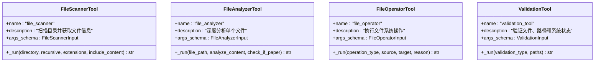

# LangChain Agent智能决策

<cite>
**本文档引用的文件**
- [README.md](file://README.md)
- [docs/LANGCHAIN_INTEGRATION.md](file://docs/LANGCHAIN_INTEGRATION.md)
- [examples/langchain_example.py](file://examples/langchain_example.py)
- [src/langchain_integration/agent.py](file://src/langchain_integration/agent.py)
- [src/langchain_integration/content_analyzer.py](file://src/langchain_integration/content_analyzer.py)
- [src/langchain_integration/llm_factory.py](file://src/langchain_integration/llm_factory.py)
- [src/langchain_integration/chains/classification_chain.py](file://src/langchain_integration/chains/classification_chain.py)
- [src/langchain_integration/tools/file_analyzer_tool.py](file://src/langchain_integration/tools/file_analyzer_tool.py)
- [src/langchain_integration/tools/file_operator_tool.py](file://src/langchain_integration/tools/file_operator_tool.py)
- [src/langchain_integration/tools/file_scanner_tool.py](file://src/langchain_integration/tools/file_scanner_tool.py)
- [src/langchain_integration/tools/validation_tool.py](file://src/langchain_integration/tools/validation_tool.py)
- [src/langchain_integration/prompts.py](file://src/langchain_integration/prompts.py)
- [config/default_config.yaml](file://config/default_config.yaml)
- [src/models/file_info.py](file://src/models/file_info.py)
- [src/models/operation.py](file://src/models/operation.py)
</cite>

## 目录
1. [简介](#简介)
2. [项目结构](#项目结构)
3. [核心组件](#核心组件)
4. [架构总览](#架构总览)
5. [详细组件分析](#详细组件分析)
6. [依赖关系分析](#依赖关系分析)
7. [性能考量](#性能考量)
8. [故障排查指南](#故障排查指南)
9. [结论](#结论)
10. [附录](#附录)

## 简介
本项目基于LangChain构建“智能文件整理助手”，提供以AI Agent为核心的自动化决策与执行能力。Agent通过ReAct推理机制，结合标准化的LangChain Tools，实现文件扫描、内容分析、分类决策、安全验证与文件操作的闭环流程。系统同时提供对话交互、整理建议、单文件分析等功能，支持Claude、OpenAI、本地模型及任意OpenAI兼容API。

## 项目结构
项目采用模块化分层设计，LangChain集成位于src/langchain_integration目录，包含Agent核心、内容分析器、LLM工厂、工具集与提示词模板；业务模型位于src/models；配置位于config；示例与文档位于examples与docs。

图表来源
- [src/langchain_integration/agent.py](file://src/langchain_integration/agent.py#L21-L60)
- [src/langchain_integration/content_analyzer.py](file://src/langchain_integration/content_analyzer.py#L14-L27)
- [src/langchain_integration/llm_factory.py](file://src/langchain_integration/llm_factory.py#L10-L35)
- [src/langchain_integration/tools/file_scanner_tool.py](file://src/langchain_integration/tools/file_scanner_tool.py#L31-L47)
- [src/langchain_integration/tools/file_analyzer_tool.py](file://src/langchain_integration/tools/file_analyzer_tool.py#L31-L48)
- [src/langchain_integration/tools/file_operator_tool.py](file://src/langchain_integration/tools/file_operator_tool.py#L32-L53)
- [src/langchain_integration/tools/validation_tool.py](file://src/langchain_integration/tools/validation_tool.py#L24-L39)
- [src/langchain_integration/prompts.py](file://src/langchain_integration/prompts.py#L4-L133)
- [config/default_config.yaml](file://config/default_config.yaml#L26-L46)
- [src/models/file_info.py](file://src/models/file_info.py#L9-L20)
- [src/models/operation.py](file://src/models/operation.py#L18-L31)

章节来源
- [README.md](file://README.md#L220-L241)
- [docs/LANGCHAIN_INTEGRATION.md](file://docs/LANGCHAIN_INTEGRATION.md#L1-L100)

## 核心组件
- FileOrganizerAgent：LangChain Agent核心，负责任务编排、ReAct推理、工具调度与会话记忆。
- ContentAnalyzer：基于LLM的文件内容深度分析，支持论文识别、关键词提取、摘要生成与内容分类。
- LLMFactory：统一创建不同提供商（Claude、OpenAI、自定义、本地）的LLM实例，并提供连接测试。
- ClassificationChain：面向文件集合的分类链路，基于LLM对文件特征进行智能分类与类别建议。
- LangChain Tools：标准化工具集，包括文件扫描、内容分析、文件操作、路径与安全验证。
- Prompts：系统提示词与专用Prompt模板，指导Agent与链路的行为与输出格式。
- 配置与模型：default_config.yaml提供LangChain Agent与工具的配置项；FileInfo与Operation模型支撑数据流转。

章节来源
- [src/langchain_integration/agent.py](file://src/langchain_integration/agent.py#L21-L60)
- [src/langchain_integration/content_analyzer.py](file://src/langchain_integration/content_analyzer.py#L14-L27)
- [src/langchain_integration/llm_factory.py](file://src/langchain_integration/llm_factory.py#L10-L35)
- [src/langchain_integration/chains/classification_chain.py](file://src/langchain_integration/chains/classification_chain.py#L10-L21)
- [src/langchain_integration/prompts.py](file://src/langchain_integration/prompts.py#L4-L133)
- [config/default_config.yaml](file://config/default_config.yaml#L26-L46)
- [src/models/file_info.py](file://src/models/file_info.py#L9-L20)
- [src/models/operation.py](file://src/models/operation.py#L18-L31)

## 架构总览
Agent采用ReAct范式：先思考（Thought），再调用工具（Action），接收观察（Observation），再继续下一步。Agent根据系统提示词与任务需求，动态选择工具与顺序，确保操作安全与可审计。

图表来源
- [src/langchain_integration/agent.py](file://src/langchain_integration/agent.py#L300-L431)
- [src/langchain_integration/prompts.py](file://src/langchain_integration/prompts.py#L62-L133)
- [src/langchain_integration/tools/file_scanner_tool.py](file://src/langchain_integration/tools/file_scanner_tool.py#L48-L111)
- [src/langchain_integration/tools/file_analyzer_tool.py](file://src/langchain_integration/tools/file_analyzer_tool.py#L49-L101)
- [src/langchain_integration/tools/file_operator_tool.py](file://src/langchain_integration/tools/file_operator_tool.py#L60-L134)
- [src/langchain_integration/tools/validation_tool.py](file://src/langchain_integration/tools/validation_tool.py#L41-L167)

## 详细组件分析

### FileOrganizerAgent（Agent核心）
- 角色与职责：封装LLM、内容分析器与工具集，实现ReAct推理、任务编排、会话记忆与错误恢复。
- 关键方法：
  - organize_files：根据用户请求与目录，构建任务提示，进入ReAct循环，直至Final Answer。
  - _execute_with_tools：ReAct执行循环，解析LLM输出、调用工具、注入Observation并继续。
  - _parse_react_output：解析Thought/Action/Action Input，支持JSON修复与“Final Answer”识别。
  - analyze_file/classify_files/suggest_organization/chat：面向不同场景的便捷入口。
- 安全与健壮性：最大迭代次数限制、异常捕获与回退、Dry Run模式、工具调用前后的消息历史维护。

图表来源
- [src/langchain_integration/agent.py](file://src/langchain_integration/agent.py#L21-L60)
- [src/langchain_integration/agent.py](file://src/langchain_integration/agent.py#L100-L228)
- [src/langchain_integration/agent.py](file://src/langchain_integration/agent.py#L229-L431)

章节来源
- [src/langchain_integration/agent.py](file://src/langchain_integration/agent.py#L21-L60)
- [src/langchain_integration/agent.py](file://src/langchain_integration/agent.py#L100-L228)
- [src/langchain_integration/agent.py](file://src/langchain_integration/agent.py#L229-L431)

### ContentAnalyzer（内容理解）
- 角色与职责：对文件进行元数据提取、内容采样、LLM深度分析，支持论文识别、关键词提取、摘要生成与内容分类。
- 关键能力：
  - analyze_file_content：基础信息 + 元数据 + LLM内容分析。
  - identify_paper：PDF论文识别（规则初筛 + LLM精判 + JSON解析与文本回退）。
  - classify_content/extract_keywords/summarize_content：面向内容的三类基础能力。
  - generate_paper_filename：基于论文信息生成规范文件名。
- 数据与复杂度：对大文件内容采样限制，避免LLM输入膨胀；PDF读取与文本检测采用轻量规则辅助。

图表来源
- [src/langchain_integration/content_analyzer.py](file://src/langchain_integration/content_analyzer.py#L14-L27)
- [src/langchain_integration/content_analyzer.py](file://src/langchain_integration/content_analyzer.py#L28-L73)
- [src/langchain_integration/content_analyzer.py](file://src/langchain_integration/content_analyzer.py#L236-L322)
- [src/langchain_integration/content_analyzer.py](file://src/langchain_integration/content_analyzer.py#L323-L403)

章节来源
- [src/langchain_integration/content_analyzer.py](file://src/langchain_integration/content_analyzer.py#L14-L27)
- [src/langchain_integration/content_analyzer.py](file://src/langchain_integration/content_analyzer.py#L28-L73)
- [src/langchain_integration/content_analyzer.py](file://src/langchain_integration/content_analyzer.py#L236-L322)
- [src/langchain_integration/content_analyzer.py](file://src/langchain_integration/content_analyzer.py#L323-L403)

### LLMFactory（模型管理）
- 角色与职责：根据提供商与配置创建对应LLM实例，统一接口与错误处理。
- 支持提供商：Claude、OpenAI、自定义OpenAI兼容API、本地Ollama。
- 连接测试：test_connection用于快速验证模型可用性。

图表来源
- [src/langchain_integration/llm_factory.py](file://src/langchain_integration/llm_factory.py#L10-L35)
- [src/langchain_integration/llm_factory.py](file://src/langchain_integration/llm_factory.py#L36-L97)
- [src/langchain_integration/llm_factory.py](file://src/langchain_integration/llm_factory.py#L99-L116)

章节来源
- [src/langchain_integration/llm_factory.py](file://src/langchain_integration/llm_factory.py#L10-L35)
- [src/langchain_integration/llm_factory.py](file://src/langchain_integration/llm_factory.py#L36-L97)
- [src/langchain_integration/llm_factory.py](file://src/langchain_integration/llm_factory.py#L99-L116)

### ClassificationChain（分类链路）
- 角色与职责：面向文件集合的分类链路，格式化文件信息，调用LLM生成分类建议与类别建议。
- 关键方法：
  - classify：对文件列表进行分类并返回结果。
  - suggest_categories：基于文件特征建议3-5个类别。
- 数据格式：FileInfo模型承载文件元数据与内容样本，便于LLM理解。

图表来源
- [src/langchain_integration/chains/classification_chain.py](file://src/langchain_integration/chains/classification_chain.py#L10-L21)
- [src/langchain_integration/chains/classification_chain.py](file://src/langchain_integration/chains/classification_chain.py#L22-L67)
- [src/langchain_integration/chains/classification_chain.py](file://src/langchain_integration/chains/classification_chain.py#L99-L138)
- [src/models/file_info.py](file://src/models/file_info.py#L9-L20)

章节来源
- [src/langchain_integration/chains/classification_chain.py](file://src/langchain_integration/chains/classification_chain.py#L10-L21)
- [src/langchain_integration/chains/classification_chain.py](file://src/langchain_integration/chains/classification_chain.py#L22-L67)
- [src/langchain_integration/chains/classification_chain.py](file://src/langchain_integration/chains/classification_chain.py#L99-L138)
- [src/models/file_info.py](file://src/models/file_info.py#L9-L20)

### LangChain Tools（工具集）
- FileScannerTool：扫描目录，返回文件列表与元数据，支持扩展名过滤与内容采样上限。
- FileAnalyzerTool：深度分析单个文件，提取类型、元数据、内容样本与论文特征（基于规则与LLM）。
- FileOperatorTool：执行文件操作（移动/重命名/创建文件夹），支持Dry Run与批量执行统计。
- ValidationTool：验证文件存在性、路径有效性与磁盘空间，保障操作安全。

图表来源
- [src/langchain_integration/tools/file_scanner_tool.py](file://src/langchain_integration/tools/file_scanner_tool.py#L31-L47)
- [src/langchain_integration/tools/file_scanner_tool.py](file://src/langchain_integration/tools/file_scanner_tool.py#L48-L111)
- [src/langchain_integration/tools/file_analyzer_tool.py](file://src/langchain_integration/tools/file_analyzer_tool.py#L31-L48)
- [src/langchain_integration/tools/file_analyzer_tool.py](file://src/langchain_integration/tools/file_analyzer_tool.py#L49-L101)
- [src/langchain_integration/tools/file_operator_tool.py](file://src/langchain_integration/tools/file_operator_tool.py#L32-L53)
- [src/langchain_integration/tools/file_operator_tool.py](file://src/langchain_integration/tools/file_operator_tool.py#L60-L134)
- [src/langchain_integration/tools/validation_tool.py](file://src/langchain_integration/tools/validation_tool.py#L24-L39)
- [src/langchain_integration/tools/validation_tool.py](file://src/langchain_integration/tools/validation_tool.py#L41-L167)

章节来源
- [src/langchain_integration/tools/file_scanner_tool.py](file://src/langchain_integration/tools/file_scanner_tool.py#L31-L47)
- [src/langchain_integration/tools/file_scanner_tool.py](file://src/langchain_integration/tools/file_scanner_tool.py#L48-L111)
- [src/langchain_integration/tools/file_analyzer_tool.py](file://src/langchain_integration/tools/file_analyzer_tool.py#L31-L48)
- [src/langchain_integration/tools/file_analyzer_tool.py](file://src/langchain_integration/tools/file_analyzer_tool.py#L49-L101)
- [src/langchain_integration/tools/file_operator_tool.py](file://src/langchain_integration/tools/file_operator_tool.py#L32-L53)
- [src/langchain_integration/tools/file_operator_tool.py](file://src/langchain_integration/tools/file_operator_tool.py#L60-L134)
- [src/langchain_integration/tools/validation_tool.py](file://src/langchain_integration/tools/validation_tool.py#L24-L39)
- [src/langchain_integration/tools/validation_tool.py](file://src/langchain_integration/tools/validation_tool.py#L41-L167)

### ReAct推理流程（算法）

图表来源
- [src/langchain_integration/agent.py](file://src/langchain_integration/agent.py#L300-L431)
- [src/langchain_integration/prompts.py](file://src/langchain_integration/prompts.py#L62-L133)

章节来源
- [src/langchain_integration/agent.py](file://src/langchain_integration/agent.py#L300-L431)
- [src/langchain_integration/prompts.py](file://src/langchain_integration/prompts.py#L62-L133)

## 依赖关系分析
- Agent依赖LLMFactory创建LLM，依赖ContentAnalyzer进行内容理解，依赖四个LangChain Tools执行具体动作。
- Tools之间无直接耦合，通过统一的BaseTool接口与JSON参数传递交互。
- ClassificationChain依赖FileInfo模型，间接依赖LLM与Prompt模板。
- 配置default_config.yaml集中管理LangChain Agent与工具的运行参数。

图表来源
- [src/langchain_integration/agent.py](file://src/langchain_integration/agent.py#L40-L52)
- [src/langchain_integration/llm_factory.py](file://src/langchain_integration/llm_factory.py#L14-L34)
- [src/langchain_integration/chains/classification_chain.py](file://src/langchain_integration/chains/classification_chain.py#L13-L21)
- [config/default_config.yaml](file://config/default_config.yaml#L26-L46)

章节来源
- [src/langchain_integration/agent.py](file://src/langchain_integration/agent.py#L40-L52)
- [src/langchain_integration/llm_factory.py](file://src/langchain_integration/llm_factory.py#L14-L34)
- [src/langchain_integration/chains/classification_chain.py](file://src/langchain_integration/chains/classification_chain.py#L13-L21)
- [config/default_config.yaml](file://config/default_config.yaml#L26-L46)

## 性能考量
- Token与内容采样：限制文件内容样本长度，避免LLM输入过大；分类链路与内容分析均有限制。
- 批处理与并发：工具侧支持批量执行（如FileOperatorTool），建议分批处理大目录；扫描与分析可并行化。
- 缓存与复用：缓存文件分析结果与LLM响应（可在应用层实现），减少重复计算。
- 超时与迭代限制：Agent最大迭代次数与执行时间限制，防止长时间阻塞。
- 配置优化：调整max_iterations、max_execution_time、batch_size与max_content_size以平衡准确性与性能。

章节来源
- [config/default_config.yaml](file://config/default_config.yaml#L26-L46)
- [src/langchain_integration/tools/file_operator_tool.py](file://src/langchain_integration/tools/file_operator_tool.py#L118-L132)
- [src/langchain_integration/content_analyzer.py](file://src/langchain_integration/content_analyzer.py#L74-L88)
- [src/langchain_integration/chains/classification_chain.py](file://src/langchain_integration/chains/classification_chain.py#L68-L98)

## 故障排查指南
- Agent初始化失败：检查LangChain依赖安装、API密钥配置与模型工厂创建。
- Token超限：减少单次处理文件数量、降低内容采样长度、使用--dry-run预演。
- 连接超时：检查网络与代理、增加max_execution_time、切换本地LLM（Ollama）。
- 工具调用失败：确认工具名称拼写、Action Input JSON格式、工具参数范围；查看Observation与错误信息。
- 论文识别不稳定：适当提高内容采样长度、检查PDF文本提取质量、结合规则与LLM双重判断。
- 操作安全问题：启用ValidationTool验证、开启Dry Run预演、确保备份策略生效。

章节来源
- [docs/LANGCHAIN_INTEGRATION.md](file://docs/LANGCHAIN_INTEGRATION.md#L300-L328)
- [src/langchain_integration/agent.py](file://src/langchain_integration/agent.py#L229-L431)
- [src/langchain_integration/tools/validation_tool.py](file://src/langchain_integration/tools/validation_tool.py#L41-L167)
- [src/langchain_integration/content_analyzer.py](file://src/langchain_integration/content_analyzer.py#L262-L322)

## 结论
本项目通过LangChain Agent实现了“可对话、可推理、可执行”的智能文件整理体系。Agent以ReAct为核心，结合内容理解与标准化工具，形成从扫描、分析、决策到执行的完整闭环。配合完善的配置、模型工厂与安全验证，系统在准确性、可扩展性与可靠性方面具备良好表现。建议在生产环境中结合分批执行、缓存策略与Dry Run预演，持续优化性能与稳定性。

## 附录

### 配置项速览（LangChain与工具）
- LangChain Agent：type、verbose、max_iterations、max_execution_time。
- Tools：file_scanner.max_files、recursive；file_analyzer.content_analysis、max_content_size；file_operator.dry_run、batch_size。
- 文件操作：batch_size、max_file_size_mb、scan_max_depth、backup_enabled、支持的扩展名。
- 安全与日志：require_confirmation、auto_backup、max_undo_history、logging.level/format。

章节来源
- [config/default_config.yaml](file://config/default_config.yaml#L26-L79)

### 使用示例与场景
- 基本Agent整理、单文件分析、整理建议、文件分类、对话交互、自定义API测试、内容分析器独立使用。
- 示例脚本路径：examples/langchain_example.py。

章节来源
- [examples/langchain_example.py](file://examples/langchain_example.py#L9-L279)