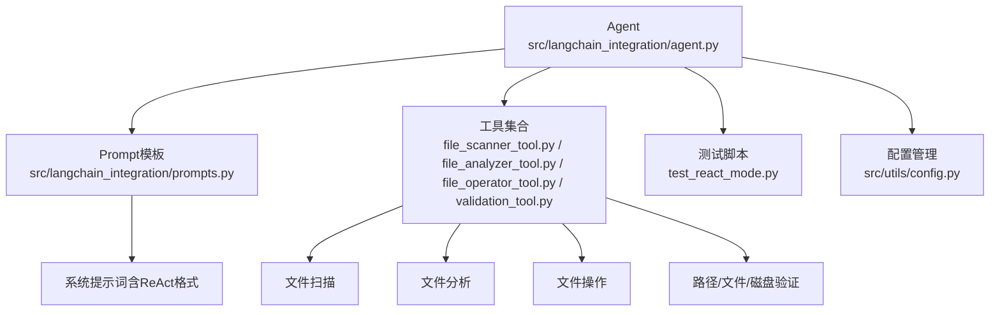
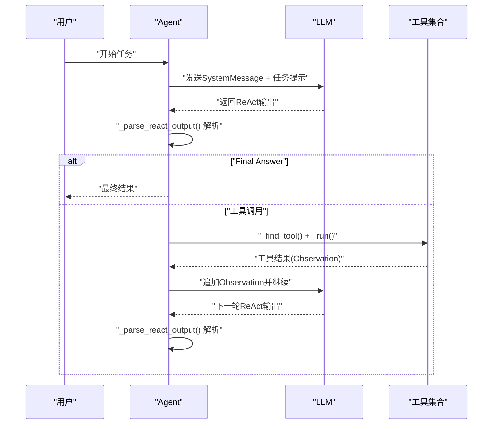
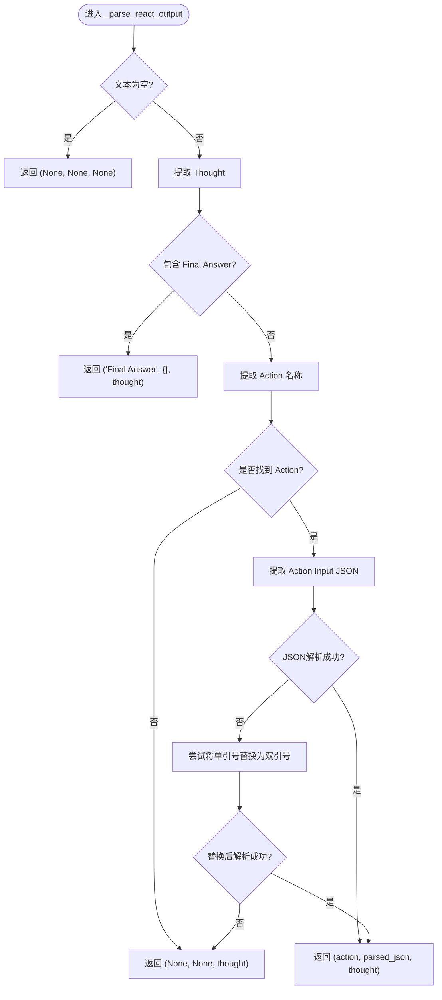
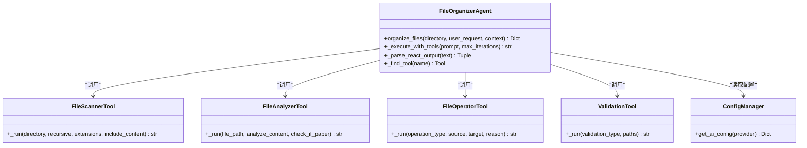

# ReAct推理解析机制

<cite>
**本文档引用的文件**
- [src/langchain_integration/agent.py](file://src/langchain_integration/agent.py)
- [src/langchain_integration/prompts.py](file://src/langchain_integration/prompts.py)
- [src/langchain_integration/tools/file_scanner_tool.py](file://src/langchain_integration/tools/file_scanner_tool.py)
- [src/langchain_integration/tools/file_analyzer_tool.py](file://src/langchain_integration/tools/file_analyzer_tool.py)
- [src/langchain_integration/tools/file_operator_tool.py](file://src/langchain_integration/tools/file_operator_tool.py)
- [src/langchain_integration/tools/validation_tool.py](file://src/langchain_integration/tools/validation_tool.py)
- [test_react_mode.py](file://test_react_mode.py)
- [REACT_MODE_IMPLEMENTATION.md](file://REACT_MODE_IMPLEMENTATION.md)
- [REACT_FORMAT_FIX.md](file://REACT_FORMAT_FIX.md)
- [src/utils/config.py](file://src/utils/config.py)
</cite>

## 目录
1. [简介](#简介)
2. [项目结构](#项目结构)
3. [核心组件](#核心组件)
4. [架构总览](#架构总览)
5. [详细组件分析](#详细组件分析)
6. [依赖关系分析](#依赖关系分析)
7. [性能考量](#性能考量)
8. [故障排查指南](#故障排查指南)
9. [结论](#结论)
10. [附录](#附录)

## 简介
本文件聚焦于ReAct（推理-行动）推理解析机制，系统阐述“Thought-Action-ActionInput-Final Answer”解析算法、正则表达式匹配规则、JSON参数提取逻辑，以及_agent._parse_react_output方法的实现原理、错误恢复与兼容性策略。文档还提供常见格式问题的解决方案、调试技巧、性能优化建议，并给出自定义解析规则与扩展支持的实践指南。

## 项目结构
ReAct解析位于LangChain集成层，围绕Agent、Prompt模板与工具集合协作，形成“提示词驱动 + 文本解析 + 工具调用”的闭环。

图表来源
- [src/langchain_integration/agent.py](file://src/langchain_integration/agent.py#L1-L120)
- [src/langchain_integration/prompts.py](file://src/langchain_integration/prompts.py#L1-L135)
- [src/langchain_integration/tools/file_scanner_tool.py](file://src/langchain_integration/tools/file_scanner_tool.py#L1-L115)
- [src/langchain_integration/tools/file_analyzer_tool.py](file://src/langchain_integration/tools/file_analyzer_tool.py#L1-L221)
- [src/langchain_integration/tools/file_operator_tool.py](file://src/langchain_integration/tools/file_operator_tool.py#L1-L148)
- [src/langchain_integration/tools/validation_tool.py](file://src/langchain_integration/tools/validation_tool.py#L1-L171)
- [test_react_mode.py](file://test_react_mode.py#L1-L187)
- [src/utils/config.py](file://src/utils/config.py#L1-L116)

章节来源
- [src/langchain_integration/agent.py](file://src/langchain_integration/agent.py#L1-L120)
- [src/langchain_integration/prompts.py](file://src/langchain_integration/prompts.py#L1-L135)

## 核心组件
- Agent：负责构建消息历史、调用LLM、解析ReAct输出、查找并执行工具、注入Observation并循环迭代。
- Prompt模板：提供ReAct格式规范、示例与规则，确保LLM持续遵循“Thought -> Action -> Action Input”。
- 工具集合：file_scanner、file_analyzer、file_operator、validation_tool，分别承担扫描、分析、操作、验证职责。
- 测试脚本：验证解析器与完整流程，覆盖正常工具调用、最终答案、复杂JSON等场景。

章节来源
- [src/langchain_integration/agent.py](file://src/langchain_integration/agent.py#L247-L298)
- [src/langchain_integration/prompts.py](file://src/langchain_integration/prompts.py#L62-L133)
- [test_react_mode.py](file://test_react_mode.py#L13-L76)

## 架构总览
ReAct执行循环由Agent驱动，LLM输出遵循Prompt模板中的格式；Agent解析输出并执行工具，将Observation作为下一步提示的一部分，持续迭代直至Final Answer。

图表来源
- [src/langchain_integration/agent.py](file://src/langchain_integration/agent.py#L300-L430)
- [src/langchain_integration/prompts.py](file://src/langchain_integration/prompts.py#L62-L133)

## 详细组件分析

### ReAct解析器：_parse_react_output
- 输入：LLM输出文本
- 输出：(动作名, 动作参数字典, 思考内容)
- 解析顺序：
  1) 提取Thought：使用正则匹配“Thought:”后的内容，直到遇到“Action:”、“Final Answer:”或文本末尾。
  2) 检测Final Answer：若文本包含“Final Answer:”（含中文冒号），直接返回“Final Answer”标记与空参数。
  3) 提取Action：匹配“Action:”后的首个单词作为工具名。
  4) 提取Action Input：匹配“Action Input:”后的花括号JSON字符串，尝试标准JSON解析；若失败，尝试将单引号替换为双引号后再次解析。
- 返回值：若未检测到工具调用，动作名返回None；若解析失败，返回(None, None, thought)。

图表来源
- [src/langchain_integration/agent.py](file://src/langchain_integration/agent.py#L247-L298)

章节来源
- [src/langchain_integration/agent.py](file://src/langchain_integration/agent.py#L247-L298)

### 正则表达式匹配规则
- Thought匹配：使用非贪婪模式匹配“Thought:”之后的内容，终止条件为“Action:”或“Final Answer:”或文本结束，启用DOTALL与IGNORECASE。
- Action匹配：匹配“Action:”后的一个或多个字母数字字符，忽略大小写。
- Action Input匹配：匹配“Action Input:”后的花括号内容，启用DOTALL与IGNORECASE。
- Final Answer检测：同时支持英文冒号与中文冒号，提升兼容性。

章节来源
- [src/langchain_integration/agent.py](file://src/langchain_integration/agent.py#L262-L270)

### JSON参数提取与兼容性
- 标准解析：使用标准JSON解析器，直接将Action Input字符串转换为字典。
- 兼容性修复：当标准解析失败时，尝试将单引号替换为双引号，再次解析；若仍失败，回退为未检测到工具调用。
- 参数完整性：若未找到Action Input，动作参数为空字典；若仅找到Action而无Input，Agent会判定为未检测到有效工具调用。

章节来源
- [src/langchain_integration/agent.py](file://src/langchain_integration/agent.py#L278-L296)

### 错误恢复机制
- 工具不存在：捕获ValueError，构造错误Observation并提示正确工具名称，继续迭代。
- 工具执行异常：捕获Exception，构造错误Observation并提示分析错误原因，继续迭代。
- 迭代超限：达到最大迭代次数仍未Final Answer，返回提示信息。
- 解析失败：未检测到工具调用时，Agent会将其视为可能已完成的直接回答，提前结束。
- 日志与可视化：在verbose模式下输出Thought、Action、Observation与迭代进度，便于调试。

章节来源
- [src/langchain_integration/agent.py](file://src/langchain_integration/agent.py#L340-L430)

### 执行循环与Observation注入
- Agent在每次工具执行后，将工具结果封装为Observation并追加到消息历史，同时提醒继续使用ReAct格式。
- Prompt模板中明确要求“每次收到Observation后，都要输出新的Thought + Action + Action Input”，并提供示例与规则。
- 当检测到Final Answer时，停止迭代并返回最终响应。

章节来源
- [src/langchain_integration/agent.py](file://src/langchain_integration/agent.py#L372-L410)
- [src/langchain_integration/prompts.py](file://src/langchain_integration/prompts.py#L103-L127)
- [REACT_FORMAT_FIX.md](file://REACT_FORMAT_FIX.md#L29-L54)

### 工具查找与调用
- _find_tool：遍历工具列表，按名称精确匹配，未找到时抛出ValueError并包含可用工具清单。
- 工具执行：调用工具的_run方法，传入解析得到的参数字典；工具内部进行参数校验与业务执行，返回JSON字符串作为Observation。

章节来源
- [src/langchain_integration/agent.py](file://src/langchain_integration/agent.py#L229-L245)
- [src/langchain_integration/tools/file_scanner_tool.py](file://src/langchain_integration/tools/file_scanner_tool.py#L48-L110)
- [src/langchain_integration/tools/file_analyzer_tool.py](file://src/langchain_integration/tools/file_analyzer_tool.py#L49-L100)
- [src/langchain_integration/tools/file_operator_tool.py](file://src/langchain_integration/tools/file_operator_tool.py#L60-L143)
- [src/langchain_integration/tools/validation_tool.py](file://src/langchain_integration/tools/validation_tool.py#L41-L171)

### 测试与验证
- 解析功能测试：覆盖正常工具调用、最终答案、复杂JSON等场景，验证解析器输出。
- 完整流程测试：创建Agent实例，执行论文整理任务，验证工具链路与文件操作。

章节来源
- [test_react_mode.py](file://test_react_mode.py#L13-L76)
- [test_react_mode.py](file://test_react_mode.py#L78-L148)

## 依赖关系分析
- Agent依赖Prompt模板提供格式规范与示例，依赖工具集合执行具体操作。
- 工具之间无直接耦合，通过统一的BaseTool接口与参数Schema解耦。
- 配置管理器为Agent提供LLM提供商与模型参数，支持多种自定义API。

图表来源
- [src/langchain_integration/agent.py](file://src/langchain_integration/agent.py#L21-L68)
- [src/langchain_integration/tools/file_scanner_tool.py](file://src/langchain_integration/tools/file_scanner_tool.py#L31-L46)
- [src/langchain_integration/tools/file_analyzer_tool.py](file://src/langchain_integration/tools/file_analyzer_tool.py#L31-L47)
- [src/langchain_integration/tools/file_operator_tool.py](file://src/langchain_integration/tools/file_operator_tool.py#L32-L53)
- [src/langchain_integration/tools/validation_tool.py](file://src/langchain_integration/tools/validation_tool.py#L24-L39)
- [src/utils/config.py](file://src/utils/config.py#L76-L111)

章节来源
- [src/langchain_integration/agent.py](file://src/langchain_integration/agent.py#L21-L68)
- [src/utils/config.py](file://src/utils/config.py#L76-L111)

## 性能考量
- 正则匹配范围控制：Action Input使用花括号限定范围，减少回溯开销；Thought匹配采用非贪婪模式，避免跨段误匹配。
- JSON解析优先：优先使用标准解析，失败后再进行单引号修复，降低不必要的字符串处理成本。
- 观察结果截断：工具返回的Observation在日志中进行长度截断，避免大文本影响显示与内存占用。
- 迭代上限：设置最大迭代次数，防止长时间循环；达到上限时返回提示信息，避免资源耗尽。
- 配置加载：配置文件一次性加载，避免频繁IO；环境变量按需读取。

章节来源
- [src/langchain_integration/agent.py](file://src/langchain_integration/agent.py#L262-L296)
- [src/langchain_integration/agent.py](file://src/langchain_integration/agent.py#L364-L367)
- [src/langchain_integration/agent.py](file://src/langchain_integration/agent.py#L424-L429)

## 故障排查指南
- 症状：未检测到工具调用
  - 可能原因：Action缺失、Action Input格式错误、JSON解析失败。
  - 处理：检查Prompt模板是否明确要求“Thought -> Action -> Action Input”；确认Action Input为合法JSON；必要时启用verbose查看原始响应与解析日志。
- 症状：工具不存在
  - 可能原因：Action名称拼写错误或不在可用工具列表。
  - 处理：根据错误信息核对工具名称；Agent会列出可用工具清单辅助修正。
- 症状：工具执行失败
  - 可能原因：路径无效、权限不足、磁盘空间不足。
  - 处理：使用validation_tool进行路径与磁盘空间验证；检查工具参数与目标路径。
- 症状：格式持续性问题
  - 可能原因：Observation未提醒继续使用ReAct格式。
  - 处理：确认Agent在每次Observation后追加格式提醒；检查Prompt模板中的规则与示例。
- 症状：迭代超时
  - 可能原因：LLM未输出Final Answer或工具链路阻塞。
  - 处理：增加verbose输出观察每轮Thought与Observation；检查工具执行耗时与返回内容。

章节来源
- [src/langchain_integration/agent.py](file://src/langchain_integration/agent.py#L386-L410)
- [src/langchain_integration/agent.py](file://src/langchain_integration/agent.py#L415-L429)
- [REACT_FORMAT_FIX.md](file://REACT_FORMAT_FIX.md#L29-L54)

## 结论
ReAct解析机制通过严格的正则匹配与JSON修复策略，实现了对LLM输出的稳定解析；结合Prompt模板的持续提醒与工具链路的可靠执行，Agent能够持续遵循“思考-行动-观察-再思考”的循环，最终输出Final Answer。该机制具备良好的兼容性、可调试性与可扩展性，适合在多LLM与自定义API环境下部署。

## 附录

### 自定义解析规则与扩展支持实践指南
- 自定义正则：若LLM输出格式略有差异，可在解析器中调整匹配规则（如放宽Action Input边界、支持更多标点）。
- 扩展工具：新增工具时，确保工具名称与参数Schema与Prompt模板一致；在Agent中注册工具并在解析器中支持新动作名。
- 兼容性增强：针对特定模型的输出风格，可增加预处理步骤（如统一标点、规范化缩进）后再进行解析。
- 测试覆盖：为新规则与新工具编写单元测试，覆盖正常、异常与边界场景，确保稳定性。

章节来源
- [src/langchain_integration/agent.py](file://src/langchain_integration/agent.py#L247-L298)
- [src/langchain_integration/prompts.py](file://src/langchain_integration/prompts.py#L62-L133)
- [test_react_mode.py](file://test_react_mode.py#L13-L76)