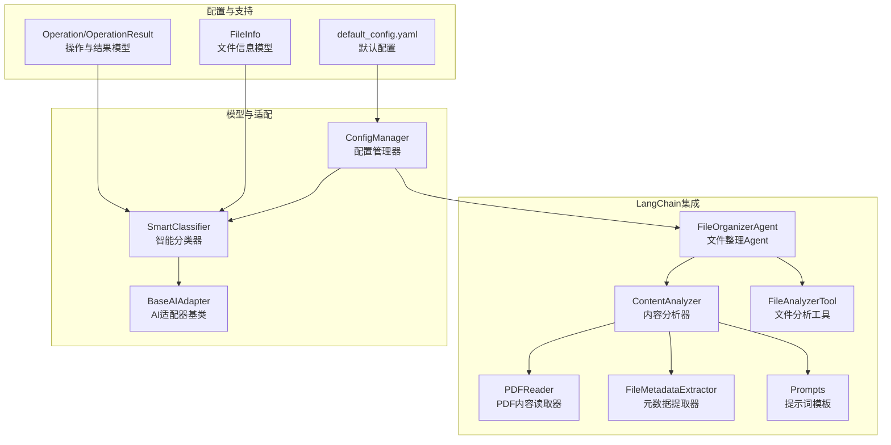
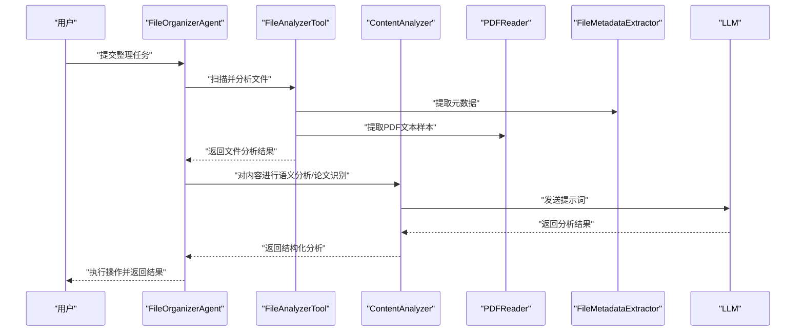
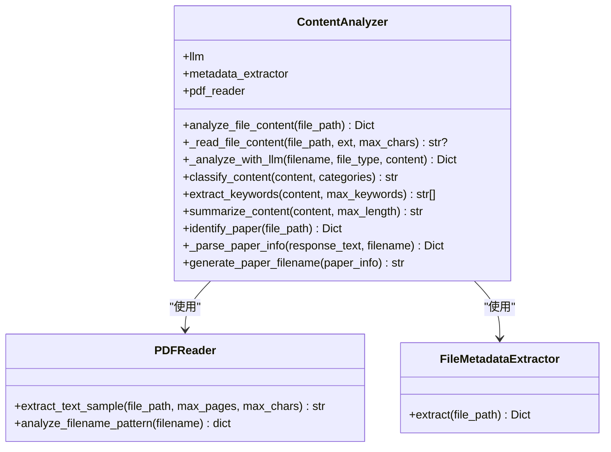
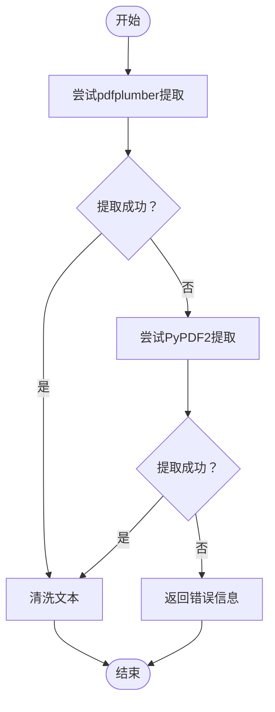
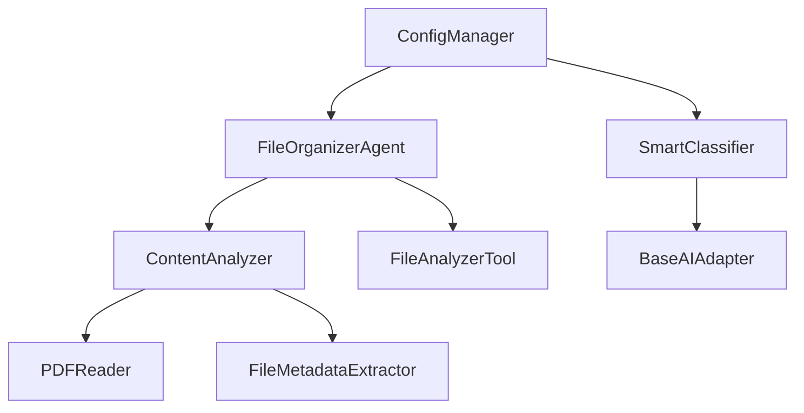

# 内容分析引擎

<cite>
**本文档引用的文件**
- [src/langchain_integration/content_analyzer.py](file://src/langchain_integration/content_analyzer.py)
- [src/utils/pdf_reader.py](file://src/utils/pdf_reader.py)
- [src/utils/file_metadata.py](file://src/utils/file_metadata.py)
- [src/langchain_integration/prompts.py](file://src/langchain_integration/prompts.py)
- [src/langchain_integration/agent.py](file://src/langchain_integration/agent.py)
- [src/langchain_integration/tools/file_analyzer_tool.py](file://src/langchain_integration/tools/file_analyzer_tool.py)
- [src/models/file_info.py](file://src/models/file_info.py)
- [src/models/operation.py](file://src/models/operation.py)
- [src/ai/base_adapter.py](file://src/ai/base_adapter.py)
- [src/core/classifier.py](file://src/core/classifier.py)
- [src/utils/config.py](file://src/utils/config.py)
- [config/default_config.yaml](file://config/default_config.yaml)
- [examples/custom_classifier.py](file://examples/custom_classifier.py)
- [tests/test_langchain_integration.py](file://tests/test_langchain_integration.py)
</cite>

## 目录
1. [简介](#简介)
2. [项目结构](#项目结构)
3. [核心组件](#核心组件)
4. [架构总览](#架构总览)
5. [详细组件分析](#详细组件分析)
6. [依赖关系分析](#依赖关系分析)
7. [性能考量](#性能考量)
8. [故障排查指南](#故障排查指南)
9. [结论](#结论)
10. [附录](#附录)

## 简介
本文件面向“内容分析引擎”的技术文档，聚焦于基于LangChain的ContentAnalyzer类设计与实现，涵盖PDF内容提取、文件类型识别、语义分析算法、支持的文件格式、内容解析策略、元数据提取机制、分析精度优化、性能调优、错误处理与缓存机制，并提供自定义分析规则与扩展新文件类型的开发指南。

## 项目结构
内容分析引擎位于LangChain集成子系统中，围绕ContentAnalyzer为核心，配合PDFReader、FileMetadataExtractor、Prompt模板与Agent工具链协同工作，形成从文件扫描、内容提取、元数据解析到LLM语义分析的完整流水线。

**图表来源**
- [src/langchain_integration/content_analyzer.py](file://src/langchain_integration/content_analyzer.py#L14-L403)
- [src/utils/pdf_reader.py](file://src/utils/pdf_reader.py#L10-L113)
- [src/utils/file_metadata.py](file://src/utils/file_metadata.py#L10-L82)
- [src/langchain_integration/prompts.py](file://src/langchain_integration/prompts.py#L162-L232)
- [src/langchain_integration/agent.py](file://src/langchain_integration/agent.py#L21-L60)
- [src/langchain_integration/tools/file_analyzer_tool.py](file://src/langchain_integration/tools/file_analyzer_tool.py#L31-L221)
- [src/ai/base_adapter.py](file://src/ai/base_adapter.py#L9-L70)
- [src/core/classifier.py](file://src/core/classifier.py#L11-L265)
- [src/utils/config.py](file://src/utils/config.py#L10-L116)
- [config/default_config.yaml](file://config/default_config.yaml#L1-L79)
- [src/models/file_info.py](file://src/models/file_info.py#L9-L48)
- [src/models/operation.py](file://src/models/operation.py#L10-L54)

**章节来源**
- [src/langchain_integration/content_analyzer.py](file://src/langchain_integration/content_analyzer.py#L14-L403)
- [src/langchain_integration/agent.py](file://src/langchain_integration/agent.py#L21-L60)
- [config/default_config.yaml](file://config/default_config.yaml#L1-L79)

## 核心组件
- ContentAnalyzer：基于LLM的文件内容分析器，负责文件基础信息、元数据、内容样本提取与LLM语义分析；提供论文识别、关键词提取、摘要生成、内容分类等能力。
- PDFReader：PDF文本提取器，优先使用pdfplumber，降级至PyPDF2，提供文本清洗与文件名模式分析。
- FileMetadataExtractor：文件元数据提取器，支持PDF、图像等格式的元数据抽取。
- Prompts：内置提示词模板，包括系统提示、内容分析、论文识别、批量操作确认等。
- FileAnalyzerTool：LangChain工具，提供文件类型分析、内容样本提取、论文特征检测等。
- FileOrganizerAgent：基于ReAct模式的智能Agent，协调工具链完成论文识别与整理。
- BaseAIAdapter/SmartClassifier：AI适配与智能分类器，支持规则快速分类与AI二次确认，具备反馈学习能力。
- 配置与模型：ConfigManager、FileInfo、Operation/OperationResult等支撑配置、文件信息与操作结果的数据结构。

**章节来源**
- [src/langchain_integration/content_analyzer.py](file://src/langchain_integration/content_analyzer.py#L14-L403)
- [src/utils/pdf_reader.py](file://src/utils/pdf_reader.py#L10-L113)
- [src/utils/file_metadata.py](file://src/utils/file_metadata.py#L10-L82)
- [src/langchain_integration/prompts.py](file://src/langchain_integration/prompts.py#L162-L232)
- [src/langchain_integration/tools/file_analyzer_tool.py](file://src/langchain_integration/tools/file_analyzer_tool.py#L31-L221)
- [src/langchain_integration/agent.py](file://src/langchain_integration/agent.py#L21-L60)
- [src/ai/base_adapter.py](file://src/ai/base_adapter.py#L9-L70)
- [src/core/classifier.py](file://src/core/classifier.py#L11-L265)
- [src/utils/config.py](file://src/utils/config.py#L10-L116)
- [src/models/file_info.py](file://src/models/file_info.py#L9-L48)
- [src/models/operation.py](file://src/models/operation.py#L10-L54)

## 架构总览
内容分析引擎采用“工具链+LLM”的架构：Agent通过ReAct模式调度工具，工具负责文件扫描、内容提取与元数据解析，ContentAnalyzer负责将内容送入LLM进行语义分析与论文识别，并输出结构化结果。

**图表来源**
- [src/langchain_integration/agent.py](file://src/langchain_integration/agent.py#L100-L228)
- [src/langchain_integration/tools/file_analyzer_tool.py](file://src/langchain_integration/tools/file_analyzer_tool.py#L49-L101)
- [src/langchain_integration/content_analyzer.py](file://src/langchain_integration/content_analyzer.py#L28-L118)
- [src/utils/pdf_reader.py](file://src/utils/pdf_reader.py#L13-L25)
- [src/utils/file_metadata.py](file://src/utils/file_metadata.py#L13-L32)

## 详细组件分析

### ContentAnalyzer 设计与实现
- 职责边界
  - 文件基础信息收集：路径、文件名、扩展名、大小。
  - 元数据提取：通过FileMetadataExtractor获取MIME、PDF页数、标题、作者等。
  - 内容读取：PDF使用PDFReader提取文本样本；文本类文件直接读取UTF-8；其他类型尝试文本读取。
  - LLM语义分析：基于提示词模板进行内容分析、关键词提取、摘要生成、内容分类。
  - 论文识别：先规则快速筛选，再用LLM深度分析，解析JSON或文本结果，生成建议文件名。
- 数据流与复杂度
  - 内容读取：PDF按页提取，限制最大字符数，时间复杂度近似O(N)，N为页数。
  - 文本读取：按字符上限截断，时间复杂度O(K)，K为采样长度。
  - LLM调用：每次分析一次LLM请求，受模型与网络影响。
- 错误处理
  - 文件不存在、读取异常、LLM调用失败均返回结构化错误信息，避免中断流程。
- 性能优化
  - 采样长度限制、快速规则过滤、降级策略（pdfplumber → PyPDF2）。
- 可扩展性
  - 通过提示词模板与LLM接口解耦，便于更换模型与优化提示词。

**图表来源**
- [src/langchain_integration/content_analyzer.py](file://src/langchain_integration/content_analyzer.py#L14-L403)
- [src/utils/pdf_reader.py](file://src/utils/pdf_reader.py#L10-L113)
- [src/utils/file_metadata.py](file://src/utils/file_metadata.py#L10-L82)

**章节来源**
- [src/langchain_integration/content_analyzer.py](file://src/langchain_integration/content_analyzer.py#L14-L403)

### PDF内容提取策略
- 优先策略：pdfplumber，文本提取质量更高。
- 降级策略：PyPDF2，保证在某些PDF上仍可提取。
- 文本清洗：去除多余空白与控制字符，规范化输出。
- 文件名模式分析：识别数字、年份、中英文、关键词等，辅助论文识别与命名。

**图表来源**
- [src/utils/pdf_reader.py](file://src/utils/pdf_reader.py#L13-L25)

**章节来源**
- [src/utils/pdf_reader.py](file://src/utils/pdf_reader.py#L10-L113)

### 文件类型识别与元数据提取
- 类型识别：基于扩展名分类（文档、表格、演示、图像、视频、音频、压缩包、代码），PDF进一步分析文件名模式。
- 元数据提取：
  - PDF：页数、标题、作者、主题、创建者、生产者等。
  - 图像：宽高、格式、模式、EXIF等。
- 内容分析：对PDF与文本文件提取文本样本，识别中英文特征，辅助论文识别。

**章节来源**
- [src/langchain_integration/tools/file_analyzer_tool.py](file://src/langchain_integration/tools/file_analyzer_tool.py#L102-L169)
- [src/utils/file_metadata.py](file://src/utils/file_metadata.py#L13-L82)

### 语义分析算法与提示词模板
- 内容分析：基于CONTENT_ANALYSIS_PROMPT，提取主题、关键词、类型判断、建议分类与文件名。
- 论文识别：基于PAPER_IDENTIFICATION_PROMPT，要求LLM输出JSON结构，包含是否论文、标题、作者、年份、期刊、领域、DOI、建议文件名与置信度。
- 批量确认：BATCH_OPERATION_PROMPT用于汇总批量操作，确保用户知情与安全。
- Agent系统提示：SYSTEM_PROMPT定义Agent职责、工具调用格式与论文整理工作流。

**章节来源**
- [src/langchain_integration/prompts.py](file://src/langchain_integration/prompts.py#L162-L232)
- [src/langchain_integration/content_analyzer.py](file://src/langchain_integration/content_analyzer.py#L89-L117)
- [src/langchain_integration/content_analyzer.py](file://src/langchain_integration/content_analyzer.py#L236-L321)

### 论文识别与命名策略
- 快速规则：统计“摘要/引言/参考文献/结论/关键词/DOI/ArXiv/期刊”等关键词出现次数，阈值判定是否为论文。
- LLM深度分析：使用PAPER_IDENTIFICATION_PROMPT，解析JSON或文本结果，补充缺失信息。
- 命名策略：优先使用LLM建议文件名；否则基于第一作者、年份、标题（简化）生成规范命名，限制长度。

**章节来源**
- [src/langchain_integration/content_analyzer.py](file://src/langchain_integration/content_analyzer.py#L236-L403)
- [src/langchain_integration/tools/file_analyzer_tool.py](file://src/langchain_integration/tools/file_analyzer_tool.py#L170-L217)

### 智能分类与反馈学习
- 快速分类：基于扩展名与规则预分类，减少AI调用。
- AI分类：通过AI适配器生成分类方案，解析为操作列表。
- 反馈学习：从用户反馈中提取规则，动态优化后续分类。
- 降级策略：AI不可用时，按简单规则（如目标文件夹、文件类型）进行分类。

**章节来源**
- [src/core/classifier.py](file://src/core/classifier.py#L11-L265)
- [src/ai/base_adapter.py](file://src/ai/base_adapter.py#L9-L70)

### 配置与模型支撑
- 配置管理：ConfigManager统一加载YAML配置，支持多提供商LLM参数与环境变量注入。
- 默认配置：包含AI提供商、LangChain Agent、文件操作、安全与日志等配置项。
- 数据模型：FileInfo提供文件信息与人类可读大小；Operation/OperationResult描述操作与批量结果。

**章节来源**
- [src/utils/config.py](file://src/utils/config.py#L10-L116)
- [config/default_config.yaml](file://config/default_config.yaml#L1-L79)
- [src/models/file_info.py](file://src/models/file_info.py#L9-L48)
- [src/models/operation.py](file://src/models/operation.py#L10-L54)

## 依赖关系分析
- 组件耦合
  - ContentAnalyzer依赖PDFReader与FileMetadataExtractor，耦合度低，便于替换实现。
  - Agent通过工具链与ContentAnalyzer协作，遵循单一职责。
  - Classifier通过AI适配器与外部LLM解耦，支持多种提供商。
- 外部依赖
  - LLM提供商（Claude、OpenAI、本地、自定义）由ConfigManager与LLMFactory注入。
  - PDF处理依赖pdfplumber与PyPDF2，具备降级能力。
- 循环依赖
  - 未发现循环依赖，模块间通过接口与工具链解耦。

**图表来源**
- [src/langchain_integration/content_analyzer.py](file://src/langchain_integration/content_analyzer.py#L14-L27)
- [src/langchain_integration/agent.py](file://src/langchain_integration/agent.py#L40-L52)
- [src/core/classifier.py](file://src/core/classifier.py#L14-L22)
- [src/utils/config.py](file://src/utils/config.py#L76-L111)

**章节来源**
- [src/langchain_integration/content_analyzer.py](file://src/langchain_integration/content_analyzer.py#L14-L27)
- [src/langchain_integration/agent.py](file://src/langchain_integration/agent.py#L40-L52)
- [src/core/classifier.py](file://src/core/classifier.py#L14-L22)
- [src/utils/config.py](file://src/utils/config.py#L76-L111)

## 性能考量
- 采样与截断
  - PDF与文本内容采样长度限制，降低LLM输入成本与延迟。
- 快速规则过滤
  - 论文识别先用关键词计数快速过滤，减少LLM调用次数。
- 降级策略
  - pdfplumber失败时自动切换到PyPDF2，保障稳定性。
- 批处理与并发
  - 控制器与API层支持批量操作与任务管理，提升吞吐。
- 缓存机制
  - 当前未实现显式缓存层；可在ContentAnalyzer或工具层引入LRU缓存或持久化缓存（建议）。

[本节为通用性能指导，无需具体文件分析]

## 故障排查指南
- 常见问题
  - 文件不存在：返回错误信息，检查路径与权限。
  - PDF无法提取：检查加密、扫描版PDF或OCR缺失；尝试降级策略。
  - LLM调用失败：检查API Key、网络与模型可用性；查看错误信息。
  - 论文识别不准确：调整提示词或增加规则特征；结合人工校验。
- 调试建议
  - 启用详细日志与Agent verbose模式，观察ReAct输出与工具调用。
  - 使用测试用例验证工具链与Agent行为。
  - 在配置中开启安全选项（备份、确认、撤销）以降低风险。

**章节来源**
- [src/langchain_integration/content_analyzer.py](file://src/langchain_integration/content_analyzer.py#L40-L44)
- [src/langchain_integration/content_analyzer.py](file://src/langchain_integration/content_analyzer.py#L86-L87)
- [src/langchain_integration/content_analyzer.py](file://src/langchain_integration/content_analyzer.py#L113-L117)
- [tests/test_langchain_integration.py](file://tests/test_langchain_integration.py#L162-L215)

## 结论
内容分析引擎以ContentAnalyzer为核心，结合PDFReader、FileMetadataExtractor与LangChain工具链，实现了从文件扫描、内容提取、元数据解析到LLM语义分析的完整闭环。通过快速规则过滤、降级策略与提示词模板，系统在准确性与性能之间取得平衡。建议后续引入缓存层、增强论文识别规则与提示词工程，以进一步提升精度与用户体验。

[本节为总结性内容，无需具体文件分析]

## 附录

### 支持的文件格式与解析策略
- PDF：优先pdfplumber，降级PyPDF2；提取文本样本、元数据；论文识别与命名。
- 文本类：.txt、.md、.py、.js、.java、.cpp、.c、.go、.rs等，UTF-8读取采样。
- 图像类：.jpg、.jpeg、.png、.gif、.bmp，提取尺寸、格式、EXIF等。
- 其他：按文本读取策略尝试解析，避免强制类型限制。

**章节来源**
- [src/langchain_integration/content_analyzer.py](file://src/langchain_integration/content_analyzer.py#L74-L87)
- [src/langchain_integration/tools/file_analyzer_tool.py](file://src/langchain_integration/tools/file_analyzer_tool.py#L118-L136)
- [src/utils/file_metadata.py](file://src/utils/file_metadata.py#L24-L31)

### 自定义分析规则与扩展指南
- 自定义分类器
  - 继承SmartClassifier，重写规则应用逻辑，实现按年份、大小等特征的快速分类。
  - 示例参见：[examples/custom_classifier.py](file://examples/custom_classifier.py#L9-L47)。
- 扩展文件类型
  - 在FileMetadataExtractor中新增类型元数据提取方法，或在工具链中扩展类型识别逻辑。
- 提示词优化
  - 修改Prompts中的提示词模板，针对特定领域优化论文识别与内容分析效果。
- AI适配器扩展
  - 继承BaseAIAdapter，实现generate_classification与refine_with_feedback，接入新提供商。

**章节来源**
- [examples/custom_classifier.py](file://examples/custom_classifier.py#L9-L47)
- [src/ai/base_adapter.py](file://src/ai/base_adapter.py#L9-L70)
- [src/langchain_integration/prompts.py](file://src/langchain_integration/prompts.py#L162-L232)