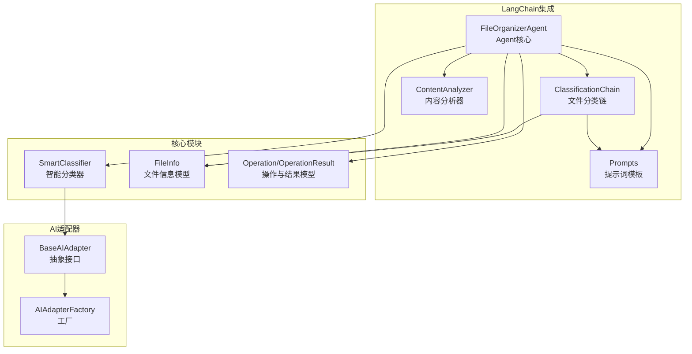
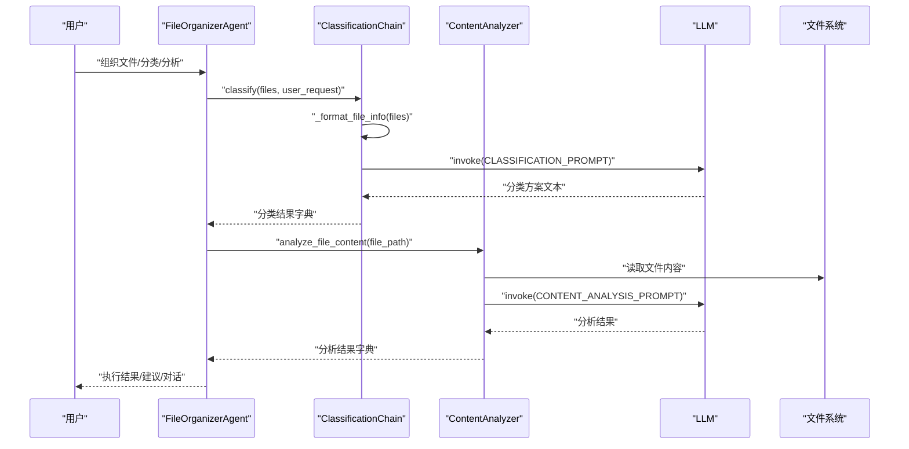
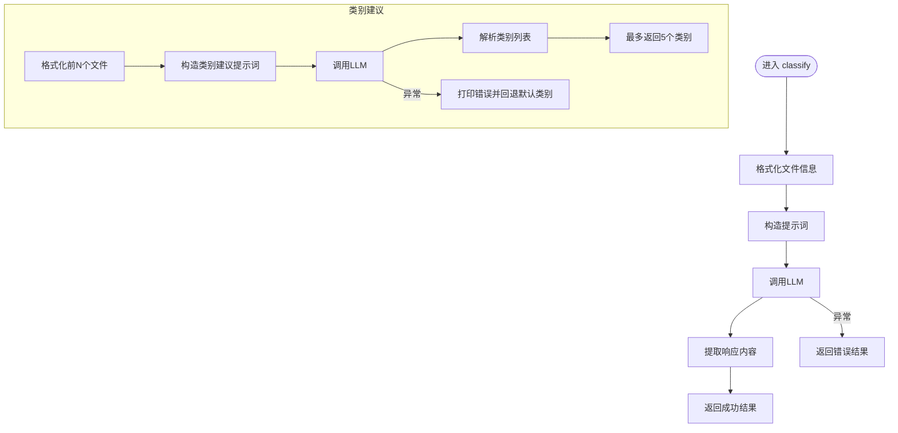
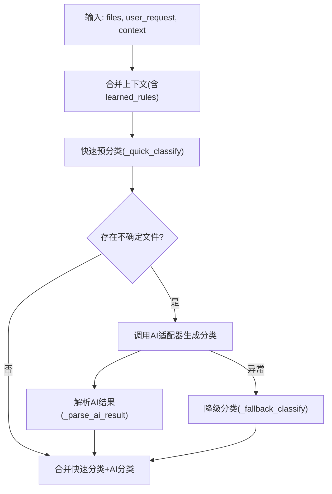
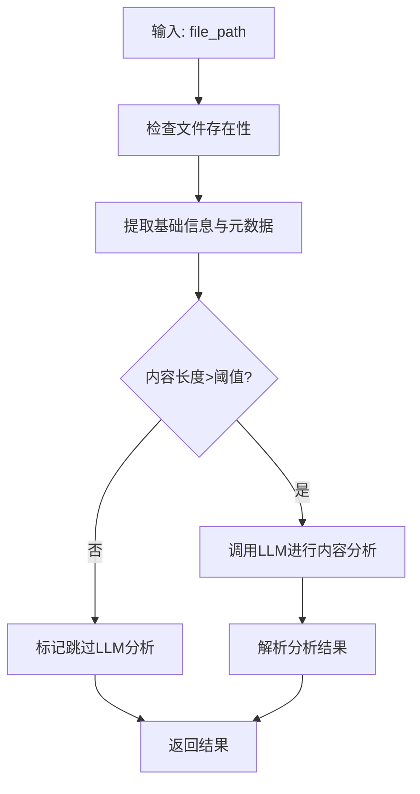
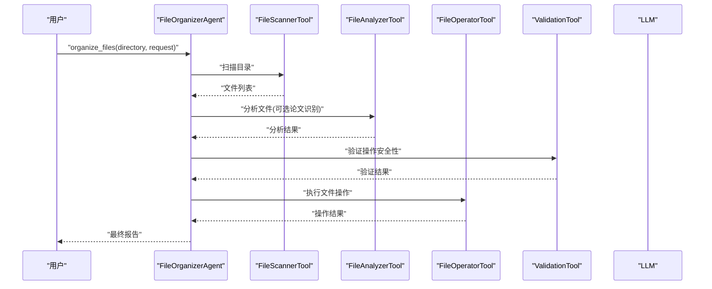
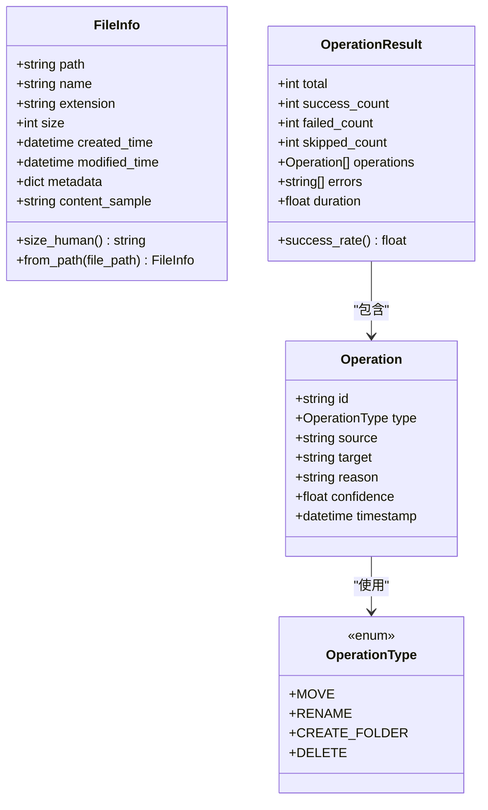
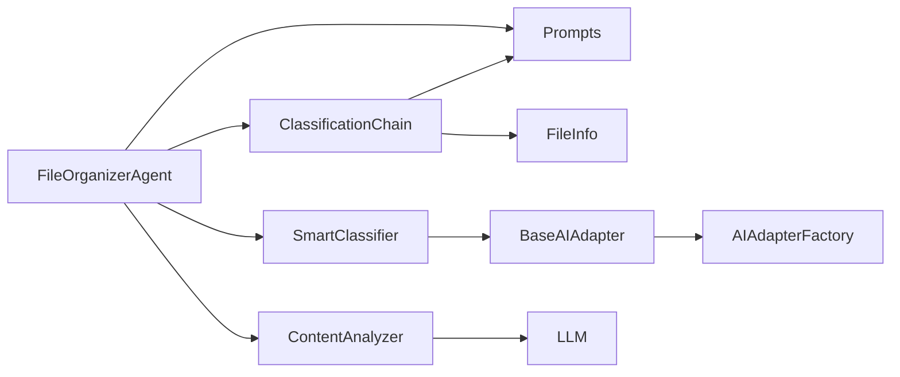

# 分类链式处理

<cite>
**本文档引用的文件**
- [classification_chain.py](file://src/langchain_integration/chains/classification_chain.py)
- [classifier.py](file://src/core/classifier.py)
- [file_info.py](file://src/models/file_info.py)
- [operation.py](file://src/models/operation.py)
- [content_analyzer.py](file://src/langchain_integration/content_analyzer.py)
- [prompts.py](file://src/langchain_integration/prompts.py)
- [base_adapter.py](file://src/ai/base_adapter.py)
- [adapter_factory.py](file://src/ai/adapter_factory.py)
- [agent.py](file://src/langchain_integration/agent.py)
- [custom_classifier.py](file://examples/custom_classifier.py)
- [default_config.yaml](file://config/default_config.yaml)
- [LANGCHAIN_INTEGRATION.md](file://docs/LANGCHAIN_INTEGRATION.md)
</cite>

## 目录
1. [简介](#简介)
2. [项目结构](#项目结构)
3. [核心组件](#核心组件)
4. [架构总览](#架构总览)
5. [详细组件分析](#详细组件分析)
6. [依赖关系分析](#依赖关系分析)
7. [性能考量](#性能考量)
8. [故障排查指南](#故障排查指南)
9. [结论](#结论)
10. [附录](#附录)

## 简介
本文件面向“分类链式处理系统”的技术文档，重点阐述 ClassificationChain 的链式处理架构、分类逻辑、决策流程与结果聚合机制；同时覆盖链式调用的执行顺序、中间结果处理、异常传播机制；并提供分类策略配置、性能优化、结果验证与错误恢复的实践指南，以及自定义分类链与扩展分类算法的开发指引。

## 项目结构
该系统围绕“LangChain Agent + AI适配器 + 核心分类器 + 模型与工具”展开，形成“提示词驱动 + 工具编排 + 结果聚合”的链式处理闭环。

图表来源
- [agent.py](file://src/langchain_integration/agent.py#L21-L60)
- [classification_chain.py](file://src/langchain_integration/chains/classification_chain.py#L10-L26)
- [content_analyzer.py](file://src/langchain_integration/content_analyzer.py#L14-L27)
- [prompts.py](file://src/langchain_integration/prompts.py#L140-L160)
- [base_adapter.py](file://src/ai/base_adapter.py#L9-L30)
- [adapter_factory.py](file://src/ai/adapter_factory.py#L11-L37)
- [classifier.py](file://src/core/classifier.py#L11-L23)
- [file_info.py](file://src/models/file_info.py#L9-L20)
- [operation.py](file://src/models/operation.py#L18-L31)

章节来源
- [agent.py](file://src/langchain_integration/agent.py#L21-L60)
- [classification_chain.py](file://src/langchain_integration/chains/classification_chain.py#L10-L26)
- [content_analyzer.py](file://src/langchain_integration/content_analyzer.py#L14-L27)
- [prompts.py](file://src/langchain_integration/prompts.py#L140-L160)
- [base_adapter.py](file://src/ai/base_adapter.py#L9-L30)
- [adapter_factory.py](file://src/ai/adapter_factory.py#L11-L37)
- [classifier.py](file://src/core/classifier.py#L11-L23)
- [file_info.py](file://src/models/file_info.py#L9-L20)
- [operation.py](file://src/models/operation.py#L18-L31)

## 核心组件
- ClassificationChain：基于LangChain LLM的文件分类链，负责将文件信息格式化并调用LLM生成分类方案，支持类别建议。
- SmartClassifier：核心智能分类器，结合规则与AI适配器，提供快速预分类、AI分类、反馈优化与降级处理。
- ContentAnalyzer：基于LLM的文件内容分析器，支持内容分类、关键词提取、摘要生成与论文识别。
- Prompts：集中管理分类、内容分析、论文识别等提示词模板。
- AI适配器体系：BaseAIAdapter抽象接口与AIAdapterFactory工厂，支持Claude、OpenAI、本地与自定义API。
- 模型：FileInfo、Operation/OperationResult等数据模型，支撑分类结果的结构化表达与聚合。

章节来源
- [classification_chain.py](file://src/langchain_integration/chains/classification_chain.py#L10-L66)
- [classifier.py](file://src/core/classifier.py#L11-L66)
- [content_analyzer.py](file://src/langchain_integration/content_analyzer.py#L14-L72)
- [prompts.py](file://src/langchain_integration/prompts.py#L140-L211)
- [base_adapter.py](file://src/ai/base_adapter.py#L9-L70)
- [adapter_factory.py](file://src/ai/adapter_factory.py#L11-L37)
- [file_info.py](file://src/models/file_info.py#L9-L48)
- [operation.py](file://src/models/operation.py#L18-L54)

## 架构总览
系统采用“提示词驱动 + 工具编排”的链式处理架构。Agent负责组织任务、调度工具与LLM；ClassificationChain与ContentAnalyzer分别承担“分类链”和“内容分析”的子任务；SmartClassifier在传统模式下提供规则+AI混合策略；AI适配器屏蔽不同LLM提供商差异。

图表来源
- [agent.py](file://src/langchain_integration/agent.py#L100-L227)
- [classification_chain.py](file://src/langchain_integration/chains/classification_chain.py#L22-L66)
- [content_analyzer.py](file://src/langchain_integration/content_analyzer.py#L28-L72)
- [prompts.py](file://src/langchain_integration/prompts.py#L140-L176)

## 详细组件分析

### ClassificationChain 分析
- 职责边界：接收文件列表与用户需求，格式化文件信息，构造提示词，调用LLM生成分类方案，并返回结构化结果。
- 执行顺序：
  1) 格式化文件信息（路径、名称、类型、大小、元数据、内容样本）。
  2) 构造提示词（CLASSIFICATION_PROMPT），调用LLM。
  3) 提取响应内容，封装为结果字典。
  4) 异常捕获并返回错误信息。
- 中间结果处理：格式化阶段对元数据与内容样本进行截断与清洗，确保提示词长度可控。
- 异常传播：统一捕获Exception，返回success=false与错误字符串，便于上层处理。
- 类别建议：提供suggest_categories方法，基于文件特征建议3-5个类别，失败时回退到默认类别集合。

图表来源
- [classification_chain.py](file://src/langchain_integration/chains/classification_chain.py#L22-L66)
- [classification_chain.py](file://src/langchain_integration/chains/classification_chain.py#L99-L138)

章节来源
- [classification_chain.py](file://src/langchain_integration/chains/classification_chain.py#L10-L138)
- [prompts.py](file://src/langchain_integration/prompts.py#L140-L159)

### SmartClassifier 分析
- 职责边界：在传统模式下，结合规则与AI适配器，提供快速预分类、AI分类、反馈优化与降级处理。
- 执行顺序：
  1) 合并上下文（含已学习规则）。
  2) 快速预分类（规则命中即生成操作）。
  3) 对不确定文件调用AI适配器生成分类。
  4) 解析AI结果为操作列表。
  5) 合并快速分类与AI分类结果。
  6) 异常时降级为简单规则分类。
- 中间结果处理：将Operation对象序列化为字典用于反馈优化；维护对话历史与上下文。
- 异常传播：AI分类失败时降级处理，保证系统可用性；反馈优化失败时回退原操作。
- 学习机制：从用户反馈中提取规则，动态加入learned_rules，提升后续分类质量。

图表来源
- [classifier.py](file://src/core/classifier.py#L24-L66)
- [classifier.py](file://src/core/classifier.py#L113-L130)
- [classifier.py](file://src/core/classifier.py#L157-L178)
- [classifier.py](file://src/core/classifier.py#L180-L208)

章节来源
- [classifier.py](file://src/core/classifier.py#L11-L265)
- [base_adapter.py](file://src/ai/base_adapter.py#L9-L70)
- [adapter_factory.py](file://src/ai/adapter_factory.py#L11-L37)

### ContentAnalyzer 分析
- 职责边界：对单个文件进行内容分析，提取元数据、关键词、摘要，识别论文并生成建议文件名。
- 执行顺序：
  1) 读取文件内容（PDF/文本等），限制长度。
  2) 提取元数据与基础信息。
  3) 若内容足够，调用LLM进行内容分析。
  4) 提供内容分类、关键词提取、摘要生成、论文识别等能力。
- 中间结果处理：对LLM响应进行JSON解析与文本解析双重兜底；对论文识别结果进行置信度评估。
- 异常传播：各方法均捕获异常并返回结构化错误信息，避免中断整体流程。

图表来源
- [content_analyzer.py](file://src/langchain_integration/content_analyzer.py#L28-L72)
- [content_analyzer.py](file://src/langchain_integration/content_analyzer.py#L89-L117)
- [content_analyzer.py](file://src/langchain_integration/content_analyzer.py#L236-L321)

章节来源
- [content_analyzer.py](file://src/langchain_integration/content_analyzer.py#L14-L403)

### Agent 与链式调用
- FileOrganizerAgent：作为顶层协调者，负责任务路由、工具编排、ReAct解析与结果汇总。
- 链式调用顺序：Agent根据用户需求决定是否论文整理任务；随后按“扫描-分析-验证-执行-报告”的链路推进；支持对话记忆与历史上下文。
- 异常传播：Agent内部捕获异常并返回结构化错误；ReAct解析失败时尝试修复JSON并继续迭代。

图表来源
- [agent.py](file://src/langchain_integration/agent.py#L100-L227)
- [agent.py](file://src/langchain_integration/agent.py#L300-L431)

章节来源
- [agent.py](file://src/langchain_integration/agent.py#L21-L576)
- [LANGCHAIN_INTEGRATION.md](file://docs/LANGCHAIN_INTEGRATION.md#L24-L31)

### 模型与数据结构
- FileInfo：文件信息模型，提供路径、名称、扩展名、大小、时间戳、元数据与内容样本等字段，支持从路径创建与人类可读大小转换。
- Operation/OperationResult：操作与批量结果模型，包含操作类型、源/目标路径、原因、置信度、时间戳与统计指标（成功率等）。

图表来源
- [file_info.py](file://src/models/file_info.py#L9-L48)
- [operation.py](file://src/models/operation.py#L10-L54)

章节来源
- [file_info.py](file://src/models/file_info.py#L9-L48)
- [operation.py](file://src/models/operation.py#L18-L54)

## 依赖关系分析
- ClassificationChain 依赖 LangChain LLM 与提示词模板，输出结构化分类结果。
- SmartClassifier 依赖 BaseAIAdapter 抽象接口与 AIAdapterFactory 工厂，实现规则+AI混合策略。
- ContentAnalyzer 依赖 LLM 与工具（PDFReader、FileMetadataExtractor），提供内容分析与论文识别。
- Agent 作为编排中心，依赖上述组件与工具集，实现链式调用与结果聚合。

图表来源
- [classification_chain.py](file://src/langchain_integration/chains/classification_chain.py#L3-L8)
- [classifier.py](file://src/core/classifier.py#L6-L7)
- [base_adapter.py](file://src/ai/base_adapter.py#L3-L7)
- [adapter_factory.py](file://src/ai/adapter_factory.py#L4-L8)
- [content_analyzer.py](file://src/langchain_integration/content_analyzer.py#L7-L11)
- [agent.py](file://src/langchain_integration/agent.py#L10-L18)

章节来源
- [classification_chain.py](file://src/langchain_integration/chains/classification_chain.py#L3-L8)
- [classifier.py](file://src/core/classifier.py#L6-L7)
- [base_adapter.py](file://src/ai/base_adapter.py#L3-L7)
- [adapter_factory.py](file://src/ai/adapter_factory.py#L4-L8)
- [content_analyzer.py](file://src/langchain_integration/content_analyzer.py#L7-L11)
- [agent.py](file://src/langchain_integration/agent.py#L10-L18)

## 性能考量
- Token与内容长度控制：提示词模板与内容读取均有限制，避免Token超限与内存占用过高。
- 批量与并发：配置中提供批量大小与并发处理建议，结合工具的批量执行能力提升吞吐。
- 缓存策略：建议缓存文件分析结果与LLM响应，减少重复计算与API调用。
- 降级与回退：AI不可用时的降级分类与默认类别建议，保障系统可用性。
- 配置优化：通过 default_config.yaml 调整模型参数、工具限制与日志级别，平衡性能与准确性。

章节来源
- [prompts.py](file://src/langchain_integration/prompts.py#L140-L176)
- [content_analyzer.py](file://src/langchain_integration/content_analyzer.py#L74-L88)
- [classifier.py](file://src/core/classifier.py#L180-L208)
- [default_config.yaml](file://config/default_config.yaml#L26-L46)
- [LANGCHAIN_INTEGRATION.md](file://docs/LANGCHAIN_INTEGRATION.md#L280-L299)

## 故障排查指南
- Agent初始化失败：检查LangChain依赖安装、API密钥配置与模型参数。
- Token超限：减少单次处理文件数、启用dry-run测试、调整最大内容长度。
- 连接超时：检查网络、增加执行超时、使用本地LLM（Ollama）。
- 工具调用失败：确认工具名称正确、参数格式为有效JSON；查看Observation与错误信息。
- 分类结果异常：检查提示词模板、文件内容样本长度、LLM响应解析与异常捕获逻辑。
- 自定义分类器：继承SmartClassifier并重写规则应用逻辑，确保返回Operation或None。

章节来源
- [agent.py](file://src/langchain_integration/agent.py#L300-L431)
- [LANGCHAIN_INTEGRATION.md](file://docs/LANGCHAIN_INTEGRATION.md#L300-L328)
- [custom_classifier.py](file://examples/custom_classifier.py#L9-L47)

## 结论
该分类链式处理系统通过“提示词模板 + LangChain工具 + AI适配器 + 智能分类器”的组合，实现了从文件扫描、内容分析、分类决策到操作执行的完整链路。ClassificationChain聚焦于“分类方案生成”，SmartClassifier提供规则+AI混合策略与反馈优化，Agent负责端到端编排与结果聚合。系统具备良好的扩展性与鲁棒性，支持自定义分类链与分类算法的二次开发。

## 附录

### 自定义分类链开发指南
- 继承 ClassificationChain，重写分类逻辑或提示词构造方式。
- 在提示词模板中明确输出格式与约束，提升LLM稳定性。
- 实现中间结果校验与异常处理，确保链路健壮性。
- 与 Agent/ContentAnalyzer 协同，复用现有工具与模型。

章节来源
- [classification_chain.py](file://src/langchain_integration/chains/classification_chain.py#L10-L138)
- [prompts.py](file://src/langchain_integration/prompts.py#L140-L159)

### 扩展分类算法开发指南
- 继承 SmartClassifier，重写规则应用与反馈学习逻辑。
- 实现 BaseAIAdapter 的 generate_classification 与 refine_with_feedback，适配不同LLM提供商。
- 使用 AIAdapterFactory 注册自定义适配器，统一配置入口。
- 在 examples/custom_classifier.py 中参考自定义规则实现。

章节来源
- [classifier.py](file://src/core/classifier.py#L11-L265)
- [base_adapter.py](file://src/ai/base_adapter.py#L9-L70)
- [adapter_factory.py](file://src/ai/adapter_factory.py#L11-L98)
- [custom_classifier.py](file://examples/custom_classifier.py#L9-L47)