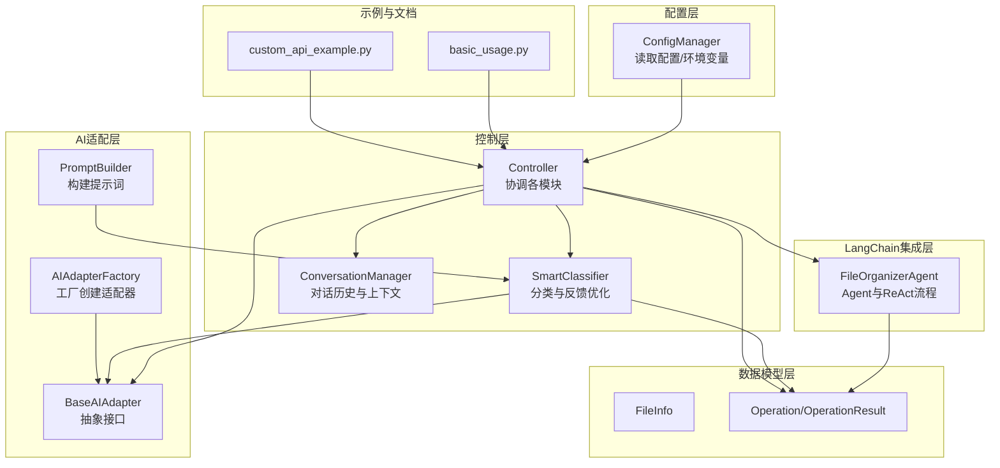
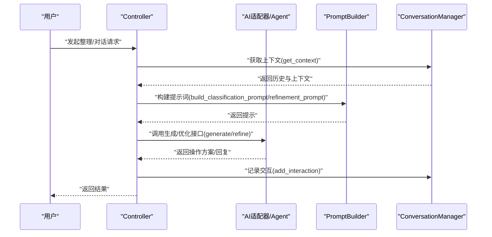
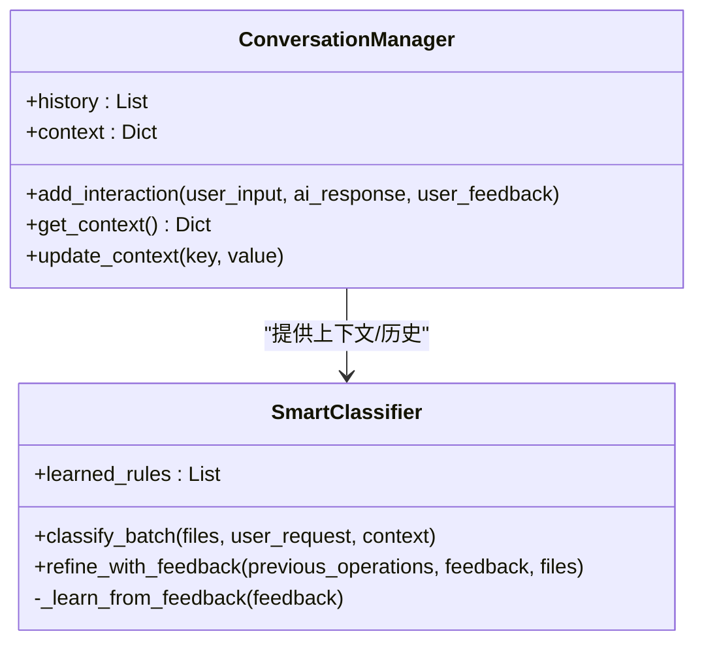
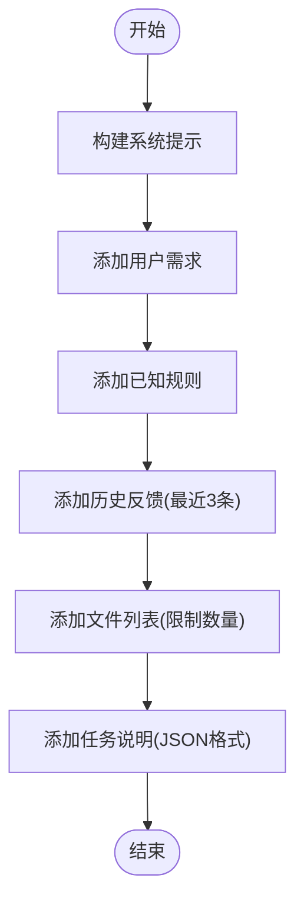
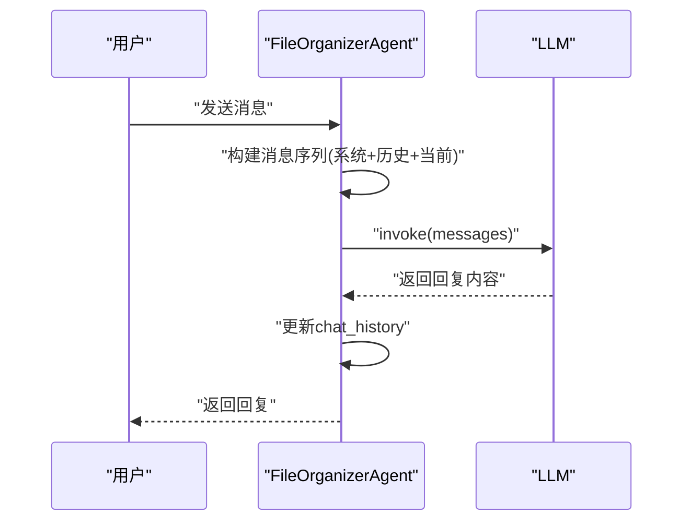
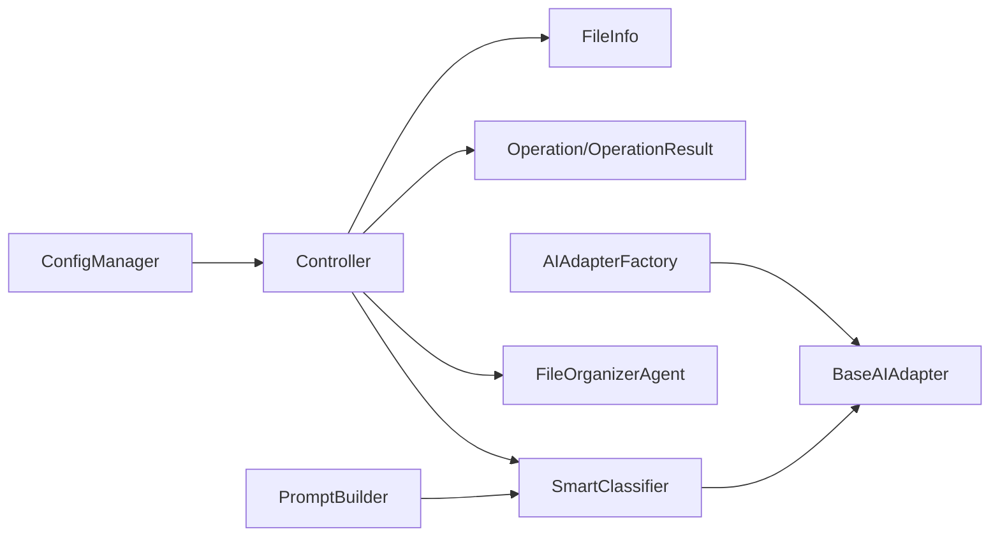

# 对话管理系统

<cite>
**本文引用的文件**
- [README.md](file://README.md)
- [config/default_config.yaml](file://config/default_config.yaml)
- [src/utils/config.py](file://src/utils/config.py)
- [src/core/controller.py](file://src/core/controller.py)
- [src/core/classifier.py](file://src/core/classifier.py)
- [src/ai/__init__.py](file://src/ai/__init__.py)
- [src/ai/base_adapter.py](file://src/ai/base_adapter.py)
- [src/ai/adapter_factory.py](file://src/ai/adapter_factory.py)
- [src/ai/prompt_builder.py](file://src/ai/prompt_builder.py)
- [src/langchain_integration/agent.py](file://src/langchain_integration/agent.py)
- [src/models/file_info.py](file://src/models/file_info.py)
- [src/models/operation.py](file://src/models/operation.py)
- [examples/basic_usage.py](file://examples/basic_usage.py)
- [examples/custom_api_example.py](file://examples/custom_api_example.py)
</cite>

## 目录
1. [简介](#简介)
2. [项目结构](#项目结构)
3. [核心组件](#核心组件)
4. [架构总览](#架构总览)
5. [详细组件分析](#详细组件分析)
6. [依赖关系分析](#依赖关系分析)
7. [性能考量](#性能考量)
8. [故障排查指南](#故障排查指南)
9. [结论](#结论)
10. [附录](#附录)

## 简介
本技术文档围绕“对话管理系统”展开，聚焦聊天历史管理、消息序列处理、上下文维护机制；深入解析 chat 方法的实现原理、历史消息截断策略与内存优化方案；并涵盖对话状态管理、会话持久化、并发处理与隐私保护。同时提供自定义对话策略与扩展对话功能的实践指南，帮助开发者在现有架构基础上进行二次开发与定制。

## 项目结构
该系统采用分层架构，主要分为：
- 配置层：负责读取与合并配置，支持多提供商AI配置与环境变量注入
- 控制层：协调扫描、分类、执行、日志、备份与撤销等流程
- AI适配层：统一AI接口，支持Claude、OpenAI、本地模型与自定义API
- LangChain集成层：Agent模式下的工具链与ReAct对话流程
- 数据模型层：文件信息与操作记录的数据结构
- 示例与文档：基础用法与自定义API示例

图表来源
- [src/utils/config.py](file://src/utils/config.py#L10-L116)
- [src/core/controller.py](file://src/core/controller.py#L15-L82)
- [src/core/classifier.py](file://src/core/classifier.py#L11-L265)
- [src/ai/base_adapter.py](file://src/ai/base_adapter.py#L9-L70)
- [src/ai/adapter_factory.py](file://src/ai/adapter_factory.py#L11-L98)
- [src/ai/prompt_builder.py](file://src/ai/prompt_builder.py#L7-L172)
- [src/langchain_integration/agent.py](file://src/langchain_integration/agent.py#L21-L576)
- [src/models/file_info.py](file://src/models/file_info.py#L9-L48)
- [src/models/operation.py](file://src/models/operation.py#L10-L54)
- [examples/basic_usage.py](file://examples/basic_usage.py#L7-L89)
- [examples/custom_api_example.py](file://examples/custom_api_example.py#L7-L99)

章节来源
- [README.md](file://README.md#L1-L290)
- [config/default_config.yaml](file://config/default_config.yaml#L1-L79)
- [src/utils/config.py](file://src/utils/config.py#L10-L116)
- [src/core/controller.py](file://src/core/controller.py#L15-L82)

## 核心组件
- 配置管理器：集中管理配置与环境变量，支持多提供商AI配置合并
- 主控制器：协调扫描、分类、执行、日志、备份与撤销；提供Agent模式与传统模式切换
- 智能分类器：结合规则与AI进行分类，支持基于反馈的学习与优化
- 对话管理器：维护历史交互、上下文传递与规则学习
- AI适配器与工厂：统一AI接口，按提供商创建具体适配器
- Prompt构建器：构造分类与优化任务的提示词，控制上下文长度
- LangChain Agent：ReAct对话流程，维护会话历史，支持与Agent对话

章节来源
- [src/utils/config.py](file://src/utils/config.py#L10-L116)
- [src/core/controller.py](file://src/core/controller.py#L15-L310)
- [src/core/classifier.py](file://src/core/classifier.py#L11-L265)
- [src/ai/base_adapter.py](file://src/ai/base_adapter.py#L9-L70)
- [src/ai/adapter_factory.py](file://src/ai/adapter_factory.py#L11-L98)
- [src/ai/prompt_builder.py](file://src/ai/prompt_builder.py#L7-L172)
- [src/langchain_integration/agent.py](file://src/langchain_integration/agent.py#L21-L576)

## 架构总览
系统通过配置管理器加载AI提供商与工具链参数，主控制器根据配置选择Agent模式或传统模式。在Agent模式下，FileOrganizerAgent负责ReAct对话与工具调用；在传统模式下，SmartClassifier结合AI适配器与PromptBuilder生成与优化操作方案。对话历史与上下文通过ConversationManager与PromptBuilder共同维护，确保多轮交互的一致性与可追溯性。

图表来源
- [src/core/controller.py](file://src/core/controller.py#L109-L140)
- [src/core/classifier.py](file://src/core/classifier.py#L24-L66)
- [src/ai/prompt_builder.py](file://src/ai/prompt_builder.py#L40-L84)
- [src/langchain_integration/agent.py](file://src/langchain_integration/agent.py#L527-L567)
- [src/core/classifier.py](file://src/core/classifier.py#L239-L265)

## 详细组件分析

### 对话管理器与上下文维护
- 历史记录：每次交互记录用户输入、AI响应、用户反馈与时间戳
- 上下文聚合：get_context将历史与动态上下文合并，传递给分类器与提示构建器
- 规则学习：从反馈中抽取规则并加入上下文，提升后续分类质量

图表来源
- [src/core/classifier.py](file://src/core/classifier.py#L232-L265)
- [src/core/classifier.py](file://src/core/classifier.py#L68-L112)

章节来源
- [src/core/classifier.py](file://src/core/classifier.py#L232-L265)
- [src/core/classifier.py](file://src/core/classifier.py#L68-L112)

### Prompt构建器与历史截断策略
- 系统提示：定义输出格式与约束
- 历史反馈：最多最近3条反馈进入提示
- 文件列表：最多展示固定数量文件，避免Token溢出
- 任务说明：明确JSON输出格式与字段要求

图表来源
- [src/ai/prompt_builder.py](file://src/ai/prompt_builder.py#L40-L84)
- [src/ai/prompt_builder.py](file://src/ai/prompt_builder.py#L128-L159)

章节来源
- [src/ai/prompt_builder.py](file://src/ai/prompt_builder.py#L7-L172)

### Chat方法实现原理（Agent模式）
- 会话历史：最多保留最近5轮，避免上下文冗余
- 消息序列：系统消息 + 历史消息 + 当前消息
- LLM调用：直接invoke，返回内容作为回复
- 历史更新：将当前问答追加到历史

图表来源
- [src/langchain_integration/agent.py](file://src/langchain_integration/agent.py#L527-L567)

章节来源
- [src/langchain_integration/agent.py](file://src/langchain_integration/agent.py#L527-L567)

### 历史消息截断策略与内存优化
- Agent会话历史：仅保留最近5轮，防止上下文膨胀
- Prompt文件列表：限制显示数量，超量时提示剩余数量
- 历史反馈：仅取最近3条，降低Token占用
- 批处理与资源释放：控制器执行批量操作时按配置分批，异常时触发回滚与日志记录

章节来源
- [src/langchain_integration/agent.py](file://src/langchain_integration/agent.py#L542-L544)
- [src/ai/prompt_builder.py](file://src/ai/prompt_builder.py#L128-L159)
- [src/core/controller.py](file://src/core/controller.py#L203-L256)

### 对话状态管理与会话持久化
- 状态存储：ConversationManager在内存中维护历史与上下文
- Agent会话：FileOrganizerAgent在内存中维护chat_history
- 建议实践：若需持久化，可在应用层将历史序列化至文件或数据库，并在启动时恢复

章节来源
- [src/core/classifier.py](file://src/core/classifier.py#L232-L265)
- [src/langchain_integration/agent.py](file://src/langchain_integration/agent.py#L527-L576)

### 并发处理与隐私保护
- 并发处理：当前架构为单实例顺序执行；如需并发，建议引入线程池/进程池与锁，确保历史与上下文一致性
- 隐私保护：PromptBuilder不包含敏感文件内容样本；执行操作前预览与备份可降低风险；日志与历史建议脱敏处理

章节来源
- [src/ai/prompt_builder.py](file://src/ai/prompt_builder.py#L148-L152)
- [src/core/controller.py](file://src/core/controller.py#L203-L256)

### 自定义对话策略与扩展实践
- 自定义Agent：在Agent中新增工具与提示词，扩展领域能力
- 自定义适配器：实现BaseAIAdapter接口，接入新的AI提供商
- 自定义提示词：通过PromptBuilder扩展更多上下文要素（如规则、示例、约束）
- 自定义对话流程：在Controller中增加新的交互入口，复用现有历史与上下文

章节来源
- [src/ai/base_adapter.py](file://src/ai/base_adapter.py#L9-L70)
- [src/ai/adapter_factory.py](file://src/ai/adapter_factory.py#L11-L98)
- [src/ai/prompt_builder.py](file://src/ai/prompt_builder.py#L7-L172)
- [src/core/controller.py](file://src/core/controller.py#L15-L82)

## 依赖关系分析
- 配置层依赖环境变量与配置文件，向控制层提供AI提供商与工具链参数
- 控制层依赖分类器、适配器与Agent，协调文件扫描、操作执行与安全组件
- 分类器依赖适配器与提示构建器，结合规则与AI生成/优化方案
- Agent依赖LLM工厂与工具集，维护ReAct对话历史
- 数据模型层被各层共享，保证数据一致性

图表来源
- [src/utils/config.py](file://src/utils/config.py#L76-L115)
- [src/core/controller.py](file://src/core/controller.py#L32-L82)
- [src/core/classifier.py](file://src/core/classifier.py#L14-L23)
- [src/ai/adapter_factory.py](file://src/ai/adapter_factory.py#L14-L37)
- [src/ai/prompt_builder.py](file://src/ai/prompt_builder.py#L40-L84)
- [src/models/operation.py](file://src/models/operation.py#L18-L54)
- [src/models/file_info.py](file://src/models/file_info.py#L9-L48)

章节来源
- [src/utils/config.py](file://src/utils/config.py#L10-L116)
- [src/core/controller.py](file://src/core/controller.py#L15-L82)
- [src/core/classifier.py](file://src/core/classifier.py#L11-L265)
- [src/ai/adapter_factory.py](file://src/ai/adapter_factory.py#L11-L98)
- [src/ai/prompt_builder.py](file://src/ai/prompt_builder.py#L7-L172)
- [src/models/operation.py](file://src/models/operation.py#L10-L54)
- [src/models/file_info.py](file://src/models/file_info.py#L9-L48)

## 性能考量
- Token控制：PromptBuilder限制文件列表数量与历史反馈数量，避免超出模型上下文
- 批处理：控制器按配置分批执行操作，减少一次性处理压力
- 回退机制：AI失败时使用规则与简单分类回退，保障可用性
- 资源释放：异常时触发备份恢复与日志记录，避免资源泄露

章节来源
- [src/ai/prompt_builder.py](file://src/ai/prompt_builder.py#L128-L159)
- [src/core/controller.py](file://src/core/controller.py#L203-L256)
- [src/core/classifier.py](file://src/core/classifier.py#L180-L208)

## 故障排查指南
- Agent导入失败：检查LangChain依赖安装，回退到传统模式
- AI提供商配置缺失：检查环境变量与配置文件，确保API Key与模型名称正确
- 操作执行失败：查看操作日志与错误信息，必要时触发备份恢复
- 对话无响应：确认Agent会话历史未被清空，检查消息序列构建

章节来源
- [src/core/controller.py](file://src/core/controller.py#L42-L59)
- [src/utils/config.py](file://src/utils/config.py#L76-L115)
- [src/core/controller.py](file://src/core/controller.py#L243-L255)
- [src/langchain_integration/agent.py](file://src/langchain_integration/agent.py#L527-L567)

## 结论
本对话管理系统通过清晰的分层架构与模块化设计，在保证安全性与可扩展性的前提下，提供了稳定的聊天历史管理、消息序列处理与上下文维护能力。chat方法基于Agent的ReAct流程实现，具备良好的可解释性与可控性。通过Prompt构建器与历史截断策略，系统在Token与内存方面实现了有效优化。建议在生产环境中结合持久化与并发控制进一步增强稳定性与性能。

## 附录
- 基础用法示例：展示扫描、生成方案、反馈优化与撤销操作
- 自定义API示例：演示Azure OpenAI、通义千问、DeepSeek与自部署模型的接入

章节来源
- [examples/basic_usage.py](file://examples/basic_usage.py#L7-L89)
- [examples/custom_api_example.py](file://examples/custom_api_example.py#L7-L99)