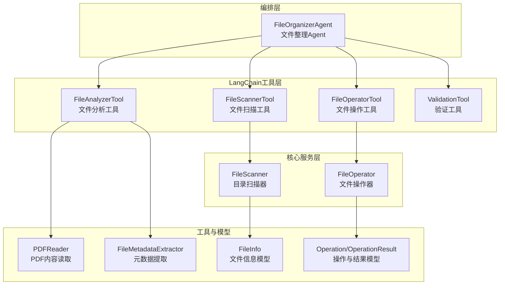
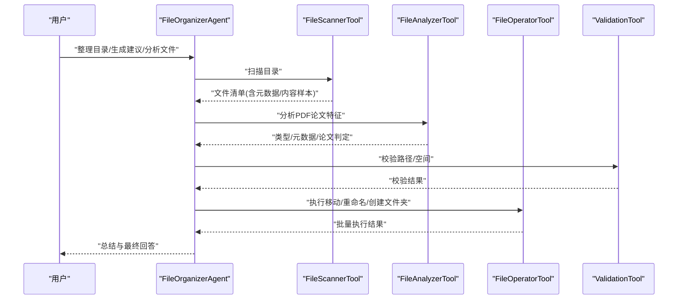
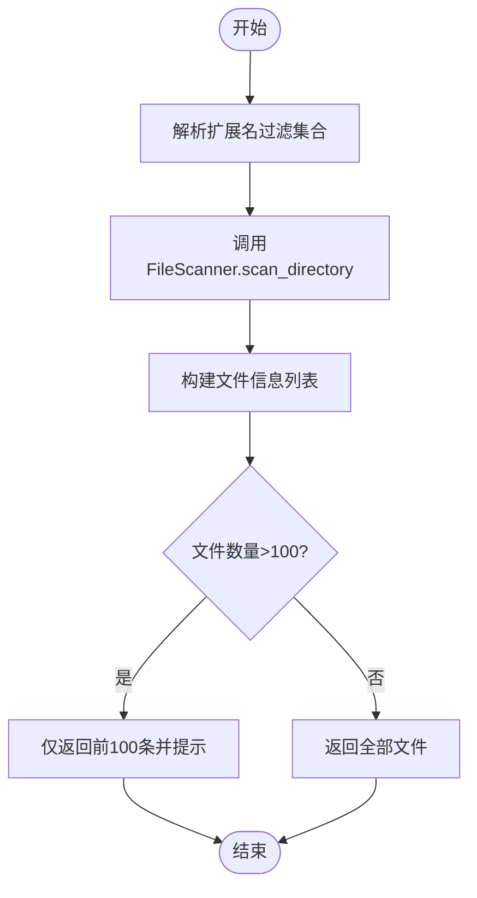
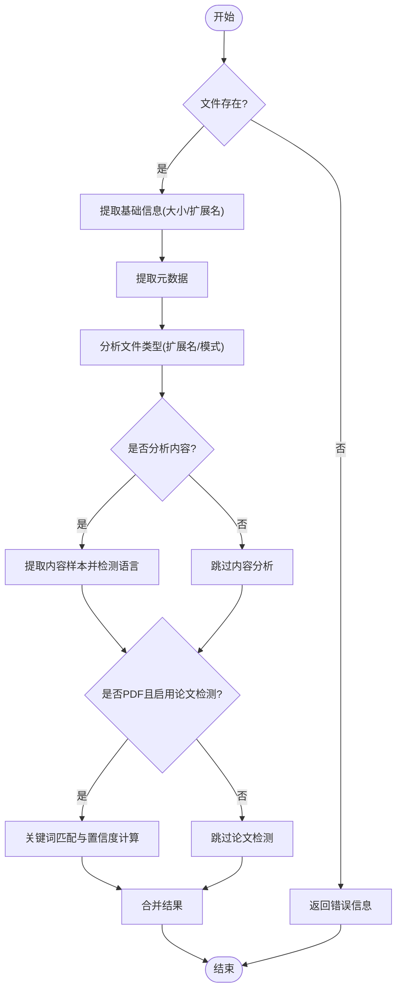
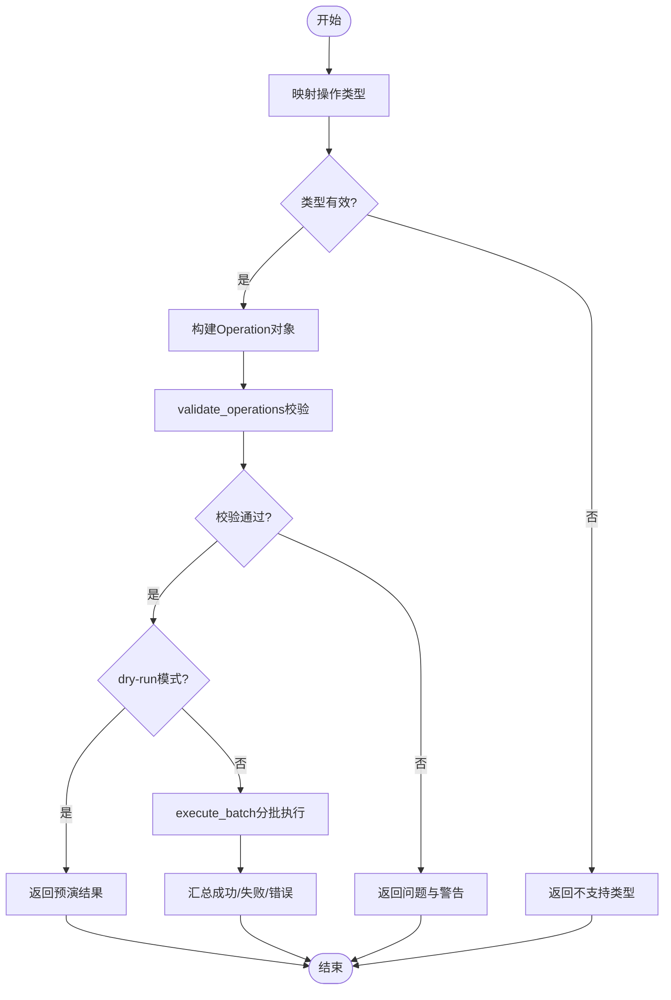
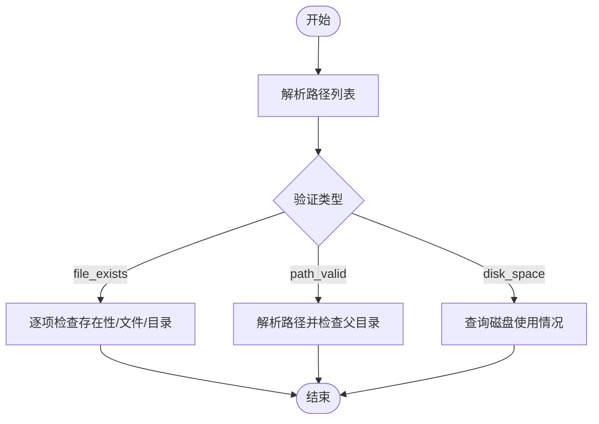
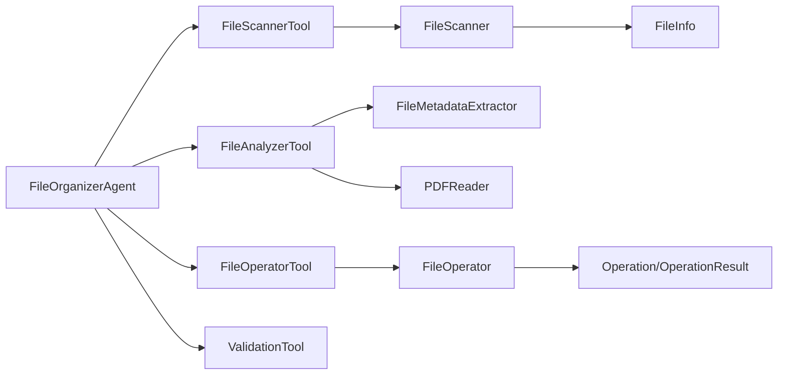

# 工具集集成系统

<cite>
**本文引用的文件**
- [src/langchain_integration/tools/file_analyzer_tool.py](file://src/langchain_integration/tools/file_analyzer_tool.py)
- [src/langchain_integration/tools/file_scanner_tool.py](file://src/langchain_integration/tools/file_scanner_tool.py)
- [src/langchain_integration/tools/file_operator_tool.py](file://src/langchain_integration/tools/file_operator_tool.py)
- [src/langchain_integration/tools/validation_tool.py](file://src/langchain_integration/tools/validation_tool.py)
- [src/langchain_integration/tools/__init__.py](file://src/langchain_integration/tools/__init__.py)
- [src/core/file_scanner.py](file://src/core/file_scanner.py)
- [src/core/file_operator.py](file://src/core/file_operator.py)
- [src/utils/pdf_reader.py](file://src/utils/pdf_reader.py)
- [src/utils/file_metadata.py](file://src/utils/file_metadata.py)
- [src/models/file_info.py](file://src/models/file_info.py)
- [src/models/operation.py](file://src/models/operation.py)
- [src/langchain_integration/agent.py](file://src/langchain_integration/agent.py)
- [examples/basic_usage.py](file://examples/basic_usage.py)
- [README.md](file://README.md)
</cite>

## 目录
1. [简介](#简介)
2. [项目结构](#项目结构)
3. [核心组件](#核心组件)
4. [架构总览](#架构总览)
5. [详细组件分析](#详细组件分析)
6. [依赖关系分析](#依赖关系分析)
7. [性能考虑](#性能考虑)
8. [故障排查指南](#故障排查指南)
9. [结论](#结论)
10. [附录](#附录)

## 简介
本文件为“工具集集成系统”的技术文档，聚焦于四种LangChain工具：文件扫描工具、文件分析工具、文件操作工具、验证工具。文档将从功能特性、实现原理、使用场景入手，深入说明各工具的能力边界与协作机制，涵盖工具注册与动态发现、错误处理、性能监控、以及自定义工具开发与工具组合的最佳实践。

## 项目结构
该系统围绕LangChain工具集展开，核心工具位于langchain_integration/tools目录，底层能力由core与utils模块提供，模型定义在models目录，Agent编排在langchain_integration/agent.py中统一调度。

图表来源
- [src/langchain_integration/tools/file_scanner_tool.py](file://src/langchain_integration/tools/file_scanner_tool.py#L31-L115)
- [src/langchain_integration/tools/file_analyzer_tool.py](file://src/langchain_integration/tools/file_analyzer_tool.py#L31-L221)
- [src/langchain_integration/tools/file_operator_tool.py](file://src/langchain_integration/tools/file_operator_tool.py#L32-L148)
- [src/langchain_integration/tools/validation_tool.py](file://src/langchain_integration/tools/validation_tool.py#L24-L171)
- [src/core/file_scanner.py](file://src/core/file_scanner.py#L13-L196)
- [src/core/file_operator.py](file://src/core/file_operator.py#L12-L246)
- [src/utils/pdf_reader.py](file://src/utils/pdf_reader.py#L10-L113)
- [src/utils/file_metadata.py](file://src/utils/file_metadata.py#L10-L82)
- [src/models/file_info.py](file://src/models/file_info.py#L9-L48)
- [src/models/operation.py](file://src/models/operation.py#L10-L54)
- [src/langchain_integration/agent.py](file://src/langchain_integration/agent.py#L21-L68)

章节来源
- [src/langchain_integration/tools/__init__.py](file://src/langchain_integration/tools/__init__.py#L1-L14)
- [src/langchain_integration/agent.py](file://src/langchain_integration/agent.py#L61-L68)

## 核心组件
- FileScannerTool：扫描目录并返回文件清单，支持扩展名过滤、元数据与内容样本提取，适合任务起始阶段获取文件概览。
- FileAnalyzerTool：对单个文件进行深度分析，包括类型识别、元数据提取、内容采样、中文/英文检测、PDF论文特征识别等，用于辅助分类与决策。
- FileOperatorTool：执行文件系统操作（移动、重命名、创建文件夹），内置预览与验证，支持dry-run模式，保障安全执行。
- ValidationTool：校验文件存在性、路径合法性、磁盘空间，作为前置条件检查，降低后续操作失败概率。

章节来源
- [src/langchain_integration/tools/file_scanner_tool.py](file://src/langchain_integration/tools/file_scanner_tool.py#L31-L115)
- [src/langchain_integration/tools/file_analyzer_tool.py](file://src/langchain_integration/tools/file_analyzer_tool.py#L31-L221)
- [src/langchain_integration/tools/file_operator_tool.py](file://src/langchain_integration/tools/file_operator_tool.py#L32-L148)
- [src/langchain_integration/tools/validation_tool.py](file://src/langchain_integration/tools/validation_tool.py#L24-L171)

## 架构总览
系统采用“工具即服务”的设计，Agent负责编排与决策，四大工具通过统一接口暴露能力。工具内部依赖core与utils模块提供的具体实现，模型层确保数据结构一致性。

图表来源
- [src/langchain_integration/agent.py](file://src/langchain_integration/agent.py#L100-L228)
- [src/langchain_integration/tools/file_scanner_tool.py](file://src/langchain_integration/tools/file_scanner_tool.py#L48-L110)
- [src/langchain_integration/tools/file_analyzer_tool.py](file://src/langchain_integration/tools/file_analyzer_tool.py#L49-L101)
- [src/langchain_integration/tools/file_operator_tool.py](file://src/langchain_integration/tools/file_operator_tool.py#L60-L143)
- [src/langchain_integration/tools/validation_tool.py](file://src/langchain_integration/tools/validation_tool.py#L41-L170)

## 详细组件分析

### FileScannerTool（文件扫描工具）
- 功能特性
  - 支持递归扫描与扩展名过滤
  - 返回文件基本信息、元数据、可选内容样本
  - 对超量文件进行截断提示，避免输出过大
- 实现要点
  - 基于FileScanner核心类并行处理文件，使用线程池提升吞吐
  - 内容采样受最大文件大小限制，避免内存压力
- 使用场景
  - 任务开始时获取文件全貌
  - 为后续分析与分类提供输入

图表来源
- [src/langchain_integration/tools/file_scanner_tool.py](file://src/langchain_integration/tools/file_scanner_tool.py#L48-L103)
- [src/core/file_scanner.py](file://src/core/file_scanner.py#L28-L84)

章节来源
- [src/langchain_integration/tools/file_scanner_tool.py](file://src/langchain_integration/tools/file_scanner_tool.py#L31-L115)
- [src/core/file_scanner.py](file://src/core/file_scanner.py#L13-L196)

### FileAnalyzerTool（文件分析工具）
- 功能特性
  - 文件类型识别（基于扩展名与内容模式）
  - 元数据提取（PDF标题、作者、页数；图片宽高、EXIF等）
  - 内容采样与语言检测（中文/英文）
  - PDF论文特征识别（摘要、引言、参考文献、关键词、DOI、期刊等）
- 实现要点
  - PDF内容提取优先使用pdfplumber，失败则回退至PyPDF2
  - 文件名模式分析用于辅助论文识别
  - 论文判定基于关键词匹配与指标计数，输出置信度
- 使用场景
  - 对扫描到的文件进行深度分析
  - 为分类决策提供依据

图表来源
- [src/langchain_integration/tools/file_analyzer_tool.py](file://src/langchain_integration/tools/file_analyzer_tool.py#L49-L101)
- [src/utils/pdf_reader.py](file://src/utils/pdf_reader.py#L13-L78)
- [src/utils/file_metadata.py](file://src/utils/file_metadata.py#L13-L81)

章节来源
- [src/langchain_integration/tools/file_analyzer_tool.py](file://src/langchain_integration/tools/file_analyzer_tool.py#L31-L221)
- [src/utils/pdf_reader.py](file://src/utils/pdf_reader.py#L10-L113)
- [src/utils/file_metadata.py](file://src/utils/file_metadata.py#L10-L82)

### FileOperatorTool（文件操作工具）
- 功能特性
  - 支持移动、重命名、创建文件夹
  - 操作预览与验证，自动规避目标冲突
  - dry-run模式用于安全预演
- 实现要点
  - 将字符串操作类型映射为OperationType枚举
  - 批量执行时分批处理，统计成功/失败/跳过数量
  - 冲突处理采用序号追加策略
- 使用场景
  - 根据分类结果移动文件
  - 创建分类文件夹结构
  - 重命名文件以规范化命名

图表来源
- [src/langchain_integration/tools/file_operator_tool.py](file://src/langchain_integration/tools/file_operator_tool.py#L60-L143)
- [src/core/file_operator.py](file://src/core/file_operator.py#L65-L100)
- [src/models/operation.py](file://src/models/operation.py#L18-L54)

章节来源
- [src/langchain_integration/tools/file_operator_tool.py](file://src/langchain_integration/tools/file_operator_tool.py#L32-L148)
- [src/core/file_operator.py](file://src/core/file_operator.py#L12-L246)
- [src/models/operation.py](file://src/models/operation.py#L10-L54)

### ValidationTool（验证工具）
- 功能特性
  - 文件存在性校验（支持多路径）
  - 路径有效性校验（解析、父目录存在性）
  - 磁盘空间校验（总/已用/剩余/占用率）
- 实现要点
  - 将输入路径字符串解析为列表逐项校验
  - 路径解析失败捕获异常并记录
  - 磁盘空间查询失败时返回错误信息
- 使用场景
  - 操作前的安全前置检查
  - 防止无效路径与空间不足导致的失败

图表来源
- [src/langchain_integration/tools/validation_tool.py](file://src/langchain_integration/tools/validation_tool.py#L41-L170)

章节来源
- [src/langchain_integration/tools/validation_tool.py](file://src/langchain_integration/tools/validation_tool.py#L24-L171)

### 工具注册与动态发现
- 工具导出
  - tools/__init__.py集中导出四大工具，便于外部按需引入
- Agent动态发现
  - FileOrganizerAgent通过_create_tools统一创建并维护工具列表
  - _find_tool按名称查找工具，缺失时抛出明确错误
- 最佳实践
  - 新增工具时在__all__中声明并在Agent中注册
  - 工具名称保持唯一，避免冲突

章节来源
- [src/langchain_integration/tools/__init__.py](file://src/langchain_integration/tools/__init__.py#L1-L14)
- [src/langchain_integration/agent.py](file://src/langchain_integration/agent.py#L61-L68)
- [src/langchain_integration/agent.py](file://src/langchain_integration/agent.py#L229-L245)

### 错误处理与健壮性
- 工具层
  - 所有工具的_run方法均包裹try-except，返回结构化错误信息
  - 对不可用的异步方法显式抛出NotImplementedError
- 核心服务层
  - FileScanner对单文件处理异常进行捕获并继续进度条更新
  - FileOperator对源文件不存在、目标冲突、磁盘空间不足等进行预检与警告
- 建议
  - 在Agent层对工具调用结果进行二次校验
  - 对大规模任务设置合理的超时与重试策略

章节来源
- [src/langchain_integration/tools/file_scanner_tool.py](file://src/langchain_integration/tools/file_scanner_tool.py#L105-L110)
- [src/langchain_integration/tools/file_analyzer_tool.py](file://src/langchain_integration/tools/file_analyzer_tool.py#L95-L100)
- [src/langchain_integration/tools/file_operator_tool.py](file://src/langchain_integration/tools/file_operator_tool.py#L136-L143)
- [src/langchain_integration/tools/validation_tool.py](file://src/langchain_integration/tools/validation_tool.py#L64-L68)
- [src/core/file_scanner.py](file://src/core/file_scanner.py#L78-L82)
- [src/core/file_operator.py](file://src/core/file_operator.py#L202-L245)

### 性能监控与优化
- 并发与吞吐
  - FileScanner使用线程池并发处理文件，结合tqdm显示进度
  - FileOperator分批执行，减少一次性锁竞争
- I/O与内存
  - PDF内容采样限制字符数，避免大文件内存压力
  - 文本文件多编码尝试，失败时返回提示而非崩溃
- 建议
  - 对超大目录开启递归深度限制
  - 结合Dry Run与预览，减少不必要的I/O
  - 对重复分析结果进行缓存（可选）

章节来源
- [src/core/file_scanner.py](file://src/core/file_scanner.py#L61-L84)
- [src/core/file_scanner.py](file://src/core/file_scanner.py#L154-L185)
- [src/core/file_operator.py](file://src/core/file_operator.py#L65-L100)

### 自定义工具开发与工具组合
- 自定义工具开发
  - 继承LangChain BaseTool，定义args_schema与_run方法
  - 输入参数使用Pydantic模型，保证类型安全
  - 在tools/__init__.py中导出并在Agent中注册
- 工具组合使用
  - 建议遵循“扫描-分析-验证-操作”的流水线顺序
  - 对复杂任务拆分为多个ReAct回合，逐步细化
  - 使用ValidationTool前置校验，FileOperatorTool后置确认

章节来源
- [src/langchain_integration/tools/file_scanner_tool.py](file://src/langchain_integration/tools/file_scanner_tool.py#L17-L47)
- [src/langchain_integration/tools/file_analyzer_tool.py](file://src/langchain_integration/tools/file_analyzer_tool.py#L18-L47)
- [src/langchain_integration/tools/file_operator_tool.py](file://src/langchain_integration/tools/file_operator_tool.py#L18-L53)
- [src/langchain_integration/tools/validation_tool.py](file://src/langchain_integration/tools/validation_tool.py#L15-L39)
- [src/langchain_integration/agent.py](file://src/langchain_integration/agent.py#L300-L430)

## 依赖关系分析

图表来源
- [src/langchain_integration/tools/file_scanner_tool.py](file://src/langchain_integration/tools/file_scanner_tool.py#L14-L14)
- [src/langchain_integration/tools/file_analyzer_tool.py](file://src/langchain_integration/tools/file_analyzer_tool.py#L14-L15)
- [src/langchain_integration/tools/file_operator_tool.py](file://src/langchain_integration/tools/file_operator_tool.py#L14-L15)
- [src/core/file_scanner.py](file://src/core/file_scanner.py#L9-L10)
- [src/core/file_operator.py](file://src/core/file_operator.py#L9-L9)
- [src/models/file_info.py](file://src/models/file_info.py#L9-L19)
- [src/models/operation.py](file://src/models/operation.py#L18-L42)
- [src/langchain_integration/agent.py](file://src/langchain_integration/agent.py#L12-L17)

章节来源
- [src/models/file_info.py](file://src/models/file_info.py#L9-L48)
- [src/models/operation.py](file://src/models/operation.py#L10-L54)

## 性能考虑
- 扫描阶段
  - 通过线程池并发处理文件，合理设置max_workers
  - 对超大文件与超深目录设置max_file_size与max_depth限制
- 分析阶段
  - PDF文本提取优先级策略与字符数限制，平衡准确度与性能
  - 元数据提取失败不影响整体流程，记录错误但继续
- 操作阶段
  - 分批执行与冲突处理，避免长时间持有锁
  - dry-run模式用于预演，减少真实I/O

[本节为通用指导，无需列出章节来源]

## 故障排查指南
- 工具导入与字段错误
  - 若出现“对象无此字段”类错误，检查是否在__init__中设置未声明的实例属性
  - 推荐将依赖对象在_run中局部创建，或使用object.__setattr__声明字段
- ReAct解析失败
  - 检查LLM输出是否严格遵循Thought/Action/Action Input/Final Answer格式
  - 对JSON解析失败进行容错，尝试替换引号等修复
- 工具调用异常
  - 工具层返回结构化错误，Agent层打印并继续迭代
  - 对找不到工具的情况，Agent会返回可用工具列表

章节来源
- [PYDANTIC_FIX_COMPLETE.md](file://PYDANTIC_FIX_COMPLETE.md#L1-L161)
- [src/langchain_integration/agent.py](file://src/langchain_integration/agent.py#L247-L298)
- [src/langchain_integration/agent.py](file://src/langchain_integration/agent.py#L386-L410)

## 结论
本工具集通过标准化的LangChain工具接口，将文件扫描、分析、验证与操作能力有机整合，配合Agent的ReAct编排，实现了从“感知-决策-执行-反馈”的闭环。其模块化设计与完善的错误处理、性能优化策略，使其既易于扩展又稳定可靠。建议在生产环境中结合Dry Run与日志审计，持续优化批处理与并发策略。

[本节为总结性内容，无需列出章节来源]

## 附录
- 使用示例参考
  - 基本使用与交互式示例可参考examples/basic_usage.py
  - 项目总体介绍与CLI使用说明参考README.md

章节来源
- [examples/basic_usage.py](file://examples/basic_usage.py#L1-L89)
- [README.md](file://README.md#L1-L290)