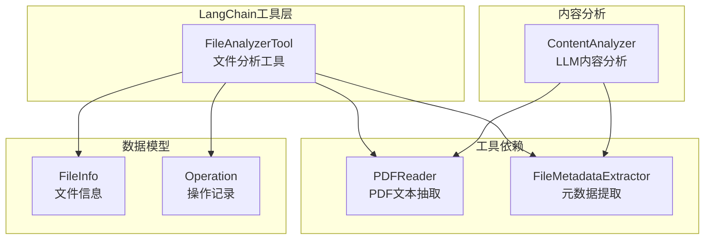
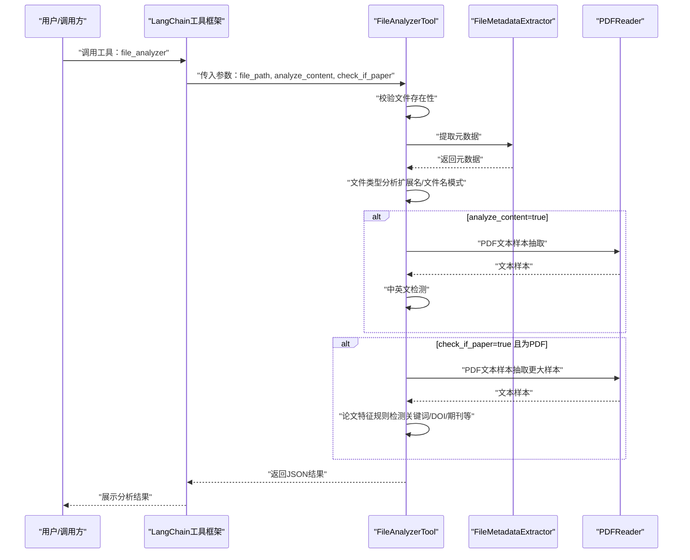
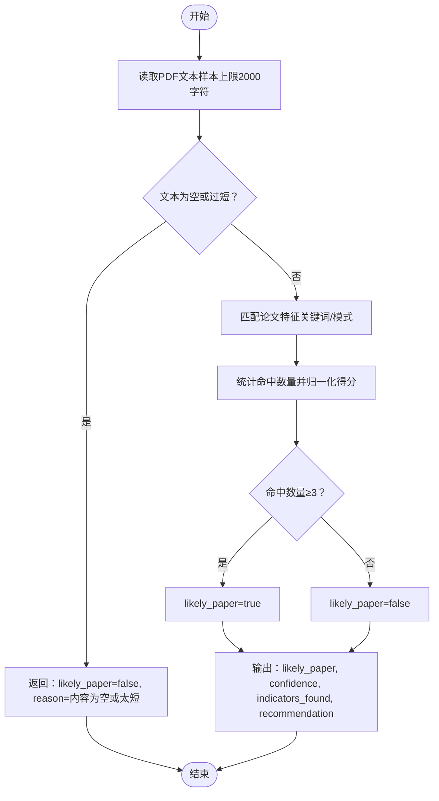
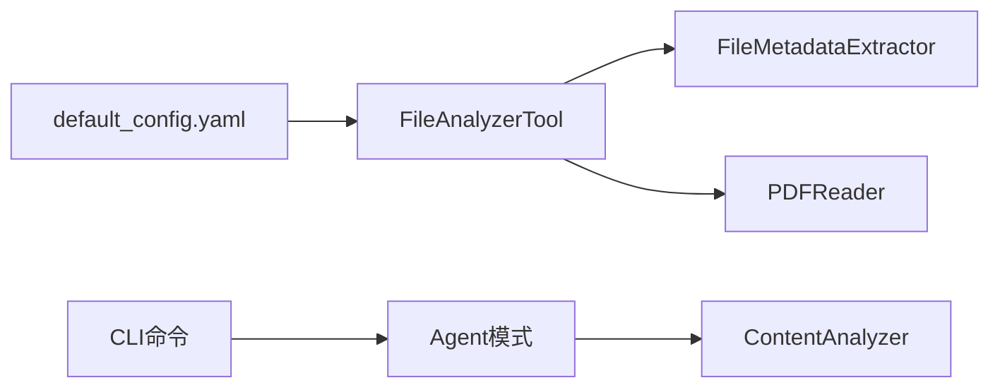

# 文件分析工具

<cite>
**本文引用的文件**
- [src/langchain_integration/tools/file_analyzer_tool.py](file://src/langchain_integration/tools/file_analyzer_tool.py)
- [src/utils/pdf_reader.py](file://src/utils/pdf_reader.py)
- [src/utils/file_metadata.py](file://src/utils/file_metadata.py)
- [src/models/file_info.py](file://src/models/file_info.py)
- [src/models/operation.py](file://src/models/operation.py)
- [src/langchain_integration/content_analyzer.py](file://src/langchain_integration/content_analyzer.py)
- [config/default_config.yaml](file://config/default_config.yaml)
- [docs/USAGE.md](file://docs/USAGE.md)
- [README.md](file://README.md)
- [examples/basic_usage.py](file://examples/basic_usage.py)
</cite>

## 目录
1. [简介](#简介)
2. [项目结构](#项目结构)
3. [核心组件](#核心组件)
4. [架构总览](#架构总览)
5. [详细组件分析](#详细组件分析)
6. [依赖关系分析](#依赖关系分析)
7. [性能考虑](#性能考虑)
8. [故障排查指南](#故障排查指南)
9. [结论](#结论)
10. [附录](#附录)

## 简介
本文档面向“文件分析工具”（FileAnalyzerTool）的技术文档，聚焦其在智能文件整理系统中的作用与实现细节。该工具通过LangChain工具接口对外提供统一的文件分析能力，支持：
- 文件类型识别（扩展名与文件名模式）
- 元数据提取（PDF标题/作者/页数、图片宽高/格式/EXIF等）
- 内容分析（PDF文本样本抽取、中英文检测）
- 论文特征检测（基于规则的关键词/DOI/期刊等识别）

同时，文档给出输入参数、输出JSON结构、PDF内容分析流程、文本样本提取与中英文检测算法、论文特征检测规则引擎实现，并补充错误处理机制、性能优化策略与使用示例。

## 项目结构
围绕文件分析工具的关键模块与文件如下：
- LangChain工具层：FileAnalyzerTool（工具定义与执行）
- 工具依赖：PDFReader（PDF文本抽取）、FileMetadataExtractor（元数据提取）
- 数据模型：FileInfo（文件信息）、Operation（操作记录）
- 内容分析器：ContentAnalyzer（LLM辅助的内容分析与论文识别）
- 配置：default_config.yaml（工具行为参数）
- 使用指南与示例：docs/USAGE.md、examples/basic_usage.py

图表来源
- [src/langchain_integration/tools/file_analyzer_tool.py](file://src/langchain_integration/tools/file_analyzer_tool.py#L31-L101)
- [src/utils/pdf_reader.py](file://src/utils/pdf_reader.py#L10-L25)
- [src/utils/file_metadata.py](file://src/utils/file_metadata.py#L10-L31)
- [src/models/file_info.py](file://src/models/file_info.py#L9-L48)
- [src/models/operation.py](file://src/models/operation.py#L18-L54)
- [src/langchain_integration/content_analyzer.py](file://src/langchain_integration/content_analyzer.py#L14-L72)

章节来源
- [src/langchain_integration/tools/file_analyzer_tool.py](file://src/langchain_integration/tools/file_analyzer_tool.py#L1-L221)
- [src/utils/pdf_reader.py](file://src/utils/pdf_reader.py#L1-L113)
- [src/utils/file_metadata.py](file://src/utils/file_metadata.py#L1-L82)
- [src/models/file_info.py](file://src/models/file_info.py#L1-L48)
- [src/models/operation.py](file://src/models/operation.py#L1-L54)
- [src/langchain_integration/content_analyzer.py](file://src/langchain_integration/content_analyzer.py#L1-L200)
- [config/default_config.yaml](file://config/default_config.yaml#L39-L45)
- [docs/USAGE.md](file://docs/USAGE.md#L57-L121)
- [README.md](file://README.md#L103-L119)

## 核心组件
- FileAnalyzerTool：LangChain工具入口，负责文件类型识别、元数据提取、内容分析、论文检测，并输出统一JSON结果。
- PDFReader：PDF文本样本抽取与文件名模式分析，提供降级回退机制。
- FileMetadataExtractor：提取PDF/图片元数据（标题、作者、页数、宽高、EXIF等）。
- FileInfo/Operation：文件信息与操作记录的数据模型，支撑后续分类与执行。
- ContentAnalyzer：基于LLM的内容分析器，提供论文识别与关键词提取等高级分析。

章节来源
- [src/langchain_integration/tools/file_analyzer_tool.py](file://src/langchain_integration/tools/file_analyzer_tool.py#L31-L101)
- [src/utils/pdf_reader.py](file://src/utils/pdf_reader.py#L10-L113)
- [src/utils/file_metadata.py](file://src/utils/file_metadata.py#L10-L82)
- [src/models/file_info.py](file://src/models/file_info.py#L9-L48)
- [src/models/operation.py](file://src/models/operation.py#L18-L54)
- [src/langchain_integration/content_analyzer.py](file://src/langchain_integration/content_analyzer.py#L14-L72)

## 架构总览
FileAnalyzerTool在LangChain工具体系中扮演“文件特征提取与初步判断”的角色，其典型调用链如下：

图表来源
- [src/langchain_integration/tools/file_analyzer_tool.py](file://src/langchain_integration/tools/file_analyzer_tool.py#L49-L101)
- [src/utils/pdf_reader.py](file://src/utils/pdf_reader.py#L14-L25)
- [src/utils/file_metadata.py](file://src/utils/file_metadata.py#L14-L31)

## 详细组件分析

### FileAnalyzerTool 输入参数与输出结构
- 输入参数
  - file_path：必填，待分析文件路径
  - analyze_content：可选，默认true，是否进行内容分析（文本样本、中英文检测）
  - check_if_paper：可选，默认true，针对PDF是否检查是否为学术论文
- 输出JSON字段
  - success：布尔，表示分析是否成功
  - error：字符串（可选），异常信息
  - file_path：原始文件路径
  - file_name：文件名
  - extension：扩展名（小写）
  - size_mb：文件大小（MB，保留两位小数）
  - metadata：元数据（见“元数据提取”）
  - file_type_analysis：文件类型分析（扩展名分类、PDF文件名模式）
  - content_analysis：内容分析（文本样本、中英文标记；仅当analyze_content=true）
  - paper_check：论文检测结果（仅当check_if_paper=true且为PDF）

章节来源
- [src/langchain_integration/tools/file_analyzer_tool.py](file://src/langchain_integration/tools/file_analyzer_tool.py#L18-L47)
- [src/langchain_integration/tools/file_analyzer_tool.py](file://src/langchain_integration/tools/file_analyzer_tool.py#L49-L101)

### 文件类型识别
- 基于扩展名的分类映射（document/spreadsheet/presentation/image/video/audio/archive/code/other）
- PDF文件名模式分析：数字、年份、中英文、关键词、长度等
- 逻辑要点
  - 若为PDF，额外计算filename_pattern
  - 其他类型按扩展名映射分类

章节来源
- [src/langchain_integration/tools/file_analyzer_tool.py](file://src/langchain_integration/tools/file_analyzer_tool.py#L102-L136)
- [src/utils/pdf_reader.py](file://src/utils/pdf_reader.py#L80-L92)

### 元数据提取
- MIME类型推断
- PDF：页数、标题、作者、主题、创建者、生产者
- 图片：宽、高、格式、模式、EXIF（过滤非标量值）
- 异常捕获：提取失败时记录错误信息

章节来源
- [src/utils/file_metadata.py](file://src/utils/file_metadata.py#L14-L31)
- [src/utils/file_metadata.py](file://src/utils/file_metadata.py#L34-L59)
- [src/utils/file_metadata.py](file://src/utils/file_metadata.py#L62-L81)

### 内容分析与文本样本提取
- PDF：优先使用pdfplumber抽取文本，其次回退PyPDF2；限制最大字符数与页数；清洗空白与控制字符
- 文本文件（.txt/.md）：UTF-8读取，截取前若干字符
- 中英文检测：基于Unicode范围判断中文字符与英文字母
- 结果包含：text_sample、has_chinese、has_english

章节来源
- [src/utils/pdf_reader.py](file://src/utils/pdf_reader.py#L14-L78)
- [src/langchain_integration/tools/file_analyzer_tool.py](file://src/langchain_integration/tools/file_analyzer_tool.py#L137-L160)
- [src/langchain_integration/tools/file_analyzer_tool.py](file://src/langchain_integration/tools/file_analyzer_tool.py#L162-L168)

### 论文特征检测（规则引擎）
- 规则触发条件：PDF文本样本长度≥100字符
- 特征关键词（中英文）：abstract/摘要、introduction/引言/前言、references/参考文献、conclusion/结论、keywords/关键词、doi/arxiv/journal/conference/proceedings/期刊
- 计分与判定：统计命中特征数量，归一化到0~1，至少3项判定为论文
- 输出字段：likely_paper、confidence、indicator_count、indicators_found、recommendation；异常时返回错误信息

图表来源
- [src/langchain_integration/tools/file_analyzer_tool.py](file://src/langchain_integration/tools/file_analyzer_tool.py#L170-L216)

章节来源
- [src/langchain_integration/tools/file_analyzer_tool.py](file://src/langchain_integration/tools/file_analyzer_tool.py#L170-L216)

### 与ContentAnalyzer的关系
- ContentAnalyzer提供基于LLM的深度内容分析与论文识别，适合更复杂的场景
- FileAnalyzerTool侧重轻量规则与快速判断，适合Agent工具链中的前置筛选与特征提取

章节来源
- [src/langchain_integration/content_analyzer.py](file://src/langchain_integration/content_analyzer.py#L14-L72)
- [src/langchain_integration/content_analyzer.py](file://src/langchain_integration/content_analyzer.py#L262-L297)

### 数据模型与操作记录
- FileInfo：封装文件路径、名称、扩展名、大小、时间戳、元数据、内容样本
- Operation：封装操作类型（移动/重命名/创建文件夹/删除）、源/目标、原因、置信度、时间戳

章节来源
- [src/models/file_info.py](file://src/models/file_info.py#L9-L48)
- [src/models/operation.py](file://src/models/operation.py#L18-L54)

## 依赖关系分析
- FileAnalyzerTool依赖
  - FileMetadataExtractor：提取元数据
  - PDFReader：抽取PDF文本样本、分析PDF文件名模式
- 工具与配置
  - default_config.yaml中对file_analyzer的content_analysis与max_content_size等参数有影响
- 工具与CLI/Agent
  - CLI命令支持“分析单个文件”，内部通过Agent模式调用ContentAnalyzer
  - examples/basic_usage.py演示了交互式与反馈优化流程

图表来源
- [src/langchain_integration/tools/file_analyzer_tool.py](file://src/langchain_integration/tools/file_analyzer_tool.py#L76-L80)
- [config/default_config.yaml](file://config/default_config.yaml#L39-L45)
- [src/langchain_integration/content_analyzer.py](file://src/langchain_integration/content_analyzer.py#L14-L27)
- [docs/USAGE.md](file://docs/USAGE.md#L103-L119)

章节来源
- [src/langchain_integration/tools/file_analyzer_tool.py](file://src/langchain_integration/tools/file_analyzer_tool.py#L1-L221)
- [config/default_config.yaml](file://config/default_config.yaml#L39-L45)
- [docs/USAGE.md](file://docs/USAGE.md#L103-L119)
- [examples/basic_usage.py](file://examples/basic_usage.py#L38-L62)

## 性能考虑
- PDF文本抽取
  - 优先使用pdfplumber，失败回退PyPDF2，限制最大页数与字符数，避免大文件阻塞
- 内容分析开关
  - analyze_content默认开启，但可通过配置关闭以减少IO与CPU开销
- 论文检测阈值
  - 仅在PDF且文本足够时进行，避免无效计算
- 批量与并发
  - 工具本身为单文件分析，结合上层扫描器与批量执行策略可实现高效处理

章节来源
- [src/utils/pdf_reader.py](file://src/utils/pdf_reader.py#L14-L25)
- [src/langchain_integration/tools/file_analyzer_tool.py](file://src/langchain_integration/tools/file_analyzer_tool.py#L86-L93)
- [config/default_config.yaml](file://config/default_config.yaml#L39-L45)

## 故障排查指南
- 文件不存在
  - 现象：返回success=false，error包含“文件不存在”
  - 排查：确认file_path是否存在、权限是否正确
- PDF文本抽取失败
  - 现象：content_analysis返回错误信息或空文本
  - 排查：检查PDF完整性、依赖库版本（pdfplumber/PyPDF2）
- 论文检测异常
  - 现象：paper_check返回error字段
  - 排查：确认PDF文本可读、样本长度充足
- 元数据提取异常
  - 现象：metadata包含extraction_error或error字段
  - 排查：检查文件类型与对应解析器可用性

章节来源
- [src/langchain_integration/tools/file_analyzer_tool.py](file://src/langchain_integration/tools/file_analyzer_tool.py#L56-L100)
- [src/utils/pdf_reader.py](file://src/utils/pdf_reader.py#L16-L24)
- [src/utils/file_metadata.py](file://src/utils/file_metadata.py#L28-L29)
- [src/utils/file_metadata.py](file://src/utils/file_metadata.py#L56-L57)
- [src/utils/file_metadata.py](file://src/utils/file_metadata.py#L78-L79)

## 结论
FileAnalyzerTool提供了稳定、可扩展的文件分析能力，结合规则与LLM两种路径，既能满足快速筛选与特征提取，又可与更高阶的内容分析器协同工作。通过合理的配置与错误处理，可在大规模文件场景中保持良好的性能与可靠性。

## 附录

### 使用示例
- CLI分析单个文件
  - 命令：smart-tidy analyze <file_path>
  - 行为：Agent模式调用ContentAnalyzer，展示文件信息与内容分析
- 交互式与反馈优化
  - 通过examples/basic_usage.py演示的交互流程，可对分类结果进行反馈优化

章节来源
- [docs/USAGE.md](file://docs/USAGE.md#L103-L119)
- [examples/basic_usage.py](file://examples/basic_usage.py#L38-L62)