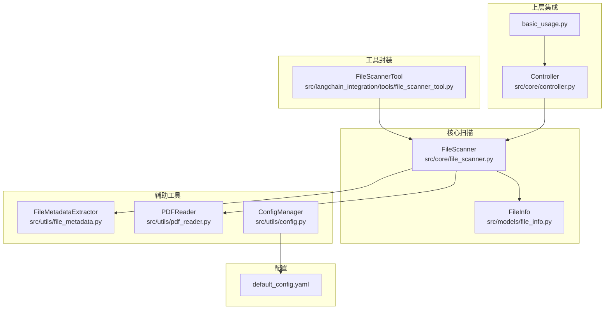
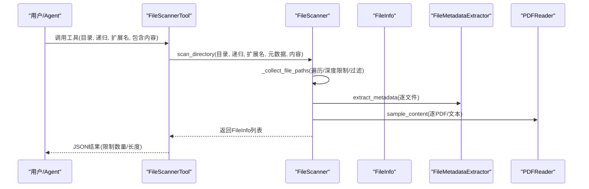
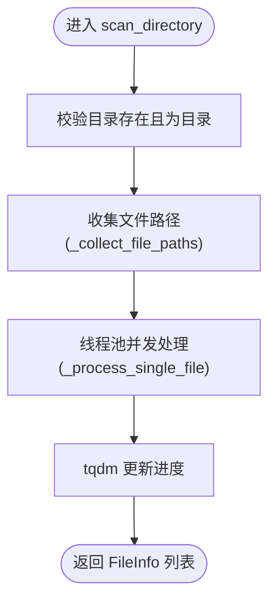
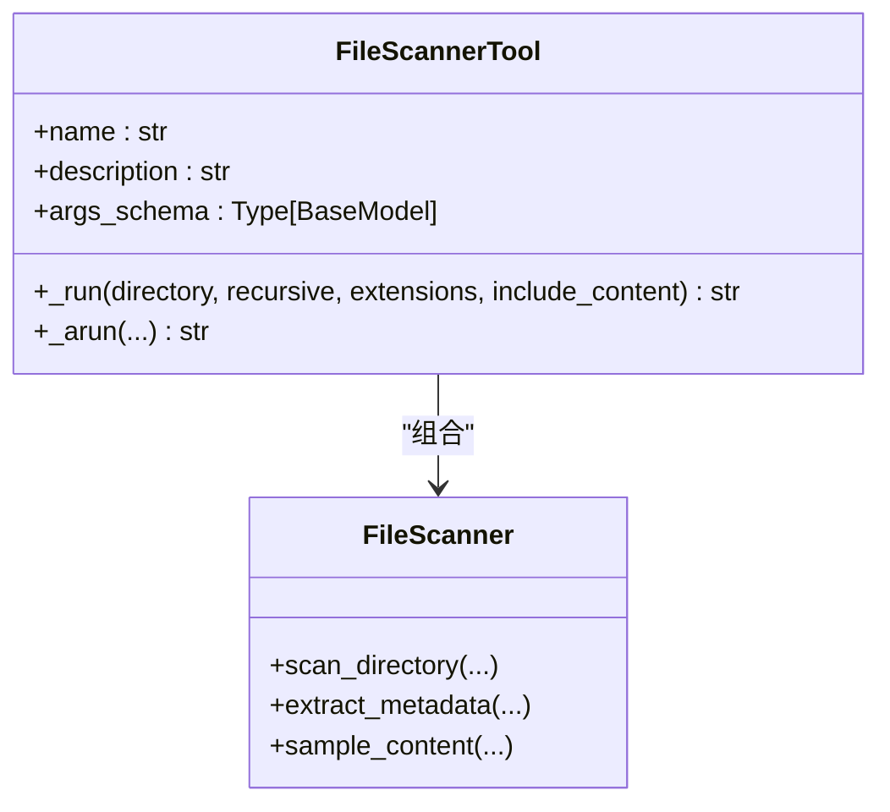
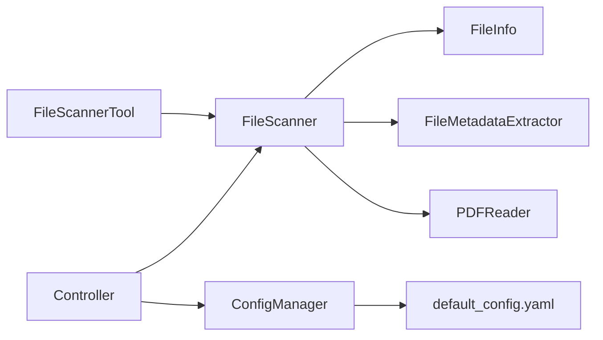

# 文件扫描工具

<cite>
**本文引用的文件**
- [src/core/file_scanner.py](file://src/core/file_scanner.py)
- [src/models/file_info.py](file://src/models/file_info.py)
- [src/langchain_integration/tools/file_scanner_tool.py](file://src/langchain_integration/tools/file_scanner_tool.py)
- [src/utils/file_metadata.py](file://src/utils/file_metadata.py)
- [src/utils/pdf_reader.py](file://src/utils/pdf_reader.py)
- [src/utils/config.py](file://src/utils/config.py)
- [config/default_config.yaml](file://config/default_config.yaml)
- [src/core/controller.py](file://src/core/controller.py)
- [tests/test_file_scanner.py](file://tests/test_file_scanner.py)
- [examples/basic_usage.py](file://examples/basic_usage.py)
- [README.md](file://README.md)
</cite>

## 目录
1. [简介](#简介)
2. [项目结构](#项目结构)
3. [核心组件](#核心组件)
4. [架构总览](#架构总览)
5. [详细组件分析](#详细组件分析)
6. [依赖关系分析](#依赖关系分析)
7. [性能考虑](#性能考虑)
8. [故障排查指南](#故障排查指南)
9. [结论](#结论)
10. [附录](#附录)

## 简介
本文件面向“文件扫描工具”的技术文档，重点围绕 FileScannerTool 的文件扫描机制展开，涵盖：
- 递归扫描、文件过滤、元数据收集
- 扫描范围配置、文件类型过滤规则、深度限制设置
- 扫描结果的数据结构（FileInfo 对象）、文件统计信息、扫描进度报告
- 性能优化技巧、大目录处理策略、内存管理方案
- 异常处理、断点续扫、并发控制等高级功能的实现细节

该工具既可独立使用，也可在 LangChain Agent 中作为工具被调用，统一服务于文件整理与分类流程。

## 项目结构
与文件扫描直接相关的模块分布如下：
- 核心扫描器：src/core/file_scanner.py
- 数据模型：src/models/file_info.py
- LangChain 工具封装：src/langchain_integration/tools/file_scanner_tool.py
- 元数据提取：src/utils/file_metadata.py
- PDF 内容读取：src/utils/pdf_reader.py
- 配置管理：src/utils/config.py、config/default_config.yaml
- 控制器集成：src/core/controller.py
- 示例与测试：examples/basic_usage.py、tests/test_file_scanner.py

图表来源
- [src/core/file_scanner.py](file://src/core/file_scanner.py#L1-L196)
- [src/models/file_info.py](file://src/models/file_info.py#L1-L48)
- [src/langchain_integration/tools/file_scanner_tool.py](file://src/langchain_integration/tools/file_scanner_tool.py#L1-L115)
- [src/utils/file_metadata.py](file://src/utils/file_metadata.py#L1-L82)
- [src/utils/pdf_reader.py](file://src/utils/pdf_reader.py#L1-L113)
- [src/utils/config.py](file://src/utils/config.py#L1-L116)
- [config/default_config.yaml](file://config/default_config.yaml#L1-L79)
- [src/core/controller.py](file://src/core/controller.py#L1-L310)
- [examples/basic_usage.py](file://examples/basic_usage.py#L1-L89)

章节来源
- [README.md](file://README.md#L220-L240)

## 核心组件
- FileScanner：负责目录扫描、文件过滤、元数据与内容样本提取、并发处理与进度展示。
- FileInfo：扫描结果的数据模型，包含路径、名称、扩展名、大小、时间戳、元数据、内容样本等字段。
- FileScannerTool：LangChain 工具封装，将 FileScanner 的能力暴露为工具接口，并进行结果简化与限制。
- FileMetadataExtractor：通用元数据提取器，支持 PDF、图片等类型。
- PDFReader：PDF 文本样本提取器，具备降级策略与文本清洗。
- ConfigManager 与 default_config.yaml：提供扫描深度、最大文件大小、工具限制等配置项。

章节来源
- [src/core/file_scanner.py](file://src/core/file_scanner.py#L13-L196)
- [src/models/file_info.py](file://src/models/file_info.py#L9-L48)
- [src/langchain_integration/tools/file_scanner_tool.py](file://src/langchain_integration/tools/file_scanner_tool.py#L31-L115)
- [src/utils/file_metadata.py](file://src/utils/file_metadata.py#L10-L82)
- [src/utils/pdf_reader.py](file://src/utils/pdf_reader.py#L10-L113)
- [src/utils/config.py](file://src/utils/config.py#L10-L116)
- [config/default_config.yaml](file://config/default_config.yaml#L48-L66)

## 架构总览
FileScannerTool 在 LangChain Agent 中作为工具被调用，内部委托 FileScanner 完成扫描；FileScanner 再通过 FileInfo 统一承载结果，并借助 FileMetadataExtractor 和 PDFReader 实现元数据与内容样本提取。配置通过 ConfigManager 与 default_config.yaml 提供，控制扫描深度、最大文件大小、工具限制等。

图表来源
- [src/langchain_integration/tools/file_scanner_tool.py](file://src/langchain_integration/tools/file_scanner_tool.py#L48-L103)
- [src/core/file_scanner.py](file://src/core/file_scanner.py#L28-L84)
- [src/utils/file_metadata.py](file://src/utils/file_metadata.py#L14-L31)
- [src/utils/pdf_reader.py](file://src/utils/pdf_reader.py#L14-L24)

## 详细组件分析

### FileScanner：文件扫描器
- 初始化参数
  - max_file_size_mb：超过该大小的文件不读取内容样本，默认来自配置。
  - max_depth：扫描最大深度，防止深层递归导致性能问题。
- 主要方法
  - scan_directory：入口方法，校验目录合法性，收集文件路径，使用线程池并发处理，带进度条。
  - _collect_file_paths：支持递归与非递归两种模式，结合深度限制与扩展名过滤。
  - _should_include_file：跳过隐藏文件，按扩展名集合过滤。
  - _process_single_file：构建 FileInfo，按需提取元数据与内容样本。
  - extract_metadata：委托 FileMetadataExtractor。
  - sample_content：根据扩展名选择 PDFReader 或文本读取，限制字符数。
  - _read_text_file：多编码尝试读取文本文件。
  - group_by_extension：按扩展名分组，便于后续分类。
- 并发与进度
  - 使用 ThreadPoolExecutor(max_workers=4) 并行处理文件。
  - 使用 tqdm 显示进度条，每个任务完成后更新一次。
- 错误处理
  - 单文件处理异常被捕获并打印，不影响整体扫描流程。
  - 目录不存在或非目录抛出明确异常。

图表来源
- [src/core/file_scanner.py](file://src/core/file_scanner.py#L28-L84)
- [src/core/file_scanner.py](file://src/core/file_scanner.py#L86-L123)

章节来源
- [src/core/file_scanner.py](file://src/core/file_scanner.py#L13-L196)

### FileInfo：扫描结果数据模型
- 字段
  - path、name、extension、size、created_time、modified_time、metadata、content_sample
- 方法
  - size_human：人类可读的文件大小格式化。
  - from_path：从文件路径创建 FileInfo，读取 stat 信息。
  - __str__：字符串表示，便于调试与日志。
- 用途
  - 统一承载扫描结果，便于序列化、传输与后续处理。

章节来源
- [src/models/file_info.py](file://src/models/file_info.py#L9-L48)

### FileMetadataExtractor：元数据提取器
- 支持类型
  - PDF：页数、标题、作者、主题、创建者、生产者等。
  - 图片：宽高、格式、色彩模式、EXIF（部分机型可用）。
- 错误处理
  - 异常会被捕获并记录在 metadata 中，保证扫描不中断。

章节来源
- [src/utils/file_metadata.py](file://src/utils/file_metadata.py#L10-L82)

### PDFReader：PDF 内容读取器
- 提供 PDF 文本样本提取，优先使用 pdfplumber，失败时降级到 PyPDF2。
- 文本清洗：去除多余空白与控制字符，保留可读文本。
- 文件名模式分析：识别数字、年份、中英文、关键词等特征，辅助分类。

章节来源
- [src/utils/pdf_reader.py](file://src/utils/pdf_reader.py#L10-L113)

### FileScannerTool：LangChain 工具封装
- 输入参数
  - directory、recursive、extensions（逗号分隔）、include_content。
- 行为
  - 创建 FileScanner，解析扩展名集合，调用 scan_directory，转换为简化字典，限制返回数量与内容长度，JSON 序列化输出。
- 错误处理
  - 捕获异常并返回包含错误信息的 JSON。

图表来源
- [src/langchain_integration/tools/file_scanner_tool.py](file://src/langchain_integration/tools/file_scanner_tool.py#L31-L115)
- [src/core/file_scanner.py](file://src/core/file_scanner.py#L13-L196)

章节来源
- [src/langchain_integration/tools/file_scanner_tool.py](file://src/langchain_integration/tools/file_scanner_tool.py#L17-L115)

### 配置与集成
- default_config.yaml
  - file_operations.max_file_size_mb：控制内容样本读取阈值。
  - file_operations.scan_max_depth：控制扫描深度。
  - langchain.tools.file_scanner.max_files：LangChain 工具返回数量限制。
- ConfigManager
  - 提供键路径访问、环境变量覆盖、配置保存等能力。
- Controller
  - 在初始化时注入扫描器参数，统一协调扫描、分类与执行流程。

章节来源
- [config/default_config.yaml](file://config/default_config.yaml#L48-L66)
- [src/utils/config.py](file://src/utils/config.py#L10-L116)
- [src/core/controller.py](file://src/core/controller.py#L67-L70)

## 依赖关系分析
- FileScanner 依赖 FileInfo、FileMetadataExtractor、PDFReader。
- FileScannerTool 依赖 FileScanner。
- Controller 依赖 FileScanner，并将其参数来源于 ConfigManager 与 default_config.yaml。
- 测试与示例分别验证扫描行为与集成使用。

图表来源
- [src/core/file_scanner.py](file://src/core/file_scanner.py#L9-L10)
- [src/langchain_integration/tools/file_scanner_tool.py](file://src/langchain_integration/tools/file_scanner_tool.py#L14)
- [src/core/controller.py](file://src/core/controller.py#L67-L70)
- [src/utils/config.py](file://src/utils/config.py#L13-L18)

章节来源
- [src/core/file_scanner.py](file://src/core/file_scanner.py#L1-L196)
- [src/langchain_integration/tools/file_scanner_tool.py](file://src/langchain_integration/tools/file_scanner_tool.py#L1-L115)
- [src/core/controller.py](file://src/core/controller.py#L1-L310)
- [src/utils/config.py](file://src/utils/config.py#L1-L116)

## 性能考虑
- 并发控制
  - 使用固定线程池（默认 4 个线程）并行处理文件，平衡 CPU 与 I/O 吞吐。
  - 建议根据机器核数与磁盘性能调整线程数；可通过扩展参数传入（当前实现为硬编码）。
- 深度限制
  - 通过 max_depth 防止深层递归带来的指数级遍历，降低内存与时间开销。
- 文件大小限制
  - 通过 max_file_size_mb 控制内容样本读取，避免大文件占用过多内存。
- 进度可视化
  - 使用 tqdm 展示扫描进度，便于长任务监控。
- 多编码读取
  - 文本文件尝试多种编码，减少因编码问题导致的失败重试。
- PDF 降级策略
  - 优先使用 pdfplumber，失败时降级到 PyPDF2，提升稳定性与速度。
- 结果限制
  - LangChain 工具返回前 100 条记录并限制内容长度，避免 LLM 上下文溢出。

章节来源
- [src/core/file_scanner.py](file://src/core/file_scanner.py#L61-L83)
- [src/core/file_scanner.py](file://src/core/file_scanner.py#L95-L109)
- [src/core/file_scanner.py](file://src/core/file_scanner.py#L141-L142)
- [src/utils/pdf_reader.py](file://src/utils/pdf_reader.py#L14-L24)
- [src/langchain_integration/tools/file_scanner_tool.py](file://src/langchain_integration/tools/file_scanner_tool.py#L97-L101)

## 故障排查指南
- 目录不存在或非目录
  - 现象：抛出 FileNotFoundError 或 NotADirectoryError。
  - 排查：确认路径存在且为目录。
- PDF 元数据/文本提取失败
  - 现象：metadata 中出现错误字段，或内容样本为错误提示。
  - 排查：检查 PDF 是否损坏；确认已安装 pdfplumber 与 PyPDF2。
- 文本文件编码问题
  - 现象：读取到“二进制文件或编码不支持”提示。
  - 排查：确认文件编码；必要时手动指定编码。
- LangChain 工具返回为空或报错
  - 现象：返回 JSON 中 success=false 或 note 提示。
  - 排查：检查目录权限、扩展名过滤条件、max_files 限制。
- 大目录扫描缓慢
  - 现象：扫描耗时较长。
  - 排查：适当提高 max_depth 与 max_file_size_mb 的阈值；减少 include_content 的使用；调整线程数。

章节来源
- [src/core/file_scanner.py](file://src/core/file_scanner.py#L50-L54)
- [src/utils/file_metadata.py](file://src/utils/file_metadata.py#L28-L29)
- [src/utils/pdf_reader.py](file://src/utils/pdf_reader.py#L23-L24)
- [src/langchain_integration/tools/file_scanner_tool.py](file://src/langchain_integration/tools/file_scanner_tool.py#L105-L110)

## 结论
FileScannerTool 通过 FileScanner 提供了稳定、高效的文件扫描能力，结合 FileInfo 统一数据结构、FileMetadataExtractor 与 PDFReader 提升元数据与内容样本质量，并在 LangChain 工具层实现了易用的接口与结果限制。配合配置系统，可在不同场景下灵活调整扫描深度、文件大小阈值与返回数量，满足从个人整理到企业级批量扫描的需求。

## 附录

### 扫描范围与过滤规则
- 扫描范围
  - 递归开关：recursive 控制是否遍历子目录。
  - 深度限制：max_depth 限制遍历层级。
- 文件过滤
  - 扩展名过滤：extensions 集合匹配文件后缀。
  - 隐藏文件过滤：自动跳过以点开头的隐藏文件。
- 内容样本
  - include_content 控制是否读取内容样本；受 max_file_size_mb 限制。

章节来源
- [src/core/file_scanner.py](file://src/core/file_scanner.py#L28-L57)
- [src/core/file_scanner.py](file://src/core/file_scanner.py#L86-L123)
- [config/default_config.yaml](file://config/default_config.yaml#L48-L51)

### 扫描结果数据结构
- FileInfo 字段
  - path、name、extension、size、created_time、modified_time、metadata、content_sample
- 统计与分组
  - group_by_extension 按扩展名分组，便于后续分类与展示。
- LangChain 工具输出
  - 简化字典包含 path、name、extension、size、size_mb、modified_time、metadata、content_sample（截断）。
  - 返回数量限制为前 100 个，避免 LLM 上下文溢出。

章节来源
- [src/models/file_info.py](file://src/models/file_info.py#L9-L48)
- [src/core/file_scanner.py](file://src/core/file_scanner.py#L187-L195)
- [src/langchain_integration/tools/file_scanner_tool.py](file://src/langchain_integration/tools/file_scanner_tool.py#L74-L98)

### 高级功能实现细节
- 并发控制
  - ThreadPoolExecutor 固定线程池，as_completed 顺序更新进度。
- 异常处理
  - 单文件异常捕获并打印，不影响整体扫描；目录非法抛出明确异常。
- 断点续扫
  - 当前实现未提供断点续扫功能；可基于文件路径集合增量扫描或外部持久化进度表实现。
- 配置驱动
  - 通过 default_config.yaml 与 ConfigManager 注入扫描参数，便于部署与运维。

章节来源
- [src/core/file_scanner.py](file://src/core/file_scanner.py#L61-L83)
- [src/core/file_scanner.py](file://src/core/file_scanner.py#L74-L80)
- [src/utils/config.py](file://src/utils/config.py#L43-L56)

### 使用示例与测试要点
- 基本使用
  - 通过 Controller.scan_directory 调用 FileScanner，适合传统模式。
- LangChain 工具
  - 通过 FileScannerTool 扫描目录，适合 Agent 模式。
- 测试覆盖
  - 覆盖扩展名过滤、递归扫描、元数据提取、分组等关键路径。

章节来源
- [examples/basic_usage.py](file://examples/basic_usage.py#L7-L35)
- [tests/test_file_scanner.py](file://tests/test_file_scanner.py#L8-L67)
- [src/langchain_integration/tools/file_scanner_tool.py](file://src/langchain_integration/tools/file_scanner_tool.py#L48-L103)