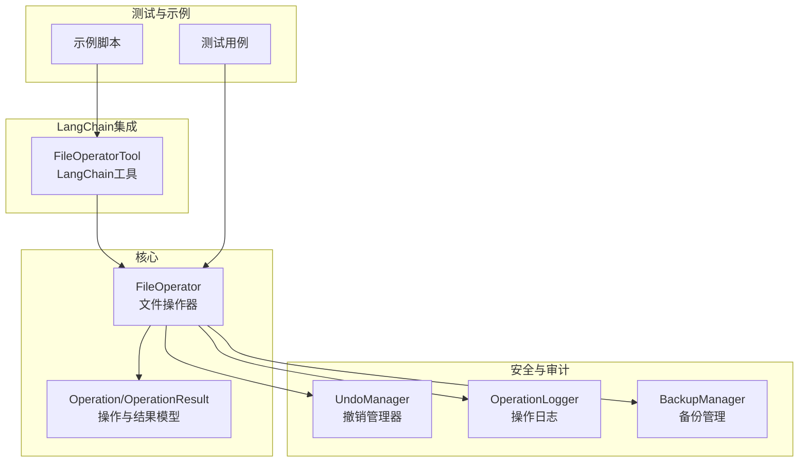
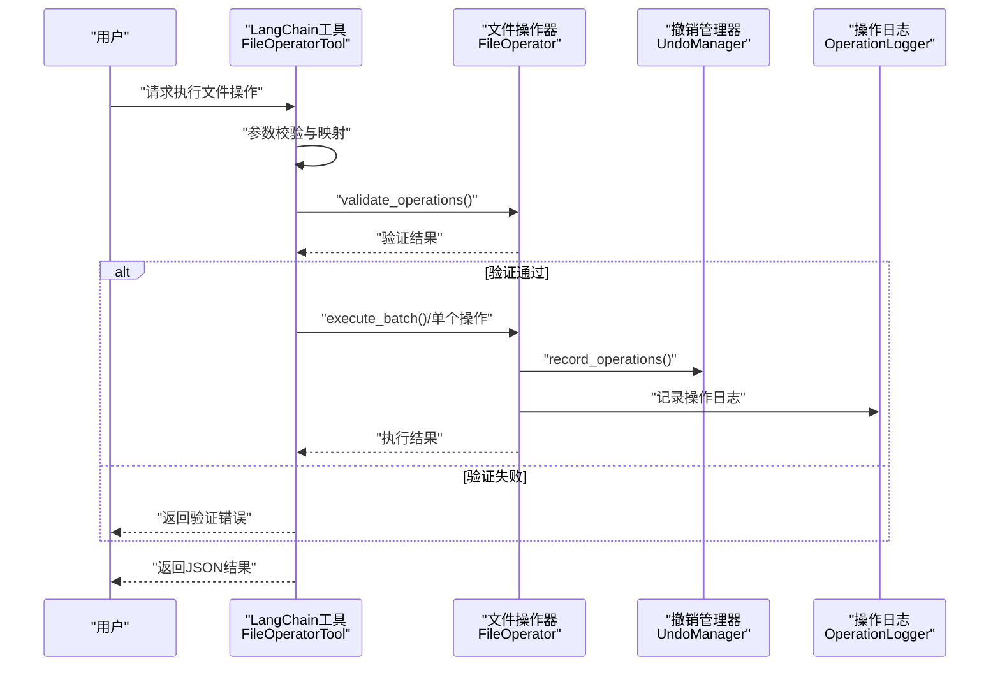
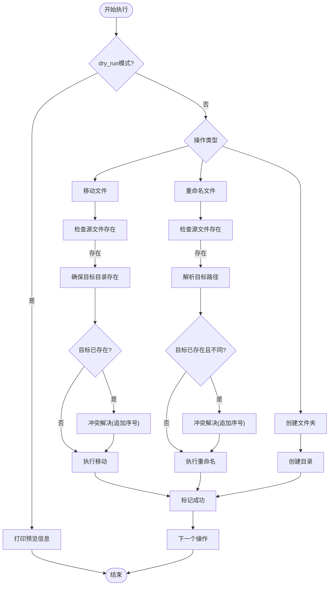
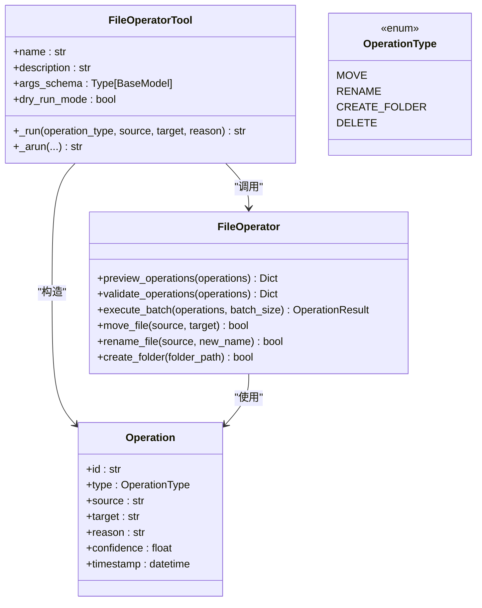
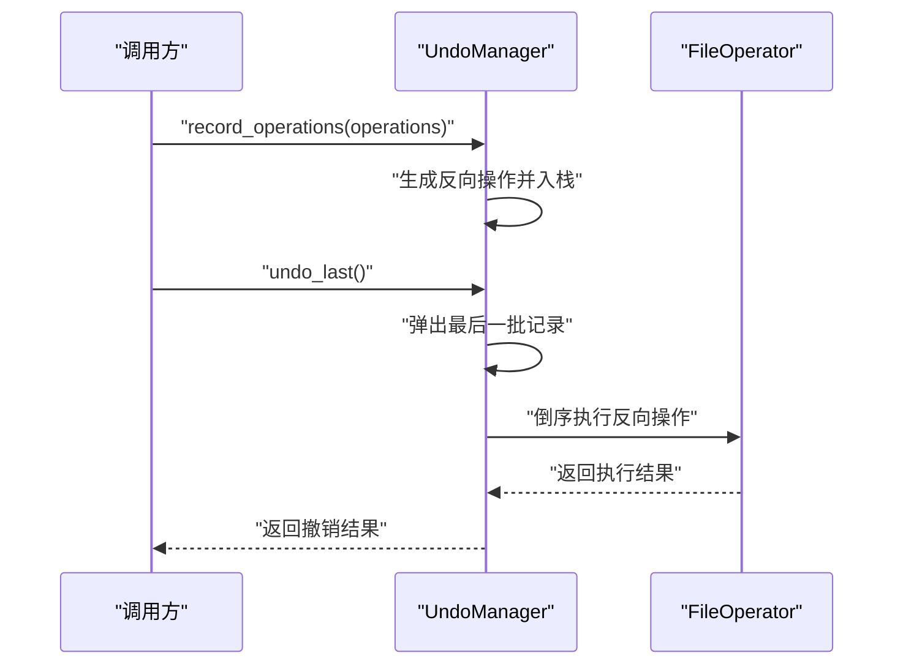
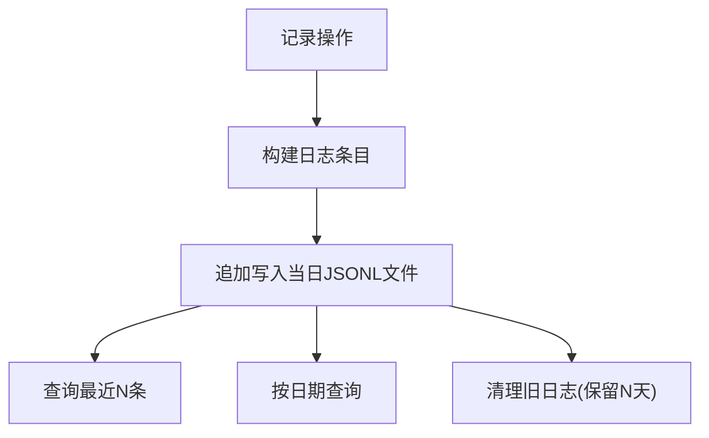
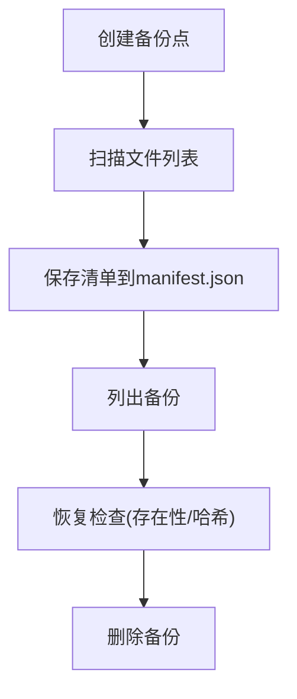
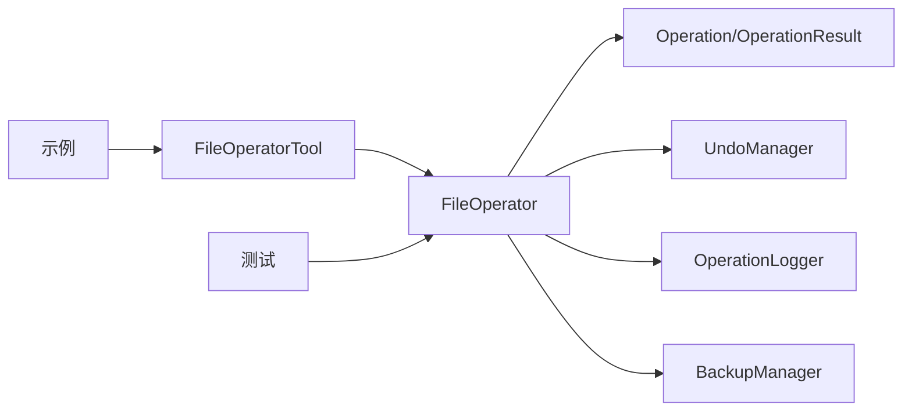

# 文件操作工具

<cite>
**本文引用的文件**
- [src/core/file_operator.py](file://src/core/file_operator.py)
- [src/langchain_integration/tools/file_operator_tool.py](file://src/langchain_integration/tools/file_operator_tool.py)
- [src/models/operation.py](file://src/models/operation.py)
- [src/safety/undo_manager.py](file://src/safety/undo_manager.py)
- [src/safety/operation_log.py](file://src/safety/operation_log.py)
- [src/safety/backup.py](file://src/safety/backup.py)
- [tests/test_file_operator.py](file://tests/test_file_operator.py)
- [examples/basic_usage.py](file://examples/basic_usage.py)
- [README.md](file://README.md)
</cite>

## 目录
1. [简介](#简介)
2. [项目结构](#项目结构)
3. [核心组件](#核心组件)
4. [架构概览](#架构概览)
5. [详细组件分析](#详细组件分析)
6. [依赖关系分析](#依赖关系分析)
7. [性能考量](#性能考量)
8. [故障排查指南](#故障排查指南)
9. [结论](#结论)
10. [附录](#附录)

## 简介
本文件操作工具围绕 FileOperator 与 FileOperatorTool 展开，提供移动、重命名、创建文件夹等文件系统操作能力，并通过预览、验证、冲突处理、批量执行、日志审计、备份与撤销等机制确保操作的安全性与可靠性。本文档面向开发者与高级用户，既提供高层架构说明，也包含代码级细节与可视化图示。

## 项目结构
与文件操作工具直接相关的模块分布如下：
- 核心操作器：src/core/file_operator.py
- LangChain 工具封装：src/langchain_integration/tools/file_operator_tool.py
- 数据模型：src/models/operation.py
- 安全与审计：src/safety/undo_manager.py、src/safety/operation_log.py、src/safety/backup.py
- 测试与示例：tests/test_file_operator.py、examples/basic_usage.py
- 项目说明：README.md

图表来源
- [src/core/file_operator.py](file://src/core/file_operator.py#L12-L246)
- [src/langchain_integration/tools/file_operator_tool.py](file://src/langchain_integration/tools/file_operator_tool.py#L32-L148)
- [src/models/operation.py](file://src/models/operation.py#L10-L54)
- [src/safety/undo_manager.py](file://src/safety/undo_manager.py#L10-L155)
- [src/safety/operation_log.py](file://src/safety/operation_log.py#L11-L133)
- [src/safety/backup.py](file://src/safety/backup.py#L10-L152)
- [tests/test_file_operator.py](file://tests/test_file_operator.py#L1-L156)
- [examples/basic_usage.py](file://examples/basic_usage.py#L1-L89)

章节来源
- [src/core/file_operator.py](file://src/core/file_operator.py#L1-L246)
- [src/langchain_integration/tools/file_operator_tool.py](file://src/langchain_integration/tools/file_operator_tool.py#L1-L148)
- [src/models/operation.py](file://src/models/operation.py#L1-L54)
- [src/safety/undo_manager.py](file://src/safety/undo_manager.py#L1-L155)
- [src/safety/operation_log.py](file://src/safety/operation_log.py#L1-L133)
- [src/safety/backup.py](file://src/safety/backup.py#L1-L152)
- [tests/test_file_operator.py](file://tests/test_file_operator.py#L1-L156)
- [examples/basic_usage.py](file://examples/basic_usage.py#L1-L89)
- [README.md](file://README.md#L1-L290)

## 核心组件
- FileOperator：提供文件移动、重命名、创建文件夹等操作，内置预览、验证、冲突处理与批量执行能力。
- FileOperatorTool：LangChain 工具封装，负责参数校验、调用 FileOperator 并返回结构化结果。
- Operation/OperationResult：统一的操作数据模型与批量结果统计。
- UndoManager：记录操作并支持撤销，维护反向操作序列。
- OperationLogger：以 JSONL 格式记录操作日志，支持查询与清理。
- BackupManager：创建备份点并记录文件清单，便于审计与恢复检查。

章节来源
- [src/core/file_operator.py](file://src/core/file_operator.py#L12-L246)
- [src/langchain_integration/tools/file_operator_tool.py](file://src/langchain_integration/tools/file_operator_tool.py#L32-L148)
- [src/models/operation.py](file://src/models/operation.py#L10-L54)
- [src/safety/undo_manager.py](file://src/safety/undo_manager.py#L10-L155)
- [src/safety/operation_log.py](file://src/safety/operation_log.py#L11-L133)
- [src/safety/backup.py](file://src/safety/backup.py#L10-L152)

## 架构概览
FileOperatorTool 作为 LangChain 工具入口，接收用户输入后映射为 Operation 类型，委托 FileOperator 执行。FileOperator 在执行前进行预览与验证，必要时进行冲突处理与磁盘空间检查，最终通过 UndoManager 记录反向操作，同时由 OperationLogger 记录审计日志。

图表来源
- [src/langchain_integration/tools/file_operator_tool.py](file://src/langchain_integration/tools/file_operator_tool.py#L60-L144)
- [src/core/file_operator.py](file://src/core/file_operator.py#L24-L101)
- [src/safety/undo_manager.py](file://src/safety/undo_manager.py#L23-L49)
- [src/safety/operation_log.py](file://src/safety/operation_log.py#L24-L53)

## 详细组件分析

### FileOperator：文件操作器
- 能力范围
  - 移动文件：自动创建目标目录、处理同名冲突、调用底层移动接口。
  - 重命名：支持绝对路径或相对路径的新名称，自动处理冲突。
  - 创建文件夹：递归创建目录。
  - 预览与验证：统计操作类型、检查源文件存在性、目标存在性与目录创建提示、磁盘空间检查。
  - 批量执行：分批处理，统计成功/失败/跳过数量，记录耗时。
  - 预览模式：dry_run 模式仅打印将要执行的操作，不实际写入。
- 冲突解决策略
  - 同名冲突时，自动在文件名后追加序号（如 _1/_2），直到找到可用名称。
- 安全检查
  - 源文件存在性检查。
  - 目标路径合法性检查（尝试解析）。
  - 磁盘空间检查（基于源文件大小与目标目录剩余空间）。
- 批量执行与原子性
  - 采用分批执行，每批独立处理异常，不提供跨批事务回滚；单批内逐条执行，异常不影响后续操作继续。
- 操作队列管理
  - 通过传入的 Operation 列表顺序执行，无额外队列管理；可通过 batch_size 控制并发粒度。

图表来源
- [src/core/file_operator.py](file://src/core/file_operator.py#L102-L246)

章节来源
- [src/core/file_operator.py](file://src/core/file_operator.py#L12-L246)

### FileOperatorTool：LangChain 工具封装
- 输入参数
  - operation_type：支持 move、rename、create_folder。
  - source：源路径（创建文件夹时可为空）。
  - target：目标路径。
  - reason：操作原因说明。
- 行为流程
  - 参数映射为 Operation 类型。
  - 调用 FileOperator.validate_operations 进行验证。
  - 若 dry_run 模式，返回预览结果；否则执行并汇总结果。
  - 异常捕获并以 JSON 形式返回错误信息。
- 与核心模块的关系
  - 依赖 FileOperator 执行具体操作。
  - 依赖 Operation/OperationType 定义操作类型。

图表来源
- [src/langchain_integration/tools/file_operator_tool.py](file://src/langchain_integration/tools/file_operator_tool.py#L18-L148)
- [src/core/file_operator.py](file://src/core/file_operator.py#L12-L246)
- [src/models/operation.py](file://src/models/operation.py#L10-L54)

章节来源
- [src/langchain_integration/tools/file_operator_tool.py](file://src/langchain_integration/tools/file_operator_tool.py#L1-L148)
- [src/models/operation.py](file://src/models/operation.py#L1-L54)

### 撤销管理器（UndoManager）
- 记录机制
  - 对每次批量操作记录反向操作（移动→移回、重命名→改回、创建文件夹→删除空目录）。
  - 限制最大历史记录数量，避免内存膨胀。
- 撤销流程
  - 倒序执行反向操作，统计成功/失败数量。
  - 对不存在的源文件抛出异常并记录失败。
- 使用建议
  - 在执行批量操作后及时调用记录方法，以便后续撤销。

图表来源
- [src/safety/undo_manager.py](file://src/safety/undo_manager.py#L23-L155)

章节来源
- [src/safety/undo_manager.py](file://src/safety/undo_manager.py#L1-L155)

### 操作日志（OperationLogger）
- 记录内容
  - 时间戳、操作ID、类型、源/目标路径、原因、状态（pending/success/failed/reverted）、错误信息。
- 查询与清理
  - 支持获取最近操作、按日期查询、清理超过保留期的日志文件。
- 存储格式
  - JSONL（每行一个JSON对象），按日期分文件存储。

图表来源
- [src/safety/operation_log.py](file://src/safety/operation_log.py#L24-L133)

章节来源
- [src/safety/operation_log.py](file://src/safety/operation_log.py#L1-L133)

### 备份管理（BackupManager）
- 备份点创建
  - 以时间戳命名备份目录，保存文件清单（路径、哈希、大小、修改时间、存在性）。
- 恢复检查
  - 读取清单，检查文件是否存在、哈希是否变化，输出状态提示。
- 备份列表与清理
  - 列出备份、删除指定备份。

图表来源
- [src/safety/backup.py](file://src/safety/backup.py#L23-L152)

章节来源
- [src/safety/backup.py](file://src/safety/backup.py#L1-L152)

### 测试与示例
- 测试覆盖
  - 文件移动、重命名、创建文件夹、冲突处理、批量执行、预览模式、操作验证等。
- 示例脚本
  - 展示基本整理流程、交互式优化、撤销示例等。

章节来源
- [tests/test_file_operator.py](file://tests/test_file_operator.py#L1-L156)
- [examples/basic_usage.py](file://examples/basic_usage.py#L1-L89)

## 依赖关系分析
- FileOperatorTool 依赖 FileOperator 与 Operation/OperationType。
- FileOperator 依赖 Operation/OperationResult 以及安全模块（UndoManager、OperationLogger、BackupManager）。
- 测试与示例分别验证核心行为与使用场景。

图表来源
- [src/langchain_integration/tools/file_operator_tool.py](file://src/langchain_integration/tools/file_operator_tool.py#L14-L15)
- [src/core/file_operator.py](file://src/core/file_operator.py#L9)
- [src/models/operation.py](file://src/models/operation.py#L10-L54)
- [src/safety/undo_manager.py](file://src/safety/undo_manager.py#L10-L155)
- [src/safety/operation_log.py](file://src/safety/operation_log.py#L11-L133)
- [src/safety/backup.py](file://src/safety/backup.py#L10-L152)
- [tests/test_file_operator.py](file://tests/test_file_operator.py#L1-L156)
- [examples/basic_usage.py](file://examples/basic_usage.py#L1-L89)

## 性能考量
- 批量执行
  - 通过 batch_size 控制分批大小，默认值可在调用处设置；较大的批次可减少系统调用次数，但会增加单次内存占用与锁持有时间。
- 冲突处理
  - 冲突解决采用线性探测（追加序号），在高并发或大量冲突场景下可能产生多次IO；可通过合理命名策略降低冲突概率。
- 磁盘空间检查
  - 仅做简单估算，不考虑文件系统压缩/快照/稀疏文件等复杂情况；建议在关键目录执行前进行人工确认。
- 日志与备份
  - 日志为追加写入，JSONL格式便于流式处理；备份清单仅记录元信息，不复制文件，节省空间。

[本节为通用性能讨论，无需“章节来源”]

## 故障排查指南
- 操作失败
  - 检查源文件是否存在、目标路径是否可写、磁盘空间是否充足。
  - 查看 OperationLogger 输出的错误信息与状态。
- 冲突导致目标未覆盖
  - 系统会自动重命名新文件，检查目标目录中带序号的文件是否符合预期。
- 预览模式未实际执行
  - 确认 dry_run 模式开启，此时不会真正写入文件系统。
- 撤销失败
  - 检查源文件是否仍存在，撤销管理器仅对存在的源文件执行反向操作。
- 日志缺失
  - 确认日志目录存在且可写，检查日期文件是否正确生成。

章节来源
- [src/core/file_operator.py](file://src/core/file_operator.py#L117-L246)
- [src/safety/operation_log.py](file://src/safety/operation_log.py#L24-L133)
- [src/safety/undo_manager.py](file://src/safety/undo_manager.py#L50-L155)

## 结论
FileOperator 与 FileOperatorTool 提供了安全、可审计、可撤销的文件操作能力。通过预览与验证、冲突处理、批量执行与日志记录，系统在保证可靠性的同时兼顾易用性。结合 UndoManager 与 BackupManager，用户可以在执行关键操作前获得充分的安全保障。

[本节为总结性内容，无需“章节来源”]

## 附录

### 操作参数配置与目标路径处理
- 参数映射
  - operation_type → OperationType（move、rename、create_folder）。
  - source/target → 操作源与目标路径。
  - reason → 操作原因，便于审计与回溯。
- 目标路径处理
  - 移动/重命名：自动创建目标目录；若目标已存在则冲突解决。
  - 创建文件夹：递归创建父目录。

章节来源
- [src/langchain_integration/tools/file_operator_tool.py](file://src/langchain_integration/tools/file_operator_tool.py#L18-L93)
- [src/core/file_operator.py](file://src/core/file_operator.py#L117-L186)

### 冲突解决策略
- 同名冲突时，按“基础名_序号.后缀”的规则生成新名称，直至找到可用路径。
- 该策略适用于移动与重命名场景，确保不覆盖已有文件。

章节来源
- [src/core/file_operator.py](file://src/core/file_operator.py#L188-L201)

### 批量操作的原子性与事务回滚
- 原子性
  - 单批内逐条执行，异常不影响后续操作继续；不提供跨批事务回滚。
- 事务回滚
  - 通过 UndoManager 记录反向操作，支持撤销；不提供自动回滚，需显式调用撤销接口。

章节来源
- [src/core/file_operator.py](file://src/core/file_operator.py#L65-L101)
- [src/safety/undo_manager.py](file://src/safety/undo_manager.py#L23-L77)

### 安全保障措施
- 预览与验证：预览操作类型与潜在问题，验证源文件存在性、目标路径合法性与磁盘空间。
- 权限与路径：依赖系统权限与路径解析，建议在受限目录执行前进行权限检查。
- 磁盘空间监控：基于源文件大小与目标目录剩余空间进行粗略评估。

章节来源
- [src/core/file_operator.py](file://src/core/file_operator.py#L24-L63)
- [src/core/file_operator.py](file://src/core/file_operator.py#L202-L246)

### 操作日志、审计追踪与错误恢复
- 操作日志：记录操作详情与状态，支持按日期查询与清理。
- 审计追踪：通过 reason 字段与时间戳实现可追溯性。
- 错误恢复：结合 UndoManager 与 BackupManager，可在失败后撤销或检查备份状态。

章节来源
- [src/safety/operation_log.py](file://src/safety/operation_log.py#L24-L133)
- [src/safety/undo_manager.py](file://src/safety/undo_manager.py#L23-L155)
- [src/safety/backup.py](file://src/safety/backup.py#L72-L108)