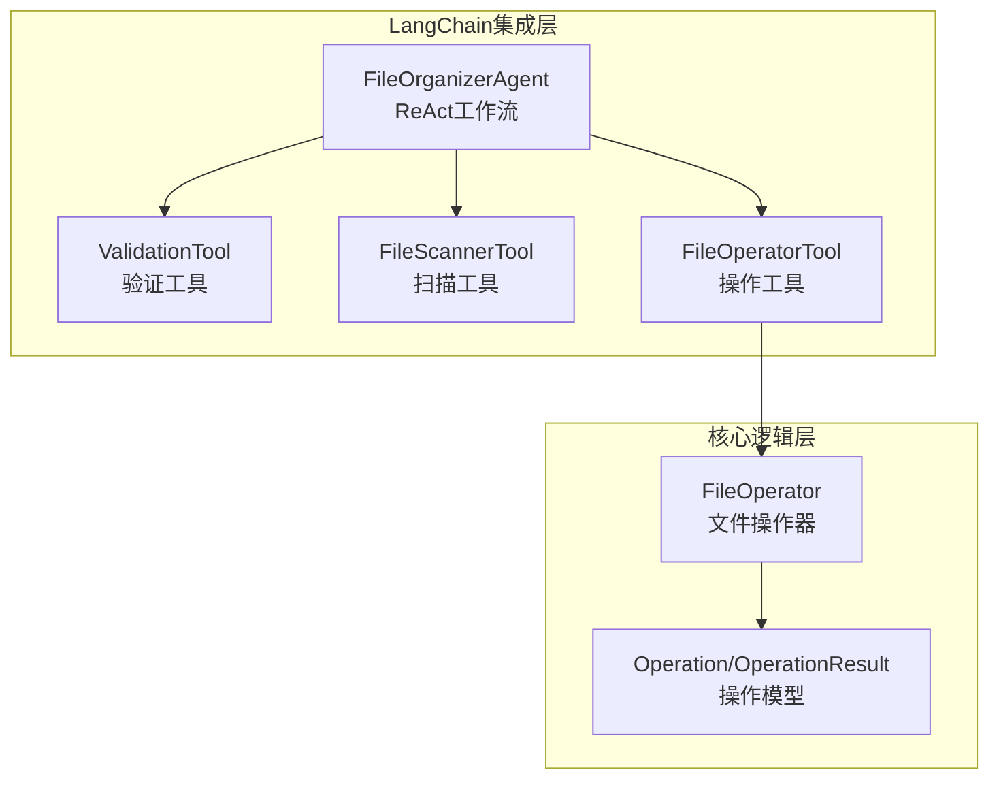
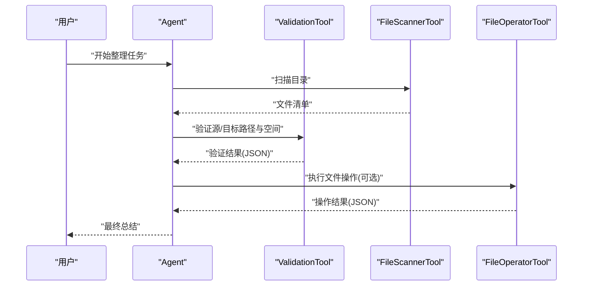
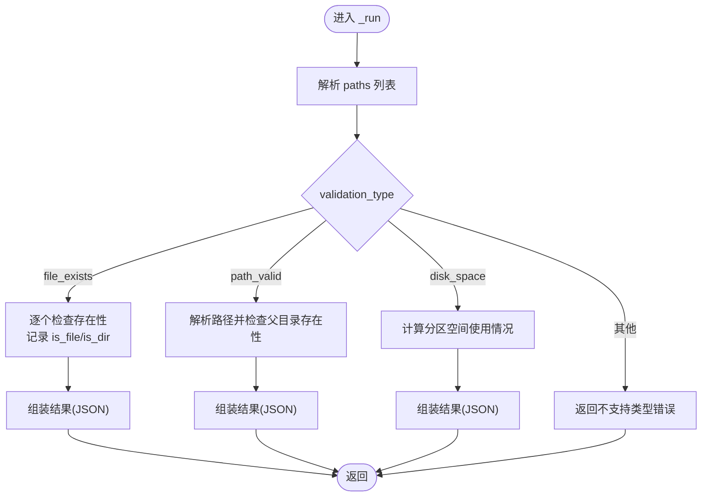
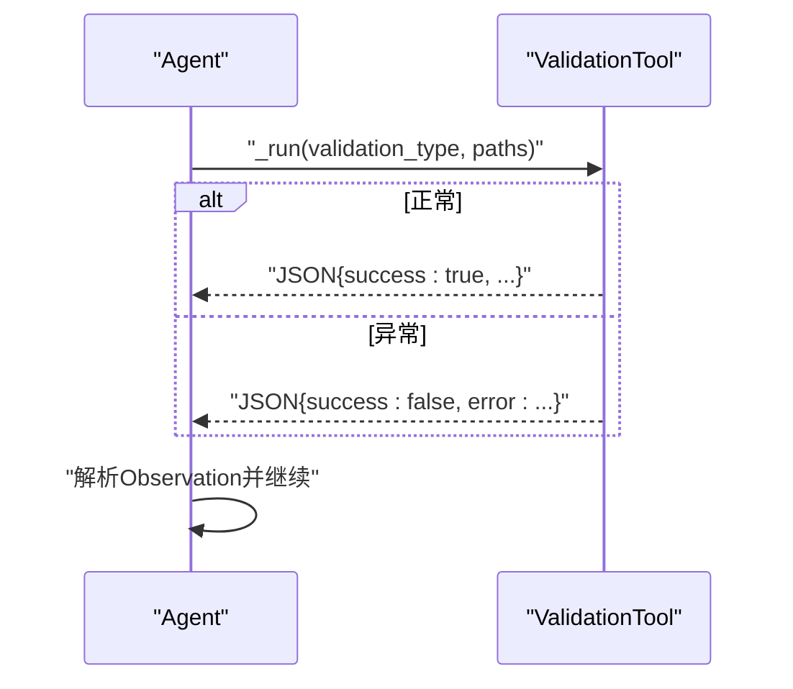
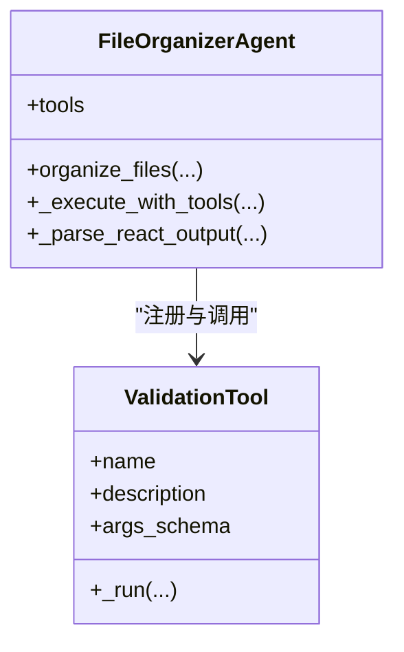
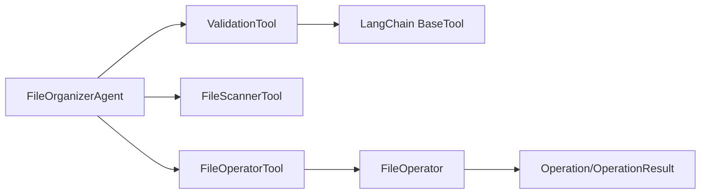

# 验证工具

<cite>
**本文引用的文件**
- [src/langchain_integration/tools/validation_tool.py](file://src/langchain_integration/tools/validation_tool.py)
- [src/langchain_integration/agent.py](file://src/langchain_integration/agent.py)
- [src/langchain_integration/tools/file_scanner_tool.py](file://src/langchain_integration/tools/file_scanner_tool.py)
- [src/langchain_integration/tools/file_operator_tool.py](file://src/langchain_integration/tools/file_operator_tool.py)
- [src/core/file_operator.py](file://src/core/file_operator.py)
- [src/models/operation.py](file://src/models/operation.py)
- [config/default_config.yaml](file://config/default_config.yaml)
- [docs/USAGE.md](file://docs/USAGE.md)
- [tests/test_langchain_integration.py](file://tests/test_langchain_integration.py)
</cite>

## 目录
1. [简介](#简介)
2. [项目结构](#项目结构)
3. [核心组件](#核心组件)
4. [架构总览](#架构总览)
5. [详细组件分析](#详细组件分析)
6. [依赖关系分析](#依赖关系分析)
7. [性能考虑](#性能考虑)
8. [故障排查指南](#故障排查指南)
9. [结论](#结论)
10. [附录](#附录)

## 简介
本文件面向“验证工具”的技术文档，聚焦于 ValidationTool 的验证规则引擎与在 Agent 决策流程中的集成方式。内容涵盖：
- 输入参数验证、文件存在性检查、路径有效性验证、磁盘空间检查
- 验证规则的配置与扩展思路
- 验证结果处理机制与错误处理策略
- 用户友好错误消息生成与流程中断/恢复
- 性能优化、缓存策略与批量验证方案
- 在 Agent ReAct 工作流中的作用与调用方式

## 项目结构
验证工具位于 LangChain 工具体系中，作为 Agent 的一个可调用工具参与 ReAct 决策循环。其上游依赖文件扫描与文件操作工具，下游由 Agent 的提示词驱动调用。

图表来源
- [src/langchain_integration/agent.py](file://src/langchain_integration/agent.py#L61-L68)
- [src/langchain_integration/tools/validation_tool.py](file://src/langchain_integration/tools/validation_tool.py#L24-L39)
- [src/langchain_integration/tools/file_scanner_tool.py](file://src/langchain_integration/tools/file_scanner_tool.py#L31-L46)
- [src/langchain_integration/tools/file_operator_tool.py](file://src/langchain_integration/tools/file_operator_tool.py#L32-L52)
- [src/core/file_operator.py](file://src/core/file_operator.py#L12-L23)
- [src/models/operation.py](file://src/models/operation.py#L18-L53)

章节来源
- [src/langchain_integration/agent.py](file://src/langchain_integration/agent.py#L61-L68)
- [src/langchain_integration/tools/validation_tool.py](file://src/langchain_integration/tools/validation_tool.py#L24-L39)

## 核心组件
- ValidationTool：提供文件存在性、路径有效性、磁盘空间三类验证，统一返回 JSON 结构的结果。
- Agent（FileOrganizerAgent）：在 ReAct 循环中解析 LLM 输出，调用 ValidationTool 并接收 Observation。
- FileOperatorTool：在执行具体文件操作前，调用 ValidationTool 进行前置校验。
- FileOperator：提供更细粒度的操作前验证（如源文件存在、目标路径合法性、磁盘空间等）。

章节来源
- [src/langchain_integration/tools/validation_tool.py](file://src/langchain_integration/tools/validation_tool.py#L15-L171)
- [src/langchain_integration/agent.py](file://src/langchain_integration/agent.py#L21-L576)
- [src/langchain_integration/tools/file_operator_tool.py](file://src/langchain_integration/tools/file_operator_tool.py#L32-L148)
- [src/core/file_operator.py](file://src/core/file_operator.py#L202-L246)

## 架构总览
ValidationTool 在 Agent 的 ReAct 工作流中扮演“前置校验”角色。Agent 通过提示词驱动工具调用，ValidationTool 返回标准化结果，Agent 将 Observation 注入下一轮推理，从而形成闭环。

图表来源
- [src/langchain_integration/agent.py](file://src/langchain_integration/agent.py#L300-L431)
- [src/langchain_integration/tools/validation_tool.py](file://src/langchain_integration/tools/validation_tool.py#L41-L68)
- [src/langchain_integration/tools/file_scanner_tool.py](file://src/langchain_integration/tools/file_scanner_tool.py#L48-L110)
- [src/langchain_integration/tools/file_operator_tool.py](file://src/langchain_integration/tools/file_operator_tool.py#L60-L148)

## 详细组件分析

### ValidationTool 验证规则引擎
- 输入参数
  - validation_type：验证类型，支持 file_exists、path_valid、disk_space
  - paths：待验证路径字符串，多个路径以逗号分隔
- 核心验证方法
  - 文件存在性：逐个检查路径是否存在，并区分文件/目录
  - 路径有效性：解析路径、检查父目录存在性，返回绝对路径
  - 磁盘空间：计算目标路径所在分区的空间使用率与剩余容量
- 结果处理
  - 统一以 JSON 字符串返回，包含 success、validation_type、results/all_exist 等字段
  - 异常捕获并返回错误信息，便于 Agent 的错误处理与反馈

图表来源
- [src/langchain_integration/tools/validation_tool.py](file://src/langchain_integration/tools/validation_tool.py#L41-L171)

章节来源
- [src/langchain_integration/tools/validation_tool.py](file://src/langchain_integration/tools/validation_tool.py#L15-L171)

### 验证规则配置与扩展
- 配置入口
  - 通过配置文件控制 Agent 行为与工具参数上限（如扫描最大文件数、递归开关等）
  - 验证工具本身不依赖外部配置，但可结合 Agent 的全局配置进行调用约束
- 自定义验证器实现思路
  - 基于 ValidationTool 的结构，新增验证类型（如权限检查、格式校验）并在 _run 中分支处理
  - 保持统一的 JSON 输出结构，确保 Agent/Observation 解析稳定
- 验证结果处理
  - Agent 侧解析 Observation，依据 success/all_exist 等字段决定后续动作
  - 对于不支持的类型或异常，Agent 输出用户可读的错误提示

章节来源
- [config/default_config.yaml](file://config/default_config.yaml#L26-L46)
- [src/langchain_integration/tools/validation_tool.py](file://src/langchain_integration/tools/validation_tool.py#L41-L68)
- [src/langchain_integration/agent.py](file://src/langchain_integration/agent.py#L300-L431)

### 验证失败的错误处理策略
- 统一异常捕获：任何异常均包装为 JSON 错误响应，包含 error 字段
- 不支持类型：返回支持的类型列表，辅助用户修正输入
- Agent 层错误注入：当工具调用失败或未检测到工具调用时，Agent 生成 Observation 并引导继续使用 ReAct 格式

图表来源
- [src/langchain_integration/tools/validation_tool.py](file://src/langchain_integration/tools/validation_tool.py#L41-L68)
- [src/langchain_integration/agent.py](file://src/langchain_integration/agent.py#L359-L411)

章节来源
- [src/langchain_integration/tools/validation_tool.py](file://src/langchain_integration/tools/validation_tool.py#L41-L68)
- [src/langchain_integration/agent.py](file://src/langchain_integration/agent.py#L359-L411)

### 用户友好的错误消息生成
- 工具内部：返回结构化的 JSON，包含错误详情与支持的类型列表
- Agent 层：对 JSON 解析失败、工具不存在等情况，生成可读的提示并引导使用正确的工具名称与格式

章节来源
- [src/langchain_integration/tools/validation_tool.py](file://src/langchain_integration/tools/validation_tool.py#L58-L68)
- [src/langchain_integration/agent.py](file://src/langchain_integration/agent.py#L286-L297)

### 验证流程的中断与恢复机制
- 中断：当验证失败（如路径非法、空间不足）时，Agent 根据 Observation 决定是否继续或终止
- 恢复：Agent 通过历史消息与提示词引导用户修正输入或调整策略，再次进入 ReAct 循环

章节来源
- [src/langchain_integration/agent.py](file://src/langchain_integration/agent.py#L300-L431)

### 在 Agent 决策过程中的作用与集成方式
- 工具注册：Agent 初始化时将 ValidationTool 注册为可用工具之一
- ReAct 调用：Agent 通过解析 LLM 输出的 Thought/Action/Action Input，调用 ValidationTool
- 观察与反馈：Observation 作为下一轮推理的输入，推动 Agent 完成后续扫描、分析与操作

图表来源
- [src/langchain_integration/agent.py](file://src/langchain_integration/agent.py#L61-L68)
- [src/langchain_integration/tools/validation_tool.py](file://src/langchain_integration/tools/validation_tool.py#L24-L39)

章节来源
- [src/langchain_integration/agent.py](file://src/langchain_integration/agent.py#L61-L68)
- [src/langchain_integration/tools/validation_tool.py](file://src/langchain_integration/tools/validation_tool.py#L24-L39)

### 与文件操作验证的协同
- FileOperatorTool 在执行操作前调用 FileOperator.validate_operations，进行更全面的前置校验（源文件存在、目标路径合法性、磁盘空间等）
- ValidationTool 侧重于通用的系统状态与路径校验，两者互补

章节来源
- [src/langchain_integration/tools/file_operator_tool.py](file://src/langchain_integration/tools/file_operator_tool.py#L94-L103)
- [src/core/file_operator.py](file://src/core/file_operator.py#L202-L246)

## 依赖关系分析
- ValidationTool 依赖 LangChain BaseTool 接口（向后兼容处理）
- Agent 依赖 ValidationTool 与其他工具共同完成 ReAct 工作流
- FileOperatorTool 依赖 FileOperator 与 Operation 模型

图表来源
- [src/langchain_integration/tools/validation_tool.py](file://src/langchain_integration/tools/validation_tool.py#L8-L12)
- [src/langchain_integration/agent.py](file://src/langchain_integration/agent.py#L12-L17)
- [src/langchain_integration/tools/file_operator_tool.py](file://src/langchain_integration/tools/file_operator_tool.py#L14-L15)
- [src/core/file_operator.py](file://src/core/file_operator.py#L9-L10)
- [src/models/operation.py](file://src/models/operation.py#L18-L53)

章节来源
- [src/langchain_integration/tools/validation_tool.py](file://src/langchain_integration/tools/validation_tool.py#L8-L12)
- [src/langchain_integration/agent.py](file://src/langchain_integration/agent.py#L12-L17)
- [src/langchain_integration/tools/file_operator_tool.py](file://src/langchain_integration/tools/file_operator_tool.py#L14-L15)
- [src/core/file_operator.py](file://src/core/file_operator.py#L9-L10)
- [src/models/operation.py](file://src/models/operation.py#L18-L53)

## 性能考虑
- 验证类型选择
  - file_exists：O(n) 路径检查，适合批量文件存在性快速筛查
  - path_valid：O(n) 路径解析与父目录存在性检查，适合路径合法性快速过滤
  - disk_space：O(n) 磁盘使用查询，注意在大量路径上可能成为瓶颈
- 批量验证建议
  - 将多个路径合并为一次调用，减少 Agent 与工具交互次数
  - 对于磁盘空间检查，优先检查目标分区而非每个文件逐一查询
- 缓存策略
  - 对于重复路径，可在 Agent 层缓存验证结果，避免重复调用
  - 对于频繁出现的路径组合，可考虑本地缓存（需注意路径变更导致的失效）

章节来源
- [src/langchain_integration/tools/validation_tool.py](file://src/langchain_integration/tools/validation_tool.py#L49-L171)
- [docs/USAGE.md](file://docs/USAGE.md#L203-L222)

## 故障排查指南
- 常见问题
  - 不支持的验证类型：检查 validation_type 是否为 file_exists/path_valid/disk_space
  - 路径解析失败：确认路径字符串格式正确，必要时提供绝对路径
  - 磁盘空间查询异常：确认目标路径存在或其父目录存在
- 测试验证
  - 单元测试覆盖了验证工具的基本行为，可参考测试用例定位问题
- 配置核对
  - 检查配置文件中与 Agent、工具相关的参数是否合理

章节来源
- [src/langchain_integration/tools/validation_tool.py](file://src/langchain_integration/tools/validation_tool.py#L58-L68)
- [tests/test_langchain_integration.py](file://tests/test_langchain_integration.py#L87-L101)
- [config/default_config.yaml](file://config/default_config.yaml#L26-L46)

## 结论
ValidationTool 以简洁稳定的接口实现了三类关键验证能力，配合 Agent 的 ReAct 工作流，能够可靠地在文件整理任务中进行前置校验与风险控制。通过统一的 JSON 输出与完善的错误处理，它既满足自动化执行的稳定性，也为用户提供了清晰的反馈。未来可在此基础上扩展更多验证类型，并结合缓存与批量策略进一步提升性能。

## 附录
- 使用场景
  - 在执行文件移动/重命名/创建文件夹前，先验证源文件存在与目标路径合法性
  - 在批量操作前，检查目标分区磁盘空间是否充足
- 相关文档
  - 使用指南与性能优化建议参见使用文档

章节来源
- [docs/USAGE.md](file://docs/USAGE.md#L1-L245)