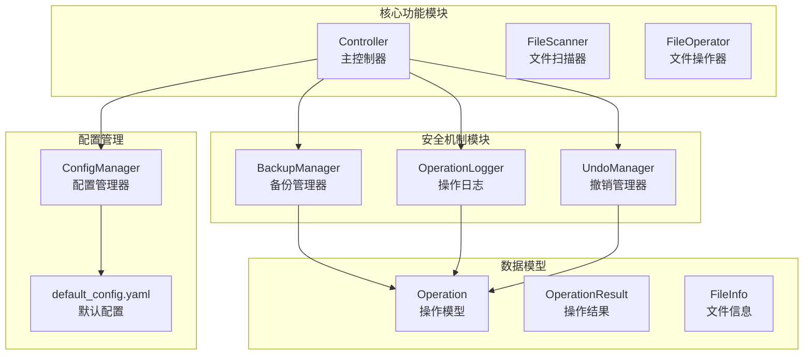
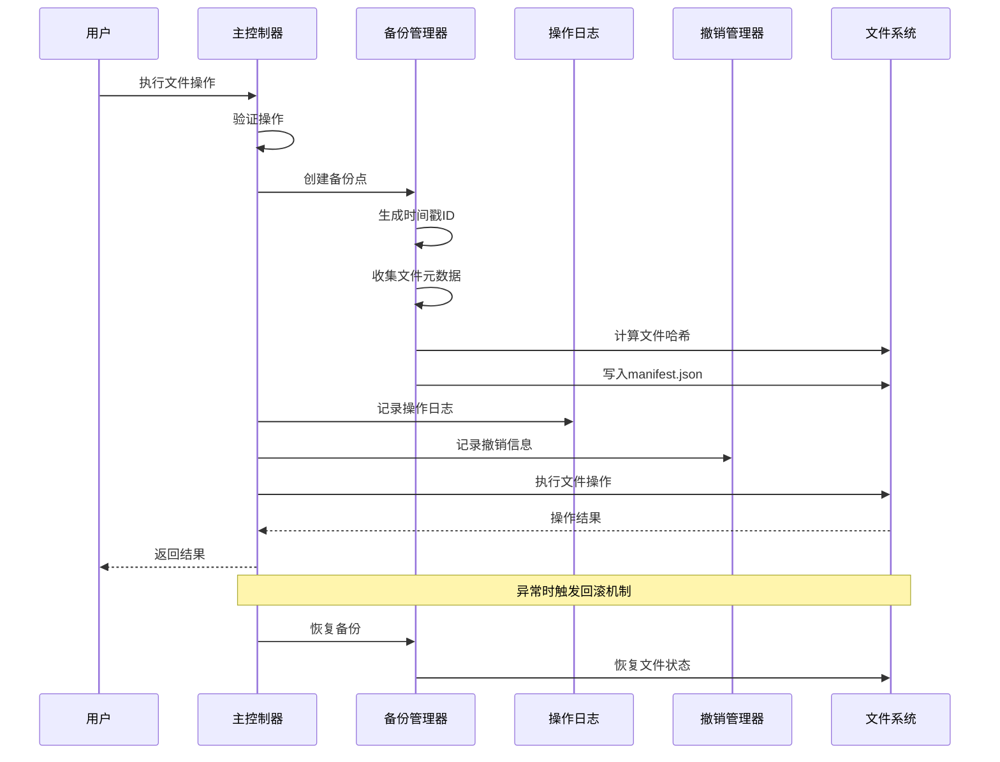
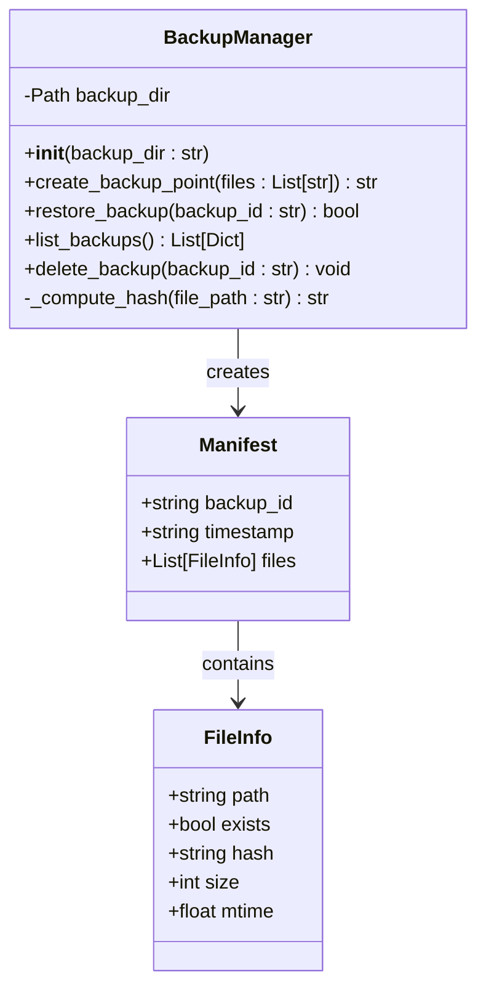
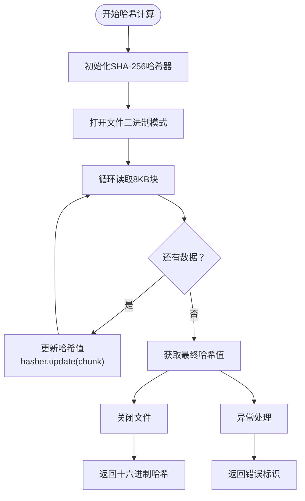
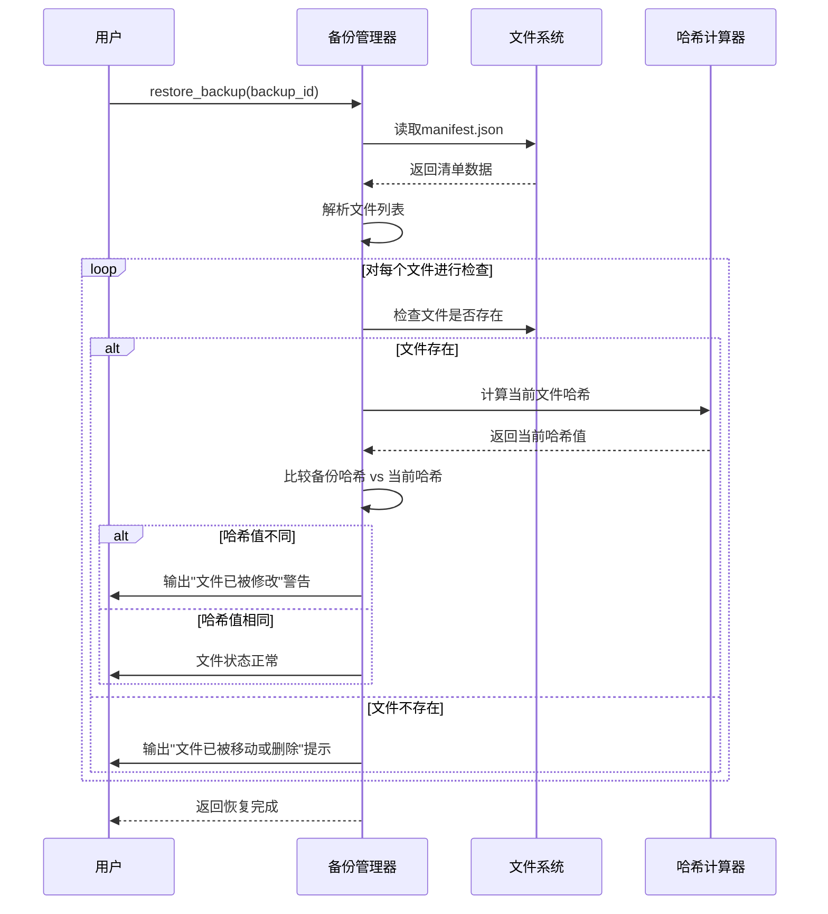
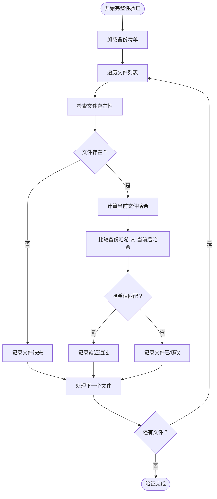
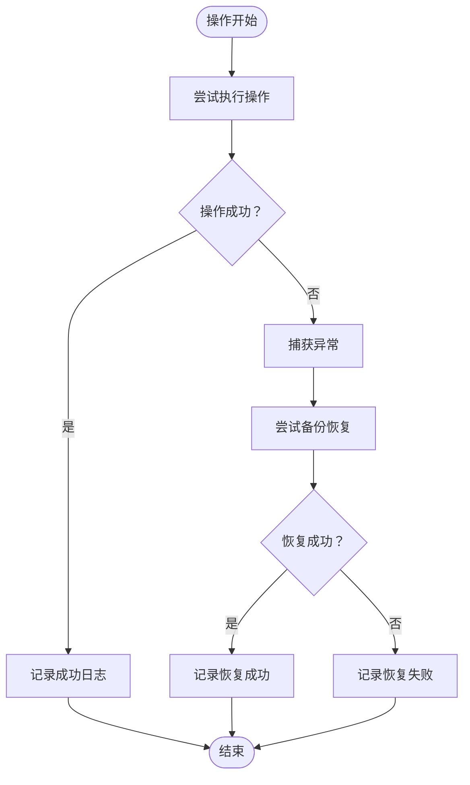
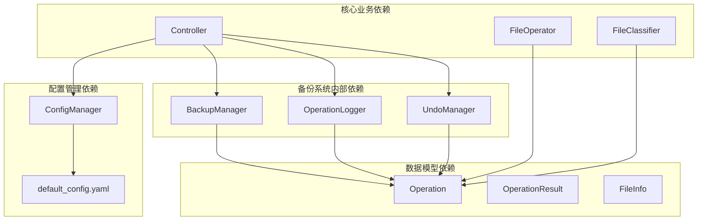

# 备份管理系统

<cite>
**本文档引用的文件**
- [backup.py](file://src/safety/backup.py)
- [operation.py](file://src/models/operation.py)
- [controller.py](file://src/core/controller.py)
- [operation_log.py](file://src/safety/operation_log.py)
- [undo_manager.py](file://src/safety/undo_manager.py)
- [file_info.py](file://src/models/file_info.py)
- [file_metadata.py](file://src/utils/file_metadata.py)
- [default_config.yaml](file://config/default_config.yaml)
- [API.md](file://docs/API.md)
- [test_safety.py](file://tests/test_safety.py)
</cite>

## 目录
1. [简介](#简介)
2. [项目结构](#项目结构)
3. [核心组件](#核心组件)
4. [架构概览](#架构概览)
5. [详细组件分析](#详细组件分析)
6. [依赖关系分析](#依赖关系分析)
7. [性能考虑](#性能考虑)
8. [故障排除指南](#故障排除指南)
9. [结论](#结论)
10. [附录](#附录)

## 简介

备份管理系统是智能文件整理系统中的关键安全机制，负责在执行文件操作前创建备份点，确保在出现意外情况时能够快速恢复。该系统采用轻量级设计，通过创建包含文件元数据的清单文件而非复制实际文件内容来实现高效备份，从而显著节省存储空间。

系统的核心特性包括：
- 基于时间戳的备份点创建机制
- 文件元数据收集策略（哈希值、大小、修改时间等）
- 完整性验证流程
- 恢复过程中的文件状态检查
- 错误处理和回滚机制

## 项目结构

备份管理系统位于 `src/safety/` 目录下，与核心文件整理功能分离，体现了关注点分离的设计原则。系统采用模块化架构，各组件职责明确：



**图表来源**
- [backup.py](file://src/safety/backup.py#L10-L152)
- [controller.py](file://src/core/controller.py#L15-L82)
- [operation.py](file://src/models/operation.py#L18-L54)

**章节来源**
- [backup.py](file://src/safety/backup.py#L1-L152)
- [controller.py](file://src/core/controller.py#L1-L310)

## 核心组件

备份管理系统包含三个核心组件，每个组件都有明确的职责分工：

### BackupManager（备份管理器）
- **职责**：创建、管理和恢复备份点
- **特点**：基于时间戳命名，存储文件元数据而非文件内容
- **接口**：创建备份点、恢复备份、列出备份、删除备份

### OperationLogger（操作日志）
- **职责**：记录文件操作的历史信息
- **特点**：采用JSONL格式，按日期分割日志文件
- **接口**：记录操作、查询历史、清理旧日志

### UndoManager（撤销管理器）
- **职责**：支持撤销文件操作
- **特点**：维护操作历史栈，支持反向操作执行
- **接口**：记录操作、撤销最后操作、查询历史

**章节来源**
- [backup.py](file://src/safety/backup.py#L10-L152)
- [operation_log.py](file://src/safety/operation_log.py#L11-L133)
- [undo_manager.py](file://src/safety/undo_manager.py#L10-L155)

## 架构概览

备份管理系统采用分层架构设计，与主控制器紧密集成：



**图表来源**
- [controller.py](file://src/core/controller.py#L203-L256)
- [backup.py](file://src/safety/backup.py#L23-L108)

系统的关键设计原则：
1. **预防性备份**：在执行任何文件操作前自动创建备份
2. **元数据优先**：只存储必要的文件元数据，避免大文件复制
3. **完整性验证**：通过哈希值确保备份文件的完整性
4. **自动回滚**：操作失败时自动恢复到备份状态

## 详细组件分析

### BackupManager 类分析

BackupManager 是备份系统的核心类，实现了完整的备份生命周期管理：



**图表来源**
- [backup.py](file://src/safety/backup.py#L10-L152)

#### 备份点创建机制

备份点创建采用时间戳命名规则，格式为 `YYYYMMDD_HHMMSS`，确保唯一性和可排序性：

```mermaid
flowchart TD
Start([开始创建备份]) --> GenID["生成时间戳ID<br/>YYYYMMDD_HHMMSS"]
GenID --> CreateDir["创建备份目录<br/>backup_dir/YYYYMMDD_HHMMSS"]
CreateDir --> InitManifest["初始化manifest.json<br/>{backup_id, timestamp, files[]}"}
InitManifest --> ProcessFiles["遍历文件列表"]
ProcessFiles --> CheckExists{"文件存在且为文件？"}
CheckExists --> |是| CollectMeta["收集文件元数据<br/>- 绝对路径<br/>- 哈希值<br/>- 文件大小<br/>- 修改时间"}
CheckExists --> |否| MarkMissing["标记文件缺失<br/>exists=false"]
CollectMeta --> AddToManifest["添加到manifest.files[]"]
MarkMissing --> AddToManifest
AddToManifest --> NextFile{"还有文件？"}
NextFile --> |是| ProcessFiles
NextFile --> |否| WriteManifest["写入manifest.json"]
WriteManifest --> End([备份创建完成])
```

**图表来源**
- [backup.py](file://src/safety/backup.py#L23-L70)

#### 文件元数据收集策略

系统采用轻量级的元数据收集策略，避免不必要的文件读取：

| 元数据字段 | 收集方式 | 存储格式 | 备注 |
|------------|----------|----------|------|
| 路径 | `path.absolute()` | 绝对路径字符串 | 确保可恢复性 |
| 哈希值 | SHA-256分块计算 | 64字符十六进制 | 大文件分块处理 |
| 文件大小 | `path.stat().st_size` | 整数字节 | 用于完整性验证 |
| 修改时间 | `path.stat().st_mtime` | 浮点数时间戳 | 用于状态检查 |
| 存在状态 | 文件存在性检查 | 布尔值 | 标记文件状态 |

#### 哈希值计算算法

系统使用 SHA-256 算法进行文件完整性校验，采用分块读取策略处理大文件：



**图表来源**
- [backup.py](file://src/safety/backup.py#L140-L152)

#### 备份清单（Manifest）格式

备份清单采用 JSON 格式存储，包含以下结构：

```json
{
  "backup_id": "YYYYMMDD_HHMMSS",
  "timestamp": "ISO8601时间戳",
  "files": [
    {
      "path": "/absolute/path/to/file",
      "exists": true,
      "hash": "sha256哈希值",
      "size": 1048576,
      "mtime": 1700000000.0
    },
    {
      "path": "/absolute/path/to/missing/file",
      "exists": false
    }
  ]
}
```

#### 时间戳命名规则

备份目录采用严格的命名规范：
- **格式**：`YYYYMMDD_HHMMSS`
- **含义**：年月日_时分秒
- **优势**：自然排序即时间排序，便于管理
- **唯一性**：秒级精度确保大多数场景下的唯一性

#### 备份目录组织方式

备份目录采用层次化组织结构：
```
data/backups/
├── 20241115_143022/
│   ├── manifest.json
├── 20241115_154533/
│   ├── manifest.json
└── 20241116_091545/
    ├── manifest.json
```

### 恢复过程分析

备份恢复过程包含文件状态检查和完整性验证：



**图表来源**
- [backup.py](file://src/safety/backup.py#L72-L108)

#### 文件状态检查机制

恢复过程中的文件状态检查逻辑：

1. **文件存在性检查**：验证备份时存在的文件是否仍然存在
2. **完整性验证**：通过哈希值比较确保文件未被修改
3. **状态报告**：输出详细的文件状态信息供用户参考

#### 完整性验证流程

完整性验证采用多层检查机制：



**图表来源**
- [backup.py](file://src/safety/backup.py#L94-L107)

### 错误处理机制

备份系统采用多层次的错误处理策略：



**图表来源**
- [controller.py](file://src/core/controller.py#L243-L255)

## 依赖关系分析

备份管理系统与其他模块的依赖关系：



**图表来源**
- [controller.py](file://src/core/controller.py#L12-L78)
- [operation.py](file://src/models/operation.py#L18-L54)

### 关键依赖关系

1. **Controller 依赖**：主控制器依赖备份管理器进行安全操作
2. **Operation 依赖**：备份系统记录操作历史，便于审计和恢复
3. **ConfigManager 依赖**：配置管理器提供系统配置参数
4. **FileOperator 依赖**：文件操作器执行具体的文件操作

**章节来源**
- [controller.py](file://src/core/controller.py#L12-L78)
- [operation.py](file://src/models/operation.py#L18-L54)

## 性能考虑

备份系统在设计时充分考虑了性能优化：

### 大文件处理方案

1. **分块读取**：哈希计算采用8KB分块，避免内存溢出
2. **延迟计算**：只在需要时计算文件哈希
3. **元数据优先**：优先存储必要元数据而非完整文件内容

### 存储空间优化

1. **清单文件**：每个备份仅存储约1KB的JSON清单
2. **增量备份**：支持选择性备份特定文件
3. **压缩存储**：清单文件采用紧凑JSON格式

### 并发处理

1. **异步操作**：备份创建和恢复支持异步执行
2. **批处理**：支持批量文件操作的原子性保证
3. **资源管理**：自动管理文件句柄和内存资源

## 故障排除指南

### 常见问题及解决方案

#### 备份创建失败

**症状**：备份创建过程中抛出异常
**可能原因**：
- 目标目录权限不足
- 磁盘空间不足
- 文件访问权限问题

**解决方法**：
1. 检查备份目录权限
2. 确认磁盘空间充足
3. 验证文件访问权限

#### 恢复失败

**症状**：备份恢复后文件状态异常
**可能原因**：
- 文件已被外部程序修改
- 磁盘损坏导致哈希计算错误
- 权限不足无法恢复文件

**解决方法**：
1. 检查文件权限设置
2. 验证磁盘健康状况
3. 手动检查文件完整性

#### 性能问题

**症状**：备份过程耗时过长
**可能原因**：
- 大量大文件需要哈希计算
- 网络存储设备响应慢
- 系统资源不足

**解决方法**：
1. 优化文件筛选策略
2. 考虑使用更快的存储介质
3. 调整系统资源配置

**章节来源**
- [backup.py](file://src/safety/backup.py#L62-L64)
- [controller.py](file://src/core/controller.py#L243-L255)

## 结论

备份管理系统通过精心设计的架构和实现策略，为智能文件整理系统提供了可靠的安全保障。系统的核心优势包括：

1. **高效性**：通过元数据备份而非文件复制，显著节省存储空间
2. **可靠性**：完善的错误处理和回滚机制确保操作安全性
3. **可维护性**：清晰的代码结构和模块化设计便于维护和扩展
4. **可扩展性**：灵活的配置管理和插件化架构支持功能扩展

系统在实际应用中展现了良好的稳定性和实用性，为用户提供了可靠的文件操作安全保障。

## 附录

### 配置指南

备份系统的主要配置选项：

| 配置项 | 默认值 | 说明 |
|--------|--------|------|
| backup_enabled | true | 是否启用自动备份 |
| max_undo_history | 10 | 撤销历史最大条目数 |
| log_dir | data/logs | 日志存储目录 |
| retention_days | 30 | 日志保留天数 |

### 最佳实践

1. **定期清理**：定期清理过期备份和日志文件
2. **监控告警**：建立备份失败监控和告警机制
3. **测试验证**：定期测试备份恢复功能
4. **权限管理**：合理设置备份目录访问权限
5. **容量规划**：根据文件规模合理规划存储空间

### 使用示例

```python
from src.safety import BackupManager

# 创建备份管理器
backup_mgr = BackupManager(backup_dir='data/backups')

# 创建备份点
backup_id = backup_mgr.create_backup_point([
    '/path/to/file1.txt',
    '/path/to/file2.pdf'
])

# 恢复备份
backup_mgr.restore_backup(backup_id)

# 列出备份
backups = backup_mgr.list_backups()
```