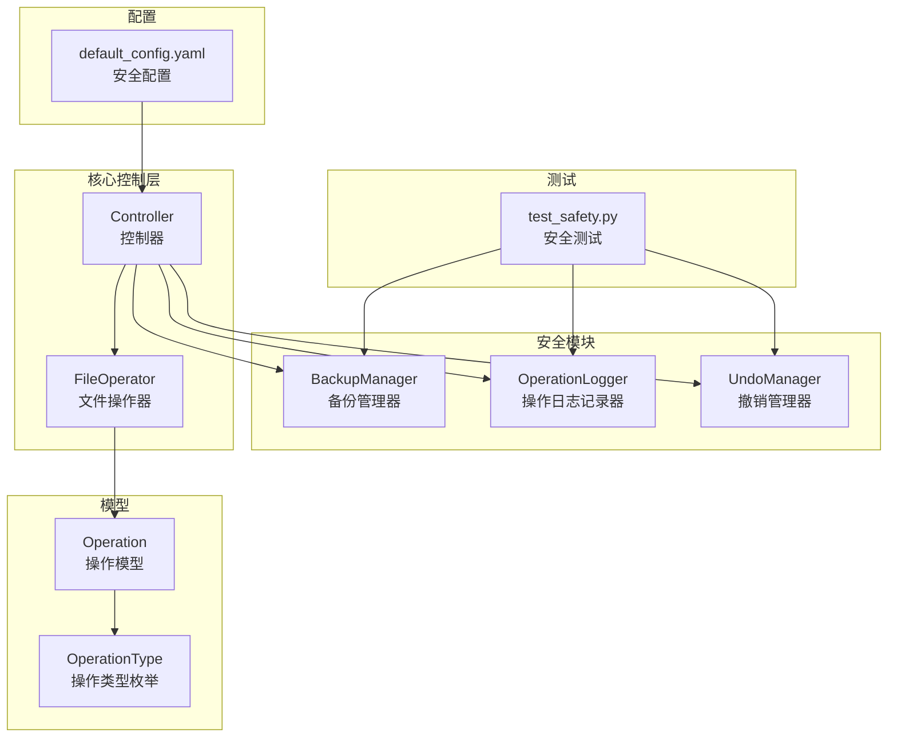
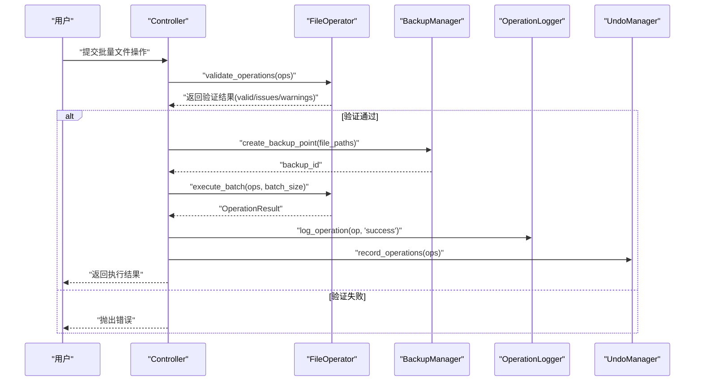
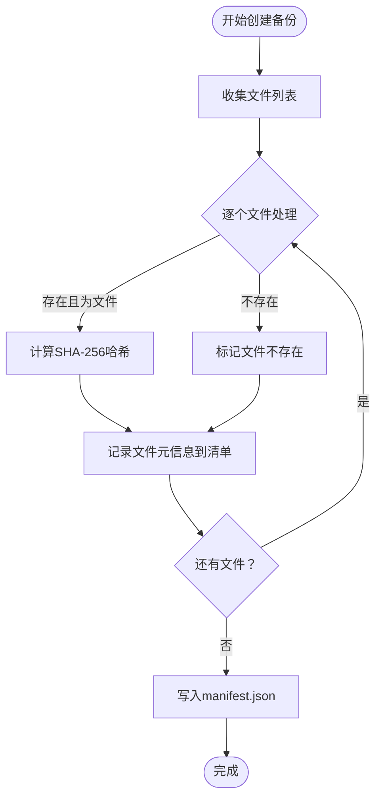
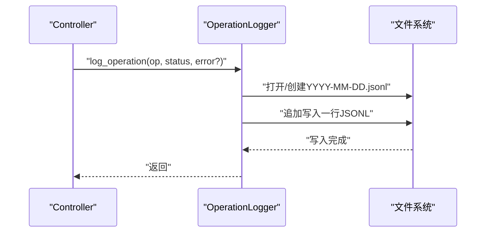
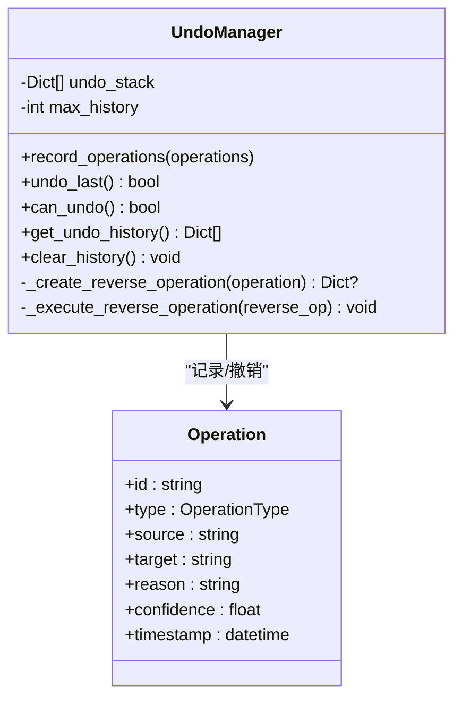
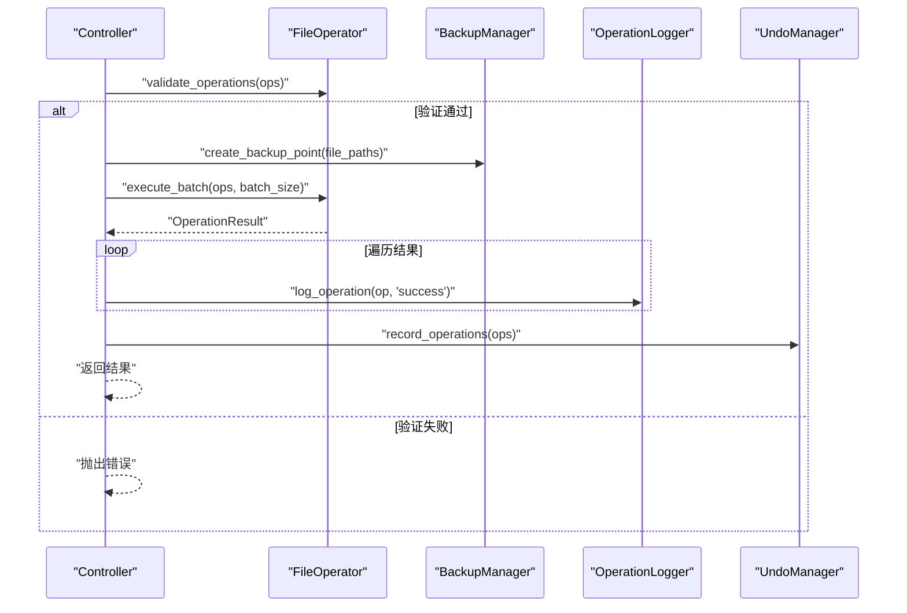
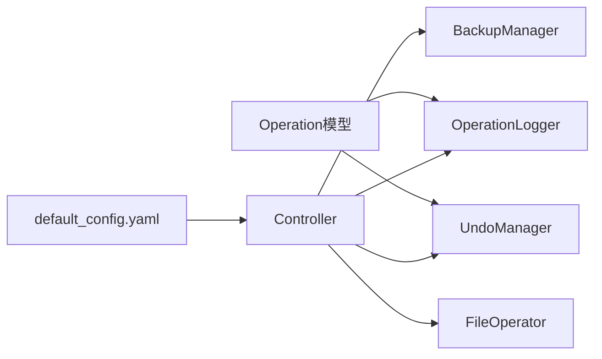

# 安全机制

<cite>
**本文引用的文件**
- [src/safety/__init__.py](file://src/safety/__init__.py)
- [src/safety/backup.py](file://src/safety/backup.py)
- [src/safety/operation_log.py](file://src/safety/operation_log.py)
- [src/safety/undo_manager.py](file://src/safety/undo_manager.py)
- [src/models/operation.py](file://src/models/operation.py)
- [src/core/controller.py](file://src/core/controller.py)
- [src/core/file_operator.py](file://src/core/file_operator.py)
- [config/default_config.yaml](file://config/default_config.yaml)
- [tests/test_safety.py](file://tests/test_safety.py)
- [docs/API.md](file://docs/API.md)
</cite>

## 目录
1. [简介](#简介)
2. [项目结构](#项目结构)
3. [核心组件](#核心组件)
4. [架构总览](#架构总览)
5. [详细组件分析](#详细组件分析)
6. [依赖关系分析](#依赖关系分析)
7. [性能考量](#性能考量)
8. [故障排查指南](#故障排查指南)
9. [结论](#结论)
10. [附录](#附录)

## 简介
本文件聚焦于备份管理系统中的安全机制，涵盖备份策略与存储位置、恢复机制、操作日志记录的完整性与审计追踪、撤销管理机制（撤销栈、反向操作、历史限制）、并发控制现状与建议、安全最佳实践、风险评估与应急响应流程、安全配置指南与监控告警设置以及合规性实现方法。文档基于仓库中现有的安全模块与相关集成代码进行分析，旨在帮助开发者与运维人员正确理解与部署安全能力。

## 项目结构
安全机制相关代码位于 src/safety 目录，配合 src/models 中的操作模型、src/core 中的控制器与文件操作器，以及 config/default_config.yaml 中的安全配置项共同构成完整的安全闭环。

图表来源
- [src/safety/backup.py](file://src/safety/backup.py#L10-L152)
- [src/safety/operation_log.py](file://src/safety/operation_log.py#L11-L133)
- [src/safety/undo_manager.py](file://src/safety/undo_manager.py#L10-L155)
- [src/models/operation.py](file://src/models/operation.py#L10-L54)
- [src/core/controller.py](file://src/core/controller.py#L203-L310)
- [src/core/file_operator.py](file://src/core/file_operator.py#L202-L246)
- [config/default_config.yaml](file://config/default_config.yaml#L67-L79)
- [tests/test_safety.py](file://tests/test_safety.py#L1-L105)

章节来源
- [src/safety/__init__.py](file://src/safety/__init__.py#L1-L8)
- [config/default_config.yaml](file://config/default_config.yaml#L67-L79)

## 核心组件
- 备份管理器 BackupManager：负责创建备份点、列出备份、删除备份、基于清单（manifest）的恢复检查与校验。
- 操作日志记录器 OperationLogger：以 JSONL 格式按日写入操作日志，支持按日期查询与清理过期日志。
- 撤销管理器 UndoManager：记录可撤销的操作序列，生成反向操作并按批撤销，维护撤销历史栈与最大历史限制。
- 操作模型 Operation：统一描述操作类型、源/目标路径、置信度、原因、时间戳等，为日志与撤销提供数据基础。
- 控制器 Controller：在执行文件操作前进行安全验证、创建备份点、记录日志、入栈撤销；异常时记录失败日志并尝试恢复。
- 文件操作器 FileOperator：提供操作验证（源存在性、目标合法性、磁盘空间等），为安全执行提供前置保障。

章节来源
- [src/safety/backup.py](file://src/safety/backup.py#L10-L152)
- [src/safety/operation_log.py](file://src/safety/operation_log.py#L11-L133)
- [src/safety/undo_manager.py](file://src/safety/undo_manager.py#L10-L155)
- [src/models/operation.py](file://src/models/operation.py#L10-L54)
- [src/core/controller.py](file://src/core/controller.py#L203-L310)
- [src/core/file_operator.py](file://src/core/file_operator.py#L202-L246)

## 架构总览
下图展示安全机制在系统中的调用关系与数据流：控制器协调备份、日志与撤销；文件操作器负责安全验证；模型提供统一的数据结构；配置驱动安全开关与保留策略。

图表来源
- [src/core/controller.py](file://src/core/controller.py#L203-L241)
- [src/core/file_operator.py](file://src/core/file_operator.py#L202-L246)
- [src/safety/backup.py](file://src/safety/backup.py#L23-L70)
- [src/safety/operation_log.py](file://src/safety/operation_log.py#L24-L52)
- [src/safety/undo_manager.py](file://src/safety/undo_manager.py#L23-L48)

## 详细组件分析

### 备份管理器 BackupManager
- 设计原理
  - 采用“清单优先”的备份策略：仅记录文件元信息（路径、哈希、大小、修改时间、存在性）而不复制文件，降低存储开销。
  - 备份点以时间戳命名，每个备份点包含独立的清单文件（manifest.json），便于后续恢复检查。
- 备份策略
  - 创建备份点：遍历文件列表，计算 SHA-256 哈希，记录文件状态；清单写入磁盘。
  - 恢复机制：读取清单，逐项检查文件是否存在与哈希是否一致，输出状态提示（当前实现侧重检查而非自动恢复）。
  - 列表与删除：按时间倒序列出备份，支持删除指定备份。
- 存储位置
  - 默认备份目录为 data/backups，可通过构造函数参数自定义。
- 复杂度与性能
  - 哈希计算采用分块读取，适合大文件；整体复杂度 O(n*m)，n 为文件数，m 为平均文件大小/分块大小。
- 完整性保证
  - 通过哈希校验与存在性检查，确保恢复前后的文件一致性与可追溯性。
- 并发控制
  - 当前未见显式的并发锁或事务封装，建议在外部调用处串行化关键操作或引入文件级锁。

图表来源
- [src/safety/backup.py](file://src/safety/backup.py#L23-L70)

章节来源
- [src/safety/backup.py](file://src/safety/backup.py#L10-L152)
- [config/default_config.yaml](file://config/default_config.yaml#L67-L79)

### 操作日志记录器 OperationLogger
- 设计原理
  - 以 JSONL（每行一个 JSON 对象）格式按日写入，便于流式处理与聚合分析。
  - 提供按最近条目与按日期查询接口，支持清理过期日志。
- 审计追踪
  - 记录操作 ID、类型、源/目标、原因、状态、错误信息、时间戳，满足基本审计需求。
- 日志格式
  - 字段包括 timestamp、operation_id、type、source、target、reason、status、error。
- 存储策略
  - 日目录结构，文件名为 YYYY-MM-DD.jsonl；默认保留 30 天，可通过配置项调整。
- 完整性与可靠性
  - 单行追加写入，具备基本的顺序一致性；未见原子落盘或校验和保护，建议结合外部日志系统增强可靠性。

图表来源
- [src/safety/operation_log.py](file://src/safety/operation_log.py#L24-L52)

章节来源
- [src/safety/operation_log.py](file://src/safety/operation_log.py#L11-L133)
- [config/default_config.yaml](file://config/default_config.yaml#L74-L79)

### 撤销管理器 UndoManager
- 设计原理
  - 维护撤销栈，记录每次操作批次对应的反向操作；撤销时按逆序执行，保证操作顺序的可逆性。
  - 仅对部分操作类型提供反向操作（移动、重命名、创建文件夹），其他类型返回不可撤销。
- 撤销栈管理
  - 支持设置最大历史记录数，超过阈值时丢弃最旧批次。
- 原子操作保证
  - 当前实现为顺序执行反向操作，未见事务封装或补偿事务；若反向操作部分失败，需人工干预。
- 并发控制
  - 未见锁或并发同步机制；建议在控制器层面串行化撤销操作，避免竞态条件。

图表来源
- [src/safety/undo_manager.py](file://src/safety/undo_manager.py#L10-L155)
- [src/models/operation.py](file://src/models/operation.py#L18-L31)

章节来源
- [src/safety/undo_manager.py](file://src/safety/undo_manager.py#L10-L155)
- [src/models/operation.py](file://src/models/operation.py#L10-L31)

### 控制器与文件操作器的集成
- 控制器在执行文件操作前进行安全验证，创建备份点，记录成功日志并入栈撤销；异常时记录失败日志并尝试恢复。
- 文件操作器提供操作验证，包括源存在性、目标路径合法性、目标覆盖警告、磁盘空间检查等。

图表来源
- [src/core/controller.py](file://src/core/controller.py#L203-L241)
- [src/core/file_operator.py](file://src/core/file_operator.py#L202-L246)

章节来源
- [src/core/controller.py](file://src/core/controller.py#L203-L310)
- [src/core/file_operator.py](file://src/core/file_operator.py#L202-L246)

## 依赖关系分析
- 模块内聚与耦合
  - 安全模块内部低耦合，各组件职责清晰；与核心控制层通过接口交互，符合关注点分离。
- 外部依赖
  - 使用标准库（pathlib、json、hashlib、datetime、shutil）与 Pydantic 数据模型。
- 潜在循环依赖
  - 未发现循环导入；安全模块不直接依赖控制器，而是由控制器注入使用。

图表来源
- [src/models/operation.py](file://src/models/operation.py#L10-L54)
- [src/safety/operation_log.py](file://src/safety/operation_log.py#L11-L133)
- [src/safety/undo_manager.py](file://src/safety/undo_manager.py#L10-L155)
- [src/core/controller.py](file://src/core/controller.py#L203-L310)
- [config/default_config.yaml](file://config/default_config.yaml#L67-L79)

章节来源
- [src/safety/__init__.py](file://src/safety/__init__.py#L1-L8)
- [src/models/operation.py](file://src/models/operation.py#L10-L54)
- [src/core/controller.py](file://src/core/controller.py#L203-L310)

## 性能考量
- 备份哈希计算
  - 采用分块读取（固定缓冲区大小）处理大文件，避免一次性加载内存；建议根据磁盘吞吐与 CPU 资源调优缓冲区大小。
- 日志写入
  - JSONL 追加写入，I/O 开销与日志量线性相关；建议结合外部日志系统（如集中式日志）实现异步写入与压缩。
- 撤销栈大小
  - 通过 max_history 控制内存占用；建议根据业务规模与恢复频率设定合理上限。
- 并发与锁
  - 当前未见并发控制；建议在控制器层面串行化关键操作，或引入文件级锁与重试机制。

[本节为通用性能讨论，无需具体文件分析]

## 故障排查指南
- 备份失败
  - 检查备份目录权限与磁盘空间；确认文件路径存在且可读；查看哈希计算异常输出。
- 恢复检查无效果
  - 当前实现侧重检查而非自动恢复；请核对清单文件完整性与文件状态。
- 日志缺失
  - 确认日志目录存在且可写；检查日期文件是否创建；确认写入权限与磁盘空间。
- 撤销失败
  - 查看反向操作执行异常（如源文件不存在）；确认撤销栈非空；必要时手动恢复。
- 配置问题
  - 检查 default_config.yaml 中的安全配置项（require_confirmation、auto_backup、max_undo_history、logging.retention_days）是否符合预期。

章节来源
- [src/safety/backup.py](file://src/safety/backup.py#L140-L152)
- [src/safety/operation_log.py](file://src/safety/operation_log.py#L111-L133)
- [src/safety/undo_manager.py](file://src/safety/undo_manager.py#L50-L76)
- [config/default_config.yaml](file://config/default_config.yaml#L67-L79)

## 结论
该备份管理系统的安全机制以“清单备份+日志审计+撤销栈”为核心，实现了对文件操作的可追溯与可恢复能力。备份策略兼顾存储效率与完整性，日志系统提供基本的审计能力，撤销管理器支持有限但关键的操作回滚。建议在生产环境中补充并发控制、原子性保障与外部日志系统集成，以进一步提升可靠性与可观测性。

[本节为总结性内容，无需具体文件分析]

## 附录

### 安全最佳实践
- 强制备份：启用 auto_backup，确保关键操作前自动创建备份点。
- 严格验证：在执行前进行源存在性、目标合法性与磁盘空间检查。
- 审计留痕：保持日志长期留存并定期归档；对敏感操作增加额外审计字段。
- 撤销策略：限制撤销历史数量，避免内存膨胀；对高风险操作单独记录撤销信息。
- 并发控制：在控制器层面串行化关键操作；必要时引入文件级锁与重试。
- 配置管理：通过 default_config.yaml 统一管理安全开关与保留策略。

章节来源
- [config/default_config.yaml](file://config/default_config.yaml#L67-L79)
- [src/core/controller.py](file://src/core/controller.py#L203-L241)
- [src/core/file_operator.py](file://src/core/file_operator.py#L202-L246)

### 风险评估与应急响应
- 风险识别
  - 备份清单损坏：可能导致无法恢复或误判文件状态。
  - 日志丢失：影响审计与追踪；建议异地备份日志。
  - 撤销失败：反向操作依赖源文件存在；失败时需人工介入。
  - 并发冲突：多实例同时操作同一文件导致竞态。
- 应急响应
  - 发生异常时优先记录失败日志并尝试恢复备份。
  - 对无法自动恢复的情况，依据清单手动比对与修复。
  - 定期演练恢复流程，验证备份完整性与日志可用性。

章节来源
- [src/core/controller.py](file://src/core/controller.py#L243-L255)
- [src/safety/backup.py](file://src/safety/backup.py#L72-L108)

### 安全配置指南
- 安全配置项
  - require_confirmation：是否需要用户确认（建议开启）。
  - auto_backup：是否自动创建备份（建议开启）。
  - max_undo_history：撤销历史上限（建议根据业务规模设置）。
- 日志配置项
  - level：日志级别（建议 INFO 或更高）。
  - log_dir：日志目录（建议独立挂载与权限控制）。
  - retention_days：日志保留天数（建议≥30天）。
- 配置示例参考
  - 参考 default_config.yaml 中的 safety 与 logging 段落。

章节来源
- [config/default_config.yaml](file://config/default_config.yaml#L67-L79)

### 监控告警设置
- 建议指标
  - 备份成功率、失败次数与耗时。
  - 日志写入延迟、文件缺失率、哈希计算异常。
  - 撤销执行成功率、失败原因分布。
- 告警规则
  - 备份失败率超过阈值触发告警。
  - 日志写入异常或磁盘空间不足触发告警。
  - 撤销失败次数上升触发告警。

[本节为通用监控建议，无需具体文件分析]

### 合规性要求实现方法
- 审计追踪
  - 通过 OperationLogger 的完整字段记录满足基本审计需求。
  - 建议扩展字段（如用户标识、IP 地址、会话 ID）以满足更严格的合规要求。
- 数据最小化
  - 备份仅记录元信息，避免敏感内容拷贝。
- 可追溯性
  - 通过备份清单与日志关联操作 ID，形成端到端可追溯链路。
- 访问控制
  - 对 data/backups 与 data/logs 目录设置最小权限访问。

章节来源
- [src/safety/operation_log.py](file://src/safety/operation_log.py#L24-L52)
- [src/safety/backup.py](file://src/safety/backup.py#L37-L68)