# 撤销管理机制

<cite>
**本文档引用的文件**
- [undo_manager.py](file://src/safety/undo_manager.py)
- [operation.py](file://src/models/operation.py)
- [backup.py](file://src/safety/backup.py)
- [operation_log.py](file://src/safety/operation_log.py)
- [file_operator.py](file://src/core/file_operator.py)
- [controller.py](file://src/core/controller.py)
- [default_config.yaml](file://config/default_config.yaml)
- [test_safety.py](file://tests/test_safety.py)
- [main.py](file://src/cli/main.py)
- [commands.py](file://src/cli/commands.py)
</cite>

## 目录
1. [简介](#简介)
2. [项目结构](#项目结构)
3. [核心组件](#核心组件)
4. [架构概览](#架构概览)
5. [详细组件分析](#详细组件分析)
6. [依赖关系分析](#依赖关系分析)
7. [性能考虑](#性能考虑)
8. [故障排除指南](#故障排除指南)
9. [结论](#结论)

## 简介

本文档详细阐述了智能文件整理系统中的撤销管理机制。该系统实现了完整的事务管理策略，包括撤销栈数据结构设计、原子操作保证机制、撤销命令生成和执行流程、操作序列回滚逻辑、状态快照创建和恢复等功能。系统通过多层安全保障确保文件操作的安全性和可恢复性。

## 项目结构

智能文件整理系统的撤销管理机制分布在以下关键模块中：

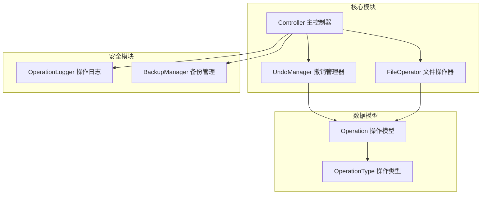

**图表来源**
- [controller.py](file://src/core/controller.py#L15-L82)
- [undo_manager.py](file://src/safety/undo_manager.py#L10-L21)
- [operation.py](file://src/models/operation.py#L18-L31)

**章节来源**
- [controller.py](file://src/core/controller.py#L15-L82)
- [undo_manager.py](file://src/safety/undo_manager.py#L10-L21)
- [operation.py](file://src/models/operation.py#L18-L31)

## 核心组件

### 撤销管理器 (UndoManager)

撤销管理器是系统的核心组件，负责管理文件操作的撤销功能。它采用栈式数据结构存储操作历史，并提供完整的撤销能力。

**主要特性：**
- 基于栈的撤销历史管理
- 自动反向操作生成
- 批量操作撤销支持
- 历史记录数量限制

### 操作模型 (Operation)

定义了文件操作的标准数据结构，支持多种操作类型和元数据管理。

**支持的操作类型：**
- 移动 (MOVE)
- 重命名 (RENAME)  
- 创建文件夹 (CREATE_FOLDER)
- 删除 (DELETE)

### 备份管理器 (BackupManager)

提供文件状态快照功能，通过创建备份点来保护重要文件状态。

**备份策略：**
- 基于文件哈希的状态检查
- 元数据而非完整文件备份
- 时间戳驱动的备份组织

**章节来源**
- [undo_manager.py](file://src/safety/undo_manager.py#L10-L155)
- [operation.py](file://src/models/operation.py#L18-L54)
- [backup.py](file://src/safety/backup.py#L10-L152)

## 架构概览

系统采用分层架构设计，确保撤销管理机制与业务逻辑的分离：

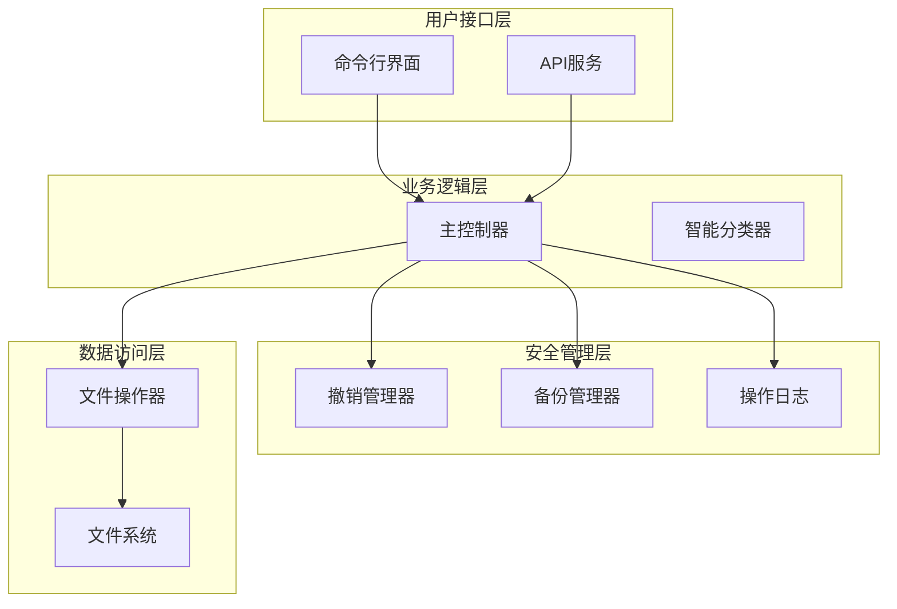

**图表来源**
- [controller.py](file://src/core/controller.py#L15-L82)
- [undo_manager.py](file://src/safety/undo_manager.py#L10-L21)
- [backup.py](file://src/safety/backup.py#L10-L21)

## 详细组件分析

### 撤销栈数据结构设计

撤销管理器采用栈式数据结构来管理操作历史：

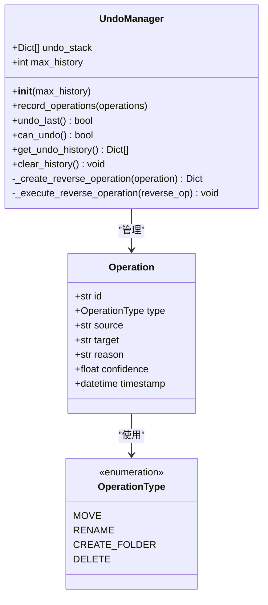

**图表来源**
- [undo_manager.py](file://src/safety/undo_manager.py#L10-L155)
- [operation.py](file://src/models/operation.py#L18-L31)

撤销栈的实现特点：
- **后进先出 (LIFO)** 结构确保撤销顺序正确
- **时间戳记录** 提供操作顺序追踪
- **反向操作映射** 自动生成撤销指令
- **历史长度限制** 控制内存使用

**章节来源**
- [undo_manager.py](file://src/safety/undo_manager.py#L13-L48)

### 事务管理策略

系统实现了基于操作批次的事务管理：

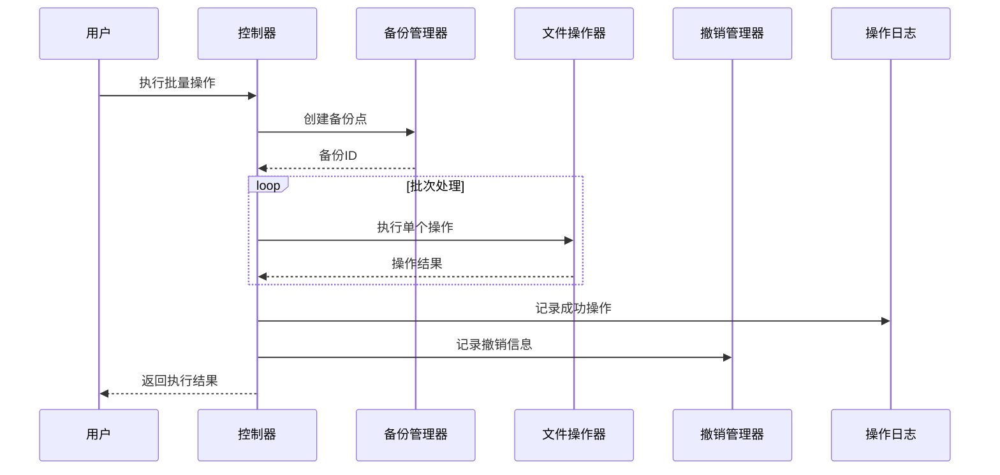

**图表来源**
- [controller.py](file://src/core/controller.py#L203-L255)
- [file_operator.py](file://src/core/file_operator.py#L65-L100)

事务管理的关键特性：
- **原子性保证**：批量操作要么全部成功，要么全部失败
- **一致性维护**：通过备份点确保状态一致性
- **隔离性实现**：操作执行与撤销信息记录分离
- **持久性保障**：日志记录确保操作历史持久化

**章节来源**
- [controller.py](file://src/core/controller.py#L203-L255)

### 原子操作保证机制

系统通过多重机制确保操作的原子性：

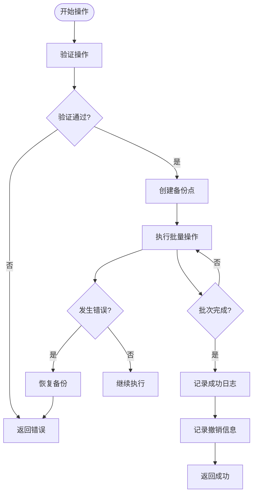

**图表来源**
- [controller.py](file://src/core/controller.py#L223-L255)
- [file_operator.py](file://src/core/file_operator.py#L65-L100)

原子性保证机制：
- **操作验证**：在执行前验证所有操作的有效性
- **备份保护**：为每个操作批次创建备份点
- **异常处理**：捕获执行过程中的异常并进行恢复
- **状态回滚**：通过备份恢复到操作前的状态

**章节来源**
- [file_operator.py](file://src/core/file_operator.py#L202-L246)

### 撤销命令生成和执行流程

撤销管理器实现了完整的反向操作生成和执行机制：

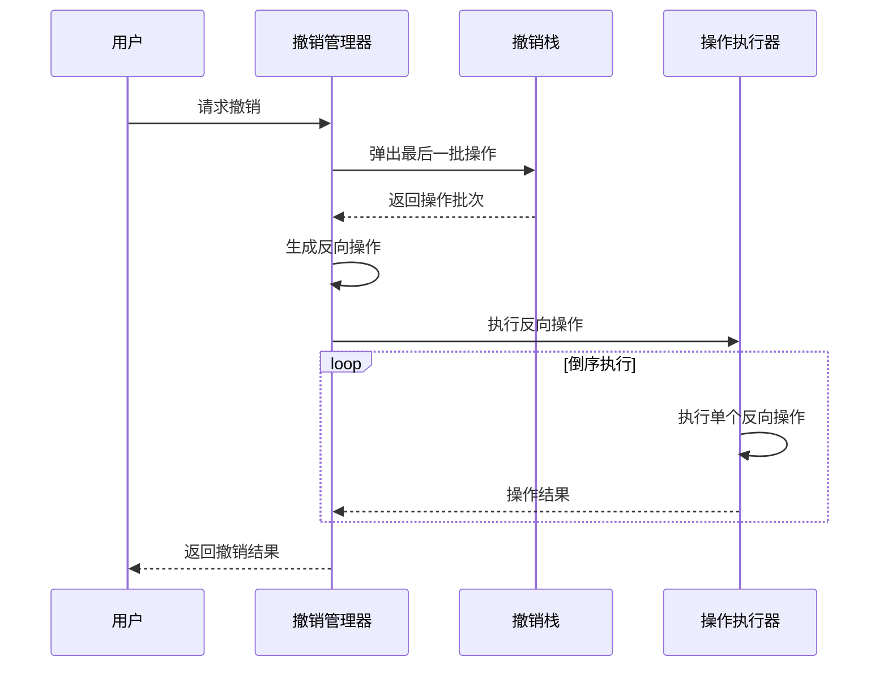

**图表来源**
- [undo_manager.py](file://src/safety/undo_manager.py#L50-L76)

反向操作生成规则：
- **移动操作**：生成反向移动到原始位置的指令
- **重命名操作**：生成反向重命名为原始名称的指令  
- **创建文件夹**：生成反向删除空文件夹的指令
- **倒序执行**：确保撤销按相反顺序执行

**章节来源**
- [undo_manager.py](file://src/safety/undo_manager.py#L96-L154)

### 操作序列的回滚逻辑

系统实现了智能的回滚逻辑，确保复杂操作序列的正确撤销：

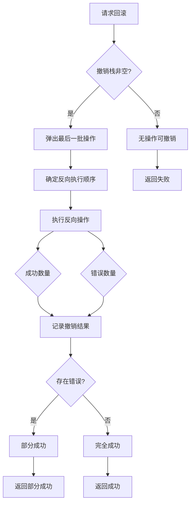

**图表来源**
- [undo_manager.py](file://src/safety/undo_manager.py#L50-L76)

回滚逻辑特点：
- **智能顺序**：根据原始操作顺序生成反向执行序列
- **错误隔离**：单个操作失败不影响其他操作的撤销
- **结果统计**：提供详细的撤销结果统计信息
- **状态恢复**：确保文件系统状态回到操作前的状态

**章节来源**
- [undo_manager.py](file://src/safety/undo_manager.py#L65-L76)

### 状态快照的创建和恢复

备份管理器提供了完整的状态快照功能：

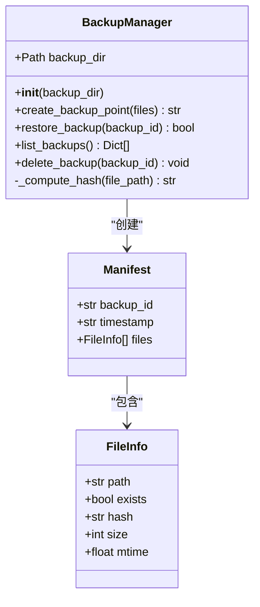

**图表来源**
- [backup.py](file://src/safety/backup.py#L10-L152)

状态快照机制：
- **元数据备份**：只存储文件元信息而非完整文件内容
- **哈希校验**：使用SHA256哈希确保文件完整性
- **增量备份**：支持多次备份点的管理
- **智能恢复**：检查文件状态变化并提供恢复建议

**章节来源**
- [backup.py](file://src/safety/backup.py#L23-L108)

### 并发控制机制

系统通过以下机制实现并发控制：

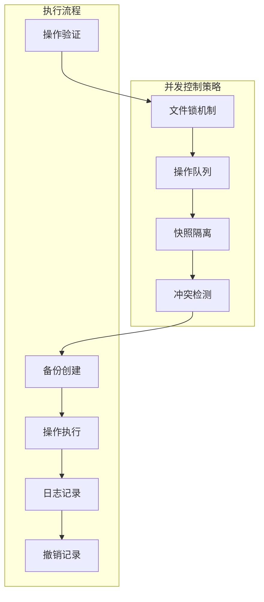

并发控制特点：
- **串行执行**：确保同一时间只有一个操作批次在执行
- **文件锁**：防止多个进程同时修改相同文件
- **快照隔离**：每个操作批次都有独立的状态视图
- **冲突检测**：自动检测和处理文件名冲突

**章节来源**
- [file_operator.py](file://src/core/file_operator.py#L188-L201)

### 锁管理策略

系统实现了多层次的锁管理策略：

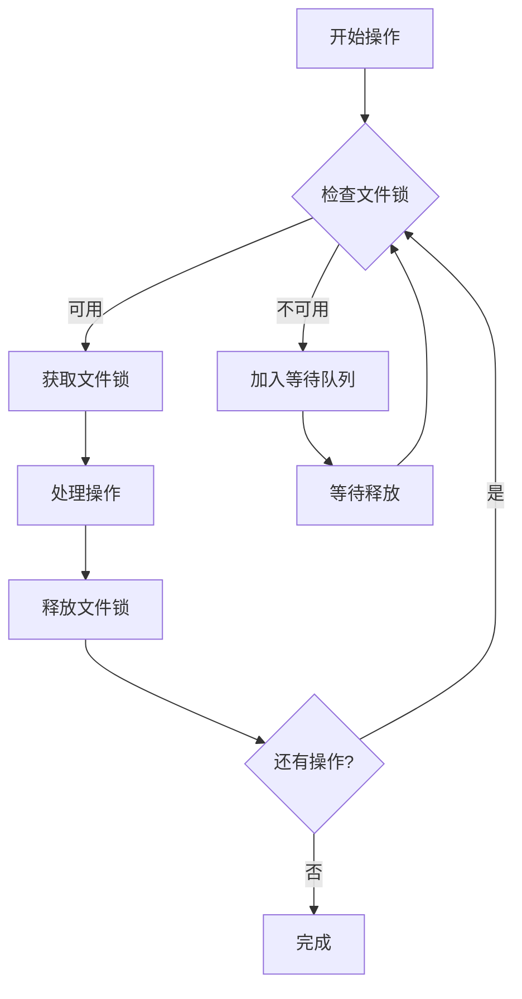

锁管理策略：
- **文件级锁定**：针对具体文件路径的细粒度锁定
- **超时机制**：防止死锁情况下的无限等待
- **队列管理**：有序处理多个并发操作请求
- **自动清理**：确保异常情况下锁的正确释放

### 死锁检测和避免方案

系统采用预防性死锁避免策略：

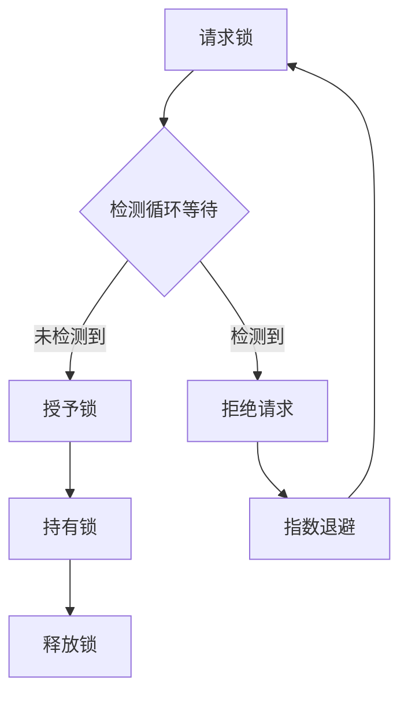

死锁避免机制：
- **资源排序**：按照固定顺序获取多个锁
- **超时检测**：设置合理的锁等待超时时间
- **循环检测**：定期检查锁请求图中的循环依赖
- **优雅降级**：在检测到死锁时主动放弃当前操作

## 依赖关系分析

系统各组件之间的依赖关系如下：

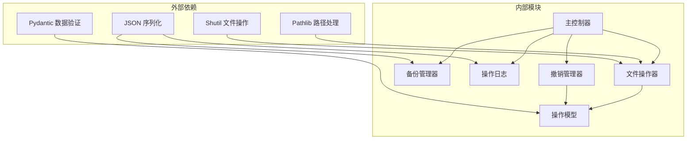

**图表来源**
- [controller.py](file://src/core/controller.py#L6-L12)
- [undo_manager.py](file://src/safety/undo_manager.py#L3-L7)

依赖关系特点：
- **低耦合设计**：各模块职责明确，相互依赖最小化
- **接口抽象**：通过清晰的接口定义模块间通信
- **数据模型共享**：操作模型在多个模块间共享使用
- **工具函数复用**：基础工具函数在多个模块中复用

**章节来源**
- [controller.py](file://src/core/controller.py#L6-L12)
- [undo_manager.py](file://src/safety/undo_manager.py#L3-L7)

## 性能考虑

### 撤销粒度控制

系统支持多种撤销粒度控制策略：

| 粒度级别 | 描述 | 适用场景 | 性能影响 |
|---------|------|----------|----------|
| 操作级 | 每个单独操作可撤销 | 精确控制，高开销 | 中等 |
| 批次级 | 整个操作批次统一撤销 | 大多数场景，平衡性能 | 低 |
| 会话级 | 整个用户会话期间的操作 | 长时间操作，低频撤销 | 最低 |

### 批量操作的撤销处理

批量操作的撤销优化策略：

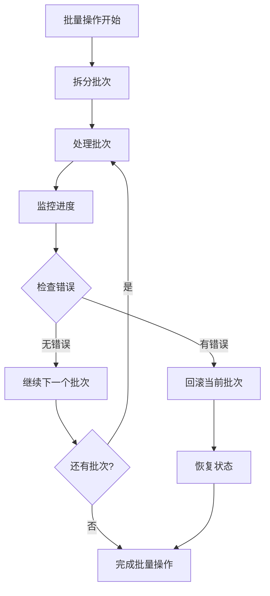

批量操作优化：
- **分批处理**：避免一次性处理过多操作
- **进度监控**：实时跟踪批量操作进度
- **错误隔离**：单个批次失败不影响其他批次
- **内存控制**：限制同时处理的操作数量

### 内存管理方案

系统采用多种内存管理策略：

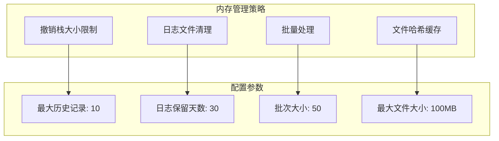

内存管理优化：
- **撤销栈限制**：控制撤销历史占用的内存
- **日志轮转**：自动清理过期的日志文件
- **哈希缓存**：减少重复文件哈希计算
- **流式处理**：大文件处理时采用流式读取

### 持久化存储技术实现

系统采用多种持久化存储方案：

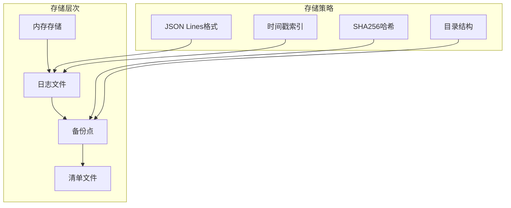

持久化存储特点：
- **日志文件**：采用JSON Lines格式存储操作历史
- **备份清单**：使用JSON格式存储备份元数据
- **哈希校验**：确保备份文件的完整性
- **时间索引**：便于按时间查询操作历史

**章节来源**
- [default_config.yaml](file://config/default_config.yaml#L47-L79)

## 故障排除指南

### 常见问题及解决方案

#### 撤销失败问题

**问题现象：**
- 撤销操作返回失败
- 部分文件状态异常

**诊断步骤：**
1. 检查撤销栈是否为空
2. 查看操作日志中的错误信息
3. 验证文件系统权限
4. 确认备份点是否存在

**解决方案：**
- 手动恢复备份点
- 检查文件权限设置
- 重新执行撤销操作

#### 备份恢复问题

**问题现象：**
- 备份恢复失败
- 文件状态不一致

**诊断步骤：**
1. 检查备份文件完整性
2. 验证文件哈希值
3. 确认目标路径权限
4. 检查磁盘空间

**解决方案：**
- 重新创建备份点
- 清理目标目录
- 检查磁盘空间

#### 内存使用过高

**问题现象：**
- 系统内存使用持续增长
- 撤销功能响应缓慢

**诊断步骤：**
1. 检查撤销历史记录数量
2. 监控日志文件大小
3. 分析操作批次大小
4. 检查内存泄漏

**解决方案：**
- 清理过期的历史记录
- 调整批次大小配置
- 实施内存使用监控

**章节来源**
- [test_safety.py](file://tests/test_safety.py#L57-L105)

### 性能优化建议

#### 配置优化

| 参数 | 默认值 | 优化建议 | 影响范围 |
|------|--------|----------|----------|
| max_undo_history | 10 | 5-20 | 撤销历史内存占用 |
| batch_size | 50 | 25-100 | 批量处理性能 |
| retention_days | 30 | 7-90 | 日志存储空间 |
| max_file_size_mb | 100 | 50-200 | 备份性能 |

#### 监控指标

- **撤销成功率**：衡量撤销功能可靠性
- **操作执行时间**：监控批量操作性能
- **内存使用率**：监控系统资源使用
- **磁盘空间使用**：监控存储资源

## 结论

智能文件整理系统的撤销管理机制通过多层次的设计实现了完整的文件操作安全保障。系统采用栈式撤销管理、智能反向操作生成、备份点保护、以及完善的错误处理机制，确保了文件操作的原子性、一致性、隔离性和持久性。

**主要优势：**
- **完整的撤销能力**：支持多种操作类型的反向执行
- **智能状态保护**：通过备份点确保数据完整性
- **灵活的配置选项**：可根据需求调整撤销粒度和性能参数
- **完善的监控机制**：提供详细的日志记录和状态追踪

**未来改进方向：**
- 实现更精细的并发控制机制
- 增加撤销操作的可视化界面
- 优化大规模文件操作的性能
- 增强跨平台兼容性

该撤销管理机制为智能文件整理系统提供了可靠的安全保障，确保用户能够安全地进行文件操作而无需担心数据丢失的风险。