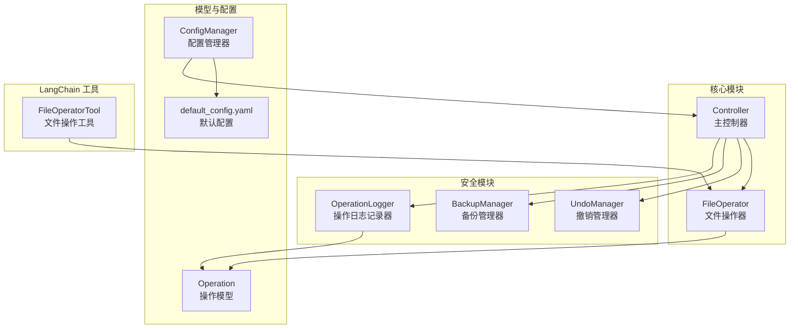
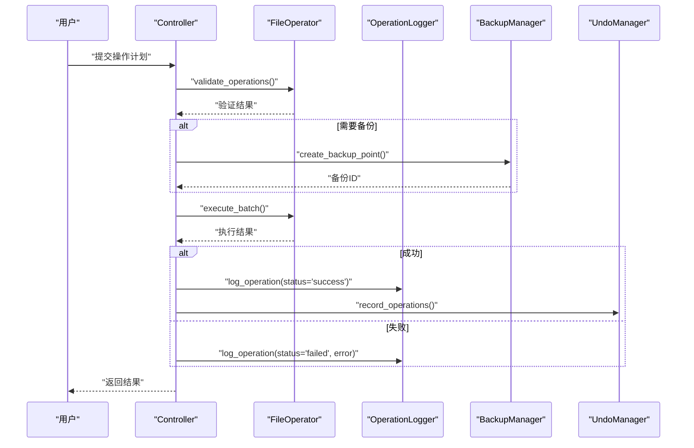
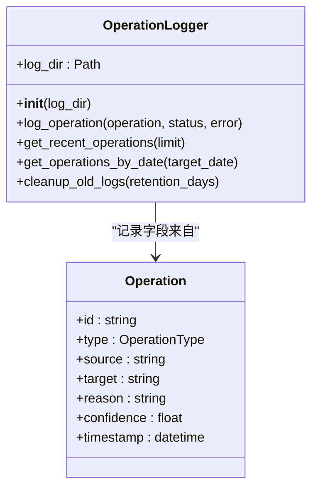
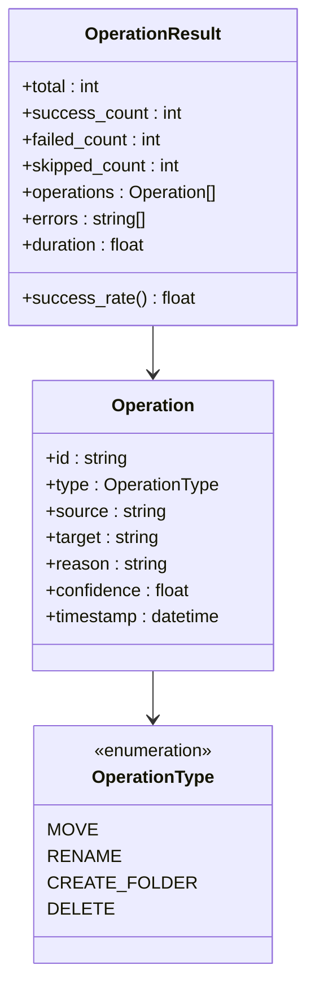
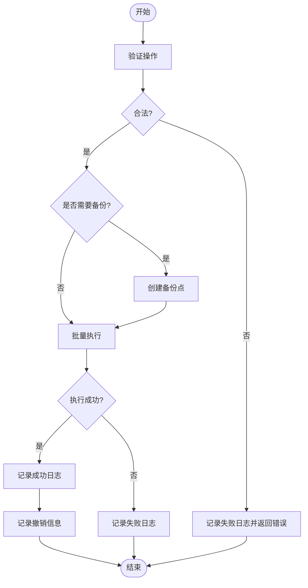
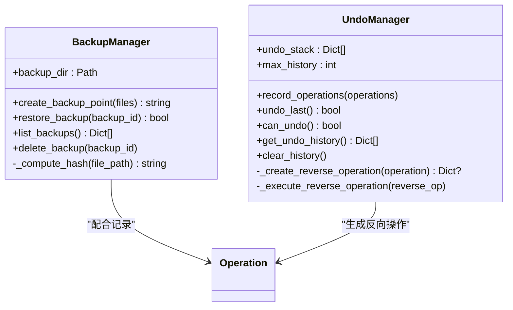
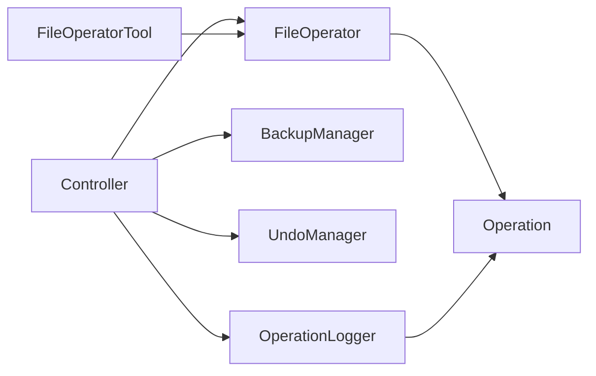

# 操作日志记录

<cite>
**本文引用的文件**
- [src/safety/operation_log.py](file://src/safety/operation_log.py)
- [src/models/operation.py](file://src/models/operation.py)
- [src/core/controller.py](file://src/core/controller.py)
- [src/core/file_operator.py](file://src/core/file_operator.py)
- [src/safety/backup.py](file://src/safety/backup.py)
- [src/safety/undo_manager.py](file://src/safety/undo_manager.py)
- [config/default_config.yaml](file://config/default_config.yaml)
- [src/utils/config.py](file://src/utils/config.py)
- [src/langchain_integration/tools/file_operator_tool.py](file://src/langchain_integration/tools/file_operator_tool.py)
</cite>

## 目录
1. [简介](#简介)
2. [项目结构](#项目结构)
3. [核心组件](#核心组件)
4. [架构总览](#架构总览)
5. [详细组件分析](#详细组件分析)
6. [依赖关系分析](#依赖关系分析)
7. [性能考量](#性能考量)
8. [故障排查指南](#故障排查指南)
9. [结论](#结论)
10. [附录](#附录)

## 简介
本文件围绕“操作日志记录系统”展开，系统性阐述操作日志的完整生命周期管理，包括事件捕获、格式标准化、级别分类、时间戳精确记录；审计追踪与操作上下文信息收集、用户行为分析与异常事件标记；日志存储策略、轮转与清理、存储空间控制与压缩方案；日志查询接口设计、分析工具集成与合规性满足；以及日志配置选项、性能监控指标与安全保护措施。

## 项目结构
该系统位于安全子模块中，围绕操作日志、备份与撤销管理协同工作，形成完整的操作审计与回溯能力。核心文件分布如下：
- 日志记录：src/safety/operation_log.py
- 操作数据模型：src/models/operation.py
- 控制器与执行链路：src/core/controller.py、src/core/file_operator.py
- 备份与撤销：src/safety/backup.py、src/safety/undo_manager.py
- 配置与默认配置：src/utils/config.py、config/default_config.yaml
- LangChain 工具链集成：src/langchain_integration/tools/file_operator_tool.py

图表来源
- [src/safety/operation_log.py](file://src/safety/operation_log.py#L1-L133)
- [src/models/operation.py](file://src/models/operation.py#L1-L54)
- [src/core/controller.py](file://src/core/controller.py#L1-L200)
- [src/core/file_operator.py](file://src/core/file_operator.py#L1-L200)
- [src/safety/backup.py](file://src/safety/backup.py#L1-L152)
- [src/safety/undo_manager.py](file://src/safety/undo_manager.py#L1-L155)
- [src/utils/config.py](file://src/utils/config.py#L1-L116)
- [config/default_config.yaml](file://config/default_config.yaml#L1-L79)
- [src/langchain_integration/tools/file_operator_tool.py](file://src/langchain_integration/tools/file_operator_tool.py#L1-L148)

章节来源
- [src/safety/operation_log.py](file://src/safety/operation_log.py#L1-L133)
- [src/models/operation.py](file://src/models/operation.py#L1-L54)
- [src/core/controller.py](file://src/core/controller.py#L1-L200)
- [src/core/file_operator.py](file://src/core/file_operator.py#L1-L200)
- [src/safety/backup.py](file://src/safety/backup.py#L1-L152)
- [src/safety/undo_manager.py](file://src/safety/undo_manager.py#L1-L155)
- [src/utils/config.py](file://src/utils/config.py#L1-L116)
- [config/default_config.yaml](file://config/default_config.yaml#L1-L79)
- [src/langchain_integration/tools/file_operator_tool.py](file://src/langchain_integration/tools/file_operator_tool.py#L1-L148)

## 核心组件
- 操作日志记录器（OperationLogger）：负责将每次操作写入按日期分割的 JSONL 文件，包含时间戳、操作 ID、类型、源/目标路径、原因、状态与错误信息。
- 操作数据模型（Operation）：统一描述操作类型、源/目标路径、置信度、原因与时间戳，支撑日志标准化与查询。
- 主控制器（Controller）：协调扫描、分类、执行与日志记录，确保成功/失败均被记录，并维护撤销栈。
- 文件操作器（FileOperator）：执行具体文件系统操作，支持预览、批量执行与冲突处理。
- 备份管理器（BackupManager）：创建备份点，记录文件清单与校验信息，支持恢复与清理。
- 撤销管理器（UndoManager）：记录可逆操作序列，生成反向操作并支持撤销。
- 配置系统（ConfigManager + default_config.yaml）：集中管理日志级别、日志目录、保留天数、格式等。

章节来源
- [src/safety/operation_log.py](file://src/safety/operation_log.py#L11-L133)
- [src/models/operation.py](file://src/models/operation.py#L18-L54)
- [src/core/controller.py](file://src/core/controller.py#L15-L82)
- [src/core/file_operator.py](file://src/core/file_operator.py#L12-L200)
- [src/safety/backup.py](file://src/safety/backup.py#L10-L152)
- [src/safety/undo_manager.py](file://src/safety/undo_manager.py#L10-L155)
- [src/utils/config.py](file://src/utils/config.py#L10-L116)
- [config/default_config.yaml](file://config/default_config.yaml#L73-L79)

## 架构总览
操作日志贯穿“生成方案—验证—执行—记录—审计”的闭环：
- 生成方案阶段：记录交互上下文（由分类器与对话管理器维护）。
- 验证阶段：FileOperator 对单个操作进行合法性检查，返回验证结果。
- 执行阶段：Controller 调用 FileOperator 批量执行，成功/失败分别记录日志。
- 审计阶段：OperationLogger 按日期落盘；BackupManager 记录备份点；UndoManager 记录可撤销操作序列。
- 查询阶段：OperationLogger 提供最近记录与按日期查询接口；支持定期清理旧日志。

图表来源
- [src/core/controller.py](file://src/core/controller.py#L209-L250)
- [src/core/file_operator.py](file://src/core/file_operator.py#L65-L100)
- [src/safety/operation_log.py](file://src/safety/operation_log.py#L24-L52)
- [src/safety/backup.py](file://src/safety/backup.py#L23-L70)
- [src/safety/undo_manager.py](file://src/safety/undo_manager.py#L23-L48)

## 详细组件分析

### 操作日志记录器（OperationLogger）
- 事件捕获：在 Controller 执行前后调用，覆盖成功与失败两种状态，必要时附带错误信息。
- 格式标准化：采用 JSONL（每行一个 JSON 对象），字段包含时间戳、操作 ID、类型、源/目标、原因、状态、错误。
- 时间戳精确：使用 ISO8601 格式，保证跨系统一致性。
- 存储策略：按日期分文件（YYYY-MM-DD.jsonl），便于按日检索与轮转。
- 查询接口：提供最近 N 条记录与按指定日期查询；内部最多遍历最近 7 天文件。
- 清理策略：按保留天数删除过期日志文件，基于文件名解析日期。

图表来源
- [src/safety/operation_log.py](file://src/safety/operation_log.py#L11-L133)
- [src/models/operation.py](file://src/models/operation.py#L18-L31)

章节来源
- [src/safety/operation_log.py](file://src/safety/operation_log.py#L14-L133)
- [src/models/operation.py](file://src/models/operation.py#L18-L31)

### 操作数据模型（Operation）
- 类型与枚举：OperationType 定义 move、rename、create_folder、delete 等类型，统一序列化与查询。
- 关键字段：包含操作 ID、类型、源/目标路径、原因、置信度、时间戳，支撑审计与回溯。
- 结果聚合：OperationResult 聚合批量执行统计与错误列表，便于日志与报告输出。

图表来源
- [src/models/operation.py](file://src/models/operation.py#L10-L54)

章节来源
- [src/models/operation.py](file://src/models/operation.py#L10-L54)

### 主控制器与执行链路（Controller + FileOperator）
- 验证与执行：先验证操作合法性，再按批次执行；成功记录日志并入撤销栈，失败记录错误并可选回滚。
- 配置驱动：从 ConfigManager 读取批量大小等参数，确保执行粒度可控。
- 与 LangChain 工具协作：FileOperatorTool 在 Agent 场景下执行具体文件操作，同样遵循验证—执行—记录—撤销流程。

图表来源
- [src/core/controller.py](file://src/core/controller.py#L209-L250)
- [src/core/file_operator.py](file://src/core/file_operator.py#L65-L100)
- [src/safety/operation_log.py](file://src/safety/operation_log.py#L24-L52)
- [src/safety/undo_manager.py](file://src/safety/undo_manager.py#L23-L48)

章节来源
- [src/core/controller.py](file://src/core/controller.py#L209-L250)
- [src/core/file_operator.py](file://src/core/file_operator.py#L65-L100)
- [src/langchain_integration/tools/file_operator_tool.py](file://src/langchain_integration/tools/file_operator_tool.py#L60-L148)

### 备份与撤销管理（BackupManager + UndoManager）
- 备份策略：以“清单（manifest）+文件元信息”形式记录，避免复制大文件，节省空间；支持列出、删除与恢复前的状态检查。
- 撤销策略：记录可逆操作序列，生成反向操作并倒序执行，支持历史查看与清空。

图表来源
- [src/safety/backup.py](file://src/safety/backup.py#L10-L152)
- [src/safety/undo_manager.py](file://src/safety/undo_manager.py#L10-L155)

章节来源
- [src/safety/backup.py](file://src/safety/backup.py#L10-L152)
- [src/safety/undo_manager.py](file://src/safety/undo_manager.py#L10-L155)

### 配置与默认配置（ConfigManager + default_config.yaml）
- 日志配置项：日志级别、日志目录、保留天数、格式模板，均由 default_config.yaml 提供默认值，ConfigManager 支持读取与覆盖。
- 运行时注入：Controller 与 OperationLogger 通过配置读取日志目录与保留策略，确保部署一致性。

章节来源
- [config/default_config.yaml](file://config/default_config.yaml#L73-L79)
- [src/utils/config.py](file://src/utils/config.py#L35-L75)
- [src/safety/operation_log.py](file://src/safety/operation_log.py#L14-L22)

## 依赖关系分析
- 控制器依赖：Controller 同时依赖 OperationLogger、BackupManager、UndoManager 与 FileOperator，形成“执行—审计—回溯”的闭环。
- 模型依赖：Operation 作为日志与结果聚合的核心载体，贯穿各模块。
- 工具链依赖：LangChain 的 FileOperatorTool 在 Agent 场景下复用 FileOperator，保持一致的验证—执行—记录流程。

图表来源
- [src/core/controller.py](file://src/core/controller.py#L12-L78)
- [src/core/file_operator.py](file://src/core/file_operator.py#L12-L23)
- [src/safety/operation_log.py](file://src/safety/operation_log.py#L8-L8)
- [src/models/operation.py](file://src/models/operation.py#L18-L31)
- [src/langchain_integration/tools/file_operator_tool.py](file://src/langchain_integration/tools/file_operator_tool.py#L14-L15)

章节来源
- [src/core/controller.py](file://src/core/controller.py#L12-L78)
- [src/core/file_operator.py](file://src/core/file_operator.py#L12-L23)
- [src/safety/operation_log.py](file://src/safety/operation_log.py#L8-L8)
- [src/models/operation.py](file://src/models/operation.py#L18-L31)
- [src/langchain_integration/tools/file_operator_tool.py](file://src/langchain_integration/tools/file_operator_tool.py#L14-L15)

## 性能考量
- I/O 模式：日志采用 JSONL 行式存储，逐条追加写入，适合高吞吐场景；按日切分减少单文件尺寸。
- 查询复杂度：最近记录查询按文件名排序后顺序读取，最多遍历最近 7 天文件，时间复杂度近似 O(N)（N 为行数）。
- 存储开销：备份采用清单与校验，避免复制大文件；日志按天切分，结合保留天数清理，降低长期存储压力。
- 并发与线程安全：当前实现未显式加锁，若需并发写入建议引入外部日志队列或在应用层串行化写入。
- 批处理：FileOperator 以批次执行，减少系统调用次数，提升整体吞吐。

[本节为通用性能讨论，无需特定文件引用]

## 故障排查指南
- 日志写入失败：检查日志目录权限与磁盘空间；确认路径存在且可写。
- 查询不到日志：确认目标日期文件是否存在；检查文件名格式（YYYY-MM-DD.jsonl）。
- 旧日志未清理：确认保留天数配置与系统日期；检查文件名解析是否符合 ISO 日期格式。
- 执行失败但无日志：确认 Controller 的异常分支是否调用了失败日志记录；检查异常堆栈是否被捕获。
- 备份/撤销异常：核对备份清单完整性与文件状态；撤销时注意反向操作的前置条件（如源文件存在性）。

章节来源
- [src/safety/operation_log.py](file://src/safety/operation_log.py#L80-L82)
- [src/safety/operation_log.py](file://src/safety/operation_log.py#L122-L132)
- [src/core/controller.py](file://src/core/controller.py#L243-L250)
- [src/safety/backup.py](file://src/safety/backup.py#L82-L108)
- [src/safety/undo_manager.py](file://src/safety/undo_manager.py#L65-L76)

## 结论
该操作日志记录系统以 JSONL 按日分片存储为核心，结合验证—执行—记录—审计—回溯的完整链路，实现了可追溯、可查询、可清理的日志生命周期管理。通过配置中心统一管理日志策略，辅以备份与撤销机制，满足基本的审计与合规需求。为进一步增强能力，可在现有基础上引入结构化索引、压缩归档、集中采集与可视化分析平台。

[本节为总结性内容，无需特定文件引用]

## 附录

### 日志格式与字段说明
- 字段：timestamp、operation_id、type、source、target、reason、status、error
- 格式：JSONL（每行一条记录）
- 切分：按日期（YYYY-MM-DD）切分为独立文件

章节来源
- [src/safety/operation_log.py](file://src/safety/operation_log.py#L38-L52)

### 日志查询接口设计要点
- 最近记录：按文件名降序遍历最近 7 天，逐行解析至达到上限。
- 指定日期：直接读取对应日期文件，逐行解析。
- 扩展建议：增加索引文件或数据库映射，支持按操作类型、状态、时间范围快速检索。

章节来源
- [src/safety/operation_log.py](file://src/safety/operation_log.py#L54-L83)
- [src/safety/operation_log.py](file://src/safety/operation_log.py#L85-L109)

### 存储策略与轮转机制
- 存储：按日文件存储，避免单文件过大。
- 轮转：通过保留天数自动清理过期文件。
- 压缩：当前未实现压缩；建议在离线归档阶段采用压缩归档，以降低长期存储成本。

章节来源
- [src/safety/operation_log.py](file://src/safety/operation_log.py#L111-L133)
- [config/default_config.yaml](file://config/default_config.yaml#L77-L78)

### 审计追踪与异常事件标记
- 审计：记录操作上下文（类型、源/目标、原因、时间戳、状态），支持回溯。
- 异常：失败时记录错误信息；备份与撤销提供回滚与恢复依据。

章节来源
- [src/core/controller.py](file://src/core/controller.py#L234-L246)
- [src/safety/backup.py](file://src/safety/backup.py#L23-L70)
- [src/safety/undo_manager.py](file://src/safety/undo_manager.py#L23-L48)

### 日志配置选项
- 日志级别：INFO（由 default_config.yaml 提供）
- 日志目录：data/logs（可配置）
- 保留天数：30 天（可配置）
- 格式模板：asctime、name、levelname、message（由 default_config.yaml 提供）

章节来源
- [config/default_config.yaml](file://config/default_config.yaml#L75-L78)
- [src/utils/config.py](file://src/utils/config.py#L35-L75)

### 性能监控指标
- 日志写入延迟：单条日志写入耗时（建议在应用层埋点）
- 日志文件大小：按日统计，评估轮转频率
- 查询响应时间：最近记录与按日查询的平均耗时
- 备份/撤销耗时：创建备份点与撤销操作的耗时

[本节为通用指标建议，无需特定文件引用]

### 日志安全保护措施
- 访问控制：限制日志目录访问权限，仅授权用户可读取
- 数据脱敏：对敏感路径与原因字段进行脱敏处理
- 传输加密：如需远程采集，建议通过 HTTPS/TLS 传输
- 完整性校验：结合备份清单与哈希校验，防止篡改

[本节为通用安全建议，无需特定文件引用]