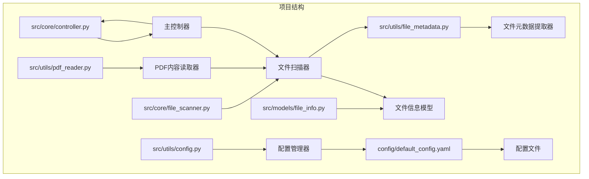
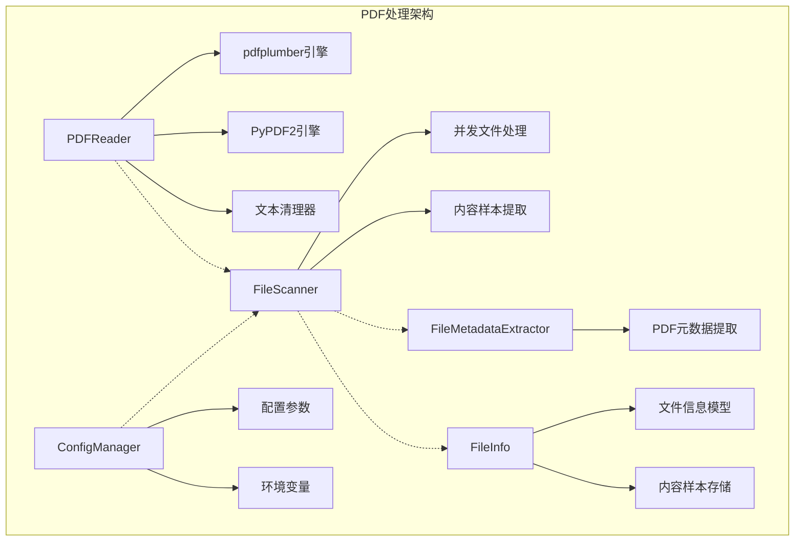
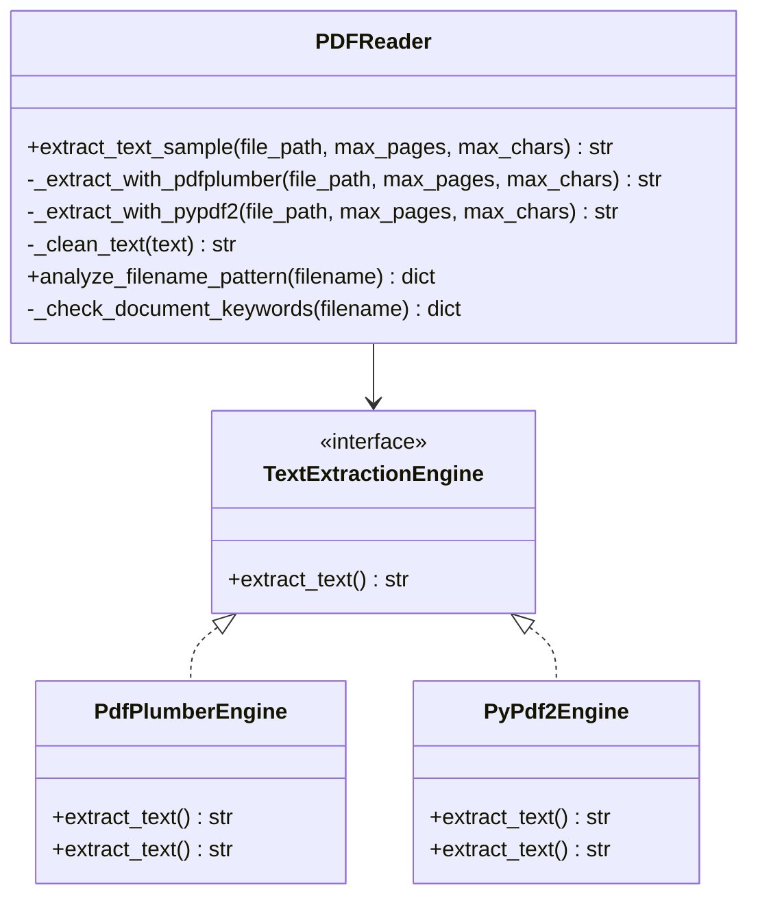
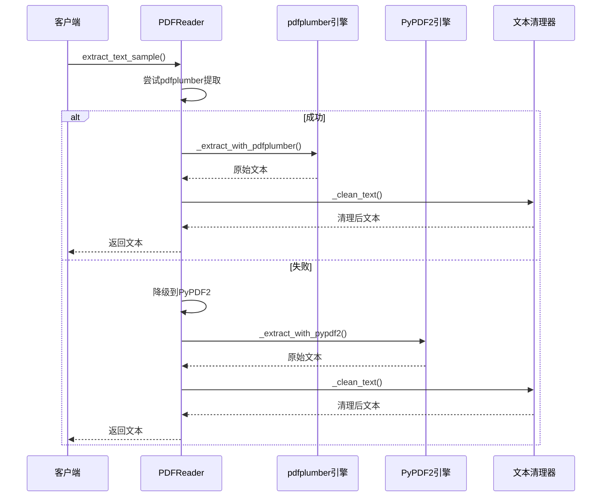
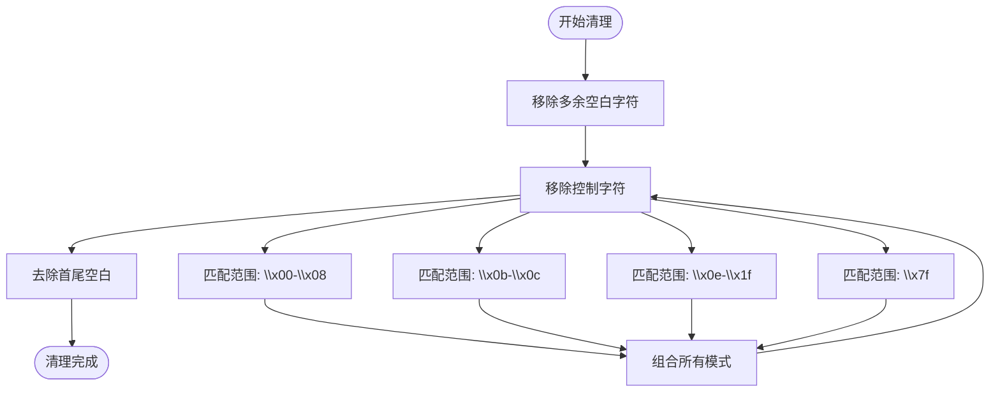
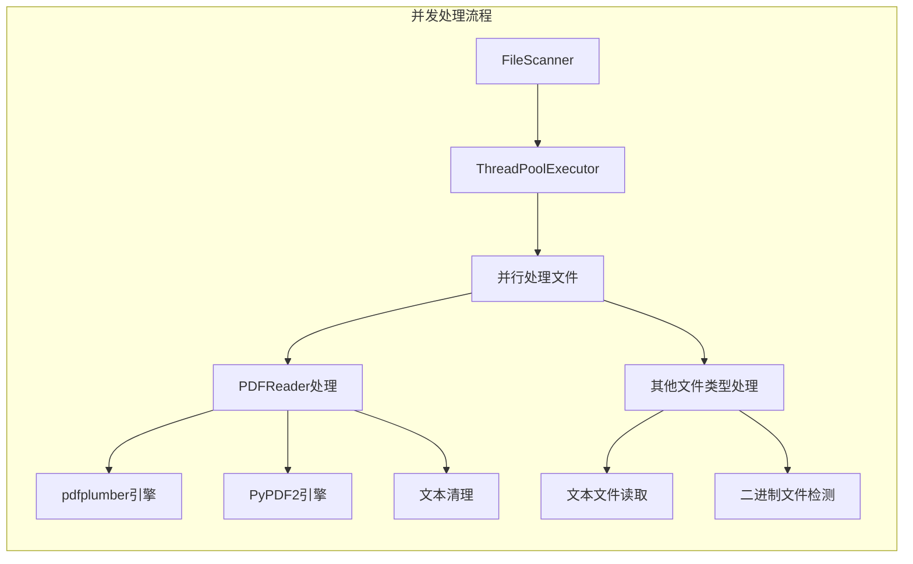
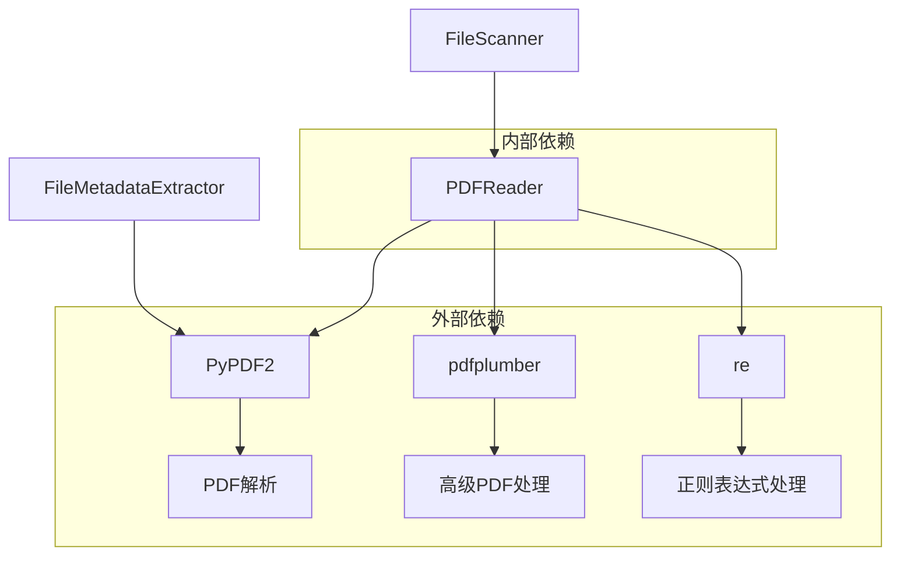
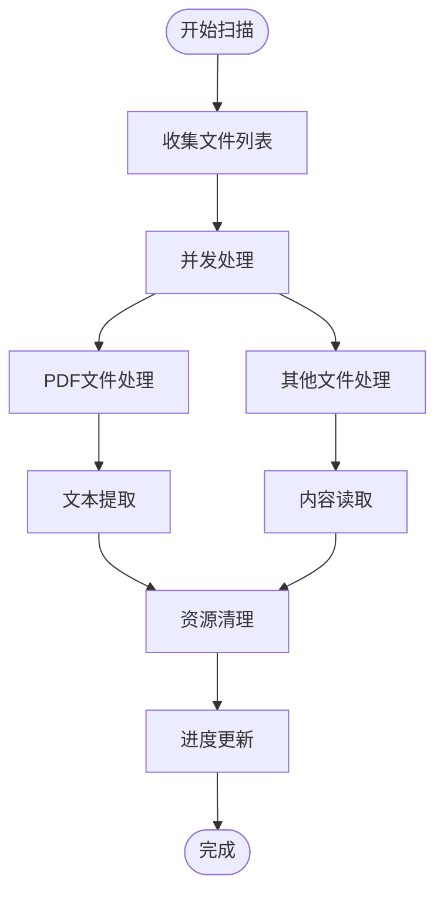
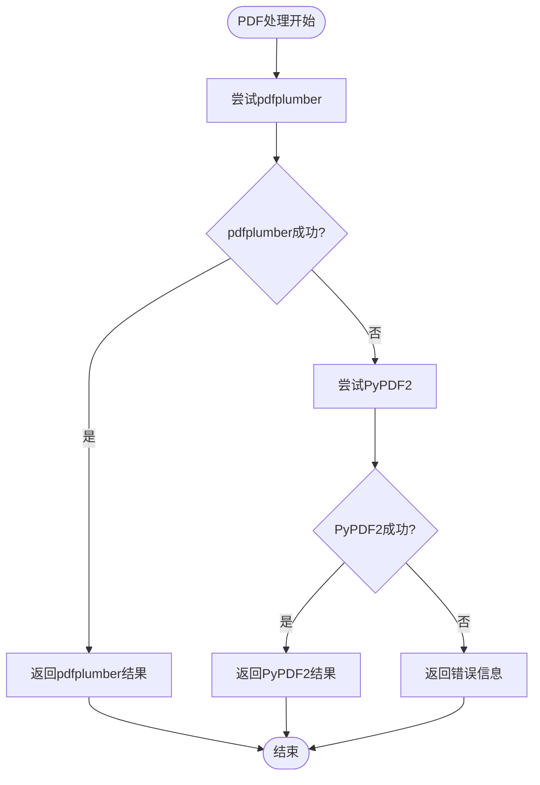

# PDF内容读取器

<cite>
**本文档引用的文件**
- [src/utils/pdf_reader.py](file://src/utils/pdf_reader.py)
- [src/core/file_scanner.py](file://src/core/file_scanner.py)
- [src/utils/file_metadata.py](file://src/utils/file_metadata.py)
- [src/models/file_info.py](file://src/models/file_info.py)
- [src/core/controller.py](file://src/core/controller.py)
- [config/default_config.yaml](file://config/default_config.yaml)
- [src/utils/config.py](file://src/utils/config.py)
- [requirements.txt](file://requirements.txt)
- [README.md](file://README.md)
- [examples/basic_usage.py](file://examples/basic_usage.py)
- [tests/test_file_scanner.py](file://tests/test_file_scanner.py)
</cite>

## 目录
1. [简介](#简介)
2. [项目结构](#项目结构)
3. [核心组件](#核心组件)
4. [架构概览](#架构概览)
5. [详细组件分析](#详细组件分析)
6. [依赖关系分析](#依赖关系分析)
7. [性能考虑](#性能考虑)
8. [故障排除指南](#故障排除指南)
9. [结论](#结论)
10. [附录](#附录)

## 简介
本文档详细介绍Smart File Tidy项目中的PDF内容读取器实现。该项目是一个基于AI的智能文件分类和整理工具，支持自然语言交互，能够高效管理本地文件。PDF内容读取器是整个系统的核心组件之一，负责从PDF文件中提取文本内容，为后续的文件分类和智能整理提供基础数据。

PDF内容读取器采用了双引擎架构，优先使用pdfplumber进行文本提取，当遇到异常时自动降级到PyPDF2，确保在各种PDF格式下都能获得稳定的文本提取效果。该实现不仅关注功能完整性，还特别注重错误处理、性能优化和兼容性。

## 项目结构
Smart File Tidy项目采用模块化设计，PDF相关内容读取器位于工具层，与核心业务逻辑分离，便于维护和扩展。



**图表来源**
- [src/utils/pdf_reader.py](file://src/utils/pdf_reader.py#L1-L113)
- [src/core/file_scanner.py](file://src/core/file_scanner.py#L1-L196)
- [src/utils/file_metadata.py](file://src/utils/file_metadata.py#L1-L82)

**章节来源**
- [src/utils/pdf_reader.py](file://src/utils/pdf_reader.py#L1-L113)
- [src/core/file_scanner.py](file://src/core/file_scanner.py#L1-L196)
- [config/default_config.yaml](file://config/default_config.yaml#L1-L79)

## 核心组件
PDF内容读取器主要包含以下核心组件：

### PDFReader类
PDFReader类是整个PDF处理系统的核心，提供了完整的文本提取功能。该类采用静态方法设计，避免了实例化的需求，同时提供了丰富的辅助功能。

### 双引擎架构
系统实现了双引擎架构，优先使用pdfplumber进行文本提取，当遇到异常时自动降级到PyPDF2。这种设计确保了在各种PDF格式下都能获得稳定的文本提取效果。

### 文本清理机制
实现了专门的文本清理功能，能够去除多余的空白字符和特殊控制字符，提高提取文本的质量。

**章节来源**
- [src/utils/pdf_reader.py](file://src/utils/pdf_reader.py#L10-L113)

## 架构概览
PDF内容读取器在整个系统架构中扮演着重要角色，它与文件扫描器、文件信息模型、配置管理器等多个组件协同工作。



**图表来源**
- [src/utils/pdf_reader.py](file://src/utils/pdf_reader.py#L10-L113)
- [src/core/file_scanner.py](file://src/core/file_scanner.py#L13-L196)
- [src/utils/file_metadata.py](file://src/utils/file_metadata.py#L10-L82)
- [src/utils/config.py](file://src/utils/config.py#L10-L116)

## 详细组件分析

### PDFReader类详细分析

#### 核心功能架构
PDFReader类采用了简洁而高效的架构设计，主要包含三个核心方法：



**图表来源**
- [src/utils/pdf_reader.py](file://src/utils/pdf_reader.py#L10-L113)

#### 文本提取流程
PDFReader的文本提取流程体现了优雅的设计理念，通过双引擎架构确保了高可靠性：



**图表来源**
- [src/utils/pdf_reader.py](file://src/utils/pdf_reader.py#L13-L24)

#### 文本清理算法
文本清理器实现了高效的文本净化算法，能够处理各种特殊字符和格式问题：



**图表来源**
- [src/utils/pdf_reader.py](file://src/utils/pdf_reader.py#L72-L78)

**章节来源**
- [src/utils/pdf_reader.py](file://src/utils/pdf_reader.py#L10-L113)

### 文件扫描器集成分析

#### 并发处理架构
文件扫描器与PDF读取器的集成体现了现代Python应用的最佳实践，采用了线程池并发处理：



**图表来源**
- [src/core/file_scanner.py](file://src/core/file_scanner.py#L61-L83)
- [src/core/file_scanner.py](file://src/core/file_scanner.py#L154-L168)

#### 内容采样策略
文件扫描器实现了智能的内容采样策略，平衡了性能和准确性：

**章节来源**
- [src/core/file_scanner.py](file://src/core/file_scanner.py#L13-L196)

### 配置管理系统
PDF读取器与配置管理系统的集成确保了灵活的参数控制：

**章节来源**
- [src/utils/config.py](file://src/utils/config.py#L10-L116)
- [config/default_config.yaml](file://config/default_config.yaml#L1-L79)

## 依赖关系分析

### 核心依赖关系
PDF内容读取器的依赖关系相对简洁，主要依赖于两个强大的PDF处理库：



**图表来源**
- [requirements.txt](file://requirements.txt#L12-L13)
- [src/utils/pdf_reader.py](file://src/utils/pdf_reader.py#L3-L7)

### 版本兼容性
项目对依赖库的版本要求体现了对稳定性的重视：

**章节来源**
- [requirements.txt](file://requirements.txt#L1-L43)

## 性能考虑

### 内存管理策略
PDF读取器采用了多种内存管理策略来确保在处理大型PDF文件时的稳定性：

1. **流式处理**: 使用with语句确保文件资源及时释放
2. **分页处理**: 限制最大页数，避免一次性加载过多内容
3. **字符限制**: 通过max_chars参数控制输出长度
4. **异常隔离**: 每个引擎独立处理，避免相互影响

### 并发处理优化
文件扫描器的并发处理机制显著提升了整体性能：



**图表来源**
- [src/core/file_scanner.py](file://src/core/file_scanner.py#L61-L83)

### 性能基准
根据项目文档，系统具备优秀的性能表现：

- **扫描速度**: 并发处理，约1000文件/秒
- **内存占用**: 低内存占用，适合大规模操作
- **启动时间**: <1秒（不含AI调用）

**章节来源**
- [IMPLEMENTATION_SUMMARY.md](file://IMPLEMENTATION_SUMMARY.md#L318-L325)

## 故障排除指南

### 常见问题及解决方案

#### PDF格式兼容性问题
系统通过双引擎架构解决了大部分PDF格式兼容性问题：

1. **扫描版PDF**: pdfplumber通常能更好地处理扫描版PDF
2. **纯文本PDF**: 两种引擎都能有效处理
3. **混合内容PDF**: pdfplumber在复杂布局处理方面更优

#### 错误恢复机制
PDF读取器实现了完善的错误恢复机制：



**图表来源**
- [src/utils/pdf_reader.py](file://src/utils/pdf_reader.py#L13-L24)

#### 配置优化建议
根据配置文件，可以进行以下优化：

1. **调整最大文件大小**: 通过`max_file_size_mb`参数控制内容提取
2. **优化批处理大小**: 通过`batch_size`参数调整处理效率
3. **设置扫描深度**: 通过`scan_max_depth`参数控制扫描范围

**章节来源**
- [config/default_config.yaml](file://config/default_config.yaml#L48-L51)
- [src/utils/pdf_reader.py](file://src/utils/pdf_reader.py#L13-L24)

## 结论
Smart File Tidy项目的PDF内容读取器展现了现代Python应用开发的最佳实践。通过双引擎架构、完善的错误处理机制、智能的内存管理和高效的并发处理，该系统能够在各种复杂的PDF处理场景中提供稳定可靠的服务。

该实现不仅满足了当前的功能需求，还为未来的扩展和优化奠定了坚实的基础。其模块化的架构设计使得添加新的PDF处理功能变得相对简单，同时保持了系统的整体稳定性。

## 附录

### 实际使用示例

#### 基本文本提取
```python
# 基本使用示例
from src.utils.pdf_reader import PDFReader

# 提取PDF文本样本
text = PDFReader.extract_text_sample('document.pdf', max_pages=3, max_chars=2000)
print(text)
```

#### 集成到文件扫描
```python
# 在文件扫描中使用PDF读取器
from src.core.file_scanner import FileScanner

scanner = FileScanner(max_file_size_mb=50)
files = scanner.scan_directory('/path/to/documents', include_content=True)
```

#### 配置优化
```python
# 通过配置管理器优化PDF处理
from src.utils.config import ConfigManager

config = ConfigManager()
pdf_config = config.get('file_operations.max_file_size_mb', 100)
```

### 扩展定制方法

#### 自定义PDF处理引擎
可以通过继承PDFReader类来实现自定义的PDF处理逻辑：

```python
class CustomPDFReader(PDFReader):
    @staticmethod
    def extract_text_advanced(file_path, options):
        # 实现自定义的PDF处理逻辑
        pass
```

#### 添加新的文件类型支持
通过扩展FileMetadataExtractor类来支持新的文件类型：

```python
@staticmethod
def _extract_custom_metadata(file_path):
    # 实现自定义元数据提取逻辑
    pass
```

**章节来源**
- [examples/basic_usage.py](file://examples/basic_usage.py#L1-L89)
- [README.md](file://README.md#L1-L290)