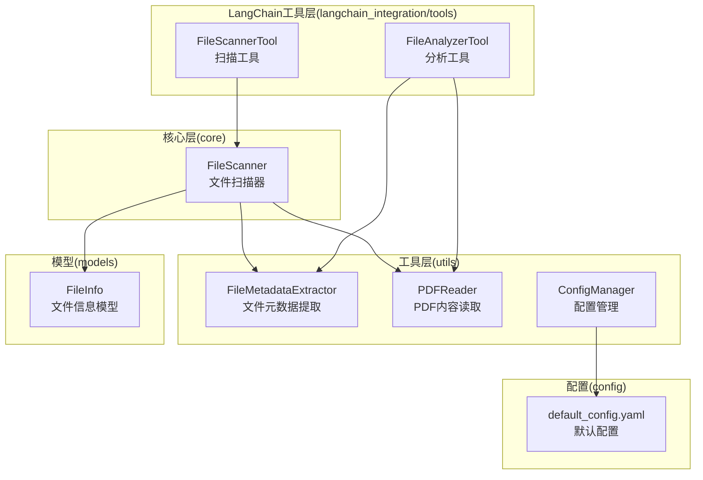
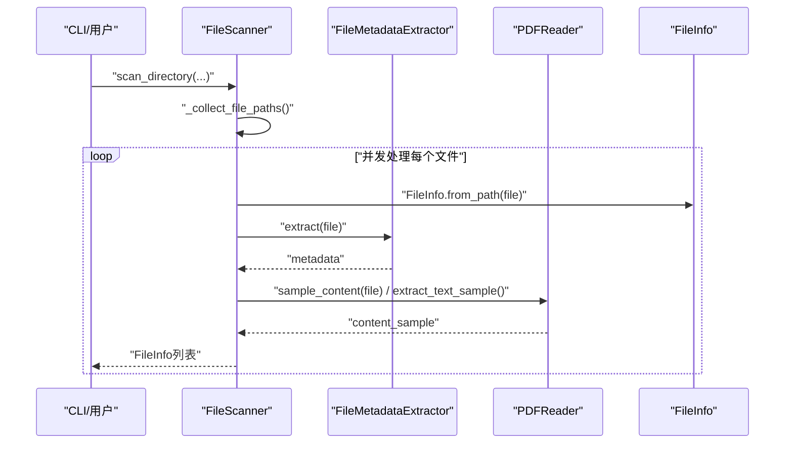
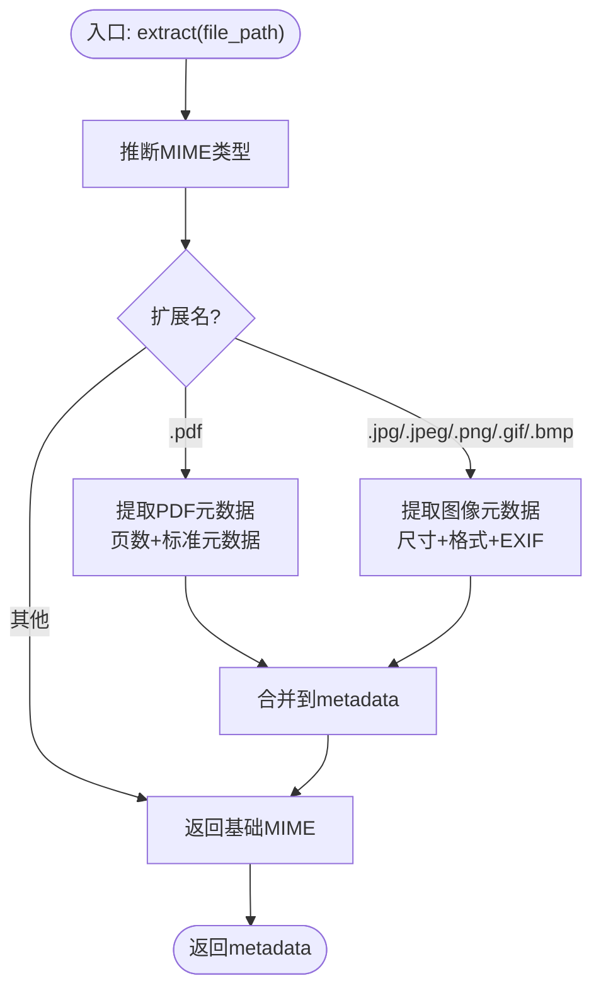
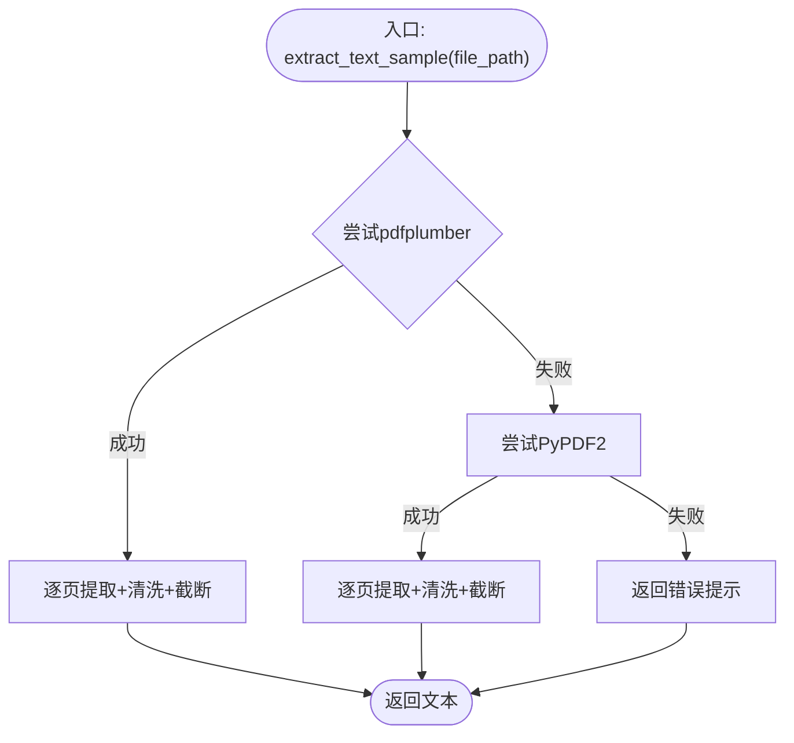
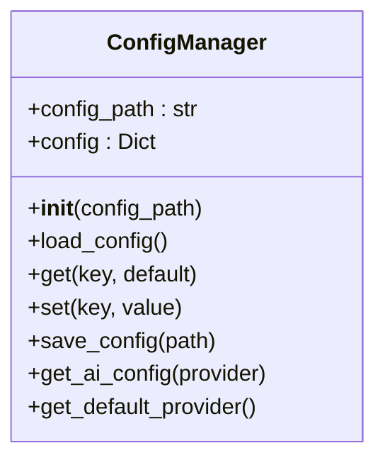
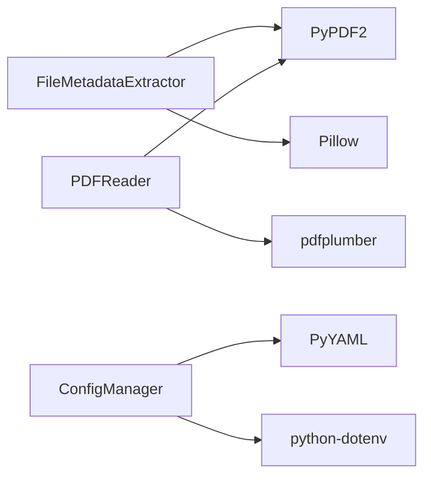

# 工具函数和实用程序

<cite>
**本文引用的文件**
- [src/utils/__init__.py](file://src/utils/__init__.py)
- [src/utils/file_metadata.py](file://src/utils/file_metadata.py)
- [src/utils/pdf_reader.py](file://src/utils/pdf_reader.py)
- [src/utils/config.py](file://src/utils/config.py)
- [config/default_config.yaml](file://config/default_config.yaml)
- [src/core/file_scanner.py](file://src/core/file_scanner.py)
- [src/langchain_integration/tools/file_scanner_tool.py](file://src/langchain_integration/tools/file_scanner_tool.py)
- [src/langchain_integration/tools/file_analyzer_tool.py](file://src/langchain_integration/tools/file_analyzer_tool.py)
- [src/models/file_info.py](file://src/models/file_info.py)
- [examples/basic_usage.py](file://examples/basic_usage.py)
- [tests/test_file_scanner.py](file://tests/test_file_scanner.py)
- [requirements.txt](file://requirements.txt)
- [README.md](file://README.md)
</cite>

## 目录
1. [简介](#简介)
2. [项目结构](#项目结构)
3. [核心组件](#核心组件)
4. [架构总览](#架构总览)
5. [详细组件分析](#详细组件分析)
6. [依赖分析](#依赖分析)
7. [性能考虑](#性能考虑)
8. [故障排查指南](#故障排查指南)
9. [结论](#结论)
10. [附录](#附录)

## 简介
本章节面向“工具函数和实用程序”的参考文档，聚焦三类核心工具：
- 文件元数据提取工具：支持PDF与常见图像格式的元数据提取，包含错误处理与异常回退。
- PDF内容读取器：提供文本样本提取、文本清洗、文件名模式分析与关键词检测，具备降级策略与性能优化。
- 配置管理工具：统一加载YAML配置、支持点号键访问、环境变量注入、AI提供商配置解析与默认值。

同时，文档解释这些工具在整体架构中的作用、调用关系、使用示例、性能基准、错误处理与扩展方法，并给出可视化图示以便读者快速理解。

## 项目结构
工具函数与实用程序主要分布在以下模块：
- utils：文件元数据提取、PDF内容读取、配置管理
- core：文件扫描器，内部复用工具函数
- langchain_integration/tools：LangChain工具封装，调用工具函数
- models：数据模型，被扫描器与工具使用
- config：默认配置文件
- examples/tests：使用示例与测试用例

图表来源
- [src/utils/file_metadata.py](file://src/utils/file_metadata.py#L10-L82)
- [src/utils/pdf_reader.py](file://src/utils/pdf_reader.py#L10-L113)
- [src/utils/config.py](file://src/utils/config.py#L10-L116)
- [src/core/file_scanner.py](file://src/core/file_scanner.py#L13-L196)
- [src/langchain_integration/tools/file_scanner_tool.py](file://src/langchain_integration/tools/file_scanner_tool.py#L31-L115)
- [src/langchain_integration/tools/file_analyzer_tool.py](file://src/langchain_integration/tools/file_analyzer_tool.py#L31-L221)
- [src/models/file_info.py](file://src/models/file_info.py#L9-L48)
- [config/default_config.yaml](file://config/default_config.yaml#L1-L79)

章节来源
- [src/utils/__init__.py](file://src/utils/__init__.py#L1-L8)
- [README.md](file://README.md#L220-L241)

## 核心组件
- 文件元数据提取器：支持PDF与常见图像格式，提取MIME类型、页面数、标题/作者/主题/生产者等；图像提取宽高、格式、模式与EXIF信息；异常捕获并记录错误。
- PDF内容读取器：优先使用pdfplumber提取文本，失败则降级至PyPDF2；提供文本清洗（去多余空白、控制字符）、文本样本截断、文件名模式分析（数字、年份、中英文、关键词类别）。
- 配置管理器：加载YAML配置，支持点号键访问；从环境变量注入API Key与模型参数；提供默认AI提供商查询；保存配置到文件。

章节来源
- [src/utils/file_metadata.py](file://src/utils/file_metadata.py#L10-L82)
- [src/utils/pdf_reader.py](file://src/utils/pdf_reader.py#L10-L113)
- [src/utils/config.py](file://src/utils/config.py#L10-L116)
- [config/default_config.yaml](file://config/default_config.yaml#L1-L79)

## 架构总览
工具函数在系统中的定位如下：
- FileScanner在扫描阶段调用FileMetadataExtractor与PDFReader，构建FileInfo并填充元数据与内容样本。
- LangChain工具（FileScannerTool、FileAnalyzerTool）进一步封装扫描与分析能力，供Agent工作流使用。
- ConfigManager贯穿全局，为AI适配器与各模块提供配置与环境变量注入。

图表来源
- [src/core/file_scanner.py](file://src/core/file_scanner.py#L28-L84)
- [src/utils/file_metadata.py](file://src/utils/file_metadata.py#L13-L31)
- [src/utils/pdf_reader.py](file://src/utils/pdf_reader.py#L13-L25)
- [src/models/file_info.py](file://src/models/file_info.py#L31-L44)

## 详细组件分析

### 文件元数据提取工具
- 功能概述
  - MIME类型推断
  - PDF：页数、标题、作者、主题、创建者、生产者
  - 图像：宽高、格式、模式、EXIF（字符串/数值字段）
  - 异常捕获：提取失败时记录错误信息
- 支持的文件格式
  - PDF：通过PyPDF2读取元数据
  - 图像：JPG/JPEG、PNG、GIF、BMP，通过Pillow读取尺寸与EXIF
- 提取精度
  - PDF元数据依赖文件质量；部分PDF无元数据时返回空
  - EXIF仅保留基础字符串/数值字段，避免复杂嵌套
- 错误处理
  - 各分支异常被捕获并写入metadata['error']或metadata['extraction_error']

图表来源
- [src/utils/file_metadata.py](file://src/utils/file_metadata.py#L13-L31)
- [src/utils/file_metadata.py](file://src/utils/file_metadata.py#L33-L59)
- [src/utils/file_metadata.py](file://src/utils/file_metadata.py#L61-L81)

章节来源
- [src/utils/file_metadata.py](file://src/utils/file_metadata.py#L10-L82)

### PDF内容读取器
- 处理流程
  - 优先使用pdfplumber提取文本；失败则降级PyPDF2
  - 文本清洗：去除多余空白与控制字符，保留可读文本
  - 截断策略：按最大页数与最大字符数限制输出
- 文本提取算法
  - pdfplumber：逐页提取，按剩余字符数截断拼接
  - PyPDF2：遍历前N页，逐页提取并清洗
- 格式保持
  - 保持段落换行；清洗控制字符，保留可见字符
- 性能优化
  - 限制最大页数与字符数，避免大文件内存压力
  - 降级策略减少失败成本
- 文件名模式分析
  - 数字、年份、中英文、关键词类别检测
  - 关键词类别：论文、简历、发票、手册、报告、证书

图表来源
- [src/utils/pdf_reader.py](file://src/utils/pdf_reader.py#L13-L25)
- [src/utils/pdf_reader.py](file://src/utils/pdf_reader.py#L26-L69)
- [src/utils/pdf_reader.py](file://src/utils/pdf_reader.py#L71-L78)

章节来源
- [src/utils/pdf_reader.py](file://src/utils/pdf_reader.py#L10-L113)

### 配置管理工具
- API接口
  - 初始化：传入配置路径或自动查找默认路径
  - 加载：读取YAML并安全解析
  - 读取：get(key, default)支持点号分隔的多级键
  - 写入：set(key, value)动态设置；save_config(path)持久化
  - AI配置：get_ai_config(provider)按提供商注入环境变量
  - 默认提供商：get_default_provider()优先读取环境变量
- 配置加载机制
  - 默认路径搜索：当前目录与项目根目录下的config/default_config.yaml
  - 环境变量：dotenv加载.env；AI提供商Key与本地模型参数从环境注入
- 验证规则
  - get()对非字典路径返回默认值，避免KeyError
  - set()自动创建嵌套字典结构
- 缓存策略
  - 内存缓存：config字典驻留内存，避免重复IO
  - 未实现独立文件缓存；可通过外部进程复用ConfigManager实例实现“缓存”

图表来源
- [src/utils/config.py](file://src/utils/config.py#L10-L116)

章节来源
- [src/utils/config.py](file://src/utils/config.py#L10-L116)
- [config/default_config.yaml](file://config/default_config.yaml#L1-L79)

## 依赖分析
- 工具函数依赖
  - FileMetadataExtractor依赖mimetypes、PyPDF2、Pillow
  - PDFReader依赖PyPDF2、pdfplumber、正则表达式
  - ConfigManager依赖yaml、python-dotenv、pathlib
- 模块耦合
  - FileScanner依赖FileMetadataExtractor与PDFReader，耦合度低，便于替换
  - LangChain工具依赖FileScanner与工具函数，形成上层封装
- 外部依赖
  - requirements.txt列出PyPDF2、pdfplumber、Pillow、PyYAML、python-dotenv等

图表来源
- [requirements.txt](file://requirements.txt#L12-L21)
- [src/utils/file_metadata.py](file://src/utils/file_metadata.py#L3-L7)
- [src/utils/pdf_reader.py](file://src/utils/pdf_reader.py#L3-L7)
- [src/utils/config.py](file://src/utils/config.py#L3-L7)

章节来源
- [requirements.txt](file://requirements.txt#L1-L43)

## 性能考虑
- PDF文本提取
  - 限制最大页数与字符数，避免大文件内存峰值
  - 优先pdfplumber，失败降级PyPDF2，提升成功率与速度
- 文件扫描
  - 并发线程池处理文件信息，进度条可视化
  - 跳过隐藏文件、深度限制、最大文件大小阈值
- 配置加载
  - 内存驻留配置，避免重复IO；仅在显式save时写盘
- 建议
  - 批量扫描时合理设置max_pages与max_chars
  - 对超大文件跳过内容样本读取，仅提取元数据

章节来源
- [src/core/file_scanner.py](file://src/core/file_scanner.py#L16-L26)
- [src/core/file_scanner.py](file://src/core/file_scanner.py#L61-L83)
- [src/utils/pdf_reader.py](file://src/utils/pdf_reader.py#L13-L25)

## 故障排查指南
- PDF元数据提取失败
  - 现象：metadata['error']包含错误信息
  - 排查：确认PDF文件有效、PyPDF2版本兼容
- 图像EXIF提取异常
  - 现象：metadata['error']包含错误信息
  - 排查：确认图像文件可读、Pillow版本兼容
- PDF文本提取为空或报错
  - 现象：返回错误提示字符串
  - 排查：确认pdfplumber与PyPDF2安装正确；尝试增大max_pages/max_chars
- 配置文件加载失败
  - 现象：抛出RuntimeError或找不到默认配置
  - 排查：确认config/default_config.yaml存在且可读；检查YAML语法
- 环境变量未生效
  - 现象：AI提供商Key未注入
  - 排查：确认.env已加载；检查环境变量名与ConfigManager映射一致

章节来源
- [src/utils/file_metadata.py](file://src/utils/file_metadata.py#L28-L29)
- [src/utils/file_metadata.py](file://src/utils/file_metadata.py#L56-L57)
- [src/utils/file_metadata.py](file://src/utils/file_metadata.py#L78-L79)
- [src/utils/pdf_reader.py](file://src/utils/pdf_reader.py#L18-L24)
- [src/utils/config.py](file://src/utils/config.py#L35-L41)
- [src/utils/config.py](file://src/utils/config.py#L83-L110)

## 结论
工具函数与实用程序在项目中承担“数据采集与预处理”的关键角色：
- FileMetadataExtractor与PDFReader为上层扫描与分析提供高质量输入
- ConfigManager统一配置与环境变量注入，降低耦合
- LangChain工具将底层能力封装为Agent可用的标准化工具
建议在扩展新功能时遵循现有接口风格，确保错误处理与性能优化的一致性。

## 附录

### 使用示例与最佳实践
- 基本使用
  - 参考示例脚本初始化配置与控制器，调用扫描与分析流程
- 性能基准
  - 批量扫描建议分批执行，结合max_pages与max_chars控制内存占用
- 错误处理
  - 在调用工具函数前检查文件存在性与权限；对异常进行捕获并记录
- 扩展方法
  - 新增文件类型支持：在FileMetadataExtractor中添加对应分支
  - 新增AI提供商：在ConfigManager.get_ai_config中增加分支并映射环境变量
  - 新增PDF关键词：在PDFReader._check_document_keywords中扩展关键词类别

章节来源
- [examples/basic_usage.py](file://examples/basic_usage.py#L7-L36)
- [src/langchain_integration/tools/file_scanner_tool.py](file://src/langchain_integration/tools/file_scanner_tool.py#L54-L103)
- [src/langchain_integration/tools/file_analyzer_tool.py](file://src/langchain_integration/tools/file_analyzer_tool.py#L54-L93)

### 与核心模块的关系
- FileScanner在扫描阶段调用工具函数，构建FileInfo并填充元数据与内容样本
- LangChain工具进一步封装扫描与分析能力，供Agent工作流使用
- 数据模型FileInfo贯穿扫描与工具链，保证结构一致性

章节来源
- [src/core/file_scanner.py](file://src/core/file_scanner.py#L125-L148)
- [src/models/file_info.py](file://src/models/file_info.py#L9-L48)
- [src/langchain_integration/tools/file_scanner_tool.py](file://src/langchain_integration/tools/file_scanner_tool.py#L54-L103)
- [src/langchain_integration/tools/file_analyzer_tool.py](file://src/langchain_integration/tools/file_analyzer_tool.py#L54-L93)