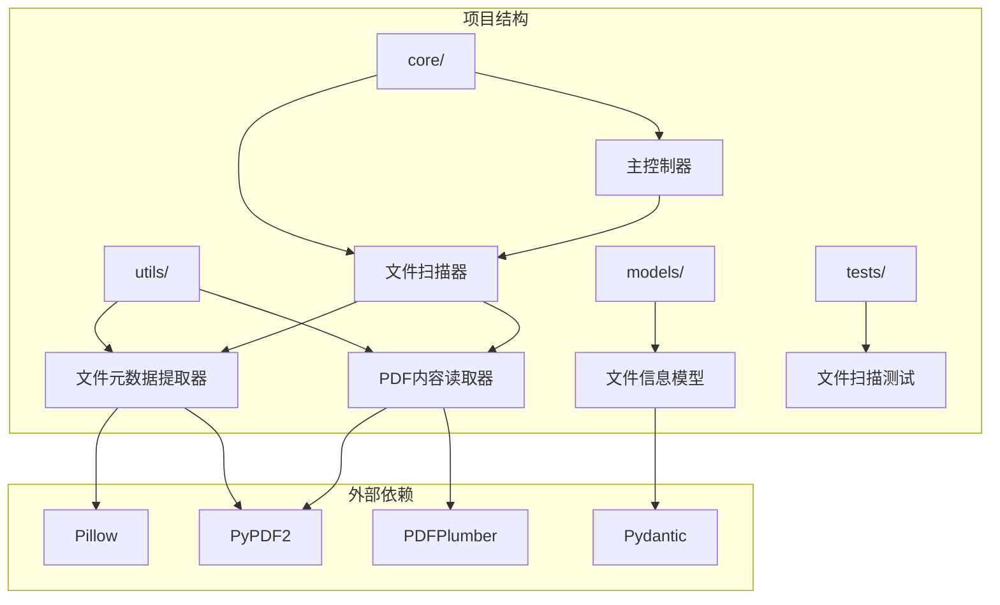
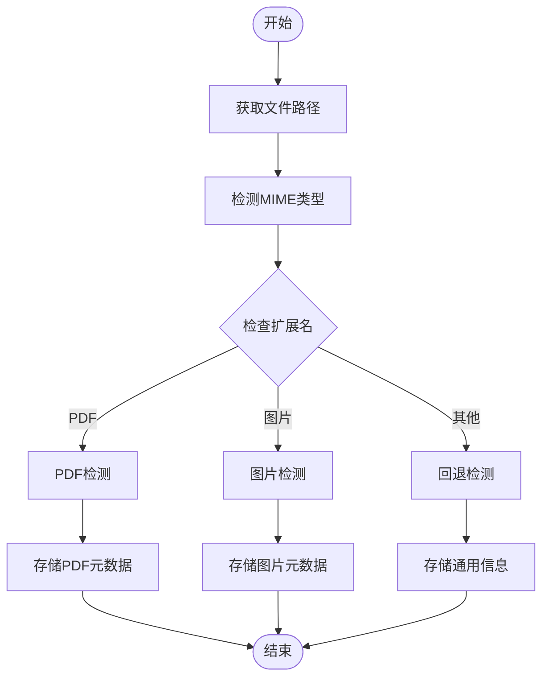
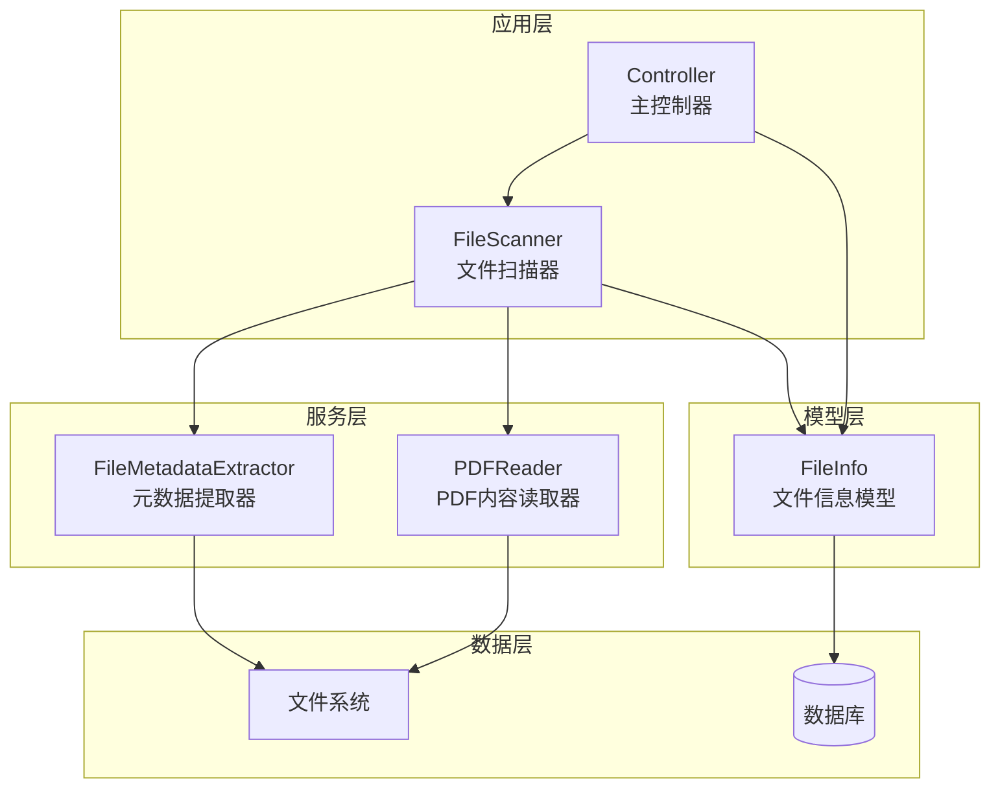
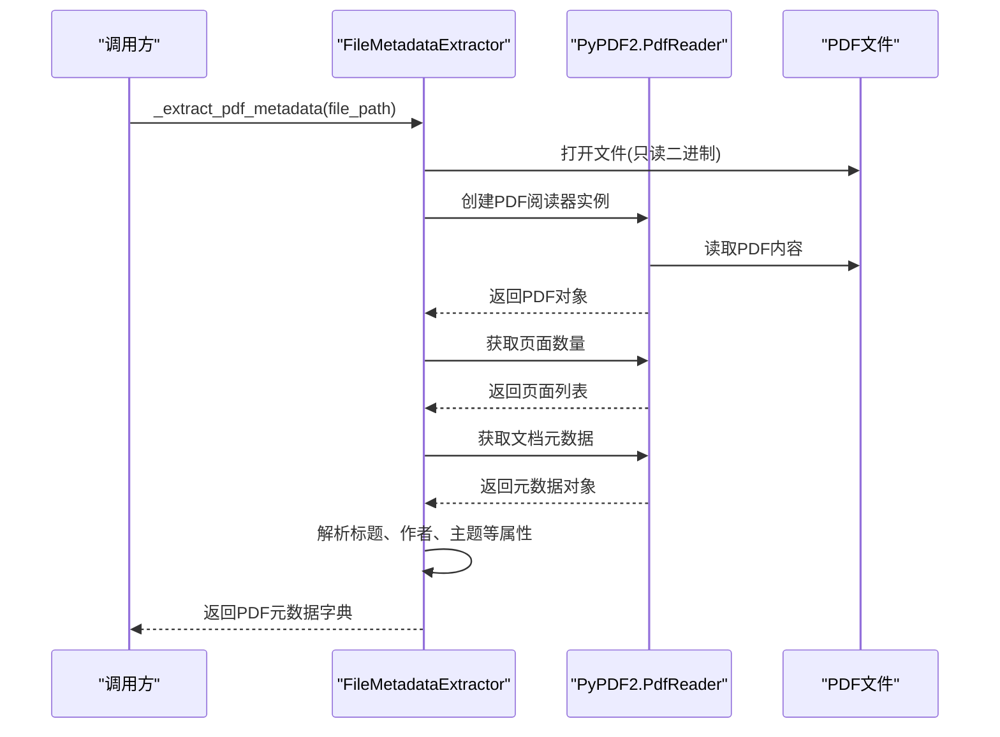
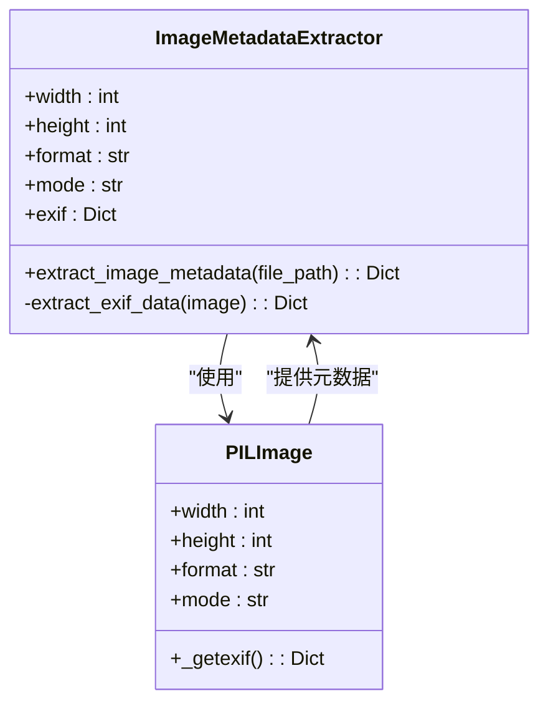
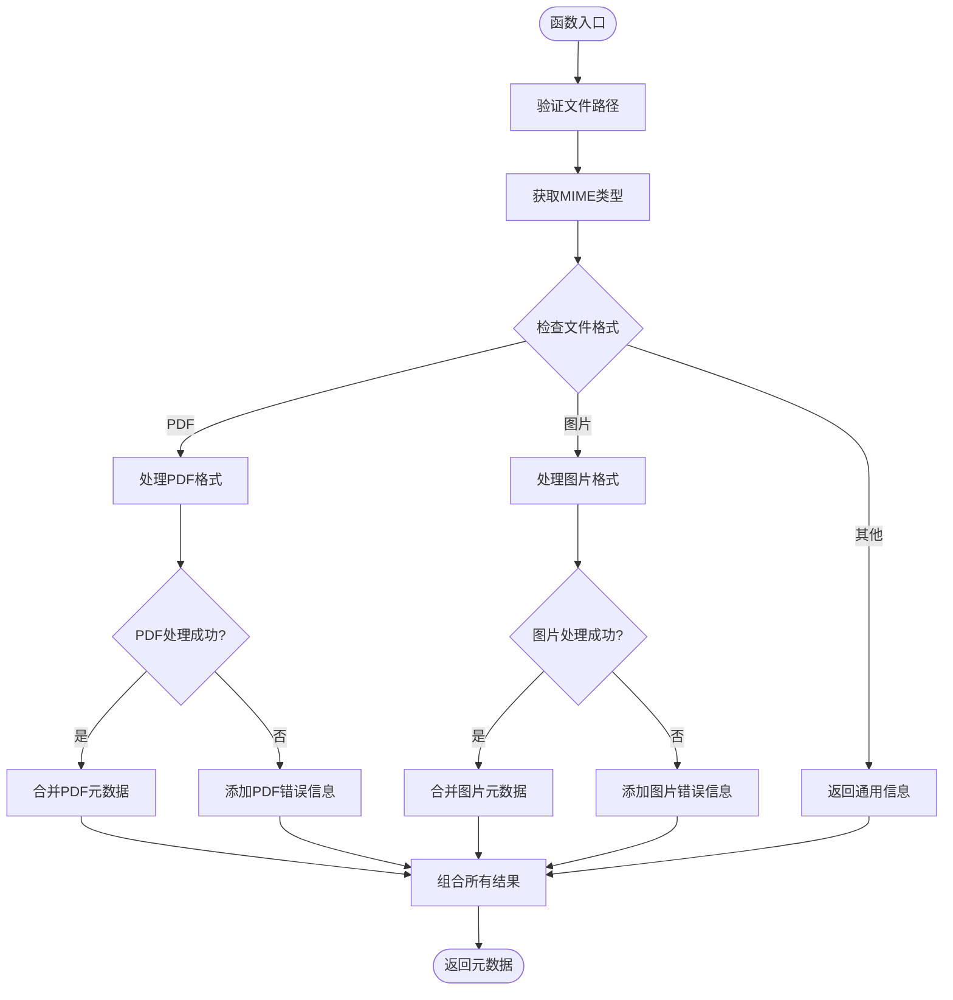
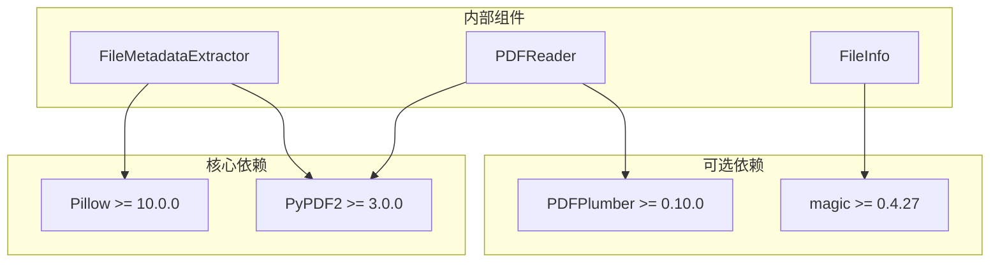
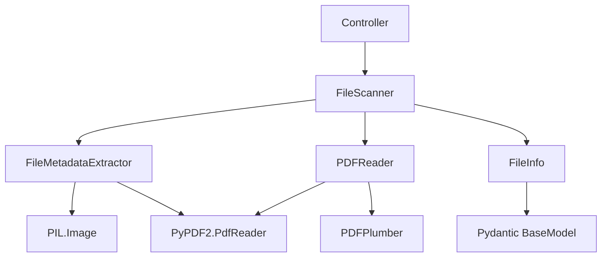
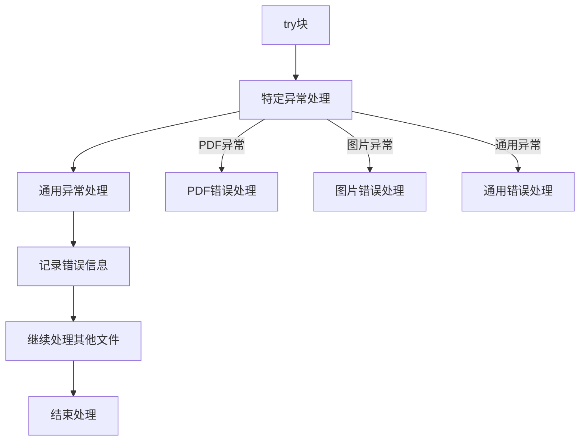

# 文件元数据提取器

<cite>
**本文档引用的文件**
- [src/utils/file_metadata.py](file://src/utils/file_metadata.py)
- [src/utils/pdf_reader.py](file://src/utils/pdf_reader.py)
- [src/models/file_info.py](file://src/models/file_info.py)
- [src/core/file_scanner.py](file://src/core/file_scanner.py)
- [src/core/controller.py](file://src/core/controller.py)
- [requirements.txt](file://requirements.txt)
- [tests/test_file_scanner.py](file://tests/test_file_scanner.py)
</cite>

## 目录
1. [简介](#简介)
2. [项目结构](#项目结构)
3. [核心组件](#核心组件)
4. [架构概览](#架构概览)
5. [详细组件分析](#详细组件分析)
6. [依赖关系分析](#依赖关系分析)
7. [性能考虑](#性能考虑)
8. [故障排除指南](#故障排除指南)
9. [结论](#结论)

## 简介

文件元数据提取器是智能文件整理系统中的关键组件，负责从各种类型的文件中提取结构化元数据信息。该系统采用模块化设计，支持PDF文档和常见图片格式的元数据提取，为文件分类、组织和管理提供智能化支持。

本系统的核心价值在于：
- **多格式支持**：统一接口处理PDF和图片格式的元数据提取
- **智能MIME类型检测**：基于文件扩展名和内容的双重检测机制
- **错误处理机制**：完善的异常捕获和错误信息记录
- **性能优化**：并行处理和内存友好的文件读取策略

## 项目结构

文件元数据提取器位于项目的工具层，与核心业务逻辑通过清晰的接口进行集成：

**图表来源**
- [src/utils/file_metadata.py](file://src/utils/file_metadata.py#L1-L82)
- [src/core/file_scanner.py](file://src/core/file_scanner.py#L1-L196)
- [requirements.txt](file://requirements.txt#L1-L43)

**章节来源**
- [src/utils/file_metadata.py](file://src/utils/file_metadata.py#L1-L82)
- [src/core/file_scanner.py](file://src/core/file_scanner.py#L1-L196)
- [requirements.txt](file://requirements.txt#L1-L43)

## 核心组件

### FileMetadataExtractor类

FileMetadataExtractor是系统的核心组件，采用静态方法设计模式，提供统一的元数据提取接口。该类实现了以下关键功能：

- **静态方法设计**：避免实例化开销，直接通过类名调用
- **格式特定处理**：针对不同文件格式提供专门的解析逻辑
- **错误隔离**：每个格式的解析都有独立的异常处理机制
- **MIME类型检测**：自动识别文件的MIME类型

### MIME类型检测机制

系统采用双重检测机制确保准确性：

**图表来源**
- [src/utils/file_metadata.py](file://src/utils/file_metadata.py#L13-L31)

**章节来源**
- [src/utils/file_metadata.py](file://src/utils/file_metadata.py#L10-L31)

## 架构概览

文件元数据提取器在整个系统架构中扮演着数据采集层的角色，与上层控制器和下层文件系统形成清晰的分层结构：

**图表来源**
- [src/core/controller.py](file://src/core/controller.py#L15-L82)
- [src/core/file_scanner.py](file://src/core/file_scanner.py#L13-L27)
- [src/utils/file_metadata.py](file://src/utils/file_metadata.py#L10-L11)

**章节来源**
- [src/core/controller.py](file://src/core/controller.py#L15-L82)
- [src/core/file_scanner.py](file://src/core/file_scanner.py#L13-L27)

## 详细组件分析

### PDF元数据提取方法

#### _extract_pdf_metadata()实现细节

PDF元数据提取方法实现了完整的文档属性解析功能：

**图表来源**
- [src/utils/file_metadata.py](file://src/utils/file_metadata.py#L34-L59)

PDF元数据提取的关键特性：

1. **页面数量统计**：通过`len(pdf_reader.pages)`获取总页数
2. **文档属性提取**：支持标题(title)、作者(author)、主题(subject)、创建者(creator)、生产者(producer)
3. **条件性提取**：仅在元数据存在且非空时才添加到结果中
4. **错误隔离**：PDF解析异常不会影响其他文件的处理

#### 图片元数据提取方法

#### _extract_image_metadata()功能详解

图片元数据提取方法提供了全面的图像信息解析能力：

**图表来源**
- [src/utils/file_metadata.py](file://src/utils/file_metadata.py#L61-L81)

图片元数据提取的核心功能：

1. **尺寸信息**：获取图像的宽度和高度像素值
2. **格式识别**：识别图像格式（JPEG、PNG、GIF、BMP等）
3. **色彩模式**：确定图像的颜色模式（RGB、CMYK、灰度等）
4. **EXIF数据提取**：提取相机参数、拍摄信息等元数据
5. **数据过滤**：仅保留字符串、整数、浮点数类型的EXIF值

**章节来源**
- [src/utils/file_metadata.py](file://src/utils/file_metadata.py#L34-L81)

### 数据流处理

#### extract()方法工作流程

extract()方法实现了统一的元数据提取入口，具有以下处理流程：

**图表来源**
- [src/utils/file_metadata.py](file://src/utils/file_metadata.py#L14-L31)

**章节来源**
- [src/utils/file_metadata.py](file://src/utils/file_metadata.py#L14-L31)

## 依赖关系分析

### 外部依赖关系

文件元数据提取器依赖于多个第三方库来实现不同格式的解析功能：

**图表来源**
- [requirements.txt](file://requirements.txt#L12-L16)
- [src/utils/file_metadata.py](file://src/utils/file_metadata.py#L3-L7)

### 内部组件依赖

系统内部组件之间的依赖关系体现了清晰的分层架构：

**图表来源**
- [src/core/controller.py](file://src/core/controller.py#L6-L12)
- [src/core/file_scanner.py](file://src/core/file_scanner.py#L9-L10)

**章节来源**
- [requirements.txt](file://requirements.txt#L12-L16)
- [src/core/controller.py](file://src/core/controller.py#L6-L12)
- [src/core/file_scanner.py](file://src/core/file_scanner.py#L9-L10)

## 性能考虑

### 并行处理策略

文件扫描器采用了多线程并行处理机制来提升性能：

- **线程池管理**：使用ThreadPoolExecutor(max_workers=4)限制并发数量
- **异步处理**：通过as_completed()实现任务完成即处理
- **进度监控**：使用tqdm提供实时进度显示
- **异常隔离**：单个文件处理失败不影响整体进程

### 内存优化

系统在处理大型文件时采用了多项内存优化策略：

- **延迟加载**：PDF内容读取采用流式处理
- **大小限制**：默认最大文件大小100MB，避免内存溢出
- **增量处理**：PDF文本提取支持分页处理
- **资源管理**：使用with语句确保文件句柄正确释放

### 缓存机制

虽然当前版本没有实现显式的缓存机制，但系统设计允许在未来添加缓存支持：

- **元数据缓存**：可以缓存已处理文件的元数据
- **文件指纹**：基于文件哈希值的缓存键
- **失效策略**：基于文件修改时间的缓存失效

## 故障排除指南

### 常见错误类型及解决方案

#### PDF文件解析错误

**问题症状**：
- PDF元数据提取失败
- 页面数量显示为0
- 文档属性为空

**可能原因**：
- PDF文件损坏或加密
- PyPDF2版本不兼容
- 文件权限不足

**解决方案**：
1. 验证PDF文件完整性
2. 检查文件权限设置
3. 更新PyPDF2到最新版本
4. 使用PDFPlumber作为备选方案

#### 图片文件解析错误

**问题症状**：
- 图片尺寸信息缺失
- EXIF数据提取失败
- 格式识别错误

**可能原因**：
- 图片格式不受支持
- EXIF数据损坏
- Pillow版本问题

**解决方案**：
1. 确认图片格式在支持列表中
2. 检查EXIF数据完整性
3. 更新Pillow到最新版本
4. 验证图片文件未被损坏

#### 内存相关问题

**问题症状**：
- 处理大型文件时内存不足
- 程序崩溃或性能下降

**解决方案**：
1. 调整max_file_size参数
2. 减少并发处理数量
3. 实施文件大小预检查
4. 使用流式处理替代一次性加载

### 异常处理机制

系统实现了多层次的异常处理机制：

**图表来源**
- [src/utils/file_metadata.py](file://src/utils/file_metadata.py#L28-L29)
- [src/utils/file_metadata.py](file://src/utils/file_metadata.py#L57-L58)
- [src/utils/file_metadata.py](file://src/utils/file_metadata.py#L79-L80)

**章节来源**
- [src/utils/file_metadata.py](file://src/utils/file_metadata.py#L28-L29)
- [src/utils/file_metadata.py](file://src/utils/file_metadata.py#L57-L58)
- [src/utils/file_metadata.py](file://src/utils/file_metadata.py#L79-L80)

## 结论

文件元数据提取器是一个设计精良、功能完备的组件，它为智能文件整理系统提供了坚实的数据基础。该系统的主要优势包括：

### 技术优势

1. **模块化设计**：清晰的职责分离和接口定义
2. **错误处理完善**：多层次的异常捕获和恢复机制
3. **性能优化**：合理的内存管理和并行处理策略
4. **扩展性强**：易于添加新的文件格式支持

### 应用价值

1. **智能化文件管理**：为AI驱动的文件分类提供数据支持
2. **用户体验提升**：提供准确的文件元数据信息
3. **系统稳定性**：健壮的错误处理确保系统可靠运行
4. **开发效率**：标准化的接口简化了上层应用开发

### 发展方向

未来可以在以下方面进一步改进：
- 添加更多文件格式的支持
- 实现元数据缓存机制
- 优化大文件处理性能
- 增强错误诊断和恢复能力

该组件为整个智能文件整理系统的成功奠定了重要基础，其设计原则和实现模式值得在类似项目中借鉴和应用。