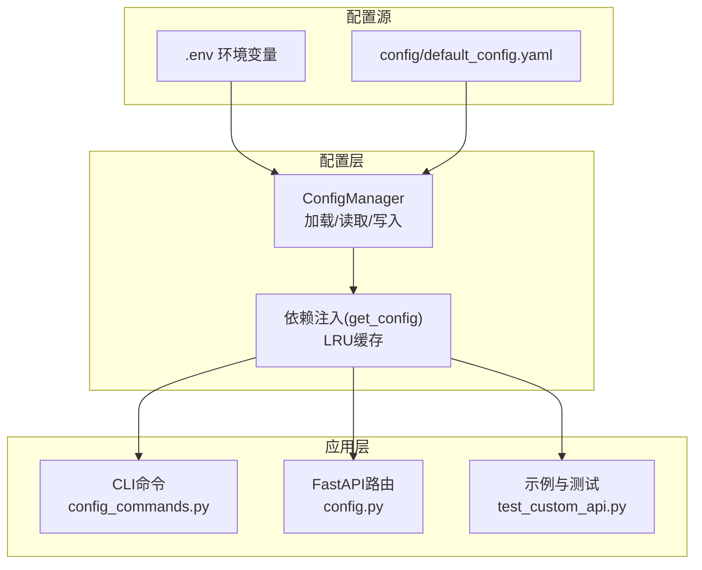
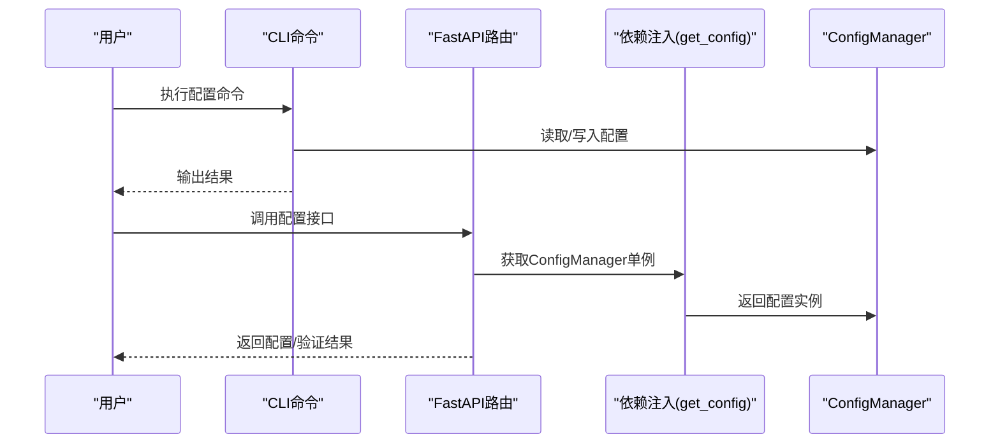
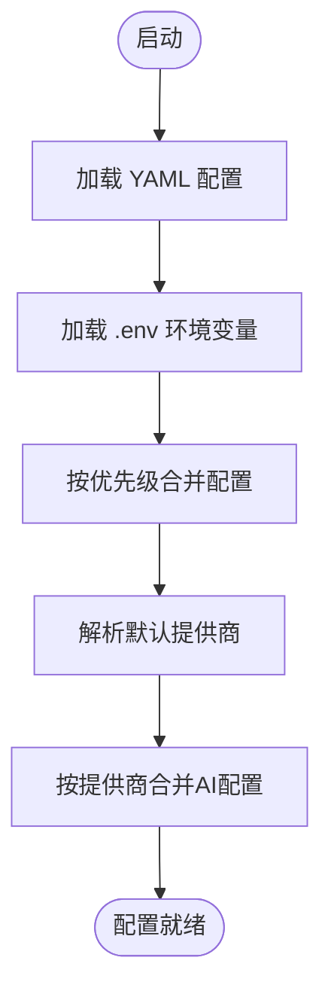
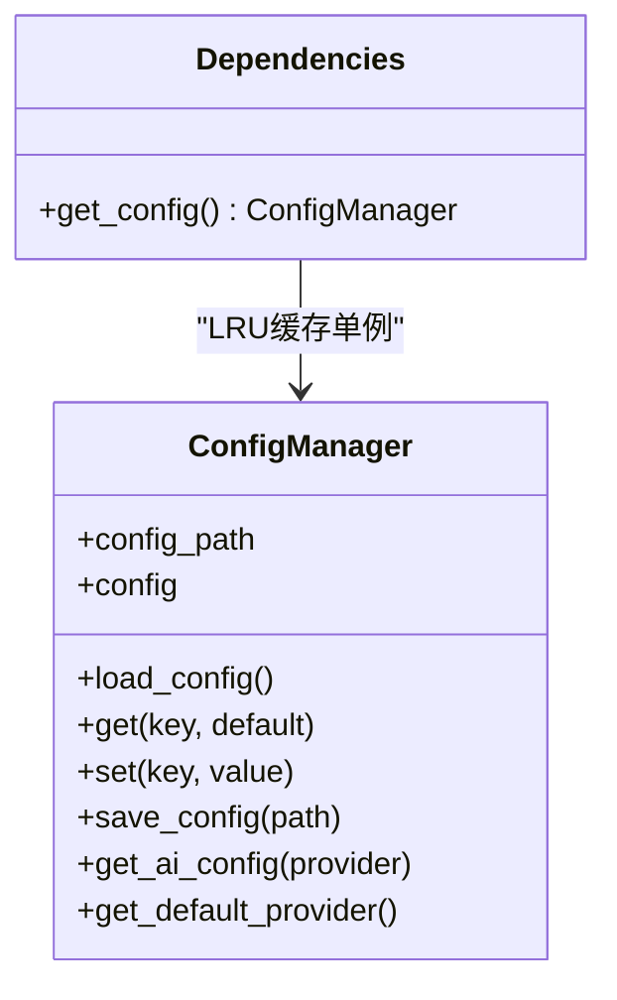
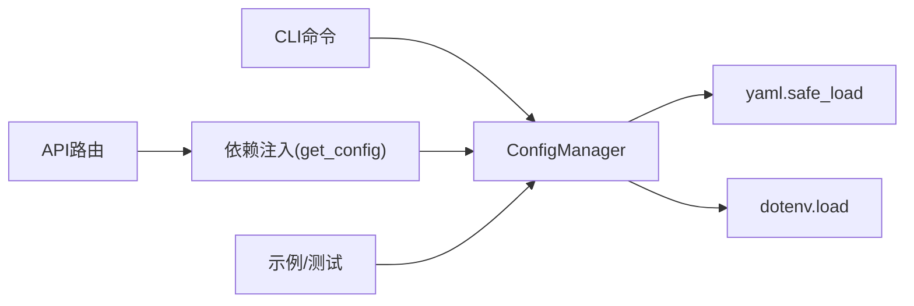

# 配置管理工具

<cite>
**本文引用的文件**
- [config/default_config.yaml](file://config/default_config.yaml)
- [src/utils/config.py](file://src/utils/config.py)
- [docs/CONFIGURATION.md](file://docs/CONFIGURATION.md)
- [src/cli/config_commands.py](file://src/cli/config_commands.py)
- [src/api/routers/config.py](file://src/api/routers/config.py)
- [src/api/dependencies.py](file://src/api/dependencies.py)
- [env.custom.example](file://env.custom.example)
- [examples/test_custom_api.py](file://examples/test_custom_api.py)
- [tests/conftest.py](file://tests/conftest.py)
</cite>

## 目录
1. [简介](#简介)
2. [项目结构](#项目结构)
3. [核心组件](#核心组件)
4. [架构总览](#架构总览)
5. [详细组件分析](#详细组件分析)
6. [依赖关系分析](#依赖关系分析)
7. [性能考量](#性能考量)
8. [故障排除指南](#故障排除指南)
9. [结论](#结论)
10. [附录](#附录)

## 简介
本文件面向“配置管理工具”的使用者与维护者，系统化阐述配置加载机制、文件解析流程、默认值处理策略；解释配置验证规则、类型检查、必填项验证、范围约束；深入介绍配置缓存机制、热更新支持、环境变量优先级处理；提供配置文件结构说明、YAML格式规范与注释规则；包含配置迁移指南、版本兼容性处理与回滚策略；展示配置使用的最佳实践（配置注入、依赖注入、配置监听机制）；并提供故障排除指南（常见配置错误、解析异常处理、调试技巧）。

## 项目结构
本项目的配置相关能力主要分布在以下模块：
- 配置文件：config/default_config.yaml
- 配置管理器：src/utils/config.py
- CLI配置命令：src/cli/config_commands.py
- Web API配置接口：src/api/routers/config.py
- API依赖注入：src/api/dependencies.py
- 环境变量模板：env.custom.example
- 配置使用示例与测试：examples/test_custom_api.py
- 配置文档：docs/CONFIGURATION.md

图表来源
- [src/utils/config.py](file://src/utils/config.py#L10-L116)
- [src/api/dependencies.py](file://src/api/dependencies.py#L17-L20)
- [src/cli/config_commands.py](file://src/cli/config_commands.py#L13-L219)
- [src/api/routers/config.py](file://src/api/routers/config.py#L15-L206)
- [config/default_config.yaml](file://config/default_config.yaml#L1-L79)
- [env.custom.example](file://env.custom.example#L1-L103)

章节来源
- [config/default_config.yaml](file://config/default_config.yaml#L1-L79)
- [src/utils/config.py](file://src/utils/config.py#L10-L116)
- [docs/CONFIGURATION.md](file://docs/CONFIGURATION.md#L1-L336)

## 核心组件
- 配置管理器（ConfigManager）
  - 负责加载 YAML 配置、读取嵌套键、写回配置、合并环境变量优先级、提供默认值兜底。
- CLI 配置命令
  - 提供查看、设置提供商、测试连接等命令，内部写入 .env 并同步更新配置文件。
- FastAPI 配置路由
  - 提供获取配置、更新AI配置、验证配置、设置默认提供商等接口。
- 依赖注入
  - 通过 LRU 缓存提供全局唯一的 ConfigManager 单例，避免重复加载。
- 环境变量模板
  - 提供 .env.example 作为配置模板，覆盖多提供商与高级配置项。

章节来源
- [src/utils/config.py](file://src/utils/config.py#L10-L116)
- [src/cli/config_commands.py](file://src/cli/config_commands.py#L13-L219)
- [src/api/routers/config.py](file://src/api/routers/config.py#L15-L206)
- [src/api/dependencies.py](file://src/api/dependencies.py#L17-L20)
- [env.custom.example](file://env.custom.example#L1-L103)

## 架构总览
配置在系统中的流转如下：
- 启动阶段：ConfigManager 初始化时加载 YAML，随后加载 .env 环境变量，按“环境变量 > 配置文件 > 默认值”优先级合并。
- 运行时：API 与 CLI 通过依赖注入获取 ConfigManager 单例，读取配置；CLI 还可写回 .env 与配置文件。
- 验证：API 提供校验端点，CLI 提供测试命令，均基于环境变量与配置文件进行必填项与连通性检查。

图表来源
- [src/cli/config_commands.py](file://src/cli/config_commands.py#L13-L219)
- [src/api/routers/config.py](file://src/api/routers/config.py#L15-L206)
- [src/api/dependencies.py](file://src/api/dependencies.py#L17-L20)
- [src/utils/config.py](file://src/utils/config.py#L10-L116)

## 详细组件分析

### 配置加载机制与优先级
- 加载顺序
  - 读取 YAML 配置文件（config/default_config.yaml）
  - 加载 .env 环境变量（dotenv）
  - 合并优先级：环境变量 > 配置文件 > 代码默认值
- 关键实现要点
  - get(key, default): 支持点号分隔的多级键访问，不存在返回默认值
  - set(key, value): 支持动态创建嵌套字典并写入
  - get_ai_config(provider): 按提供商合并环境变量（API Key、base_url、model 等）
  - get_default_provider(): 优先读取环境变量 DEFAULT_AI_PROVIDER

图表来源
- [src/utils/config.py](file://src/utils/config.py#L35-L116)
- [docs/CONFIGURATION.md](file://docs/CONFIGURATION.md#L5-L17)

章节来源
- [src/utils/config.py](file://src/utils/config.py#L35-L116)
- [docs/CONFIGURATION.md](file://docs/CONFIGURATION.md#L5-L17)

### 文件解析流程与YAML规范
- 配置文件结构
  - ai.default_provider：默认提供商
  - ai.providers.<provider>：各提供商的模型、超参、地址等
  - langchain、file_operations、safety、logging：功能域配置
- YAML 规范与注释
  - 使用缩进表示层级，键值对使用冒号分隔
  - 注释以 # 开头，便于说明用途与示例
  - 列表项使用 - 前缀
- 解析异常处理
  - ConfigManager.load_config 捕获异常并抛出明确错误信息

章节来源
- [config/default_config.yaml](file://config/default_config.yaml#L1-L79)
- [src/utils/config.py](file://src/utils/config.py#L35-L42)

### 默认值处理策略
- 读取默认值
  - get(key, default)：当键不存在或值为 None 时返回默认值
  - get_ai_config/provider：对缺失的关键字段（如 API Key、base_url）返回空或默认值
- 代码兜底
  - get_default_provider：若未设置环境变量，默认返回 claude
  - API 路由中对缺失字段返回默认值（如模型名、批大小等）

章节来源
- [src/utils/config.py](file://src/utils/config.py#L43-L116)
- [src/api/routers/config.py](file://src/api/routers/config.py#L26-L79)

### 配置验证规则与类型检查
- 必填项验证
  - API 路由 validate_config：针对 claude/openai/local/custom 分别检查必要环境变量或配置项
  - CLI test_connection：检查 API Key、base_url、模型等
- 类型与范围约束
  - 当前实现主要通过字符串与字典结构表达，未见显式的类型/范围校验逻辑
  - 建议在扩展时引入类型注解与 Pydantic 校验（见最佳实践建议）

章节来源
- [src/api/routers/config.py](file://src/api/routers/config.py#L133-L176)
- [src/cli/config_commands.py](file://src/cli/config_commands.py#L190-L219)

### 配置缓存机制与热更新支持
- 缓存机制
  - API 依赖注入使用 LRU 缓存 get_config()，避免重复实例化
- 热更新支持
  - 当前未实现自动监听文件变更的热重载
  - 建议方案：文件监控 + 重新加载 ConfigManager 或重建 LRU 缓存

图表来源
- [src/utils/config.py](file://src/utils/config.py#L10-L116)
- [src/api/dependencies.py](file://src/api/dependencies.py#L17-L20)

章节来源
- [src/api/dependencies.py](file://src/api/dependencies.py#L17-L20)
- [src/utils/config.py](file://src/utils/config.py#L10-L116)

### 环境变量优先级处理
- 优先级顺序：环境变量(.env) > 配置文件(default_config.yaml) > 代码默认值
- 具体合并点
  - get_ai_config：按提供商读取环境变量（API Key、base_url、model）
  - get_default_provider：读取 DEFAULT_AI_PROVIDER
- CLI 写入 .env：set-provider 命令会写回 .env，并同步更新配置文件

章节来源
- [src/utils/config.py](file://src/utils/config.py#L76-L116)
- [src/cli/config_commands.py](file://src/cli/config_commands.py#L50-L188)
- [docs/CONFIGURATION.md](file://docs/CONFIGURATION.md#L5-L17)

### 配置文件结构说明与YAML规范
- 结构概览
  - ai：默认提供商与各提供商配置
  - langchain：Agent与工具配置
  - file_operations：文件扫描与操作配置
  - safety：确认与备份配置
  - logging：日志级别、目录、保留天数、格式
- YAML 规范
  - 键名使用小写与下划线
  - 列表项与注释清晰
  - 建议为敏感信息留空占位，通过环境变量注入

章节来源
- [config/default_config.yaml](file://config/default_config.yaml#L1-L79)

### 配置迁移指南与版本兼容性
- 迁移策略
  - 保持 .env 与 default_config.yaml 双通道，逐步统一为 .env 方式
  - CLI set-provider 命令会写回 .env，便于平滑迁移
- 兼容性
  - 保留 CLI 命令与配置文件方式，向后兼容
  - 通过文档统一配置流程，降低学习成本

章节来源
- [docs/CONFIGURATION.md](file://docs/CONFIGURATION.md#L103-L216)
- [src/cli/config_commands.py](file://src/cli/config_commands.py#L50-L188)

### 回滚策略
- 建议方案
  - 保存 .env.bak 或版本化 .env
  - 通过 CLI 或 API 回退到上一个已知可用配置
  - 配置文件变更前先备份

章节来源
- [docs/CONFIGURATION.md](file://docs/CONFIGURATION.md#L285-L327)

### 配置使用最佳实践
- 配置注入与依赖注入
  - 使用 get_config() 获取单例，避免重复加载
  - 在 API 与 CLI 中统一通过依赖注入获取配置
- 配置监听机制
  - 当前未实现自动监听，建议引入文件监控并在变更时重建缓存
- 配置注入示例
  - API 依赖注入：get_config() 返回 ConfigManager 单例
  - CLI 与示例：直接构造 ConfigManager 或通过依赖注入

章节来源
- [src/api/dependencies.py](file://src/api/dependencies.py#L17-L20)
- [src/cli/config_commands.py](file://src/cli/config_commands.py#L13-L48)
- [examples/test_custom_api.py](file://examples/test_custom_api.py#L92-L127)

## 依赖关系分析
- 组件耦合
  - API 路由依赖依赖注入模块获取 ConfigManager
  - CLI 命令直接依赖 ConfigManager
  - ConfigManager 依赖 YAML 解析与 dotenv
- 外部依赖
  - yaml、dotenv、typer、rich、fastapi 等

图表来源
- [src/utils/config.py](file://src/utils/config.py#L3-L18)
- [src/api/routers/config.py](file://src/api/routers/config.py#L8-L12)
- [src/api/dependencies.py](file://src/api/dependencies.py#L8-L20)
- [src/cli/config_commands.py](file://src/cli/config_commands.py#L7-L10)

章节来源
- [src/utils/config.py](file://src/utils/config.py#L3-L18)
- [src/api/routers/config.py](file://src/api/routers/config.py#L8-L12)
- [src/api/dependencies.py](file://src/api/dependencies.py#L8-L20)
- [src/cli/config_commands.py](file://src/cli/config_commands.py#L7-L10)

## 性能考量
- LRU 缓存
  - 通过 @lru_cache() 缓存 ConfigManager 单例，减少重复实例化开销
- YAML 解析
  - 仅在初始化时解析一次，后续通过内存字典访问
- I/O 优化
  - 写回配置时采用 utf-8 编码与安全转储，避免频繁刷新

章节来源
- [src/api/dependencies.py](file://src/api/dependencies.py#L17-L20)
- [src/utils/config.py](file://src/utils/config.py#L70-L75)

## 故障排除指南
- 常见问题
  - 找不到配置文件：确认 default_config.yaml 路径存在
  - API Key 未配置：检查 .env 中对应变量是否正确
  - 配置不生效：确认 .env 位于项目根目录且未被忽略
  - 自定义API连接失败：核对 base_url、key、model 与网络连通性
- 解析异常处理
  - load_config 捕获异常并抛出明确错误
  - CLI 与 API 对异常进行友好提示
- 调试技巧
  - 使用 CLI config show 查看当前配置
  - 使用 CLI config test 进行连通性测试
  - 在示例脚本中逐步验证环境变量、ConfigManager、LLM 创建与 Agent 对话

章节来源
- [src/utils/config.py](file://src/utils/config.py#L35-L42)
- [src/cli/config_commands.py](file://src/cli/config_commands.py#L13-L48)
- [src/cli/config_commands.py](file://src/cli/config_commands.py#L190-L219)
- [examples/test_custom_api.py](file://examples/test_custom_api.py#L24-L85)

## 结论
本配置管理工具通过“环境变量优先”的统一策略，结合 ConfigManager 的加载/合并/写回能力，实现了简洁、安全、可扩展的配置体系。API 与 CLI 提供了完善的配置查看、设置与验证能力；通过依赖注入与 LRU 缓存提升了性能与一致性。建议在后续版本中引入类型/范围校验与文件监控热更新机制，进一步增强可靠性与可观测性。

## 附录

### 配置文件结构与字段说明
- ai.default_provider：默认提供商（claude/openai/local/custom）
- ai.providers.<provider>：各提供商的模型、超参、地址等
- langchain.agent.*：Agent 类型、verbose、迭代次数、执行超时
- langchain.tools.*：工具配置（扫描、分析、操作）
- file_operations.*：批处理大小、最大文件大小、扫描深度、备份开关、支持的扩展名
- safety.*：是否需要确认、自动备份、撤销历史上限
- logging.*：日志级别、日志目录、保留天数、格式

章节来源
- [config/default_config.yaml](file://config/default_config.yaml#L1-L79)

### 环境变量参考表
- DEFAULT_AI_PROVIDER：默认提供商
- ANTHROPIC_API_KEY：Claude API Key
- OPENAI_API_KEY：OpenAI API Key
- LOCAL_LLM_BASE_URL / LOCAL_LLM_MODEL：本地模型地址与模型名
- CUSTOM_API_BASE_URL / CUSTOM_API_KEY / CUSTOM_API_MODEL：自定义API地址、Key与模型名
- 高级配置（可选）：BATCH_SIZE、MAX_FILE_SIZE_MB、SCAN_MAX_DEPTH

章节来源
- [docs/CONFIGURATION.md](file://docs/CONFIGURATION.md#L157-L193)
- [env.custom.example](file://env.custom.example#L15-L102)

### 配置验证与测试命令
- CLI
  - config show：查看当前配置
  - config test [--provider]：测试连接
  - config set-provider：设置提供商并写入 .env
- API
  - GET /config：获取配置
  - PUT /config/ai：更新AI配置
  - POST /config/validate：验证配置
  - POST /config/set-default：设置默认提供商

章节来源
- [src/cli/config_commands.py](file://src/cli/config_commands.py#L13-L219)
- [src/api/routers/config.py](file://src/api/routers/config.py#L15-L206)