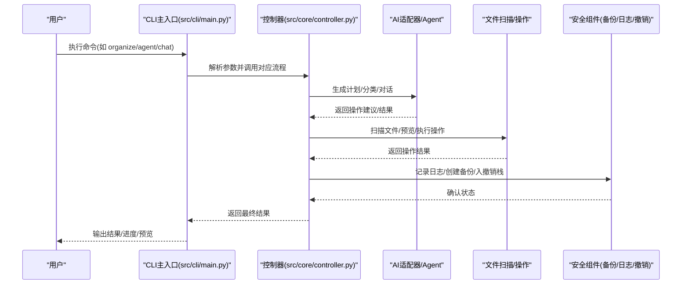
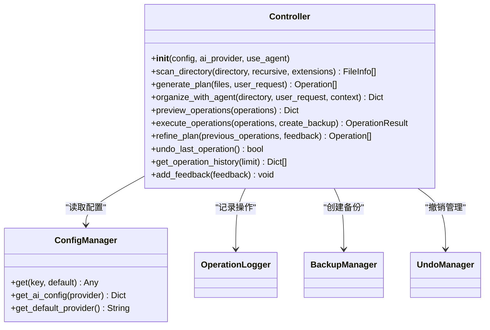
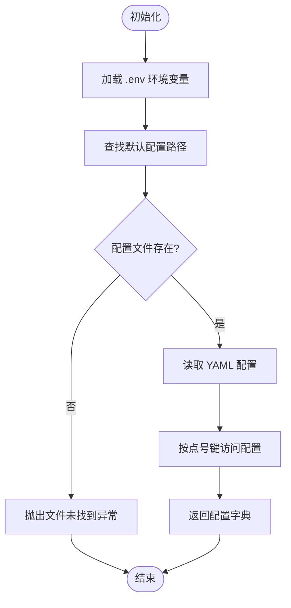
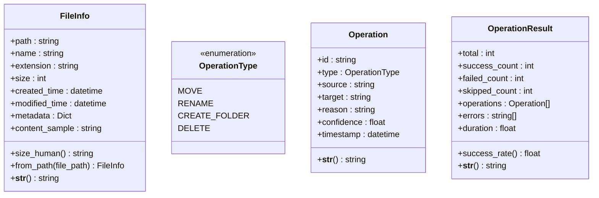
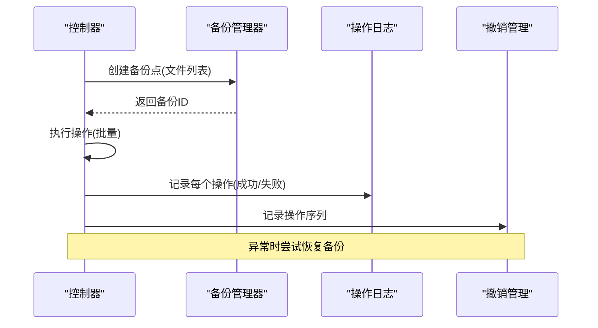
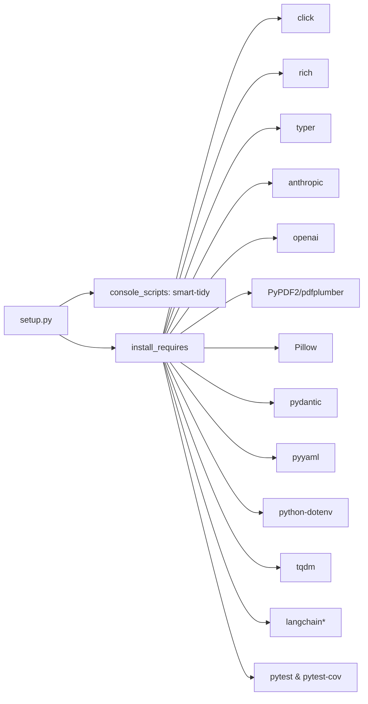

# 代码规范与质量

<cite>
**本文引用的文件**
- [README.md](file://README.md)
- [CONTRIBUTING.md](file://CONTRIBUTING.md)
- [setup.py](file://setup.py)
- [requirements.txt](file://requirements.txt)
- [pytest.ini](file://pytest.ini)
- [src/__init__.py](file://src/__init__.py)
- [src/cli/main.py](file://src/cli/main.py)
- [src/core/controller.py](file://src/core/controller.py)
- [src/utils/config.py](file://src/utils/config.py)
- [config/default_config.yaml](file://config/default_config.yaml)
- [src/models/file_info.py](file://src/models/file_info.py)
- [src/models/operation.py](file://src/models/operation.py)
- [src/utils/file_metadata.py](file://src/utils/file_metadata.py)
- [src/safety/backup.py](file://src/safety/backup.py)
- [src/safety/operation_log.py](file://src/safety/operation_log.py)
</cite>

## 目录
1. [简介](#简介)
2. [项目结构](#项目结构)
3. [核心组件](#核心组件)
4. [架构总览](#架构总览)
5. [详细组件分析](#详细组件分析)
6. [依赖关系分析](#依赖关系分析)
7. [性能考量](#性能考量)
8. [故障排查指南](#故障排查指南)
9. [结论](#结论)
10. [附录](#附录)

## 简介
本指南面向Smart File Tidy项目的开发者与贡献者，系统阐述代码风格标准、质量控制流程与最佳实践。项目已明确采用Black格式化、Flake8静态检查与MyPy类型检查，并在开发与测试流程中集成这些工具。本文将结合项目现有实现与配置，给出可落地的规范、审查清单、质量门禁与持续集成中的质量检查流程建议。

## 项目结构
项目采用分层与功能域结合的组织方式：
- CLI层：Typer + Rich，负责命令解析与用户交互
- 核心层：控制器协调AI适配器、文件扫描与操作、安全组件
- AI适配器层：Claude、OpenAI、本地模型与自定义适配器
- LangChain集成：Agent、工具链与提示词构建
- 安全层：备份、操作日志与撤销管理
- 工具与模型：配置管理、文件元数据提取、数据模型
- 测试与文档：pytest配置、用例与使用文档

```mermaid
graph TB
subgraph "CLI层"
CLI_Main["src/cli/main.py"]
end
subgraph "核心层"
Controller["src/core/controller.py"]
end
subgraph "AI适配器层"
Adapter_Factory["src/ai/adapter_factory.py"]
Base_Adapter["src/ai/base_adapter.py"]
Claude["src/ai/claude_adapter.py"]
OpenAI["src/ai/openai_adapter.py"]
Local["src/ai/local_adapter.py"]
Custom["src/ai/custom_adapter.py"]
Prompt_Builder["src/ai/prompt_builder.py"]
end
subgraph "LangChain集成"
Agent["src/langchain_integration/agent.py"]
Chains["src/langchain_integration/chains/classification_chain.py"]
Tools["src/langchain_integration/tools/*"]
Prompts["src/langchain_integration/prompts.py"]
LLM_Factory["src/langchain_integration/llm_factory.py"]
Content_Analyzer["src/langchain_integration/content_analyzer.py"]
end
subgraph "安全层"
Backup["src/safety/backup.py"]
OpLog["src/safety/operation_log.py"]
Undo["src/safety/undo_manager.py"]
end
subgraph "工具与模型"
ConfigMgr["src/utils/config.py"]
FileInfo["src/models/file_info.py"]
Operation["src/models/operation.py"]
FileMeta["src/utils/file_metadata.py"]
end
CLI_Main --> Controller
Controller --> Adapter_Factory
Controller --> Agent
Controller --> ConfigMgr
Controller --> Backup
Controller --> OpLog
Controller --> Undo
Controller --> FileInfo
Controller --> Operation
Controller --> FileMeta
```

图表来源
- [src/cli/main.py](file://src/cli/main.py#L1-L138)
- [src/core/controller.py](file://src/core/controller.py#L1-L310)
- [src/utils/config.py](file://src/utils/config.py#L1-L116)
- [src/models/file_info.py](file://src/models/file_info.py#L1-L48)
- [src/models/operation.py](file://src/models/operation.py#L1-L54)
- [src/utils/file_metadata.py](file://src/utils/file_metadata.py#L1-L82)
- [src/safety/backup.py](file://src/safety/backup.py#L1-L152)
- [src/safety/operation_log.py](file://src/safety/operation_log.py#L1-L133)

章节来源
- [README.md](file://README.md#L220-L240)
- [src/cli/main.py](file://src/cli/main.py#L1-L138)
- [src/core/controller.py](file://src/core/controller.py#L1-L310)
- [src/utils/config.py](file://src/utils/config.py#L1-L116)
- [config/default_config.yaml](file://config/default_config.yaml#L1-L79)

## 核心组件
- CLI主入口：定义命令与参数，委派至各命令模块
- 控制器：统一编排AI适配器、文件扫描、文件操作与安全组件
- 配置管理：加载YAML配置与dotenv环境变量，提供层级键访问
- 数据模型：FileInfo、Operation、OperationResult，使用Pydantic保证数据结构一致性
- 安全组件：备份管理、操作日志与撤销管理，保障可审计与可恢复
- 工具函数：文件元数据提取，支持PDF与图像基础信息

章节来源
- [src/cli/main.py](file://src/cli/main.py#L1-L138)
- [src/core/controller.py](file://src/core/controller.py#L1-L310)
- [src/utils/config.py](file://src/utils/config.py#L1-L116)
- [src/models/file_info.py](file://src/models/file_info.py#L1-L48)
- [src/models/operation.py](file://src/models/operation.py#L1-L54)
- [src/utils/file_metadata.py](file://src/utils/file_metadata.py#L1-L82)
- [src/safety/backup.py](file://src/safety/backup.py#L1-L152)
- [src/safety/operation_log.py](file://src/safety/operation_log.py#L1-L133)

## 架构总览
下图展示CLI、控制器与各子系统的交互关系，以及配置与安全组件的贯穿：

图表来源
- [src/cli/main.py](file://src/cli/main.py#L1-L138)
- [src/core/controller.py](file://src/core/controller.py#L1-L310)
- [src/safety/backup.py](file://src/safety/backup.py#L1-L152)
- [src/safety/operation_log.py](file://src/safety/operation_log.py#L1-L133)

## 详细组件分析

### 组件A：控制器（Controller）
职责与流程
- 初始化AI适配器或LangChain Agent，回退机制与错误处理
- 协调文件扫描、分类、操作执行与安全组件
- 支持Agent模式与传统模式双通道
- 执行前验证、备份、日志与撤销记录

图表来源
- [src/core/controller.py](file://src/core/controller.py#L1-L310)
- [src/utils/config.py](file://src/utils/config.py#L1-L116)
- [src/safety/operation_log.py](file://src/safety/operation_log.py#L1-L133)
- [src/safety/backup.py](file://src/safety/backup.py#L1-L152)

章节来源
- [src/core/controller.py](file://src/core/controller.py#L1-L310)

### 组件B：配置管理（ConfigManager）
- 支持点号分隔的层级键访问
- 优先从环境变量注入敏感配置
- 提供默认配置路径查找与加载
- 与YAML配置文件协同工作

图表来源
- [src/utils/config.py](file://src/utils/config.py#L1-L116)
- [config/default_config.yaml](file://config/default_config.yaml#L1-L79)

章节来源
- [src/utils/config.py](file://src/utils/config.py#L1-L116)
- [config/default_config.yaml](file://config/default_config.yaml#L1-L79)

### 组件C：数据模型（FileInfo、Operation、OperationResult）
- 使用Pydantic定义字段与校验
- OperationType枚举约束操作类型
- 提供人类可读的字符串表示与辅助属性

图表来源
- [src/models/file_info.py](file://src/models/file_info.py#L1-L48)
- [src/models/operation.py](file://src/models/operation.py#L1-L54)

章节来源
- [src/models/file_info.py](file://src/models/file_info.py#L1-L48)
- [src/models/operation.py](file://src/models/operation.py#L1-L54)

### 组件D：安全组件（备份、日志、撤销）
- 备份管理：创建备份点、保存清单、列出与清理备份
- 操作日志：JSONL格式按日存储，支持查询与清理
- 撤销管理：记录操作序列以便回滚

图表来源
- [src/core/controller.py](file://src/core/controller.py#L203-L256)
- [src/safety/backup.py](file://src/safety/backup.py#L1-L152)
- [src/safety/operation_log.py](file://src/safety/operation_log.py#L1-L133)

章节来源
- [src/safety/backup.py](file://src/safety/backup.py#L1-L152)
- [src/safety/operation_log.py](file://src/safety/operation_log.py#L1-L133)
- [src/core/controller.py](file://src/core/controller.py#L203-L256)

## 依赖关系分析
- 项目入口与分发：setup.py声明控制台脚本入口与最低Python版本
- 运行时依赖：requirements.txt列出CLI框架、AI SDK、文件处理、LangChain生态与测试工具
- 测试配置：pytest.ini定义测试发现规则与标记

图表来源
- [setup.py](file://setup.py#L1-L47)
- [requirements.txt](file://requirements.txt#L1-L43)
- [pytest.ini](file://pytest.ini#L1-L14)

章节来源
- [setup.py](file://setup.py#L1-L47)
- [requirements.txt](file://requirements.txt#L1-L43)
- [pytest.ini](file://pytest.ini#L1-L14)

## 性能考量
- 批处理：控制器与配置共同决定批量大小，平衡吞吐与内存占用
- 扫描深度与文件大小限制：避免对超大文件与深层目录进行内容读取
- 备份策略：仅保存清单与哈希，减少IO与存储开销
- 日志轮转：按日切分与保留天数控制，避免无限增长

章节来源
- [src/core/controller.py](file://src/core/controller.py#L66-L70)
- [config/default_config.yaml](file://config/default_config.yaml#L47-L66)
- [src/safety/backup.py](file://src/safety/backup.py#L23-L70)
- [src/safety/operation_log.py](file://src/safety/operation_log.py#L111-L133)

## 故障排查指南
- Agent导入失败回退：当LangChain不可用时，控制器自动回退到传统模式
- 操作验证失败：执行前进行合法性校验，失败时抛出异常并记录
- 备份恢复：异常发生时尝试根据备份ID恢复，若失败打印错误
- 日志定位：按日期文件检索，支持清理过期日志

章节来源
- [src/core/controller.py](file://src/core/controller.py#L42-L64)
- [src/core/controller.py](file://src/core/controller.py#L218-L255)
- [src/safety/backup.py](file://src/safety/backup.py#L72-L108)
- [src/safety/operation_log.py](file://src/safety/operation_log.py#L85-L133)

## 结论
本指南基于项目现有实现与配置，明确了代码风格与质量控制的落地方式：Black格式化、Flake8静态检查、MyPy类型检查与pytest测试。通过控制器的统一编排、配置管理的层级化与环境变量注入、安全组件的备份与日志，项目实现了可维护、可观测与可恢复的工程化能力。建议在CI中强制执行上述质量检查，并结合测试覆盖率与变更审查流程，确保演进过程的稳定性。

## 附录

### 代码风格与质量工具规范
- Black：统一代码格式，建议在提交前运行以避免格式分歧
- Flake8：检查语法、风格与潜在问题，确保一致的代码质量
- MyPy：基于类型注解进行静态类型检查，提升可读性与可靠性
- pytest：单元与集成测试，配合覆盖率报告评估测试充分性

章节来源
- [CONTRIBUTING.md](file://CONTRIBUTING.md#L38-L55)
- [README.md](file://README.md#L207-L218)

### Python编码规范（基于项目现状的提炼）
- 命名约定
  - 模块与包：小写、下划线分隔
  - 类：驼峰命名
  - 函数与方法：小写下划线
  - 常量：全大写与下划线
- 缩进与行宽
  - 统一使用4空格缩进；遵循Black默认宽度
- 注释与文档
  - 模块顶部提供简要说明
  - 关键函数/类提供清晰的参数与返回说明
- 导入顺序
  - 标准库 → 第三方库 → 项目内模块
  - 同类内部按字母序排列

章节来源
- [CONTRIBUTING.md](file://CONTRIBUTING.md#L38-L55)
- [src/__init__.py](file://src/__init__.py#L1-L5)

### 代码审查清单
- 代码风格：是否通过Black、Flake8与MyPy
- 功能正确性：是否覆盖核心路径与边界条件
- 安全性：是否进行操作验证、备份与日志记录
- 可测试性：是否具备可测试的接口与Mock点
- 文档与注释：是否更新README、API说明与模块注释

章节来源
- [CONTRIBUTING.md](file://CONTRIBUTING.md#L129-L137)

### 质量门禁标准
- 必须通过：Black格式化、Flake8无新增违规、MyPy类型检查无新增错误
- 建议通过：pytest全部通过，覆盖率不低于当前水平
- 特殊变更：涉及安全组件或配置的修改需额外审查

章节来源
- [CONTRIBUTING.md](file://CONTRIBUTING.md#L38-L55)
- [pytest.ini](file://pytest.ini#L1-L14)

### 持续集成中的质量检查流程（建议）
- 触发条件：push与PR
- 步骤建议：
  1) 安装依赖（pip install -r requirements.txt）
  2) 运行Black检查
  3) 运行Flake8检查
  4) 运行MyPy类型检查
  5) 运行pytest并生成覆盖率报告
  6) 上传覆盖率报告（可选）

章节来源
- [CONTRIBUTING.md](file://CONTRIBUTING.md#L25-L36)
- [README.md](file://README.md#L207-L218)

### 错误处理最佳实践与异常设计原则
- 明确异常边界：在控制器中集中捕获并记录，必要时触发回滚
- 友好错误信息：在日志中包含操作ID与上下文
- 回退策略：Agent导入失败时回退到传统模式
- 不破坏一致性：异常时尽量保持数据与状态的一致性

章节来源
- [src/core/controller.py](file://src/core/controller.py#L42-L64)
- [src/core/controller.py](file://src/core/controller.py#L243-L255)

### 日志记录规范
- 格式：JSONL，按日期切分文件
- 字段：时间戳、操作ID、类型、源/目标、原因、状态、错误
- 清理：按保留天数自动删除旧日志

章节来源
- [src/safety/operation_log.py](file://src/safety/operation_log.py#L24-L52)
- [src/safety/operation_log.py](file://src/safety/operation_log.py#L111-L133)

### 代码复用原则、模块边界与接口设计
- 模块边界：CLI、核心、AI适配器、LangChain集成、安全与工具各自职责清晰
- 接口设计：通过抽象基类与工厂模式解耦具体实现
- 配置驱动：通过YAML与环境变量注入配置，降低硬编码

章节来源
- [src/core/controller.py](file://src/core/controller.py#L35-L64)
- [src/utils/config.py](file://src/utils/config.py#L76-L111)

### IDE配置建议与自动化工具集成
- 插件建议：Python、Black、Flake8、MyPy、YAML、dotenv
- 集成方法：
  - VS Code：安装官方Python扩展，配置任务与启动配置
  - Pre-commit钩子：在提交前自动运行Black、Flake8、MyPy
  - CI流水线：在云端执行相同检查，确保一致性

章节来源
- [CONTRIBUTING.md](file://CONTRIBUTING.md#L38-L55)
- [README.md](file://README.md#L207-L218)