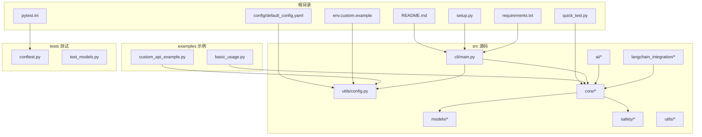
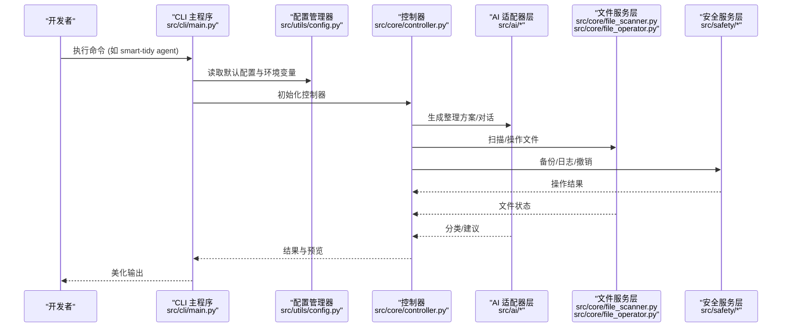
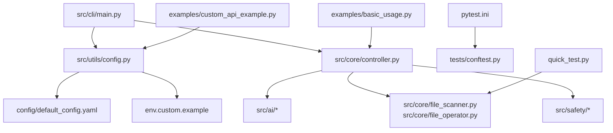

# 开发环境搭建

<cite>
**本文档引用的文件**
- [README.md](file://README.md)
- [setup.py](file://setup.py)
- [requirements.txt](file://requirements.txt)
- [CONTRIBUTING.md](file://CONTRIBUTING.md)
- [config/default_config.yaml](file://config/default_config.yaml)
- [env.custom.example](file://env.custom.example)
- [src/cli/main.py](file://src/cli/main.py)
- [src/utils/config.py](file://src/utils/config.py)
- [pytest.ini](file://pytest.ini)
- [quick_test.py](file://quick_test.py)
- [examples/basic_usage.py](file://examples/basic_usage.py)
- [examples/custom_api_example.py](file://examples/custom_api_example.py)
</cite>

## 目录
1. [简介](#简介)
2. [项目结构](#项目结构)
3. [核心组件](#核心组件)
4. [架构总览](#架构总览)
5. [详细组件分析](#详细组件分析)
6. [依赖关系分析](#依赖关系分析)
7. [性能考虑](#性能考虑)
8. [故障排除指南](#故障排除指南)
9. [结论](#结论)
10. [附录](#附录)

## 简介
本指南面向希望从零开始搭建 Smart File Tidy 开发环境的开发者，涵盖 Python 版本要求、虚拟环境创建、依赖安装、环境变量配置、IDE 推荐配置、调试环境设置、开发工具链安装、环境验证方法以及常见问题解决方案。文档同时提供 Windows、macOS、Linux 三平台的具体安装命令与注意事项，并解释 setup.py 的配置项、requirements.txt 的依赖管理、.env.example 的环境变量设置。

## 项目结构
Smart File Tidy 采用模块化分层架构，主要目录与职责如下：
- config：默认配置文件 default_config.yaml，定义 AI 提供商、LangChain Agent、文件操作、安全与日志等配置
- docs：项目文档，包含 API、配置、LangChain 集成、使用指南等
- examples：示例脚本，包含基础用法、自定义 API 使用、LangChain 示例等
- src：源代码，包含 CLI、核心模块、AI 适配器、LangChain 集成、模型、安全、工具等
- tests：单元测试与集成测试，配合 pytest.ini 进行测试配置
- 根目录：README、setup.py、requirements.txt、环境变量示例、快速测试脚本等

图表来源
- [README.md](file://README.md#L1-L290)
- [setup.py](file://setup.py#L1-L47)
- [requirements.txt](file://requirements.txt#L1-L43)
- [config/default_config.yaml](file://config/default_config.yaml#L1-L79)
- [env.custom.example](file://env.custom.example#L1-L103)
- [pytest.ini](file://pytest.ini#L1-L14)
- [quick_test.py](file://quick_test.py#L1-L74)
- [src/cli/main.py](file://src/cli/main.py#L1-L138)
- [src/utils/config.py](file://src/utils/config.py#L1-L116)
- [examples/basic_usage.py](file://examples/basic_usage.py#L1-L89)
- [examples/custom_api_example.py](file://examples/custom_api_example.py#L1-L99)
- [tests/conftest.py](file://tests/conftest.py#L1-L76)
- [tests/test_models.py](file://tests/test_models.py#L1-L63)

章节来源
- [README.md](file://README.md#L1-L290)
- [setup.py](file://setup.py#L1-L47)
- [requirements.txt](file://requirements.txt#L1-L43)
- [config/default_config.yaml](file://config/default_config.yaml#L1-L79)
- [env.custom.example](file://env.custom.example#L1-L103)
- [pytest.ini](file://pytest.ini#L1-L14)
- [quick_test.py](file://quick_test.py#L1-L74)
- [src/cli/main.py](file://src/cli/main.py#L1-L138)
- [src/utils/config.py](file://src/utils/config.py#L1-L116)
- [examples/basic_usage.py](file://examples/basic_usage.py#L1-L89)
- [examples/custom_api_example.py](file://examples/custom_api_example.py#L1-L99)
- [tests/conftest.py](file://tests/conftest.py#L1-L76)
- [tests/test_models.py](file://tests/test_models.py#L1-L63)

## 核心组件
- CLI 层：基于 Typer 和 Rich，提供命令行接口与美化输出
- 控制器层：协调业务逻辑，连接 AI 适配器、文件服务与安全服务
- AI 适配器层：支持 Claude、OpenAI、本地模型与自定义 OpenAI 兼容 API
- LangChain 集成：Agent 模式下的工具化设计与链式处理
- 文件服务层：文件扫描、操作与元数据处理
- 安全服务层：日志、备份与撤销机制
- 配置管理：默认配置与环境变量合并加载

章节来源
- [README.md](file://README.md#L220-L241)
- [src/cli/main.py](file://src/cli/main.py#L1-L138)
- [src/utils/config.py](file://src/utils/config.py#L1-L116)
- [config/default_config.yaml](file://config/default_config.yaml#L1-L79)

## 架构总览
下图展示从命令行到核心模块与配置的调用关系：

图表来源
- [src/cli/main.py](file://src/cli/main.py#L1-L138)
- [src/utils/config.py](file://src/utils/config.py#L1-L116)
- [config/default_config.yaml](file://config/default_config.yaml#L1-L79)

## 详细组件分析

### Python 版本与工具链
- Python 版本要求：Python >= 3.9
- 推荐使用现代包管理器与虚拟环境
- IDE：推荐 VS Code（配合 Python 扩展、Black、Flake8、MyPy 插件）

章节来源
- [setup.py](file://setup.py#L25-L25)
- [CONTRIBUTING.md](file://CONTRIBUTING.md#L38-L55)

### 虚拟环境创建与激活
- Windows
  - 创建虚拟环境：python -m venv venv
  - 激活虚拟环境：venv\Scripts\activate
- macOS/Linux
  - 创建虚拟环境：python -m venv venv
  - 激活虚拟环境：source venv/bin/activate

章节来源
- [CONTRIBUTING.md](file://CONTRIBUTING.md#L13-L17)

### 依赖安装
- 安装项目依赖：pip install -r requirements.txt
- 安装可编辑模式：pip install -e .

章节来源
- [README.md](file://README.md#L25-L35)
- [CONTRIBUTING.md](file://CONTRIBUTING.md#L19-L23)

### 环境变量配置
- 默认配置文件：config/default_config.yaml
- 环境变量示例：env.custom.example（用于自定义 API）
- 配置加载顺序：优先加载 .env（由 python-dotenv 加载），再合并到默认配置
- 支持的提供商与环境变量：
  - Claude：ANTHROPIC_API_KEY
  - OpenAI：OPENAI_API_KEY
  - 本地模型：LOCAL_LLM_BASE_URL、LOCAL_LLM_MODEL
  - 自定义 API：CUSTOM_API_BASE_URL、CUSTOM_API_KEY、CUSTOM_API_MODEL

章节来源
- [config/default_config.yaml](file://config/default_config.yaml#L1-L79)
- [env.custom.example](file://env.custom.example#L1-L103)
- [src/utils/config.py](file://src/utils/config.py#L76-L116)

### setup.py 配置项说明
- 包信息：名称、版本、描述、URL、作者
- 分类器：开发状态、目标受众、主题、许可证、Python 版本范围
- Python 要求：>=3.9
- 安装依赖：click、rich、typer、anthropic、openai、requests、PyPDF2、pdfplumber、Pillow、pydantic、pyyaml、python-dotenv、tqdm
- 控制台脚本：smart-tidy=src.cli.main:app

章节来源
- [setup.py](file://setup.py#L1-L47)

### requirements.txt 依赖管理
- CLI 框架：click、rich、typer
- AI 集成：anthropic、openai、requests
- 文件处理：PyPDF2、pdfplumber、python-magic-bin（Windows）、python-magic（非 Windows）、Pillow
- 工具库：pydantic、pyyaml、python-dotenv、tqdm
- LangChain 集成：langchain、langchain-core、langchain-anthropic、langchain-openai、langchain-community、langchain-text-splitters、tiktoken
- LangChain 依赖：numpy、dataclasses-json、SQLAlchemy、aiohttp、tenacity
- 测试：pytest、pytest-cov

章节来源
- [requirements.txt](file://requirements.txt#L1-L43)

### IDE 推荐配置与开发工具链
- 代码格式化：Black
- 代码检查：Flake8
- 类型检查：MyPy
- 测试：pytest（pytest.ini 已配置测试路径与标记）

章节来源
- [CONTRIBUTING.md](file://CONTRIBUTING.md#L38-L55)
- [pytest.ini](file://pytest.ini#L1-L14)

### 调试环境设置
- CLI 入口：src/cli/main.py
- 配置管理：src/utils/config.py
- 快速测试：quick_test.py（验证文件操作与 LangChain 工具）
- 示例脚本：examples/basic_usage.py、examples/custom_api_example.py

章节来源
- [src/cli/main.py](file://src/cli/main.py#L1-L138)
- [src/utils/config.py](file://src/utils/config.py#L1-L116)
- [quick_test.py](file://quick_test.py#L1-L74)
- [examples/basic_usage.py](file://examples/basic_usage.py#L1-L89)
- [examples/custom_api_example.py](file://examples/custom_api_example.py#L1-L99)

### 环境验证方法
- 运行测试：pytest
- 生成覆盖率报告：pytest --cov=src --cov-report=html
- 快速验证文件操作：python quick_test.py
- CLI 命令验证：smart-tidy --help、smart-tidy version
- 自定义 API 验证：复制 env.custom.example 为 .env 后运行 python examples/test_custom_api.py

章节来源
- [README.md](file://README.md#L207-L218)
- [README.md](file://README.md#L94-L101)
- [quick_test.py](file://quick_test.py#L1-L74)
- [examples/custom_api_example.py](file://examples/custom_api_example.py#L1-L99)

## 依赖关系分析
下图展示关键模块之间的依赖关系：

图表来源
- [src/cli/main.py](file://src/cli/main.py#L1-L138)
- [src/utils/config.py](file://src/utils/config.py#L1-L116)
- [config/default_config.yaml](file://config/default_config.yaml#L1-L79)
- [env.custom.example](file://env.custom.example#L1-L103)
- [pytest.ini](file://pytest.ini#L1-L14)
- [tests/conftest.py](file://tests/conftest.py#L1-L76)
- [quick_test.py](file://quick_test.py#L1-L74)
- [examples/basic_usage.py](file://examples/basic_usage.py#L1-L89)
- [examples/custom_api_example.py](file://examples/custom_api_example.py#L1-L99)

## 性能考虑
- 批处理大小：config/default_config.yaml 中 file_operations.batch_size 与 langchain.tools.file_operator.batch_size 影响处理吞吐
- 扫描深度与文件大小限制：scan_max_depth 与 max_file_size_mb 控制扫描成本
- 日志级别与保留天数：logging.level 与 retention_days 影响磁盘占用与性能
- LangChain Agent 迭代次数与超时：max_iterations 与 max_execution_time 控制资源消耗

章节来源
- [config/default_config.yaml](file://config/default_config.yaml#L48-L79)

## 故障排除指南
- 无法找到配置文件
  - 现象：启动时报错找不到 config/default_config.yaml
  - 处理：确保项目根目录存在 config/default_config.yaml；或在正确工作目录下运行
- 环境变量未生效
  - 现象：API Key 未被识别
  - 处理：确认 .env 已复制并命名为 .env；检查 DEFAULT_AI_PROVIDER 与对应环境变量是否正确
- Windows 文件类型检测异常
  - 现象：python-magic 无法识别文件类型
  - 处理：requirements.txt 已包含 python-magic-bin；若仍失败，检查系统依赖或改用非 Windows 依赖
- 测试失败或覆盖率报告缺失
  - 现象：pytest 执行失败或无 HTML 报告
  - 处理：安装 pytest 与 pytest-cov；使用 pytest --cov=src --cov-report=html 生成报告
- CLI 命令不可用
  - 现象：smart-tidy 命令不存在
  - 处理：确保已执行 pip install -e .；检查控制台脚本注册

章节来源
- [src/utils/config.py](file://src/utils/config.py#L20-L34)
- [src/utils/config.py](file://src/utils/config.py#L18-L18)
- [requirements.txt](file://requirements.txt#L14-L15)
- [pytest.ini](file://pytest.ini#L1-L14)
- [setup.py](file://setup.py#L41-L45)

## 结论
通过本指南，开发者可在 Windows、macOS、Linux 上快速搭建 Smart File Tidy 的开发环境。建议严格遵循 Python 版本要求、使用虚拟环境、正确配置环境变量与默认配置，并利用 pytest 与快速测试脚本进行验证。遇到问题时，优先检查配置文件路径、环境变量命名与依赖安装状态。

## 附录

### 平台安装命令对照表
- 克隆与进入目录
  - git clone <仓库地址> && cd smart-file-tidy
- 创建并激活虚拟环境
  - Windows: python -m venv venv && venv\Scripts\activate
  - macOS/Linux: python -m venv venv && source venv/bin/activate
- 安装依赖
  - pip install -r requirements.txt
  - pip install -e .
- 配置环境变量
  - 复制示例：cp env.custom.example .env（或 Windows: copy env.custom.example .env）
  - 编辑 .env，设置 DEFAULT_AI_PROVIDER 与对应 API Key
- 运行测试与验证
  - pytest
  - pytest --cov=src --cov-report=html
  - python quick_test.py
  - smart-tidy --help

章节来源
- [README.md](file://README.md#L25-L35)
- [README.md](file://README.md#L45-L101)
- [CONTRIBUTING.md](file://CONTRIBUTING.md#L13-L23)
- [README.md](file://README.md#L207-L218)
- [quick_test.py](file://quick_test.py#L1-L74)
- [src/cli/main.py](file://src/cli/main.py#L129-L133)