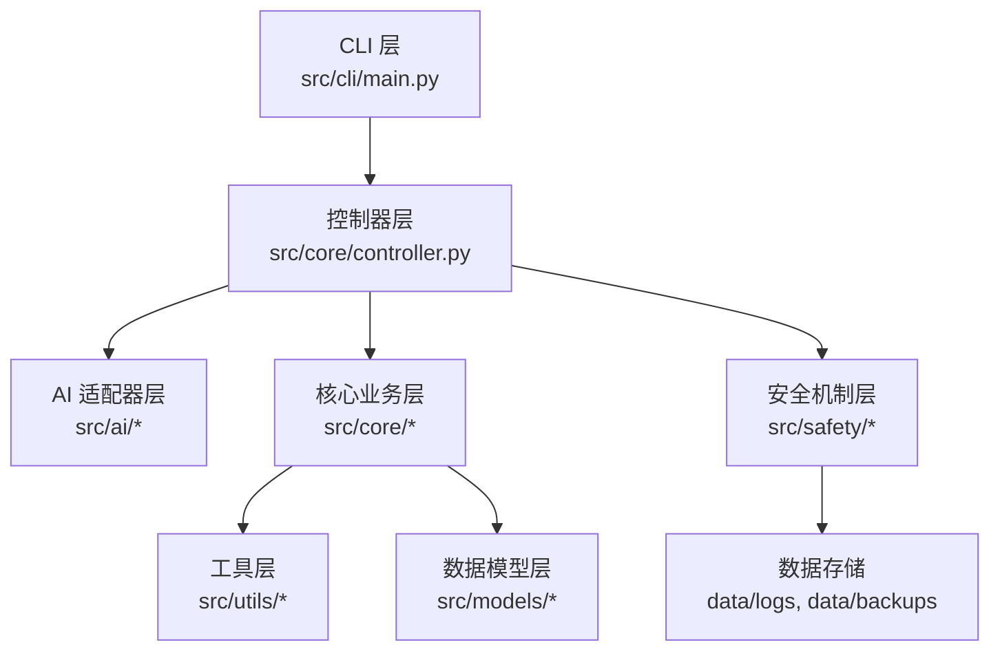
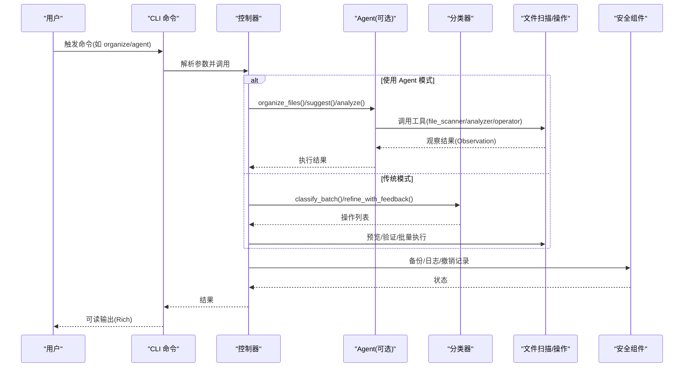
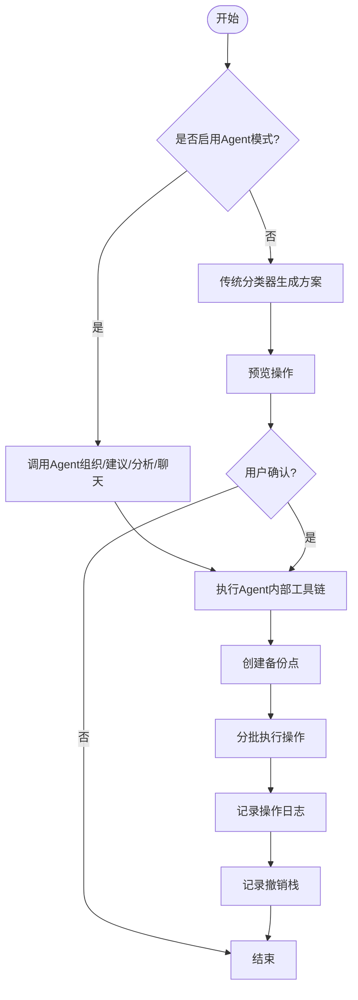
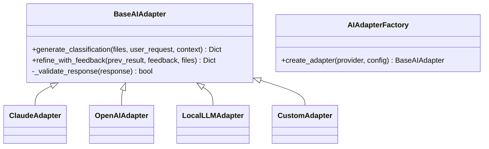
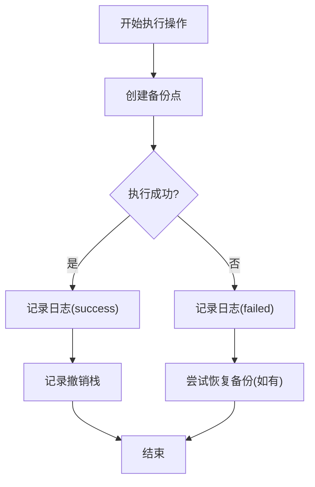
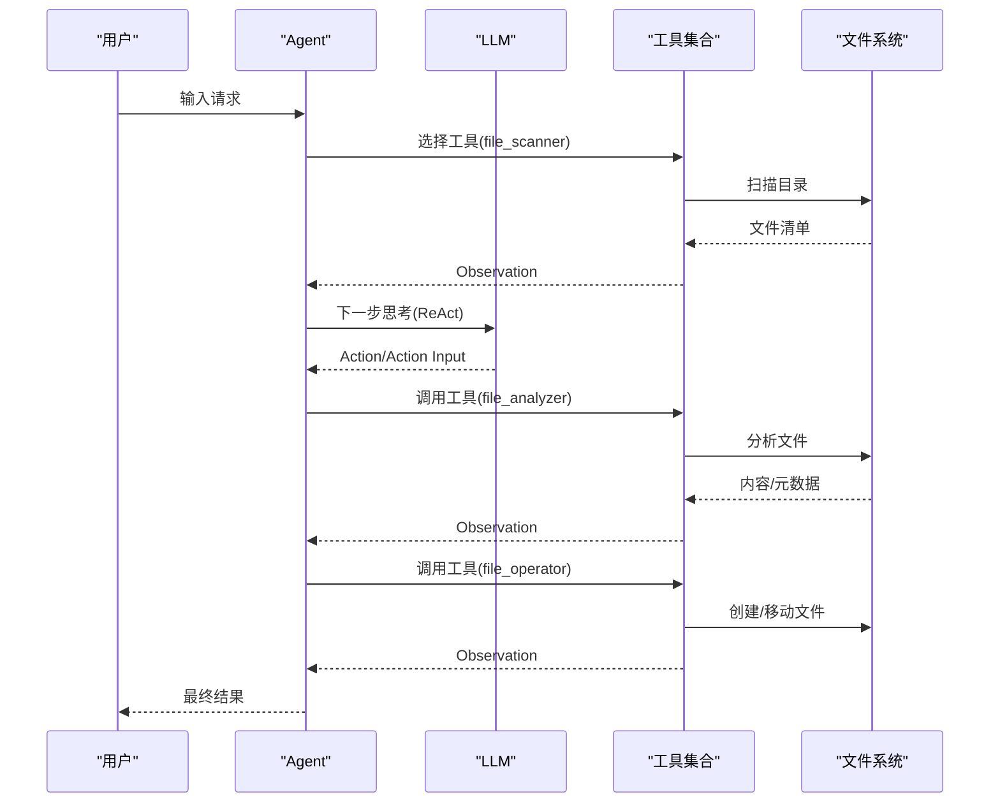
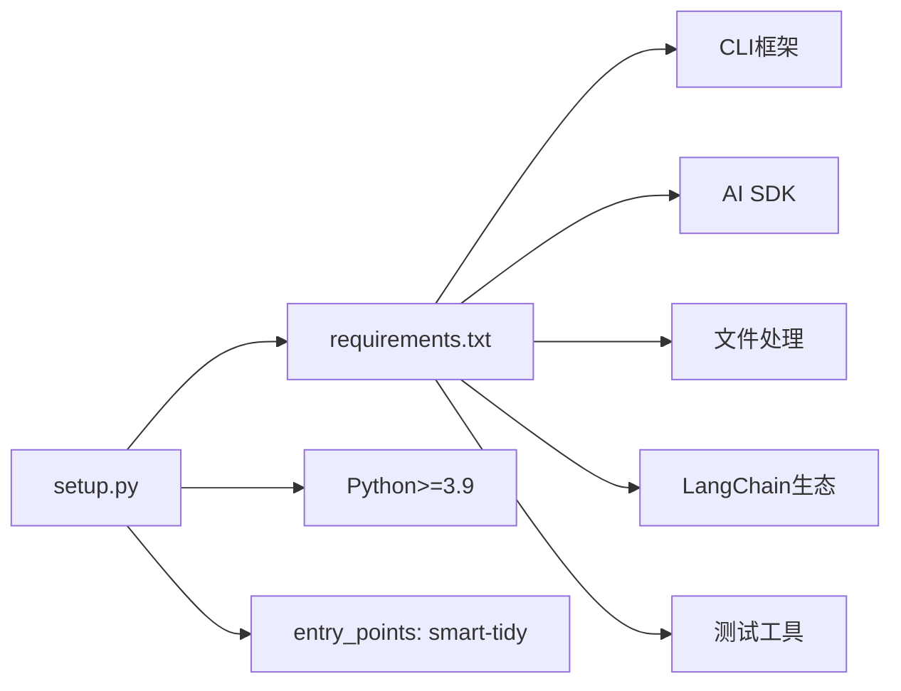

# 开发者指南

<cite>
**本文引用的文件**
- [README.md](file://README.md)
- [CONTRIBUTING.md](file://CONTRIBUTING.md)
- [setup.py](file://setup.py)
- [requirements.txt](file://requirements.txt)
- [pytest.ini](file://pytest.ini)
- [PROJECT_STRUCTURE.md](file://PROJECT_STRUCTURE.md)
- [src/__init__.py](file://src/__init__.py)
- [src/cli/main.py](file://src/cli/main.py)
- [src/core/controller.py](file://src/core/controller.py)
- [src/ai/base_adapter.py](file://src/ai/base_adapter.py)
- [src/safety/backup.py](file://src/safety/backup.py)
- [config/default_config.yaml](file://config/default_config.yaml)
- [docs/API.md](file://docs/API.md)
- [examples/basic_usage.py](file://examples/basic_usage.py)
- [src/langchain_integration/agent.py](file://src/langchain_integration/agent.py)
</cite>

## 目录
1. [简介](#简介)
2. [项目结构](#项目结构)
3. [核心组件](#核心组件)
4. [架构总览](#架构总览)
5. [详细组件分析](#详细组件分析)
6. [依赖分析](#依赖分析)
7. [性能考量](#性能考量)
8. [故障排查指南](#故障排查指南)
9. [结论](#结论)
10. [附录](#附录)

## 简介
本指南面向希望参与智能文件整理助手（Smart File Tidy）项目开发的工程师，系统阐述项目架构设计原则、模块组织结构、编码规范、测试策略、开发环境搭建、依赖管理、虚拟环境配置、IDE设置、代码贡献流程、Pull Request规范、代码审查标准、发布流程、单元测试与集成测试方法、性能测试策略、扩展点与插件机制、API设计原则以及向后兼容性保障。

## 项目结构
项目采用分层模块化组织，围绕“CLI层 → 控制器层 → 业务服务层（AI适配器/文件服务/安全服务）”的职责划分，结合LangChain工具化Agent实现智能化决策与执行。

图表来源
- [PROJECT_STRUCTURE.md](file://PROJECT_STRUCTURE.md#L124-L152)
- [src/cli/main.py](file://src/cli/main.py#L1-L138)
- [src/core/controller.py](file://src/core/controller.py#L1-L310)

章节来源
- [PROJECT_STRUCTURE.md](file://PROJECT_STRUCTURE.md#L1-L256)

## 核心组件
- CLI层：基于Typer + Rich提供命令行交互，定义并路由各类命令（整理、交互、撤销、历史、Agent、建议、分析、聊天、版本等）。
- 控制器层：协调AI适配器、文件扫描器、文件操作器、分类器与安全组件，封装端到端工作流。
- AI适配器层：抽象统一接口，支持Claude、OpenAI、本地模型与自定义API，工厂模式动态创建。
- 文件服务层：文件扫描、元数据提取、内容采样、批量操作与预览。
- 安全机制层：操作日志、备份管理、撤销管理，保障操作可审计、可恢复。
- 工具与模型：配置管理、文件元数据与PDF读取、数据模型（文件信息、操作、操作结果）。

章节来源
- [src/cli/main.py](file://src/cli/main.py#L1-L138)
- [src/core/controller.py](file://src/core/controller.py#L1-L310)
- [src/ai/base_adapter.py](file://src/ai/base_adapter.py#L1-L70)
- [src/safety/backup.py](file://src/safety/backup.py#L1-L152)
- [docs/API.md](file://docs/API.md#L1-L281)

## 架构总览
系统采用“命令驱动 + 控制器编排 + 多适配器 + 安全兜底”的架构，支持传统模式与LangChain Agent模式双通道：

图表来源
- [src/cli/main.py](file://src/cli/main.py#L35-L127)
- [src/core/controller.py](file://src/core/controller.py#L109-L285)
- [src/langchain_integration/agent.py](file://src/langchain_integration/agent.py#L100-L228)

## 详细组件分析

### CLI 层（命令与入口）
- 职责：定义命令、参数、选项；调用控制器执行具体任务；使用Rich美化输出。
- 关键命令：organize、interactive、undo、history、agent、suggest、analyze、chat、version。
- 入口：通过entry_points注册控制台脚本“smart-tidy”。

章节来源
- [src/cli/main.py](file://src/cli/main.py#L1-L138)
- [setup.py](file://setup.py#L41-L46)

### 控制器层（编排与协调）
- 职责：根据配置选择Agent或传统模式；协调扫描、分类、执行、日志、备份、撤销；提供预览、反馈优化、历史查询、撤销等能力。
- Agent回退：若LangChain不可用，自动回退到传统AI适配器模式。
- 执行流程：验证 → 备份 → 批量执行 → 记录日志 → 记录撤销。

图表来源
- [src/core/controller.py](file://src/core/controller.py#L142-L256)

章节来源
- [src/core/controller.py](file://src/core/controller.py#L1-L310)

### AI 适配器层（多提供商统一接口）
- 设计：抽象基类定义统一接口，具体适配器实现生成分类方案与反馈优化；工厂负责创建。
- 支持：Claude、OpenAI、本地模型、自定义OpenAI兼容API。
- 响应校验：统一校验AI响应格式，确保操作字段完备。

图表来源
- [src/ai/base_adapter.py](file://src/ai/base_adapter.py#L9-L70)

章节来源
- [src/ai/base_adapter.py](file://src/ai/base_adapter.py#L1-L70)

### 安全机制层（备份与撤销）
- 备份管理：创建备份点（仅记录元信息与哈希，不复制文件），支持列出、删除、恢复检查。
- 撤销管理：记录最近操作序列，支持撤销最后一次操作。
- 操作日志：记录每次操作状态与错误，便于审计与回溯。

图表来源
- [src/safety/backup.py](file://src/safety/backup.py#L23-L108)

章节来源
- [src/safety/backup.py](file://src/safety/backup.py#L1-L152)

### LangChain Agent（智能决策与工具链）
- 设计：基于ReAct格式解析LLM输出，动态调用工具（扫描、分析、操作、校验）。
- 特性：支持论文整理默认模式、任务类型判断、多轮对话、历史记忆、Dry Run模式。
- 工具链：file_scanner、file_analyzer、file_operator、validation。

图表来源
- [src/langchain_integration/agent.py](file://src/langchain_integration/agent.py#L300-L431)

章节来源
- [src/langchain_integration/agent.py](file://src/langchain_integration/agent.py#L1-L576)

## 依赖分析
- 安装与打包：通过setup.py定义包元信息、Python版本要求、安装依赖与控制台入口。
- 运行时依赖：CLI框架、AI SDK、文件处理、LangChain生态、类型验证、配置与环境变量、进度条等。
- 测试依赖：pytest与覆盖率插件。
- 依赖来源：requirements.txt集中声明，setup.py声明核心运行时依赖。

图表来源
- [setup.py](file://setup.py#L26-L46)
- [requirements.txt](file://requirements.txt#L1-L43)

章节来源
- [setup.py](file://setup.py#L1-L47)
- [requirements.txt](file://requirements.txt#L1-L43)
- [pytest.ini](file://pytest.ini#L1-L14)

## 性能考量
- 并发扫描：并行提取元数据，提升大目录扫描效率。
- 分批处理：按批次执行文件操作，避免内存压力与超时。
- 缓存与增量：预留缓存与增量扫描扩展点，减少重复工作量。
- IO与网络：合理设置AI调用超时、分页与重试策略，避免阻塞。

章节来源
- [PROJECT_STRUCTURE.md](file://PROJECT_STRUCTURE.md#L242-L247)

## 故障排查指南
- Agent导入失败：当LangChain相关模块缺失时，控制器会回退到传统模式；可通过安装LangChain相关依赖解决。
- 配置问题：检查默认配置与.env环境变量；确认AI提供商、模型、密钥与URL正确。
- 测试运行：使用pytest运行全部或指定测试；生成HTML覆盖率报告定位薄弱环节。
- 依赖冲突：优先使用requirements.txt锁定版本；必要时清理虚拟环境后重装。

章节来源
- [src/core/controller.py](file://src/core/controller.py#L56-L58)
- [README.md](file://README.md#L207-L253)
- [CONTRIBUTING.md](file://CONTRIBUTING.md#L25-L36)

## 结论
本项目以清晰的分层架构、统一的AI适配器接口、完善的安全部件与LangChain工具化Agent为核心，兼顾易用性与可扩展性。开发者可在统一的API与测试体系下快速迭代功能，同时通过严格的配置与安全机制保障生产可用性。

## 附录

### 开发环境搭建步骤
- 克隆仓库并创建虚拟环境，激活后安装依赖与可编辑安装。
- 配置AI提供商（Claude/OpenAI/本地/自定义），参考README与env.custom.example。
- 运行测试与覆盖率报告，确保本地环境稳定。

章节来源
- [CONTRIBUTING.md](file://CONTRIBUTING.md#L5-L23)
- [README.md](file://README.md#L23-L101)

### 依赖管理与虚拟环境
- 使用requirements.txt管理运行时依赖。
- 使用setup.py定义安装依赖与控制台入口。
- 使用pytest.ini配置测试发现与标记。

章节来源
- [requirements.txt](file://requirements.txt#L1-L43)
- [setup.py](file://setup.py#L26-L46)
- [pytest.ini](file://pytest.ini#L1-L14)

### IDE 设置建议
- Python版本：3.9+，推荐使用虚拟环境。
- 插件：启用Black格式化、Flake8检查、Mypy类型检查。
- 运行配置：为CLI入口配置参数，便于调试命令行流程。

章节来源
- [CONTRIBUTING.md](file://CONTRIBUTING.md#L38-L55)
- [setup.py](file://setup.py#L20-L24)

### 编码规范与测试策略
- 代码风格：Black、Flake8、Mypy三件套。
- 单元测试：覆盖模型、扫描器、操作器、分类器、安全组件。
- 集成测试：端到端工作流测试，验证CLI→控制器→Agent/传统模式→文件系统。
- 标记与过滤：slow、integration等标记用于区分测试类型。

章节来源
- [CONTRIBUTING.md](file://CONTRIBUTING.md#L38-L55)
- [PROJECT_STRUCTURE.md](file://PROJECT_STRUCTURE.md#L188-L213)
- [pytest.ini](file://pytest.ini#L11-L14)

### 代码贡献流程与PR规范
- 分支：基于feature/分支开发。
- 流程：编写测试 → 实现功能 → 通过测试 → 更新文档 → 提交PR。
- 提交信息：遵循约定式提交，包含类型、作用域与主体。
- 代码审查：关注代码质量、测试覆盖率、文档完整性与性能影响。

章节来源
- [CONTRIBUTING.md](file://CONTRIBUTING.md#L57-L141)

### 发布流程
- 版本：通过setup.py中的版本号管理。
- 入口：通过entry_points注册控制台脚本。
- 说明：README提供安装与使用说明，便于发布与推广。

章节来源
- [src/__init__.py](file://src/__init__.py#L1-L5)
- [setup.py](file://setup.py#L7-L14)
- [setup.py](file://setup.py#L41-L46)
- [README.md](file://README.md#L23-L35)

### 单元测试与集成测试指南
- 单元测试：针对模型、扫描器、操作器、分类器与安全组件的边界条件与异常路径。
- 集成测试：覆盖CLI命令到控制器再到Agent/传统模式的完整链路。
- 性能测试：可扩展为基准测试，评估不同批次大小、并发扫描与AI调用延迟的影响。

章节来源
- [PROJECT_STRUCTURE.md](file://PROJECT_STRUCTURE.md#L188-L213)
- [tests/test_models.py](file://tests/test_models.py#L1-L63)

### API 设计原则与扩展点
- 统一接口：AI适配器基类约束生成方案与反馈优化接口。
- 配置驱动：default_config.yaml集中管理AI、LangChain、文件操作、安全与日志配置。
- 扩展点：新增AI提供商（继承基类并在工厂注册）、新增文件类型（在扫描器与元数据提取处扩展）、自定义分类规则（继承分类器并替换策略）。

章节来源
- [docs/API.md](file://docs/API.md#L1-L281)
- [config/default_config.yaml](file://config/default_config.yaml#L1-L79)
- [PROJECT_STRUCTURE.md](file://PROJECT_STRUCTURE.md#L223-L241)

### 向后兼容性保障
- 版本管理：通过setup.py与__init__.py维护版本号。
- 配置兼容：default_config.yaml提供默认值与可选配置项，避免破坏性变更。
- 行为回退：Agent导入失败时自动回退到传统模式，保证功能可用性。

章节来源
- [src/__init__.py](file://src/__init__.py#L1-L5)
- [setup.py](file://setup.py#L7-L14)
- [src/core/controller.py](file://src/core/controller.py#L56-L58)