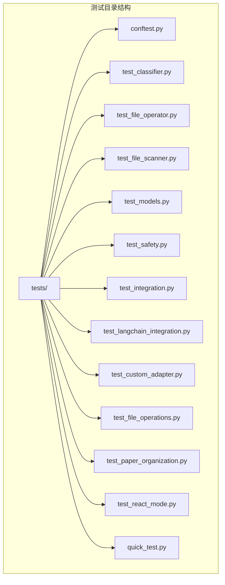
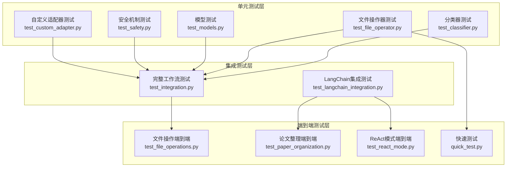
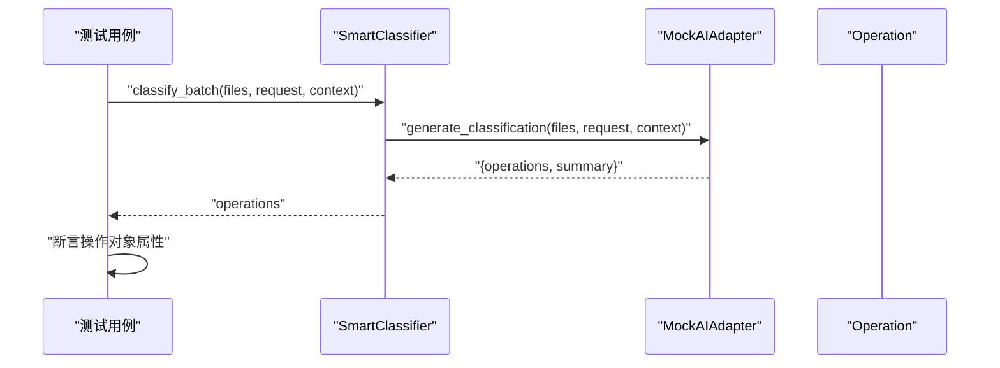
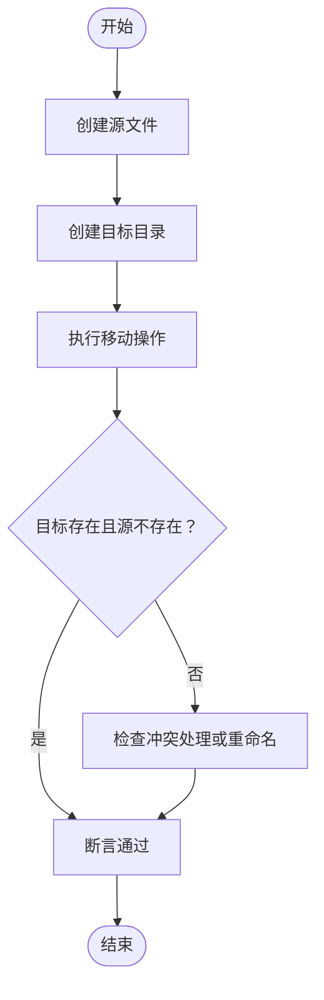
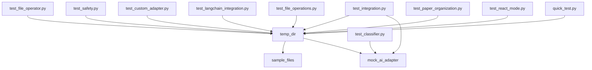

# 测试策略与实践

<cite>
**本文引用的文件**
- [pytest.ini](file://pytest.ini)
- [tests/conftest.py](file://tests/conftest.py)
- [tests/test_classifier.py](file://tests/test_classifier.py)
- [tests/test_file_operator.py](file://tests/test_file_operator.py)
- [tests/test_file_scanner.py](file://tests/test_file_scanner.py)
- [tests/test_models.py](file://tests/test_models.py)
- [tests/test_safety.py](file://tests/test_safety.py)
- [tests/test_integration.py](file://tests/test_integration.py)
- [tests/test_langchain_integration.py](file://tests/test_langchain_integration.py)
- [tests/test_custom_adapter.py](file://tests/test_custom_adapter.py)
- [test_file_operations.py](file://test_file_operations.py)
- [quick_test.py](file://quick_test.py)
- [test_paper_organization.py](file://test_paper_organization.py)
- [test_react_mode.py](file://test_react_mode.py)
- [README.md](file://README.md)
</cite>

## 目录
1. [引言](#引言)
2. [项目结构](#项目结构)
3. [核心组件](#核心组件)
4. [架构总览](#架构总览)
5. [详细组件分析](#详细组件分析)
6. [依赖关系分析](#依赖关系分析)
7. [性能考虑](#性能考虑)
8. [故障排查指南](#故障排查指南)
9. [结论](#结论)
10. [附录](#附录)

## 引言
本文件系统性梳理 Smart File Tidy 的测试体系，涵盖单元测试、集成测试、端到端测试的组织结构与实施方法，解释 pytest 配置、测试文件命名规范、测试用例编写最佳实践，并提供测试覆盖率要求、测试数据准备、模拟对象使用指南，以及测试环境搭建、持续集成配置与自动化测试流程建议。同时，明确各类测试的适用场景：单元测试用于验证独立功能模块，集成测试用于验证组件间交互，端到端测试用于验证完整业务流程。

## 项目结构
Smart File Tidy 的测试目录位于 tests/，包含针对核心模块、AI适配器、LangChain 集成、安全机制、模型数据结构等的测试文件；另有若干独立的端到端测试脚本，如 test_file_operations.py、test_paper_organization.py、test_react_mode.py 和 quick_test.py，用于验证真实文件操作与完整业务流程。

图表来源
- [tests/conftest.py](file://tests/conftest.py#L1-L76)
- [tests/test_classifier.py](file://tests/test_classifier.py#L1-L58)
- [tests/test_file_operator.py](file://tests/test_file_operator.py#L1-L156)
- [tests/test_file_scanner.py](file://tests/test_file_scanner.py)
- [tests/test_models.py](file://tests/test_models.py#L1-L63)
- [tests/test_safety.py](file://tests/test_safety.py#L1-L105)
- [tests/test_integration.py](file://tests/test_integration.py#L1-L88)
- [tests/test_langchain_integration.py](file://tests/test_langchain_integration.py#L1-L245)
- [tests/test_custom_adapter.py](file://tests/test_custom_adapter.py#L1-L85)
- [test_file_operations.py](file://test_file_operations.py#L1-L286)
- [test_paper_organization.py](file://test_paper_organization.py#L1-L186)
- [test_react_mode.py](file://test_react_mode.py#L1-L187)
- [quick_test.py](file://quick_test.py#L1-L74)

章节来源
- [README.md](file://README.md#L242-L253)

## 核心组件
- pytest 配置与标记
  - 测试路径与命名规范：testpaths、python_files、python_classes、python_functions
  - 输出与严格性：-v、--strict-markers、--tb=short、--disable-warnings
  - 自定义标记：slow、integration
- 测试夹具（Fixtures）
  - temp_dir：创建临时目录并在用例结束后清理
  - sample_files：在临时目录下批量创建示例文件
  - mock_ai_adapter：模拟 AI 适配器，返回预设的分类与优化结果
- 测试文件组织
  - 单元测试：test_classifier.py、test_file_operator.py、test_models.py、test_safety.py、test_custom_adapter.py
  - 集成测试：test_integration.py
  - LangChain 集成测试：test_langchain_integration.py
  - 端到端测试：test_file_operations.py、test_paper_organization.py、test_react_mode.py、quick_test.py

章节来源
- [pytest.ini](file://pytest.ini#L1-L14)
- [tests/conftest.py](file://tests/conftest.py#L9-L76)
- [tests/test_classifier.py](file://tests/test_classifier.py#L1-L58)
- [tests/test_file_operator.py](file://tests/test_file_operator.py#L1-L156)
- [tests/test_models.py](file://tests/test_models.py#L1-L63)
- [tests/test_safety.py](file://tests/test_safety.py#L1-L105)
- [tests/test_integration.py](file://tests/test_integration.py#L1-L88)
- [tests/test_langchain_integration.py](file://tests/test_langchain_integration.py#L1-L245)
- [tests/test_custom_adapter.py](file://tests/test_custom_adapter.py#L1-L85)
- [test_file_operations.py](file://test_file_operations.py#L1-L286)
- [test_paper_organization.py](file://test_paper_organization.py#L1-L186)
- [test_react_mode.py](file://test_react_mode.py#L1-L187)
- [quick_test.py](file://quick_test.py#L1-L74)

## 架构总览
测试架构分为三层：
- 单元测试层：验证独立模块（分类器、文件操作器、模型、安全机制、AI适配器）
- 集成测试层：验证模块间协作（控制器、AI适配器、文件扫描与操作）
- 端到端测试层：验证完整业务流程（论文整理、ReAct 模式、真实文件操作）

图表来源
- [tests/test_classifier.py](file://tests/test_classifier.py#L1-L58)
- [tests/test_file_operator.py](file://tests/test_file_operator.py#L1-L156)
- [tests/test_models.py](file://tests/test_models.py#L1-L63)
- [tests/test_safety.py](file://tests/test_safety.py#L1-L105)
- [tests/test_custom_adapter.py](file://tests/test_custom_adapter.py#L1-L85)
- [tests/test_integration.py](file://tests/test_integration.py#L1-L88)
- [tests/test_langchain_integration.py](file://tests/test_langchain_integration.py#L1-L245)
- [test_file_operations.py](file://test_file_operations.py#L1-L286)
- [test_paper_organization.py](file://test_paper_organization.py#L1-L186)
- [test_react_mode.py](file://test_react_mode.py#L1-L187)
- [quick_test.py](file://quick_test.py#L1-L74)

## 详细组件分析

### 单元测试：分类器与对话管理
- 测试要点
  - 批量分类：使用 mock_ai_adapter 生成操作列表，断言操作对象属性
  - 学习规则：从用户反馈中提取规则，断言 learned_rules 非空且包含关键词
  - 对话管理：记录交互历史，断言上下文包含历史字段
- 最佳实践
  - 使用 mock_ai_adapter 减少外部依赖
  - 以最小化输入验证核心行为
  - 断言操作对象的必要字段完整性

图表来源
- [tests/test_classifier.py](file://tests/test_classifier.py#L8-L25)
- [tests/conftest.py](file://tests/conftest.py#L38-L75)

章节来源
- [tests/test_classifier.py](file://tests/test_classifier.py#L1-L58)
- [tests/conftest.py](file://tests/conftest.py#L38-L75)

### 单元测试：文件操作器
- 测试要点
  - 文件移动、重命名、创建文件夹、冲突处理
  - 批量执行与预览模式（dry_run）
  - 操作验证：有效/无效操作的区分与问题报告
- 最佳实践
  - 使用 temp_dir 与 sample_files 提供隔离的测试环境
  - 验证副作用（文件存在性、内容一致性）
  - 预览模式断言不改变实际文件系统

图表来源
- [tests/test_file_operator.py](file://tests/test_file_operator.py#L9-L28)

章节来源
- [tests/test_file_operator.py](file://tests/test_file_operator.py#L1-L156)

### 单元测试：模型数据结构
- 测试要点
  - FileInfo.from_path：断言名称、扩展名、大小、绝对路径
  - 人类可读大小：断言包含单位与数值
  - Operation：断言类型、源/目标、置信度、自动生成ID
  - OperationResult：断言总数、成功率字符串化
- 最佳实践
  - 使用临时文件路径构造 FileInfo
  - 验证字符串化与数值计算的正确性

章节来源
- [tests/test_models.py](file://tests/test_models.py#L1-L63)

### 单元测试：安全机制
- 测试要点
  - 操作日志：写入 JSONL 日志、读取最近操作
  - 备份管理：创建备份点、列出备份、清单存在
  - 撤销管理：记录操作、撤销最后一步、历史长度限制
- 最佳实践
  - 使用 temp_dir 隔离日志与备份目录
  - 断言文件存在性与内容结构

章节来源
- [tests/test_safety.py](file://tests/test_safety.py#L1-L105)

### 单元测试：自定义AI适配器
- 测试要点
  - 初始化参数校验：缺失必填项抛出异常
  - 自定义参数：max_tokens、temperature 覆盖默认值
  - JSON 解析：标准JSON、带代码块、混合文本中的JSON
- 最佳实践
  - 使用断言消息匹配异常信息
  - 覆盖多种响应格式以增强鲁棒性

章节来源
- [tests/test_custom_adapter.py](file://tests/test_custom_adapter.py#L1-L85)

### 集成测试：完整工作流与交互优化
- 测试要点
  - 完整工作流：扫描目录、生成方案、预览、dry-run 执行
  - 交互式优化：初始分类后根据用户反馈细化规则
- 最佳实践
  - 使用 ConfigManager 与 Controller 驱动真实流程
  - 通过 mock_ai_adapter 控制输出以保证可重复性

章节来源
- [tests/test_integration.py](file://tests/test_integration.py#L1-L88)
- [tests/conftest.py](file://tests/conftest.py#L38-L75)

### 集成测试：LangChain 集成
- 测试要点
  - LLM 工厂：创建 Claude 与 OpenAI LLM
  - 工具链：FileScannerTool、FileAnalyzerTool、ValidationTool
  - Agent：初始化、建议生成、内容分析、内容分类
  - Controller：Agent 模式与传统模式切换
- 最佳实践
  - 使用环境变量控制 API 密钥，无密钥时跳过测试
  - 通过 pytestmark 与 skipif 管理条件测试

章节来源
- [tests/test_langchain_integration.py](file://tests/test_langchain_integration.py#L1-L245)

### 端到端测试：文件操作真实执行
- 测试要点
  - 设置测试环境、扫描、核心操作器真实执行、LangChain 工具真实调用
  - 结果验证与清理
- 最佳实践
  - 明确 dry_run=false 以真实执行
  - 详细打印与断言，便于人工核验

章节来源
- [test_file_operations.py](file://test_file_operations.py#L1-L286)

### 端到端测试：论文自动整理
- 测试要点
  - 配置加载、Agent 创建、扫描 PDF、论文识别、自动整理
- 最佳实践
  - 提示用户确认真实移动文件
  - 分步输出与错误追踪

章节来源
- [test_paper_organization.py](file://test_paper_organization.py#L1-L186)

### 端到端测试：ReAct 模式
- 测试要点
  - ReAct 输出解析：思考、动作、最终答案
  - 完整论文整理流程（真实执行）
- 最佳实践
  - 验证解析函数的健壮性
  - 与论文整理流程结合验证工具调用

章节来源
- [test_react_mode.py](file://test_react_mode.py#L1-L187)

### 快速测试：快速验证
- 测试要点
  - 快速创建文件、核心 FileOperator、LangChain FileOperatorTool
- 最佳实践
  - 作为开发调试的快速入口

章节来源
- [quick_test.py](file://quick_test.py#L1-L74)

## 依赖关系分析
- 测试夹具依赖
  - temp_dir 依赖 tempfile 与 shutil
  - sample_files 依赖 temp_dir 与 Path
  - mock_ai_adapter 依赖 BaseAIAdapter 与 FileInfo
- 测试文件耦合
  - 单元测试彼此独立，通过 fixtures 共享基础设施
  - 集成测试依赖核心模块（Controller、ConfigManager、AI 适配器）
  - 端到端测试依赖真实文件系统与外部 API（可选）

图表来源
- [tests/conftest.py](file://tests/conftest.py#L9-L76)
- [tests/test_classifier.py](file://tests/test_classifier.py#L1-L58)
- [tests/test_file_operator.py](file://tests/test_file_operator.py#L1-L156)
- [tests/test_safety.py](file://tests/test_safety.py#L1-L105)
- [tests/test_custom_adapter.py](file://tests/test_custom_adapter.py#L1-L85)
- [tests/test_integration.py](file://tests/test_integration.py#L1-L88)
- [tests/test_langchain_integration.py](file://tests/test_langchain_integration.py#L1-L245)
- [test_file_operations.py](file://test_file_operations.py#L1-L286)
- [test_paper_organization.py](file://test_paper_organization.py#L1-L186)
- [test_react_mode.py](file://test_react_mode.py#L1-L187)
- [quick_test.py](file://quick_test.py#L1-L74)

## 性能考虑
- 测试并发与资源
  - 使用临时目录避免磁盘竞争
  - 控制批量大小与扫描深度，避免长时间运行
- 覆盖率与性能平衡
  - 使用 --tb=short 与 --disable-warnings 提升可读性
  - 仅在必要时启用慢测试标记（slow）
- 端到端测试成本
  - 真实文件操作与外部 API 调用可能较慢，建议分层执行

## 故障排查指南
- 常见问题
  - API 密钥缺失导致 LangChain 测试跳过：检查环境变量 ANTHROPIC_API_KEY、OPENAI_API_KEY
  - 权限不足：确保测试目录可读写
  - 依赖安装：确保 requirements.txt 与安装说明一致
- 调试技巧
  - 使用 -v 与 --tb=short 获取详细输出
  - 通过 dry_run 模式验证逻辑而不改变文件系统
  - 在端到端测试中打印目录结构与断言失败原因
- 性能测试方法
  - 使用 pytest-benchmark（如需）测量关键路径耗时
  - 分模块运行测试，定位瓶颈

章节来源
- [tests/test_langchain_integration.py](file://tests/test_langchain_integration.py#L7-L11)
- [README.md](file://README.md#L207-L218)

## 结论
Smart File Tidy 的测试体系遵循“单元测试—集成测试—端到端测试”的分层策略，通过 fixtures 提供稳定的测试环境，通过 mock 对象隔离外部依赖，通过多类测试覆盖核心功能、模块交互与完整业务流程。建议在持续集成中分层执行测试，结合覆盖率报告与性能监控，确保质量与稳定性。

## 附录

### pytest 配置与标记
- 配置项
  - testpaths：tests
  - python_files：test_*.py
  - python_classes：Test*
  - python_functions：test_*
  - addopts：-v、--strict-markers、--tb=short、--disable-warnings
  - markers：slow、integration
- 使用建议
  - 使用 --markers 查看标记
  - 使用 -m "not slow" 排除慢测试

章节来源
- [pytest.ini](file://pytest.ini#L1-L14)

### 测试文件命名规范
- 单元测试：test_xxx.py（模块名）
- 集成测试：test_integration.py
- 端到端测试：test_*.py（功能导向）
- 公共夹具：tests/conftest.py

章节来源
- [pytest.ini](file://pytest.ini#L2-L5)

### 测试用例编写最佳实践
- 明确前置条件与断言点
- 使用 fixtures 提供隔离环境
- 优先断言行为而非实现细节
- 为外部依赖提供模拟对象
- 保持测试独立与可重复

### 测试覆盖率要求
- 建议：核心模块（分类器、文件操作器、模型、安全机制）覆盖率≥80%
- 集成与端到端：重点覆盖关键路径与边界条件
- 工具：pytest --cov=src --cov-report=html

章节来源
- [README.md](file://README.md#L213-L214)

### 测试数据准备与模拟对象
- 测试数据
  - 使用 temp_dir 与 sample_files 创建隔离的测试文件集
- 模拟对象
  - mock_ai_adapter：返回预设分类与优化结果
  - 配合 ConfigManager 与 Controller 驱动完整流程

章节来源
- [tests/conftest.py](file://tests/conftest.py#L9-L76)
- [tests/test_integration.py](file://tests/test_integration.py#L1-L88)

### 测试环境搭建与自动化
- 安装与运行
  - 安装依赖与可编辑安装
  - 运行 pytest 或指定测试文件
- 持续集成建议
  - 分层执行：单元测试（快）、集成测试（中）、端到端测试（慢）
  - 条件测试：根据环境变量启用 API 相关测试
  - 覆盖率报告：HTML 报告便于审查

章节来源
- [README.md](file://README.md#L207-L218)