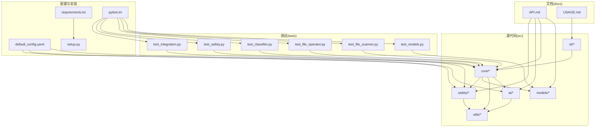
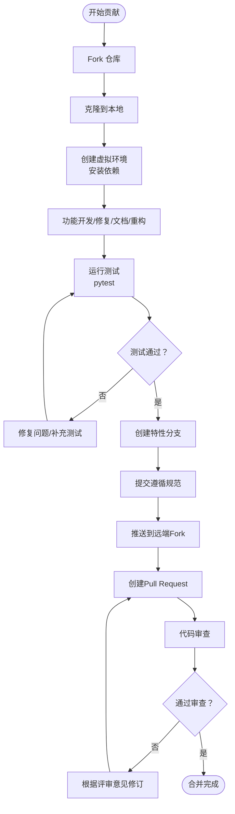
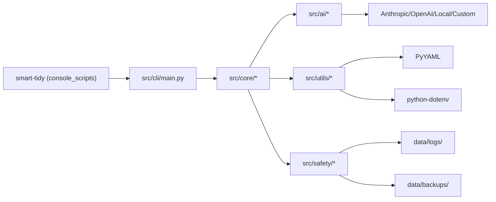

# 贡献流程与协作

<cite>
**本文引用的文件**
- [CONTRIBUTING.md](file://CONTRIBUTING.md)
- [README.md](file://README.md)
- [PROJECT_STRUCTURE.md](file://PROJECT_STRUCTURE.md)
- [QUICKSTART.md](file://QUICKSTART.md)
- [CHANGELOG.md](file://CHANGELOG.md)
- [docs/API.md](file://docs/API.md)
- [docs/USAGE.md](file://docs/USAGE.md)
- [setup.py](file://setup.py)
- [requirements.txt](file://requirements.txt)
- [pytest.ini](file://pytest.ini)
- [config/default_config.yaml](file://config/default_config.yaml)
- [tests/conftest.py](file://tests/conftest.py)
- [tests/test_integration.py](file://tests/test_integration.py)
- [IMPLEMENTATION_SUMMARY.md](file://IMPLEMENTATION_SUMMARY.md)
</cite>

## 目录
1. [简介](#简介)
2. [项目结构](#项目结构)
3. [核心组件](#核心组件)
4. [架构总览](#架构总览)
5. [详细组件分析](#详细组件分析)
6. [依赖分析](#依赖分析)
7. [性能考量](#性能考量)
8. [故障排查指南](#故障排查指南)
9. [结论](#结论)
10. [附录](#附录)

## 简介
本指南面向希望参与 Smart File Tidy 项目的开发者与用户，系统阐述从 Fork 仓库到提交 PR 的完整贡献流程，涵盖分支管理策略、提交信息规范、代码审查流程、不同类型贡献的处理方式（功能开发、Bug 修复、文档改进、重构优化）、Pull Request 与 Issue 模板、变更请求流程、社区参与与沟通渠道、维护者职责、版本发布与变更日志维护、向后兼容性保障、新贡献者入门、常见场景处理与冲突解决机制。

## 项目结构
项目采用模块化分层组织，便于贡献者定位职责范围与测试边界：
- 源代码分层：models（数据模型）、utils（工具）、core（核心业务）、ai（AI适配）、safety（安全机制）、cli（命令行界面）
- 文档与示例：docs（API/使用指南）、examples（示例）
- 测试：tests（单元与集成测试）
- 配置：config（默认配置）、requirements.txt（依赖）、setup.py（打包与入口）

图表来源
- [PROJECT_STRUCTURE.md](file://PROJECT_STRUCTURE.md#L1-L256)
- [docs/API.md](file://docs/API.md#L1-L281)
- [docs/USAGE.md](file://docs/USAGE.md#L1-L245)
- [config/default_config.yaml](file://config/default_config.yaml#L1-L79)
- [requirements.txt](file://requirements.txt#L1-L43)
- [setup.py](file://setup.py#L1-L47)
- [pytest.ini](file://pytest.ini#L1-L14)

章节来源
- [PROJECT_STRUCTURE.md](file://PROJECT_STRUCTURE.md#L1-L256)

## 核心组件
- 贡献流程与规范：CONTRIBUTING.md
- 快速开始与使用：QUICKSTART.md、docs/USAGE.md
- API参考：docs/API.md
- 版本与发布：setup.py（版本号）、CHANGELOG.md（变更日志）
- 测试体系：pytest.ini、tests/conftest.py、tests/test_integration.py
- 配置与依赖：config/default_config.yaml、requirements.txt

章节来源
- [CONTRIBUTING.md](file://CONTRIBUTING.md#L1-L141)
- [QUICKSTART.md](file://QUICKSTART.md#L1-L275)
- [docs/USAGE.md](file://docs/USAGE.md#L1-L245)
- [docs/API.md](file://docs/API.md#L1-L281)
- [CHANGELOG.md](file://CHANGELOG.md#L1-L28)
- [setup.py](file://setup.py#L1-L47)
- [pytest.ini](file://pytest.ini#L1-L14)
- [tests/conftest.py](file://tests/conftest.py#L1-L76)
- [tests/test_integration.py](file://tests/test_integration.py#L1-L62)
- [config/default_config.yaml](file://config/default_config.yaml#L1-L79)
- [requirements.txt](file://requirements.txt#L1-L43)

## 架构总览
下图展示贡献者从开发到测试再到 PR 的典型流程，以及与项目文档、配置、测试的关系。

图表来源
- [CONTRIBUTING.md](file://CONTRIBUTING.md#L57-L141)
- [QUICKSTART.md](file://QUICKSTART.md#L1-L275)
- [README.md](file://README.md#L255-L286)

## 详细组件分析

### 贡献流程与分支策略
- 分支命名建议：feature/xxx、fix/xxx、docs/xxx、refactor/xxx
- 合并与保护：优先使用 squash merge，确保提交历史整洁；必要时 rebase 保持线性历史
- 与上游同步：定期从主分支 rebase，减少冲突
- 提交信息规范：类型（feat/fix/docs/style/refactor/test/chore）+ 范围 + 主题，正文说明动机与影响，底部引用 Issue

章节来源
- [CONTRIBUTING.md](file://CONTRIBUTING.md#L57-L95)

### 提交信息规范与示例
- 规范格式：type(scope): subject
- 类型说明：feat、fix、docs、style、refactor、test、chore
- 示例与引用：参见贡献指南中的示例与引用格式说明

章节来源
- [CONTRIBUTING.md](file://CONTRIBUTING.md#L57-L87)

### 代码风格与质量工具
- Black：代码格式化
- Flake8：静态检查
- MyPy：类型检查
- 测试：pytest（含覆盖率）

章节来源
- [CONTRIBUTING.md](file://CONTRIBUTING.md#L38-L56)

### Pull Request 流程与模板
- 步骤：创建分支 → 修改 → 测试通过 → 推送 → 创建 PR
- 模板建议字段：
  - 摘要与动机
  - 影响范围
  - 测试方法
  - 变更日志条目
  - 相关 Issue/PR 链接
- 代码审查要点：代码质量、测试覆盖率、文档完整性、性能影响

章节来源
- [CONTRIBUTING.md](file://CONTRIBUTING.md#L88-L137)

### Issue 报告模板
- 环境信息：操作系统、Python 版本
- 复现步骤
- 预期行为 vs 实际行为
- 错误信息与堆栈追踪
- 补充信息：配置片段、日志片段、最小可复现示例

章节来源
- [CONTRIBUTING.md](file://CONTRIBUTING.md#L112-L128)

### 不同类型贡献的处理方式
- 功能开发：先写测试 → 实现 → 通过测试 → 更新文档
- Bug 修复：新增可复现测试 → 修复 → 通过测试 → 引用 Issue
- 文档改进：更新对应文档 → 本地预览 → 通过 CI
- 重构优化：保持行为不变 → 提升可读性/性能 → 通过测试与审查

章节来源
- [CONTRIBUTING.md](file://CONTRIBUTING.md#L96-L137)

### 代码审查流程
- 自检清单：提交信息、测试、文档、性能与安全性
- 审查要点：可读性、健壮性、一致性、可维护性
- 评审反馈：及时响应、补充说明、二次审查直至通过

章节来源
- [CONTRIBUTING.md](file://CONTRIBUTING.md#L129-L137)

### 社区参与与沟通
- 提交 Issue：GitHub Issues
- 讨论交流：GitHub Discussions
- 联系方式：README 中提供链接

章节来源
- [README.md](file://README.md#L282-L286)

### 维护者职责
- 审查 PR：确保质量与一致性
- 合并 PR：遵循合并策略与规范
- 版本发布：更新 CHANGELOG、打标签、发布
- 文档维护：保持文档与代码一致
- 社区支持：解答问题、引导贡献

章节来源
- [CONTRIBUTING.md](file://CONTRIBUTING.md#L138-L141)

### 版本发布与变更日志
- 版本号：语义化版本
- 变更日志：Keep a Changelog 格式
- 发布流程：更新 CHANGELOG → 打标签 → 发布 → 更新默认分支

章节来源
- [CHANGELOG.md](file://CHANGELOG.md#L1-L28)
- [setup.py](file://setup.py#L1-L47)

### 向后兼容性保证
- 遵循语义化版本：破坏性变更需升级主版本
- 配置兼容：默认配置文件提供向后兼容选项
- API 稳定性：对外 API 保持稳定，必要时提供迁移指南

章节来源
- [CHANGELOG.md](file://CHANGELOG.md#L5-L6)
- [config/default_config.yaml](file://config/default_config.yaml#L1-L79)

### 新贡献者入门
- 快速开始：安装 → 配置 → 测试连接 → 体验整理
- 熟悉结构：阅读项目结构说明与使用指南
- 从简单开始：修复小 Bug、完善文档、添加测试

章节来源
- [QUICKSTART.md](file://QUICKSTART.md#L1-L275)
- [PROJECT_STRUCTURE.md](file://PROJECT_STRUCTURE.md#L1-L256)
- [docs/USAGE.md](file://docs/USAGE.md#L1-L245)

### 常见贡献场景处理
- 新增 AI 提供商：继承适配器基类 → 实现接口 → 注册工厂 → 编写测试
- 新增文件类型支持：扩展元数据提取 → 扫描器调用 → 编写测试
- 自定义分类规则：继承分类器 → 重写规则方法 → 控制器集成

章节来源
- [PROJECT_STRUCTURE.md](file://PROJECT_STRUCTURE.md#L223-L241)

### 冲突解决机制
- 预防：频繁 rebase、小步提交、清晰的分支命名
- 解决：使用工具逐个文件解决冲突、补充测试、审查合并
- 回滚：必要时使用撤销管理器或备份恢复

章节来源
- [PROJECT_STRUCTURE.md](file://PROJECT_STRUCTURE.md#L249-L256)

### 测试与质量门禁
- 测试运行：pytest、pytest --cov
- 测试配置：pytest.ini（标记、严格模式、短回溯）
- 测试夹具：conftest.py（临时目录、示例文件、Mock AI 适配器）
- 集成测试：端到端工作流验证

章节来源
- [CONTRIBUTING.md](file://CONTRIBUTING.md#L25-L36)
- [pytest.ini](file://pytest.ini#L1-L14)
- [tests/conftest.py](file://tests/conftest.py#L1-L76)
- [tests/test_integration.py](file://tests/test_integration.py#L1-L62)

### API 参考与使用指南
- API 文档：核心类、方法签名、数据模型、安全机制
- 使用指南：基本命令、交互式模式、高级功能、性能优化、安全提示

章节来源
- [docs/API.md](file://docs/API.md#L1-L281)
- [docs/USAGE.md](file://docs/USAGE.md#L1-L245)

## 依赖分析
- 运行时依赖：CLI 框架、AI SDK、文件处理、LangChain 生态、类型校验、配置与环境
- 测试依赖：pytest、pytest-cov
- 安装入口：console_scripts 指向 CLI 应用入口

图表来源
- [setup.py](file://setup.py#L41-L46)
- [requirements.txt](file://requirements.txt#L1-L43)
- [config/default_config.yaml](file://config/default_config.yaml#L1-L79)

章节来源
- [setup.py](file://setup.py#L1-L47)
- [requirements.txt](file://requirements.txt#L1-L43)
- [config/default_config.yaml](file://config/default_config.yaml#L1-L79)

## 性能考量
- 并发与批处理：并行提取元数据、分批处理文件
- 缓存与增量：可扩展文件哈希与元数据缓存、增量扫描
- 配置优化：扫描深度、最大文件大小、批大小、日志级别

章节来源
- [PROJECT_STRUCTURE.md](file://PROJECT_STRUCTURE.md#L242-L247)
- [config/default_config.yaml](file://config/default_config.yaml#L48-L79)

## 故障排查指南
- 无法连接 AI 服务：检查 API Key、网络、代理；使用配置测试命令
- 文件未移动：确认未启用 dry-run、检查权限、查看历史
- 分类不准确：提供更明确需求、使用交互式模式反馈、更换模型
- 测试失败：运行单测定位、查看覆盖率、检查夹具与配置

章节来源
- [QUICKSTART.md](file://QUICKSTART.md#L234-L275)
- [docs/USAGE.md](file://docs/USAGE.md#L178-L229)
- [CONTRIBUTING.md](file://CONTRIBUTING.md#L25-L36)

## 结论
本指南提供了从环境搭建、开发规范、测试要求到发布与维护的全流程规范。建议贡献者在提交前完成自检与测试，并在 PR 描述中清晰说明变更动机、范围与影响，配合完善的文档与变更日志，共同提升项目质量与协作效率。

## 附录

### 提交信息规范示例
- feat(classifier): 基于元数据的分类规则增强
- fix(file_scanner): 修复递归扫描深度越界
- docs(API): 补充 Controller.execute_operations 参数说明
- refactor(core): 将批处理逻辑抽取为独立函数
- test(safety): 新增撤销功能单元测试
- chore(deps): 升级 LangChain 到 0.3.x

章节来源
- [CONTRIBUTING.md](file://CONTRIBUTING.md#L57-L87)

### Pull Request 模板建议
- 摘要与动机
- 影响范围
- 测试方法与结果
- 变更日志条目
- 相关 Issue/PR 链接
- 需要注意的兼容性问题

章节来源
- [CONTRIBUTING.md](file://CONTRIBUTING.md#L88-L137)

### Issue 报告模板建议
- 环境信息（操作系统、Python 版本）
- 复现步骤
- 预期行为 vs 实际行为
- 错误信息与堆栈追踪
- 配置与日志片段
- 最小可复现示例

章节来源
- [CONTRIBUTING.md](file://CONTRIBUTING.md#L112-L128)

### 版本发布流程
- 更新变更日志（未发布段落）
- 增加版本号（语义化版本）
- 打标签并发布
- 更新默认分支至最新版本

章节来源
- [CHANGELOG.md](file://CHANGELOG.md#L1-L28)
- [setup.py](file://setup.py#L8-L8)

### 代码质量门禁
- 代码格式：Black
- 静态检查：Flake8
- 类型检查：MyPy
- 单元测试：pytest
- 覆盖率：pytest --cov

章节来源
- [CONTRIBUTING.md](file://CONTRIBUTING.md#L38-L56)
- [pytest.ini](file://pytest.ini#L1-L14)