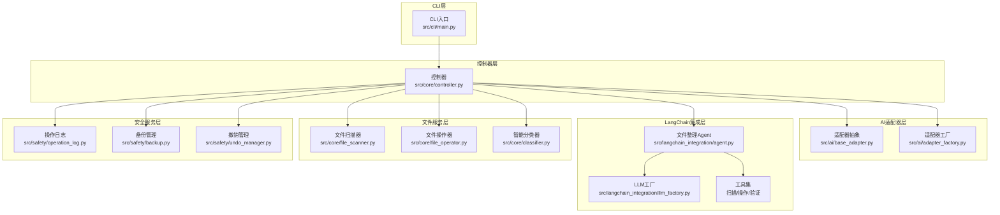
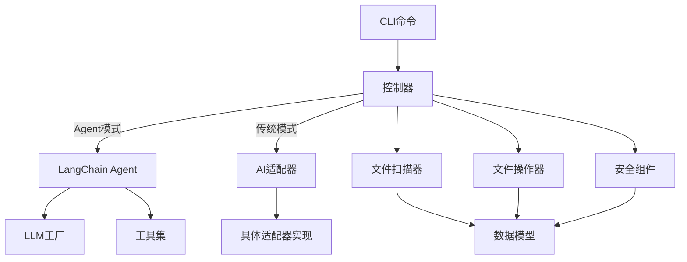
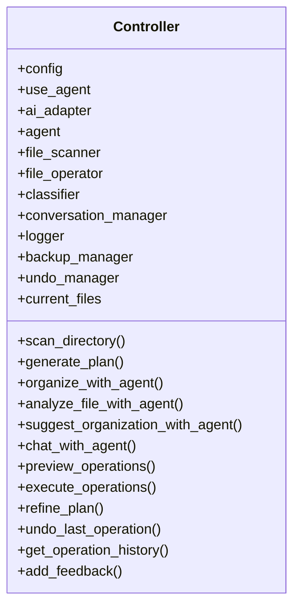
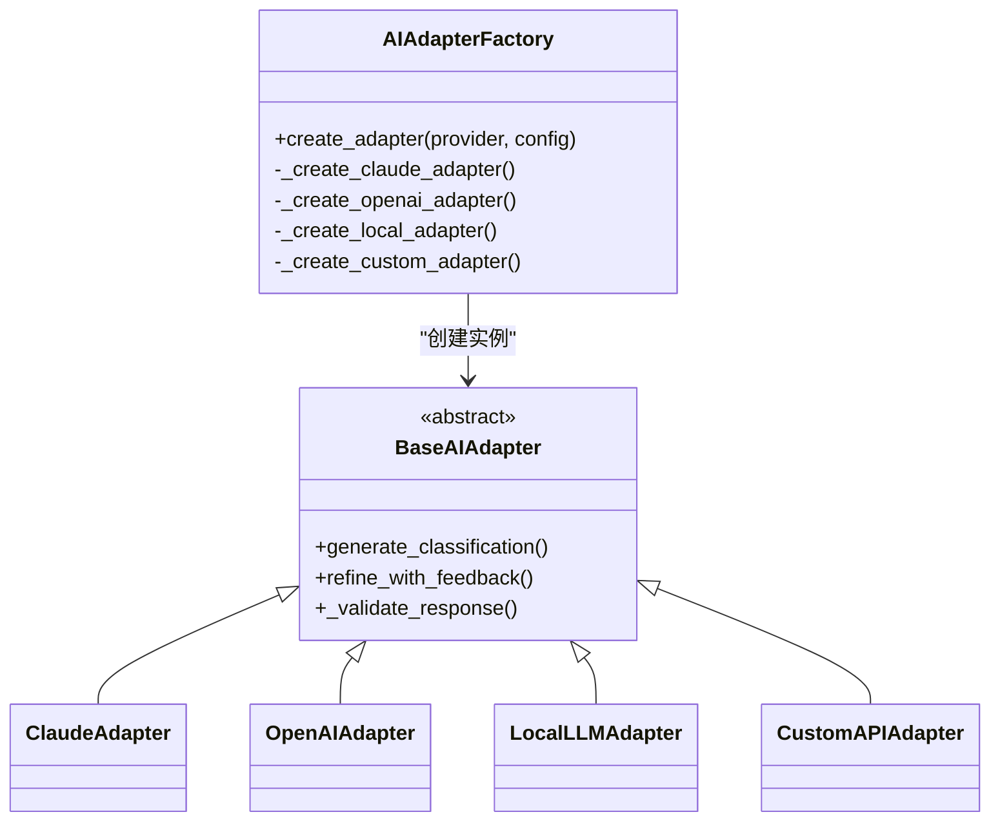
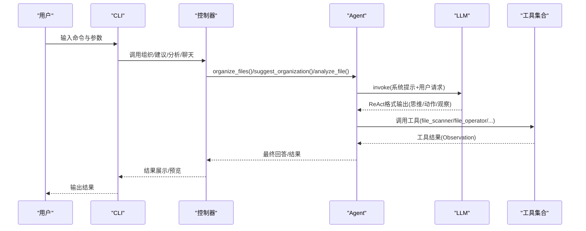
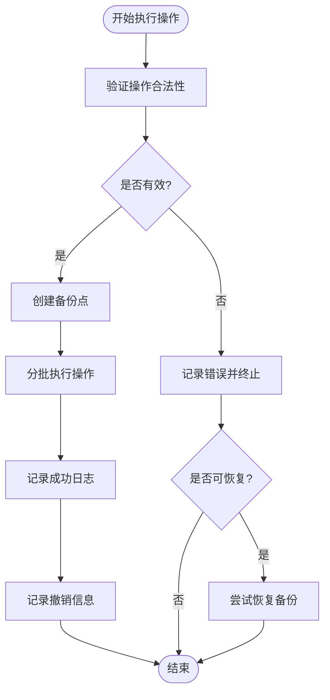
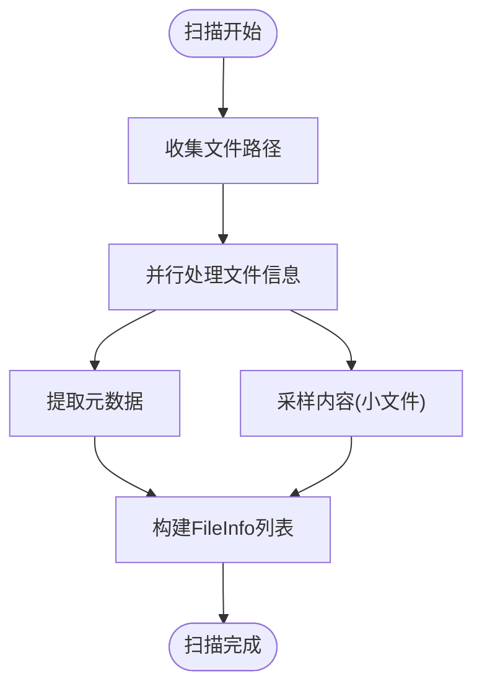
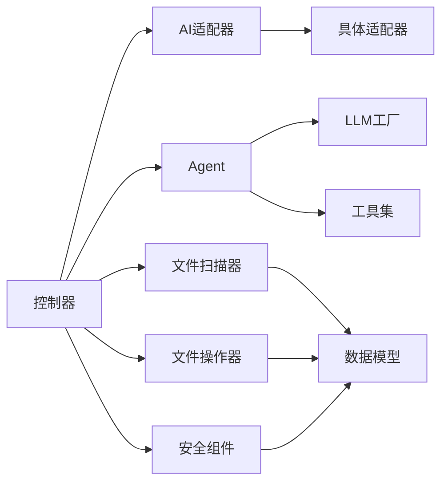

# 项目架构设计

<cite>
**本文引用的文件**
- [README.md](file://README.md)
- [src/core/controller.py](file://src/core/controller.py)
- [src/ai/base_adapter.py](file://src/ai/base_adapter.py)
- [src/ai/adapter_factory.py](file://src/ai/adapter_factory.py)
- [src/langchain_integration/agent.py](file://src/langchain_integration/agent.py)
- [src/langchain_integration/llm_factory.py](file://src/langchain_integration/llm_factory.py)
- [src/langchain_integration/tools/file_scanner_tool.py](file://src/langchain_integration/tools/file_scanner_tool.py)
- [src/langchain_integration/tools/file_operator_tool.py](file://src/langchain_integration/tools/file_operator_tool.py)
- [src/core/classifier.py](file://src/core/classifier.py)
- [src/core/file_scanner.py](file://src/core/file_scanner.py)
- [src/core/file_operator.py](file://src/core/file_operator.py)
- [src/models/file_info.py](file://src/models/file_info.py)
- [src/models/operation.py](file://src/models/operation.py)
- [src/utils/config.py](file://src/utils/config.py)
- [src/cli/main.py](file://src/cli/main.py)
- [src/safety/__init__.py](file://src/safety/__init__.py)
</cite>

## 目录
1. [简介](#简介)
2. [项目结构](#项目结构)
3. [核心组件](#核心组件)
4. [架构总览](#架构总览)
5. [详细组件分析](#详细组件分析)
6. [依赖关系分析](#依赖关系分析)
7. [性能考虑](#性能考虑)
8. [故障排查指南](#故障排查指南)
9. [结论](#结论)
10. [附录](#附录)

## 简介
Smart File Tidy 是一个基于AI的智能文件分类与整理工具，支持自然语言交互与批量自动化处理。其架构采用分层设计与模块化组织，围绕“CLI层 → 控制器层 → AI适配器层/文件服务层/安全服务层”的结构展开，既支持LangChain Agent的工具化智能决策，也支持传统AI适配器模式。项目强调可扩展性、安全性与向后兼容性，通过工厂模式、适配器模式、策略模式等设计模式实现灵活的AI提供商切换与工具链扩展。

## 项目结构
项目采用按功能域划分的模块化组织方式，主要目录与职责如下：
- config：默认配置文件
- docs：用户与开发者文档
- examples：使用示例与自定义API示例
- src：
  - ai：AI适配器抽象与工厂，支持Claude、OpenAI、本地模型、自定义API
  - cli：Typer CLI入口与命令定义
  - core：核心业务逻辑（控制器、分类器、文件扫描器、文件操作器）
  - langchain_integration：LangChain集成（Agent、工具、LLM工厂、提示词）
  - models：数据模型（文件信息、操作记录）
  - safety：安全机制（日志、备份、撤销）
  - utils：配置管理、文件元数据、PDF读取等工具
- tests：单元测试与集成测试

**图表来源**
- [src/cli/main.py](file://src/cli/main.py#L1-L138)
- [src/core/controller.py](file://src/core/controller.py#L1-L310)
- [src/ai/base_adapter.py](file://src/ai/base_adapter.py#L1-L70)
- [src/ai/adapter_factory.py](file://src/ai/adapter_factory.py#L1-L98)
- [src/langchain_integration/agent.py](file://src/langchain_integration/agent.py#L1-L576)
- [src/langchain_integration/llm_factory.py](file://src/langchain_integration/llm_factory.py#L1-L116)
- [src/langchain_integration/tools/file_scanner_tool.py](file://src/langchain_integration/tools/file_scanner_tool.py#L1-L115)
- [src/langchain_integration/tools/file_operator_tool.py](file://src/langchain_integration/tools/file_operator_tool.py#L1-L148)
- [src/core/file_scanner.py](file://src/core/file_scanner.py#L1-L196)
- [src/core/file_operator.py](file://src/core/file_operator.py#L1-L246)
- [src/core/classifier.py](file://src/core/classifier.py#L1-L265)
- [src/safety/__init__.py](file://src/safety/__init__.py#L1-L8)

**章节来源**
- [README.md](file://README.md#L220-L240)
- [src/cli/main.py](file://src/cli/main.py#L1-L138)
- [src/core/controller.py](file://src/core/controller.py#L1-L310)

## 核心组件
- CLI层：基于Typer构建命令行入口，提供organize、interactive、agent、suggest、analyze、chat、history、undo、version等命令，负责用户交互与参数传递。
- 控制器层：主控制器协调AI适配器/Agent、文件扫描器、文件操作器、安全组件，封装业务流程编排与异常处理。
- AI适配器层：定义统一的AI适配器接口，通过工厂按提供商创建具体适配器，支持Claude、OpenAI、本地模型、自定义API。
- LangChain集成层：以Agent为核心，结合工具链（扫描、分析、操作、验证）与LLM工厂，实现ReAct式的工具调用与决策。
- 文件服务层：文件扫描器负责目录遍历与元数据/内容采样；文件操作器负责安全执行移动、重命名、创建文件夹等操作；智能分类器负责规则与AI混合分类及反馈优化。
- 安全服务层：操作日志、备份管理、撤销管理，确保操作可审计、可恢复。

**章节来源**
- [src/cli/main.py](file://src/cli/main.py#L1-L138)
- [src/core/controller.py](file://src/core/controller.py#L1-L310)
- [src/ai/base_adapter.py](file://src/ai/base_adapter.py#L1-L70)
- [src/ai/adapter_factory.py](file://src/ai/adapter_factory.py#L1-L98)
- [src/langchain_integration/agent.py](file://src/langchain_integration/agent.py#L1-L576)
- [src/langchain_integration/llm_factory.py](file://src/langchain_integration/llm_factory.py#L1-L116)
- [src/core/file_scanner.py](file://src/core/file_scanner.py#L1-L196)
- [src/core/file_operator.py](file://src/core/file_operator.py#L1-L246)
- [src/core/classifier.py](file://src/core/classifier.py#L1-L265)
- [src/safety/__init__.py](file://src/safety/__init__.py#L1-L8)

## 架构总览
Smart File Tidy采用“分层+模块化”架构，核心思想是：
- 分层解耦：CLI层只负责输入输出；控制器层负责编排；各领域模块独立演进。
- 模块化组织：AI适配器、LangChain工具、文件服务、安全机制各自独立，通过清晰接口交互。
- 设计模式：
  - 工厂模式：AI适配器工厂与LLM工厂，按提供商动态创建实例。
  - 适配器模式：统一AI适配器接口，屏蔽不同提供商差异。
  - 策略模式：分类器在规则与AI之间切换，支持反馈学习与降级策略。
- 可扩展性：新增AI提供商只需实现适配器接口并注册到工厂；新增LangChain工具只需遵循工具规范；新增安全策略可替换或增强现有组件。

**图表来源**
- [src/core/controller.py](file://src/core/controller.py#L1-L310)
- [src/ai/adapter_factory.py](file://src/ai/adapter_factory.py#L1-L98)
- [src/langchain_integration/agent.py](file://src/langchain_integration/agent.py#L1-L576)
- [src/langchain_integration/llm_factory.py](file://src/langchain_integration/llm_factory.py#L1-L116)
- [src/core/file_scanner.py](file://src/core/file_scanner.py#L1-L196)
- [src/core/file_operator.py](file://src/core/file_operator.py#L1-L246)
- [src/models/file_info.py](file://src/models/file_info.py#L1-L48)
- [src/models/operation.py](file://src/models/operation.py#L1-L54)

## 详细组件分析

### 控制器（Controller）
控制器是系统的核心编排者，负责：
- 初始化AI组件（优先LangChain Agent，失败则回退到传统AI适配器）
- 管理文件扫描、分类、执行、预览、反馈优化、撤销与历史查询
- 协调安全组件（日志、备份、撤销）

**图表来源**
- [src/core/controller.py](file://src/core/controller.py#L15-L310)

**章节来源**
- [src/core/controller.py](file://src/core/controller.py#L1-L310)

### AI适配器层
- 适配器抽象：定义统一接口，确保不同提供商的响应格式一致。
- 适配器工厂：根据提供商名称与配置创建具体适配器实例，集中管理API Key、模型、温度等参数。
- 具体适配器：Claude、OpenAI、本地模型、自定义API适配器均实现统一接口。

**图表来源**
- [src/ai/base_adapter.py](file://src/ai/base_adapter.py#L1-L70)
- [src/ai/adapter_factory.py](file://src/ai/adapter_factory.py#L1-L98)

**章节来源**
- [src/ai/base_adapter.py](file://src/ai/base_adapter.py#L1-L70)
- [src/ai/adapter_factory.py](file://src/ai/adapter_factory.py#L1-L98)

### LangChain集成层
- 文件整理Agent：以ReAct格式解析LLM输出，驱动工具链完成扫描、分析、操作、验证等任务；内置论文整理默认策略。
- LLM工厂：按提供商创建ChatAnthropic、ChatOpenAI、Ollama等LLM实例，支持连接测试。
- 工具集：FileScannerTool、FileAnalyzerTool、FileOperatorTool、ValidationTool，标准化工具输入输出与错误处理。

**图表来源**
- [src/langchain_integration/agent.py](file://src/langchain_integration/agent.py#L100-L228)
- [src/langchain_integration/llm_factory.py](file://src/langchain_integration/llm_factory.py#L1-L116)
- [src/langchain_integration/tools/file_scanner_tool.py](file://src/langchain_integration/tools/file_scanner_tool.py#L1-L115)
- [src/langchain_integration/tools/file_operator_tool.py](file://src/langchain_integration/tools/file_operator_tool.py#L1-L148)

**章节来源**
- [src/langchain_integration/agent.py](file://src/langchain_integration/agent.py#L1-L576)
- [src/langchain_integration/llm_factory.py](file://src/langchain_integration/llm_factory.py#L1-L116)
- [src/langchain_integration/tools/file_scanner_tool.py](file://src/langchain_integration/tools/file_scanner_tool.py#L1-L115)
- [src/langchain_integration/tools/file_operator_tool.py](file://src/langchain_integration/tools/file_operator_tool.py#L1-L148)

### 安全服务层
- 操作日志：记录每次操作的成功/失败与原因，支持历史查询。
- 备份管理：在执行批量操作前创建备份点，失败时可恢复。
- 撤销管理：记录可撤销的操作序列，支持一键撤销。

**图表来源**
- [src/core/controller.py](file://src/core/controller.py#L203-L255)

**章节来源**
- [src/core/controller.py](file://src/core/controller.py#L203-L255)
- [src/safety/__init__.py](file://src/safety/__init__.py#L1-L8)

### 文件服务层
- 文件扫描器：支持递归扫描、扩展名过滤、元数据提取、内容采样（受大小限制），并行处理提升性能。
- 文件操作器：提供预览、分批执行、冲突解决、磁盘空间检查等安全机制。
- 智能分类器：规则快速分类 + AI二次分类 + 反馈学习 + 降级策略。

**图表来源**
- [src/core/file_scanner.py](file://src/core/file_scanner.py#L28-L84)

**章节来源**
- [src/core/file_scanner.py](file://src/core/file_scanner.py#L1-L196)
- [src/core/file_operator.py](file://src/core/file_operator.py#L1-L246)
- [src/core/classifier.py](file://src/core/classifier.py#L1-L265)
- [src/models/file_info.py](file://src/models/file_info.py#L1-L48)
- [src/models/operation.py](file://src/models/operation.py#L1-L54)

## 依赖关系分析
- 控制器依赖AI适配器/Agent、文件扫描器、文件操作器、安全组件；在Agent不可用时自动回退到传统模式。
- LangChain Agent依赖LLM工厂与工具集；工具集依赖核心文件操作能力。
- AI适配器工厂与LLM工厂分别负责不同层次的“提供商抽象”，降低外部依赖变更的影响。
- 数据模型贯穿文件服务层与安全层，确保跨模块的数据一致性。

**图表来源**
- [src/core/controller.py](file://src/core/controller.py#L1-L310)
- [src/ai/adapter_factory.py](file://src/ai/adapter_factory.py#L1-L98)
- [src/langchain_integration/agent.py](file://src/langchain_integration/agent.py#L1-L576)
- [src/langchain_integration/llm_factory.py](file://src/langchain_integration/llm_factory.py#L1-L116)
- [src/core/file_scanner.py](file://src/core/file_scanner.py#L1-L196)
- [src/core/file_operator.py](file://src/core/file_operator.py#L1-L246)
- [src/models/file_info.py](file://src/models/file_info.py#L1-L48)
- [src/models/operation.py](file://src/models/operation.py#L1-L54)

**章节来源**
- [src/core/controller.py](file://src/core/controller.py#L1-L310)
- [src/ai/adapter_factory.py](file://src/ai/adapter_factory.py#L1-L98)
- [src/langchain_integration/agent.py](file://src/langchain_integration/agent.py#L1-L576)
- [src/langchain_integration/llm_factory.py](file://src/langchain_integration/llm_factory.py#L1-L116)
- [src/core/file_scanner.py](file://src/core/file_scanner.py#L1-L196)
- [src/core/file_operator.py](file://src/core/file_operator.py#L1-L246)
- [src/models/file_info.py](file://src/models/file_info.py#L1-L48)
- [src/models/operation.py](file://src/models/operation.py#L1-L54)

## 性能考虑
- 并行扫描：文件扫描器使用线程池并发处理文件信息提取，显著提升大目录扫描效率。
- 分批执行：文件操作器按批次执行，避免一次性提交过多系统调用，提高稳定性与可观测性。
- 内容采样：对超大文件跳过内容读取，减少内存与IO压力。
- LLM连接测试：LLM工厂提供连接测试方法，便于在执行前发现配置问题。
- 预览机制：执行前预览操作统计与潜在问题提示，降低失败风险与回滚成本。

**章节来源**
- [src/core/file_scanner.py](file://src/core/file_scanner.py#L61-L83)
- [src/core/file_operator.py](file://src/core/file_operator.py#L65-L100)
- [src/langchain_integration/llm_factory.py](file://src/langchain_integration/llm_factory.py#L99-L116)

## 故障排查指南
- Agent导入失败：控制器在初始化Agent时捕获导入异常并回退到传统模式，确保功能可用。
- LLM连接失败：使用LLM工厂的连接测试方法快速定位配置问题。
- 操作失败回滚：控制器在执行失败时记录错误并尝试恢复备份，同时记录日志以便审计。
- 工具调用异常：Agent解析ReAct输出时对JSON解析失败进行容错与修复尝试，避免任务中断。
- 配置问题：通过ConfigManager加载配置与环境变量，支持多级键访问与默认值处理。

**章节来源**
- [src/core/controller.py](file://src/core/controller.py#L56-L58)
- [src/langchain_integration/llm_factory.py](file://src/langchain_integration/llm_factory.py#L99-L116)
- [src/langchain_integration/agent.py](file://src/langchain_integration/agent.py#L286-L296)
- [src/utils/config.py](file://src/utils/config.py#L1-L116)

## 结论
Smart File Tidy通过清晰的分层与模块化设计，实现了CLI交互、AI决策、文件操作与安全保障的有机整合。工厂与适配器模式降低了提供商切换成本，LangChain工具链提供了强大的可扩展智能决策能力。整体架构兼顾易用性、可维护性与可扩展性，适合在生产环境中稳定运行并持续演进。

## 附录
- 扩展点设计：新增AI提供商只需实现适配器接口并注册到工厂；新增LangChain工具需遵循工具规范并在Agent中注册；新增安全策略可替换或增强现有组件。
- 插件机制：LangChain工具集天然具备插件化特性，可通过扩展工具实现新的文件分析与操作能力。
- 向后兼容性：控制器在Agent不可用时自动回退到传统模式；配置管理支持默认值与环境变量覆盖，确保部署灵活性。