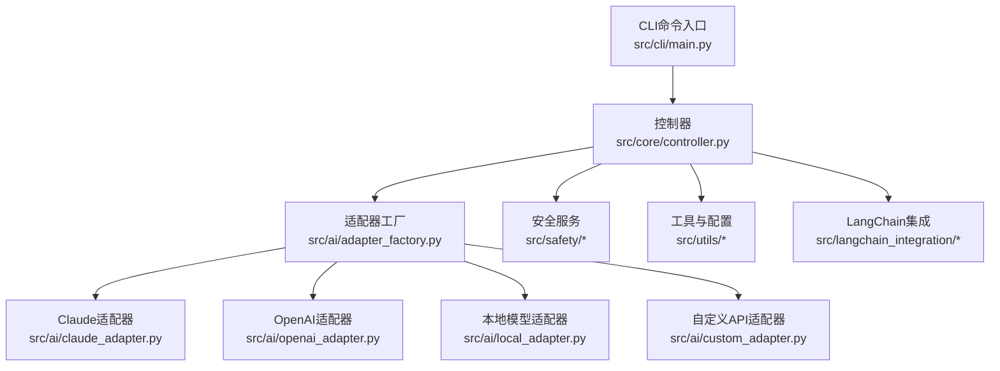
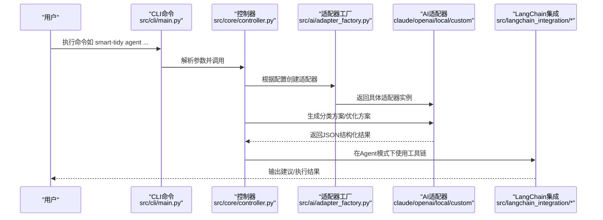
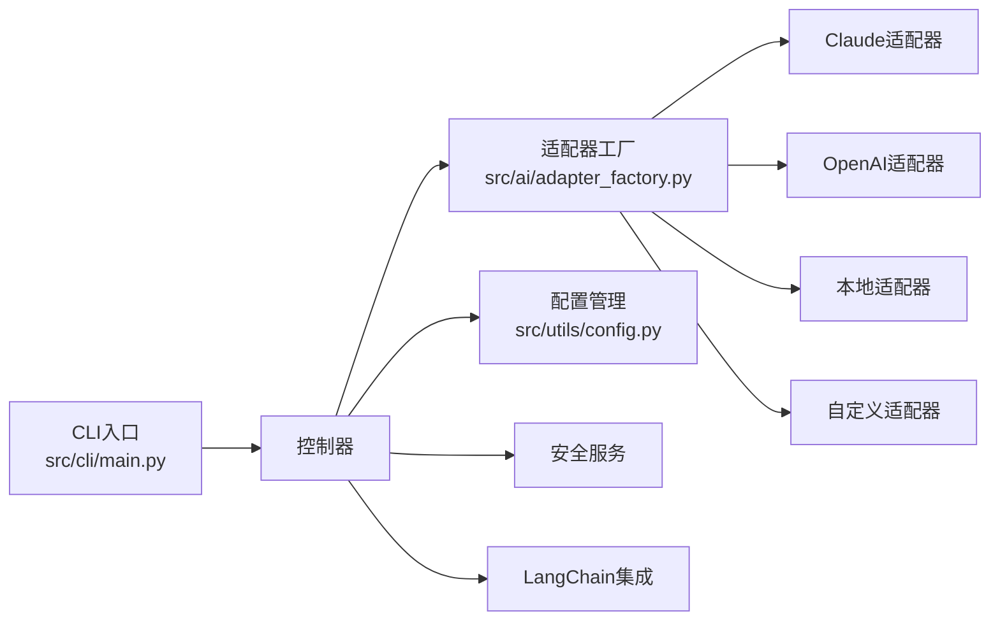

# 快速开始

<cite>
**本文引用的文件**   
- [README.md](file://README.md)
- [QUICKSTART.md](file://QUICKSTART.md)
- [requirements.txt](file://requirements.txt)
- [setup.py](file://setup.py)
- [config/default_config.yaml](file://config/default_config.yaml)
- [env.custom.example](file://env.custom.example)
- [src/cli/main.py](file://src/cli/main.py)
- [src/utils/config.py](file://src/utils/config.py)
- [src/ai/adapter_factory.py](file://src/ai/adapter_factory.py)
- [src/ai/claude_adapter.py](file://src/ai/claude_adapter.py)
- [src/ai/openai_adapter.py](file://src/ai/openai_adapter.py)
- [src/ai/local_adapter.py](file://src/ai/local_adapter.py)
- [src/ai/custom_adapter.py](file://src/ai/custom_adapter.py)
- [examples/basic_usage.py](file://examples/basic_usage.py)
- [examples/custom_api_example.py](file://examples/custom_api_example.py)
- [examples/test_custom_api.py](file://examples/test_custom_api.py)
</cite>

## 目录
1. [简介](#简介)
2. [项目结构](#项目结构)
3. [核心组件](#核心组件)
4. [架构总览](#架构总览)
5. [详细组件分析](#详细组件分析)
6. [依赖关系分析](#依赖关系分析)
7. [性能注意事项](#性能注意事项)
8. [故障排除指南](#故障排除指南)
9. [结论](#结论)
10. [附录](#附录)

## 简介
本指南面向新手，帮助你在5分钟内完成安装、配置与首次运行。你将学会：
- 克隆仓库、安装依赖、本地开发安装
- 四种AI提供商配置方案：Claude、OpenAI、本地模型、自定义API
- .env文件配置示例与验证步骤
- 基本使用：Agent模式与传统模式的简单操作
- 常见配置问题的解决方案与故障排除

## 项目结构
该项目采用模块化设计，主要分为以下层次：
- CLI层：基于Typer + Rich，提供命令行交互与输出美化
- 控制器层：协调业务流程（扫描、分类、执行）
- AI适配器层：统一抽象Claude、OpenAI、本地模型、自定义API
- 文件服务层：文件扫描、操作、元数据处理
- 安全服务层：日志、备份、撤销机制
- LangChain集成：Agent模式与工具链

图表来源
- [src/cli/main.py](file://src/cli/main.py#L1-L138)
- [src/ai/adapter_factory.py](file://src/ai/adapter_factory.py#L1-L98)
- [src/ai/claude_adapter.py](file://src/ai/claude_adapter.py#L1-L133)
- [src/ai/openai_adapter.py](file://src/ai/openai_adapter.py#L1-L110)
- [src/ai/local_adapter.py](file://src/ai/local_adapter.py#L1-L126)
- [src/ai/custom_adapter.py](file://src/ai/custom_adapter.py#L1-L157)

章节来源
- [README.md](file://README.md#L220-L241)

## 核心组件
- CLI命令入口：提供 organize、interactive、agent、suggest、analyze、chat、history、undo、version 等命令
- 配置管理：支持 .env 环境变量、default_config.yaml 配置文件与默认值
- AI适配器：统一接口封装不同提供商的调用细节
- LangChain集成：Agent模式与工具链，支持对话、分析、建议等功能

章节来源
- [src/cli/main.py](file://src/cli/main.py#L1-L138)
- [src/utils/config.py](file://src/utils/config.py#L1-L116)
- [src/ai/adapter_factory.py](file://src/ai/adapter_factory.py#L1-L98)

## 架构总览
下图展示了从CLI到AI适配器与LangChain的调用关系：

图表来源
- [src/cli/main.py](file://src/cli/main.py#L35-L127)
- [src/ai/adapter_factory.py](file://src/ai/adapter_factory.py#L14-L37)
- [src/ai/claude_adapter.py](file://src/ai/claude_adapter.py#L43-L78)
- [src/ai/openai_adapter.py](file://src/ai/openai_adapter.py#L43-L76)
- [src/ai/local_adapter.py](file://src/ai/local_adapter.py#L44-L67)
- [src/ai/custom_adapter.py](file://src/ai/custom_adapter.py#L70-L104)

## 详细组件分析

### 安装与环境准备
- 克隆仓库、安装依赖、本地开发安装
- 安装依赖时会安装CLI框架、AI SDK、LangChain及相关工具库
- 本地开发安装后可通过命令行工具 smart-tidy 使用

章节来源
- [README.md](file://README.md#L23-L35)
- [requirements.txt](file://requirements.txt#L1-L43)
- [setup.py](file://setup.py#L41-L46)

### 配置与验证
- 推荐使用 .env 文件集中管理配置，避免将敏感信息提交到版本控制
- 支持四种AI提供商：Claude、OpenAI、本地模型、自定义API
- 可通过命令行快速设置提供商与关键参数
- 配置验证：查看当前配置、测试连接、指定提供商测试

章节来源
- [README.md](file://README.md#L41-L101)
- [docs/CONFIGURATION.md](file://docs/CONFIGURATION.md#L1-L336)
- [src/utils/config.py](file://src/utils/config.py#L76-L116)

### 四种AI提供商配置方案

#### 方案A：Claude（推荐）
- 在 .env 中设置 DEFAULT_AI_PROVIDER=claude 与 ANTHROPIC_API_KEY
- 适配器负责调用Anthropic SDK，生成分类方案并支持反馈优化

章节来源
- [README.md](file://README.md#L52-L57)
- [src/ai/adapter_factory.py](file://src/ai/adapter_factory.py#L39-L51)
- [src/ai/claude_adapter.py](file://src/ai/claude_adapter.py#L17-L42)

#### 方案B：OpenAI
- 在 .env 中设置 DEFAULT_AI_PROVIDER=openai 与 OPENAI_API_KEY
- 适配器使用OpenAI SDK，要求模型返回JSON格式

章节来源
- [README.md](file://README.md#L59-L64)
- [src/ai/adapter_factory.py](file://src/ai/adapter_factory.py#L53-L65)
- [src/ai/openai_adapter.py](file://src/ai/openai_adapter.py#L17-L42)

#### 方案C：本地模型（免费）
- 在 .env 中设置 DEFAULT_AI_PROVIDER=local 与本地服务地址、模型名
- 本地适配器通过HTTP请求调用本地推理服务（如Ollama）

章节来源
- [README.md](file://README.md#L66-L73)
- [src/ai/adapter_factory.py](file://src/ai/adapter_factory.py#L67-L74)
- [src/ai/local_adapter.py](file://src/ai/local_adapter.py#L12-L32)

#### 方案D：自定义API（第三方服务）
- 在 .env 中设置 DEFAULT_AI_PROVIDER=custom 与 CUSTOM_API_* 三项关键参数
- 支持任何兼容OpenAI API格式的服务（如DeepSeek、通义千问、Moonshot等）
- 提供专用测试脚本验证配置与LangChain集成

章节来源
- [README.md](file://README.md#L75-L88)
- [env.custom.example](file://env.custom.example#L1-L103)
- [src/ai/adapter_factory.py](file://src/ai/adapter_factory.py#L76-L98)
- [src/ai/custom_adapter.py](file://src/ai/custom_adapter.py#L17-L69)
- [examples/test_custom_api.py](file://examples/test_custom_api.py#L1-L390)

### 基本使用示例

#### Agent模式（推荐 - 基于LangChain）
- 智能整理：提供目录路径与需求描述，Agent自动决策与规划
- 获取建议：仅分析并给出整理建议，不执行操作
- 分析单个文件：深入分析文件内容与特征
- 与Agent对话：交互式对话优化整理方案

章节来源
- [README.md](file://README.md#L105-L119)
- [src/cli/main.py](file://src/cli/main.py#L87-L119)

#### 传统模式
- 交互式模式：扫描目录、生成方案、预览并确认执行
- 单次整理：一次性执行整理任务
- 预览模式：仅预览不实际执行，便于确认

章节来源
- [README.md](file://README.md#L121-L132)
- [src/cli/main.py](file://src/cli/main.py#L35-L68)
- [examples/basic_usage.py](file://examples/basic_usage.py#L7-L36)

### 配置文件与环境变量
- 默认配置文件：config/default_config.yaml，包含AI提供商、LangChain Agent、文件操作、安全与日志等配置
- 环境变量：优先级高于配置文件，推荐用于存放敏感信息（API Key）
- CLI配置命令：提供快速设置提供商与关键参数的能力

章节来源
- [config/default_config.yaml](file://config/default_config.yaml#L1-L79)
- [src/utils/config.py](file://src/utils/config.py#L13-L18)
- [docs/CONFIGURATION.md](file://docs/CONFIGURATION.md#L100-L128)

## 依赖关系分析
- CLI命令入口依赖控制器；控制器依赖适配器工厂与配置管理
- 适配器工厂根据配置创建具体适配器（Claude、OpenAI、本地、自定义）
- LangChain集成在Agent模式下使用工具链与LLM

图表来源
- [src/cli/main.py](file://src/cli/main.py#L10-L20)
- [src/ai/adapter_factory.py](file://src/ai/adapter_factory.py#L11-L37)
- [src/utils/config.py](file://src/utils/config.py#L10-L18)

章节来源
- [src/cli/main.py](file://src/cli/main.py#L1-L138)
- [src/ai/adapter_factory.py](file://src/ai/adapter_factory.py#L1-L98)
- [src/utils/config.py](file://src/utils/config.py#L1-L116)

## 性能注意事项
- 批处理大小：合理设置批处理大小，避免单次处理过多文件导致内存压力
- 扫描深度与文件大小：控制最大扫描深度与最大文件大小，提升扫描效率
- 本地模型：确保本地服务稳定运行，避免超时与连接失败
- 自定义API：关注第三方服务的速率限制与可用性

## 故障排除指南
- 无法连接AI服务：检查API Key、网络连通性与服务可用性；使用配置测试命令验证
- 文件未移动：确认未启用预览模式；查看操作历史；检查文件权限
- 分类不准确：提供更明确的需求描述；使用交互式模式并持续反馈；尝试不同模型
- 自定义API连接失败：核对基础URL、API Key与模型名称；参考测试脚本逐项排查

章节来源
- [docs/CONFIGURATION.md](file://docs/CONFIGURATION.md#L285-L327)
- [QUICKSTART.md](file://QUICKSTART.md#L234-L260)
- [examples/test_custom_api.py](file://examples/test_custom_api.py#L162-L194)

## 结论
通过本快速开始指南，你已经完成了安装、配置与首次运行。建议：
- 先使用交互式模式熟悉流程
- 使用预览模式谨慎执行
- 逐步引入Agent模式以获得更强的自动化能力
- 遇到问题时优先使用配置测试与日志定位

## 附录

### 常用命令速查
- 单次整理：smart-tidy organize <目录> --request "<需求>"
- 交互式整理：smart-tidy interactive <目录>
- 递归扫描：smart-tidy organize <目录> --recursive --request "<需求>"
- 预览模式：smart-tidy organize <目录> --dry-run --request "<需求>"
- 查看历史：smart-tidy history
- 撤销操作：smart-tidy undo
- 查看配置：smart-tidy config show
- 帮助：smart-tidy --help

章节来源
- [README.md](file://README.md#L134-L148)
- [QUICKSTART.md](file://QUICKSTART.md#L149-L175)

### .env文件配置示例（节选）
- Claude：设置 DEFAULT_AI_PROVIDER=claude 与 ANTHROPIC_API_KEY
- OpenAI：设置 DEFAULT_AI_PROVIDER=openai 与 OPENAI_API_KEY
- 本地模型：设置 DEFAULT_AI_PROVIDER=local 与 LOCAL_LLM_BASE_URL、LOCAL_LLM_MODEL
- 自定义API：设置 DEFAULT_AI_PROVIDER=custom 与 CUSTOM_API_BASE_URL、CUSTOM_API_KEY、CUSTOM_API_MODEL

章节来源
- [README.md](file://README.md#L52-L88)
- [env.custom.example](file://env.custom.example#L15-L96)

### 配置验证步骤
- 查看当前配置：smart-tidy config show
- 测试连接：smart-tidy config test
- 指定提供商测试：smart-tidy config test --provider <provider>
- 自定义API专用测试：python examples/test_custom_api.py

章节来源
- [docs/CONFIGURATION.md](file://docs/CONFIGURATION.md#L234-L249)
- [examples/test_custom_api.py](file://examples/test_custom_api.py#L303-L348)