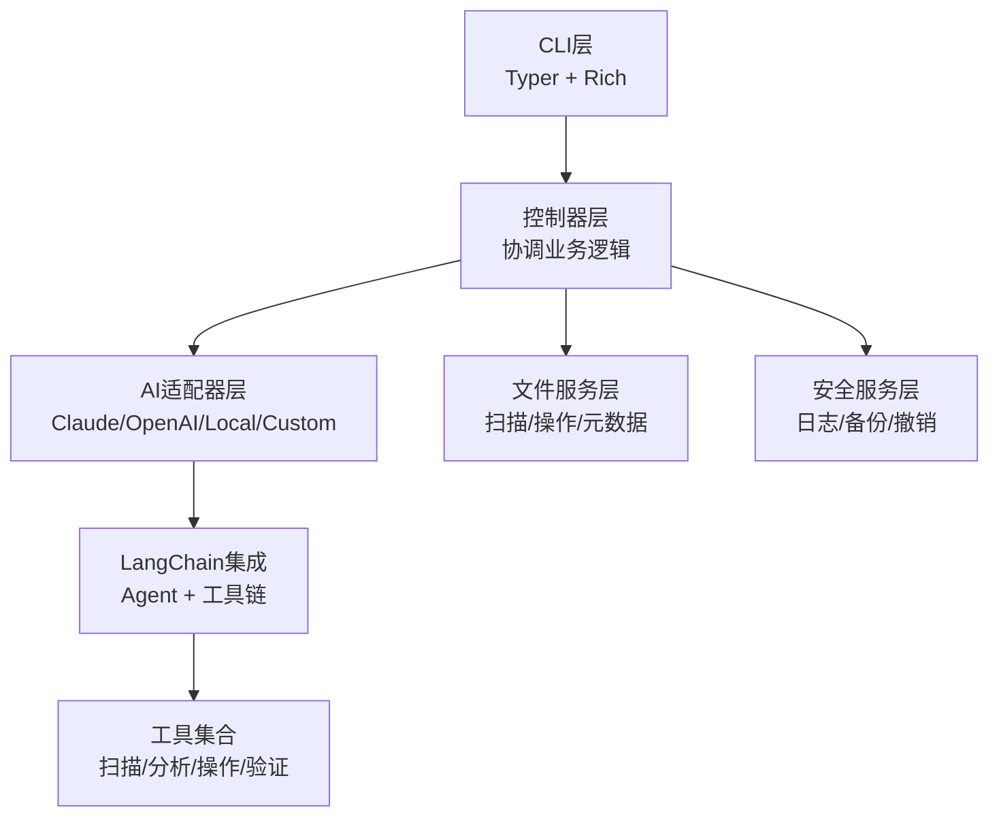
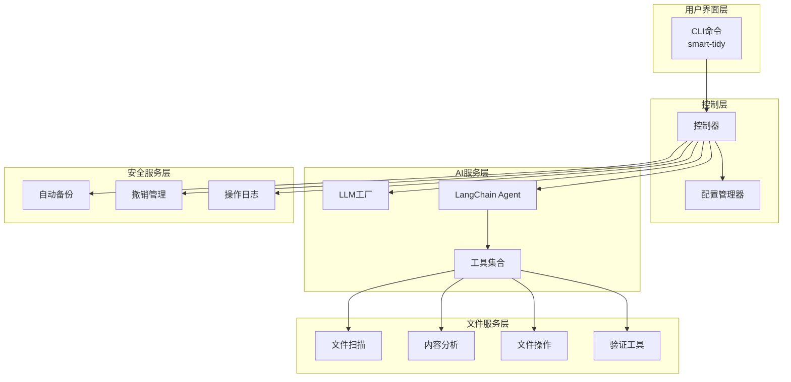
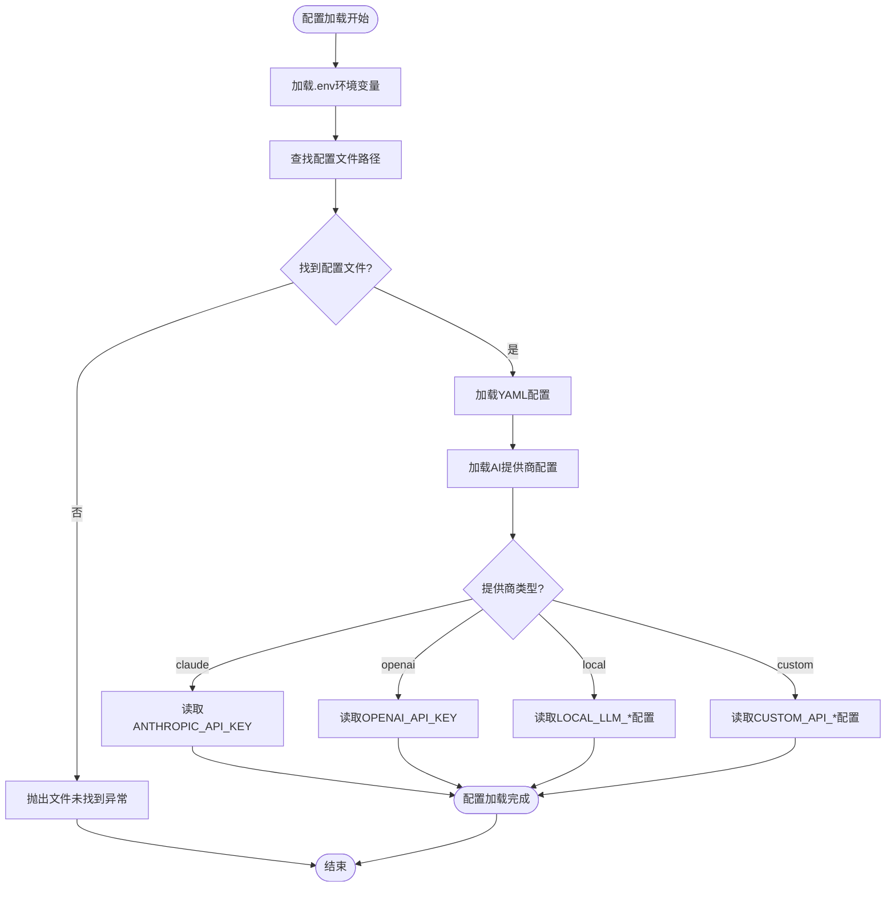
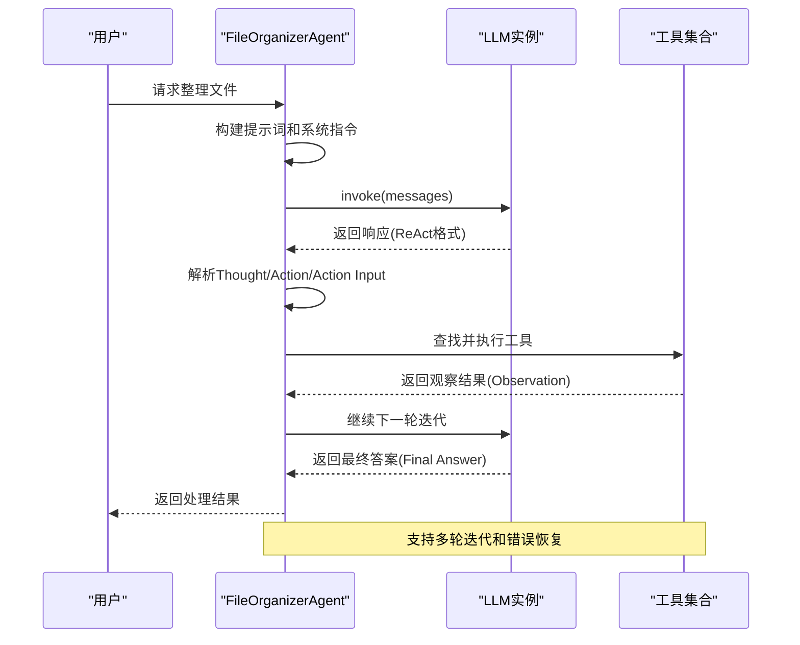
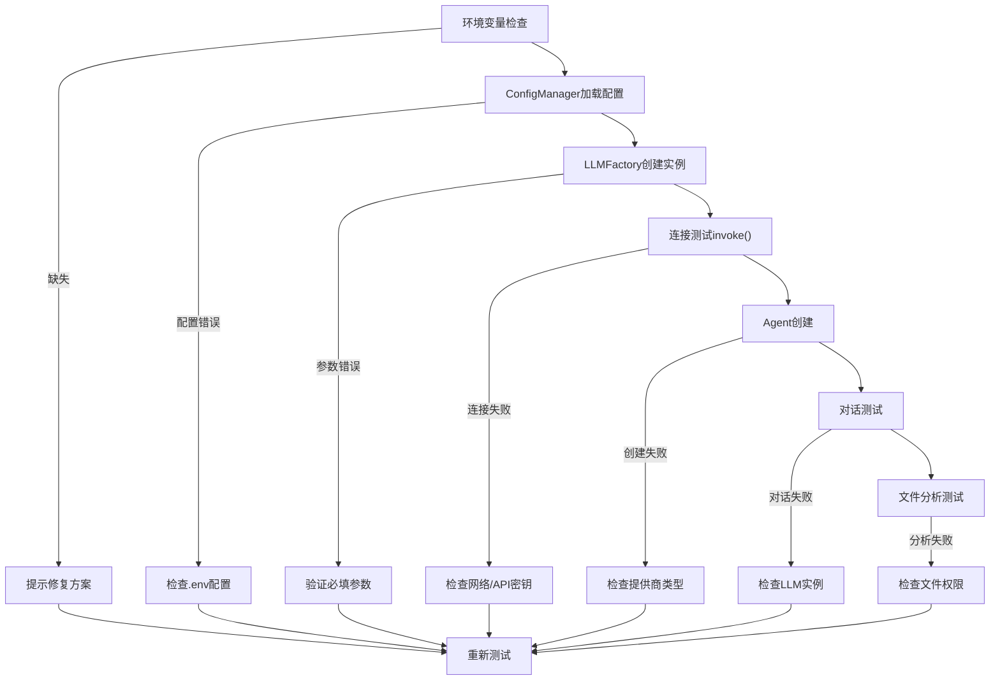
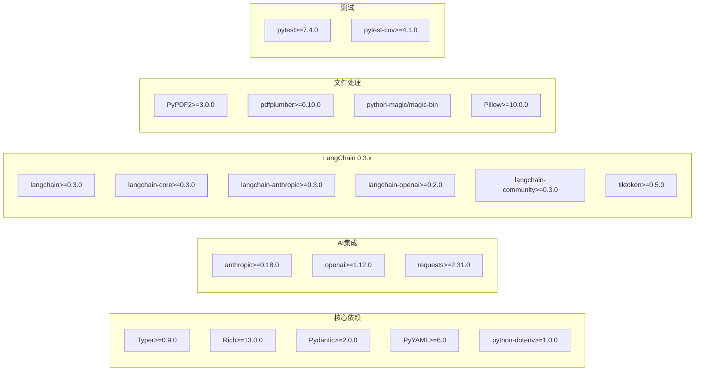

# 故障排除和FAQ

<cite>
**本文引用的文件**
- [README.md](file://README.md)
- [QUICKSTART.md](file://QUICKSTART.md)
- [CONFIG_UNIFICATION_SUMMARY.md](file://CONFIG_UNIFICATION_SUMMARY.md)
- [LANGCHAIN_FIX_GUIDE.md](file://LANGCHAIN_FIX_GUIDE.md)
- [FIX_SUMMARY.md](file://FIX_SUMMARY.md)
- [CUSTOM_API_QUICKSTART.md](file://CUSTOM_API_QUICKSTART.md)
- [requirements.txt](file://requirements.txt)
- [src/utils/config.py](file://src/utils/config.py)
- [src/cli/config_commands.py](file://src/cli/config_commands.py)
- [src/langchain_integration/agent.py](file://src/langchain_integration/agent.py)
- [src/langchain_integration/llm_factory.py](file://src/langchain_integration/llm_factory.py)
- [src/safety/undo_manager.py](file://src/safety/undo_manager.py)
- [examples/test_custom_api.py](file://examples/test_custom_api.py)
- [tests/test_langchain_integration.py](file://tests/test_langchain_integration.py)
- [tests/test_custom_adapter.py](file://tests/test_custom_adapter.py)
</cite>

## 目录
1. [简介](#简介)
2. [项目结构](#项目结构)
3. [核心组件](#核心组件)
4. [架构概览](#架构概览)
5. [详细组件分析](#详细组件分析)
6. [依赖关系分析](#依赖关系分析)
7. [性能考虑](#性能考虑)
8. [故障排除指南](#故障排除指南)
9. [结论](#结论)
10. [附录](#附录)

## 简介
本指南旨在帮助用户快速定位和解决在使用智能文件整理助手过程中的常见问题。涵盖AI集成问题、LangChain Agent故障、自定义API配置错误、性能问题、系统兼容性问题、权限问题以及网络连接问题的诊断与解决方法。同时提供详细的错误日志解读、调试技巧、性能分析工具使用指南，以及社区支持渠道和问题报告流程。

## 项目结构
项目采用模块化设计，围绕CLI层、控制器层、AI适配器层、文件服务层和安全服务层构建，支持多种AI提供商（Claude、OpenAI、本地模型、自定义API）和LangChain Agent智能决策引擎。

**图表来源**
- [README.md](file://README.md#L220-L241)

**章节来源**
- [README.md](file://README.md#L1-L290)

## 核心组件
- 配置管理器：统一加载.env环境变量和配置文件，支持多提供商配置优先级。
- LLM工厂：根据提供商创建对应的语言模型实例，支持Claude、OpenAI、本地Ollama和自定义OpenAI兼容API。
- LangChain Agent：基于ReAct思维链的智能决策引擎，使用工具集执行文件扫描、分析、操作和验证。
- 撤销管理器：记录文件操作并支持撤销，保障操作安全性。
- CLI配置命令：提供配置展示、设置提供商、连接测试等便捷功能。

**章节来源**
- [src/utils/config.py](file://src/utils/config.py#L10-L116)
- [src/langchain_integration/llm_factory.py](file://src/langchain_integration/llm_factory.py#L10-L116)
- [src/langchain_integration/agent.py](file://src/langchain_integration/agent.py#L21-L576)
- [src/safety/undo_manager.py](file://src/safety/undo_manager.py#L10-L155)
- [src/cli/config_commands.py](file://src/cli/config_commands.py#L13-L219)

## 架构概览
系统采用分层架构，CLI层负责用户交互，控制器层协调各服务，AI适配器层抽象不同提供商的API差异，LangChain Agent作为智能决策核心，工具集提供文件扫描、分析、操作和验证能力，安全服务层确保操作可追溯和可恢复。

**图表来源**
- [README.md](file://README.md#L220-L241)
- [src/langchain_integration/agent.py](file://src/langchain_integration/agent.py#L21-L68)

## 详细组件分析

### 配置管理器故障排除
配置管理器负责从.env文件和配置文件加载AI提供商配置，支持环境变量优先级。常见问题包括配置文件路径错误、环境变量未加载、提供商配置缺失等。

**图表来源**
- [src/utils/config.py](file://src/utils/config.py#L35-L116)

**章节来源**
- [src/utils/config.py](file://src/utils/config.py#L10-L116)
- [CONFIG_UNIFICATION_SUMMARY.md](file://CONFIG_UNIFICATION_SUMMARY.md#L25-L42)

### LangChain Agent故障排除
Agent模式依赖LangChain版本兼容性，新实现移除了对AgentExecutor的依赖，采用直接工具调用方式，提升稳定性并支持多版本LangChain。

**图表来源**
- [src/langchain_integration/agent.py](file://src/langchain_integration/agent.py#L300-L431)

**章节来源**
- [src/langchain_integration/agent.py](file://src/langchain_integration/agent.py#L21-L576)
- [LANGCHAIN_FIX_GUIDE.md](file://LANGCHAIN_FIX_GUIDE.md#L68-L104)
- [FIX_SUMMARY.md](file://FIX_SUMMARY.md#L31-L60)

### 自定义API配置故障排除
自定义API支持任何OpenAI兼容的服务，配置通过.env文件统一管理。测试脚本提供完整的端到端验证流程。

**图表来源**
- [examples/test_custom_api.py](file://examples/test_custom_api.py#L24-L345)

**章节来源**
- [examples/test_custom_api.py](file://examples/test_custom_api.py#L1-L390)
- [CUSTOM_API_QUICKSTART.md](file://CUSTOM_API_QUICKSTART.md#L1-L135)

### 撤销管理器故障排除
撤销管理器记录文件操作并支持逆向执行，常见问题包括操作历史为空、反向操作失败、文件不存在等。

**章节来源**
- [src/safety/undo_manager.py](file://src/safety/undo_manager.py#L10-L155)

## 依赖关系分析
项目依赖关系随LangChain版本升级而调整，新版本要求支持更高的兼容性。

**图表来源**
- [requirements.txt](file://requirements.txt#L1-L43)

**章节来源**
- [requirements.txt](file://requirements.txt#L24-L31)
- [FIX_SUMMARY.md](file://FIX_SUMMARY.md#L19-L30)

## 性能考虑
- 批处理优化：通过配置文件调整批量大小和扫描深度，平衡性能与内存使用。
- 工具调用效率：Agent采用ReAct思维链，减少不必要的工具调用，提高整体效率。
- 缓存策略：合理使用预览模式(--dry-run)避免重复计算和网络请求。
- 资源监控：使用操作系统自带的资源监控工具观察CPU、内存和磁盘IO使用情况。

## 故障排除指南

### AI集成问题
**症状**：Agent模式初始化失败，提示导入错误或连接失败
**诊断步骤**：
1. 检查LangChain版本兼容性
   - 运行 `pip list | grep langchain`
   - 确认版本满足≥0.3.0要求
2. 验证依赖完整性
   - 运行 `pip install --upgrade -r requirements.txt`
3. 测试Agent功能
   - 运行 `python examples/test_custom_api.py`
   - 或 `uv run smart-tidy agent ./test_files --request "测试" --dry-run`

**解决方案**：
- 升级依赖至兼容版本
- 清理虚拟环境后重新安装
- 检查网络代理设置

**章节来源**
- [LANGCHAIN_FIX_GUIDE.md](file://LANGCHAIN_FIX_GUIDE.md#L14-L66)
- [FIX_SUMMARY.md](file://FIX_SUMMARY.md#L61-L96)

### 自定义API配置错误
**症状**：提示"自定义API地址未配置"或"API密钥未配置"
**诊断步骤**：
1. 检查.env文件是否存在且格式正确
2. 验证必需环境变量：
   - DEFAULT_AI_PROVIDER=custom
   - CUSTOM_API_BASE_URL
   - CUSTOM_API_KEY
   - CUSTOM_API_MODEL
3. 运行配置测试
   - `smart-tidy config test`
   - `python examples/test_custom_api.py`

**解决方案**：
- 使用推荐的.env配置模板
- 确认API地址包含/v1后缀
- 检查API密钥有效期
- 尝试其他支持的服务提供商

**章节来源**
- [CUSTOM_API_QUICKSTART.md](file://CUSTOM_API_QUICKSTART.md#L95-L114)
- [examples/test_custom_api.py](file://examples/test_custom_api.py#L24-L85)

### LangChain Agent故障
**症状**：Agent模式回退到传统模式，或出现导入错误
**诊断步骤**：
1. 检查Agent实现是否正确
   - 查看 `src/langchain_integration/agent.py` 是否被正确重写
2. 验证工具调用流程
   - 检查ReAct格式输出解析
   - 确认工具名称匹配
3. 测试Agent功能
   - 运行 `python tests/test_langchain_integration.py`

**解决方案**：
- 确保使用最新版本的Agent实现
- 检查工具依赖是否完整
- 验证消息格式符合ReAct规范

**章节来源**
- [src/langchain_integration/agent.py](file://src/langchain_integration/agent.py#L247-L298)
- [tests/test_langchain_integration.py](file://tests/test_langchain_integration.py#L104-L130)

### 性能问题
**症状**：文件整理速度慢或内存占用过高
**诊断步骤**：
1. 检查配置参数
   - 批处理大小：`file_operations.batch_size`
   - 最大文件大小：`file_operations.max_file_size_mb`
   - 扫描深度：`file_operations.scan_max_depth`
2. 监控系统资源
   - 使用系统监视器观察CPU和内存使用
   - 检查磁盘IO性能
3. 优化处理策略
   - 分批处理大量文件
   - 使用预览模式验证效果

**解决方案**：
- 调整批处理大小以平衡性能
- 限制扫描深度避免不必要的遍历
- 使用更高效的文件过滤规则

**章节来源**
- [src/utils/config.py](file://src/utils/config.py#L43-L56)

### 系统兼容性问题
**症状**：在某些操作系统或Python版本上运行异常
**诊断步骤**：
1. 检查Python版本要求（3.9+）
2. 验证平台特定依赖
   - Windows: python-magic-bin
   - 其他平台: python-magic
3. 测试平台兼容性

**解决方案**：
- 升级到受支持的Python版本
- 安装平台特定的二进制依赖
- 使用虚拟环境隔离依赖

**章节来源**
- [requirements.txt](file://requirements.txt#L14-L16)

### 权限问题
**症状**：文件无法移动、重命名或创建文件夹
**诊断步骤**：
1. 检查目标目录写入权限
2. 验证源文件访问权限
3. 确认用户账户权限

**解决方案**：
- 调整文件和目录权限
- 使用管理员权限运行
- 检查防病毒软件拦截

### 网络连接问题
**症状**：API请求超时或连接失败
**诊断步骤**：
1. 检查网络连通性
2. 验证代理设置
3. 测试DNS解析

**解决方案**：
- 配置正确的代理服务器
- 检查防火墙设置
- 尝试不同的网络环境

### 错误日志解读
Agent模式提供详细的调试信息，包括：
- 迭代次数和当前状态
- 工具调用详情和结果
- 错误堆栈跟踪
- 性能指标

使用方法：
- 添加 `--verbose` 参数获取详细日志
- 查看Agent输出中的 `[Agent]` 前缀信息
- 关注错误消息中的具体原因

### 调试技巧
1. **最小化复现**：使用简单的测试文件和简短的请求
2. **分步验证**：逐个测试配置、连接、Agent功能
3. **日志分析**：仔细阅读Agent的详细输出
4. **版本对照**：对比已知正常版本的配置

### 性能分析工具使用
1. **内置预览模式**：使用 `--dry-run` 避免实际文件操作
2. **批处理优化**：调整 `batch_size` 参数
3. **资源监控**：使用系统自带的性能监视工具
4. **内存分析**：对于大文件处理，监控内存使用情况

## 结论
本故障排除指南提供了从配置到运行时的全方位问题诊断方法。通过遵循标准化的诊断流程、使用提供的测试工具和参考详细的错误信息，大多数问题都能得到快速解决。建议用户在遇到问题时，先运行相应的测试脚本获取详细的错误信息，然后根据本指南的步骤逐一排查。

## 附录

### 社区支持渠道
- GitHub Issues：提交技术问题和功能请求
- GitHub Discussions：参与讨论和寻求帮助
- 项目文档：查阅完整的使用指南和API文档

### 问题报告流程
1. 运行诊断测试获取详细日志
2. 收集系统信息（Python版本、LangChain版本、操作系统）
3. 提供最小化复现步骤
4. 附上完整的错误日志

### 紧急情况处理指南
- 立即停止可能造成数据损坏的操作
- 使用撤销功能恢复到安全状态
- 联系技术支持获取进一步帮助
- 备份重要数据以防万一