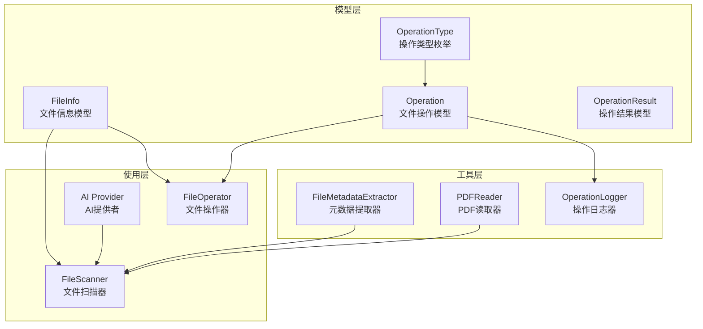
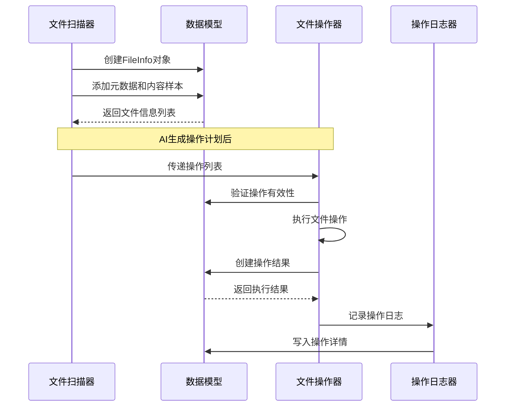
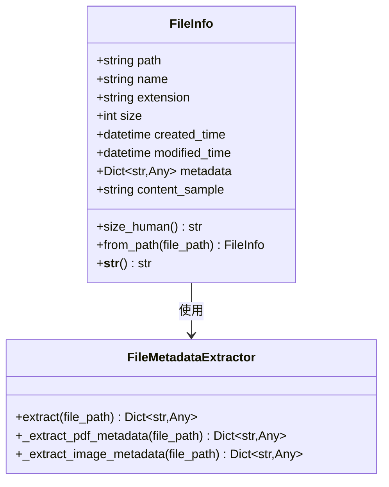
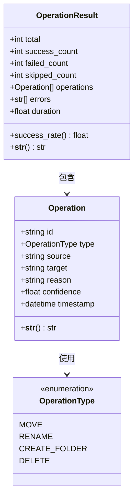
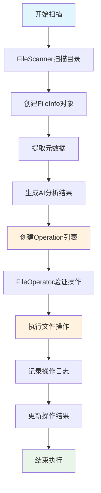
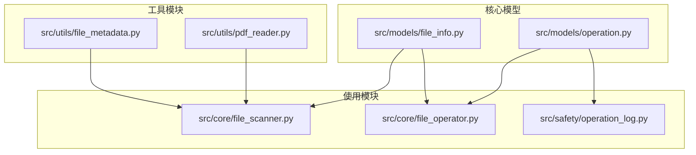

# 数据模型设计

<cite>
**本文档引用的文件**
- [src/models/file_info.py](file://src/models/file_info.py)
- [src/models/operation.py](file://src/models/operation.py)
- [src/models/__init__.py](file://src/models/__init__.py)
- [tests/test_models.py](file://tests/test_models.py)
- [src/core/file_scanner.py](file://src/core/file_scanner.py)
- [src/core/file_operator.py](file://src/core/file_operator.py)
- [src/utils/file_metadata.py](file://src/utils/file_metadata.py)
- [src/utils/pdf_reader.py](file://src/utils/pdf_reader.py)
- [src/safety/operation_log.py](file://src/safety/operation_log.py)
- [examples/basic_usage.py](file://examples/basic_usage.py)
- [PYDANTIC_FIX_COMPLETE.md](file://PYDANTIC_FIX_COMPLETE.md)
</cite>

## 目录
1. [简介](#简介)
2. [项目结构](#项目结构)
3. [核心组件](#核心组件)
4. [架构概览](#架构概览)
5. [详细组件分析](#详细组件分析)
6. [依赖关系分析](#依赖关系分析)
7. [性能考虑](#性能考虑)
8. [故障排除指南](#故障排除指南)
9. [结论](#结论)
10. [附录](#附录)

## 简介

本文档提供了Smart File Tidy项目中数据模型设计的综合文档。重点分析了两个核心数据模型：FileInfo文件信息模型和Operation文件操作模型。这些模型构成了整个文件整理系统的数据基础，为AI驱动的文件组织提供了结构化的数据表示和验证机制。

项目采用Pydantic作为数据验证框架，确保所有数据模型都具备强类型的字段定义、自动验证和序列化能力。模型设计遵循最小必要原则，既满足功能需求又保持简洁性。

## 项目结构

数据模型位于`src/models/`目录下，采用模块化设计，每个模型独立定义并在`__init__.py`中统一导出。



**图表来源**
- [src/models/file_info.py](file://src/models/file_info.py#L1-L48)
- [src/models/operation.py](file://src/models/operation.py#L1-L54)
- [src/core/file_scanner.py](file://src/core/file_scanner.py#L1-L196)
- [src/core/file_operator.py](file://src/core/file_operator.py#L1-L246)

**章节来源**
- [src/models/__init__.py](file://src/models/__init__.py#L1-L7)

## 核心组件

### FileInfo文件信息模型

FileInfo模型用于描述文件的基本信息和元数据，是文件扫描和AI分析的基础数据结构。

**主要字段定义**：
- `path`: 字符串类型，存储文件完整路径
- `name`: 字符串类型，文件名（含扩展名）
- `extension`: 字符串类型，文件扩展名
- `size`: 整数类型，文件大小（字节）
- `created_time`: datetime类型，文件创建时间
- `modified_time`: datetime类型，文件修改时间
- `metadata`: 可选字典类型，文件元数据
- `content_sample`: 可选字符串类型，文件内容样本

**验证规则**：
- 所有字段通过Pydantic自动验证
- 类型强制检查确保数据完整性
- 可选字段允许None值

**业务含义**：
- 提供文件的完整元信息描述
- 支持文件内容样本提取
- 便于AI模型进行文件分类和处理决策

### Operation文件操作模型

Operation模型描述单个文件操作，包含操作类型、源目标路径、置信度等关键信息。

**主要字段定义**：
- `id`: 字符串类型，操作唯一标识符（UUID自动生成）
- `type`: 枚举类型，操作类型（MOVE、RENAME、CREATE_FOLDER、DELETE）
- `source`: 字符串类型，源路径
- `target`: 字符串类型，目标路径
- `reason`: 字符串类型，操作原因说明
- `confidence`: 浮点类型，置信度（0.0-1.0）
- `timestamp`: datetime类型，操作时间戳

**验证规则**：
- 置信度字段使用ge=0.0, le=1.0约束
- UUID自动生成确保唯一性
- 时间戳默认当前时间

**业务含义**：
- 标准化文件操作描述
- 支持批量操作执行和跟踪
- 提供操作原因和置信度信息

**章节来源**
- [src/models/file_info.py](file://src/models/file_info.py#L9-L48)
- [src/models/operation.py](file://src/models/operation.py#L10-L54)

## 架构概览

数据模型在整个系统中的作用和交互关系如下：



**图表来源**
- [src/core/file_scanner.py](file://src/core/file_scanner.py#L28-L84)
- [src/core/file_operator.py](file://src/core/file_operator.py#L65-L100)
- [src/safety/operation_log.py](file://src/safety/operation_log.py#L24-L52)

## 详细组件分析

### FileInfo模型详细分析

#### 字段设计原理

FileInfo模型采用最小必要字段设计，重点关注文件的核心属性：



**图表来源**
- [src/models/file_info.py](file://src/models/file_info.py#L9-L48)
- [src/utils/file_metadata.py](file://src/utils/file_metadata.py#L10-L82)

#### 数据验证机制

FileInfo模型通过Pydantic实现强类型验证：

- **类型验证**：所有字段都有明确的类型定义
- **默认值处理**：可选字段提供合理的默认值
- **属性验证**：自定义属性提供额外的数据处理能力

#### 实际应用场景

在文件扫描过程中，FileInfo模型被广泛使用：

1. **文件统计**：通过size_human属性提供人类可读的文件大小
2. **元数据集成**：结合FileMetadataExtractor提取丰富元信息
3. **内容样本**：为AI分析提供有限的内容样本

**章节来源**
- [src/models/file_info.py](file://src/models/file_info.py#L21-L48)
- [src/utils/file_metadata.py](file://src/utils/file_metadata.py#L13-L31)

### Operation模型详细分析

#### 操作类型枚举设计

OperationType枚举定义了系统支持的所有文件操作类型：



**图表来源**
- [src/models/operation.py](file://src/models/operation.py#L10-L54)

#### 状态管理和生命周期

Operation模型支持完整的操作生命周期管理：

1. **创建阶段**：自动生成唯一ID和时间戳
2. **执行阶段**：FileOperator执行具体操作
3. **记录阶段**：OperationLogger记录操作详情
4. **回滚阶段**：UndoManager支持操作撤销

#### 批量处理机制

OperationResult模型提供批量操作的聚合统计：

- **成功计数**：统计成功执行的操作数量
- **失败计数**：记录执行失败的操作
- **跳过计数**：处理不需要执行的情况
- **成功率计算**：自动计算执行成功率

**章节来源**
- [src/models/operation.py](file://src/models/operation.py#L18-L54)

### 模型间关系和数据流

#### 文件扫描到操作执行的数据流



**图表来源**
- [src/core/file_scanner.py](file://src/core/file_scanner.py#L28-L84)
- [src/core/file_operator.py](file://src/core/file_operator.py#L65-L100)
- [src/safety/operation_log.py](file://src/safety/operation_log.py#L24-L52)

#### 序列化和反序列化机制

系统采用JSON格式进行数据序列化：

1. **Pydantic内置序列化**：模型自动支持JSON序列化
2. **字段类型转换**：datetime自动转换为ISO格式字符串
3. **枚举值处理**：Enum类型转换为字符串值
4. **可选字段处理**：None值在JSON中表示为null

**章节来源**
- [src/safety/operation_log.py](file://src/safety/operation_log.py#L38-L47)

## 依赖关系分析

### 模块间依赖关系



**图表来源**
- [src/models/file_info.py](file://src/models/file_info.py#L1-L48)
- [src/models/operation.py](file://src/models/operation.py#L1-L54)
- [src/core/file_scanner.py](file://src/core/file_scanner.py#L1-L196)
- [src/core/file_operator.py](file://src/core/file_operator.py#L1-L246)
- [src/utils/file_metadata.py](file://src/utils/file_metadata.py#L1-L82)
- [src/utils/pdf_reader.py](file://src/utils/pdf_reader.py#L1-L113)

### 外部依赖和集成点

系统依赖的关键外部库：

1. **Pydantic**：提供数据验证和序列化功能
2. **Pathlib**：提供跨平台路径处理
3. **DateTime**：处理时间戳和日期
4. **UUID**：生成唯一操作ID

**章节来源**
- [src/models/file_info.py](file://src/models/file_info.py#L3-L6)
- [src/models/operation.py](file://src/models/operation.py#L3-L7)

## 性能考虑

### 模型设计的性能优化

1. **内存效率**：
   - 可选字段避免不必要的内存占用
   - content_sample仅在需要时提取
   - 元数据提取采用延迟加载策略

2. **类型检查性能**：
   - Pydantic的类型检查在编译时优化
   - 字段验证在对象创建时一次性完成
   - 缓存常用计算结果（如size_human）

3. **并发处理**：
   - FileInfo.from_path方法支持并行调用
   - 操作结果聚合使用高效的计数器

### 批量操作性能

FileOperator的批量处理机制：

- **分批执行**：默认批次大小50，平衡内存和性能
- **错误隔离**：单个操作失败不影响整体执行
- **进度跟踪**：使用tqdm提供实时进度反馈

## 故障排除指南

### 常见问题和解决方案

#### Pydantic验证错误

**问题**：字段类型不匹配导致验证失败
**解决方案**：
- 检查字段类型定义
- 确认传入数据格式正确
- 使用模型的.json()方法调试数据结构

#### 文件路径相关错误

**问题**：文件不存在或权限不足
**解决方案**：
- 验证文件路径的有效性
- 检查文件系统权限
- 使用Pathlib进行路径标准化

#### 操作执行失败

**问题**：文件操作执行过程中出现异常
**解决方案**：
- 查看OperationResult中的错误列表
- 检查源文件和目标路径
- 验证磁盘空间和权限

**章节来源**
- [tests/test_models.py](file://tests/test_models.py#L8-L63)
- [src/core/file_operator.py](file://src/core/file_operator.py#L102-L200)

## 结论

Smart File Tidy的数据模型设计体现了现代Python应用的最佳实践：

1. **强类型设计**：通过Pydantic确保数据完整性
2. **模块化架构**：清晰的职责分离和依赖关系
3. **扩展性考虑**：为未来功能扩展预留空间
4. **性能优化**：在保证正确性的前提下优化执行效率

这两个核心模型为整个文件整理系统提供了坚实的数据基础，支持从简单的文件扫描到复杂的AI驱动的文件组织和管理。

## 附录

### 使用示例和最佳实践

#### 基本使用模式

```python
# 创建文件信息对象
file_info = FileInfo.from_path('/path/to/file.txt')

# 创建操作对象
operation = Operation(
    type=OperationType.MOVE,
    source='/source/file.txt',
    target='/target/file.txt',
    reason='AI建议移动',
    confidence=0.95
)

# 执行批量操作
result = file_operator.execute_batch([operation], batch_size=50)
```

#### 扩展方法建议

1. **自定义验证器**：可以在模型中添加自定义验证逻辑
2. **序列化定制**：根据需要定制JSON序列化格式
3. **性能监控**：添加模型创建和验证的性能指标

#### 版本兼容性处理

- **向后兼容**：新增字段时提供默认值
- **向前兼容**：处理未知字段但不中断程序
- **迁移策略**：提供数据格式升级指导

**章节来源**
- [examples/basic_usage.py](file://examples/basic_usage.py#L7-L35)
- [PYDANTIC_FIX_COMPLETE.md](file://PYDANTIC_FIX_COMPLETE.md#L82-L217)