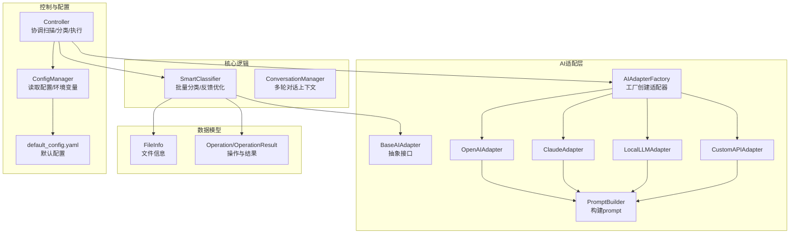
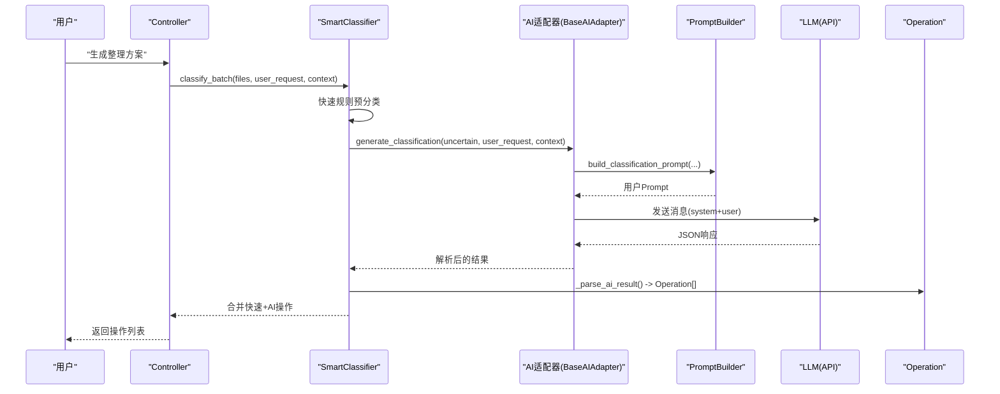
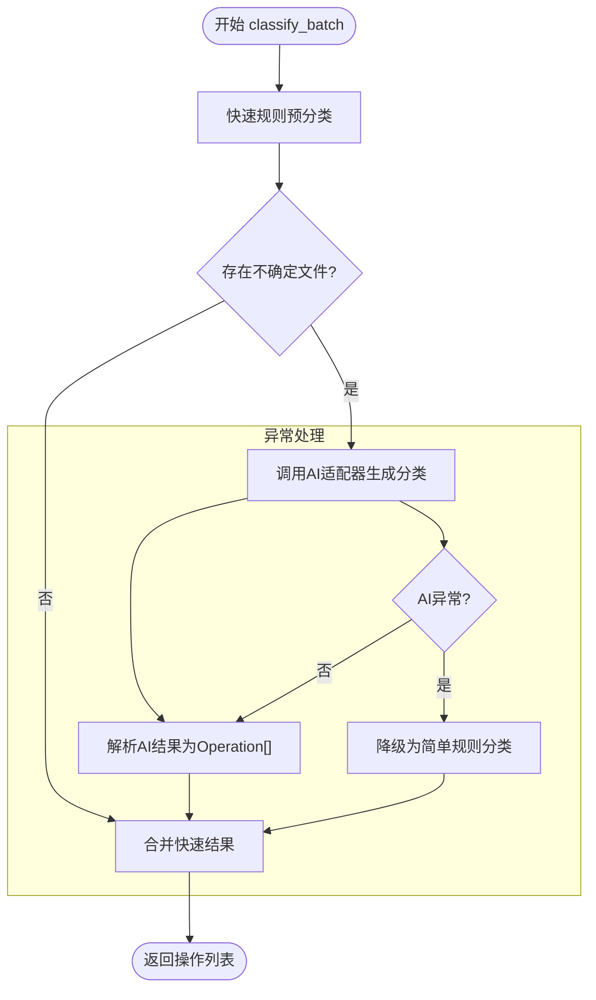
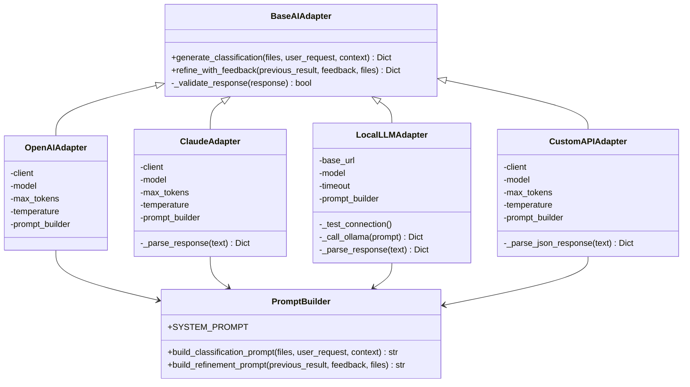
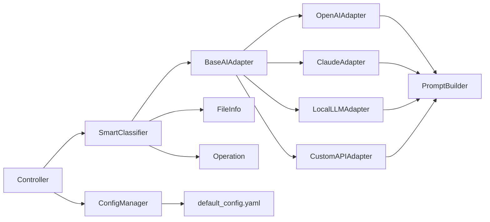

# AI智能分类

<cite>
**本文引用的文件**
- [src/core/classifier.py](file://src/core/classifier.py)
- [src/ai/adapter_factory.py](file://src/ai/adapter_factory.py)
- [src/ai/base_adapter.py](file://src/ai/base_adapter.py)
- [src/ai/openai_adapter.py](file://src/ai/openai_adapter.py)
- [src/ai/claude_adapter.py](file://src/ai/claude_adapter.py)
- [src/ai/local_adapter.py](file://src/ai/local_adapter.py)
- [src/ai/custom_adapter.py](file://src/ai/custom_adapter.py)
- [src/ai/prompt_builder.py](file://src/ai/prompt_builder.py)
- [src/models/file_info.py](file://src/models/file_info.py)
- [src/models/operation.py](file://src/models/operation.py)
- [src/core/controller.py](file://src/core/controller.py)
- [src/utils/config.py](file://src/utils/config.py)
- [config/default_config.yaml](file://config/default_config.yaml)
- [examples/basic_usage.py](file://examples/basic_usage.py)
- [examples/custom_classifier.py](file://examples/custom_classifier.py)
- [tests/test_classifier.py](file://tests/test_classifier.py)
</cite>

## 目录
1. [简介](#简介)
2. [项目结构](#项目结构)
3. [核心组件](#核心组件)
4. [架构总览](#架构总览)
5. [详细组件分析](#详细组件分析)
6. [依赖分析](#依赖分析)
7. [性能考虑](#性能考虑)
8. [故障排查指南](#故障排查指南)
9. [结论](#结论)
10. [附录](#附录)

## 简介
本文件面向“AI智能分类”功能，系统性阐述 Classifier 类的语义分析算法、AI 模型集成机制与分类决策流程；详解如何通过不同 AI 提供商（OpenAI、Claude、本地模型、自定义兼容 API）对文件内容进行理解与分类；说明 prompt 构建策略、批量分类处理、分类结果评估方法；并给出调用示例、失败处理与准确率优化建议，以及与 AI 适配器层的协作关系与数据流转。

## 项目结构
该仓库采用“核心逻辑 + AI 适配层 + 模型与操作数据模型 + 控制器与工具”的分层组织方式。AI 智能分类的核心位于 core/classifier.py，AI 适配器位于 src/ai 下，数据模型位于 src/models，配置与控制器在 utils 与 core 中。

图表来源
- [src/core/classifier.py](file://src/core/classifier.py#L11-L265)
- [src/ai/adapter_factory.py](file://src/ai/adapter_factory.py#L11-L98)
- [src/ai/base_adapter.py](file://src/ai/base_adapter.py#L9-L70)
- [src/ai/openai_adapter.py](file://src/ai/openai_adapter.py#L17-L110)
- [src/ai/claude_adapter.py](file://src/ai/claude_adapter.py#L17-L133)
- [src/ai/local_adapter.py](file://src/ai/local_adapter.py#L12-L126)
- [src/ai/custom_adapter.py](file://src/ai/custom_adapter.py#L17-L157)
- [src/ai/prompt_builder.py](file://src/ai/prompt_builder.py#L7-L172)
- [src/models/file_info.py](file://src/models/file_info.py#L9-L48)
- [src/models/operation.py](file://src/models/operation.py#L10-L54)
- [src/core/controller.py](file://src/core/controller.py#L15-L200)
- [src/utils/config.py](file://src/utils/config.py#L10-L116)
- [config/default_config.yaml](file://config/default_config.yaml#L1-L79)

章节来源
- [src/core/classifier.py](file://src/core/classifier.py#L11-L265)
- [src/ai/adapter_factory.py](file://src/ai/adapter_factory.py#L11-L98)
- [src/ai/base_adapter.py](file://src/ai/base_adapter.py#L9-L70)
- [src/ai/prompt_builder.py](file://src/ai/prompt_builder.py#L7-L172)
- [src/models/file_info.py](file://src/models/file_info.py#L9-L48)
- [src/models/operation.py](file://src/models/operation.py#L10-L54)
- [src/core/controller.py](file://src/core/controller.py#L15-L200)
- [src/utils/config.py](file://src/utils/config.py#L10-L116)
- [config/default_config.yaml](file://config/default_config.yaml#L1-L79)

## 核心组件
- SmartClassifier：负责批量分类、快速规则预分类、AI 分类、反馈学习与降级策略；输出标准化的 Operation 列表。
- AI 适配器层：统一接口 BaseAIAdapter，具体实现包括 OpenAIAdapter、ClaudeAdapter、LocalLLMAdapter、CustomAPIAdapter；均通过 PromptBuilder 构建 prompt 并解析 JSON 结果。
- PromptBuilder：构建系统提示与用户提示，格式化文件列表与元数据，支持分类与优化两个任务。
- 数据模型：FileInfo 描述文件元信息与内容样本；Operation/OperationResult 描述操作与批量结果。
- Controller：协调扫描、分类、执行与安全组件；根据配置选择 Agent 或传统模式。
- ConfigManager：读取 YAML 配置与环境变量，注入 AI 提供商密钥与参数。

章节来源
- [src/core/classifier.py](file://src/core/classifier.py#L11-L265)
- [src/ai/base_adapter.py](file://src/ai/base_adapter.py#L9-L70)
- [src/ai/prompt_builder.py](file://src/ai/prompt_builder.py#L7-L172)
- [src/models/file_info.py](file://src/models/file_info.py#L9-L48)
- [src/models/operation.py](file://src/models/operation.py#L10-L54)
- [src/core/controller.py](file://src/core/controller.py#L15-L200)
- [src/utils/config.py](file://src/utils/config.py#L10-L116)

## 架构总览
AI 智能分类的整体流程如下：Controller 负责调度，SmartClassifier 先进行快速规则分类，再对不确定样本调用 AI 适配器；AI 适配器通过 PromptBuilder 构造系统提示与用户提示，调用对应 LLM API，解析 JSON 结果后交由 SmartClassifier 统一转换为 Operation；若 AI 失败则触发降级策略；支持用户反馈驱动的二次优化。

图表来源
- [src/core/classifier.py](file://src/core/classifier.py#L24-L66)
- [src/ai/base_adapter.py](file://src/ai/base_adapter.py#L12-L50)
- [src/ai/prompt_builder.py](file://src/ai/prompt_builder.py#L40-L84)
- [src/ai/openai_adapter.py](file://src/ai/openai_adapter.py#L43-L76)
- [src/ai/claude_adapter.py](file://src/ai/claude_adapter.py#L43-L77)
- [src/ai/local_adapter.py](file://src/ai/local_adapter.py#L44-L66)
- [src/ai/custom_adapter.py](file://src/ai/custom_adapter.py#L70-L103)

## 详细组件分析

### SmartClassifier：语义分析与分类决策
- 批量分类流程
  - 快速预分类：基于规则（如扩展名、文件名模式）直接产出 Operation，减少 LLM 调用。
  - 不确定样本交给 AI 适配器生成 JSON 结构化操作方案。
  - 合并快速与 AI 结果，返回统一的 Operation 列表。
- 反馈学习与优化
  - 从用户反馈中抽取规则并加入上下文，再次调用 AI 的 refine_with_feedback 接口，获得优化后的操作。
- 降级策略
  - 若 AI 调用异常，自动降级为简单规则分类（如从用户请求中提取目标文件夹），保证可用性。
- 上下文与对话管理
  - ConversationManager 记录历史交互与反馈，作为 PromptBuilder 的输入之一，提升一致性与个性化。

图表来源
- [src/core/classifier.py](file://src/core/classifier.py#L24-L66)
- [src/core/classifier.py](file://src/core/classifier.py#L180-L208)

章节来源
- [src/core/classifier.py](file://src/core/classifier.py#L24-L112)
- [src/core/classifier.py](file://src/core/classifier.py#L132-L208)
- [src/core/classifier.py](file://src/core/classifier.py#L232-L265)

### AI 适配器层：统一接口与多提供商集成
- 抽象接口 BaseAIAdapter
  - 定义 generate_classification 与 refine_with_feedback 两个核心方法，统一响应格式校验。
- 具体适配器
  - OpenAIAdapter/ClaudeAdapter：使用官方 SDK，通过 response_format/json_object 强制 JSON 输出，解析并校验。
  - LocalLLMAdapter：对接本地 Ollama 服务，构造完整 prompt 并解析 JSON。
  - CustomAPIAdapter：复用 OpenAI 客户端，通过自定义 base_url 实现对第三方兼容 OpenAI API 的支持。
- Prompt 构建
  - PromptBuilder 提供 SYSTEM_PROMPT、build_classification_prompt、build_refinement_prompt，格式化文件列表、元数据与内容摘要，限制显示数量避免越界。

图表来源
- [src/ai/base_adapter.py](file://src/ai/base_adapter.py#L9-L70)
- [src/ai/openai_adapter.py](file://src/ai/openai_adapter.py#L17-L110)
- [src/ai/claude_adapter.py](file://src/ai/claude_adapter.py#L17-L133)
- [src/ai/local_adapter.py](file://src/ai/local_adapter.py#L12-L126)
- [src/ai/custom_adapter.py](file://src/ai/custom_adapter.py#L17-L157)
- [src/ai/prompt_builder.py](file://src/ai/prompt_builder.py#L7-L172)

章节来源
- [src/ai/base_adapter.py](file://src/ai/base_adapter.py#L9-L70)
- [src/ai/openai_adapter.py](file://src/ai/openai_adapter.py#L17-L110)
- [src/ai/claude_adapter.py](file://src/ai/claude_adapter.py#L17-L133)
- [src/ai/local_adapter.py](file://src/ai/local_adapter.py#L12-L126)
- [src/ai/custom_adapter.py](file://src/ai/custom_adapter.py#L17-L157)
- [src/ai/prompt_builder.py](file://src/ai/prompt_builder.py#L7-L172)

### Prompt 构建策略
- 系统提示（SYSTEM_PROMPT）：明确角色、任务与输出格式约束（JSON、字段、置信度等）。
- 分类 Prompt：包含用户需求、已知规则、历史反馈、文件清单与任务说明。
- 优化 Prompt：包含上次结果、用户反馈、当前文件清单与任务说明。
- 文件列表格式化：限制显示数量、格式化元数据与内容摘要，避免上下文过长。

章节来源
- [src/ai/prompt_builder.py](file://src/ai/prompt_builder.py#L10-L37)
- [src/ai/prompt_builder.py](file://src/ai/prompt_builder.py#L40-L84)
- [src/ai/prompt_builder.py](file://src/ai/prompt_builder.py#L87-L125)
- [src/ai/prompt_builder.py](file://src/ai/prompt_builder.py#L127-L172)

### 批量分类处理与结果评估
- 批量处理：SmartClassifier 将不确定样本聚合后一次性提交给 AI，降低调用次数。
- 结果评估：Operation 模型包含置信度字段，便于后续统计与可视化；OperationResult 提供成功率等指标。
- 上下文传递：ConversationManager 将历史与反馈注入 PromptBuilder，提升一致性。

章节来源
- [src/core/classifier.py](file://src/core/classifier.py#L24-L66)
- [src/models/operation.py](file://src/models/operation.py#L18-L54)
- [src/core/classifier.py](file://src/core/classifier.py#L232-L265)

### 与 AI 适配器层的协作关系与数据流转
- 控制器根据配置选择 AI 提供商，通过工厂创建适配器实例，注入 SmartClassifier。
- SmartClassifier 将文件信息、用户请求与上下文传入适配器，接收 JSON 结构化结果并转换为 Operation。
- 适配器内部统一使用 PromptBuilder 构造提示，调用对应 LLM API，解析响应并校验格式。

章节来源
- [src/core/controller.py](file://src/core/controller.py#L18-L82)
- [src/ai/adapter_factory.py](file://src/ai/adapter_factory.py#L14-L37)
- [src/ai/base_adapter.py](file://src/ai/base_adapter.py#L12-L50)
- [src/ai/prompt_builder.py](file://src/ai/prompt_builder.py#L40-L84)

## 依赖分析
- 组件耦合
  - SmartClassifier 依赖 BaseAIAdapter 接口与 PromptBuilder；与 FileInfo/Operation 数据模型松耦合。
  - AI 适配器依赖 PromptBuilder，彼此独立，便于扩展新的提供商。
  - Controller 作为编排者，依赖 ConfigManager、FileScanner、FileOperator、Undo 等模块。
- 外部依赖
  - OpenAI/Claude SDK、requests（本地）、环境变量（API Key、Base URL、模型名）。
- 循环依赖
  - 无明显循环依赖；各模块职责清晰，接口方向单一。

图表来源
- [src/core/controller.py](file://src/core/controller.py#L15-L82)
- [src/core/classifier.py](file://src/core/classifier.py#L14-L22)
- [src/ai/adapter_factory.py](file://src/ai/adapter_factory.py#L14-L37)
- [src/ai/base_adapter.py](file://src/ai/base_adapter.py#L9-L70)
- [src/ai/prompt_builder.py](file://src/ai/prompt_builder.py#L7-L172)
- [src/models/file_info.py](file://src/models/file_info.py#L9-L48)
- [src/models/operation.py](file://src/models/operation.py#L18-L54)
- [src/utils/config.py](file://src/utils/config.py#L76-L111)
- [config/default_config.yaml](file://config/default_config.yaml#L1-L79)

章节来源
- [src/core/controller.py](file://src/core/controller.py#L15-L82)
- [src/core/classifier.py](file://src/core/classifier.py#L14-L22)
- [src/ai/adapter_factory.py](file://src/ai/adapter_factory.py#L14-L37)
- [src/ai/base_adapter.py](file://src/ai/base_adapter.py#L9-L70)
- [src/ai/prompt_builder.py](file://src/ai/prompt_builder.py#L7-L172)
- [src/models/file_info.py](file://src/models/file_info.py#L9-L48)
- [src/models/operation.py](file://src/models/operation.py#L18-L54)
- [src/utils/config.py](file://src/utils/config.py#L76-L111)
- [config/default_config.yaml](file://config/default_config.yaml#L1-L79)

## 性能考虑
- 减少 LLM 调用：通过快速规则预分类尽可能命中确定样本，降低 Token 与延迟成本。
- Prompt 控制：限制文件列表显示数量与内容摘要长度，避免上下文过长导致截断或超时。
- 批量处理：将不确定样本合并一次提交，减少往返开销。
- 本地推理：LocalLLMAdapter 适合内网与隐私场景，需关注本地服务稳定性与超时设置。
- 结果缓存：可在上层引入轻量缓存（如基于文件指纹与用户请求哈希）避免重复调用。

## 故障排查指南
- AI 调用失败
  - 现象：抛出运行时错误或响应格式不正确。
  - 排查：检查 API Key、网络连通性、模型名称与限额；查看适配器捕获的异常信息。
  - 降级：SmartClassifier 在异常时自动降级为简单规则分类，保证基本可用。
- 本地模型不可达
  - 现象：连接测试失败或超时。
  - 排查：确认本地服务地址与端口、模型是否存在、防火墙与代理设置。
- 响应解析失败
  - 现象：无法解析 JSON，尤其是 Claude/本地模型返回 Markdown 包裹的 JSON。
  - 排查：适配器内置多种解析策略（直接 JSON、代码块、首尾大括号），若仍失败，检查模型输出格式或关闭格式化限制。
- 配置问题
  - 现象：找不到配置或环境变量未生效。
  - 排查：确认 default_config.yaml 路径与键名；检查 .env 文件与环境变量是否正确加载。

章节来源
- [src/core/classifier.py](file://src/core/classifier.py#L53-L61)
- [src/ai/claude_adapter.py](file://src/ai/claude_adapter.py#L113-L132)
- [src/ai/local_adapter.py](file://src/ai/local_adapter.py#L33-L42)
- [src/ai/local_adapter.py](file://src/ai/local_adapter.py#L115-L125)
- [src/utils/config.py](file://src/utils/config.py#L76-L111)
- [config/default_config.yaml](file://config/default_config.yaml#L1-L79)

## 结论
本系统通过 SmartClassifier 的“规则预分类 + AI 结构化决策 + 反馈优化 + 降级保障”的闭环，实现了稳定高效的文件智能分类能力。借助统一的 BaseAIAdapter 接口与 PromptBuilder，可灵活接入 OpenAI、Claude、本地模型与自定义兼容 API；配合 ConversationManager 的上下文管理，进一步提升一致性与可迭代性。建议在生产环境中结合快速规则与批量处理策略，持续收集用户反馈以优化规则与 Prompt，从而提升整体准确率与用户体验。

## 附录

### 如何调用 AI 服务进行文件分类
- 基本用法（示例）
  - 初始化控制器与分类器，扫描目录，生成整理方案，预览操作。
  - 参考示例文件路径：[examples/basic_usage.py](file://examples/basic_usage.py#L7-L36)
- 自定义分类器
  - 继承 SmartClassifier，覆盖规则应用逻辑，实现更精细的分类策略。
  - 参考示例文件路径：[examples/custom_classifier.py](file://examples/custom_classifier.py#L9-L47)

章节来源
- [examples/basic_usage.py](file://examples/basic_usage.py#L7-L36)
- [examples/custom_classifier.py](file://examples/custom_classifier.py#L9-L47)

### 如何处理分类失败的情况
- AI 异常：SmartClassifier 捕获异常并触发降级策略，按用户请求中的目标文件夹生成简单移动操作。
- 本地模型异常：LocalLLMAdapter 在连接测试与调用阶段抛出明确错误，提示启动服务与检查地址。
- 响应格式异常：各适配器内置解析与回退策略，必要时调整模型输出格式或关闭格式化限制。

章节来源
- [src/core/classifier.py](file://src/core/classifier.py#L53-L61)
- [src/ai/local_adapter.py](file://src/ai/local_adapter.py#L33-L42)
- [src/ai/claude_adapter.py](file://src/ai/claude_adapter.py#L113-L132)
- [src/ai/local_adapter.py](file://src/ai/local_adapter.py#L115-L125)

### 如何优化分类准确率
- 增加规则：在自定义分类器中加入领域规则（如年份、大小、关键词），提高快速分类命中率。
- 反馈驱动：通过 ConversationManager 记录历史与反馈，PromptBuilder 将其纳入上下文，提升一致性。
- Prompt 优化：细化 SYSTEM_PROMPT 与任务说明，明确输出格式与置信度阈值。
- 批量策略：合理设置批量大小与文件上限，避免上下文溢出与性能下降。

章节来源
- [examples/custom_classifier.py](file://examples/custom_classifier.py#L12-L46)
- [src/core/classifier.py](file://src/core/classifier.py#L68-L112)
- [src/ai/prompt_builder.py](file://src/ai/prompt_builder.py#L10-L37)

### 配置与环境变量
- 默认配置：AI 提供商、模型、温度、最大 Token、本地服务地址与超时等。
- 环境变量：API Key、默认提供商、本地模型地址与模型名、自定义 API 地址与密钥。
- 参考文件路径：
  - [config/default_config.yaml](file://config/default_config.yaml#L1-L79)
  - [src/utils/config.py](file://src/utils/config.py#L76-L111)

章节来源
- [config/default_config.yaml](file://config/default_config.yaml#L1-L79)
- [src/utils/config.py](file://src/utils/config.py#L76-L111)