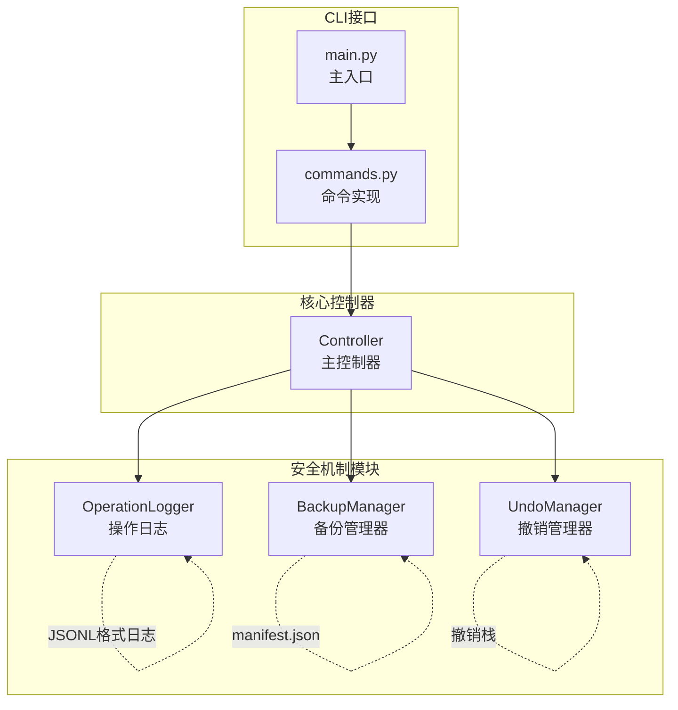
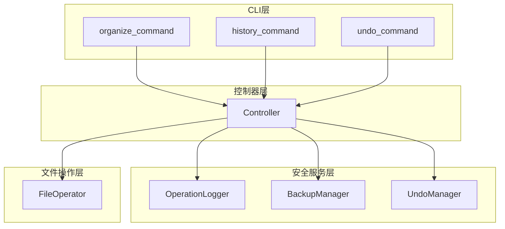
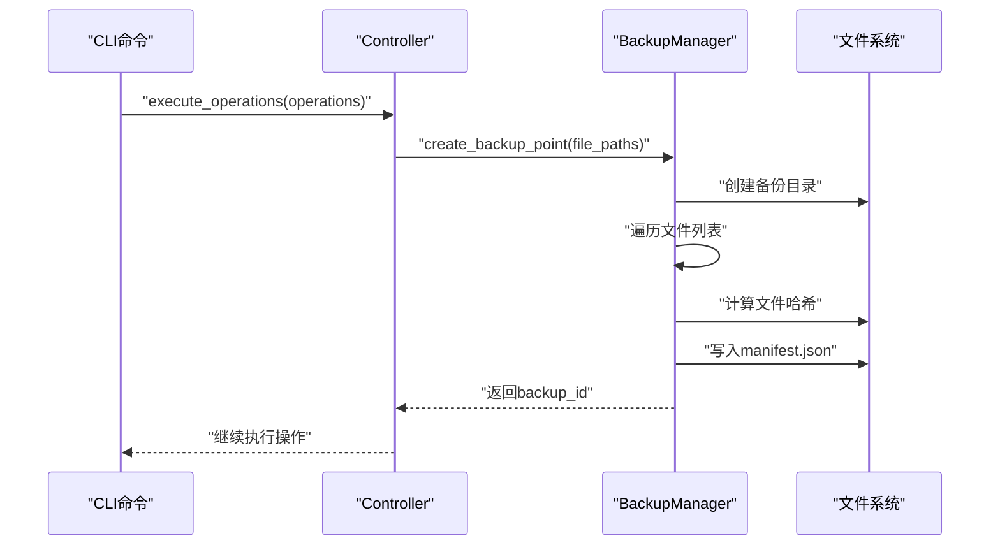
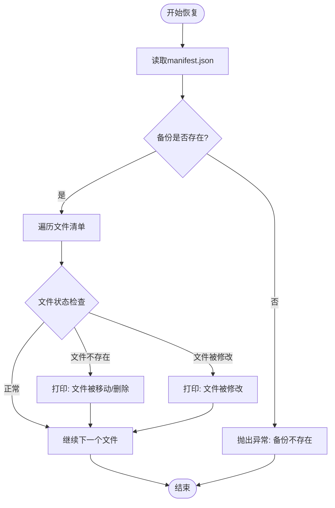
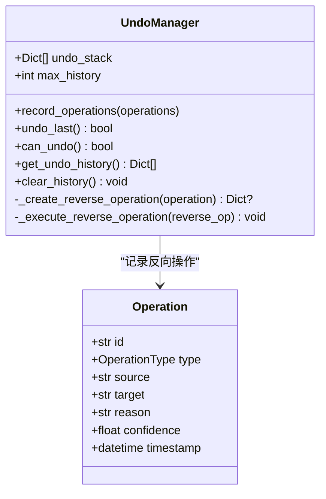
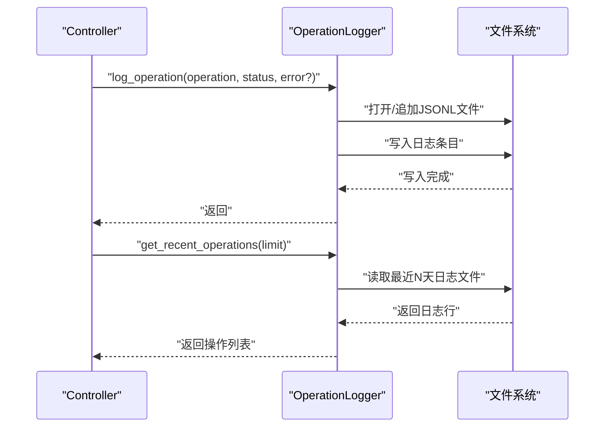
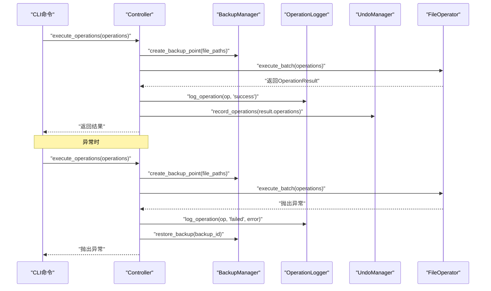
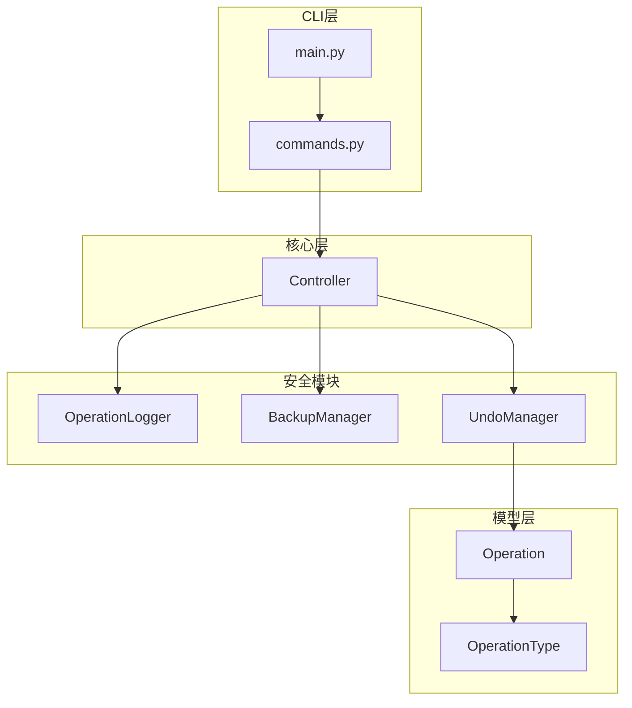

# 安全保护机制

<cite>
**本文引用的文件**
- [src/safety/__init__.py](file://src/safety/__init__.py)
- [src/safety/backup.py](file://src/safety/backup.py)
- [src/safety/undo_manager.py](file://src/safety/undo_manager.py)
- [src/safety/operation_log.py](file://src/safety/operation_log.py)
- [src/models/operation.py](file://src/models/operation.py)
- [src/core/controller.py](file://src/core/controller.py)
- [src/cli/commands.py](file://src/cli/commands.py)
- [src/cli/main.py](file://src/cli/main.py)
- [config/default_config.yaml](file://config/default_config.yaml)
- [tests/test_safety.py](file://tests/test_safety.py)
- [README.md](file://README.md)
</cite>

## 目录
1. [简介](#简介)
2. [项目结构](#项目结构)
3. [核心组件](#核心组件)
4. [架构概览](#架构概览)
5. [详细组件分析](#详细组件分析)
6. [依赖关系分析](#依赖关系分析)
7. [性能考虑](#性能考虑)
8. [故障排查指南](#故障排查指南)
9. [结论](#结论)

## 简介
本文件详细阐述智能文件整理助手的安全保护机制，包括备份管理系统、撤销管理器和操作日志系统的协作关系与实现细节。文档涵盖自动备份策略、备份恢复流程、撤销栈实现、操作历史追踪、批量撤销机制，并提供具体示例展示如何启用安全模式、查看操作日志以及执行备份恢复操作。同时解释三个安全组件之间的协同工作方式、数据一致性保障以及异常情况下的安全处理策略。

## 项目结构
安全机制位于 `src/safety/` 目录，包含三个核心模块：
- 备份管理器：负责创建备份点、列出备份、删除备份以及从备份恢复
- 撤销管理器：维护操作历史栈，支持批量撤销
- 操作日志：记录操作状态、错误信息，支持历史查询与清理

**图表来源**
- [src/safety/backup.py](file://src/safety/backup.py#L10-L152)
- [src/safety/undo_manager.py](file://src/safety/undo_manager.py#L10-L155)
- [src/safety/operation_log.py](file://src/safety/operation_log.py#L11-L133)
- [src/core/controller.py](file://src/core/controller.py#L75-L78)
- [src/cli/commands.py](file://src/cli/commands.py#L18-L123)
- [src/cli/main.py](file://src/cli/main.py#L35-L84)

**章节来源**
- [src/safety/__init__.py](file://src/safety/__init__.py#L1-L8)
- [src/safety/backup.py](file://src/safety/backup.py#L1-L152)
- [src/safety/undo_manager.py](file://src/safety/undo_manager.py#L1-L155)
- [src/safety/operation_log.py](file://src/safety/operation_log.py#L1-L133)

## 核心组件
本节概述三个安全组件的功能职责与交互关系：

- 备份管理器（BackupManager）
  - 创建备份点：为指定文件列表生成带时间戳的备份目录，保存文件清单（manifest.json），包含文件路径、哈希、大小、修改时间等元信息
  - 列出备份：遍历备份目录，读取每个备份的manifest.json，返回备份列表（按时间倒序）
  - 删除备份：删除指定备份目录
  - 恢复备份：读取备份manifest，检查当前文件状态（存在性、完整性），打印状态提示（文件被移动/删除、文件被修改）

- 撤销管理器（UndoManager）
  - 记录操作：接收操作列表，为每个操作生成反向操作（移动→移回原位、重命名→改回原名、创建文件夹→删除空文件夹），压入撤销栈
  - 批量撤销：弹出最后一批操作，逆序执行反向操作，统计成功/失败数量
  - 历史管理：限制最大历史记录数，默认10；提供历史查询与清空

- 操作日志（OperationLogger）
  - 记录操作：将操作详情写入JSONL格式日志文件（按日期分文件），字段包含时间戳、操作ID、类型、源/目标路径、原因、状态、错误信息
  - 查询历史：支持最近N条记录与按日期查询
  - 清理旧日志：按保留天数删除过期日志文件

**章节来源**
- [src/safety/backup.py](file://src/safety/backup.py#L23-L108)
- [src/safety/undo_manager.py](file://src/safety/undo_manager.py#L23-L94)
- [src/safety/operation_log.py](file://src/safety/operation_log.py#L24-L109)

## 架构概览
安全机制在系统中的位置与协作关系如下：

**图表来源**
- [src/cli/commands.py](file://src/cli/commands.py#L18-L123)
- [src/core/controller.py](file://src/core/controller.py#L75-L78)
- [src/safety/operation_log.py](file://src/safety/operation_log.py#L11-L133)
- [src/safety/backup.py](file://src/safety/backup.py#L10-L152)
- [src/safety/undo_manager.py](file://src/safety/undo_manager.py#L10-L155)

## 详细组件分析

### 备份管理系统
备份管理器通过“清单式备份”策略减少存储开销：不复制文件内容，仅记录文件元信息。其关键流程如下：

**图表来源**
- [src/core/controller.py](file://src/core/controller.py#L223-L228)
- [src/safety/backup.py](file://src/safety/backup.py#L23-L70)

备份恢复流程（当前实现侧重状态检查与提示）：

**图表来源**
- [src/safety/backup.py](file://src/safety/backup.py#L72-L108)

自动备份策略与配置：
- 在执行批量操作前自动创建备份点
- 备份目录默认为 `data/backups`
- 备份清单包含文件路径、哈希、大小、修改时间等元信息
- 恢复时仅做状态检查，不自动还原文件内容

**章节来源**
- [src/safety/backup.py](file://src/safety/backup.py#L13-L21)
- [src/safety/backup.py](file://src/safety/backup.py#L23-L70)
- [src/safety/backup.py](file://src/safety/backup.py#L72-L108)
- [src/core/controller.py](file://src/core/controller.py#L223-L228)
- [config/default_config.yaml](file://config/default_config.yaml#L52-L52)

### 撤销管理器
撤销管理器维护一个“撤销栈”，支持批量撤销与历史限制：

**图表来源**
- [src/safety/undo_manager.py](file://src/safety/undo_manager.py#L10-L155)
- [src/models/operation.py](file://src/models/operation.py#L18-L31)

撤销栈实现要点：
- 记录阶段：为每个操作生成反向操作，压入栈顶
- 撤销阶段：弹出最后一批操作，逆序执行反向操作，统计成功/失败
- 历史限制：超过最大历史数时，丢弃最早批次
- 支持的操作类型：移动、重命名、创建文件夹（仅删除空文件夹）

批量撤销机制：
- 将一次批量操作视为“一批”，统一记录与撤销
- 撤销时逆序执行该批内各操作的反向动作
- 统计并报告成功/失败数量，便于用户了解撤销结果

**章节来源**
- [src/safety/undo_manager.py](file://src/safety/undo_manager.py#L23-L94)
- [src/safety/undo_manager.py](file://src/safety/undo_manager.py#L96-L155)
- [src/models/operation.py](file://src/models/operation.py#L10-L16)

### 操作日志系统
操作日志系统提供完整的操作审计能力：

**图表来源**
- [src/safety/operation_log.py](file://src/safety/operation_log.py#L24-L83)
- [src/core/controller.py](file://src/core/controller.py#L234-L247)

日志格式与查询：
- JSONL格式，每行一条记录
- 按日期分文件（YYYY-MM-DD.jsonl）
- 支持最近N条记录与按日期查询
- 提供旧日志清理功能（按保留天数）

**章节来源**
- [src/safety/operation_log.py](file://src/safety/operation_log.py#L14-L22)
- [src/safety/operation_log.py](file://src/safety/operation_log.py#L24-L83)
- [src/safety/operation_log.py](file://src/safety/operation_log.py#L111-L133)

### 三组件协作关系与数据一致性
三个安全组件在控制器中协同工作，确保操作的可追溯性与可恢复性：

**图表来源**
- [src/core/controller.py](file://src/core/controller.py#L203-L256)

协作要点：
- 执行前创建备份点，失败时尝试恢复
- 成功后记录操作日志与撤销信息
- 撤销时执行反向操作，更新日志状态
- 历史记录与备份相互独立，互不影响

**章节来源**
- [src/core/controller.py](file://src/core/controller.py#L203-L256)

## 依赖关系分析
安全机制模块的内部依赖与外部依赖关系如下：

**图表来源**
- [src/safety/operation_log.py](file://src/safety/operation_log.py#L8-L8)
- [src/safety/backup.py](file://src/safety/backup.py#L7-L7)
- [src/safety/undo_manager.py](file://src/safety/undo_manager.py#L7-L7)
- [src/models/operation.py](file://src/models/operation.py#L18-L31)
- [src/core/controller.py](file://src/core/controller.py#L12-L12)
- [src/cli/commands.py](file://src/cli/commands.py#L11-L13)
- [src/cli/main.py](file://src/cli/main.py#L8-L10)

**章节来源**
- [src/safety/__init__.py](file://src/safety/__init__.py#L1-L8)
- [src/models/operation.py](file://src/models/operation.py#L10-L31)
- [src/core/controller.py](file://src/core/controller.py#L12-L12)
- [src/cli/commands.py](file://src/cli/commands.py#L11-L13)
- [src/cli/main.py](file://src/cli/main.py#L8-L10)

## 性能考虑
- 备份策略
  - 使用哈希校验文件完整性，避免重复备份
  - 分块读取大文件，降低内存占用
  - 仅保存元信息，不复制文件内容
- 撤销管理
  - 历史记录限制，避免无限增长
  - 批量撤销时逆序执行，减少冲突
- 日志系统
  - JSONL格式逐行写入，避免大文件读写
  - 按日期分文件，便于清理与查询
  - 旧日志清理按保留天数定期执行

[本节为通用性能讨论，无需特定文件来源]

## 故障排查指南
- 备份恢复失败
  - 检查备份目录是否存在
  - 确认manifest.json完整性
  - 查看文件是否存在、是否被修改
- 撤销失败
  - 检查源文件是否存在
  - 确认操作类型是否支持反向操作
  - 查看撤销历史是否为空
- 日志查询无结果
  - 检查日志目录权限
  - 确认日期文件是否存在
  - 验证JSONL格式正确性
- 异常处理
  - 执行失败时自动记录失败日志
  - 尝试恢复备份（若存在）
  - 抛出异常并终止后续操作

**章节来源**
- [src/safety/backup.py](file://src/safety/backup.py#L82-L86)
- [src/safety/undo_manager.py](file://src/safety/undo_manager.py#L122-L155)
- [src/safety/operation_log.py](file://src/safety/operation_log.py#L111-L133)
- [src/core/controller.py](file://src/core/controller.py#L243-L256)

## 结论
本安全保护机制通过备份管理、撤销管理和操作日志三大组件形成完整的安全闭环：备份管理器提供数据保护，撤销管理器提供操作回滚，操作日志提供审计追踪。三者在控制器中紧密协作，在执行前创建备份、执行后记录日志与撤销信息，并在异常情况下尝试恢复，确保用户数据与操作历史的安全性与可追溯性。配合CLI提供的便捷命令，用户可以轻松启用安全模式、查看操作历史并执行备份恢复与撤销操作。