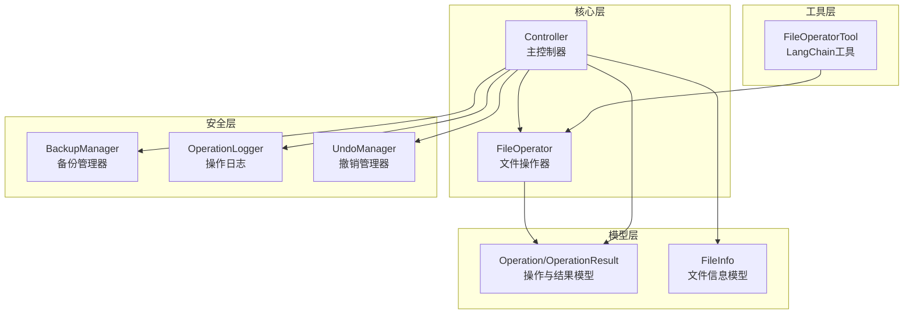
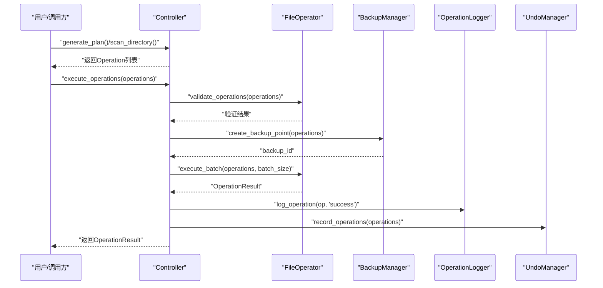
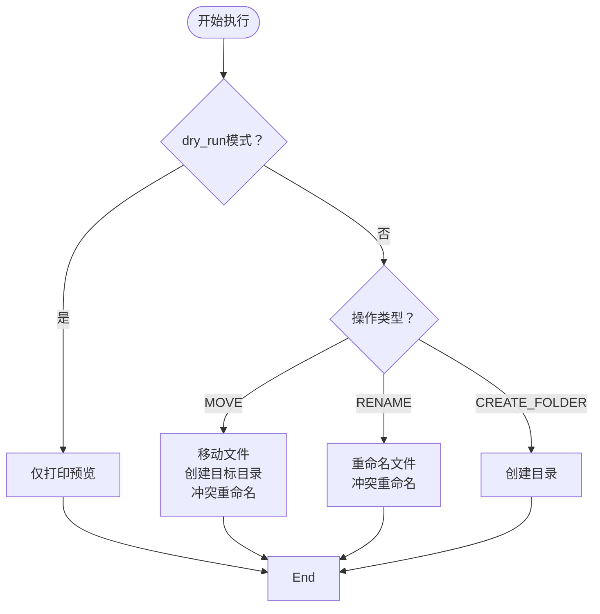
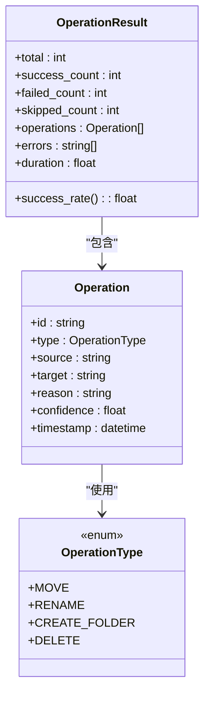
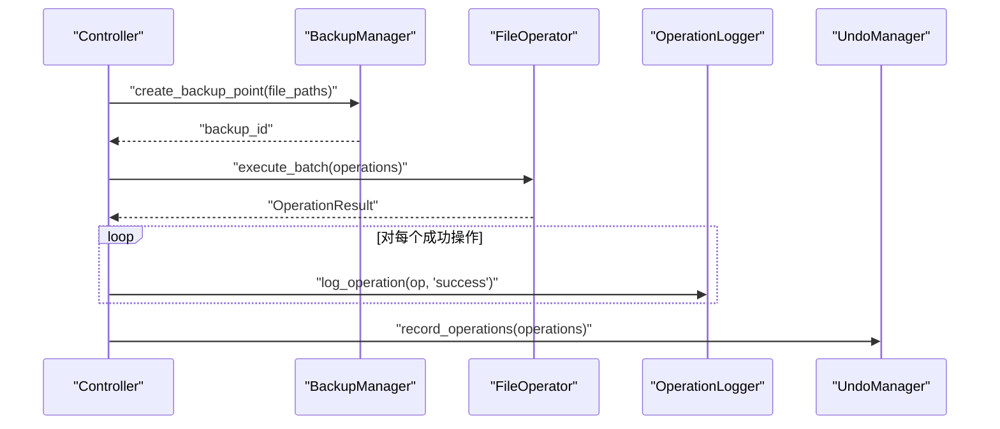
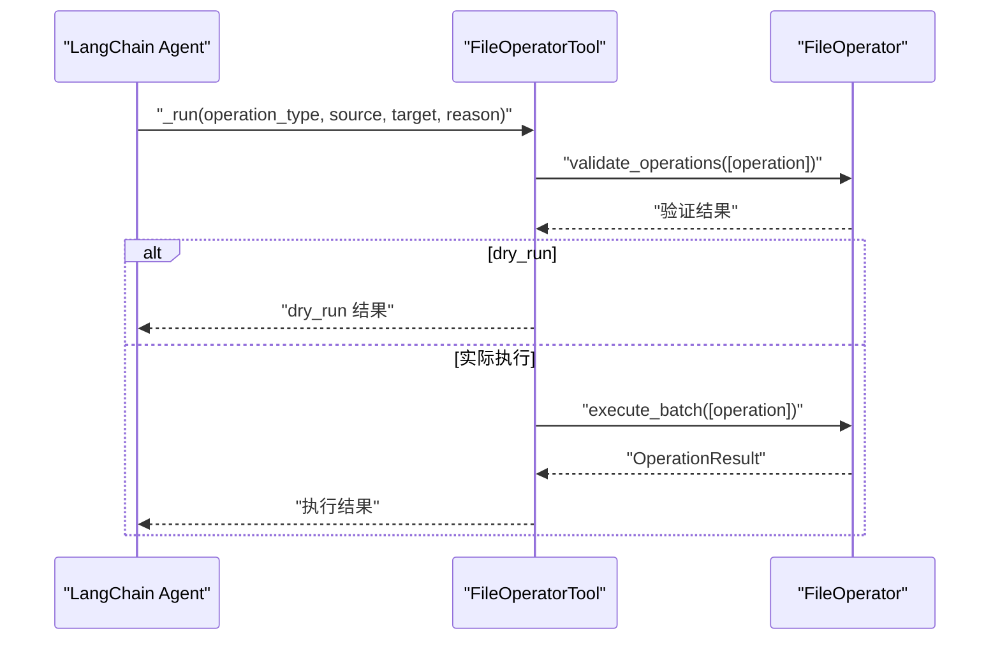
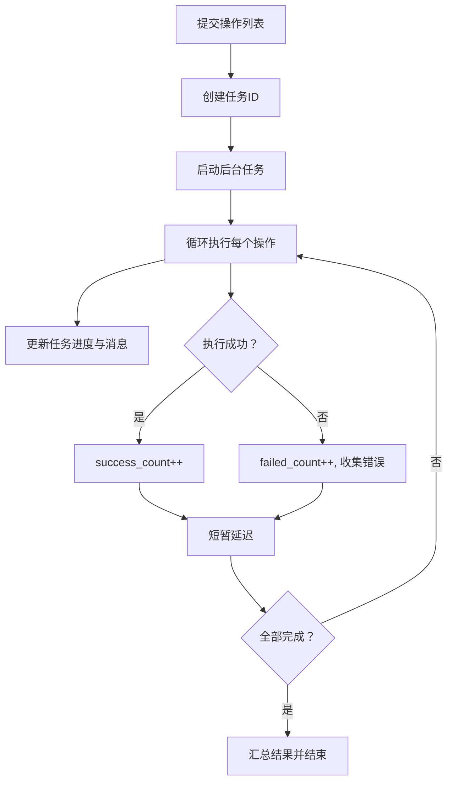
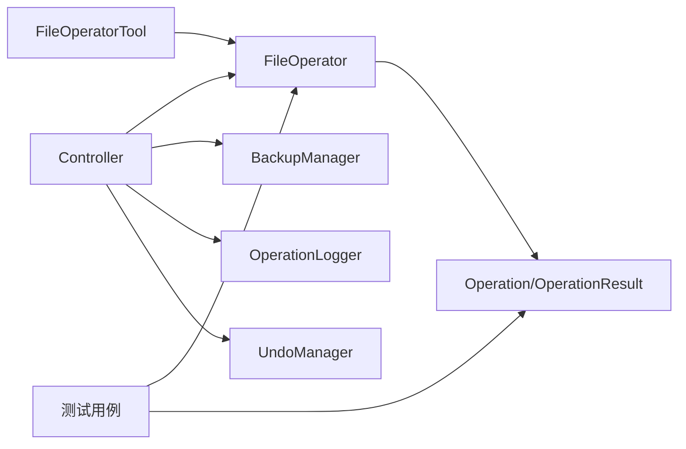

# 批量文件操作

<cite>
**本文引用的文件**
- [src/core/file_operator.py](file://src/core/file_operator.py)
- [src/models/operation.py](file://src/models/operation.py)
- [src/safety/undo_manager.py](file://src/safety/undo_manager.py)
- [src/safety/backup.py](file://src/safety/backup.py)
- [src/safety/operation_log.py](file://src/safety/operation_log.py)
- [src/core/controller.py](file://src/core/controller.py)
- [src/langchain_integration/tools/file_operator_tool.py](file://src/langchain_integration/tools/file_operator_tool.py)
- [tests/test_file_operator.py](file://tests/test_file_operator.py)
- [examples/basic_usage.py](file://examples/basic_usage.py)
- [src/models/file_info.py](file://src/models/file_info.py)
- [src/utils/config.py](file://src/utils/config.py)
</cite>

## 目录
1. [简介](#简介)
2. [项目结构](#项目结构)
3. [核心组件](#核心组件)
4. [架构总览](#架构总览)
5. [详细组件分析](#详细组件分析)
6. [依赖关系分析](#依赖关系分析)
7. [性能考量](#性能考量)
8. [故障排查指南](#故障排查指南)
9. [结论](#结论)
10. [附录](#附录)

## 简介
本文件围绕批量文件操作功能进行系统化文档化，重点解释 FileOperator 类的操作执行机制、批量处理策略、操作类型管理与安全机制集成（备份、日志、撤销）。文档还涵盖移动、重命名、创建文件夹等操作的实现原理，包括操作队列管理、冲突处理、原子性与回滚思路、进度监控与错误处理，并给出基于现有代码的实践示例路径与最佳实践建议。

## 项目结构
批量文件操作功能位于核心层，配合安全层与模型层协同工作：
- 核心执行层：FileOperator 提供具体文件操作能力
- 数据模型层：Operation/OperationResult 描述操作与结果
- 安全层：BackupManager、OperationLogger、UndoManager 提供备份、日志与撤销
- 控制层：Controller 协调扫描、生成计划、执行与安全机制
- 工具层：LangChain 工具封装 FileOperator，便于在智能代理中使用

图表来源
- [src/core/file_operator.py](file://src/core/file_operator.py#L12-L246)
- [src/core/controller.py](file://src/core/controller.py#L15-L310)
- [src/models/operation.py](file://src/models/operation.py#L18-L54)
- [src/models/file_info.py](file://src/models/file_info.py#L9-L48)
- [src/safety/backup.py](file://src/safety/backup.py#L10-L152)
- [src/safety/operation_log.py](file://src/safety/operation_log.py#L11-L133)
- [src/safety/undo_manager.py](file://src/safety/undo_manager.py#L10-L155)
- [src/langchain_integration/tools/file_operator_tool.py](file://src/langchain_integration/tools/file_operator_tool.py#L32-L148)

章节来源
- [src/core/file_operator.py](file://src/core/file_operator.py#L1-L246)
- [src/core/controller.py](file://src/core/controller.py#L15-L310)
- [src/models/operation.py](file://src/models/operation.py#L1-L54)
- [src/models/file_info.py](file://src/models/file_info.py#L1-L48)
- [src/safety/backup.py](file://src/safety/backup.py#L1-L152)
- [src/safety/operation_log.py](file://src/safety/operation_log.py#L1-L133)
- [src/safety/undo_manager.py](file://src/safety/undo_manager.py#L1-L155)
- [src/langchain_integration/tools/file_operator_tool.py](file://src/langchain_integration/tools/file_operator_tool.py#L1-L148)

## 核心组件
- FileOperator：负责单个与批量文件操作，提供预览、验证、冲突处理、批量执行与干跑模式
- Operation/OperationResult：描述操作类型、来源、目标、置信度、时间戳与批量结果统计
- Controller：协调扫描、生成计划、执行、备份、日志与撤销
- BackupManager：创建备份点、列出备份、恢复检查、清理旧日志
- OperationLogger：按日志文件记录操作状态与错误
- UndoManager：记录正向操作并生成反向操作，支持撤销最后一批操作
- FileOperatorTool：LangChain 工具封装，将操作类型映射为 Operation 并执行

章节来源
- [src/core/file_operator.py](file://src/core/file_operator.py#L12-L246)
- [src/models/operation.py](file://src/models/operation.py#L18-L54)
- [src/core/controller.py](file://src/core/controller.py#L15-L310)
- [src/safety/backup.py](file://src/safety/backup.py#L10-L152)
- [src/safety/operation_log.py](file://src/safety/operation_log.py#L11-L133)
- [src/safety/undo_manager.py](file://src/safety/undo_manager.py#L10-L155)
- [src/langchain_integration/tools/file_operator_tool.py](file://src/langchain_integration/tools/file_operator_tool.py#L32-L148)

## 架构总览
批量文件操作的端到端流程如下：
- 输入：Operation 列表（移动、重命名、创建文件夹）
- 预览与验证：预览操作类型分布、潜在冲突与错误；验证源文件存在、目标路径合法性、磁盘空间
- 执行：分批执行（默认批次大小来自配置），记录成功/失败与错误信息
- 安全：执行前创建备份点；异常时记录失败日志；记录撤销信息
- 输出：OperationResult（总数、成功数、失败数、跳过数、耗时、成功率）

图表来源
- [src/core/controller.py](file://src/core/controller.py#L203-L256)
- [src/core/file_operator.py](file://src/core/file_operator.py#L65-L101)
- [src/safety/backup.py](file://src/safety/backup.py#L23-L71)
- [src/safety/operation_log.py](file://src/safety/operation_log.py#L24-L53)
- [src/safety/undo_manager.py](file://src/safety/undo_manager.py#L23-L49)

## 详细组件分析

### FileOperator：批量执行与冲突处理
- 批量执行策略
  - 分批处理：按 batch_size 切片，逐批执行，累计成功/失败/跳过计数与错误列表
  - 干跑模式：dry_run=True 时仅打印操作而不实际执行
- 操作类型管理
  - MOVE：移动文件，自动创建目标目录，处理目标已存在冲突（重命名）
  - RENAME：重命名文件，支持绝对/相对目标路径，冲突时重命名
  - CREATE_FOLDER：创建多级目录
- 冲突处理
  - 目标存在时通过 _resolve_conflict 生成带后缀的新文件名，确保不覆盖
- 预览与验证
  - preview_operations：统计类型、检查源文件存在、目标存在与目录创建提示
  - validate_operations：检查源文件存在、目标路径解析、目标已存在警告、磁盘空间简要检查

图表来源
- [src/core/file_operator.py](file://src/core/file_operator.py#L102-L201)

章节来源
- [src/core/file_operator.py](file://src/core/file_operator.py#L24-L246)

### Operation 数据模型设计与安全集成
- 设计要点
  - Operation：唯一ID、类型、源/目标路径、原因、置信度、时间戳
  - OperationResult：批量统计、错误列表、耗时、成功率
- 与安全机制集成
  - Controller 在执行前后记录日志与撤销信息
  - UndoManager 为每次批量操作记录反向操作，支持撤销
  - BackupManager 以清单形式记录文件元信息，便于快速恢复检查

图表来源
- [src/models/operation.py](file://src/models/operation.py#L18-L54)

章节来源
- [src/models/operation.py](file://src/models/operation.py#L1-L54)

### 安全机制：备份、日志与撤销
- 备份（BackupManager）
  - 创建备份点：以时间戳命名，保存清单（文件路径、哈希、大小、修改时间、存在性）
  - 恢复检查：读取清单，对比当前文件状态，输出修改/移动/删除情况
  - 列表与清理：列出备份、按时间删除旧备份
- 日志（OperationLogger）
  - JSONL 按日写入，记录操作ID、类型、源/目标、原因、状态、错误
  - 查询：最近N条、按日期查询、清理旧日志
- 撤销（UndoManager）
  - 记录：为每个正向操作生成反向操作（移动→移回、重命名→改回、创建文件夹→删除空目录）
  - 撤销：倒序执行反向操作，统计成功/失败

图表来源
- [src/core/controller.py](file://src/core/controller.py#L223-L240)
- [src/safety/backup.py](file://src/safety/backup.py#L23-L71)
- [src/safety/operation_log.py](file://src/safety/operation_log.py#L24-L53)
- [src/safety/undo_manager.py](file://src/safety/undo_manager.py#L23-L49)

章节来源
- [src/safety/backup.py](file://src/safety/backup.py#L1-L152)
- [src/safety/operation_log.py](file://src/safety/operation_log.py#L1-L133)
- [src/safety/undo_manager.py](file://src/safety/undo_manager.py#L1-L155)

### LangChain 工具集成：FileOperatorTool
- 功能
  - 将外部请求转换为 Operation，调用 FileOperator 执行
  - 支持 dry_run 模式预览
  - 返回结构化结果（成功/失败、计数、错误、警告）
- 与控制器的关系
  - Controller 在执行时直接调用 FileOperator 的批量方法
  - FileOperatorTool 适合在智能代理中直接调用

图表来源
- [src/langchain_integration/tools/file_operator_tool.py](file://src/langchain_integration/tools/file_operator_tool.py#L60-L148)
- [src/core/file_operator.py](file://src/core/file_operator.py#L65-L101)

章节来源
- [src/langchain_integration/tools/file_operator_tool.py](file://src/langchain_integration/tools/file_operator_tool.py#L1-L148)

### 批量处理与进度监控
- 批处理策略
  - Controller 从配置读取 batch_size，默认50
  - FileOperator 按批次切片执行，累计统计与错误
- 进度监控
  - API 层（服务）提供任务进度更新（任务ID、进度百分比、当前文件、消息）
  - 前端轮询任务状态，实时展示处理进度

图表来源
- [src/api/services/organize_service.py](file://src/api/services/organize_service.py#L199-L262)

章节来源
- [src/core/controller.py](file://src/core/controller.py#L231-L232)
- [src/api/services/organize_service.py](file://src/api/services/organize_service.py#L199-L262)

## 依赖关系分析
- FileOperator 依赖 Operation/OperationResult 进行操作描述与结果统计
- Controller 协调 FileOperator、BackupManager、OperationLogger、UndoManager
- FileOperatorTool 依赖 FileOperator 与 Operation 模型
- 测试覆盖了移动、重命名、创建文件夹、冲突处理、批量执行、干跑模式与验证

图表来源
- [src/core/file_operator.py](file://src/core/file_operator.py#L9-L10)
- [src/core/controller.py](file://src/core/controller.py#L12-L12)
- [src/langchain_integration/tools/file_operator_tool.py](file://src/langchain_integration/tools/file_operator_tool.py#L14-L15)
- [tests/test_file_operator.py](file://tests/test_file_operator.py#L5-L6)

章节来源
- [src/core/file_operator.py](file://src/core/file_operator.py#L1-L246)
- [src/core/controller.py](file://src/core/controller.py#L1-L310)
- [src/langchain_integration/tools/file_operator_tool.py](file://src/langchain_integration/tools/file_operator_tool.py#L1-L148)
- [tests/test_file_operator.py](file://tests/test_file_operator.py#L1-L156)

## 性能考量
- 批次大小：默认50，可根据磁盘IO与内存占用调整
- 磁盘空间检查：在验证阶段对单个文件进行简要检查，避免大批量执行后再失败
- 日志与备份：日志采用追加写入，备份仅记录元信息，减少IO开销
- 干跑模式：在大规模执行前先预览，降低风险与IO消耗

[本节为通用指导，无需特定文件来源]

## 故障排查指南
- 操作验证失败
  - 检查源文件是否存在、目标路径是否可解析、目标是否已存在
  - 参考：[src/core/file_operator.py](file://src/core/file_operator.py#L202-L246)
- 执行失败
  - 查看 OperationResult 中的 errors 列表
  - 参考：[src/core/file_operator.py](file://src/core/file_operator.py#L95-L98)
- 撤销失败
  - 检查 UndoManager 的 can_undo 与历史记录
  - 参考：[src/safety/undo_manager.py](file://src/safety/undo_manager.py#L50-L76)
- 备份恢复
  - 使用 BackupManager.list_backups() 获取可用备份，restore_backup() 检查文件状态
  - 参考：[src/safety/backup.py](file://src/safety/backup.py#L110-L132)
- 日志定位
  - 使用 OperationLogger.get_recent_operations() 或按日期查询
  - 参考：[src/safety/operation_log.py](file://src/safety/operation_log.py#L54-L109)

章节来源
- [src/core/file_operator.py](file://src/core/file_operator.py#L202-L246)
- [src/safety/undo_manager.py](file://src/safety/undo_manager.py#L50-L76)
- [src/safety/backup.py](file://src/safety/backup.py#L110-L132)
- [src/safety/operation_log.py](file://src/safety/operation_log.py#L54-L109)

## 结论
批量文件操作通过 FileOperator 的统一接口与 Controller 的编排，结合 BackupManager、OperationLogger、UndoManager 的安全机制，实现了可预览、可验证、可撤销、可观测的文件整理流程。LangChain 工具进一步降低了在智能代理中使用该能力的门槛。建议在生产环境中开启备份与日志，合理设置批次大小，并在大规模操作前使用干跑模式进行预览与验证。

[本节为总结，无需特定文件来源]

## 附录

### 具体使用示例（代码片段路径）
- 基本使用与交互示例
  - [examples/basic_usage.py](file://examples/basic_usage.py#L7-L36)
- 批量执行与预览
  - [tests/test_file_operator.py](file://tests/test_file_operator.py#L82-L111)
- 干跑模式验证
  - [tests/test_file_operator.py](file://tests/test_file_operator.py#L113-L127)
- 操作验证
  - [tests/test_file_operator.py](file://tests/test_file_operator.py#L129-L156)
- 配置管理（batch_size、AI Provider等）
  - [src/utils/config.py](file://src/utils/config.py#L43-L116)

章节来源
- [examples/basic_usage.py](file://examples/basic_usage.py#L1-L89)
- [tests/test_file_operator.py](file://tests/test_file_operator.py#L1-L156)
- [src/utils/config.py](file://src/utils/config.py#L1-L116)